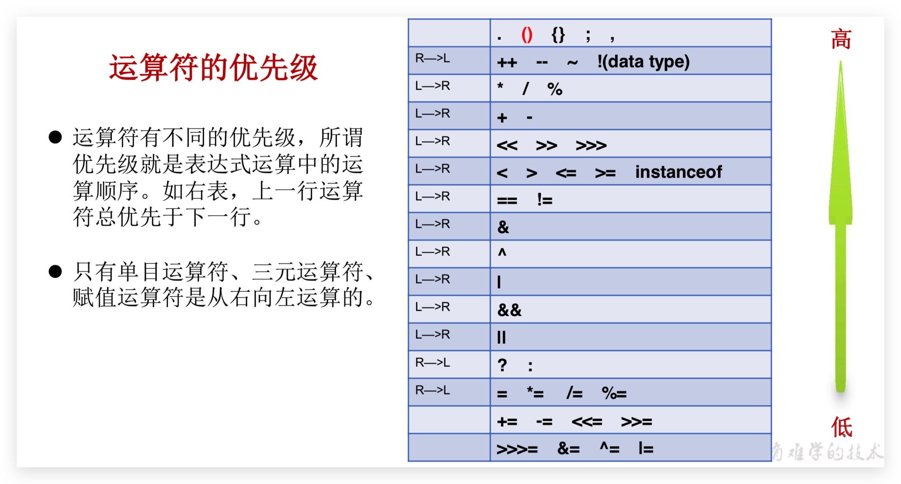
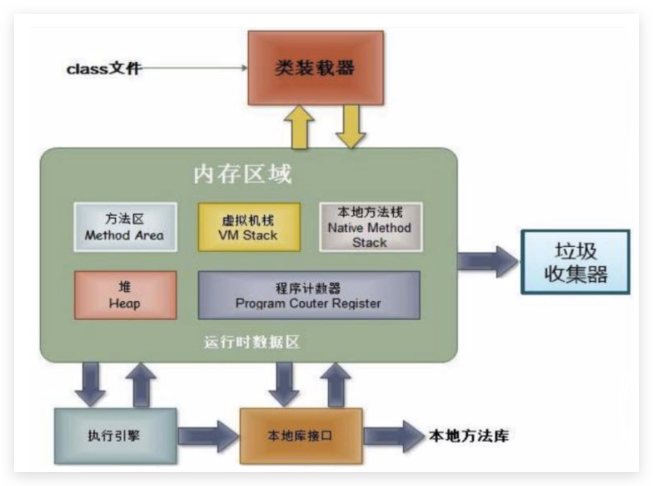
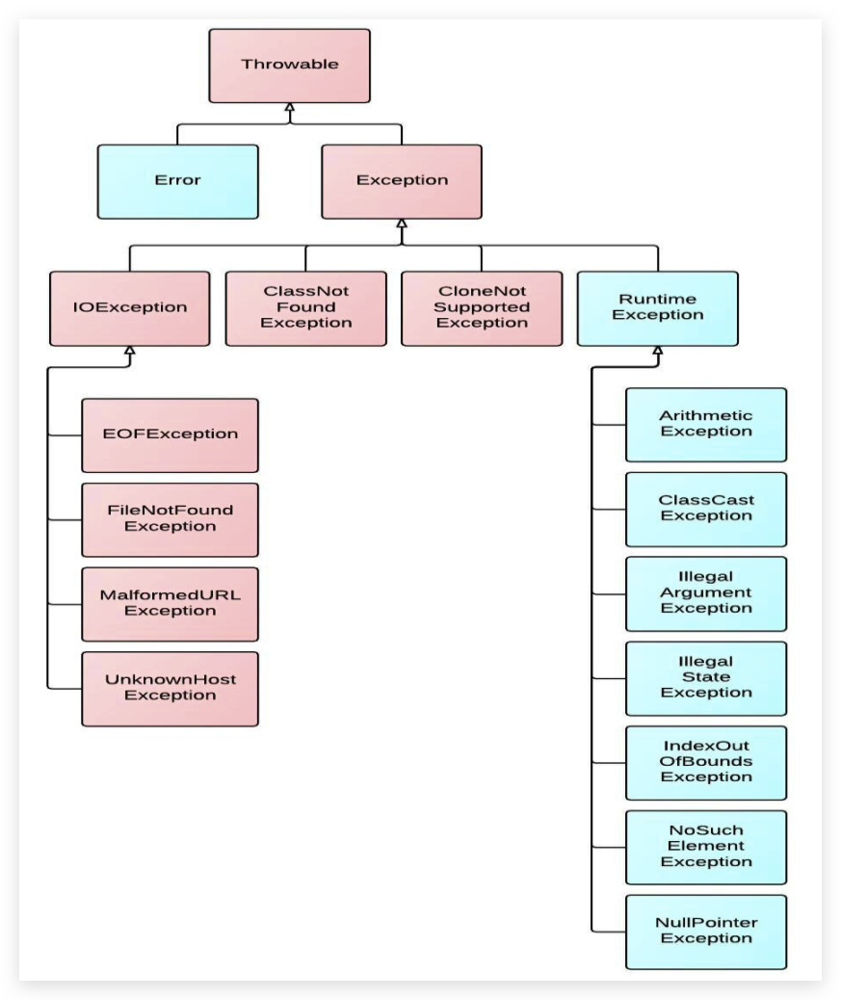
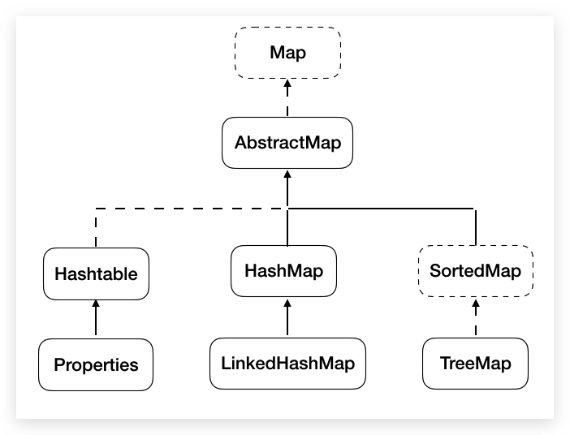
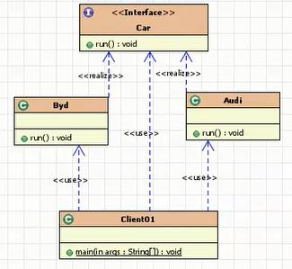

[TOC]

# 0

## 计算机字符编码

### 简介

字符：各种文字和符号的总称，包括各个国家的文字，标点符号，图形符号，数字等。

字符集：字符集是多个符号的集合，每个字符集包含的字符个数不同。

字符编码：字符集只是规定了有哪些字符，而最终决定采用哪些字符，每一个字符用多少字节表示等问题，则是由编码来决定的。计算机要准确的处理各种字符集文字，需要进行字符编码，以便计算机能够识别和存储各种文字。


### 常见字符编码及发展历史

Notepad++中查看，ANSI 在中国大陆即为 GBK（以前是 GB2312），最常用的是 GBK 和 UTF8 无 BOM 编码格式，UCS-2 即为人们常说的 Unicode 编码，又分为大端、小端。所谓 BOM 头(Byte Order Mark)就是文本文件中开始的几个并不表示任何字符的字节，用二
进制编辑器(如 bz.exe)就能看到了。UTF8 的 BOM 头为 0xEF 0xBB 0xBF、Unicode 大端模式为 0xFE 0xFF、Unicode 小端模式为 0xFF 0xFE。

#### ASCII码

上个世纪60年代，美国制定了一套字符编码，对英语字符与二进制位之间的 关系，做了统一规定。这被称为ASCII码。ASCII码一共规定了128个字符的编码，比如 空格“SPACE”是32(二进制00100000)，大写的字母A是65(二进制01000001)。这 128个符号(包括32个不能打印出来的控制符号)，只占用了一个字节的后面7位，最前面的1位统一规定为0。

* 0~31 及 127(共 33 个)是控制字符或通信专用字符(其余为可显示字符)，如控制符:LF(换行)、CR(回车)、FF(换页)、DEL(删除)、BS(退格) 
* 32~126(共 95 个)是字符(32 是空格)，其中 48~57 为 0 到 9 十个阿拉伯数字。
* 65~90 为 26 个大写英文字母，97~122 号为 26 个小写英文字母，其余为一些标点符号、 运算符号等。
* 后 128 个称为扩展 ASCII 码。许多基于 x86 的系统都支持使用扩展(或“高”)ASCII。扩展 ASCII 码允许将每个字符的第8 位用于确定附加的128 个特殊符号字符、外来语字母和图形符号。 

#### OEM 字符集的衍生

当计算机开始发展起来的时候，人们逐渐发现，ASCII 字符集里那可怜的 128 个字符已经不能再满足他们的需求了。人们就在想，一个字节能够表示的数字(编号)有 256 个，而 ASCII 字符只用到了 0x00~0x7F，也就是占用了前 128 个，后面 128 个数字不用白不用，因此很多人打起了后面这 128 个数字的主意。可是问题在于，很多人同时有这样的想法，但是大家对于0x80-0xFF 这后面的 128 个数字分别对应什么样的字符，却有各自的想法。这就导致了当时销往世界各地的机器上出现了大量各式各样的 OEM 字符集。大家对于 0x00~0x7F 这个范围的解释基本是相同的，而对于后半部分 0x80~0xFF 的解释却不一定相同。甚至有时候同样的字符在不同 OEM 字符集中对应的字节也是不同的。不同的 OEM 字符集导致人们无法跨机器交流各种文档。

#### 多字节字符集(MBCS)和中文字符集

上面我们提到的字符集都是基于单字节编码，也就是说，一个字节翻译成一个字符。这对于拉 丁语系国家来说可能没有什么问题，因为他们通过扩展第 8 个比特，就可以得到 256 个字符了， 足够用了。但是对于亚洲国家来说，256 个字符是远远不够用的。因此这些国家的人为了用上电脑，又要保持和 ASCII 字符集的兼容，就发明了多字节编码方式，相应的字符集就称为多字节字符集(Muilti-Bytes Charecter Set)。例如中国使用的就是双字节字符集编码。

例如目前最常用的中文字符集 GB2312，涵盖了所有简体字符以及一部分其他字符;GBK(K 代表扩展的意思)则在 GB2312 的基础上加入了对繁体字符等其他非简体字符。这两个字符集的字符都是使用 1-2 个字节来表示。Windows 系统采用 936 代码页来实现对 GBK 字符集的编解码。在解析字节流的时候，如果遇到字节的最高位是 0 的话，那么就使用 936 代码页中的第 1 张码表进行解码，这就和单字节字符集的编解码方式一致了。如果遇到字节的最高位是 1 的话，那么就表示需要两个字节值才能对应一个字符。

假如你使用 GB2312 写了这么一句话：我叫 ABC。它的二进制编码是这样的：

```
11001110 11010010 10111101 11010000 01000001 01000002 01000003
```

全角是一种电脑字符，且每个全角字符占用两个标准字符(或半角字符)位置。通常的英文字母、数字键、符号键都是半角的，半角的显示内码都是一个字节。为了排列整齐，英文和其它拉丁文的字符和标点也提供了全角格式。在中文输入法中，切换全角和半角格式的快捷键为SHIFT+空格。


#### ANSI 标准、国家标准、ISO 标准

不同 ASCII 衍生字符集的出现，让文档交流变得非常困难，因此各种组织都陆续进行了标准化流程。例如美国 ANSI 组织制定了 ANSI 标准字符编码(注意，我们现在通常说到 ANSI 编码，通常指的是平台的默认编码，例如英文操作系统中是 ISO-8859-1，中文系统是 GBK)，ISO 组织制定的各种 ISO 标准字符编码，还有各国也会制定一些国家标准字符集，例如中国的 GBK，GB2312 和 GB18030。操作系统在发布的时候，通常会往机器里预装这些标准的字符集还有平台专用的字符集，这样只要你的文档是使用标准字符集编写的，通用性就比较高了。


#### Unicode 的出现

虽然通过使用不同字符集，我们可以在一台机器上查阅不同语言的文档，但是我们仍然无法解决一个问题：如果一份文档中含有不同国家的不同语言的字符，那么无法在一份文档中显示所有字符。为了解决这个问题，我们需要一个全人类达成共识的巨大的字符集，这就是 Unicode字符集。Unicode 字符集涵盖了目前人类使用的所有字符，并为每个字符进行统一编号，分配唯一的字符码(Code Point)。Unicode 字符集将所有字符按照使用上的频繁度划分为 17 个层面(Plane)，每个层面上有 216=65536 个字符码空间。其中第 0 个层面 BMP，基本涵盖了当今世界用到的所有字符。其他的层面要么是用来表示一些远古时期的文字，要么是留作扩展。我们平常用到的 Unicode 字符，一般都是位于 BMP 层面上的。目前 Unicode 字符集中尚有大量字符空间未使用。


#### 编码系统的变化

在 Unicode 出现之前，所有的字符集都是和具体编码方案绑定在一起的(即字符集≈编码方式)，都是直接将字符和最终字节流绑定死了，例如 ASCII 编码系统规定使用 7 比特来编码 ASCII 字符集;GB2312 以及 GBK 字符集，限定了使用最多 2 个字节来编码所有字符，并且规定了字节序。这样的编码系统通常用简单的查表，也就是通过代码页就可以直接将字符映射为存储设备上的字节流了。

Unicode 同样也不完美，这里就有三个问题，一个是，我们已经知道，英文字母只用一个字节表示就够了，第二个问题是如何才能区别 Unicode 和 ASCII?计算机怎么知道两个字节表示一个符号，而不是分别表示两个符号呢?第三个，如果和 GBK 等双字节编码方式一样，用最高位是 1 或 0 表示两个字节和一个字节，就少了很多值无法用于表示字符，不够表示所有字符。Unicode 在很长一段时间内无法推广，直到互联网的出现，为解决 Unicode 如何在网络上传输的问题，于是面向传输的众多 UTF(UCS Transfer Format)标准出现了，顾名思义，UTF-8 就是每次 8 个位传输数据，而 UTF-16 就是每次 16 个位。UTF-8 就是在互联网上使用最广的一种Unicode 的实现方式，这是为传输而设计的编码，并使编码无国界，这样就可以显示全世界上所有文化的字符了。

UTF-8 最大的一个特点，就是它是一种变长的编码方式。它可以使用 1~4 个字节表示一个符号。从 unicode 到 uft-8 并不是直接的对应，而是要过一些算法和规则来转换(即 Uncidoe 字符集≠UTF-8 编码方式)。

早期字符编码、字符集和代码页等概念都是表达同一个意思。例如 GB2312 字符集、GB2312编码，936 代码页，实际上说的是同个东西。但是对于 Unicode 则不同，Unicode 字符集只是定义了字符的集合和唯一编号，Unicode 编码，则是对 UTF-8、UCS-2/UTF-16 等具体编码方案的统称而已，并不是具体的编码方案。所以当需要用到字符编码的时候，你可以写 gb2312，codepage936，utf-8，utf-16，但请不要写 Unicode。造成乱码的原因就是因为使用了错误的字符编码去解码字节流，因此当我们在思考任何跟文本显示有关的问题时，请时刻保持清醒:当前使用的字符编码是什么。只有这样，我们才能正确分析和处理乱码问题。


## 进制

### 基础知识

- bit：位，最小的存储单元
- byte：字节，机器语言的单位

### 进制

- binary：二进制，以0b或0B开头
- octal：八进制，以数字0开头
- decimal：十进制
- hex：十六进制，以0x或0X开头

### 二进制

* Java整数常量默认是int类型，当用二进制定义整数时，其第32位是符号位；当是long类型时，二进制默认占64位，第64位是符号位

* 二进制的整数有如下三种形式：

  * 原码：如果一个机器数字长是n位的话，约定最左边一位用作符号位，其余n-1位用于表示数值。
  * 反码：正数的反码等于其原码，而负数的反码则可以通过保留其符号位，将原码的数值位取反得到。
  * 补码：正数和0的补码就是该数字本身。负数的补码则是将其对应正数按位取反再加1。

* **计算机以二进制补码的形式保存所有的整数（给一个二进制若不说明默认就是补码）**

  * 正数的原码、反码、补码都相同
  * **反码和补码的符号位可作为数值位的一部分看待，和数值位一起参与运算**
  * 补码系统的0就只有一个表示方式，在反码系统中，0有二种表示方式，因此在判断数字是否为0时，只要比较一次即可。
  * 二进制数等于0时，符号位可以为0或1(+0/-0)

* 为什么要使用原码、反码、补码表示形式呢？

  计算机辨别“符号位”显然会让计算机的基础电路设计变得十分复杂! 于是人们想出了将符号位也参与运算的方法. 我们知道, 根据运算法则减去一个正数等于加上一个负数, 即: 1-1 = 1 + (-1) = 0 , 所以机器可以只有加法而没有减法, 这样计算机运算的设计就更简单了。

* 8-bit补码系统的整数（Java中整数默认为int，占32位，此处演示时采用byte8位）

  ```matlab
  00000000				0的原码、反码、补码
  01111111				+127的原码、反码、补码
  10000001				-127的补码
  10000000				-128的补码（最小值需根据-127的补码来运算）
  ```

* 以下用4位的补码数字来说明补码系统的数字表示方式

  在表示正数和零时，补码数字和一般二进制一样，唯一的不同是在补码系统中，正数的最高比特恒为0，因此4位的补码正数，最大数字为0111 (7)。

  补码数字的负数，最高比特恒为1，4位补码的数字中，最接近0的负数为1111 (-1)，以此类推，因此绝对值最大的负数是1000(-8)。

  由上可得，4位数的补码取值范围为-8～7

  

### 进制补充（待完成）


# 1 基本语法

## 1.1 introduce

* **命令提示符（其实没啥用👿，还是用类Unix吧👌）**

  | 命令含义         | 命令提示符（cmd）          | Windows PowerShell |
  | ---------------- | -------------------------- | ------------------ |
  | 切换盘符         | c: **或** C:               | 同左               |
  | 进入文件夹       | cd 文件夹名称              | 同左               |
  | 进入多级文件夹   | cd 文件夹1\文件夹2\文件夹3 | 同左               |
  | 返回上一级       | cd ..                      | 同左               |
  | 直接回根路径     | cd \ **或** cd /           | 同左               |
  | 查看当前目录内容 | dir                        | dir **或** ls      |
  | 清屏             | cls                        | cls **或** clear   |
  | 删除文件         | del                        | del **或** rm      |
  | 退出             | exit                       | exit               |

* **JVM**（Java Virtual Machine ） 

  JVM是一个虚拟的计算机，具有指令集并使用不同的存储区域。负责执行指令，管理数据、内存、寄存器。

  **跨平台**：任何软件的运行，都必须要运行在操作系统之上，而我们用Java编写的软件可以运行在任何的操作系 统上，这个特性称为**Java语言的跨平台特性**，该特性是**由JVM实现的**，我们编写的程序运行在JVM上，而**JVM** 运行在操作系上，**JVM不具有跨平台特性**，但是每个操作系统下都有不同版本的JVM。

* **JRE 和 JDK** 

  * JRE(Java Runtime Environment)：是Java程序的运行时环境，包含 **JVM** 和**运行时所需要的核心类库** 。
  * JDK (Java Development Kit)：是Java程序开发工具包，包含 **JRE** 和**开发人员使用的工具**。

* 安装及环境变量配置

  * JAVA_HOME
  * Path

* 编译与运行

  * **编译**：**javac** Test.java
  * **运行**：**java** Test

## 1.2 keyword & reserved word

被Java语言赋予了特殊含义，用做专门用途的字符串(单词)，关键字中**所有字母都为小写（main不是）**，详细可[查看官网文档](https://docs.oracle.com/javase/tutorial/java/nutsandbolts/_keywords.html)

* 用于定义数据类型的关键字

  class、interface、enum、byte、short、int、long、float、double、char、boolean、void

* 用于定义流程控制的关键字

  if、else、switch、case、default、while、do、for、break、continue、return

* 用于定义访问权限修饰符的关键字

  private、protected、public

* 用于定义类、函数、变量修饰符的关键字

  abstract、final、static、synchronized

* 用于定义类与类之间关系的关键字

  extends、implements

* 用于定义建立实例及引用实例，判断实例的关键字

  new、this、super、instanceof

* 用于异常处理的关键字

  try、catch、finally、throw、throws

* 用于包的关键字

  package、import

* 其他修饰符关键字

  native、strictfp、transient、volatile、assert

* （不是关键字，但也当关键字来用）用于定义数据类型值的字面值

  true、false、null

Java保留字：现有Java版本尚未使用，但以后版本可能会作为关键字使用。goto 、const

## 1.3 Identifier

* Java 对各种**变量、方法和类等要素命名时使用的字符序列称为标识符**。凡是自己可以起名字的地方都叫标识符，比如类的名字、方法的名字和变量的名字等
* **命名规则**： 硬性要求
  * 标识符可以包含 英文字母26个(区分大小写) 、 0-9 、 $（美元符号） 和 _（下划线） 
  * 标识符不能以数字开头
  * 标识符不能是关键字或保留字，但能包含
  * 标识符不能包含空格
  * 标识符严格区分大小写
* **命名规范**： 软性建议
  * 包名：多单词组成时所有字母都小写:xxxyyyzzz
  * 类名、接口名：所有单词的首字母大写（大驼峰式）。 
  * 方法名、变量名： 首字母小写，后面每个单词首字母大写（小驼峰式）。 
  * 常量名：所有字母都大写。多单词时每个单词用下划线连接:XXX_YYY_ZZZ


## 1.4 constant

- **整数**常量、**浮点数**常量、**字符**常量、**字符串**常量、**布尔**常量、**空**常量

## 1.5 variable

- 变量是**内存中的一个存储区域**，该区域的数据可以在同一类型范围内不断变化，变量是程序中最基本的存储单元。

- 格式： 数据类型 变量名 = 数据值;

- **注意**：

  - Java中每个变量必须**先声明，后使用，不赋值不能使用**
  - 在同一个大括号范围内（**作用域内**），变量的名字不可以相同
  - 对于**byte或者short**类型变量，注意其**取值范围**
  - 对于float或者long类型变量，**后缀F、L**不能丢

  

## 1.6 data type & 包装类

### data type

> **byte**是计算机中基本存储单元，bit是计算机中最小的存储单位。

* **基本数据类型**：数值型（整数型、浮点型）、字符型、布尔型

  | 数据类型     | 关键字                            | 内存占用 | 取值范围                       |
  | ------------ | --------------------------------- | -------- | ------------------------------ |
  | 整数类型     | byte                              | 1个字节  | -128~127                       |
  | 整数类型     | short                             | 2个字节  | -2^15~2^15-1 = -32768~32767    |
  | 整数类型     | int（默认）                       | 4个字节  | -2^31~2^31^-1（约21亿）        |
  | 整数类型     | long                              | 8个字节  | -2^63~2^63^-1                  |
  | 单精度浮点数 | float（尾数可以精确到7位有效数字） | 4个字节  | -3.403E38~3.403E38             |
  | 双精度浮点数 | double（默认，精度是float的两倍） | 8个字节  | -1.798E308~1.798E308           |
  | 字符型       | char                              | 2个字节  | 2^16 = 0~65535                 |
  | 布尔类型     | boolean                           | 1个字节  | 只有true、false，不能用0等替代 |

  正无穷大、负无穷大、NaN（不是一个数字）都是表示溢出和出错情况的三个特殊浮点型数值
  
* **引用数据类型**

  * 类（包含字符串String）
  * 接口
  * 数组
  * Lambda（也属于类？）


* **整数类型**

  * **Java各整数类型有固定的表数范围和字段长度**，不受具体OS的影响，以保 证Java程序的可移植性。
  * 默认为 int 型，声明long型常量须后加‘l’或‘L’。通常声明为int型，除非不足以表示较大的数，才使用long。

* **浮点类型**

  * 与整数类型类似，**Java 浮点类型也有固定的表数范围和字段长度**，不受具体操作系统的影响。
  * **浮点类型**可能只是一个**近似值**，并非精确的数值。
  * 默认为double型，声明float型常量，须后加‘f’或‘F’。
  * 浮点型常量有两种表示形式
    * 十进制数形式：如5.12、512.0f、.512 （必须有小数点）
    * 科学计数法形式：如5.12e2、512E2、100E-2
  * float尾数可以精确到7位有效数字（精度很难满足需求），double精度是float的两倍，通常采用double。

* **字符型**

  * char 型数据用来表示通常意义上“字符”（2字节），**Java中的所有字符用来存储Unicode编码，读取到JVM中时会将字符编码转为UTF-16来存储，占两个字节**，可以存储大部分非生僻字（UTF-8位不定长，3个字节存储中文汉字。）。故一个字符可以存储一个字母，一个汉字，或其他书面语的一个字符。

  * 字符型变量的三种表现形式：

    * 字符常量是用单引号(‘ ’)括起来的**单个字符**。例如:char c1 = 'a'; char c2 = '中'; char c3 = '9';

    * Java中还允许使用**转义字符**‘\’来将其后的字符转变为特殊字符型常量。 

      例如`\n`换行符，`\'`单引，`\\`反斜杠，`\b`退格，`\r`回车、`\n`换行

    * 直接使用 **Unicode 值**来表示字符型常量:‘\uXXXX’。其中，XXXX代表 一个十六进制整数。如:\u000a 表示 \n。

  * char类型是可以进行**运算**的。因为它都对应有Unicode码。

  * 字符对应ASCII码（0~127）：48—'0'、65—'A'、97—'a'

* **布尔类型**

  * boolean类型数据只允许取值true和false，无null。

    不可以使用0或非 0 的整数替代false和true，这点和C语言不同。

  * **boolean 在《Java虚拟机规范》给出了4个字节（编译后用int替代），和boolean数组1个字节的定义（当byte数组处理）**

* 注意事项

  * **数据范围与字节数不一定相关**，如**float数据范围比long更加广泛**，但是float是4字节，long是8字节。


* **数据类型转换**

  有多种类型的数据混合运算时，系统首先自动将所有数据转换成容量最大的那种数据类型，然后再进行计算。**byte、char、short之间不会相互转换，他们三者在计算时首先转换为int类型。**

  **参与运算的有byte、char、short**——>**int**——>**long**——>**float**——>**double**（boolean不参与）

  当把任何基本数据类型的值和String进行连接运算时(+)，基本数据类型的值将自动转化为String类型。
  
  * **自动类型转换/提升**（隐式），范围**小**的类型向范围**大**的**类型提升**，如下：
  
    **编译器的常量优化**
  
    对于 byte、char、short 三种类型来说，若右侧赋值的**数值(不能为变量)**没有超过范围，那么javac编译器会自动隐含得帮我们**补上(byte) (short) (char)** ，否则编译报错。
  
    在给变量进行赋值时，若右侧的**表达式都是常量**，没有任何变量，那么javac编译器将会直接将若干个常量表达式计算得到结果。并根据是否超过范围决定编译成功与否。
  
    ```java
    byte a = 3;
    byte b = 4;
    byte c = a + b;//运算期间byte类型变量自动提升为int，但int类型不能赋值给byte类型，因此编译失败。
    byte d = 3 + 4;//常量在编译的时候（javac），已经确定了 3+4 的结果并没有超过byte类型的取值范围，可以赋值给d，成功
    
    char ch = 'A';
    System.out.println(ch + 1);//66
    char ch = '';//编译失败
    
    long a = 12345;//自动类型提升
    long b = 12313131312312313;//编译报错，过大的整数，转int失败
    
    float a = 12.3;//编译失败，double转float失败
    
    System.out .println(3+4+“Hello!”); //输出:7Hello!
    System.out.println(“Hello!”+3+4); //输出:Hello!34
    System.out.println(‘a’+1+“Hello!”); //输出:98Hello!
    System.out.println(“Hello”+‘a’+1); //输出:Helloa1，连接运算，不做数值运算！！若是俩char则做数值运算！！
    boolean b = true；
    System.out.println("Hello" + b);//输出：Hellotrue
    ```
  
  * **强制类型转换**（显式），是自动类型转换的**逆过程**，将容量大的数据类型转换为容量小的数据类型。
  
    一般不推荐使用，有可能发生**精度损失**（浮点转成整数，直接**丢掉小数**）
    
    ```java
    double a = 3.5;
  byte b = (byte)a;//3
    
    int a = 128;
    byte b = (byte)a;//-128
    //此处涉及进制转换
    //128的补码为（采用8位演示）：1000 0000
    //强转位byte：1就变为符号位了，代表-128
    ```
    
    **在使用+=、-=、*=、/=、%=运算符进行赋值时，强制类型转换会自动完成，不会改变原有数据类型；++、--也一样。**
    
  * 通常，字符串不能直接转换为基本类型，但通过基本类型对应的包装类则可以实现把字符串转换成基本类型。


### <span name="baozhuanglei">包装类（java.lang）</span>

-   针对八种基本数据类型定义相应的引用类型—包装类(封装类)，可以让让基本类型的数据**进行更多的操作**，此时Java才是真正的面向对象。如下其中6种数字类型都继承父类Number。

    | 基本数据类型 | 引用数据类型  |
    | :----------: | :-----------: |
    |     byte     |     Byte      |
    |    short     |     Short     |
    |     int      |  **Integer**  |
    |     long     |     Long      |
    |    float     |     Float     |
    |    double    |    Double     |
    |     char     | **Character** |
    |   boolean    |    Boolean    |

-   **装箱与拆箱**

    -   装箱：将基本数据类型的值转为引用数据类型，提供如下静态方法，其他包装类同理。

        -   `Integer.valueOf(int num/String str)`，字符串必须是基本类型字符串，否则`NumberFormatException`

        -   ~~利用其构造器，可传入基本类型、String。在JDK9时过时~~

            其中Boolean在传入字符串时底层方法为`return "true".equalsIgnoreCase(s)`

    -   拆箱：将引用数据类型的值转为基本数据类型，提供如下成员方法，其他包装类同理。

        -   `intValue()`该方法将Integer对象转为int

-   **自动拆装箱**：**JDK 5.0后支持**基本类型数据和包装类型数据之间可以自动互相转换

-   **基本类型与字符串转换**

    -   基本类型—>字符串：
        -   **`基本类型的值+""`**：最简单方法，常用
        -   **String类的静态方法`valueOf(参数)`**
        -   **包装类的静态方法`toString(参数)`**方法，不是Object类的`toString()`方法，重载
    -   字符串—>基本类型：
        -   **包装类的静态方法`parseXxx()`**
        -   **包装类的静态方法`valueOf(参数)`，转包装类后再转基本类型**

-   **进制转换**

    -   `static String toString(int num,int radix)`               十进制到其他进制`toString`
    -   `static int parseInt(String s,int radix)`                   其他进制到十进制`parseInt`

-   **基本类型的包装类（除浮点数）都有其缓存，Boolean为true、false，Character为0~127，其他为-128~127（其有内部类）**

-   **注意：**

    1.  包装类都重写Object类中的`toString()` 方法，以**字符串**形式返回包装类的基本数据类型的值
    2.  除了Character外，包装类都有`valueOf(String s)`方法，根据String类型参数创建包装类对象
    3.  除了Character外，包装类都有`parseXXX(String s)`的静态方法，将字符串转为基本类型数据


## 1.7 运算符

* **算术运算符**：`+`、`-`、`*`、`/`、`%`、`++`、`--`、`+`（连接）

  * 对于除号`/`，它的整数除和小数除是有区别的。**整数之间做除法时，只保留整数部分而舍弃小数部分**。

    例如：int x=3510;x=x/1000*1000，最终x值为300

  * `++`、`--`：混合运算时比较麻烦，在单独使用时没有区别，只有**变量**才能使用，常量不能使用。**不改变原类型**。

    * 变量前：先算后用

    * 变量后：先用后算

      实际上，不管是前置 ++，还是后置 ++，都是先将变量的值加 1，然后才继续计算的。二者之间真正的区别是：

      * 前置 ++ 是将变量的值加 1 后，使用增值后的变量进行运算的
      * 后置 ++ 是首先将变量赋值给一个临时变量，接下来对原有变量的值加 1，然后使用那个临时变量进行运算。
      * 都不是原子操作

    ```java
    int n = 10;
    n += (n++) + (++n);//32
    ```

  * `+`在字符串中的操作： 连接、拼接字符串

    ```java
    int a = 10;
    int b = 20;
    String str = "hello";
    System.out.println(a + b + str);//30hello
    System.out.println(str+a+b);//hello1020
    ```

  * **取余和取模**（C、C++、java、JavaScript中%是取余，Python中%是取模），只对于整数有意义

    区别在于第一步的商**趋于0(取余)**、**趋于负无穷(取模)**，**取余和取模同符号数结果相同**

    ```java
    取余(结果符号取决于被除数)				取模(结果符号取决于模数)
    5%3=2；					 			5%3=2；
    -5%-3=-2;							 -5%-3=-2；
    5%-3=2;								 5%-3=-1；
    -5%3=-2;							 -5%3=1；
    ```

* **赋值运算符（支持连续赋值）**

  * 基本赋值运算符：`=`

  * 复合赋值运算符：`+=`、`-=`、`*=`、`/=`、`%=`

    **在使用+=、-=、*=、/=、%=复合运算符进行赋值时，强制类型转换会自动完成，不会改变本身的数据类型**

* **比较运算符**：`==`、`!=`、`<`、`>`、`<=`、`>=`、`"Hello" instanceof String`，结果是布尔值，不能连写

* **逻辑运算符**：是用来连接两个布尔类型结果的运算符，结果是布尔值，可以连写
  
  * `!`：逻辑非，取反
  * `^`：逻辑异或
  * `&&`：短路与，符号左边是false，右边不再运算；若是`&`需运算完
  * `||`：短路或，符号左边是true，右边不再运算；若是`|`需运算完
  
* **三元运算符**
  
  * 数据类型 变量名 = 布尔类型表达式？结果1：结果2;
    * 必须同时保证结果1和结果2符合左侧数据类型要求（可以统一为一个类型）
    * 三元运算符的结果必须被使用。赋值或打印
  
* **位运算符**：不改变原变量数值。**对都是整数的二进制补码**进行的运算！如下解释以及画图时也应用补码来解释！

  * `<<`左移，被移除的高位丢弃，低位空缺位补0。当顶替掉符号位时数值正负改变。

  * `>>`右移，被移位的二进制最高位是0，右移后所有空缺位补0；最高位是1，所有空缺位补1。

  * `>>>`无符号右移，被移位二进制最高位无论是0或者是1，空缺位都用0补。
  
  * `&`：与运算，如`6 & 3 = 2`
  
  * `|`：或运算，如`6 | 3 =7`
  
  * `^`：异或运算，如`6 ^3 = 5`，**一个数异或同一个数2次，则还是这个数**
  
  * `~`：取反运算，如`~ 6 = -7`，正数取反，各二进制码按**补码**各位取反；负数取反，各二进制码按**补码**各位取反
  
    ```matlab
    00000000 00000000 00000000 00000110				6的原码、补码
    11111111 11111111 11111111 11111001				取反（符号位也要取反）后的补码
    10000000 00000000 00000000 00000111				利用补码求原码（-1，取反），结果为-7
    ```
  
    ```java
    int i = 21;//....10101，数值位有5个
    int i = -21;
    System.out.println("i << 2 :" + (i << 2));//84，-84
    System.out.println("i << 3 :" + (i << 3));//168，-168
    System.out.println("i << 27 :" + (i << 27));//-1476395008，1476395008
    
    
    int i = 21;//....10101，数值位有5个
    int i = -21;
    System.out.println("i >> 2 :" + (i >> 2));//5，-6
    System.out.println("i >> 3 :" + (i >> 3));//2，-3
    System.out.println("i >> 5 :" + (i >> 5));//0，-1 ，负数右移最小为-1
    
    int i = 21;//....10101，数值位有5个
    int i = -21;
    System.out.println("i >> 2 :" + (i >>> 2));//5，1073741818
    System.out.println("i >> 3 :" + (i >>> 3));//2，536870909
    System.out.println("i >> 5 :" + (i >>> 5));//0，134217727
    // 由此可得，无符号右移对于负数来说无意义
    ```
    
    
  
  交换两值
  
  ```java
  // 最通用
  int temp = num1;
  num1 = num2;
  num2 = temp;
  
  //1.只能用于数值类型；2.可能相加超出范围
  num1 = num1 + num2;
  num2 = num1 - num2;
  num1 = num1 - num2;
  
  //只能用于数值类型
  num1 = num1 ^ num2;
  num2 = num1 ^ num2;
  num1 = num1 ^ num2;
  ```
  
  程序输出
  
  ```java
  boolean x = true;
  boolean y = false;
  short z = 40;
  if ((z++ == 40) && (y = true)) {
    z++;
  }
  if ((x = false) || (++z == 43)) {
    z++;
  }
  System.out.println("z = " + z);// 44
  ```
  
  
  
  
  
  
  
  


## 1.8 流程控制

* **顺序结构**

* **判断语句**

  * If
  * if...else...
  * if...else if...else...
    * if else 和 三元运算符互换：取两数最大值

* **选择语句**

  * switch语句中**表达式数据类型可以是：byte、char、short、int；Enum（枚举）、String(JDK7及之后)**

    ```java
    switch (表达式) {
      case 常量值1:
        语句1；
        break;
      case 常量值2:
        语句2；
        break;
        ......
      default:
        默认语句
        break;//default的break可省略不写，但不建议
    }
    ```

  * case的**穿透性**

    在switch语句中，如果case的后面**不写break**，将出现穿透现象，也就是**不会再判断下一个case**的值，直接向后运行，直到**遇到break**，或者**整体switch结束**。

  * **case后面的值为不可重复的常量，否则编译失败**

  * switch语句格式可以很灵活，**前后顺序可以颠倒**，**break语句也可以省略（例如，季节）**

  * default位置可以很灵活，但推荐放最后！

  * JDK 1.5 中可以在 switch **表达式中使用Enum定义的枚举类的对象**作为表达式, **case 子句可以直接使用枚举值的名字，无需添加枚举类作为限定**

* **循环语句**

  * for：（三角形图形，上右，下左）

    ```java
    for(初始化表达式; 布尔表达式; 步进表达式){
        循环体; 
    }
    ```

    ```java
    int num = 1;
    for(System.out.print('a');num <= 3;System.out.print('c'),num++){
      System.out.print('b');
    }
    //输出结果：abcbcbc
    System.out.println(num);//4
    ```

  * while

    ```java
    初始化表达式;
    while(布尔表达式){
        循环体; 
        步进表达式;
    }
    ```

  * do...while

    ```java
    初始化表达式;     
    do {
    	循环体;
    	步进表达式;
    } while(布尔表达式);
    ```

  * **for 和 while 的区别**

    * 控制条件语句所控制的那个**变量**，在for循环结束后，就不能再被访问到了，而while循环结束还可以继续使用，如果你想**继续使用，就用while**，**否则推荐使用for**。原因是for循环结束，该变量就从内存中消失，能够提高内存的使用效率。 
    * 在**已知循环次数**的时候使用推荐使用**for**，**循环次数未知**的时推荐使用**while**。
    * do while 绝对会执行一次。

* **跳出语句**

  * **break**：**终止switch**或者**当前最近的一层循环**，用在if中没用。

  * **continue**：**结束本次最近的一层循环**，**继续下一次**的循环

  * 可以用label（任意名称）来指定指明要终止的是哪一层语句块，否则只终止一层，标号语句必须紧接在循环的头部。

    ```java
    lable: for(;;)
      ...
      break/continue lable;
    ```

    这两个语句后面不能声明其他语句，因为永远执行不了，编译报错！

* 扩展知识点

  * 死循环：循环中的条件永远为true，死循环的是永不结束的循环。（**死循环后语句执行不到，编译失败**）
  
    `while(true)`、`for(;;)`
  
  * 嵌套循环：一个循环的循环体是另一个循环


## 1.9 Array & Arrays

### Array

- **容器**：将多个数据存储到一起，每个数据称为该容器的元素

- **数组（Array）**： 是多个相同类型数据按一定顺序排列的集合，并使用一个名字命名，并通过编号的方式 对这些数据进行统一管理。存储数据**长度固定**的容器，多个数据的**数据类型要一致（存在自动类型转换）**。是**引用数据类型**， 创建数组对象会在内存中开辟**一整块连续的空间**，而数组名中引用的是这块连续空间的**首地址**。它的元素相当于类的成员变量，因此数组一经分配空间，其中的每个元素也被按照成员变量同样的方式被隐式初始化。

- 注意：数组**对象**有**定长**特性，**长度一旦指定，不可更改（因为内存连续）**。**不要把变量名看成数组**

  ```java
  int[] arr1 = new int[3];
  System.out.println(arr1.length);//3
  arr1 = new int[5];
  System.out.println(arr1.length);//5
  ```

- **初始化**：

  - 动态初始化：数组声明且为数组元素分配空间与赋值的操作分开进行（**必须指定长度，二维数组可以只指定第一个**）

    - 元素**默认值**：整型—`0`；浮点—`0.0`；布尔—`false`；引用类型—`null`；

      char—`‘\u0000’`（或`0`），是一个不可打印字符，非`'0'`；

    ```java
    // 先分配空间
    int[] arr = new int[3];
    
    int[][] arr = new int[m][];// 每个一维数组都是默认初始化值null 
    int[][] arr = new int[m][n];// 一维数组的名称分别为arr[0], arr[1], arr[2]...
    
    // 后续赋值
    ```

  - 静态初始化：在定义数组的同时就为数组元素分配空间并赋值

    - 有元素默认值，但是之后又把大括号内容赋值给数组了

    ```java
    // 分配空间并赋值
    int[] arr = new int[]{1,2,3};
    int[] arr = {1,2,3};//上述的简化版
    
    int[][] arr = new int[][]{{...},{...}};
    int[][] arr = {{...},{...}};
    ```

- **【注意】字符串有length()方法，数组有length属性**；Java中多维数组不必都是规则矩阵形式

- 数组内存图

  

- 数组中涉及的常见算法

  - 数组元素的赋值(杨辉三角、回形数等)
  - 求数值型数组中元素的最大值、最小值、平均数、总和等
  - 数组的复制、反转、查找(线性查找、二分法查找)
  - 数组元素的排序算法
  - 详见doc
  
- 数组中常见异常：

  - ArrayIndexOutOfBoundsException：索引范围从0～length-1，小或大都不行。（Python中可以）
  - NullPointerExcption


### java.util.Arrays

Arrays工具类是针对**数组进行操作**的工具类，包括排序和查找等大量**静态方法**，常用方法如下：

-   `boolean equals(int[] a,int[] b)`**判断两个数组是否相等**，比较的是内容，顺序也得一致

-   `toString(int[] arr)`将**数组转为字符串**，如[1, 2, 3]

-   `void fill(int[] a,int val)`将指定值填充到数组之中，全部替换为val！

-   `sort(int[] arr,[ T[] a, Comparator<? super T> c ])`    给数组**排序**，无返回值

    -   若是数值，默认按升序
    -   若是字符串，默认按字母升序，先大写后小写，和ASCII表一致
    -   若是**自定义类型**，这个自定义类型需要**`Comparable`或`Comparator`接口的支持**

-   `binarySearch(int[] arr,int key)`**二分查找**，需先排序

-   `asList(int/String等[] arr)`**数组转集合**，**长度不能变！！！**转换的为Arrays中内部类ArrayList！

    需要使用`List<Object> objectList = ArrayList<Object>(Arrays.asList(数组))；`注意：

    ```java
    List arr1 = Arrays.asList(123, 456);
    System.out.println(arr1.size());//2
    
    List arr1 = Arrays.asList(new int[]{123, 456});
    System.out.println(arr1.size());//1
    
    List arr2 = Arrays.asList(new Integer[]{123, 456});
    System.out.println(arr2.size());//2
    ```

    

-   `copyOf(int/String等[] original, int from, int to)`  **数组拷贝**，底层调用`System.arraycopy()`


## 1.10 main方法

* main()方法作为程序的入口
* main()方法也是一个普通的静态方法
* main()方法可以作为我们与控制台交互的方式。加不加引号都可以（之前：使用Scanner）


## 1.9  JShell脚本工具 

- JShell**脚本**工具是JDK9的新特性。当我们编写的代码非常少的时候，而又不愿意编写类，main方法，也不愿意去编译和运行，这个时候可以使用JShell工具，**一步一步运行代码**。
- 命令行直接输入`JShell`命令，退出`/exit`


## 习题

### 画图

```java
//*
//**
//***
//****
//*****

for (int i = 0; i < 5; i++) {
  for (int j = 0; j <= i; j++) {
    System.out.print("*");
  }
  System.out.println();
}
```

```java
//*****
//****
//***
//**
//*

for (int i = 0; i < 4; i++) {
  for (int j = 0; j < 4-i; j++) {
    System.out.print("*");
  }
  System.out.println();
}
```

```java
//*
//**
//***
//****
//*****
//****
//***
//**
//*

for (int i = 0; i < 5; i++) {
  for (int j = 0; j <=i ; j++) {
    System.out.print("*");
  }
  System.out.println();
}
for (int i = 0; i < 4; i++) {

  for (int k = 0; k < 4-i; k++) {
    System.out.print("*");
  }
  System.out.println();
}
```


### 对角线画圈

```java
//O***O
//*O*O*
//**O**
//*O*O*
//O***O

public static void printPic(int num){
    for (int i = 0; i < num; i++) {
        for (int j = 0; j < num; j++) {
            if(j==i||j==num-1-i){
                System.out.print("O");
            } else {
                System.out.print("*");
            }
        }
        System.out.println();
    }
}
```

### 九九乘法表

```java
public static void multiplicationTable(int num) {
  for (int i = 1; i <= num; i++) {
    for (int j = 1; j <= i; j++) {
      System.out.print(j+"*"+i+"="+j*i+"\t");
    }
    System.out.println();
  }
}
```

### 100以内的所有质数

从2开始，到这个数减1（优化为到`Math.sqrt()`），**都**不能被这个数整除。当有一个能被整除，跳出！


```java
public static void primeNumber(int num) {
  long startTime = System.currentTimeMillis();
  
  // 穷举num以内的质数（包括num）
  for (int i = 2; i <= num; i++) {
    boolean flag = true;
    // 从2到这个数减1
    // for (int j = 2; j < i; j++) {
    // 优化：对本身是质数的优化效果提升特别大
    for (int j = 2; j <= Math.sqrt(i); j++) {
      if (i % j == 0) {
        flag = false;
        break;// 优化：一旦被除尽，则跳出。对非质数有优化效果。
      }
    }
    if (flag) {
      System.out.println(i);
    }
  }
  
  long endTime = System.currentTimeMillis();
  System.out.println(endTime - startTime);
}
```

```java
public static void primeNumber(int num) {
  long startTime = System.currentTimeMillis();

  // 穷举num以内的质数（包括num）
  lable:for (int i = 2; i <= num; i++) {
    // 优化：对本身是质数的优化效果提升特别大
    for (int j = 2; j <= Math.sqrt(i); j++) {
      if (i % j == 0) {
        continue lable;// 优化：一旦被除尽，则继续下一个。对非质数有优化效果。
      }
    }
    System.out.println(i);
  }

  long endTime = System.currentTimeMillis();
  System.out.println(endTime - startTime);
}
```


### 最小公倍数和最大公约数

```java
//获取最大公约数
//1.获取两个数中的较小值
int min = (m <= n)? m : n;
//2.遍历
for(int i = min;i >= 1 ;i--){
  if(m % i == 0 && n % i == 0){
    System.out.println("最大公约数为：" + i);
    break;
  }
}

//获取最小公倍数
//1.获取两个数中的较大值
int max = (m >= n)? m : n;
//2.遍历
for(int i = max;i <= m * n;i++){
  if(i % m == 0 && i % n == 0){
    System.out.println("最小公倍数：" + i);
    break;
  }
}
```

### 水仙花数

输出所有的水仙花数，所谓水仙花数是指一个3位数，其各个位上数 字立方和等于其本身。`153 = 1*1*1 + 3*3*3 + 5*5*5`

```java
for (int i = 100; i < 1000; i++) {
  int bai = i/100%10; //%10可省略
  int shi = i/10%10;
  int ge = i/1%10;
  if(i==bai*bai*bai+shi*shi*shi+ge*ge*ge){
    System.out.println(i);
  }
}
```


### 完数

一个数恰好等于他的因子（除去这个数本身的其他约数）之和，这个数为完数，如：6=1+2+3。找出1000以内所有完数！

```java
public static void wanshu(int num){
  //int factor = 0;
  for(int i = 1;i <= num;i++){
    int factor = 0;
    for(int j = 1;j <= i/2;j++){
      if(i % j == 0){
        factor += j;
      }
    }

    if(i == factor){
      System.out.println(i);
    }
    //重置factor
    //factor = 0;
  }
}
```


### 实现四舍五入

定义round方法，接收一位小数，实现四舍五入运算，并返回结果（+0.5，强转int）

```java
public static int round(double d){
    return (int) (d+0.5);
}
```


### 统计字符次数

统计字符出现次数。利用容量为26的数组保存字符出现次数

```java
public static void showTimes(char[] chs){
    int[] count = new int[26];
    for (int i = 0; i < chs.length; i++) {
        count[chs[i] - 97]++;
    }
    for (int i=0,ch=97 ;i<count.length;i++,ch++){
        if(count[i]!=0){
            System.out.println("符号"+(char)ch+"出现的次数:"+count[i]);
        }
    }
}
```


### int[] x,y[]

以下选项允许通过编译的是：

* `x[0]=y;` no
* `y[0] = x;` yes
* `y[0][0] = x;` no
* ` x[0][0] = y;` no
* `y[0][0] = x[0];` yes
* `x = y;` no，类型需匹配！


### *随机不重复数组

创建一个长度为6的int型数组，要求数组元素的值都在1-30之间，且是随机赋值。同时，要求 元素的值各不相同。

doc


### *打印char数组的题

```java
int[] arr1 = {1,2,3};
System.out.println(arr1);// [I@2f7c7260

char[] arr2 = {'a','b','c'};
System.out.println(arr2);// abc
```


### *数组除首位

定义一个int型的数组:int[] arr = new int[]{12,3,3,34,56,77,432};让数组的每个位置上的值去除以首位置的元素，得到的结果，作为该位置上的 新值。遍历新的数组。

```java
// 错误写法
for(int i= 0;i < arr.length;i++){
  arr[i] = arr[i] / arr[0]; 
}

// 正确写法1，从后到前
for(int i = arr.length – 1;i >= 0;i--){
  arr[i] = arr[i] / arr[0]; 
}

//正确写法2，不如写法1
int temp = arr[0];
for(int i= 0;i < arr.length;i++){
  arr[i] = arr[i] / temp; 
}
```


### *数组元素的赋值

#### *杨辉三角

* 第一行有 1 个元素, 第 n 行有 n 个元素

* 每一行的第一个元素和最后一个元素都是 1

* 从第三行开始, 对于非第一个元素和最后一个元素的元素。

  `yanghui[i][j] = yanghui[i-1][j-1] + yanghui[i-1][j];`
  
  ```java
  //1.声明并初始化二维数组
  int[][] yangHui = new int[10][];
  
  //2.给数组的元素赋值
  for(int i = 0;i < yangHui.length;i++){
    yangHui[i] = new int[i + 1];
  
    //2.1 给首末元素赋值
    yangHui[i][0] = yangHui[i][i] = 1;
    //2.2 给每行的非首末元素赋值
    //if(i > 1){
    for(int j = 1;j < yangHui[i].length - 1;j++){
      yangHui[i][j] = yangHui[i-1][j-1] + yangHui[i-1][j];
    }
    //}
  }
  ```

#### *回形数

doc


### *数组的复制、反转、查找

#### 数组复制

需new新的

#### 数组反转

```java
public static void reverseArray(int[] arr){
    for (int i = 0; i < arr.length/2; i++) {
        int temp = arr[i];
        arr[i] = arr[arr.length-1-i];
        arr[arr.length-1-i]= temp;
    }
}
//或
public static void reverseArray(int[] arr){
    for (int min=0,max=arr.length-1;min<max;min++,max--) {
        int temp = arr[min];
        arr[min] = arr[max];
        arr[max]= temp;
    }
}
```


#### 二分查找

```java
//前提：所要查找的数组必须有序。
int[] arr = new int[]{-98,-34,2,34,54,66,79,105,210,333};

int dest = -34;
int head = 0;//初始的首索引
int end = arr.length - 1;//初始的末索引
boolean find = false;
while(head <= end){

  int middle = (head + end)/2;

  if(dest == arr[middle]){
    System.out.println("找到了指定的元素，位置为：" + middle);
    find = true;
    break;
  }else if(arr[middle] > dest){
    end = middle - 1;
  }else{//arr2[middle] < dest1
    head = middle + 1;
  }
}

if(find){
  System.out.println("很遗憾，没有找到的啦！");
}
```


### *数组的排序

ppt总结常考的

#### 选择排序

找剩余数组元素中最小的，放在首位

```java
public static void selectSort(int[] arr) {
    for (int i = 0; i < arr.length - 1; i++) {
        for (int j = i + 1; j < arr.length; j++) {
            if (arr[i] > arr[j]) {
                int temp = arr[i];
                arr[i] = arr[j];
                arr[j] = temp;
...
```

#### *冒泡排序

相邻中最大的。。。

```java
public static void bubbleSort(int[] arr){
    for (int i = 0; i < arr.length-1; i++) {
        for(int j=0;j<arr.length-1-i;j++){
            if (arr[j]>arr[j+1]){
                int temp = arr[j];
                arr[j] = arr[j+1];
                arr[j+1] = temp;
...
```


#### *快速排序


# 2 面向对象OOP

* 面向过程(POP) 与 面向对象(OOP)：
  * 面向过程，强调的 是功能行为，以函数为最小单位，考虑怎么做。
  * 面向对象（相对于面向过程而言）将功能封装进对象，强调具备了功能的对象，以类/对象为最小单位，考虑谁来做。

  面向对象程序设计的重点是类的设计，类的设计其实就是类的成员的设计


## 2.1 Java 内存解析

 

- 堆（Heap），此内存区域的唯一目的就是存放**对象实例**，几乎所有的对象 实例都在这里分配内存。这一点在Java虚拟机规范中的描述是：所有的**对象实例以及数组都要在堆上分配**。

- 方法区（Method Area），用于存储已被虚拟机加载的类信息、常量、静态变量、即时编译器编译后的代码等数据。

  

- 栈（Stack），是指虚拟机栈。虚拟机栈用于存储**局部变量**等。 局部变量表存放了编译期可知长度的各种基本数据类型(boolean、byte、char 、 short 、 int 、 float 、 long 、double)、对象引用(reference类型， 它不等同于对象本身，是对象在堆内 存的首地址)。 **方法执行完，自动释放**。

- 本地方法栈（Native Method Stack）：这部分主要与虚拟机用到的 Native 方法相关

- PC寄存器（Program Counter Register）：也叫程序计数器。JVM支持多个线程同时运行，每个线程都有自己的程序计数器。


## 2.2 类及其成员

类及其成员包括：成员变量、成员方法、构造器、代码块、内部类

* 面向对象的两个要素：
  * 类：是对**一类事物的描述，是抽象的、概念上**的定义。是一组相关**属性**和**行为**的集合。
    * **属性 = 成员变量 = Field（域/字段）**：就是该事物的**状态信息**
    * **行为 = 成员方法 = 函数 = Method**：就是该事物**能够做什么**
  * 对象：是**实际存在的该类事物的每个个体**，因而也称为实例(instance)。

* **类的定义格式**

  ```java
  public class ClassName {
      //成员变量，对应事物的属性，描述事物的状态信息
      //构造方法：创建事物对象
      //成员方法，对应事物的行为，描述事物能做什么
      //......
  }
  ```

* **对象的使用**

  - 类的实例化、创建对象：`类名 对象名 = new 类名();`
  - 使用对象访问类中的成员：`对象名.成员变量；` ` 对象名.成员方法()`

* 匿名对象：不定义对象的句柄，而直接调用这个对象的方法

  	创建匿名对象直接调用方法，没有变量名；匿名对象可以作为方法的参数和返回值。只能调用一次。

* **两个对象使用同一方法**的内存图

  对象调用方法时，根据对象中方法标记（地址值），去类中寻找方法信息。这样哪怕是多个对象，方法信息 只保存一份，节约内存空间。 

  

* **两个引用指向同一对象**的内存图

  

* **引用类型作为参数传递到方法中，传递的是地址值**

  

* **使用引用类型作为方法的返回值，返回值就是对象的地址值**

  


### Field（成员变量）

* 语法格式：`修饰符 数据类型 属性名 = 初始化值 ;`
  修饰符：private、缺省、protected、public；static、final

* **成员变量的默认值**：

  - 整型—`0`；浮点—`0.0`；布尔—`false`；引用类型—`null`；

    char—`‘\u0000’`（或`0`），是一个不可打印字符，非`'0'`；

* **成员变量与局部变量区别**：

  |              | 成员变量                                           | 局部变量                                           |
  | ------------ | -------------------------------------------------- | -------------------------------------------------- |
  | 声明的位置   | 直接声明在类中                                     | 方法或构造器的形参、方法内部、代码块内、构造器内等 |
  | 修饰符       | private、默认、protected、public、static、final等  | 不能用权限修饰符修饰，可以用final修饰              |
  | 初始化值     | 有默认初始化值                                     | 没有默认初始化值，必须显式赋值，方可使用           |
  | 内存加载位置 | 堆空间 或 方法区的静态域内                         | 栈空间                                             |
  | 生命周期     | **随着对象**的创建而存在，随着对象被垃圾回收而消失 | **随着方法**的调用而存在，随着方法的调用完毕而消失 |


### Method（方法）

- **方法定义格式** 

  ```java
  修饰符 返回值类型 方法名 （参数列表）｛
  	方法体;
  	return 返回值;//停止方法，将返回值返回给调用处
  }
  ```

- 方法调用

  ```java
  method();
  ```

- 方法定义**注意事项**： 

  - 方法必须定义在一个**类中** 
  - 方法不能定义在另一个方法的里面，**不能嵌套**
  - 一个方法可以有多个return语句，但必须保证**同时只有一个return会被执行到**，return后不能有语句

- 方法可用的修饰符：staitc、final、abstract、native

- **方法重载（overload）**：**同一类**中**方法名相同**，**参数列表不同**（类型 或 个数 或 多类型顺序 不同）

  与访问修饰符、返回值类型（可能只调用，不需要返回值）、参数名无关！

- **方法重写（override）**：**父子类**中，**方法名**、**参数列表必须相同**（不同则是特有方法）。满足以下条件为重写：

  - **访问权限**必须大于等于父类权限
  - **返回值类型**，对象类型必须小于等于父类（如Object、String）；基本类型必须一致！若为void，则都必须为void；
  - **抛出的异常类型**小于等于父类方法的异常类型

  

  ```java
  class Father {
  
      int show(int a, int b) throws IOException { //重写中，子类方法抛出异常类型必须小于等于父类方法
          return 0;
      }
  }
  //下面哪些方法可以出现在Father的子类中？
  public/private/... short show(int a, long b){return 0;}//参数列表都不同了，是子类特有方法
  public int show(int a,int b){return 0;}//可以，方法重写
  private int show(int a,int b){return 0;}//不可以，权限小
  public short show(int a, int b){return 0;}//不可以，返回类型为基本类型必须一致！
  static int show(int a, int b){return 0;}//不可以，条件都满足，但是静态方法只能覆盖静态方法！！！
  ```

  若父类中有**私有方法、静态方法**，因为和**类相关**，子类也可以存在完全一样的方法，**不是重写**！

  > 从编译和运行的角度看：
  >
  > * 重载，是指允许存在多个同名方法，而这些方法的参数不同。编译器根据方法不 同的参数表，对同名方法的名称做修饰。对于编译器而言，这些同名方法就成了 不同的方法。它们的调用地址在编译期就绑定了。Java的重载是可以包括父类 和子类的，即子类可以重载父类的同名不同参数的方法。所以:对于重载而言，在方法调用之前，编译器就已经确定了所要调用的方法， 这称为“早绑定”或“静态绑定”;
  > * 而对于多态（重写），只有等到方法调用的那一刻，解释运行器才会确定所要调用的具体方法，这称为“晚绑定”或“动态绑定”。
  >
  > 即方法重载（@overload）实现编译时多态性；方法重写（@override）实现运行时多态性。

- **可变参数**：JavaSE 5.0 中提供了Varargs(variable number of arguments)机制，允许直接定 义能和多个实参相匹配的形参。从而，可以用一种更简单的方式，来传递个数可变的实参。（同js中arguments类似）

  * 可变个数形参的方法与同名的方法之间，彼此构成重载
  * 可变参数方法（**底层为数组**）的使用与方法参数部分使用数组是一致的，所以不能与之重载
  * 方法的参数部分有可变形参，需要放在形参声明的最后
  * 在一个方法的形参位置，最多只能声明一个可变个数形参

  ```java
  public static void sum(int ... arr) {
  	int sum = 0;
  	for(int a:arr) {
  		sum+=a;
  	}
  	System.out.println(sum);
  }
  ```

- **方法参数的值传递机制**

  Java里方法的参数传递方式只有一种：**值传递**；画内存图即可明显看出。

  * 形参是基本数据类型：将实参基本数据类型变量的“数据值”传递给形参
  * 形参是引用数据类型：将实参引用数据类型变量的“地址值”传递给形参
  
- **递归（recursion）**方法：一个方法体内调用它自身

  **注意：**

  1. 要**有出口**可以停止，否则就是死递归
  2. **次数不能过多**，否则内存溢出StackOverFlowError
  3. **构造方法不能**递归使用

  

### constructor（构造器）

* 构造器的特征

  * 与类相同的名称
  * 不声明返回值类型（与声明为void不同）
  * 不能被static、final、synchronized、abstract、native修饰，不能有return语句返回值

* 构造器的**作用：创建对象;给对象进行初始化**

* 语法格式

  ```java
  修饰符 类名 (参数列表) {
    初始化语句;
  }
  ```

* 注意

  * Java语言中，每个类都**至少有一个构造器**；默认构造器的修饰符与所属类的修饰符一致
  * 一旦显式**定义了构造器，则系统不再提供默认构造器**
  * 一个类可以创建多个**重载**的构造器
  * 父类的构造器**不可被子类继承**
  * 子类的构造器中首行默认为`super()`，且默认省略


* JavaBean是一种Java语言写成的可重用组件，符合如下标准的Java类：

  * 类是公共的
  * 有一个无参的公共的构造器
  * 有属性，且有对应的get、set方法

* UML类图

  


### 代码块

* 作用：用来**初始化类、对象**
* 代码块如果有修饰的话，**只能使用static**。因此可以分为如下：
    * 静态代码块
        * 内部可以有输出语句
        * **随着类的加载而执行，而且只执行一次**
        * 作用：**初始化类的信息**
        * 如果一个类中定义了多个静态代码块，则按照声明的先后顺序执行
        * 静态代码块的执行要优先于非静态代码块的执行
        * 静态代码块内只能调用静态的属性、静态的方法，不能调用非静态的结构
    * 非静态代码块
        * 内部可以有输出语句
        * **随着对象的创建而执行**。每创建一个对象，就执行一次非静态代码块
        * 作用：**可以在创建对象时，对对象的属性等进行初始化**
        * 如果一个类中定义了多个非静态代码块，则按照声明的先后顺序执行
        * 非静态代码块内可以调用静态的属性、静态的方法，或非静态的属性、非静态的方法


### 内部类

当一个事物的内部，还有一个部分**需要一个完整的结构进行描述**，而这个内部的完整的结构**又只为外部事物提供服务**，那么整个内部的完整结构最好使用内部类。

* 在Java中，允许**一个类的定义位于另一个类的内部**，前者称为**内部类**，后者称为**外部类**。

    Inner class一般用在定义它的类或语句块之内，在外部引用它时必须给出完整的名称。不能与外部类名相同。

    内部类仍然是一个独立的类，在编译之后会内部类会被编译成独立的.class文件，但是前面冠以外部类的类名 和\$符号 。比如，`Person$Heart.class`。分类如下：

* **成员内部类**（**static**成员内部类和**非static**成员内部类）

    * 作为外部类的成员
        * 与外部类不同，Inner class还可以声明为private或protected（总共**4种权限修饰符**）
        * 可以被abstract修饰，因此可以被其它的内部类继承
        * 可以**被static修饰**，但此时就不能再使用外层类的非static的成员变量。非static的成员内部类中的成员不能声明为static的，只有在外部类或static的成员内部类中才可声明static成员。
        * 可以**调用外部类的结构**
    * 作为一个类
        * 类内可以**定义属性、方法、构造器等**
        * 可以**被abstract修饰**，因此可以被其它的内部类继承
        * 可以**被final修饰**，表示此类不能被继承。言外之意，不使用final，就可以被继承
        * **编译以后生成OuterClass$InnerClass.class字节码文件**(也适用于局部内部类)

* **局部内部类**（不谈修饰符，一般在**代码块中、构造器中、方法中**）、**匿名内部类**


* 特点：（铁扇公主肚子里的孙猴子）
    * **内部类可以直接访问外部类的成员**，**包括私有成员**。 
    * **外部类要访问**内部类的成员，必须要**建立内部类的对象**。

* 需要关注如下问题：

    * **如何实例化成员内部类的对象**

        * **非静态成员内部类**

            `Outer.Inner in = new Outer().new Inner();`**直接访问外部类中内部类成员**

            如果出现了**重名**现象，**访问外部类成员变量**格式是：**`外部类名称.this.外部类成员变量名`**

            【面试】

            ```java
            class Outer {
                public int num = 10;
            
                class Inner {
                    public int num = 20;
            
                    public viod show() {
                        int num  = 30;
            
                        System.out.println(num);//30
                        System.out.println(this.num);//20
                        System.out.println(Outer.this.num);//10
                    }
                }
            }
            ```

        * **静态成员内部类**

            `Outer.Inner in = new Outer.Inner();`)**不用创建外部类对象**，相当于外部类

            静态内部类只能访问外部类中的静态成员

            静态内部类中可以定义静态成员，**非静态内部类中不允许定义静态成员**

            【面试】

            ```java
            public class Test {
                public void func() {
                    //位置1
                }
            
                class Inner {
                }
            
                public static void main(String[] args) {
                    Test test = new Test();
                    //位置2
                }
                //在位置1写 new Inner()  可以，外部类访问内部类要创建内部类对象
                //在位置2写 new Inner()  不可以，main方法时静态的，不能调用非静态内部类
                //在位置2写 new test.Inner()  不可以，不是静态内部类，可以test.new Inner()
                //在位置2写 new Test.Inner()  不可以，类名调用只能调用静态成员，除非内部类为静态
            }
            ```

        * **局部内部类**（包含**匿名内部类**）：定义在**方法内部**的类，只有**当前所属方法才能使用它**

            - 局部内部类，如果**访问所在方法的局部变量**，那么这个局部变量必须是【有效**final**的】

                备注：从Java 8+开始，只要局部变量事实不变，那么final关键字可以省略。

                > new出来的对象在堆内存当中。
                >
                > 局部变量是跟着方法走的，在栈内存当中。
                >
                > 方法运行结束之后，立刻出栈，局部变量就会立刻消失。
                >
                > 但是new出来的对象会在堆当中持续存在，直到垃圾回收消失。

        * **匿名内部类**：是局部内部类的简化写法。它的本质是一个**带具体实现的父类或者父接口的匿名的子类对象**

            - **前提**：匿名内部类必须**继承一个父类**或者**实现一个父接口**。 

                ```java
                接口名称 对象名 = new 接口名称() { //new代表创建对象的动作；接口名称就是匿名内部类需要实现哪个接口
                    // 覆盖重写所有抽象方法
                }; //{...}这才是匿名内部类的内容
                ```

            - **使用场景：**方法的参数是接口或抽象类，并且其中的方法不超过三个，嫌麻烦为了不写实现类或子类

            - 注意几点问题：

                - **匿名内部类**，在【**创建对象**】的时候，**只能使用唯一一次**。如果希望多次创建对象，而且类的内容一样的话，那么就需要使用单独定义的实现类了。
                - **匿名对象**，在【**调用方法**】的时候，**只能调用唯一一次**。如果希望同一个对象，调用多次方法，那么必须**给对象起个名字**。
                - 匿名内部类是省略了【实现类/子类名称】，但是匿名对象是省略了【对象名称】

* 定义一个类的时候，权限修饰符规则：

    -   外部类：public / (default)

    -   成员内部类：public / protected / (default) / private

    -   **局部内部类**：什么都不能写

        ```java
        public class Demo {
            public static void main(String[] args) {
                new Demo(){ //匿名对象，匿名内部类
                    void show(){
                        System.out.println("hello");
                    }
                }.show();//hello
                //若是给对象起名，并用该名调用show方法，则编译不通过，因为父类中没有此方法，当前所属方法才能使用它
            }
        }
        ```


* 开发中局部内部类的使用  见《InnerClassTest1.java》


```java
class Animal{

    String name = "小明";
    int age;

    public void eat(){
        System.out.println("动物：吃饭");
    }


    //静态成员内部类
    static class Dog{
        String name;
        int age;

        public void show(){
            System.out.println("卡拉是条狗");
            //eat(); //静态不能调用非静态
        }
    }
    //非静态成员内部类
    class Bird{
        String name = "杜鹃";

        public Bird(){
        }

        public void sing(){
            System.out.println("我是一只小小鸟");
            Animal.this.eat();//调用外部类的非静态属性
            eat();
            System.out.println(age);
        }

        public void display(String name){
            System.out.println(name);//方法的形参
            System.out.println(this.name);//内部类的属性
            System.out.println(Animal.this.name);//外部类的属性
        }
    }

    public void method(){
        //局部内部类
        class AA{
        }
    }

    {
        //局部内部类
        class BB{
        }
    }

    public Animal(){
        //局部内部类
        class CC{
        }
    }
}
```


## 2.3 面向对象的三大特征

### 封装

使用者对类内部定义的属性(对象的成员变量)的直接操作会导致数据的错误、混乱或安全性问题。

Java中通过**将数据声明为私有的(private)**，再**提供公共的(public) 方法：getXxx()和setXxx()实现对该属性的操作**，实现下述目的：

* **隐藏**一个类中不需要对外提供的**实现细节**
* 使用者只能通过事先定制好的方法来访问数据，可以方便地**加入控制逻辑，限制对属性的不合理操作**
* **便于修改，增强代码的可维护性**


封装性的体现：

* 如上
* 不对外暴露的私有方法
* 单例模式
* ……

在设计程序时，追求“高内聚、低耦合”


### 继承 / extends

* 多个类中存在相同属性和行为时，将这些内容抽取到单独一个类中， 其他类无需再定义这些属性和行为，只要继承那个类即可。此处的其他类称为**子类（派生类或subclass）**，单独的这个类称为**父类（基类 或超类 或superclass）**。继承主要**解决**的问题是：**共性抽取**。可以理解为：“子类 is a 父类”

* **好处、作用：**

  * 继承的出现减少了代码冗余，提高了代码的复用性。

  * 继承的出现，更有利于功能的扩展。

  * 继承的出现让类与类之间产生了关系，提供了多态的前提。

    但是不要仅为了获取其他类中某个功能而去继承

* 注意继承的**规则**：

  * **子类继承父类，就获取了父类（间接父类）所有的属性和方法**。但是子类不能直接访问父类中私有的（private）的成员变量和方法。
  * Java只支持**单继承和多层继承**，**不允许多继承**
  * 所有的java类（除java.lang.Object类之外）都直接或间接的继承于java.lang.Object类
  
  


### 多态

* 多态：可以理解为一个事物的多种形态。体现为**对象的多态性**，是指**父类的引用指向子类的对象**

* Java引用变量有两个类型：编译时类型和运行时类型

  * 编译时类型由声明该变量时使用的类型决定

  * 运行时类型由实际赋给该变量的对象决定

    **编译时，看左边；运行时，看右边**

* 若编译时类型和运行时类型不一致，就出现了对象的多态性(Polymorphism)，多态情况下，

  * “看左边”：看的是父类的引用(父类中不具备子类特有的方法)
  * “看右边”：看的是子类的对象(实际运行的是子类重写父类的方法)

* **前提（重点）**

  - **继承**或者**实现**【二选一】 
  - **方法的重写**【意义体现。若不重写，则无意义】 
  - **父类引用指向子类对象**【格式体现】 

* **多态的使用：虚拟方法调用**

  在编译期，只能调用父类中声明的方法，但在运行期，我们实际执行的是子类重写父类的方法。

  虚拟方法调用(Virtual Method Invocation)，多态情况下：

  * 子类中定义了与父类同名同参数的方法，在多态情况下，将此时**父类的方法称为虚拟方法**，父类根据赋给它的不同子类对象，动态调用属于子类的该方法。即**参数的值传递机制体现对象多态性**。这样的方法调用在编译期是无法确定的。

* **多态中成员访问特点（继承中也一致）总结为：对象的多态性，只适用于成员方法**

  - 成员变量：编译看左边，运行看左边。没有则向上找。
  - 静态方法或变量：编译看左边，运行看左边（与类相关）。没有则向上找。
  - **成员方法**：编译看**左**边，运行看**右**边（**依赖对象，因为有方法重写**）
  - 构造方法：创建子类对象时访问父类构造方法对父类成员进行初始化
  
  >   -   继承后**成员变量**：若重名则**就近**使用，使用super区分父类变量。**编译看左边，运行看左边**
  >       -   子父类中出现了**同名**的**成员变量**，则创建子类对象时，访问有两种方式：
  >           -   **直接通过子类对象访问**成员变量：**=左边对象是谁**，就优先用谁，没有则向**上**找
  >           -   **间接通过成员方法访问**成员变量：该**方法属于谁**，就优先用谁，没有则向**上**找
  >   -   继承后**构造方法**：无影响，但是子类构造方法默认调用父类构造方法
  >       -   **子类构造必须先调用父类构造方法进行初始化**，不写则默认**赠送super()**，写则用写的**指定super**调用
  >       -   构造方法的名字是与类名一致的。所以子类是**无法继承**父类**构造方法**的
  >   -   继承后**成员方法**：重名，子类重写父类方法。**编译看左边，运行看右边**
  >       -   在父子类的继承关系中，创建子类对象，访问成员方法的规则：
  >           -   **创建的对象(new)是谁，就优先用谁**，没有则向**上**找
  
* **方法重载（@overload）实现编译时多态（有时不考虑这个）；方法重写（@override）实现运行时多态。**

* **对象类型转换**

    * 基本数据类型的Casting
        * 自动类型转换：小的数据类型可以自动转换成大的数据类型。略
        * 强制类型转换：可以把大的数据类型强制转换(casting)成小的数据类型。略
    * 对**Java对象的强制类型转换**称为**造型**
        * 从子类到父类的类型转换可以自动进行（多态）
        * 从父类到子类的类型转换必须通过造型(强制类型转换)实现。可能出现ClassCastException，需先instanceof判断
        * 无继承关系的引用类型间的转换是非法的
        * 在造型前可以使用instanceof操作符测试一个对象的类型

* **instanceof** `x instanceof A`：检验x是否为类A的对象，返回值为boolean型

    - 要求x所属的类与类A必须是子类和父类的关系，否则编译错误。
    - 如果x属于类A的子类B，x instanceof A值也为true。

    


### 抽象性（可选）


## 2.4 其他关键字

### this

* 理解this关键字
  
  * 它在方法内部使用，即这个方法**所属对象的引用**
  
  * 它在构造器内部使用，表示该构造器**正在初始化的对象**
    
    记住 ：方法**被哪个对象调用**，方法中的this**就代表那个对象**。即谁在调用，this就代表谁。
  
* **this 可以调用类的属性、方法、另一个重载构造器（最多只能有一个this，且在第一句）**

* 注意：

  * 使用this访问属性和方法时， 如果**在本类中未找到，会从父 类中查找**
  * this可以作为一个类中**构造器相互调用**的特殊格式，但不能调用自身构造器。如果一个类中声明了n个构造器，则最多有 n - 1个构造器中使用了"this(形参列表)"

* 什么时候使用this关键字呢？当在方法内需要用到调用该方法的对象时，就用this。如可以用this来区分属性和局部变量


### super

* 在Java类中使用super来调用父类中的指定操作。访问父类中定义的属性、成员方法、构造器
* 注意：
  * super的追溯不仅限于直接父类
  * super和this的用法相像，this代表本类对象的引用，super代表父类的内存空间的标识

* 在子父类中
  * 子类中所有的构造器**默认都会访问父类中空参数的构造器**
  * 当父类中没有空参数的构造器时，子类的构造器必须通过**this(参 数列表)**或者**super(参数列表)**语句指定**调用本类或者父类中相应的构造器**。同时，**只能”二选一”，且必须放在构造器的首行**
  * 如果子类构造器中既未显式调用父类或本类的构造器，且父类中又没有无参的构造器，则编译出错


| 区别点     | this                                                   | super                                    |
| ---------- | ------------------------------------------------------ | ---------------------------------------- |
| 访问属性   | 访问本类中的属性，如果本类没有此属性则从父类中继续查找 | 直接访问父类中的属性                     |
| 调用方法   | 访问本类中的方法，如果本类没有此方法则从父类中继续查找 | 直接访问父类中的方法                     |
| 调用构造器 | 调用本类构造器，必须放在构造器的首行                   | 调用父类构造器，必须放在子类构造器的首行 |

**super、this内存图**

父类空间优先于子类对象产生。在每次创建子类对象时，先初始化父类空间，再创建其子类对象本身。目的在于子类对象中包含了其对应的父类空 间，便可以包含其父类的成员，如果父类成员非private修饰，则子类可以随意使用父类成员。代码体现在子类的构 造方法调用时，一定先调用父类的构造方法。


### static

某些特定的数据在内存空间里只有一份，如果一个成员使用了static关键字（静态的），那么这个成员不再属于自己，而是**属于所在类**，**由多个对象共享这个成员**。可用于修饰**成员变量、方法、代码块、内部类**。

* 修饰**属性/成员变量**：**静态成员变量（或类变量）**

    * 属性按照是否使用static修饰，又分为：静态成员变量（或类变量）和 非静态变量（实例变量）
        * 静态变量：多个对象共享同一个静态变量。
        * 实例变量：每个对象都独立的拥有一套类中的非静态变量。

    * static修饰属性的其他说明：
        * 静态变量**随着类的加载而加载**。可以通过"类.静态变量"的方式进行调用
        * 静态变量的**加载要早于对象的创建**。
        * 由于类只会加载一次，则静态变量在内存中也只会存在一份：存在**方法区的静态域中**。
    
* 修饰方法：**静态方法**

    * **随着类的加载而加载**，可以通过"类.静态方法"的方式进行调用
    * 注意（由于生命周期）：
        * 静态方法中，只能调用静态的方法或属性
        * 非静态方法中，既可以调用非静态的方法或属性，也可以调用静态的方法或属性
    * static注意点：
         *    在静态的方法内，**不能使用this关键字、super关键字**
         *    关于静态变量和静态方法的使用，大家都从生命周期的角度去理解。

    > 开发中，如何确定一个属性是否要声明为static的？
    >
    > - 属性是可以被多个对象所共享的，不会随着对象的不同而不同的。
    > - 类中的常量也常常声明为static
    >
    > 开发中，如何确定一个方法是否要声明为static的？
    >
    > * 操作静态属性的方法，通常设置为static的
    > * 工具类中的方法，习惯上声明为static的。 比如：Math、Arrays、Collections

* 修饰代码块

* 修饰内部类

* 用处举例：

  * Arrays、Math、Collections 工具类
  * 单例设计模式有用到

  

-   静态内存图

    


### final

final，最终的。可以用来修饰的结构：类、方法、变量：

* **类**：**此类不能被其他类所继承**。比如：String类、System类、StringBuffer类
* **方法**：表明**此方法不可以被重写**。比如：Object类中getClass()，是native方法
* **变量（成员变量、局部变量）**：**此时的"变量"就称为是一个常量，名称大写，且只能被赋值一次。**。
    * final修饰**属性（成员变量）**：由于成员变量有默认值，用final修饰后**必须手动赋值**！否则编译失败！可以考虑赋值的位置有：显式初始化、代码块初始化、构造器初始化（所有构造器都需赋值）
    * final修饰**局部变量**：尤其是使用final修饰形参时，表明此形参是一个常量。当我们调用此方法时，给常量形参赋一个实参。一旦赋值以后，就只能在方法体内使用此形参，但不能进行重新赋值。
        * 基本类型：只能**赋值一次**，**不能再更改**。
        * 引用类型：只能指向一个对象，**地址不能再更改**。不影响内部成员变量的修改

**static final 用来修饰属性：全局常量**

-   **abstract和final不能同时使用**。abstract修饰类、方法是需要被实现、重写的，与final矛盾
-   **abstract和static不能同时使用**。abstract修饰的方法没有方法体，static修饰的方法可以类名调用，编译失败


习题1：

```java
public class Something {
    public int addOne(final int x) {
    	return ++x; // 编译报错
        // return x + 1; // OK
    } 
}
```

习题2：

```java
public class Something {
    public static void main(String[] args) {
        Other o = new Other();
        new Something().addOne(o); 
    }
    public void addOne(final Other o) { 
        // o = new Other(); // 编译报错
        o.i++; // OK
    } 
}

class Other { 
    public int i;
{
```


### abstract抽象

随着继承层次中一个个新子类的定义，类变得越来越具体，而父类则更一 般，更通用。类的设计应该保证父类和子类能够共享特征。有时将一个父类设计得非常抽象，以至于它没有具体的实例，这样的类叫做抽象类。

- **抽象方法**：**没有方法主体**（没有大括号）的方法，用`abstract`修饰，`;`结束
- **抽象类**：**包含抽象方法的类必须声明为抽象类**，但**抽象类可以不包含任何抽象方法**
    - **抽象类不能被实例化**（可能包含抽象方法，但没有方法体无法调用）
    - 可以**创建子类继承`(extends)`**并**重写父类所有抽象方法**，否则该子类须声明为抽象类（最终必有实现类否则无意义）
- **抽象类成员特点：**
    1. 成员变量：有变量，有常量
    2. 成员方法：有抽象，有非抽象
    3. **构造方法**：有，用于**子类创建对象时初始化父类成员**（因为子类构造中，有默认的`super()`.）
    4. 静态代码块：可以有
- abstract使用时**注意**：
    - abstract不能修饰**属性、构造器**等结构；
    - abstract不能修饰**私有方法**（private，私有方法属于类不能被重写）、**静态方法**（static，静态方法属于类不能被重写）、**final方法**、**final类**；

* 匿名子类对象/匿名子类的匿名对象（new的并不是抽象类！）

    ```JAVA
    //创建了一匿名子类的对象：p，其中Person为抽象类
    Person p = new Person(){
    
        @Override
        public void eat() {
            System.out.println("吃东西");
        }
    
        @Override
        public void breath() {
            System.out.println("好好呼吸");
        }
    
    };
    method1(p);
    // 
    //创建匿名子类的匿名对象
    method1(new Person(){
        @Override
        public void eat() {
            System.out.println("吃好吃东西");
        }
    
        @Override
        public void breath() {
            System.out.println("好好呼吸新鲜空气");
        }
    });
    ```

    

### interface接口

#### 理解

继承是一个"**是不是**"的关系，而接口实现则是 "**能不能**"的关系。接口的本质是契约，标准，规范。

Java中接口是多个**类的公共规范标准**，是方法的集合。是**引用数据类型**，用`interface`修饰，也会被编译成`.class`文件

#### 接口中包含的内容

- JDK7：**全局常量（静态）**、**抽象方法**

    - 接口中成员变量必须是**赋值的常量**且**静态**的，默认修饰符`public static final`（大写、下划线），可省略
    - 接口中成员方法必须是**抽象方法**，默认修饰符`public abstract`，可省略

- JDK8：**默认方法（default ）**、**静态方法（static）**

    - 默认方法：供**实现类直接调用**或者**重写**。可以解决接口升级问题、拼接函数模型

        ```java
        /*public*/ default 返回值类型 method(/*参数列表*/) { //default不可省略，public可省略
            //方法体     
        }
        ```

    - 静态方法：**只能接口直接调用**，不能用接口实现类对象来调用（因为可能实现多接口）

        ```java
        /*public*/ static 返回值类型 method(/*参数列表*/) { //static不可省略，public可省略
            //方法体         
        }
        ```

- JDK9：**私有方法**

    - 私有方法：向上抽取重复代码，只能供**接口自己**中的**默认方法**或者**静态方法调用**

        ```java
        private 返回值类型 method(/*参数列表*/) { 
            //方法体     
        }
        ```

        ```java
        private static 返回值类型 method(/*参数列表*/) {
            //方法体         
        }
        ```

* 接口中**没有构造器**。即不可以被实例化，需要定义一个类**实现`(implements)`接口中所有方法**，如果这个类是**抽象类，实现部分**即可。**接口的具体使用，也体现多态性**

* 笔记本USB接口案例

    

#### 注意事项

- 接口**没有静态代码块**和**构造方法**（其实现类继承`Object`，提供无参构造）
- 一个类的直接父类是唯一的，但一个**类可以实现多个接口**（用“,”隔开）
- 接口中定义的**静态方法，只能通过接口来调用**。
- 通过**实现类的对象，可以调用接口中的默认方法**。如果实现类重写了接口中的默认方法，调用时，仍然调用的是重写以后的方法
- 实现类实现的多个接口中，存在**重复的抽象方法**，那么**只需重写一次**即可
- 实现类实现的多个接口中，存在**重复的默认方法**，那么**必须重写**冲突的默认方法，否则**接口冲突。**
- 实现类的**直接父类中的方法**和**接口中默认方法产生冲突**，在子类没有重写情况下优先**使用父类**中的方法。**类优先原则**
- **实现类中调用接口中的默认方法**，`InterfaceA.super.method()`

#### 类与接口关系总结

* 类与类：继承关系，只能单继承，可以多层继承

* 类与接口：实现关系，可以单实现，也可以多实现，可以在继承一个类时实现多个接口

* 接口与接口：继承关系，可以单继承，也可以多继承

    多继承中，如果父接口中的默认方法（抽象方法）有重名的，那么子接口须重写一次。
    
* 同抽象类，接口也可以创建：非匿名实现类的非匿名对象、非匿名实现类的匿名对象、匿名实现类的非匿名对象、匿名实现类的匿名对象

  ​    


### Enum枚举

>   类的对象只有有限个，确定的。举例如下：
>
>   *   星期：Monday(星期一)、......、Sunday(星期天)
>   *   性别：Man(男)、Woman(女)
>   *   季节：Spring(春节)......Winter(冬天)
>   *   支付方式：Cash(现金)、WeChatPay(微信)、Alipay(支付宝)、BankCard(银行卡)、CreditCard(信用卡)
>   *   就职状态：Busy、Free、Vocation、Dimission
>   *   订单状态：Nonpayment(未付款)、Paid(已付款)、Delivered(已发货)、Return(退货)、Checked(已确认)、Fulfilled(已配货)
>   *   线程状态：Thread中 State 内部枚举类

**当需要定义一组常量时，强烈建议使用枚举类**

#### 枚举类的实现

*   JDK1.5之前需要自定义枚举类

    ```java
    //自定义枚举类
    public class Season{
        //1.声明Season对象的属性:private final修饰，final 可不加，但加上后在生成 set 方法时会编译报错，以示提醒
        private final String seasonName;
        private final String seasonDesc;
    
        //2.私有化类的构造器，保证不能在类的外部创建其对象，并给对象属性赋值
        private Season(String seasonName,String seasonDesc){
            this.seasonName = seasonName;
            this.seasonDesc = seasonDesc;
        }
    
        //3.提供当前枚举类的多个对象：public static final修饰
        public static final Season SPRING = new Season("春天","春暖花开");
        public static final Season SUMMER = new Season("夏天","夏日炎炎");
        public static final Season AUTUMN = new Season("秋天","秋高气爽");
        public static final Season WINTER = new Season("冬天","冰天雪地");
    
        //4.其他诉求1：获取枚举类对象的属性
        public String getSeasonName() {
            return seasonName;
        }
    
        public String getSeasonDesc() {
            return seasonDesc;
        }
        //4.其他诉求2：提供toString()
        @Override
        public String toString() {
            return "Season{" +
                "seasonName='" + seasonName + '\'' +
                ", seasonDesc='" + seasonDesc + '\'' +
                '}';
        }
    }
    ```

*   JDK 1.5 新增的 `enum` 关键字用于定义枚举类

    *   使用 enum 定义的枚举类**默认继承**了 `java.lang.Enum`类，因此不能再继承其他类

    *   必须在**枚举类的第一行声明枚举类对象**，以`,`分隔`;` 结尾。列出的实例对象系统会**自动添加**`public static final`修饰

    *   枚举类的**属性建议使用**`private final`修饰，加上`final`后在生成`set`方法时会编译报错，以示提醒

    *   枚举类的**构造器默认使用** `private` 权限修饰符

        >   JDK 1.5 中可以在 switch 表达式中使用Enum定义的枚举类的对象作为表达式, case 子句可以直接使用枚举值的名字，无需添加枚举类作为限定

    ```java
    public enum Season {
        SPRING("春天","春风又绿江南岸"),
        SUMMER("夏天","映日荷花别样红"),
        AUTUMN("秋天","秋水共长天一色"),
        WINNER("冬天","窗含西岭千秋雪");
    
    
        // 若没有属性，可以不定义它和构造器
        private final String name;
    
        private final String des;
    
        Season(String name, String des) {
            this.name = name;
            this.des = des;
        }
        
        // 可添加 get 方法、重写 Enum 类的toString()
        public String getName() {
            return name;
        }
    
        public String getDes() {
            return des;
        }
        
        @Override
        public String toString() {
            return "Season{" +
                    "name='" + name + '\'' +
                    ", des='" + des + '\'' +
                    '}';
        }
    }
    ```

*   **若枚举只有一个对象，则可以作为一种单例模式的实现方式，查看单例模式中例子**

#### `java.lang.Enum`常用方法

*   `values()`：返回**枚举类型的对象数组**，该方法可以很方便地遍历所有的枚举值

*   `valueOf(String str)`：可以把一个字符串转为对应的枚举类对象。要求字符串必须是枚举类对象的“名字”。如不是，会有运行时异常:`IllegalArgumentException`

*   `toString()`：不重写则返回当前枚举类对象常量的名称

    ```java
    // 以下代码演示不重写toString()方法
    Season[] values = Season.values();
    System.out.println(Arrays.toString(values));// [SPRING, SUMMER, AUTUMN, WINNER]
    
    Season summer = Season.valueOf("SUMMER");
    System.out.println(summer);// SUMMER
    
    System.out.println(Season.SUMMER);// SUMMER，默认调用 toString()
    ```

#### 实现接口的`Enum`枚举类

*   和**普通 Java 类一样**，枚举类可以**实现一个或多个接口**

*   若每个枚举值在调用实现的接口方法呈现相同的行为方式，则只要统一实现该方法即可

    若需要每个枚举值在调用实现的接口方法呈现出不同的行为方式，则可以让**每个枚举值分别来实现该方法**

    ```java
    // 简单示例如下
    SPRING("春天","春风又绿江南岸"){
        @Override
        public String show() {
            // TODO
        }
    }
    ```

    


### Annotation注解

#### 注解和注释区别

*   **注释**：在阅读程序时更清楚，给**程序员看的**

*   **注解**：给jvm看的，**给机器看的**

#### 注解的理解

*   从 JDK 5.0 开始，Java 增加了对**元数据（MetaData）**的支持, 也就是Annotation。Annotation 其实就是代码里的**特殊标记**, 这些标记可以在**编译、类加载、运行时**被读取, 并执行相应的处理。通过使用 Annotation, 程序员可以在不改变原有逻辑的情况下, 在源文件中嵌入一些补充信息。代码分析工具、开发工具和部署工具可以通过这些补充信息进行验证或者进行部署。
*   Annotation 可以像修饰符一样被使用，可用于修饰**包、类、构造器、方法、成员变量、参数、局部变量的声明**，这些信息被保存在 Annotation 的 key,value 对中。
*   在JavaSE中，注解的使用目的比较简单，例如标记过时的功能， 忽略警告等。在JavaEE/Android中注解占据了更重要的角色，例如用来配置应用程序的任何切面，代替JavaEE旧版中所遗留的繁冗代码和XML配置等。未来的开发模式都是基于注解的，JPA是基于注解的，Spring2.5以上都是基于注解的，Hibernate3.x以后也是基于注解的，现在的Struts2有一部分也是基于注解的了，注解是一种趋势，一定程度上可以说：`框架 = 注解 + 反射 + 设计模式`。


#### 注解的作用

-   **编译检查**：通过代码里标识的注解让编译器能够实现基本的编译检查

    -   `@Override`：检测被该注解标注的方法是否是继承自父类(接口)的
    -   `@Deprecated`：该注解标注的内容，表示已过时，通常是因为 所修饰的结构危险或存在更好的选择
    -   `@SuppressWarnings({数组})`：压制警告。不让显示黄线或灰色，变量、方法、类上都可以使用
        *   一般传递参数all  `@SuppressWarnings("all")`

-   **代码分析**：通过代码里标识的注解对代码进行分析（替代配置文件，如 Servlet3.0和 Spring 中注解）

-   **编写文档**：通过代码里标识的注解生成doc文档

    -   @author 标明开发该类模块的作者，多个作者之间使用,分割
    -   @version 标明该类模块的版本
    -   @see 参考转向，也就是相关主题
    -   @since 从哪个版本开始增加的
    -   @param 对方法中某参数的说明，如果没有参数就不能写
    -   @return 对方法返回值的说明，如果方法的返回值类型是void就不能写
    -   @exception 对方法可能抛出的异常进行说明 ，如果方法没有用throws显式抛出的异常就不能写

    其中

    -   @param @return 和 @exception 这三个标记都是只用于方法的
    -   @param的格式要求:@param 形参名 形参类型 形参说明
    -   @return 的格式要求:@return 返回值类型 返回值说明
    -   @exception的格式要求:@exception 异常类型 异常说明
    -   @param和@exception可以并列多个


#### 自定义注解

*   本质：注解本质上就是一个**接口**，该接口**默认继承`java.lang.annotation.Annotation`接口**

*   格式，可参照`@SuppressWarnings`

    ```java
    @元注解
    public @interface 注解名称{
    	属性列表;
    }
    ```

*   **成员变量**：以**无参数方法的形式**来声明，其方法名和返回值定义了该成员的名字和类型，称为配置参数

    -   **返回值类型**的取值：`八种基本数据类型`、`String`、`Class`、`Enum`、`Annotation`、`以上类型的数组`

    -   定义了属性，在**使用时**需要给属性**赋值**

        *   如果定义属性时使用**`default`**关键字给属性默认初始化值，则使用注解时，可不进行属性的赋值。

        *   如果**只有一个属性需要赋值**，并且属性的名称是**`value`**，则`value`可以省略，直接定义值即可。

        *   **数组**赋值时，值使用**`{}`**包裹。如果数组中只有一个值，则`{}`可以省略

    -   没有成员定义的 Annotation 称为**标记**，如`@Override`；包含成员变量的 Annotation 称为**元数据 Annotation**

*   **元注解**：用于**描述注解的注解**，即修饰其他 Annotation的Annotation

    -   **`@Target`**：描述注解能够**作用的位置**，**属性`ElementType`枚举类**。不指定则都可以使用

        -   `TYPE`：可以作用于类上。Class, interface (including annotation type), or enum declaration

        -   `FIELD`：可以作用于域（成员变量）上。Field declaration (includes enum constants)

        -   `CONSTRUCTOR`：可以作用于构造器上。Constructor declaration

        -   `METHOD`：可以作用于方法上。Method declaration

        -   `PARAMETER`：Formal parameter declaration

        -   `LOCAL_VARIABLE`：Local variable declaration

        -   `ANNOTATION_TYPE`：Annotation type declaration

        -   `PACKAGE`：Package declaration

        -   `TYPE_PARAMETER`：since 1.8，Type parameter declaration，能写在类型变量的声明语句中(如:泛型声明)

            ```java
            public class TestTypeDefine<@TypeDefine() U> {}
            ```

        -   `TYPE_USE`：since 1.8，Use of a type，能写在使用类型的任何语句中

            ```java
            AnnotationTest<@MyAnnotation String> t = null;
            int a = (@MyAnnotation int) 2L;
            public static void test(@MyAnnotation String arg) throws @MyAnnotation Exception {}
            // ...
            ```

    -   **`@Retention`**：只能用于修饰一个 `Annotation` 定义，用于指定该 `Annotation` 被**保留**到的阶段，`@Rentention` 包含一个 `RetentionPolicy`**枚举类型**的成员变量：

        -   `SOURCE`：注解只在`.java`源文件级别有效。编译器直接丢弃这种策略的注释
        -   `CLASS`：默认值，注解在`.java`源文件级别和`.class`字节码文件级别都有效。运行Java 程序时，JVM 丢弃
        -   `RUNTIME`：在运行时有效，会保留到`.class`字节码文件中，并被JVM读取到，可**通过反射获取该注释**

    -   **`@Repeatable`**：since 1.8，**可重复注解**。`Target` 和 `Retenton` 等元注解需相同，否则编译或运行报错

        -   1.8之前

            ```java
            @Target({ElementType.TYPE,ElementType.FIELD})
            @Retention(RetentionPolicy.RUNTIME)
            public @interface MyAnnotations {
            
                MyAnnotation[] value();
            }
            ```

            ```java
            @Target({ElementType.TYPE,ElementType.FIELD})
            @Retention(RetentionPolicy.RUNTIME)
            public @interface MyAnnotation {
            
                String value() default "hello annotation";
            }
            ```

            ```java
            @MyAnnotations({@MyAnnotation, @MyAnnotation})
            public class AnnotationTest{ }
            ```

        -   1.8及之后

            ```java
            @Target({ElementType.TYPE,ElementType.FIELD})
            @Retention(RetentionPolicy.RUNTIME)
            public @interface MyAnnotations {
            
                MyAnnotation[] value();
            }
            ```

            ```java
            @Repeatable(MyAnnotations.class)
            @Target({ElementType.TYPE,ElementType.FIELD})
            @Retention(RetentionPolicy.RUNTIME)
            public @interface MyAnnotation {
            
                String value() default "hello annotation";
            }
            ```

            ```java
            @MyAnnotation
            @MyAnnotation
            public class AnnotationTest { } 
            ```

    -   `@Documented`：描述注解是否被javadoc抽取到api文档中，如`Date`类中有些`@Deprecated`方法 

    -   `@Inherited`：描述注解是否被子类继承

*   自定义注解必须配上注解的信息处理流程（使用反射）才有意义

    ```java
    @Target({ElementType.METHOD,ElementType.TYPE})
    @Retention(RetentionPolicy.RUNTIME)
    public @interface MyAnno {
    	//注解的属性
    	String name();
    	int age() default 28;	
    }
    ```


#### 注解的应用

-   目前而言最主流的应用：**代替配置文件**，例如改写反射中加载配置文件的例子

    -   配置文件与注解开发的优缺点：
        -   注解优点：**开发效率高、成本低**
        -   注解缺点：**耦合性大**、并且**不利于后期维护**，但是过虑了！

    ```java
    @Target({ElementType.TYPE,ElementType.METHOD})
    @Retention(RetentionPolicy.RUNTIME)
    public @interface Prop {
        String className();
        String methodName();
    }
    ```

    ```java
    @Prop(className = "test.Person",methodName = "show")
    public class UserTest1 {
    
        @Prop(className = "test.Person",methodName = "show")
        public static void main(String[] args) throws NoSuchMethodException, ClassNotFoundException, IllegalAccessException, InvocationTargetException, InstantiationException {
            //获取类上注解对象，并调用方法获取值
            Class c = UserTest1.class;
            //Prop prop = (Prop) c.getAnnotation(Prop.class);
            //String className = prop.className();
            //String methodName = prop.methodName();
            
            //获取方法上注解对象，并调用方法获取值
            Method main = c.getMethod("main", String[].class);
            Prop prop = main.getAnnotation(Prop.class);
            String className = prop.className();
            String methodName = prop.methodName();
    	    
            //同反射一致
            Class clazz = Class.forName(className);
            Constructor con = clazz.getConstructor();
            Object o = con.newInstance();
            Method show = clazz.getMethod(methodName, String.class);
            show.invoke(o,"牛逼");
        }
    }
    ```

-   案例：简单的测试框架
    -   通过反射获取加了注解要被测试类的方法，`method.isAnnotationPresent(Prop.class)`
    -   通过返回值是否来执行该方法，若抛异常则通过IO流记录在文件中
-   小结：
    1.  以后大多数时候，我们会使用注解，而不是自定义注解
    2.  注解给谁用？
    3.  编译器
    4.  给解析程序用，如上面的测试框架程序
    5.  注解不是程序的一部分，可以理解为注解就是一个标签


### package / import / jar

* package语句作为Java源文件的**第一条语句**，指明该文件中定义的类所在的包（若缺省该语句，则指定为无名包）

* 用处：
  * 包帮助管理大型软件系统:将功能相近的类划分到同一个包中。比如：MVC的设计模式
  * 包可以包含类和子包，划分项目层次，便于管理
  * 解决类命名冲突的问题
  * 控制访问权限
  
* JDK中主要的包：
  * `java.lang`----包含一些Java语言的核心类，如String、Math、Integer、 System和Thread，提供常用功能
  * `java.util`----包含一些实用工具类，如定义系统特性、接口的集合框架类、使用与日期日历相关的函数。
  * `java.io` ----包含能提供多种输入/输出功能的类。
  * `java.net`----包含执行与网络相关的操作的类和接口。
  * `java.text`----包含了一些java格式化相关的类
  * `java.sql`----包含了java进行JDBC数据库编程的相关类/接口
  
* 生成与包名对应目录(目录中可以是绝对地址、相对地址、“.”可以表示当前目录)，运行时要加上包名

    ```java
    javac -d [目录] Hello.java
    cd 目录
    java cn.itcast.chapter01.Hello
    ```

------

* 为使用定义在不同包中的Java类，需用import语句来引入指定包层次下所需要的类或全部类(.*)。import语句告诉编译器到哪里去寻找类。import一般出现在package后，类定义之前
* 注意：
  * 在源文件中使用import显式的导入指定包下的类或接口
  * 声明在包的声明和类的声明之间。
  * 如果需要导入多个类或接口，那么就并列显式多个import语句即可
  * 如果在代码中使用不同包下的同名的类。那么就需要使用类的全类名的方式指明调用的是哪个类。
  * **已经导入java.lang包下的类。那么如果需要使用其子包下的类的话，仍然需要导入**
  * **import static组合**的使用：调用指定类或接口下的静态的**属性或方法**

------

- Java Archive File，Java档案文件，是一种压缩文件，独立于任何操作系统。操作步骤如下：

    1. **编译生成**与包名对应目录的**class文件**

        ```
        java -d . Hello.java
        ```

    2. 利用**jar命令**将cn及其目录下的文件都**压缩成jar包**

        ```
        jar -cvf Hello.jar cn
        ```

    3. 由于目前jar包中没有**主清单属性**，修改jar包`META-INF`中`MANIFEST.MF`文件，**指定main方法所在类**

        ```
        Main-Class: cn.itcast.chapter01.Hello	//注意“:”后有空格
        ```

    4. **运行jar包**

        ```
        java -jar Hello.jar
        ```

    5. **解压jar包**

        ```
        jar -xvf Hello.jar
        ```


### 权限修饰符

**权限修饰符（访问控制）**

- **private（类访问级别）**：被修饰的类成员只能被**该类其他成员**访问

- **default（包访问级别）**：**类或类成员**没有修饰符为默认访问级别，只能被**本包中其他类**访问

- **protected（子类访问级别）**：被修饰的类成员能被**本包中其他类**、**不同包中该类子类**访问

- **public（公共访问级别）**：**类或类成员**能被所有都能访问

  **外部类即class的修饰符只能是 public 或默认**；

  **类的成员（属性、方法、构造器、内部类）的权限修饰符可以是以上四种**

  一个Java文件中可以有多个类，但是public修饰的只能有一个，且类名和文件名一致！

**访问控制级别**

|   访问范围   | private | default | protected | public |
| :----------: | :-----: | :-----: | :-------: | :----: |
|    同一类    |    √    |    √    |     √     |   √    |
|    同一包    |         |    √    |     √     |   √    |
| 不同包的子类 |         |         |     √     |   √    |
|   同一工程   |         |         |           |   √    |


## 对象实例化过程&属性赋值顺序

1. JVM加载`main()`所属的类的`.class`文件，**若有基类则先加载基类**（总是在使用时加载其`.class`文件）

   执行**根基类**对应`.class`中**static初始化**（<u>静态成员变量和静态代码块，按其定义顺序执行</u>)，然后是下一个派生类的static初始化，以此类推。（类**第一次**被加载或创建对象或访问静态数据成员时）注：虽然加载了父类，但是并没创建对象！

2. 在用构造器**创建对象**时，在**堆中为对象分配空间**，执行构造器初始化

   1. 先根据隐藏的第一行**`super()`**来到**根基类**的无参构造器
   2. 执行根基类的**非静态成员变量的默认初始化，显式初始化**和**构造代码块的初始化**（<u>后俩按其定义顺序执行</u>）
   3. 然后执行根基类**构造器定义的初始化**
   4. 然后执行下一个派生类的`super()`后的以上操作

3. 初始化完毕后，将地址**赋值**给引用变量。

【注意】方法重写


对属性可以赋值的位置：

- ①默认初始化

- ②显式初始化/⑤在代码块中赋值

- ③构造器中初始化

- ④有了对象以后，可以通过"对象.属性"或"对象.方法"的方式，进行赋值

    执行的先后顺序：① - ② / ⑤ - ③ - ④

```java
public class OrderTest {
    public static void main(String[] args) {
        Order order = new Order();
        System.out.println(order.orderId);
    }
}

class Order{
    {
        orderId = 4;
    }
    int orderId = 3;
}
```

------

习题1：

```java
public class Father{
    private int i = test();
    private static int j = method();

    static{
        System.out.print("1 ");
    }
    public Father(){
        System.out.print("2 ");
    }
    {
        System.out.print("3 ");
    }
    public int test() {
        System.out.print("4 ");
        return 1;
    }
    public static int method() {
        System.out.print("5 ");
        return 1;
    }
}

public class Son extends Father{
    private int i = test();
    private static int j = method();

    static{
        System.out.print("6 ");
    }
    public Son(){
        System.out.print("7 ");
    }
    {
        System.out.print("8 ");
    }
    public int test(){
        System.out.print("9 ");
        return 1;
    }
    public static int method(){
        System.out.print("10 ");
        return 1;
    }

    public static void main(String[] args) { //也可以放在其他类中
        Son son1 = new Son();//5 1 10 6 9 3 2 9 8 7 
        System.out.println();
        Son son2 = new Son();//9 3 2 9 8 7 
    }
}
```


习题2：

```java
//总结：由父及子，静态先行
class Root{
    static{
        System.out.println("Root的静态初始化块");
    }
    {
        System.out.println("Root的普通初始化块");
    }
    public Root(){
        super();
        System.out.println("Root的无参数的构造器");
    }
}
class Mid extends Root{
    static{
        System.out.println("Mid的静态初始化块");
    }
    {
        System.out.println("Mid的普通初始化块");
    }
    public Mid(){
        super();
        System.out.println("Mid的无参数的构造器");
    }
    public Mid(String msg){
        //通过this调用同一类中重载的构造器
        this();
        System.out.println("Mid的带参数构造器，其参数值："
                           + msg);
    }
}
class Leaf extends Mid{
    static{
        System.out.println("Leaf的静态初始化块");
    }
    {
        System.out.println("Leaf的普通初始化块");
    }	
    public Leaf(){
        //通过super调用父类中有一个字符串参数的构造器
        super("尚硅谷");
        System.out.println("Leaf的构造器");
    }
}
public class LeafTest{
    public static void main(String[] args){
        new Leaf(); 
        System.out.println();
        new Leaf();
    }
    /*
    Root的静态初始化块
    Mid的静态初始化块
    Leaf的静态初始化块
    Root的普通初始化块
    Root的无参数的构造器
    Mid的普通初始化块
    Mid的无参数的构造器
    Mid的带参数构造器，其参数值：尚硅谷
    Leaf的普通初始化块
    Leaf的构造器

    Root的普通初始化块
    Root的无参数的构造器
    Mid的普通初始化块
    Mid的无参数的构造器
    Mid的带参数构造器，其参数值：尚硅谷
    Leaf的普通初始
    */
}
```


习题3：

```java
class Father {
    static {
        System.out.println("11111111111");
    }
    {
        System.out.println("22222222222");
    }

    public Father() {
        System.out.println("33333333333");

    }
}

public class Son extends Father {
    static {
        System.out.println("44444444444");
    }
    {
        System.out.println("55555555555");
    }
    public Son() {
        System.out.println("66666666666");
    }


    public static void main(String[] args) { // 由父及子 静态先行
        System.out.println("77777777777");
        System.out.println("************************");
        new Son();
        System.out.println("************************");
        new Son();
        System.out.println("************************");
        new Father();
    }
}
/*
11111111111
44444444444
77777777777
************************
22222222222
33333333333
55555555555
66666666666
************************
22222222222
33333333333
55555555555
66666666666
************************
22222222222
33333333333
*/
```


 

* 为什么super(...)和this(...)调用语句不能同时在一个构造器中出现？

    因为两个都要出现在首行！所以只能存在一个

* 为什么super(...)或this(...)调用语句只能作为构造器中的第一句出现？

    无论通过哪个构造器创建子类对象，需要保证先初始化父类。目的在于当子类继承父类后，会继承父类中所有属性和方法，因此子类有必要知道父类如何为对象初始化！

## 习题

### 值传递习题1

```java
public class TransferTest {
  public static void main(String args[]) {
    TransferTest test = new TransferTest();
    test.first();
  }
  public void first() { 
    int i = 5;
    Value v = new Value(); 
    v.i = 25;
    second(v, i); 
    System.out.println(v.i);// 20
  }
  public void second(Value v, int i) { 
    i = 0;
    v.i = 20;
    Value val = new Value();
    v = val;
    System.out.println(v.i + " " + i);// 15,0
  } 
}

class Value {
  int i = 15;
}
```

### 非值传递习题

```java
public class Test {
  public static void main(String[] args){
    int a = 10;
    int b = 10;
    method(a,b);// 需要在method方法被调用后，仅打印出a=100，b=200，完成method的编码
    System.out.println("a=" + a);
    System.out.println("b=" + b);
  }

  // 方法编写处
  // 方法1。直接输出并exit
  public static void method(int a,int b){
    System.out.println("a=" + a*10);
    System.out.println("b=" + b*20);
    System.exit(0);
  }

  // 方法2，重写打印流
  private static void method(int a, int b) {
    PrintStream printStream = new PrintStream(System.out){
      @Override
      public void println(String s) {
        if ("a=10".equals(s)){
          s = "a=100";
        } else if ("b=10".equals(s)){
          s = "b=200";
        }
        super.println(s);
      }
    };
    System.setOut(printStream);
  }
}
```


### 递归简单练习

```java
public int sum(int num){
  if(num == 1){ 
    return 1;
  }
  else{
    return num + sum(num - 1);
  } 
}

// 计算1-n之间所有自然数的乘积:n!
public int getSum1(int n) {

		if (n == 1) {
			return 1;
		} else {
			return n * getSum1(n - 1);
		}

	}
```

```java
// 已知有一个数列:f(0) = 1,f(1) = 4, f(n+2)=2*f(n+1) + f(n),其中n是大于0的整数，求f(10)的值。
public int f(int n){
  if(n == 0){
    return 1;
  }else if(n == 1){
    return 4;
  }else{
    return 2*f(n - 1) + f(n - 2);
  }
}
```

```java
// 已知一个数列:f(20) = 1,f(21) = 4,f(n+2) = 2*f(n+1)+f(n),其中n是大于0的整数，求f(10)的值。
public static int m1(int num){
  if (num==21){
    return 4;
  } else if (num == 20){
    return 1;
  } else {
    return m1(num+2)-2*m1(num+1);
  }
}
```


### 递归练习

```java
// 递归调用的次数？若k为10，则？
private static int count = 0;

public static int recursion(int k) {
  count++;
  System.out.println("count:"+count+" k:"+k);
  if (k<=0){
    return 0;
  }
  return recursion(k-1) + recursion(k-2);
}
```


### 斐波那契数列

```java
// 输入一个数据n，计算斐波那契数列(Fibonacci)的第n个值 1 1 2 3 5 8 13 21 34 55

```

### 汉诺塔

递归

### 快排

递归


### 多态练习1

```java
public class FieldMethodTest {
  public static void main(String[] args) {
    Sub s = new Sub();
    System.out.println(s.count);//20
    s.display();//20

    Base b = s;//多态性
    System.out.println(b == s);//true
    System.out.println(b.count);//10
    b.display();//20
  }
}

class Base {
  int count = 10;

  public void display() {
    System.out.println(this.count);
  }
}

class Sub extends Base {
  int count = 20;

  public void display() {
    System.out.println(this.count);
  }
}
```

### 多态练习—可变参数重写

```java
public class InterviewTest1 {

  public static void main(String[] args) {
    Base1 base = new Sub1();
    base.add(1, 2, 3);// 此处父类引用调用方法，此方法被重写了，所以结果为sub_1

    Sub1 s = (Sub1) base;
    s.add(1, 2, 3);// 此处子类引用调用方法，直接调用确定的方法，所以结果为sub_2
  }
}

class Base1 {
  public void add(int a, int... arr) {
    System.out.println("base1");
  }
}

class Sub1 extends Base1 {

  // @Override //就是重写了
  public void add(int a, int[] arr) {
    System.out.println("sub_1");
  }

  // 不是这个方法重写父类！！！
  public void add(int a, int b, int c) {
    System.out.println("sub_2");
  }

}
```


### 如何证明多态是运行时绑定的？

```java
class Animal  {
  protected void eat() {
    System.out.println("animal eat food");
  }
}

class Cat  extends Animal  {
  protected void eat() {
    System.out.println("cat eat fish");
  }
}

class Dog  extends Animal  {
  public void eat() {
    System.out.println("Dog eat bone");
  }
}

class Sheep  extends Animal  {
  public void eat() {
    System.out.println("Sheep eat grass");
  }
}

public class InterviewTest {

  public static Animal  getInstance(int key) {
    switch (key) {
      case 0:
        return new Cat ();
      case 1:
        return new Dog ();
      default:
        return new Sheep ();
    }
  }

  public static void main(String[] args) {
    int key = new Random().nextInt(3);
    System.out.println(key);
    Animal  animal = getInstance(key);
    animal.eat();
  }
}
```


### 接口、抽象类问题1

```java
interface A { 
    int x = 0;
}
class B {
    int x = 1;
}
class C extends B implements A {
    public void pX() {
        // 编译不通过，因为x不明确。可以写super.x 和 A.x来调用类中和接口中的x
        System.out.println(x); 
        // 
    }
    public static void main(String[] args) {
        new C().pX();
    } 
}
```


### 接口、抽象类问题2

```java
interface Playable {
    void play();
}
interface Bounceable {
    void play();
}
interface Rollable extends Playable,Bounceable {
    Ball ball = new Ball("PingPang");
}

class Ball implements Rollable {
    private String name;
    public String getName() {
        return name;
    }
    public Ball(String name) {
        this.name = name;
    }
    public void play() {
        // 接口中已定义了该常量，且默认为public static final，此处重新赋值则编译报错
        ball = new Ball("Football"); 
        System.out.println(ball.getName());
    } 
}
```


### 接口和抽象类的对比

| No.  | 区别点       | 抽象类                                                       | 接口                                        |
| ---- | ------------ | ------------------------------------------------------------ | ------------------------------------------- |
| 1    | 定义         | 包含抽象方法的类                                             | 主要是抽象方法和全局常量的集合 `            |
| 2    | 组成         | 构造方法、抽象方法、普通方法、 常量、变量                    | 常量、抽象方法、(jdk8.0:默认方法、静态方法) |
| 3    | 使用         | 子类继承抽象类(extends)                                      | 子类实现接口(implements)                    |
| 4    | 关系         | 抽象类可以实现多个接口                                       | 接口不能继承抽象类，但允许继承多个接口      |
| 5    | 常见设计模式 | 模板方法                                                     | 简单工厂、工厂方法、代理模式                |
| 6    | 对象         | 都通过对象的多态性产生实例化对象                             |                                             |
| 7    | 局限         | 抽象类有单继承的局限                                         | 接口没有此局限                              |
| 8    | 实际         | 作为一个模板                                                 | 是作为一个标准或是表示一种能力              |
| 9    | 选择         | 如果抽象类和接口都可以使用的话，优先使用接口，因为避免单继承的局限 |                                             |


### 定义一个类的时候，权限修饰符规则

- 外部类：public / (default)

- 成员内部类：public / protected / (default) / private

- **局部内部类**：什么都不能写

    ```java
    public class Demo {
        public static void main(String[] args) {
            new Demo(){ //匿名对象，匿名内部类
                void show(){
                    System.out.println("hello");
                }
            }.show();//hello
            //若是给对象起名，并用该名调用show方法，则编译不通过，因为父类中没有此方法，当前所属方法才能使用它
        }
    }
    ```


# 3 异常

-   程序执行中发生的不正常情况称为异常。

## 3.1 异常的体系

-   异常的根类是`java.lang.Throwable`，其下有两个子类：

    -   `java.lang.Error`

        **JVM无法解决的严重问题**。如:JVM系统内部错误、资源耗尽等严重情况。如栈stack、堆heap内存耗尽**StackOverflowError（可能在递归时发生）**和**OutOfMemoryError（new了非常多对象）**。一般不编写针对性的代码进行处理。

    -   `java.lang.Exception`

        其它因编程错误或偶然的外在因素导致的一般性问题，可以使用针对性的代码进行处理。

    

-   **Throwable中的常用方法：**

    -   `public void printStackTrace()`打印异常的**详细信息**。

        包含了异常的类型，异常的原因 ，还包括异常出现的位置，在开发和调试阶段，都得使用printStackTrace

    -   `public String getMessage()`获取发生异常的**原因**。提示**给用户**的时候,就提示错误原因。

## 3.2 异常的分类

我们平常说的异常就是指Exception，因为这类异常一旦出现，我们就要对代码进行更正，修复程序。对于这些错误，一般有两种解决方法：一是遇到错误就终止程序 的运行。另一种方法是由程序员在编写程序时，就考虑到错误的 检测、错误消息的提示，以及错误的处理。

**捕获错误最理想的是在编译期间**，但**有的错误只有在运行时才会发生**。 比如：除数为0，数组下标越界等。

**异常(Exception)的分类**：根据在编译时期还是运行时期去检查异常。Java语言规范将派生于**Error**类和**RuntimeException**类的所有异常称为**非受查异常（checked异常）**，其他为**受查异常（unchecked异常）**

-   **编译时期异常**：在编译时期就会检查，如果没有处理异常则编译失败。(IO、日期格式化异常)
-   **运行时期异常**：在编译时期运行异常不会被检测(不报错)。在运行时期检查异常。(数学异常)





​	

## 3.3 异常的处理

关于异常对象的产生：

-   系统自动生成的异常对象
-   手动的生成一个异常对象，并抛出（throw）

Java提供的是异常处理的**抓抛模型**。

-   抓：可以理解为异常的处理方式：try-catch-finally  、 throws
-   抛：程序在正常执行的过程中，一旦出现异常，就会在异常代码处生成一个对应异常类的对象。该异常对象将被提交给Java运行时系统，这个过程称为抛出(throw)异常。一旦抛出对象以后，其后的代码就不再执行。


### 3.3.1 抓—捕获异常 try-catch-finally

**捕获异常**：Java中对异常有针对性的语句进行捕获，可以对出现的异常进行指定方式的处理。

```java
try {
    //可能产生异常的代码
} catch (异常类名  变量名) {
    //异常的处理逻辑,异常异常对象之后,怎么处理异常对象
    //记录日志/打印异常信息/继续抛出异常
}
...
catch (异常类名 变量名) {

} finally {
    //一定会执行的代码
}
```

*   使用try将可能出现异常代码包装起来，在执行过程中，一旦出现异常，就会生成一个对应异常类的对象，根据此对象的类型，去catch中进行匹配。一旦try中的异常对象匹配到某一个catch时，就进入catch中进行异常的处理。一旦处理完成，就跳出当前的try-catch结构（只匹配一个。在没有写finally的情况）。继续执行其后的代码。

*   catch中的异常类型如果没有子父类关系，则谁声明在上，谁声明在下无所谓。也可以放入一个catch中。

    catch中的异常类型如果满足子父类关系，则要求子类一定声明在父类的上面。否则，报错。

*   常用的异常对象处理的方式： 

    *   `String  getMessage()` 
    *   `printStackTrace()`

-   在try结构中声明的变量，再出了try结构以后，就不能再被调用
-   try-catch-finally结构**可以嵌套**
-   多个异常使用捕获该如何处理
    -   多个异常分别处理
    -   多个异常**一次捕获，多次处理**（若捕获的异常**有子父类关系**，**父类放下面**；**没有**可以放在**一个catch中**）
    -   多个异常一次捕获一次处理
-   **运行时异常**被抛出**可以不处理**。即不捕获也不声明抛出。


#### finally 代码块

**finally**：`try`中异常语句后的代码不被执行，**必须要执行的**可以放在`finally`中，如**释放系统资源**。但是当在`try...catch...`中**执行`System.exit(0)`**(表示**退出当前Java虚拟机**)，**`finally`才不会执行**

语法：`try...catch....finally`，不能单独使用

-   如果**finally有return语句**，将**覆盖**原始的返回值，永远返回finally中的值。一般应避免该情况

    ```java
    public static int fin() {
        int a = 10;
        try {
            return a;
        } catch (Exception e) {
            System.out.println(e.getMessage());
        } finally {
            a = 40;
            return a; //最终返回40。这里若修改为return 4，最终就返回4
            // 若没有return a; 这行代码，则无论a怎么变化，还是会返回10；
        }
    }
    ```


### 3.3.2 抓—声明异常 throws

关键字**throws**运用于**方法声明之上**，用于**表示当前方法不处理异常**，而是**提醒**该方法的**调用者来处理异常**。

```java
修饰符 返回值类型 方法名(参数) throws 异常类名1,异常类名2…{   }
```

-   注意：

    -   throws关键字必须写在**方法声明处**，指明此方法执行时，可能会抛出的异常类型。

    -   一旦当方法体执行时，出现异常，仍会在异常代码处生成一个异常类的对象，此对象满足throws后异常

        类型时，就会被抛出。异常代码后续的代码，就不再执行！

    -   throws关键字后边声明的异常必须是**Exception或者是Exception的子类**

    -   方法内部如果**抛出了多个异常对象**，那么throws后边必须也**声明多个异常**

        如果抛出的多个异常对象有**子父类关系**,那么**直接声明父类异常即可**

    -   **调用**了一个声明**抛出异常的方法**,我们就必须的**处理**声明的异常

        -   要么**try-catch**自己处理异常
        -   要么继续使用**throws**声明抛出，交给方法的调用者处理，最终交给JVM


>   开发中如何选择使用try-catch-finally 还是使用throws？
>
>   *   **如果父类中被重写的方法没有throws方式处理异常，则子类重写的方法也不能使用throws**，意味着如果子类重写的方法中有异常，必须**使用try-catch-finally方式处理**。
>    *       **执行的方法a中，先后又调用了另外的几个方法**，这几个方法是**递进关系**执行的。我们建议这几个方法**使用throws**的方式进行处理。而执行的方法a可以考虑使用try-catch-finally方式进行处理。（可能try-catch已经捕获了异常，之后的需要的数据没获取到）


### 3.3.3 抛—抛出异常throw

在编写程序时，我们必须要考虑程序出现问题的情况。比如，在**定义方法**时，方法需要**接受参数**。那么，当调用方法使用接受到的参数时，首先需要**先对参数数据进行合法的判断**，数据若**不合法**，就应该**告诉调用者**，传递合法的数据进来。这时需要使用**抛出异常**的方式来告诉调用者。

-   在java中，提供了一个throw关键字，**throw用在方法内，抛出一个指定的异常对象**

    -   **创建一个异常对象**，封装一些提示信息(信息可以自己编写)。

    -   通过关键字**throw**将这个异常对象告知给调用者，并结束当前方法的执行

        ```java
        throw new 异常类名(参数);
        ```

-   注意：

    -   throw关键字必须写在**方法的内部**
    -   throw关键字后边new的对象必须是**Exception或者Exception的子类对象**
    -   throw关键字抛出指定的异常对象,我们就必须处理这个异常对象
        -   throw关键字后边创建的是**RuntimeException**或是**其子类对象**,**可以不处理**,默认交给JVM处理
        -   throw关键字后边创建的是**编译异常**(写代码的时候报错),我们就**必须处理**,要么throws,要么try...catch


### 3.3.6 子父类异常注意事项

-   父类的方法**抛出或不抛出**异常，子类重写的方法抛出的异常必须**小于等于父类抛出的异常**（多态）

-   父类的方法**抛出**一个或多个**异常**，**子类**重写的方法**抛出的异常**必须**与父类相同**或是**其子类**或**不抛**

-   父类的方法**没有异常抛出**，子类重写的方法**不能有异常抛出**。若**产生异常则只能捕获处理**

    


## 3.4 Objects非空判断

Objects工具类提供的判断对象是否合法`Objects.requireNonNull`，为空则抛异常，否则返回该对象。<a href="#Objects">详见此</a>


## 3.5 自定义异常

-   自定义的异常类**继承`Exception`或`RuntimeException`（尽量继承这个，对代码没有侵入性）**

-   定义**空参构造**方法和**带异常信息的构造**方法

-   提供全局常量：serialVersionUID

    ```java
    public class MyException extends Exception/*RuntimeException*/ {
        static final long serialVersionUID = -7034897190745766939L;
        
        public MyException() {
        }
    
        public MyException(String message) {
            super(message);
        }
    }
    ```


## 习题

*   常见的异常，举例说明

    *   RuntimeException（unchecked）

        *   NullPointerException

        *   ArithmeticException

            ```java
            int a = 10;
            int b = 0;
            System.out.println(a / b);
            ```

        *   ArrayIndexOutOfBoundsException

        *   NumberFormatException

            ```java
            String str = "123";
            str = "abc";
            int num = Integer.parseInt(str);
            ```

        *   InputMismatchException

            ```java
            Scanner scanner = new Scanner(System.in);
            int score = scanner.nextInt();
            System.out.println(score);
            scanner.close();
            ```

        *   ClassCastException

            ```java
            Object obj = new Date();
            String str = (String)obj;
            ```

        *   ……

    *   java.io.IOException

        *   java.io.FileNotFoundException

    *   java.lang.ClassNotFoundException

    *   java.sql.SQLException

    *   java.lang.InterruptedException

*   `throw`和`throws`区别

    *   throw：在方法体中，并且抛出一个异常对象。程序执行到t此时立即停止，它后面的语句都不执行。

        抛出的是**异常对象** ，说明这里**肯定有异常**产生。一般用于自定义异常，体现在选择语句中

    *   throws：在方法声明上，后面跟异常的类名，可以是多个，调用者处理

        **声明方法有异常**，是一种**可能性**，这个异常不一定会产生

*   `final`,`finally`,`finallize`区别
    *   `final`：最终意思，可以修饰类、成员变量、成员方法。<a href="#final">详见此</a>
    *   `finally`：异常处理，用于释放资源，finally中的代码一定会被执行，除非执行之前jvm退出
    *   `finalize`：Object类的一个方法，用于垃圾回收
    
*   throw语句后不能跟其他代码，否则永远执行不到，编译错误

    ```java
    try {
        throw new Exception();
        System.out.println("怎么也执行不到，编译失败");
    } catch (Exception e) {
        e.printStackTrace();
    }
    ```

*   习题

    ```java
    public class ReturnExceptionDemo {
        static void methodA() {
            try {
                System.out.println("进入方法A");
                throw new RuntimeException("制造异常");
            } finally {
                System.out.println("用A方法的finally");
            }
        }
    
        static void methodB() {
            try {
                System.out.println("进入方法B");
                return;
            } finally {
                System.out.println("调用B方法的finally");
            }
        }
    
        public static void main(String[] args) {
            try {
                methodA();
            } catch (Exception e) {
                System.out.println(e.getMessage());
            }
            methodB();
            
            // 进入方法A
            // 用A方法的finally
            // 制造异常
            // 进入方法B
            // 调用B方法的finally
        }
    }
    ```

    


# 4 Java API

- API（Application Programming Interface），应用程序编程接口


## 字符串相关类

### String（java.lang）

* `String`效果上相当于`char[]`（Java 8及之前），但**底层是被`final`修饰的`byte[]`**（Java 9及之后）。

    且其实现了`Serializable`，`Comparable`，`CharSequence`接口。`String`**类**及其所有**属性**都被**声明为`final`**，是**常量**，其**值在创建后不能被更改**。

    由于它的底层结构，具有**不可变性**：

    *   当对字符串重新赋值时，需要**重写指定内存区域赋值**，不能使用原有的value进行赋值

    *   当执行`concat`，`substring`，`replace`等操作都**需要重新指定内存区域赋值**（与常量池无关）

    *   字符串的`+`运算，若是**存在变量相加，先开空间再拼接，结果在堆中**；**只有常量则先拼接（类似字面量赋值），然后在常量池中找**，有就返回，没有就创建并放入常量池。如果拼接的结果调用`intern()`方法，**返回值就在常量池中**。字符串常量池中不会存储相同内容的字符串。

    *   加`final`修饰的也是常量！

        ```java
        String str1 = "hello";
        String str2 = "hello";
        char[] charArray = {'h', 'e', 'l', 'l', 'o'};
        String str3 = new String(charArray);
        String str4 = "world";
        String str5 = "helloworld";
        
        System.out.println(str1 == str2);//true
        System.out.println(str1 == str3);//false，同理str2!=str3
        System.out.println(str5 == str1 + str4);//false
        System.out.println(str5 == "hello" + "world");//true
        System.out.println(str5 == str1 + "world");//false
        System.out.println(str5 == (str1 + "world").intern());//true
        System.out.println(str3.equals(str1));//true
        
        // 注意final
        String s1 = "helloworld";
        String s2 = "hello";
        String s3 = s2 + "world";
        System.out.println(s1 == s3);// false
        
        String s11 = "helloworld";
        final String s22 = "hello";
        String s33 = s22 + "world";
        System.out.println(s11== s33);// true
        ```

* 通过**字面量直接赋值**的定义字符串的会**放入（Java8）方法区（具体实现为元空间）的字符串常量池**中；但是**`new String`方式定义的不会放入**。


*   特别的，注意**对象中的String属性**

    ```java
    Person t1 = new Person("tom", 1);
    t1.setName("hh");
    t1.name = "xx";
    Person t2 = new Person("tom", 1);
    t2.setName("hh");
    t2.name = "xx";
    System.out.println(t1.name == t2.name);// true，值在常量池中！
    ```

    


- 构造方法

  - `String()`：初始化一个新创建的 String 对象，使其表示一个空字符序列

  - `String(String original)`：初始化一个新创建的 String 对象

  - `String(char/byte[] value [, int offset ,int count])`：分配一个新的 String，它包含取自字符数组参数全部（或一个子数组）的字符

  - `String(byte[] bytes[, int offset, int length][, String charsetName])`：通过使用指定的**字符集解码**指定的 byte （或子）数组，构造一个新的 String

  - `String s = "hello"`：直接创建新的 String

     **字面值**作为**字符串对象**（新创建的字符串是该参数字符串的副本）和通过**构造方法**创建对象的不同

     `String s = new String("hello")`和`String s = "hello"`前者最多创建两对象，后者最多创建一个对象

  - ……

- String常用方法（**不改变原String值**）

  - **判断功能**

    - `boolean isEmpty()`						          字符串长度是否为0

    - `boolean contains(CharSequence cs)`                       字符串中是否包含指定字符序列

    - `boolean equals(Object anObject)`          字符串与指定字符串是否相等(**内容**)，推荐**常量放前面**

      `boolean equalsIgnoreCase(String str)`                 字符串与指定字符串是否相等，忽略大小写

    - `boolean startsWith(String prefix[,int toffset])` 从指定索引开始的子串是否以prefix开始

        `boolean endsWith(String suffix)`                             字符串是否以suffix后缀结尾

    - `boolean matches(String regex)`       判断此字符串是否匹配给定的正则表达式

  - **获取功能**

    - `int length()`：返回字符串长度

    - `String concat(String str)`                                        将字符串**拼接，本字符串不变**，常用`+`

    - `char charAt(int index)`                                              返回指定索引的字符

    - `int indexOf/lastIndexOf(int ch/String str)`   获取指定字符/字符串第一次/最后一次出现的索引

    - `int indexOf/lastIndexOf(int ch/String str,int fromIndex)`   获取指定~从**[某索引开始**第一次出现的索引/最后一次出现的索引（从指定的索引开始**反向搜索**，但返回值还是正向数数）

      `ch`是`int`类型原因：`'a'`和`97`都能代表`'a'`

      ```JAVA
    String s = "qqqqqaq";
      int a = s.lastIndexOf("a",5);//大于等于5都能搜到，值为5；小于则返回值为-1
      ```
  
    - `String substring(int startIndex[,int endIndex])` 获取`[start,end)`子串，没end到结尾

  - **替换**

    - `String replace(CharSequence/char target, CharSequence/char replacement)`将**所有**target 字符或字符串替换为新的 replacement 字符串。CharSequence是接口，String实现了它。用于敏感词汇过滤
    - `String replaceAll(String regex, String replacement) `使用给定的 replacement 替换此字符串所有**匹配给定的正则表达式的子字符串**
      
    - `String replaceFirst(String regex, String replacement)`使用给定的 replacement 替换此字符串**匹配给定的正则表达式的第一个子字符串**
  
- **转换功能**
  
    - `String static valueOf(int i/char[] chs)`       **静态方法**将int型和**字符数组型**数据转为字符串
  - `String toLowerCase() /toUpperCase()`                     将所有字符都转换为小写/大写，本身不变
    
  - `byte[] getBytes([Charset c/String c])`  将字符串**转换为字节数组**；相反则直接构造器传入
  - `char[] toCharArray()`                                  将字符串**转换为字符数组**；相反则直接构造器传入
  
- **其他功能**
  
  - **去空格**（去掉字符串**首尾**空格）
  
    `String trim()`
  
  - **按字典比较**（按字典顺序比较，在str前返回负数，在str后返回正数，相等则返回0）
  
    `int compareTo(String str)/compareIgnoreCase(String str)`
  
  - **切片**：根据给定**正则表达式regex**的匹配切片，返回字符串数组，**不包括regex字符串**。**最多不超过limit个**，如果超过了，剩下的全部都放到最后一个元素中。若要用英文句点`.`切分，必须写`\\.`（两个反斜杠）
  
    `String[] split(String regex [,int limit])`
  
  - 若常量池中包括了一个等于此String对象的字符串（由equals确定），则返回池中字符串；否则将此字符串添加到池中，并返回其引用
  
    `inter()`
  
  - **String 与 基本类型或包装类型之间转换**（见<a href="#baozhuanglei">基本语法中包装类</a>）

* 练习题

  * 字符串遍历 `char charAt(int index)`或`char[] toCharArray()`

  * 统计大串中小串出现的次数 `int indexOf(String str,int fromIndex) `或`substring`

  * 把字符串的首字母转成大写，其他小写 `String substring(int start,int end)`

  * 把一个小数转换为保留两位小数的字符串，不考虑四舍五入：加空串转为字符串，再用split即可

    * 若考虑四舍五入，则可以将保留的数转为整数，再根据后一位值对整数进行加1与否

  * 字符串必须只有字母和数字，如下是不是这种情况的：

    `(ch<='0'||ch>='9') && (ch<='A'||ch>='Z') && (ch<='a'||ch>='z') `


### StringBuilder（java.lang）

>   StringBuffer比StringBuilder每个方法都多synchronized

- `StringBuilder`(字符串缓冲区)，又称为**可变字符序列**，表示**字符容器**，其**内容和长度可变**，不同步，线程不安全。没有`override`Object类的`equals()`方法，不能像String类对象可以用操作符+进行连接。

- **底层分析**：

    - 它的**底层**是一个**`char[]`**（**Java 9后为`byte[]`**），用来存放字符串内容

    - 调用构造方法（默认长度为`s.length()+16`）或添加字符串时都会调用`append()`，并更新`count`即StringBuilder的长度，可通过`length()`获取

        它还有个属性`capacity`代表StringBuilder的容量，即底层数组的`length`，可通过`capacity()`获取

    - 若添加的数据导致底层数据存不下了（大于），需扩容底层数组：

        - 先通过`count+s.length()`减去底层数组的`length`即StringBuilder的`capacity()` ，若大于0则扩容

        - 调用`Arrays.copyOf(char[] original,int newLength)`将原数组拷贝到新数组，底层为`System.arraycopy`，其中`newLength`为底层数组原有`capacity`**左移一位（即乘2）并加2**

            若左移一次后还不够，则直接用`count+s.length()`；甚至左移后超出范围变负值（之后再总结）

- 构造方法：

  - `StringBuilder();`构造一个空的StringBuilder容器。
  - `StringBuilder(String str)`：构造一个StringBuilder容器，并将字符串添加进去。
  - `StringBuilder(int capacity)`：构造一个StringBuilder容器，并设置初始`capacity`。**推荐**使用。

- StringBuilder常用方法（**在原StringBuilder对象中改变并返回本身**，原对象也改变）

  - **增**
    - `StringBuilder append(Object o)`   添加**任意类型数据**的**字符串形式**到末尾，并**返回当前对象**自身
    - `StringBuilder append(CharSequence c,int start,int end)`：插入其中[start,end)部分
    - `StringBuilder insert(int offset,Object o)`  在字符串的**offset位置**插入**任意对象**，其余后移
  - **删**
    - `StringBuilder delete(int start,int end)`                       删除从**[start到end)**的字符串
    - `StringBuilder deleteCharAt(int index)`                           删除指定位置字符
  - **改**
    - `StringBuilder replace(int start,int end,String s)` 从**[start到end)**的对象替换为指定字符串
    - `void setCharAt(int index,char ch)`                                  **替换指定位置的字符**
  - **查**
    - `char charAt(int n)`				 	                          返回指定索引处的字符
    - `int indexOf(String str)`  				 	                 返回指定字符串所在索引
  - **反转**
    - `StringBuilder reverse()`                                                       反转
  - **截取（返回值类型不再是StringBuilder本身，原有对象不改变）**
    - `String substring(int start,int end)`                             截取子串，没有end参数时截取到尾部
  - **其他**
    - `int length()`                                                        返回StringBuilder的长度（不是capacity）
    - `void setLength(int newLength)`                                          设置StringBuilder长度
    - `int capacity()`                                                      返回StringBuilder的容量
    - `public String toString()`                          将当前StringBuilder对象**转换为String对象**

- **String和StringBuilder转换**

  1. **String ---> StringBuilder**			通过构造函数传入或构造好之后append()

  2. **StringBuilder ---> String**                     调用`toString()`或String类的`valueOf()`静态方法

     ```java
     String str1 = sb.toString();
     String str2 = String.valueOf(sb);
     ```

- **【面试】**

  *   **String、StringBuffer、StringBuilder区别**
    *   **String内容、长度不可变，后两个可变**。String拼接时，总是会在内存中创建一个新对象，影响性能
    *   **StringBuffer是同步的，数据安全，效率低；StringBuilder（5.0新增）是不同步的，数据不安全，效率高**
    *   底层都是`char[]`（java8中）；后两个初始创建**长度为`s.length()+16`的数组**，
  
  *   **StringBuilder和数组的区别**
  
      二者都可以看做装其他数据的容器，但是StringBuilder的数据最终是一个字符串数据，而数组可以存放多种类型的数据，但必须是同一种数据类型的
  
  *   **参数传递问题**
  
      * 注意：（以下画图即可理解，如下图）
  
        **包装类、String作为引用数据类型，是常量，具有不可变性。**
  
        **StringBuffer、StringBuilder在赋值时不改变内容，调用方法时改变**
  
        **【重点】在于String内容不可变并且变量相加需要开空间再拼接，StringBuilder等内容可以变**
  
  ```java
    String s1 = "hello";
    String s2 = "world";
    System.out.println(s1+"---"+s2);//hello---world
    change(s1,s2);
    System.out.println(s1+"---"+s2);//hello---world
    
    StringBuffer sb1 = new StringBuffer("hello");
    StringBuffer sb2 = new StringBuffer("world");
    System.out.println(sb1+"---"+sb2);//hello---world
    change(sb1,sb2);
    System.out.println(sb1+"---"+sb2);//hello---worldworld
    
    public static void change(String s1, String s2) {
    	s1 = s2;
    	s2 = s1+s2;
    }
    public static void change(StringBuffer sb1, StringBuffer sb2) {
    	sb1 = sb2;
    	sb2 = sb1.append(sb2);
    }
  ```
  
  


## 日期时间类（Java8）

计算世界时间的主要标准有：

*   UTC(Coordinated Universal Time)
*   GMT(Greenwich Mean Time)
*   CST(Central Standard Time)

时间戳：是指格林威治时间1970年01月01日00时00分00秒(北京时间1970年01月01日08时00分00秒)起至现在的总秒数。


>   JDK 1.0中包含了 一个java.util.Date类，但是它的大多数方法已经在JDK 1.1引入Calendar类之后被弃用 了。而Calendar并不比Date好多少。它们面临的问题是:
>
>   *   可变性：像日期和时间这样的类应该是不可变的。 
>
>   *   偏移性：Date中的年份是从1900开始的，而月份都从0开始。 （`new Date(...)`时体现，已被Deprecated）
>
>   *   格式化：格式化只对Date有用，Calendar则不行。 
>
>   *   线程不安全：不是线程安全的；不能处理闰秒等。
>
>       闰秒，是指为保持协调世界时接近于世界时时刻，由国际计量局统一规定在年底或年中（也可能在季末）对协调世界时增加或减少1秒的调整。由于地球自转的不均匀性和长期变慢性（主要由潮汐摩擦引起的），会使世界时（民用时）和原子时之间相差超过到±0.9秒时，就把协调世界时向前拨1秒（负闰秒，最后一分钟为59秒）或向后拨1秒（正闰秒，最后一分钟为61秒）； 闰秒一般加在公历年末或公历六月末。目前，全球已经进行了27次闰秒，均为正闰秒。最近一次闰秒在北京时间2017年1月1日7时59分59秒（时钟显示07:59:60）出现。这也是本世纪的第五次闰秒。

第三次在Java 8中引入的 java.time API 是成功的，并且纠正了过去的缺陷，将来很长一段时间内它都会为我们服务。

Java 8 吸收了 Joda-Time 的精华，以一个新的开始为 Java 创建优秀的 API。 新的 java.time 中包含了所有关于本地日期(LocalDate)、本地时间 (LocalTime)、本地日期时间(LocalDateTime)、时区(ZonedDateTime) 和持续时间(Duration)的类。历史悠久的 Date 类新增了 toInstant() 方法， 用于把 Date 转换成新的表示形式。这些新增的本地化时间日期 API 大大简 化了日期时间和本地化的管理。

时间API有如下（大多数开发者只会用到基础包和format包，也可能会用到temporal包。因此，尽管有68个新的公开类型，大多数开发者，大概将只会用到其中的三分之一）：

*   `java.time` – 包含值对象的**基础包** 
*   `java.time.chrono` – 提供对不同的日历系统的访问 
*   `java.time.format` – **格式化和解析时间和日期**
*   `java.time.temporal` – **包括底层框架和扩展特性** 
*   `java.time.zone` – 包含时区支持的类


### Instant

`java.time.Instant`：时间线上的一个**瞬时点**。 这可能被用来记录应用程序中的事件**时间戳的毫秒值**。类似Date。

在处理时间和日期的时候，我们通常会想到年,月,日,时,分,秒。然而，这只是时间的一个模型，是面向人类的。第二种通用模型是面向机器的，或者说是连续的。在此模型中，时间线中的一个点表示为一个很大的数，这有利于计算机处理。在UNIX中，这个数从1970年开始，以秒为的单位；同样在Java中，也是从1970年开始，但以毫秒为单位。

`java.time`包通过值类型`Instant`提供机器视图，不提供处理人类意义上的时间单位。`Instant`表示时间线上的一点，而不需要任何上下文信息，例如，时区。 概念上讲，它只是简单的表示自1970年1月1日0时0分0秒(UTC)开始的秒数。因为`java.time`包是基于纳秒计算的，所以`Instant`的精度可以达到**纳秒**级。`1s = 10^3ms = 10^6us = 10^9ns`

常用方法：

-   `now()` ：静态方法，返回默认**UTC**时区（本初子午线时区）的`Instant`类的对象
-   `ofEpochMilli(long epochMilli)`：静态方法，返回在1970-01-01 00:00:00基础上加上指定毫秒数之后的`Instant`类的对象


-   `toEpochMilli()`：返回1970-01-01 00:00:00（UTC）到当前时间的毫秒数，即为时间戳的毫秒值
-   `atOffset(ZoneOffset offset)`：`Instant`对象调用，结合即时的偏移来创建一个 `OffsetDateTime`

```java
Instant instant = Instant.now();
System.out.println(instant);// 2019-10-05T10:28:53.822283Z，是本初子午线时区时间

Instant instant1 = Instant.ofEpochMilli(1570271687516L);
System.out.println(instant1);// 2019-10-05T10:34:47.516Z

long l = instant.toEpochMilli();
System.out.println(l);// 1570271540852

OffsetDateTime offsetDateTime = instant.atOffset(ZoneOffset.ofHours(8));
System.out.println(offsetDateTime);// 2019-10-05T18:35:07.753807+08:00
```


### LocalDate、LocalTime、LocalDateTime

`java.time`包下的`LocalDate`、`LocalTime`、`LocalDateTime` 类是其中较重要的几个类，它们的实例是**不可变的对象**，分别表示使用 ISO-8601日历系统的日期、时间、日期和时间。 它们提供了简单的本地日期或时间，并不包含当前的时间信息，也不包含与时区相关的信息。（ISO-8601日历系统是国际标准化组织制定的现代公民的日期和时间的表示法，也就是公历）类似Calendar。

`LocalDate`：代表IOS格式(yyyy-MM-dd)的日期，可以存储 生日、纪念日等日期。 

`LocalTime`：表示一个时间，而不是日期。 

`LocalDateTime`：用来表示日期和时间的，这是一个最常用的类之一。

构造方法：

*   `now([ZoneId zone])`：静态方法，根据**当前时间**创建对象/指定时区的对象
*   `of(...)`：静态方法，根据**指定**日期/时间创建对象，没有偏移量

获取方法：

*   `getYear()`：获得年份
*   `getMonth()`：获得月份, 返回一个 `Month` 枚举值，可通过`getValue()`获取其值（1-12）
*   `getMonthValue()`：获得月份（1-12） 
*   `getDayOfMonth()/getDayOfYear()`：获得月份天数(1-31) /获得年份天数(1-366)
*   `getDayOfWeek()`：获得星期几，返回一个 `DayOfWeek` 枚举值，可通过`getValue()`获取其值（1-7）
*   `getHour()/getMinute()/getSecond()/getNano()`：获得当前对象对应的小时、分钟、秒、纳秒

设置方法（**返回新的对象**）：

*   `withYear() / withMonth() / withDayOfMonth() / withDayOfYear() / withHour() / withMinute() / withSecond() / withNano()`：将 年份 / 月份 / 月份天数 / 年份天数 / 时 / 分 / 秒 修改为指定的值并**返回新的对象**

计算方法（**返回新的对象**）：

*   `plusYears() / plusMonths() / plusDays() / plusWeeks() / plusHours() / plusMinutes() / plusSeconds() / plusNanos() `：向当前对象添加 几年 / 几月 / 几天 / 几周 / 几小时 / 几分 / 几秒 / 几纳秒，并**返回新的对象**
*   `minusYears() / minusMonths() / minusDays() / minusWeeks() / minusHours() / minusMinutes() / minusSeconds() / minusNanos() `：向当前对象减去 几年 / 几月 / 几天 / 几周 / 几小时 / 几分 / 几秒 / 几纳秒，并**返回新的对象**

```java
// 当前时区年月日时分秒纳秒
LocalDateTime now = LocalDateTime.now();
System.out.println(now);// 2019-10-05T15:34:50.420465
LocalDate localDate = LocalDate.now();
System.out.println(localDate);// 2019-10-05
LocalTime localTime = LocalTime.now();
System.out.println(localTime);// 16:01:27.076062

// 指定年月日时分秒纳秒
LocalDateTime of = LocalDateTime.of(2019, 10, 5, 14, 11, 11, 111111111);
System.out.println(of);// 2019-10-05T11:11:11.111111111

// 获取API
System.out.println(now.getYear());// 2019
System.out.println(now.getMonth());// OCTOBER
System.out.println(now.getMonthValue());// 10
System.out.println(now.getDayOfMonth());// 5
System.out.println(now.getDayOfYear());// 278
System.out.println(now.getDayOfWeek());// SATURDAY
System.out.println(now.getHour());// 15
System.out.println(now.getMinute());// 45
System.out.println(now.getSecond());// 28
System.out.println(now.getNano());// 576880000
System.out.println(now.getChronology());// ISO

// 设置API，会返回新的对象！
System.out.println(now.withYear(2222));// 2222-10-05T15:56:28.583009
System.out.println(now.withMonth(11));// 2019-11-05T15:56:28.583009
System.out.println(now.withDayOfMonth(11));// 2019-10-11T15:56:28.583009
System.out.println(now.withDayOfYear(222));// 2019-08-10T15:56:28.583009
System.out.println(now.withHour(11));// 2019-10-05T11:56:28.583009
System.out.println(now.withMinute(11));// 2019-10-05T15:11:28.583009
System.out.println(now.withSecond(11));// 2019-10-05T15:56:11.583009
System.out.println(now.withNano(111111111));// 2019-10-05T15:56:28.111111111

// 计算API，会返回新的对象！minus就不演示了
System.out.println(now.plusYears(1));// 2020-10-05T16:07:11.942319
System.out.println(now.plusMonths(1));// 2019-11-05T16:07:11.942319
System.out.println(now.plusDays(1));// 2019-10-06T16:07:11.942319
System.out.println(now.plusWeeks(1));// 2019-10-12T16:07:11.942319
System.out.println(now.plusHours(1));// 2019-10-05T17:07:11.942319
System.out.println(now.plusMinutes(1));// 2019-10-05T16:08:11.942319
System.out.println(now.plusSeconds(1));// 2019-10-05T16:07:12.942319
System.out.println(now.plusNanos(1));// 2019-10-05T16:07:11.942319001
```


### DateTimeFormatter

`java.time.format.DateTimeFormatter`类，类似`DateFormat`，提供格式化和解析方法：

构造方法：

*   `ISO_LOCAL_DATE_TIME`;`ISO_LOCAL_DATE`;`ISO_LOCAL_TIME`等：静态方法，预定义的标准格式

*   `ofLocalizedDateTime/Date/Time(FormatStyle style)`：静态方法，本地化相关的格式

    *   `FormatStyle.FULL`

        *   Java8：`2019年10月5日 星期六 下午07时32分13秒 +08:00`
        *   Java11：`2019年10月5日星期六 +08:00 下午7:32:13`

    *   `FormatStyle.LONG`：`2019年10月5日 +08:00 下午7:30:58`

        *   Java8：`2019年10月5日 下午07时33分32秒`
        *   Java11：`2019年10月5日 +08:00 下午7:33:58`

    *   `FormatStyle.MEDIUM`：`2019年10月5日 下午7:31:31`

        *   Java8：`2019-10-5 19:34:52`
        *   Java11：`2019年10月5日 下午7:34:26`

    *   `FormatStyle.SHORT`：`2019/10/5 下午7:31`

        *   Java8：`19-10-5 下午7:36`
        *   Java11：`2019/10/5 下午7:36`

        >    ⚠️注意
        >
        >   使用`FULL`和`LONG`参数时，在`format()`一个`LocalDateTime`，Java8中OK，Java11中报错，提示`Unable to extract ZoneId from temporal`。可以给LocalDateTime设置时区即可解决：`localDateTime.atZone(ZoneId.of("Asia/Shanghai"))`

*   `ofPattern(String pattern)`：静态方法，**指定字符串格式**。常用，如`yyyy-MM-dd HH:mm:ss`

常用方法：

* `format(TemporalAccessor t)`：格式化一个日期、时间、日期时间（`Local***`），返回字符串
* `parse(CharSequence text)`：将指定格式的字符序列解析为一个日期、时间、日期时间（`Local***`）

```java
LocalDateTime localDateTime = LocalDateTime.now();
System.out.println(localDateTime);// 2019-10-05T18:56:54.511646

// 1 预定义的标准格式
DateTimeFormatter formatter1 = DateTimeFormatter.ISO_LOCAL_DATE_TIME;
// format
String format1 = formatter1.format(localDateTime);
System.out.println(format1);// 2019-10-05T18:56:54.511646，此时使用默认的，若是ISO_LOCAL_DATE则只有年月日，其他同理
// parse
TemporalAccessor parse1 = formatter1.parse("2019-10-05T18:55:25.737715");
System.out.println(parse1);// {},ISO resolved to 2019-10-05T18:55:25.737715，接口中内容多，可以指定Field


// 2 预定义的标准格式
DateTimeFormatter formatter2 = DateTimeFormatter.ofLocalizedDateTime(FormatStyle.MEDIUM);// 只列举一个
// format
String format2 = formatter2.format(localDateTime.atZone(ZoneId.of("+8")));
System.out.println(format2);// 2019-10-5 19:38:48
//parse
TemporalAccessor parse2 = formatter2.parse("2019-10-5 19:38:48");
System.out.println(parse2);// {},ISO resolved to 2019-10-05T19:38:48


// 3 指定字符串格式，常用
DateTimeFormatter formatter3 = DateTimeFormatter.ofPattern("yyyy-MM-dd HH:mm:ss");
// format
String format3 = formatter3.format(localDateTime.atZone(ZoneId.of("+8")));
System.out.println(format3);// 2019-10-05 19:43:34
//parse
TemporalAccessor parse3 = formatter3.parse("2019-10-05 19:43:04");
System.out.println(parse3);// {},ISO resolved to 2019-10-05T19:43:04
```


### 其它API

*   `ZoneId`：该类中包含了所有的时区信息，一个时区的ID，可以用三种格式定义：

    *   在区域偏移中，可以是“Z”，“+ hh:mm:ss”或“-hh:mm:ss”，例如“+01:00”。
    *   前缀为“UTC”，“GMT”或“UT”，后跟区域偏移量，例如“UTC + 01:00”。
    *   在区域名称中，例如，“Europe/Paris”。

*   `ZonedDateTime`：一个在ISO-8601日历系统时区的日期时间

    如`2019-10-05T22:29:08.174+08:00[Asia/Shanghai]`，其中每个时区都对应着ID，地区ID都为`{区域}/{城市}`的格式，例如：`Asia/Shanghai`等

    ```java
    // ZoneId的getAvailableZoneIds():获取所有可用的ZoneId
    Set<String> zoneIds = ZoneId.getAvailableZoneIds();
    for (String s : zoneIds) {
        System.out.println(s);
    }
    System.out.println(zoneIds.size());// 600
    
    // ZoneId的of():获取指定时区的时间
    LocalDateTime localDateTime = LocalDateTime.now(ZoneId.of("Asia/Shanghai"));
    System.out.println(localDateTime);// 2019-10-05T22:29:08.169
    
    
    // ZonedDateTime:带时区的日期时间
    // ZonedDateTime的now():获取本时区的ZonedDateTime对象
    ZonedDateTime zonedDateTime = ZonedDateTime.now();
    System.out.println(zonedDateTime);// 2019-10-05T22:29:08.174+08:00[Asia/Shanghai]
    
    // ZonedDateTime的now(ZoneId id):获取指定时区的ZonedDateTime对象
    ZonedDateTime zonedDateTime1 = ZonedDateTime.now(ZoneId.of("Asia/Shanghai"));
    System.out.println(zonedDateTime1);// 2019-10-05T22:29:08.174+08:00[Asia/Shanghai]
    ```

*   `Clock`：使用时区提供对当前即时、日期和时间的访问的时钟。

*   `Duration`：持续时间，用于计算两个“时间”间隔

    ```java
    //Duration:用于计算两个“时间”间隔，以秒和纳秒为基准
    LocalTime localTime = LocalTime.now();
    LocalTime localTime1 = LocalTime.of(15, 23, 32);
    
    //between():静态方法，返回Duration对象，表示两个时间的间隔
    Duration duration = Duration.between(localTime1, localTime);
    System.out.println(duration);// PT7H16M18.397S
    System.out.println(duration.getSeconds());// 26178
    System.out.println(duration.getNano());// 397000000
    
    LocalDateTime localDateTime = LocalDateTime.of(2016, 6, 12, 15, 23, 32);
    LocalDateTime localDateTime1 = LocalDateTime.of(2017, 6, 12, 15, 23, 32);
    Duration duration1 = Duration.between(localDateTime, localDateTime1);
    System.out.println(duration1.toDays());// 365
    System.out.println(duration1.toHours());// 8760
    System.out.println(duration1.toMinutes());// 525600
    System.out.println(duration1.toMillis());// 31536000000毫秒
    System.out.println(duration1.toNanos());// 31536000000000000
    ```

*   `Period`：日期间隔，用于计算两个“日期”间隔

    ```java
    //Period:用于计算两个“日期”间隔，以年、月、日衡量
    LocalDate localDate = LocalDate.now();
    LocalDate localDate1 = LocalDate.of(2028, 3, 18);
    Period period = Period.between(localDate, localDate1);
    
    System.out.println(period);// P8Y5M13D
    System.out.println(period.getYears());// 8
    System.out.println(period.getMonths());// 5
    System.out.println(period.getDays());// 13
    System.out.println(period.getChronology());// ISO
    
    Period period1 = period.withYears(2);// 类似于set
    System.out.println(period1);// P2Y5M13D
    ```

*   `TemporalAdjuster`：时间校正器。有时我们可能需要获取例如，将日期调整到“下一个工作日”等操作。

*   `TemporalAdjusters`：该类通过静态方法`firstDayOfXxx()/lastDayOfXxx()/nextXxx()`提供了大量的常用`TemporalAdjuster`的实现

    ```java
    // TemporalAdjuster:时间校正器
    // 获取当前日期的下一个周日是哪天?
    TemporalAdjuster temporalAdjuster = TemporalAdjusters.next(DayOfWeek.SUNDAY);
    LocalDateTime localDateTime = LocalDateTime.now().with(temporalAdjuster);
    System.out.println(localDateTime);// 2019-10-06T22:47:44.501
    
    // 获取下一个工作日是哪天? @FunctionalInterface->TemporalAdjuster::adjustInto()
    LocalDate localDate = LocalDate.now().with(temporal -> {
        LocalDate date = (LocalDate) temporal;
        if (date.getDayOfWeek().equals(DayOfWeek.FRIDAY)) {
            return date.plusDays(3);
        } else if (date.getDayOfWeek().equals(DayOfWeek.SATURDAY)) {
            return date.plusDays(2);
        } else {
            return date.plusDays(1);
        }
    });
    System.out.println("下一个工作日是:" + localDate);
    ```

    


### 新旧API转换

| 类                                                       | To 遗留类                             | From 遗留类                 |
| -------------------------------------------------------- | ------------------------------------- | --------------------------- |
| java.time.Instant与java.util.Date                        | Date.from(instant)                    | date.toInstant()            |
| java.time.Instant与java.sql.Timestamp                    | Timestamp.from(instant)               | timestamp.toInstant()       |
| java.time.ZonedDateTime与java.util.GregorianCalendar     | GregorianCalendar.from(zonedDateTime) | cal.toZonedDateTime()       |
| java.time.LocalDate与java.sql.Time                       | Date.valueOf(localDate)               | date.toLocalDate()          |
| java.time.LocalTime与java.sql.Time                       | Date.valueOf(localDate)               | date.toLocalTime()          |
| java.time.LocalDateTime与java.sql.Timestamp              | Timestamp.valueOf(localDateTime)      | timestamp.toLocalDateTime() |
| java.time.ZoneId与java.util.TimeZone                     | Timezone.getTimeZone(id)              | timeZone.toZoneId()         |
| java.time.format.DateTimeFormatter与java.text.DateFormat | formatter.toFormat()                  | 无                          |


## 日期时间类（旧）


### System（java.lang）

*   `long currentTimeMillis()`                **获取当前时间戳的毫秒值**，东八区应加8个小时。测试程序效率

### Date（java.util）

- **Date**用于表示日期和时间，可以精确到**毫秒**

- **时间戳**是指格林威治时间1970年01月01日00时00分00秒起至现在的总**秒**数

- **构造方法**（只有两个没过时）

    - `Date()`                   用于创建**当前**日期时间的Date对象
    - `Date(long date)` 用于创建**指定时间戳毫秒值**的Date对象，也可用时间戳/1000

- **成员方法**
  - `getTime()`          返回此对象的**时间戳的毫秒值**
  - `setTime()`          设置此对象的**时间戳的毫秒值**
  - `toString()`         把此 Date 对象转换为以下形式的 String：`dow mon dd hh:mm:ss zzz yyyy`，dow 是一周中的某一天 (Sun, Mon, Tue, Wed, Thu, Fri, Sat)，zzz是时间标准
  
  ```java
  Date date = new Date();
  System.out.println(date); //Sun Oct 28 15:49:55 CST 2018，就是本地时间，这个CST是什么意思？
  		
  long date = System.currentTimeMillis();//当前时间戳的毫秒值
  Date dd = new Date(date);
  System.out.println(dd); //Sun Oct 28 15:49:55 CST 2018
  ```
  
  


### Date（java.sql）

*   对应数据库中date类型，是`util.Date`的**子类**

*   **构造方法**（只有一个没过时）
    
*   `Date(long date)` 用于创建**指定时间戳毫秒值**的Date对象，也可用时间戳/1000
    
*   **成员方法**
    -   `getTime()`          返回此对象的**时间戳的毫秒值**
    -   `setTime()`          设置此对象的**时间戳的毫秒值**
    -   `toString()`         把此 Date 对象转换为以下形式的 String：`yyyy-MM-dd`
    
    ```java
    java.sql.Date date1 = new java.sql.Date(timeMillis);
    System.out.println(date1);//2019-10-04
    //其他方法同java.util.Date类似
    ```
    
*   `sql.Date` —> `util.Date`

    ```java
    // 多态，直接赋值
    java.util.Date d = new java.sql.Date(timeMillis);
    ```

*   `util.Date` —> `sql.Date`

    ```java
    // 通过时间戳的毫秒值间接转换
    java.sql.Date date = new java.sql.Date(new java.util.Date().getTime());
    ```

    

### DateFormat（java.text）

- Date类的API不易于国际化，大部分被废弃了，`java.text.DateFormat`抽象类是一个不与语言环境有关的方式来格式化和解析日期的类。使用其实现类**`SimpleDateFormat` **

- 构造方法（无参构造为默认格式）

  - **指定格式构造**：`SimpleDateFormat sdf = new SimpleDateFormat(String pattern)`

  - **pattern**：指定格式，一般为 `yyyy-MM-dd HH:mm:ss`二十四小时制，详细的查看API

      

- **格式化**`String format(Date d)`：Date--->String     

  ```java
  Date date = new Date(); //Sun Oct 28 16:46:42 CST 2018
  SimpleDateFormat format = new SimpleDateFormat("yyyy年MM月dd日 HH：mm：ss");
  String s = format.format(date);
  System.out.println(s); //2018年10月28日 16：45：43
  ```

- **解析**`Date parse(String str)`：String--->Date    

  该方法声明了一个异常，如果字符串和构造方法中格式不一致，程序会抛出`ParseException`

  ```java
  String s = "2018年10月28日 16：45：43";
  SimpleDateFormat format = new SimpleDateFormat("yyyy年MM月dd日 HH：mm：ss");
  Date parse = format.parse(s); //try...catch处理或throws处理
  System.out.println(parse); //Sun Oct 28 16:46:42 CST 2018
  ```

- 出生多少天

  ```java
  Scanner sc = new Scanner(System.in);
  //System.out.println("出生天数计算（不足一天按一天算）");
  //System.out.println("输入您的出生年月日（例，2000年01月01日）：");
  String birth = sc.next();
  SimpleDateFormat format = new SimpleDateFormat("yyyy年MM月dd日");
  Date date = format.parse(birth);
  long birthTime = date.getTime();
  int day = (int) Math.ceil((System.currentTimeMillis()-birthTime)/(24*60*60*1000*1.0));// 注意不足一天按一天算
  System.out.println("您出生"+day+"天了。");
  ```


### Calendar（java.util）

* 日历类，是**抽象类**。在Date后出现（JDK1.1），替换掉了许多Date的方法。该类将所有可能用到的时间信息封装为**静态成员变量**，方便获取。日历类就是方便获取各个时间属性的。

- **调用静态方法获取一个Calendar对象，就是GregorianCalendar对象**

  ```java
  Calendar calendar = Calendar.gerInstance();
  ```

- 调用它的子类`GregorianCalendar`的构造器

- 提供了如下字段等：

  - `YEAR`、`MONTH`、`DAY_OF_MONTH（DATE）`、`DAY_OF_WEEK`（周日为1,1~7）
  - `HOUR`、`HOUR_OF_DAY`、`MINUTE`、`SECOND`

- **常用方法**(注意，**MONTH从0开始**)

  - **获取指定日历字段**的**值**

    `int get(int field)`

  - 设置**指定日历字段**的**值**

    `void set(int field,int value)`

  - 设置**日历字段的值**(年月日时分秒等)

    `void set(int year,int month,int date,int hourofday,int minute,int second)`

  - 根据日历规则，为指定日历字段**加上**或**减去指定时间量**

    `void add(int field,int amount)`

  - **得到**对应的**Date对象**

    `Date getTime()`

  - 使用给定的 `Date` 设置此 Calendar 的时间

    `void setTime(Date date)`

- 计算任意二月有多少天

  ```java
  public static int getNumOfDay(int year) {
      Calendar c = Calendar.getInstance();
      c.set(year,2,1);
      c.add(Calendar.DATE,-1);
      return c.get(Calendar.DAY_OF_MONTH);
  }
  ```

- **【面试】**
  - Date类用来表示某个特定的瞬间，能够精确到毫秒。而在实际应用中，往往需要把一个日期中的年、月、日等信息单独返回进行显示或处理，这个类中的大部分方法都已被标记过时。Calendar类基本取代了Date类，该类中定义了一系列用于完成日期和时间字段操作的方法。 
    Calendar的`getTime()`方法)返回一个表示Calendar时间值的Date对象，同时Calendar有一个`setTime(Date date)`方法接收一个Date对象，将Date对象表示的时间值设置给Calendar对象，通过这两个方法就可以完成Date和Calendar对象之间的转换。


## 比较器类

在Java中经常会涉及到对象数组的排序问题，那么就涉及到**对象之间的比较**问题，Java实现对象排序的方式有两种：

*   自然排序：`java.lang.Comparable`
*   比较器排序：`java.util.Comparator`


### Comparable—compareTo

*   `Comparable`接口**强行对实现它的每个类的对象进行整体排序**。这种排序被称为类的**自然排序**。
*   实现`Comparable` 的类必须重写` compareTo(Object obj)` 方法，两个对象通过该方法的返回值来比较大小。
    *   如果当前对象this大于形参对象obj，则返回正整数
    *   如果当前对象this小于形参对象obj，则返回负整数
    *   如果当前对象this等于形参对象obj，则返回零。
*   实现`Comparable`接口的对象列表(和数组)可以通过 `Collections.sort` 或 `Arrays.sort`进行自动排序。实现此接口的对象可以用作有序映射中的键或有序集合中的元素，无需指定比较器。
*   对于类 C 的每一个 e1 和 e2 来说，当且仅当 `e1.compareTo(e2) == 0` 与 `e1.equals(e2)` 具有相同的 boolean 值时，类 C 的自然排序才叫做与 equals 一致。建议（虽然不是必需的）**最好使自然排序与 equals 一致**。

*   `Comparable` 的典型实现（**默认都是从小到大排列**的）：
    *   `数值类型对应的包装类`以及`BigInteger`、`BigDecimal`：按照对应的数值大小进行比较。提供了`compare()`
    *   `Character`：按照字符的Unicode值来进行比较。提供了`compare()`
    *   **`Boolean`：true 对应的包装类实例大于 false 对应的包装类实例**。提供了`compare()`
    *   `String`：按照字符串中字符的Unicode值进行比较。使用`-`比较
    *   `Date`、`Time`等：后面的日期时间比前面的日期时间大。


### Comparator—compare

*   当元素的类型没有实现`java.lang.Comparable`接口而又**不方便修改代码**， 或者实现了`java.lang.Comparable`接口的**排序规则不适合当前的操作**，那 么可以使用 `Comparator` 的对象来排序，强行对多个对象进行整体排序的比较。
*   重写`compare(Object o1,Object o2)`方法，比较o1和o2的大小
    *   如果方法返回正整数，则表示o1大于o2
    *   如果返回0，表示相等
    *   返回负整数，表示 o1小于o2。
*   可以将 `Comparator` **传递给 `sort` 方法**（如`Collections.sort` 或 `Arrays.sort`）， 实现精确控制排序。
*   还可以使用 `Comparator` 来控制某些数据结构（如有序set或有序map）的顺序，或者为那些没有自然顺序的对象 `container` 提供排序。


## 精确数据类型

### BigInteger

- `Integer`类作为int的包装类，能存储的最大整型值为`2^31-1`，`Long`类也是有限的， 最大为`2^63-1`。如果要表示再大的整数，不管是基本数据类型还是他们的包装类都无能为力，更不用说进行运算了。
- `java.math`包的`BigInteger`可以表示不可变的**任意精度**的整数。`BigInteger` 提供所有 Java 的基本整数操作符的对应物，并提供 `java.lang.Math` 的所有相关方法。 另外，`BigInteger` 还提供以下运算：模算术、GCD 计算、质数测试、素数生成、位操作以及一些其他操作。
- 构造方法
    - `BigInteger(String val)`：根据字符串构建BigInteger对象
- 常用方法
    - `public BigInteger abs()`:返回此 BigInteger 的绝对值的 BigInteger
    - `BigInteger add(BigInteger val)` :返回其值为 (this + val) 的 BigInteger
    - `BigInteger subtract(BigInteger val)` :返回其值为 (this - val) 的 BigInteger
    - `BigInteger multiply(BigInteger val)` :返回其值为 (this * val) 的 BigInteger
    - `BigInteger divide(BigInteger val)` :返回其值为 (this / val) 的 BigInteger。整数相除只保留整数部分。
    - `BigInteger remainder(BigInteger val)` :返回其值为 (this % val) 的 BigInteger
    - `BigInteger[] divideAndRemainder(BigInteger val)`:返回包含 (this / val) 后跟(this % val) 的两个 BigInteger 的数组
    - `BigInteger pow(int exponent)` :返回其值为 `this^exponent` 的 BigInteger。

### BigDecimal

一般的Float类和Double类可以用来做科学计算或工程计算，但在商业计算中，要求数字精度比较高，故用到`java.math.BigDecimal`类。浮点数据做运算，会丢失精度。所以，针对浮点数据的操作建议采用`BigDecimal`

- 构造方法（尽量使用参数类型为**String**的构造方法）

    - `BigDecimal(double val)`
    - `BigDecimal(String val)`

- 常用方法

    - `BigDecimal add(BigDecimal augend)`
    - `BigDecimal subtract(BigDecimal subtrahend)`
    - `BigDecimal multiply(BigDecimal multiplicand)`
    - `BigDecimal divide(BigDecimal divisor, int scale, int roundingMode)`

- BigDecimal都是不可变的（immutable）的，在进行每一步运算时，都会产生一个新的对象，所以在做加减乘除运算时千万要**保存操作后的值**。

  ```java
  BigInteger bi = new BigInteger("12433241123");
  BigDecimal bd = new BigDecimal("12435.351");
  BigDecimal bd2 = new BigDecimal("11");
  System.out.println(bi);
  // java.lang.ArithmeticException: Non-terminating decimal expansion; no exact representable decimal result.
  // System.out.println(bd.divide(bd2)); // 不能除尽，需指定精度
System.out.println(bd.divide(bd2, BigDecimal.ROUND_HALF_UP));
  // 除数;精度;四舍五入
  System.out.println(bd.divide(bd2, 15, BigDecimal.ROUND_HALF_UP));
  ```
  
  


## Object（java.lang）

-   Object是Java语言中的根类，所有类的父类（直接或间接继承），所有对象（包括数组）都实现这个类的方法。有且只有一个无参构造方法，在对象实例化的时候，最终找的父类就是Object。

-   **方法：**

    -   **`toString()`**其返回值是String类型，返回类名和它的引用地址。直接输出一个对象引用时，默认调用该方法

        **默认打印的值**是由类的全名+'@'+哈希值的十六进制表示`getClass().getName() + "@" + Integer.toHexString(hashCode());`，没意义所以一般由**子类重写**。String、Date、File、包装类等都重写了该方法

    -   **`equals()`**比较两个对象是否相同，底层用的是**`==`**。`String`重写了该方法
        **默认**情况下**比较的是对象地址值**是否相同，没意义所以一般由**子类重写**，注意多态向下转型问题。重写原则如下：

        -   对称性:如果x.equals(y)返回是“true”，那么y.equals(x)也应该返回是 “true”

        -   自反性:x.equals(x)必须返回是“true”

        -   传递性:如果x.equals(y)返回是“true”，而且y.equals(z)返回是“true”，那么z.equals(x)也应该返回是“true”

        -   一致性:如果x.equals(y)返回是“true”，只要x和y内容一直不变，不管你重复x.equals(y)多少次，返回都是“true”

            任何情况下，x.equals(null)，永远返回是“false”；x.equals(和x不同类型的对象)永远返回是“false”

    -   **`hashCode()`**返回**对象的哈希值**，十进制整数，不是实际地址值，是**逻辑地址值**
        使用带Hash的	**Set、Map中键**时需要**给添加的自定义类重写**`hashCode()`和`equals()`

    -   `getClass()`返回对象的字节码文件对象，反射中讲解

    -   `finalize()`未被引用的对象（为null）将被垃圾回收。也可以调用`System.gc()`或`Runtime.getRuntime().gc()`来通知系统进行垃圾回收，但是系统是否进行垃圾回收依然不确定。在垃圾回收机制回收任何对象之前，总会调用该对象的`finalize()`方法。但若重写该方法，则又激活该对象（明白？）。总之不要主动调用该方法，应该交给垃圾回收机制来调用。

    -   `clone()`实现对象**克隆**，包括成员变量的数据复制，但是它和两个引用指向同一个对象是有区别的 

    -   wait / notify / notifyAll

-   只声明了一个空参构造器

-   **【面试】**==和equals()区别：

    1.  `==`：**基本类型**：比较值是否相等；**引用类型**：比较地址值是否相等；左右两边类型必须一致！
    2.  `equals()`：只能比较**引用类型**，比较地址值是否相等，底层是`==`，可以根据需要重写。String、Date、File、包装类等都重写了该方法，比较两对象的“内容”是否相同。


String重写equals()方法

```java
// JDK8
public boolean equals(Object anObject) {
  if (this == anObject) {
    return true;
  }
  if (anObject instanceof String) {
    String anotherString = (String)anObject;
    int n = value.length;
    if (n == anotherString.value.length) {
      char v1[] = value;
      char v2[] = anotherString.value;
      int i = 0;
      while (n-- != 0) {
        if (v1[i] != v2[i])
          return false;
        i++;
      }
      return true;
    }
  }
  return false;
}

// JDK11
public boolean equals(Object anObject) {
  if (this == anObject) {
    return true;
  }
  if (anObject instanceof String) {
    String aString = (String)anObject;
    if (coder() == aString.coder()) {
      return isLatin1() ? StringLatin1.equals(value, aString.value)
        								: StringUTF16.equals(value, aString.value);
    }
  }
  return false;
}
```


### <span name="Objects">Objects工具类</span>

在**JDK7**添加的，它提供了一些静态方法来**操作对象**，这些方法是null-save（空指针安全的）或null-tolerant（容忍空指针的），计算对象的`toString`、`hashCode`、`equals`、`requireNonNull`等等。

```java
public static String toString(Object o) {  //Objects.toString()源码
    return String.valueOf(o);
}
public static int hashCode(Object o) {    //Objects.hashCode()源码
    return o != null ? o.hashCode() : 0;
}
public static boolean equals(Object a, Object b) {  //Objects.equals()源码
    return (a == b) || (a != null && a.equals(b));  
}
public static <T> T requireNonNull(T obj[, String message]) {   //Objects.requireNonNull()源码
    if (obj == null)
        throw new NullPointerException([message]);
    return obj;
}
```


## System（java.lang）

-   System类代表系统，系统级的很多**属性**和控制**方法**都放置在该类的内部，并且都是**静态**的，且该类的构造器是private的

-   成员变量

    -   `in`：标准输入流（键盘输入）
    -   `out`：标准输出流（显示器）
    -   `err`：标准错误输出流（显示器）

-   成员方法
    
    -   `long currentTimeMillis()`：返回当前计算机时间和GMT时间(格林威治时间)1970年1月1号0时0分0秒所差的毫秒数，即**获取当前时间戳的毫秒值**。测试程序效率
    
    -   `void exit(int status)`：退出当前运行的JVM，status表示状态码，0表示正常退出，非0表示异常终止。使用该方法可以在图形界面编程中实现程序的退出功能等
    
    -   `void gc()`：请求系统进行垃圾回收，至于系统是否立刻回收，则 取决于系统中垃圾回收算法的实现以及系统执行时的情况
        
        -   **垃圾回收**（当一个对象在内存中被释放时，它的**`finalize()`方法**会被自动调用）
        
    -   `void arraycopy(Object src,int srcPos,Object dest,int destPos,int length)`：**数组拷贝**
    
        `arraycopy(arr1, 1, arr2, 3, 2)`：从arr1的1开始长度为2的数据复制到arr2从3开始的地方
    
    -   `String getProperty(String key)`：获得系统中属性名为key的属性对应的值
    
        |    属性名    |      属性说明       |
        | :----------: | :-----------------: |
        | java.version | Java 运行时环境版本 |
        |  java.home   |    Java 安装目录    |
        |   os.name    |    操作系统名称     |
        |  os.version  |    操作系统版本     |
        |  user.name   |   用户的账户名称    |
        |  user.home   |    用户的主目录     |
        |   user.dir   | 用户的当前工作目录  |
    
        ```java
        java的version:1.8.0_222
        java的home:/Library/Java/JavaVirtualMachines/zulu-8.jdk/Contents/Home/jre
        os的name:Mac OS X
        os的version:10.14.6
        user的name:conanan
        user的home:/Users/conanan
        user的dir:/Users/conanan/IdeaProjects/JavaDemo
        ```
    
        


## Math（java.lang）

-   Math工具类是针对数学运算进行操作的类，提供了大量**静态方法**完成数学相关操作，其方法的参数和返回值类型一般为`double`型

-   成员变量

    -   `Math.PI`：近似圆周率
    
-   成员方法

    -   绝对值**abs**：`int abs(int/long/float/double a)`
    -   向上取整，**取大的ceil**：`double ceil(double a)` ，-2.4变为-2.0
    -   向下取整，**取小的floor**：`double floor(double a)`，-2.4变为-3.0
    -   四舍五入**round**：`long/int round(double a/float a)`-4.9四舍五入后为-5。算法`Math.floor(x+0.5)`
    -   a的b次幂**pow**：`double pow(double a,double b)`
    -   随机数`[0.0,1.0)`**random**：`double random()`
    -   平方根**sqrt**：`double sqrt(double a)`
    -   三角函数：`asin/acos/atan/sin/cos/tan`
    -   自然对数：`log`
    -   e为底指数：`exp`
    -   弧度转角度：`toDegrees(double angrad)`
    -   角度转弧度：`toRadians(double angdeg)`
    -   两数据中大者：`max(int/long/float/double a,int/long/float/double b)`
    -   两数据中小者：`min(int/long/float/double a,int/long/float/double b)`

-   任意**整数**范围的随机数 

    ```java
    (int)(Math.random()*(end-start+1))+start; //+1是为了包括右极限
    ```


## Random（java.util）

-   生成随机数的两个构造方法

    -   `Random()`                          创建一个伪随机数生成器，因为种子随机所以每个对象产生**随机数不同**
    -   `Random(long seed)`         创建一个伪随机数生成器，因为种子一定，每个对象产生**随机数序列相同**

-   Random类的方法

    -   `int nextInt()/nextLong()/nextFloat()/nextDouble()/nextBoolean()`  随机生成~类型所有范围内的随机数
    -   `int nextInt(int n)`   **随机生成[0,n)之间的随机数**

-   生成**任意范围内的随机数**[]

    ```java
    Random r = new Random();
    r.nextInt(end-start+1)+start;//+1是为了保留右极限
    ```

-   每次生成10组6位随机验证码

    ```java
    char[] chs = {'0', '1', '2', '3', '4', '5', '6', '7', '8', '9', 'a', 'b', 'c', 'd', 'e', 'A', 'B', 'C', 'D' };
    int len = chs.length;
    Random r = new Random();
    for (int i = 0; i < 10; i++) { //10组
        System.out.print("随机验证码：");
        for (int j = 0; j < 6; j++) { //6位
            int index = r.nextInt(len);
            System.out.print(chs[index]);
        }
        System.out.println();
    }
    ```


## 习题

### 包装类型转换

```java
Object o1 = true ? new Integer(1) : new Double(2.0);
System.out.println(o1);// 1.0
// 编译时类型提升为Double，所以是1.0

Object o2; 
if (true)
  o2 = new Integer(1); 
else
  o2 = new Double(2.0); 
System.out.println(o2);// 1

public void method1() {
  Integer i = new Integer(1); 
  Integer j = new Integer(1); 
  System.out.println(i == j);// false
  Integer m = 1;
  Integer n = 1; 
  System.out.println(m == n);// true
  Integer x = 128;
  Integer y = 128; 
  System.out.println(x == y);// false
}
```

### String 练习1—值传递

```java
String str = new String("good");
char[] ch = {'t', 'e', 's', 't'};

public void change(String str, char ch[]) {
    str = "test ok";
    ch[0] = 'b';
}

public static void main(String[] args) {
    StringTest ex = new StringTest();
    ex.change(ex.str, ex.ch);
    
    System.out.print(ex.str);//good
    System.out.println(ex.ch);//best
}
```


### String 练习2

`String s = new String("hello")`和`String s = "hello"`前者最多创建两对象，后者最多创建一个对象


### String 练习3

-   当对字符串重新赋值时，需要**重写指定内存区域赋值**，不能使用原有的value进行赋值

-   当执行`concat`，`substring`，`replace`等操作都**需要重新指定内存区域赋值**（与常量池无关）

-   字符串的`+`运算，若是**存在变量相加，先开空间再拼接，结果在堆中**；**只有常量则先拼接（类似字面量赋值），然后在常量池中找**，有就返回，没有就创建并放入常量池。如果拼接的结果调用`intern()`方法，**返回值就在常量池中**。字符串常量池中不会存储相同内容的字符串。

    ```java
    String str1 = "hello";
    String str2 = "hello";
    char[] charArray = {'h', 'e', 'l', 'l', 'o'};
    String str3 = new String(charArray);
    String str4 = "world";
    String str5 = "helloworld";
    
    System.out.println(str1 == str2);//true
    System.out.println(str1 == str3);//false，同理str2!=str3
    System.out.println(str5 == str1 + str4);//false
    System.out.println(str5 == "hello" + "world");//true
    System.out.println(str5 == str1 + "world");//false
    System.out.println(str5 == (str1 + "world").intern());//true
    System.out.println(str3.equals(str1));//true
    ```

-   通过**字面量直接赋值**的定义字符串的会**放入堆内存的字符串常量池**中；但是**`new String`方式定义的不会放入**。

-   特别的，注意**对象中的属性**

    ```java
    Person t1 = new Person("tom", 1);
    t1.setName("hh");
    t1.name = "xx";
    Person t2 = new Person("tom", 1);
    t2.setName("hh");
    t2.name = "xx";
    System.out.println(t1.name == t2.name);// true，值在常量池中！
    ```


### String 常见算法题

答案见doc

#### 模拟一个trim方法，去除字符串两端的空格

```java
public String myTrim(String str) {
    if (str != null) {
        int start = 0;// 用于记录从前往后首次索引位置不是空格的位置的索引
        int end = str.length() - 1;// 用于记录从后往前首次索引位置不是空格的位置的索引

        while (start < end && str.charAt(start) == ' ') {
            start++;
        }

        while (start < end && str.charAt(end) == ' ') {
            end--;
        }
        if (str.charAt(start) == ' ') {
            return "";
        }

        return str.substring(start, end + 1);
    }
    return null;
}
```


#### 将一个字符串进行反转，将字符串中指定部分进行反转

比如“abcdefg”反转为”abfedcg”

```java
// 方式一：
public String reverse1(String str, int start, int end) {// start:2,end:5
    if (str != null) {
        // 1.
        char[] charArray = str.toCharArray();
        // 2.
        for (int i = start, j = end; i < j; i++, j--) {
            char temp = charArray[i];
            charArray[i] = charArray[j];
            charArray[j] = temp;
        }
        // 3.
        return new String(charArray);

    }
    return null;

}


//方式二：使用String的拼接
public String reverse1(String str,int startIndex,int endIndex){
    if(str != null){
        //第1部分
        String reverseStr = str.substring(0,startIndex);
        //第2部分
        for(int i = endIndex;i >= startIndex;i--){
            reverseStr += str.charAt(i);
        }
        //第3部分
        reverseStr += str.substring(endIndex + 1);

        return reverseStr;

    }
    return null;
}

//方式三：使用StringBuffer/StringBuilder替换String
public static String reverse2(String str, int startIndex, int endIndex) {
    if (str != null) {
        StringBuilder builder = new StringBuilder(str.length());

        //第1部分
        builder.append(str.substring(0, startIndex));
        //第2部分
        //builder.append(new StringBuilder(str.substring(startIndex, endIndex + 1)).reverse());
        for (int i = endIndex; i >= startIndex; i--) {

            builder.append(str.charAt(i));
        }
        //第3部分
        builder.append(str.substring(endIndex + 1));

        return builder.toString();
    }
    return null;

}
```


#### 获取一个字符串在另一个字符串中出现的次数

比如:获取“ ab”在 “abkkcadkabkebfkabkskab” 中出现的次数

```java
public int getCount(String mainStr, String subStr) {
    if (mainStr.length() >= subStr.length()) {
        int count = 0;
        int index = 0;
        // while((index = mainStr.indexOf(subStr)) != -1){
        // count++;
        // mainStr = mainStr.substring(index + subStr.length());
        // }
        // 改进：
        while ((index = mainStr.indexOf(subStr, index)) != -1) {
            index += subStr.length();
            count++;
        }

        return count;
    } else {
        return 0;
    }
}
```


#### 获取两个字符串中最大相同子串

比如：str1 = "abcwerthelloyuiodef“;str2 = "cvhellobnm"。

提示：将短的那个串进行长度依次递减的子串与较长的串比较。

```java
// 如果只存在一个最大长度的相同子串
public String getMaxSameSubString(String str1, String str2) {
    if (str1 != null && str2 != null) {
        String maxStr = (str1.length() > str2.length()) ? str1 : str2;
        String minStr = (str1.length() > str2.length()) ? str2 : str1;

        int len = minStr.length();

        for (int i = 0; i < len; i++) {// 0 1 2 3 4 此层循环决定要去几个字符

            for (int x = 0, y = len - i; y <= len; x++, y++) {

                if (maxStr.contains(minStr.substring(x, y))) {

                    return minStr.substring(x, y);
                }
            }
        }
    }
    return null;
}

// 如果存在多个长度相同的最大相同子串
// 此时先返回String[]，后面可以用集合中的ArrayList替换，较方便
public String[] getMaxSameSubString1(String str1, String str2) {
    if (str1 != null && str2 != null) {
        StringBuffer sBuffer = new StringBuffer();
        String maxString = (str1.length() > str2.length()) ? str1 : str2;
        String minString = (str1.length() > str2.length()) ? str2 : str1;

        int len = minString.length();
        for (int i = 0; i < len; i++) {
            for (int x = 0, y = len - i; y <= len; x++, y++) {
                String subString = minString.substring(x, y);
                if (maxString.contains(subString)) {
                    sBuffer.append(subString + ",");
                }
            }
            System.out.println(sBuffer);
            if (sBuffer.length() != 0) {
                break;
            }
        }
        String[] split = sBuffer.toString().replaceAll(",$", "").split("\\,");
        return split;
    }
    return null;
}

// 如果存在多个长度相同的最大相同子串：使用ArrayList
public List<String> getMaxSameSubString1(String str1, String str2) {
    if (str1 != null && str2 != null) {
        List<String> list = new ArrayList<String>();
        String maxString = (str1.length() > str2.length()) ? str1 : str2;
        String minString = (str1.length() > str2.length()) ? str2 : str1;

        int len = minString.length();
        for (int i = 0; i < len; i++) {
            for (int x = 0, y = len - i; y <= len; x++, y++) {
                String subString = minString.substring(x, y);
                if (maxString.contains(subString)) {
                    list.add(subString);
                }
            }
            if (list.size() != 0) {
                break;
            }
        }
        return list;
    }

    return null;
}
```


#### 对字符串中字符进行自然顺序排序

提示:

*   字符串变成字符数组。 
*   对数组排序，选择，冒泡，Arrays.sort(); 
*   将排序后的数组变成字符串。

```java
public void testSort() {
    String str = "abcwerthelloyuiodef";
    char[] arr = str.toCharArray();
    Arrays.sort(arr);

    String newStr = new String(arr);
    System.out.println(newStr);
}
```


### String、StringBuffer、StringBuilder区别及底层

见笔记

### StringBuilder常见面试题

#### 程序输出1

```java
String str = null;
StringBuffer sb = new StringBuffer();
sb.append(str);// 若String为null，则append后当做字符串"null"添加了
System.out.println(sb.length());// 4，因为把null当字符串添加了
System.out.println(sb);//null
StringBuffer sb1 = new StringBuffer(str);//NullPointerException，底层会获取str的长度进行容量初始化
System.out.println(sb1);
```

#### 程序输出2

```java
String a = "123";
String b = "123";
String c = new String("123");
String d = new String("123");

System.out.println(a.equals(b));// true
System.out.println(a == b);// true
System.out.println(c.equals(d));//true
System.out.println(c == d);//false
System.out.println(a.equals(c));//true
System.out.println(a == c);//false
```


# 5 容器（container）

- **对象数组：**数组可以存储基本数据类型和引用类型，存储引用类型的数组就叫**对象数组**

- **容器（container）**
- **由来**  Java-->面向对象-->操作很多对象-->存储-->容器
  - **容器与数组的区别**
    1. **长度**     数组固定，容器（集合）可变
    2. **存储类型**     数组可以是基本类型和引用类型，容器（集合）只能是引用类型
    3. **元素类型**     数组只能存储同一类型，容器（集合）可以存储不同类型（一般也存储同一种类型）
    4. 方法		     数组方法有限，增删改非常不便，效率也不高；集合就不同了，可选择性多
    5. 数据结构      数组元素有序可重复；集合可选择多


## 4.1 数据结构

### 4.1.1 栈

* **栈（stack）**：又称堆栈，它是**运算受限的线性表**，其限制是仅允许在栈的一端进行插入和删除操作，不允许在其他任何位置进行添加、查找、删除等操作。

  * **后进先出（LIFO）**。例如，弹夹，浏览器回退

  * **栈的入口、出口的都是栈的顶端位置**。

    

* **压栈**：就是**存**元素。

* **弹栈**：就是**取**元素。

### 4.1.2 队列

- **队列（queue）**：简称队，它同堆栈一样，也是一种**运算受限的线性表**，其限制是仅允许在表的一端进行插入，而在表的另一端进行删除。
  - **先进先出**。例如，小火车过山洞，车头先进去，车尾后进去；车头先出来，车尾后出来。
  - **队列的入口、出口各占一侧**。例如，下图中的左侧为入口，右侧为出口。


### 4.1.3 数组

- **数组（Array）**：是有序的元素序列，数组是在内存中开辟一段连续的空间，并在此空间存放元素。
  - ==**查询快**==：**通过索引**，可以快速访问指定位置的元素。
  - ==**增删慢**：需要把增删元素后面的元素**移位**。**Java中利用的是**==**`System.copyArray(...)`**

### 4.1.4 链表

* **链表（linked list）**：由一系列**结点（node）**组成，包括：存储数据元素的**数据域（date）**，存储**后继结点地址（next）**的指针域。Java中所有链表都是双向链表，即每个结点还存放着**前驱结点的地址（previous）**。
  * ==**查找慢**==：想查找某个元素，需要通过连接的节点，依次向后查找指定元素。
  * ==**增删快**==：只需要修改连接下个元素和连接上个元素的地址即可。

### 4.1.4 散列集

### 4.1.5 红黑树

* **二叉树（binary tree）**：是每个结点不超过2个分支且每个结点只能有一个父节点的**有序树** 。
* **二叉排序树**或者是一棵空树，或者是具有下列性质的二叉树：
  * 若左子树不空，则左子树上所有结点的值均小于它的根结点的值；
  * 若右子树不空，则右子树上所有结点的值均大于它的根结点的值；
  * 左、右子树也分别为二叉排序树；
  * 没有键值相等的节点。
* **红黑树**：是一种**自平衡二叉查找树**。红黑树是每个节点都带有颜色属性的二叉查找树，颜色或红色或黑色
  * 约束如下：
    * 根节点是黑色。
    * 节点是红色或黑色。
    * 每个叶节点（NIL节点，空节点）是黑色的。
    * 每个红色节点的两个子节点都是黑色。(从每个叶子到根的所有路径上不能有两个连续的红色节点)
    * 从任一节点到其每个叶子的所有路径都包含相同数目的黑色节点。
  * 特点：**查询速度特别快**,趋近平衡树,查找叶子元素最少和最多次数不多于二倍


## 4.2 Collection（java.util）


- `Collection`是所有**单列集合**的**父接口**，因此在Collection中定义了单列集合(List和Set)通用的一些方法，这些方法可用于操作所有的单列集合。由于**其`Override`了`toString()`方法**，所以可以直接打印其内容。
- 注意：添加元素到`Collection`集合中时，建议重写该元素所属类的`equals`方法
- **常用方法（底层会调用`equals`方法，建议重写）**
  - **添加**
    - `boolean add(E e)`
    - `boolean addAll(Collection c)`
  - **删除**
    - `void clear()`：删除集合中所有元素，但集合还存在
    - `boolean remove(Object o)`：
    - `boolean removeAll(Collection c)`：差集关系
    - `default boolean removeIf(Predicate<? super E> filter)`：根据条件删除
  - **判断**
    - `boolean isEmpty()`
    - `boolean contains(Object o)` ：
    - `boolean containsAll(Collection<?> c)`  ：子集关系
    - `boolean equals(Object o)`：（根据实际对象可能根据元素顺序依次）对比每个元素
    - `int hashCode()`
  - **交集**
      - `boolean retainAll(Collection<?> c)`：交集
  - **获取容量**
    - `int size()`
  - **返回迭代器，`Collection`特有**
    - `Iterator iterator()`
  - **集合**转**数组**
    - `Object[] toArray()`


## 4.3 Iterator（java.util）

* **迭代**：即**==Collection集合元素的通用获取方式==**。在取元素之前先要判断集合中有没有元素，如果有，就把这个元素取出来，继续在判断，如果还有就再取出出来。一直把集合中的所有元素全部取出。这种取出方式专业术语称为迭代。

* `public Iterator iterator()`: **获取==集合对应的迭代器==**，用来遍历集合中的元素的。

  * 这个接口也有泛型，但是跟着所属集合走，集合是什么泛型，迭代器就是什么泛型

* `public E next()`:返回迭代的**下一个元素**。

* `public boolean hasNext()`:如果**仍有元素可以迭代**，则**返回 true**。

  ```java
  Iterator<String> iterator = list.iterator();
  while (iterator.hasNext()) {
      System.out.println(iterator.next());
  }
  ```

- **迭代器原理**：Iterator迭代器对象在遍历集合时，内部采用指针的方式来跟踪集合中的元素。在调用Iterator的next方法之前，迭代器的索引位于第一个元素之前，不指向任何元素，当第一次调用迭代器的next方法后，迭代器的索引会向后移动一位，指向第一个元素并将该元素返回，当再次~。依此类推，直到hasNext方法返回false，表示到达了集合的末尾，终止对元素的遍历。

### 4.3.1 for each循环

`Collection<E> extends Iterable<E>`，（**所有Collection**）实现此接口允许对象成为“**foreach**”语句目标。

* 增强for循环(也称for each循环)是**JDK1.5**以后出来的一个高级for循环，专门用来==遍历**数组**和**Collection**==的。它的内部**原理其实是个Iterator迭代器**，所以在遍历的过程中，**==不能对Collection中的元素进行增删操作==**。

  ```java
  ArrayList<String> arraylist = new ArrayList<>();
  for(String s:arraylist){
  	System.out.println(s);
  }
  ```


### 4.3.2 并发修改异常

- `ConcurrentModificationException`现象：**迭代器遍历集合，集合修改集合元素**

- 原因：迭代器依赖于集合，而集合的改变导致迭代器预期的迭代次数发生改变

- 解决：

  - ==**迭代器遍历，并利用Iterator的remove方法**==
  - **集合遍历，集合修改**(利用get()和size())，增加元素在集合末尾

  - 删除元素时并跟上break语句


## 4.4 泛型

> 集合中是可以存放任意对象的，只要把对象存储集合后，那么这时他们都会被提升成Object类型。当我们在取出每一个对象并且进行相应的操作时必须采用类型转换。有可能强转引发运行时`ClassCastException`。
>
> Collection虽然可以存储各种对象，但实际上通常Collection只存储同一类型对象。例如都是存储字符串对象。因此在JDK5之后，新增了**泛型**(**Generic**)语法，让你在设计API时可以指定类或方法支持泛型，这样我们使用API的时候也变得更为简洁，并得到了编译时期的语法检查。

* **泛型**：可以在类或方法中预支地使用未知的类型。
* **泛型的好处：**
  * 将**运行时期**的ClassCastException，转移到了**编译时期**变成了编译失败。
  * **避免了类型强转**的麻烦。

> tips:泛型是数据类型的一部分，我们将类名与泛型合并一起看做数据类型。

* **泛型的定义与使用**

  * 泛型，用来灵活地**将数据类型应用**到不同的**类**、**方法**、**接口**当中。**将数据类型作为参数进行传递**。

  * **含有泛型的类**（在**创建对象时**就确定泛型的类型）

    ```java
    修饰符 class 类名 <代表泛型的变量> {  } //格式
    public class MyGenericClass<E> {//没有E类型，在这里代表 未知的一种数据类型 未来传递什么就是什么类型
        private E e;
    
        public void setE(E e) {
            this.e = e;
        }
        public E getE() {
            return e;
        }
    }
    ```

    ```java
    MyGenericClass<String> my = new MyGenericClass<String>(); //创建对象时就确定泛型的类型
    ```

  * **含有泛型的方法**（**调用方法传递数据时**确定泛型的类型）

    ```java
    修饰符 <代表泛型的变量> 返回值类型 方法名(参数){  } //格式
    public class MyGenericMethod {	  
        public <E> void show(E e) {
            System.out.println(e.getClass());
        }
    
        public static <E> E show2(E e) {	
            return e;
        }
    }
    ```

    ```java
    MyGenericMethod mm = new MyGenericMethod();
    mm.show("aaa"); //调用方法传递数据时确定泛型的类型
    mm.show(1);
    ```

  * **含有泛型的接口**（1.**实现接口时**确定泛型的类型；2.始终不确定泛型，直到**创建对象时**确定泛型的类型）

    ```java
    修饰符 interface 接口名 <代表泛型的变量> {  } //格式
    public interface MyGenericInterface<E>{
    	public abstract void add(E e);
    	
    	public abstract E getE();  
    }
    ```

    ```java
    public class MyImp1 implements MyGenericInterface<String> { //实现接口时确定泛型的类型
        @Override
        public void add(String e) { /*省略...*/ }
    
        @Override
        public String getE() { /*省略...*/ }
    }
    ```

    ```java
    public class MyImp2<E> implements MyGenericInterface<E> { //始终不确定泛型
        @Override
        public void add(E e) { /*省略...*/ }
        
    	@Override
        public E getE() { /*省略...*/ }
    }
    MyImp2<String>  my = new MyImp2<String>();  //直到创建对象时确定泛型的类型
    my.add("aa");
    ```

* **泛型通配符**

  * 当**使用泛型类或者接口**时，**传递的数据中**，**泛型类型不确定**，可以通过通配符<?>表示。但是一旦使用泛型的通配符后，只能使用Object类中的共性方法，集合中元素自身方法无法使用。此时只能接收数据,不能往该集合中存储数据。
  * 使用方式：不能创建对象时使用，只能**作为方法的参数使用**

  ```java
  public static void main(String[] args) {
      Collection<Intger> list1 = new ArrayList<Integer>();
      getElement(list1);
      Collection<String> list2 = new ArrayList<String>();
      getElement(list2);
  }
  public static void getElement(Collection<?> coll){}//？代表可以接收任意类型
  ```

* **通配符高级使用**----**受限泛型**

  * 之前设置泛型的时候，实际上是可以任意设置的，只要是类就可以设置。但是在JAVA的泛型中可以指定一个泛型的**上限**和**下限**。

  * **泛型的上限**：

    - **格式**： `类型名称 <? extends 类 > 对象名称`
    - **意义**：只能接收该类型及其子类

    **泛型的下限**：

    - **格式**： `类型名称 <? super 类 > 对象名称`
    - **意义**：只能接收该类型及其父类型

    ```java
    //现已知Object类，String 类，Number类，Integer类，其中Number是Integer的父类
    public static void main(String[] args) {
        Collection<Integer> list1 = new ArrayList<Integer>();
        Collection<String> list2 = new ArrayList<String>();
        Collection<Number> list3 = new ArrayList<Number>();
        Collection<Object> list4 = new ArrayList<Object>();
    
        getElement1(list1);
        getElement1(list2);//报错
        getElement1(list3);
        getElement1(list4);//报错
    
        getElement2(list1);//报错
        getElement2(list2);//报错
        getElement2(list3);
        getElement2(list4);
    
    }
    public static void getElement1(Collection<? extends Number> coll){}
    public static void getElement2(Collection<? super Number> coll){}
    ```


## 4.5 List

* **元素稳定（存入和取出顺序一致）**，通过**索引**来访问指定元素，**允许**出现**重复**元素
  * 由于有索引，所以==**List集合特有遍历功能**get()和size()结合的**普通for循环**==。还有迭代器、for each。
  * 其实现类都重写了`toString()`方法

- **特有方法**
  - **添加(==add==；addAll)**
    - `void add(int index,E e)`
    - `void addAll([int index,]Collection c)`
  - **删除(==remove==)**
    - `Object remove(int index)`
  - **获取(==get==；indexOf；lastIndexOf；subList)**
    - `Object get(index)`
    - `int indexOf(Object o)`
    - `int lastIndexOf(Object o)`
    - `List subList(int fromIndex,int toIndex)`
  - **修改替换(==set==)**
    - `Object set(int index,E e)`

### 4.5.1 ArrayList

- **底层是数组，查询快，增删慢**。**不同步，线程不安全，效率高**
- 常用方法：没有特殊方法

### 4.5.2 LinkedList

- **底层是双向链表，查询慢，增删快**。**不同步，线程不安全，效率高**
- 重写了`toString()`方法
- **特有方法（==操作首位元素==）**
  - **添加**
    - `void addFirst(E e)`等效于`push(E e)`
    - `void addLast(Object o)`
  - **删除**
    - `Object removeFirst()`等效于`pop(E e)`
    - `Object removeLast()`
  - **获取**
    - `Object getFirst()`
    - `Objcet getLast()`

## 4.6 Set

* 元素**唯一**。与`Collection`方法一致，**没有索引，只可以迭代器或foreach**
* 使用Set集合保存**自定义对象**，除过TreeSet其他俩**必须重写**`hashCode()`和`equal()`方法
* 其实现类都重写了`toString()`方法

### 4.6.1 HashSet

- 底层数据结构是**哈希表**(**元素为链表或红黑树的数组**，实际上是一个HashMap实例)，查询快。**自动按HashCode排序**，但迭代出的元素顺序和存入顺序**不一致**。


### 4.6.2 LinkedHashSet

- 继承HashSet，底层数据结构是**链表和哈希表（数组+链表/红黑树），元素迭代顺序和存入顺序一致**

### 4.6.3 TreeSet

- 底层数据结构是**红黑树(是一个自平衡二叉树)，并且有序**，使用TreeSet保存自定义元素，这个元素**必须实现Comparable接口**或构造时**必须提供Comparator实现类**

  - 元素唯一性通过红黑树存储时确定，相同元素丢弃， **根据比较的返回值是否是0来决定**，最底层**compareTo**方法
  - 元素的顺序通过红黑树存储，并通过**中（根）序遍历展示**

- **保证元素的排列方式：**

  1. **自然排序(元素具备比较性)**

     让元素所属的类实现**Comparable接口**，写compareTo方法

  2. **比较器排序(集合具备比较性)**

     让集合构造方法接收**Comparator**的**实现类对象**，重写compare方法

     **s1-s2升序，s2-s1降序**

     ```java
     TreeSet<Person> people = new TreeSet(
         Comparator.comparingInt(Person::getAge).thenComparing(Person::getName).reversed()
     );
     ```

     


## 4.7 Map



- ==**将键映射到值的对象**==。一个映射不能包含重复的键，每个键最多只能映射到一个值（**键唯一，值可重复**）

- 使用带有~HashMap集合存储**自定义对象作为key的元素**，必须**重写**`hashCode()`和`equals()`方法，Tree不用

- 其实现类都重写了`toString()`方法

- **常用方法**

  - **添加(==put==)**
    - `V put(K key,V value)` 
      1. 如果键是第一次存储，就直接存储元素，**返回以前的值**null
      2. 如果键不是第一次存储，就替换掉以前的值，并**返回以前的值**
  - **删除(==clear==；==remove==)**
    - `void clear()`                    删除所有映射关系
    - `V remove(Object key`)     根据键删除键值对元素，key为空返回null，否则返回值
  - **获取(==get==；keySet；values；==entrySet==；==Stream中foreach==**）
    - `V get(Object key)`              根据键获取值
    - `Set<K> keySet()`                 返回所有键的集合
    - `Collection<V> values()`     返回所有值的集合
    - `Set<Map.Entry<K,V>> entrySet()`    返回映射关系的Set集合
  - **判断(==isEmpty==；==containsKey==；containsValue)**
    - `boolean isEmpty()`            是否为空
    - `boolean containsKey(Object key)`   是否包**含指定键值**
    - `boolean containsValue(Object value)`  是否**包含指定值**
  - **容量(size)**
    - `int size()`      返回映射中键值对的对数

- **遍历方法**

  - ==**JDK1.8及以后推荐使用Stream的`foreach()`方法，lambda表达式**==

  - ==**键值对(entrySet()/getKey()/getValue()**，获取存储键值对对象的Set结合。推荐此方法。==

    Map集合一创建，就会在Map集合中创建一个Entry对象，用来记录键值对对象（`Map.Entry<K,V>`)

    ```java
    Set<Map.Entry<String, String>> set = hm.entrySet();
    for(Map.Entry<String, String> entry:set) {
    	System.out.println(entry);//1=hello
    	System.out.println(entry.getKey()+"---"+entry.getValue());//1---hello
    }
    ```

  - **键找值(keySet()/get())**

    ```java
    Set<String> set = hm.keySet();
    for(String key:set) {
    	System.out.println(key+"---"+hm.get(key));
    }
    //或
    Iterator<String> it = set.iterator();
    while(it.hasNext()) {
    	String key  = it.next();
    	String value = hm.get(key);
    	System.out.println(key+"---"+value);
    }
    ```

  - **values方法(存储Map中值的Collection集合)**

    ```java
    Collection<String> values = hm.values();
    for(String value:values){
        System.out.println(value);
    }
    ```

### 4.7.1 HashMap

- ==底层是**哈希表（数组+链表/红黑树）**，迭代出的元素顺序和存入顺序**不一致**，**自动按Key的HashCode排序**==

- - 哈希表：在**JDK1.8之前**，哈希表底层采用**数组+链表**实现，即使用链表处理冲突，同一hash值Node都存储在一个链表里。但是当位于一个桶中的元素较多，即hash值相等的元素较多时，通过key值依次查找的效率较低。而**JDK1.8中**，哈希表存储采用**数组+链表+红黑树**实现，当链表长度超过阈值（8）时，将链表转换为红黑树，这样大大减少了查找时间。

    - "重地"和""通话""元素不同，但哈希值相同，**哈希冲突**

    

- ==**哈希表元素唯一性**底层依赖两个方法==：**`hashCode()`和`equals()`**，必须重写


- HashMap和Hashtable区别
  - HashMap：线程不安全，效率高，允许null键和null值
  - Hashtable：线程安全，效率低，不允许null键和null值

### 4.7.2 LinkedHashMap

- 继承HashMap，==底层是**链表和哈希表**，迭代出的元素顺序和存入顺序**一致**==
- **`hashCode()`和`equals()`**，必须重写

### 4.7.3 TreeMap

- ==底层是**红黑树(自平衡二叉树)，**基本对象自动排序，若使用TreeMapt保存自定义元素，Key**必须实现Comparable接口**或构造时**必须提供Comparator接口实现类**==

  - 元素唯一性通过红黑树存储时确定，相同元素丢弃， **根据比较的返回值是否是0来决定**
  - 元素的顺序通过红黑树存储，并通过**中（根）序遍历展示**

- 保证元素的排列方式：

  1. **自然排序(元素具备比较性)**

     让元素所属的类实现**Comparable接口**，重写compareTo方法

  2. **比较器排序(集合具备比较性)**

     让集合构造方法接收**Comparator接口**的**实现类对象**，重写compare方法

     **s1-s2升序，s2-s1降序**

     ```java
     TreeMap<Person,String> map = new TreeMap<>(
         Comparator.comparingInt(Person::getAge).thenComparing(Person::getName)
     );
     ```

     


### 4.7.4 Properties

- `java.util.Properties ` 继承自` Hashtable` ，来表示一个持久的**属性集**。它使用**键值结构**存储数据，每个键及其对应值都是一个**字符串**。`Properties`可以**保存在流中或从流中加载**。
- ==**特有功能**==
  - `Object setProperty(String key,String value)`   添加元素，调用的父类的put方法
  - `String getProperty(String key)`   获取元素
  - `Set<String> stringPropertyNames()`   获取所有键的集合
- ==**和IO流结合的方法**==
  - 把**键值对形式的文本**文件内容**加载**到集合中
    - `void load(InputStream inStream)`：不能读取含有中文的键值对
    - `void load(Reader reader)`：能读取含有中文的键值对，**所以一般用字符流**
  - 把集合中的数据**存储**到文本文件中
    - `void store(OutputStream out,String comments)`：不能写中文
    - `void store(Writer writer,String comments)`：**可以写中文**
      - comments说明保存文字的用途，不能使用中文会乱码，默认是Unicode编码。一般空串`""`

> 文本中的数据，必须是键值对形式，默认就是字符串，不用加双引。可使用=、空格等分隔。#为注释。

```java
public static void myLoad() throws IOException {
	BufferedInputStream bis = new BufferedInputStream(new FileInputStream("prop.txt"));
	Properties prop = new Properties();
	prop.load(bis);
	Set<String> set = prop.stringPropertyNames();
	for (String key : set) {
		if (key.equals("lisi")) {
			prop.setProperty(key, "100");//还需要保存到指定文件，略。方法同下方myStore()。
			break;
		}
	}
	bis.close();
}

public static void myStore() throws IOException {
	Properties prop = new Properties();
	prop.setProperty("zhangsan", "3");
	prop.setProperty("lisi", "4");
	prop.setProperty("wangwu", "5");
	BufferedOutputStream bos = new BufferedOutputStream(new FileOutputStream("prop.txt"));
	prop.store(bos, "mystore");
	bos.close();
}
```


## Collections（java.util）

-   针对**Collection/Map**进行操作的**工具类**

-   **【面试】Collection和Collections的区别**

    -   Collection 是单列集合的顶层接口，有两个子接口List和Set
    -   Collections 是针对集合包括Map进行操作的工具类，可以对集合进行排序和查找等

-   **常见静态方法**

    -   `public static <T> boolean addAll(Collection<T> c, T... elements)  `**==添加一些元素==**

    -   `public static void shuffle(List<?> list)`  **==打乱集合顺序，洗牌==**

    -   `public static <T> void sort(List<T> list)` **==元素按照默认规则排序，默认自然排序==**

        -   **自然排序(元素具备比较性)**：元素所属的类实现**==Comparable接口==**，重写**`compareTo()`**方法

            **`this - 参数`：升序，反之降序**

    -   `public static <T> void sort(List<T> list，Comparator<? super T> )`**==元素按照指定规则排序==**

        -   **比较器排序(集合具备比较性)**：方法接收==**Comparator实现类对象**==，重写**`compare(O o1,O o2)`**方法

            **`o1-o2`升序，`o2-o1`降序**

            ```java
            //可以根据多条规则排序
            public int compare(Student o1, Student o2) {
                int result = o1.getAge() - o2.getAge();
                result = result == 0 ? o1.getName().charAt(0) - o2.getName().charAt(0) : result;
                return result;
            }
            ```

            ```java
            //lambda改写
            Collections.sort(list, (o1, o2) -> {
                int result = o1.getAge() - o2.getAge();
                result = result == 0 ? o1.getName().compareTo(o2.getName()) : result;
                return result;
            });
            ```

    -   `public static <T> int binarySearch(List<?> list,T key)` 

    -   `public static <T> T max(Collection<?> coll)` 

    -   `public static void reverse(List<?> list)` 

-   不用Vector可以用Collections提供的静态方法**(`Collection.synchronizedCollection/List/Map/Set)`**，其实也不用这个！

    ```java
    List<String> list = Collections.synchronizedList(new ArrayList<>());
    ```


## 4.9 JDK9对集合添加的优化

* Java 9，添加了几种集合工厂方法，更方便创建少量元素的Collection、Map实例。新的**List**、**Set**、**Map**的静态工厂方法可以更方便地创建集合的**不可变实例（存储个数确定时使用）**。

  ```java
  Set<String> str1=Set.of("a","b","c");  
  //str1.add("c");  这里编译的时候不会错，但是执行的时候会报错，因为是不可变的集合  
  System.out.println(str1);  
  Map<String,Integer> str2=Map.of("a",1,"b",2);  
  System.out.println(str2);  
  List<String> str3=List.of("a","b");  
  System.out.println(str3);  
  ```

  > 注意：
  >
  > 1、of()方法只是Map，List，Set这三个接口的静态方法，其父类接口和子类实现并没有这类方法，比如    HashSet，ArrayList等等；
  >
  > 2、返回的集合是不可变的；List不能使用Collections遍历
  >
  > 3、Set和Map接口在调用of方法时，不能有重复的元素，否则会抛出异常


## 习题

### 统计字符串中字符个数

```java
private static void getStringNum(String s) {
    TreeMap<Character, Integer> map = new TreeMap<>();
    char[] chars = s.toCharArray();
    for (char c : chars) {
        if (!map.containsKey(c)) {
            map.put(c, 1);
        } else {
            Integer integer = map.get(c);
            map.put(c, ++integer);
        }
    }
    System.out.println(map);
}
```


### 斗地主洗牌发牌看牌

* HashMap按牌从大到小存储索引和牌面，并将索引存储到ArrayList中
* 洗牌洗的是ArrayList。发牌时将ArrayList的索引发给TreeSet，以便排序
* 遍历TreeSet并在HashMap中取牌

```java
public static void getPuke() {
    Map<Integer, String> map = new HashMap<>();
    List<Integer> list = new ArrayList<>();
    map.put(0, "大王");
    map.put(1, "小王");
    list.add(0);
    list.add(1);
    List<String> shuZi = List.of("2", "A", "K", "Q", "J", "10", "9", "8", "7", "6", "5", "4", "3");
    List<String> huaSe = List.of("♠", "♥", "♣", "♦");
    int index = 2;
    for (String s : shuZi) {
        for (String h : huaSe) {
            map.put(index, h + s);
            list.add(index);
            index++;
        }
    }
    Collections.shuffle(list);

    TreeSet<Integer> player1 = new TreeSet<>();
    TreeSet<Integer> player2 = new TreeSet<>();
    TreeSet<Integer> player3 = new TreeSet<>();
    TreeSet<Integer> diPai = new TreeSet<>();

    for (int i = 0; i < list.size(); i++) {
        if (i >= 51) {
            diPai.add(list.get(i));
        } else if (i % 3 == 0) {
            player1.add(list.get(i));
        } else if (i % 3 == 1) {
            player2.add(list.get(i));
        } else if (i % 3 == 2) {
            player3.add(list.get(i));
        }
    }

    lookPuke("player1", player1, map);
    lookPuke("player2", player2, map);
    lookPuke("player3", player3, map);
    lookPuke("dipai", diPai, map);
}

private static void lookPuke(String name, TreeSet<Integer> player, Map<Integer, String> map) {
    System.out.print(name + "的牌：");
    //遍历TreeSet的Lambda表达式
    player.forEach(i -> {
        System.out.print(map.get(i) + " ");
    });
    System.out.println();
}
```


# 6 多线程

## 6.1 基本概念

### 程序、进程、线程

*   程序（program）是为完成特定任务、用某种语言编写的一组**指令的集合**。即指**一段静态的代码**，静态对象。

*   **进程（process）**是正在运行的一个程序。**是程序的一次执行过程，是系统进行资源分配和处理机调度的基本单位**。

    *   每个进程都有一个**独立的内存空间**，一个应用程序多次运行对应多个进程。
    *   它是一个**动态的过程**，系统运行一个程序即是一个进程从创建、运行到消亡的过程，即生命周期。

*   **线程（thread）是进程中的一个执行单元/路径**。 负责当前进程中程序的执行，一个进程中至少有一个线程。

     **是程序使用CPU的最基本单位**

    *   若一个进程同一时间并行执行多个线程，就是支持多线程的。
    *   线程作为**调度和执行的单位，是程序使用CPU的最基本单位**，**每个线程拥有独立的运行栈和程序计数器**。**线程切换的开销小**
    *   **一个进程中的多个线程共享相同的内存单元/内存地址空间**：它们从同一堆中分配对象，可以访问相同的变量和对象。这就使得线程间通信更简便、高效。但多个线程操作共享的系统资源可能会带来**安全隐患**

*   一个Java应用程序，其实至少有三个线程：**main()主线程**，**gc()垃圾回收线程**，**异常处理线程**。当然如果发生异常，会影响主线程。


### 单核、多核 CPU

*   单核CPU，其实是一种假的多线程，因为在一个时间单元内，也只能执行一个线程的任务。例如：虽然有多车道，但是收费站只有一个工作人员在收费，只有收了费才能通过，那么CPU就好比收费人员。如果有某个人不想交钱，那么收费人员可以 把他“挂起”（晾着他，等他想通了，准备好了钱，再去收费）。但是因为CPU时 间单元特别短，因此感觉不出来。
*   多核CPU，能更好的发挥多线程的效率。现在的服务器都是多核的。


### 并发、并行

* **并发**：指两个或多个事件在**同一个时间段内**发生，**逻辑上**同时发生
* **并行**：指两个或多个事件在**同一时刻**发生（同时发生），**物理上**同时发生


### 多线程优点、用处

以单核CPU为例，只使用单个线程先后完成多个任务(调用多个方法)，肯定比用多个线程来完成用的时间更短，为何仍需多线程呢?

*   **提高应用程序的响应**。对图形化界面更有意义，可增强用户体验。
*   提高计算机系统**CPU的利用率**
*   **改善程序结构**。将既长又复杂的进程分为多个线程，独立运行，利于理解和修改

何时需要多线程？

*   程序需要**同时执行两个或多个任务**
*   程序需要实现一些需要**等待的任务**时，如用户输入、文件读写操作、网络操作、搜索等
*   需要一些**后台运行**的程序时


## 6.2 线程的创建和使用

### java.lang.Thread

**静态常量**

*   `Thread.MAX_PRIORITY`：10
*   `Thread.MIN _PRIORITY`：1
*   `Thread.NORM_PRIORITY`：5，默认

**构造方法**

-   **`Thread()`**：分配一个新的线程对象。
-   **`Thread(String name)`**：分配一个指定名字的新的线程对象
-   **`Thread(Runnable target)`**：分配一个带有指定目标新的线程对象，它实现了Runnable接口中的`run`方法
-   **`Thread(Runnable target,String name)`**：分配一个带有指定目标新的线程对象并指定名字

**常用方法1**

-   `void run()`：**线程在被调度时执行的操作**，若 target 有值，则调用 target 的`run()` 方法
-   `void start()`：**启动线程，JVM执行此线程对象的`run()`方法**
-   `static Thread currentThread()`：返回当前线程，在Thread子类中就是this，通常用于主线程和Runnable实现类
-   `String getName()`：**获取当前线程名称**
-   `void setName()`：**设置当前线程名称**，或通过线程**类的有参构造设置**

**常用方法2**

*   线程**优先级**：通过`getPriority()`获取，通过`setPriority()`设置。


-   `static void yield()`：**线程让步**

    **暂停**当前正在执行的线程（系统指定的毫秒数），把执行机会让给优先级相同或更高的线程，并执行其他线程。若队列中没有同优先级的线程，忽略此方法。**转为就绪状态**，该线程不会失去任何监视器的所有权（**不释放锁**），不会阻塞该线程。不确保真正让出，很少用。

-   `th.join()`：**线程插队**

    当某个程序执行流中调用其他线程的`join()`方法时，调用线程将被**阻塞**，直到`join()`方法加入的 join 线程执行完毕，其他线程才可以抢占资源。

-   `static void sleep(long millis)`：**线程睡眠**

    使**当前正在执行的线程**以指定的毫秒数**睡眠**，**不释放锁**，~~之后进入**阻塞**状态~~

*   `th.interrupt()`：**中断线程**

    **请求终止线程**，仅设置了一个标志位，中断一个不在活动状态（阻塞）的线程没意义并会抛异常

    -   静态方法`interrupted()`-->**会清除中断标志位**
    -   普通方法`isInterrupted()`-->**不会清除中断标志位**

*   `boolean isAlive()`：判断线程是否还**存活**

*   ~~`th.stop()`：`@Deprecated(since="1.2")`~~


### 线程的分类

守护线程和用户线程在几乎每个方面都是相同的，唯一的区别是**判断JVM何时离开**

*   守护线程（后台线程，如坦克大战）
    -   **守护线程是用来服务用户线程的**，通过在`start()`方法前调用`th.setDaemon(true)`可以把一个用户线程变成一个守护线程
    -   **Java垃圾回收**就是一个典型的守护线程
    -   **若JVM中都是守护线程，当前JVM将退出**
*   用户线程


### 线程的创建方式

#### 继承 Thread 类

1.  定义子类继承Thread类。可以写无参和带参构造以便直接定义线程名称。
2.  子类中Override重写Thread类的`run()`方法，将线程的任务代码封装到`run()`方法中。
3.  创建Thread的子类对象，即创建了线程对象。
4.  调用线程对象的**`start()`**，JVM将调用该线程的**`run()`**方法执行（多次启动一个线程非法，即使执行完毕）

#### 实现 Runnable 接口

1.  定义类实现Runnable接口
2.  @Override重写接口中的`run()`方法，将线程的任务代码封装到`run()`方法中
3.  通过Thread类创建线程对象，并将Runnable接口的子类对象作为Thread类的构造函数的参数进行传递。**线程的任务都封装在Runnable接口实现类对象的run方法中，所以要在线程对象创建时就必须明确要运行的任务**
4.  调用**`start()`开启线程**，JVM调用该线程的**`run()`**方法执行（多次启动一个线程非法，即使执行完毕）

#### 实现 Callable 接口

与使用Runnable相比， Callable功能更强大些（JDK5.0新增）：

*   使用`FutureTask`类封装实现了 `Callable` 接口的实现类，并传入 `Thread` 的构造方法中，调用 `start` 方法

*   相比`run()`方法需要实现 `call()` 方法，可以有**返回值**（支持**泛型**），可以**抛出异常**

    调用`FutureTask`的`get()`**阻塞等待任务代码执行完毕，获取返回值**

`Future`接口：

*   可以对具`Runnable`、`Callable`任务的执行结果进行取消、查询是否完成、获取结果等。
*   `FutrueTask`是`Futrue`接口的**唯一的实现类**
*   `FutureTask`同时实现了`Runnable`,` Future`接口。它既可以作为`Runnable`被线程执行，又可以作为`Future`得到`Callable`的返回值

#### 线程池

*   背景：经常创建和销毁、使用量特别大的资源，比如并发情况下的线程， 对性能影响很大。
*   **线程池**：其实就是一个**容纳多个线程的容器**，其中的**线程可以反复使用**，使用完**自动归还**，省去了频繁创建线程对象的操作， 无需反复创建线程而消耗过多资源。
*   好处：
    *   **降低资源消耗**（重复利用线程池中线程，不需要每次都创建）
    *   **提高响应速度**（减少了创建新线程的时间）
    *   **便于线程管理**
*   **JDK 5.0起**提供了线程池的顶级**接口**是 `java.util.concurrent.Executor `，但是严格意义上讲它只是一个**执行线程的工具**。**真正的线程池接口是 `java.util.concurrent.ExecutorService`** （官方建议**使用`java.util.concurrent.Executors `线程池工厂类**来创建线程池对象）：
    *   `void execute(Runnable command)`：执行任务/命令，没有返回值，一般用来执行 `Runnable`
    *   `<T> Future<T> submit(Callable<T> task)`：执行任务，有返回值，一般又来执行 `Callable`
    *   `void shutdown()`：关闭线程池，不建议执行
*   常见`ExecutorService`线程池对象有：
    *   `ExecutorService static newCachedThreadPool()`：可根据需要创建新线程的线程池
    *   `ExecutorService static newFixedThreadPool(int maxThreads)`：可重用固定线程数的线程池
    *   `ExecutorService static newSingleThreadExecutor()`：只有一个线程的线程池
    *   `ExecutorService static newScheduledThreadPool(n)`：可安排在给定延迟后运行命令或者定期地执行
*   参数（常考）：
    *   corePoolSize：核心池的大小
    *   maximumPoolSize：最大线程数
    *   keepAliveTime：线程没有任务时最多保持多长时间后会终止
    *   setRejectedExecutionHandler
    *   setThreadFactory


**匿名内部类实现多线程**

-   **继承Thread类**

    ```java
    new Thread() {
    	@Override
    	public void run() {
    		for (int i = 0; i < 100; i++) {
    			System.out.println(getName() + "---" + i);
    		}
    	}
    }.start();
    ```

-   **实现Runnable接口**

    ```java
    //lambda表达式实现
    new Thread(() -> {
        for (int i = 0; i < 100; i++) {
            System.out.println(Thread.currentThread().getName() + "---" + i);
        }
    }).start();
    //普通实现
    new Thread(new Runnable() {
    	@Override
    	public void run() {
    		for (int i = 0; i < 100; i++) {
    			System.out.println(Thread.currentThread().getName() + "---" + i);
    		}
    	}
    }).start();
    ```

*   **实现 Callable 接口**

    ```java
    //普通实现
    class CallableThread implements Callable<Integer> {
    
        @Override
        public Integer call() throws Exception {
            int sum = 0;
            for (int i = 0; i < 100; i++) {
                System.out.println(Thread.currentThread().getName() + ":" + i);
                sum += i;
            }
            return sum;
        }
    }
    
    public class CallableTest {
    
        public static void main(String[] args) {
            CallableThread callableThread = new CallableThread();
            FutureTask<Integer> futureTask = new FutureTask<>(callableThread);
            new Thread(futureTask).start();
            Integer o = null;
            try {
                o = futureTask.get();
            } catch (InterruptedException | ExecutionException e) {
                e.printStackTrace();
            }
            System.out.println(o);
        }
    }
    
    //lambda表达式实现->方法引用
    public class CallableTest {
    
        public static void main(String[] args) {
    
            FutureTask<Integer> futureTask = new FutureTask(CallableTest::call);
            new Thread(futureTask).start();
            Integer o = null;
            try {
                o = futureTask.get();
            } catch (InterruptedException | ExecutionException e) {
                e.printStackTrace();
            }
            System.out.println(o);
        }
    
        private static Integer call() {
            int sum = 0;
            for (int i = 0; i < 100; i++) {
                System.out.println(Thread.currentThread().getName() + ":" + i);
                sum += i;
            }
            return sum;
        }
    }
    ```

*   **线程池**

    ```java
    ExecutorService service = Executors.newFixedThreadPool(10);
    ThreadPoolExecutor service1 = (ThreadPoolExecutor) service;
    // 设置线程池的属性
    // System.out.println(service.getClass());
    // service1.setCorePoolSize(15);
    // service1.setKeepAliveTime();
    service.execute(new NumberThread());//适合适用于Runnable
    service.execute(new NumberThread1());//适合适用于Runnable
    service.submit(Callable callable);//适合使用于Callable
    //关闭连接池
    service.shutdown();
    ```

    


**区别**（实现Runnable接口的好处，其实 Thread 类也实现了 Runnable 接口）

1.  避免了Java**单继承的局限性**

2.  多个线程可以共享同一个接口实现类的对象，非常适合多个相同线程来**处理同一个资源**

    增加程序的健壮性，实现**解耦**操作，代码可以被多个线程共享，**代码和线程独立**

3.  **线程池**只能放入实现Runable或Callable类线程，不能直接放入继承Thread的类 

**`run()`和`start()`的区别**

-   `run()`：仅仅是封装被线程执行的代码，直接调用是普通方法。
-   `start()`：首先启动了线程，然后再由jvm去调用该线程的run()方法。


**多线程的运行过程**

> **Java程序运行原理（多线程）**：由Java命令启动JVM（相当于启动了一个进程），接着由该进程创建启动多个线程，至少三个线程可以分析出来：**执行main()函数的主线程**，该线程的任务代码都定义在main函数中，**负责垃圾回收的GC线程**，以及**异常处理线程**

* 多线程执行时，其实**每一个执行线程**都有一片自己**所属的栈内存**空间（还有PC）。进行**方法的压栈和弹栈**。


### 线程调度

-   **线程调度模型**（应用程序的执行都是**CPU在多个线程间快速切换**完成的）
    -   **分时调度模型（时间片）**：所有线程轮流使用CPU的使用权，平均分配每个线程占用CPU的时间片
    -   **抢占式调度模型**：优先让**优先级高**的线程使用CPU，如果线程的优先级相同，那么会随机选择一个，优先级高的线程获取的CPU时间片相对多一些
-   **Java的线程调度方法**
    -   **同优先级**线程组成**先进先出队列**（先到先服务），使用**时间片**策略
    -   对**高优先级**，使用优先调度的**抢占式**策略


### 线程优先级

*   线程的优先级等级（通过 Thread 的静态常量）
    *   `Thread.MAX_PRIORITY`：10
    *   `Thread.MIN _PRIORITY`：1
    *   `Thread.NORM_PRIORITY`：5，默认
*   方法
    *   `getPriority()`：返回线程优先级
    *   `setPriority(int newPriority)`：改变线程的优先级，需在 start 前设置
*   说明
    *   **线程创建时继承父线程的优先级**
    *   **低优先级只是获得调度的概率低**，并非一定是在高优先级线程之后才被调用


## 6.3 线程的生命周期

当线程被创建并启动以后，它既不是一启动就进入了执行状态，也不是一直处于执行状态。在线程的生命周期中， 有几种状态呢？在API中 **`java.lang.Thread`** **中的`State`内部枚举类中给出了六种线程状态**：

*   **新建**：当一个Thread类或其子类的对象被声明并创建时，但是并未启动即调用 `start()`，新生的线程对象处于新建状态

    >   **NEW**：Thread state for a thread which has not yet started.

*   **可运行**：处于新建状态的线程被`start()`后，可能正在 JVM 中执行，也可能正在等待来自操作系统的其他资源如处理器

    >   **RUNNABLE**：state for a runnable thread.  A thread in the runnable state is executing in the Java virtual machine but it may be waiting for other resources from the operating system such as processor.

*   **阻塞**：当一个线程试图获取一个对象锁，而该对象锁被其他的线程持有，则该线程进入Blocked状态；当该线程持有锁时，该线程将变成Runnable状态。

    >   **BLOCKED**：Thread state for a thread blocked waiting for a monitor lock.A thread in the blocked state is waiting for a monitor lock to enter a synchronized block/method or reenter a synchronized block/method after calling `Object.wait`.

*   **无限等待**：一个线程在等待另一个线程执行一个（唤醒）动作时，该线程进入Waiting状态。这个状态后是不能自动唤醒的

    >   **WAITING**：state for a waiting thread.A thread is in the waiting state due to calling one of the following methods: 
    >
    >   *   `Object.wait` with no timeout
    >
    >   *   `th.join` with no timeout
    >
    >   *   `LockSupport.park`
    >
    >       A thread in the waiting state is waiting for another thread to perform a particular action.
    >
    >   For example, a thread that has called `Object.wait()` on an object is waiting for another thread to call `Object.notify()` or `Object.notifyAll()` on that object. A thread that has called `th.join()` is waiting for a specified thread to terminate.

* **计时等待**：同waiting状态，有几个方法有超时参数，调用他们将进入Timed Waiting状态。这一状态将一直保持到超时期满或者接收到唤醒通知。

    >   **TIMED_WAITING**：Thread state for a waiting thread with a specified waiting time. A thread is in the timed waiting state due to calling one of the following methods with a specified positive waiting time:
    >
    >   *   `Thread.sleep`must with timeout
    >   *   `Object.wait` with timeout
    >   *   `th.join` with timeout
    >   *   `LockSupport.parkNanos`
    >   *   `LockSupport.parkUntil`

* **被终止**：因为`run`方法正常退出而终止（完成全部工作），或者因为没有捕获的异常终止了`run`方法而死亡，或者或线程被提前强制性地中止。

    >   TERMINATED：Thread state for a terminated thread. The thread has completed execution.


释放锁和不释放锁的操作（未完）

释放锁的操作

-   当前线程的同步方法、同步代码块**执行结束**。
-   当前线程在同步代码块、同步方法中遇到**break、return终止**了该代码块、该方法的继续执行。
-   当前线程在同步代码块、同步方法中出现了**未处理的Error或Exception，导致异常结束**。
-   当前线程在同步代码块、同步方法中执行了线程对象的**`wait()`方法，当前线程暂停，并释放锁**。

不释放锁的操作

-   线程执行同步代码块或同步方法时，程序调用`Thread.sleep()`、`Thread.yield()`方法暂停当前线程的执行

-   线程执行同步代码块时，其他线程调用了该线程的`suspend()`方法将该线程 挂起，该线程不会释放锁(同步监视器)

    应尽量避免使用`suspend()`和`resume()`来控制线程


## 6.4 线程安全和同步

### 线程安全问题

* **卖票问题**

  * 相同的票出现多次：CPU的一次操作必须是原子性的（但是输出语句不是原子的）
  * 出现负数的票：随机性和延迟导致

* **线程安全问题产生原因**

  - 多个线程在操作共享数据

  - 操作共享数据的代码有多条

    **当一个线程在执行操作共享数据的多条代码（非原子操作）过程中，其他线程参与了运算，就会导致**


### 线程同步

要解决上述多线程并发访问一个资源的安全性问题：也就是解决重复票与不存在票问题，Java中提供了**同步机制 (synchronized)**来解决。有三种方式完成同步操作：**同步代码块**、**同步方法**、**Lock锁机制**。

* **同步的优缺点：**
  * **好处**：解决线程的安全问题
  * **弊端**：相对**降低效率**，因为同步外的线程都会判断同步锁；若有**同步嵌套容易产生死锁**


#### 同步代码块

* `synchronized`关键字可以用于**方法中的某个区块中**，表示只对这个区块的**资源实行互斥访问**

  * **同步锁**：也称**对象锁**或对象**监视器**
    * 锁对象可以是**任意类型**
    * 多个线程对象要使用**同一把锁**

  ```java
  public class Ticket implements Runnable {
  
      private int ticketCount = 100;
  	private static final Object monitorLock = new Object();
      
      @Override
      public void run() {
          // 卖票窗口一直开着，不能在同步中，否则就会被一个线程执行完
          while (true) {
              // synchronized 需在内部写，否则其他线程会进不去。类似进入厕所然后锁门。需要包裹操作共享资源的代码。
              // 还可以写 this（注意唯一性）、Ticket.class
              synchronized (monitorLock) {
                  if (ticketCount > 0) { 
                      try {
                          // 进入time waiting，提高错票几率
                          Thread.sleep(10);
                      } catch (Exception e) {
                          e.printStackTrace();
                      }
                      System.out.println(Thread.currentThread().getName() + "卖票，票号：" + ticketCount);
                      ticketCount--;
                  } else {
                      break;
                  }
              }
          }
      }
  }
  ```

#### 同步方法

* 使用`synchronized`修饰的方法就叫做同步方法，保证A线程执行该方法的时候其他线程只能在方法外等着。

  * **同步锁是谁**?
    
    * 对于**非static方法**，同步锁就是**this**，此时代表调用 run 方法的对象
  
    * 对于**static方法**，我们使用当前方法所在类的字节码对象(**类名.class**)
    
        使用继承 Thread 类和同步方法实现时，需要写 `static synchronized`
  
  ```java
  public /*static*/ synchronized void sellTicket(){
       // TODO
  }
  ```


#### Lock锁

* 从JDK 5.0开始，Java提供了更强大的线程同步机制——通过**显式定义同步锁对象**来实现同步。`java.util.concurrent.locks.Lock` **接口**机制提供了比`synchronized`代码块和`synchronized`方法更广泛的锁定操作，同步代码块/同步方法具有的功能Lock都有，除此之外更强大，更体现面向对象。 

* **Lock接口的实现类`ReentrantLock`**。可在构造方法中设置是否为**公平锁**（按FIFO队列），但是效率可能会变低。

* **Lock锁也称同步锁**，加锁与释放锁方法化了，如下：

  * `void lock()`：**加同步锁**

  * `void unlock()`：**释放同步锁**

    ```java
    public class Ticket implements Runnable {
    
        private int count = 100;
        private Lock lock = new ReentrantLock();
    
        @Override
        public void run() {
            while (true) {
                try {
                    // 加同步锁
                    lock.lock();
                    if (count > 0) {
                        try {
                            Thread.sleep(10);
                            System.out.println(Thread.currentThread().getName() + "-->正在卖第" + count + "张票");
                            count--;
                        } catch (InterruptedException e) {
                            e.printStackTrace();
                        }
                    } else {
                        break;
                    }
                } finally {
                    // 释放同步锁
                    lock.unlock();
                }
            }
        }
    
        public static void main(String[] args) {
            Ticket ticket = new Ticket();
            new Thread(ticket, "窗口1").start();
            new Thread(ticket, "窗口2").start();
            new Thread(ticket, "窗口3").start();
        }
    }
    ```


### 死锁问题(哲学家就餐)

- 指两个或两个以上的线程在执行的过程中，因**争夺资源**产生的一种**互相等待**现象

  不要使用 String 来做锁。如：String s1 = "Hello" 和 String s2 = "Hello" 其实是同一把锁；还会可能与其他类库发生死锁。
  
  ```java
  public class DeadLock {
      private static Object lock1 = new Object();
      private static Object lock2 = new Object();
  
      public static void main(String[] args) {
          new Thread(() -> {
              synchronized (lock1) {
                  System.out.println("t1 get lock1");
                  // 可在此处sleep提高死锁概率
                  synchronized (lock2) {
                      System.out.println("t1 get lock2");
                  }
              }
          }, "t1").start();
  
          new Thread(() -> {
              synchronized (lock2) {
                  System.out.println("t2 get lock2");
                  // 可在此处sleep提高死锁概率
                  synchronized (lock1) {
                      System.out.println("t2 get lock1");
                  }
              }
          }, "t2").start();
      }
  }
  // 可能出现的结果有：
  // 1
  t1 get lock1
  t1 get lock2
  t2 get lock2
  t2 get lock1
  // 2
  t2 get lock2
  t2 get lock1
  t1 get lock1
  t1 get lock2
  // 3
  t1 get lock1
  t2 get lock2
  // 4
  t2 get lock2
  t1 get lock1
  ```


## 6.5 线程间通信

**多个线程在处理同一个资源，但是处理的动作（线程的任务）却不相同**。

多个线程在处理同一个资源，并且任务不同时，需要线程通信来帮助解决线程之间对同一个变量的使用或操作。 就是多个线程在操作同一份数据时， 避免对同一共享变量的争夺。也就是我们需要通过一定的手段使各个线程能有效的利用资源。而这种手段即—— 等待唤醒机制。

### 等待唤醒机制

就是在一个线程进行了规定操作后，就进入等待状态`wait()`， 等待其他线程执行完他们的指定代码过后 再将其唤醒`notify()`；在有多个线程进行等待时， 如果需要，可以使用 `notifyAll()`来唤醒所有的等待线程。 wait/notify 就是线程间的一种协作机制。

* **`Object`类**（任意锁）中提供了三个方法。这些方法必须通过**同一个锁对象（this 调用或其他同一对象调用）在同步中（同步代码块、同步方法）调用，否则报`IllegalMonitorStateException`错。**Lock 有其自己的方法。
  * `wait([long timeout])`：**等待**并立即**释放锁**，线程进入 WAITING。**被唤醒若获得锁后从断点处执行后续代码**
  * `notify()`：唤醒正在排队等待同步资源的线程中优先级最高者结束等待，但**不释放锁**，被通知线程不能立即恢复执行线程，**需重新请求同步锁**
  * `notifyAll()`：唤醒正在排队等待资源的所有线程结束等待

> 哪怕只通知了一个等待的线程，被通知线程也不能立即恢复执行，因为它当初中断的地方是在同步块内，而此刻它已经不持有锁，所以她需要再次尝试去获取锁（很可能面临其它线程的竞争），成功后才能在当初调 用 wait 方法之后的地方恢复执行。
> 总结如下：
> 如果能获取锁，线程就从 WAITING 状态变成 RUNNABLE 状态； 否则，从 wait set 出来，又进入 entry set，线程就从 WAITING 状态又变成 BLOCKED 状态。


### 生产者消费者问题

> 生产者（Productor）将产品交给店员（Clerk），而消费者（）从店员处取走产品，店员一次只能持有固定数量的产品（比如20），如果生产者试图生产更多的产品，店员会叫生产者停一下，如果店中有空位放产品了再通知生产者继续生产；如果店中没有产品了，店员会告诉消费者等一下，如果店中有产品了再通知消费者来取走产品。
>
> 分析：
>
> 1.  是否是多线程问题？是，生产者线程，消费者线程
>
> 2.  是否有共享数据？是，店员（或产品）
>
> 4.  是否涉及线程的通信？是

#### 同步代码块版本

```java
class Productor implements Runnable {

    private final Product product;

    public Productor(Product product) {
        this.product = product;
    }

    @Override
    public void run() {
        while (true) {
            synchronized (product) {
                // while 和 wait 一起使用；不能单独使用 if，可能会缺少一次判断
                // 不能使用 if...else，会导致 wait 唤醒后即使满足条件也不能生产或消费，浪费了 OS 资源
                while (product.productNum >= 20) {
                    try {
                        product.wait();
                    } catch (InterruptedException e) {
                        e.printStackTrace();
                    }
                }

                product.productNum++;
                System.out.println(Thread.currentThread().getName() + "：生产第" + product.productNum + "个产品");

                product.notifyAll();
            }
            try {
                // 放在同步外更合理，其他线程可以此时抢占资源
                Thread.sleep(100);
            } catch (InterruptedException e) {
                e.printStackTrace();
            }
        }
    }
}


class Consumer implements Runnable {

    private final Product product;

    public Consumer(Product product) {
        this.product = product;
    }

    @Override
    public void run() {
        while (true) {
            synchronized (product) {
                // while 和 wait 一起使用；不能单独使用 if，可能会缺少一次判断
                // 不能使用 if...else，会导致 wait 唤醒后即使满足条件也不能生产或消费，浪费了 OS 资源
                while (product.productNum <= 0) {
                    try {
                        product.wait();
                    } catch (InterruptedException e) {
                        e.printStackTrace();
                    }
                }

                System.out.println(Thread.currentThread().getName() + "：消费第" + product.productNum + "个产品");
                product.productNum--;

                product.notifyAll();
            }
            // 放在同步外更合理，其他线程可以此时抢占资源
            try {
                Thread.sleep(200);
            } catch (InterruptedException e) {
                e.printStackTrace();
            }
        }
    }
}

class Product {
    // 产品数量
    int productNum = 0;
}


public class PCTest {
    public static void main(String[] args) {
        Product product = new Product();
        new Thread(new Productor(product), "生产者1").start();
        new Thread(new Productor(product), "生产者2").start();
        new Thread(new Consumer(product), "消费者1").start();
        new Thread(new Consumer(product), "消费者2").start();
        new Thread(new Consumer(product), "消费者3").start();
        new Thread(new Consumer(product), "消费者4").start();
        new Thread(new Consumer(product), "消费者5").start();
    }
}
```

#### Lock 版本

```java
class Productor implements Runnable {

    private final Product product;

    public Productor(Product product) {
        this.product = product;
    }

    @Override
    public void run() {
        while (true) {

            try {
                product.lock.lock();
                // while 和 wait 一起使用；不能单独使用 if，可能会缺少一次判断
                // 不能使用 if...else，会导致 wait 唤醒后即使满足条件也不能生产或消费，浪费了 OS 资源
                while (product.productNum >= 20) {
                    try {
                        product.productor.await();
                    } catch (InterruptedException e) {
                        e.printStackTrace();
                    }
                }

                product.productNum++;
                System.out.println(Thread.currentThread().getName() + "：生产第" + product.productNum + "个产品");

                product.consumer.signalAll();
            } finally {
                product.lock.unlock();
            }


            try {
                // 放在同步外更合理，其他线程可以此时抢占资源
                Thread.sleep(100);
            } catch (InterruptedException e) {
                e.printStackTrace();
            }
        }
    }
}


class Consumer implements Runnable {

    private final Product product;

    public Consumer(Product product) {
        this.product = product;
    }

    @Override
    public void run() {
        while (true) {

            try {
                product.lock.lock();
                // while 和 wait 一起使用；不能单独使用 if，可能会缺少一次判断
                // 不能使用 if...else，会导致 wait 唤醒后即使满足条件也不能生产或消费，浪费了 OS 资源
                while (product.productNum <= 0) {
                    try {
                        product.consumer.await();
                    } catch (InterruptedException e) {
                        e.printStackTrace();
                    }
                }

                System.out.println(Thread.currentThread().getName() + "：消费第" + product.productNum + "个产品");
                product.productNum--;

                product.productor.signalAll();
            } finally {
                product.lock.unlock();
            }

            // 放在同步外更合理，其他线程可以此时抢占资源
            try {
                Thread.sleep(200);
            } catch (InterruptedException e) {
                e.printStackTrace();
            }
        }
    }
}

class Product {
    // 产品数量
    int productNum = 0;

    Lock lock = new ReentrantLock();
    Condition productor = lock.newCondition();
    Condition consumer = lock.newCondition();
}


public class PCTest {
    public static void main(String[] args) {
        Product product = new Product();
        new Thread(new Productor(product), "生产者1").start();
        new Thread(new Productor(product), "生产者2").start();
        new Thread(new Consumer(product), "消费者1").start();
        new Thread(new Consumer(product), "消费者2").start();
        new Thread(new Consumer(product), "消费者3").start();
        new Thread(new Consumer(product), "消费者4").start();
        new Thread(new Consumer(product), "消费者5").start();
    }
}
```

#### JUC 版本


## 习题

### synchronized 和 Lock 区别

*   syn 是关键字属于 **JVM 层面**的（在同步中块中才能调用wait/notify）；Lock 是接口，是 **Api 层面**的，JVM将花费较少的时间来调度线程，性能更好。并且具有更好的扩展性（提供更多的子类）
*   syn是**隐式锁**，**出了作用域 或 抛异常会自动释放**；Lock是**显式锁**（**手动开启和关闭锁**，别忘记关闭锁）
*   syn有代码块锁和方法锁；Lock只有代码块锁
*   **syn不可中断**；**Lock可中断**（tryLock设置超时方法，lockInterruptibly()方代码块中，用interrupt()方法中断）
*   使用Lock的Condition可以**精确唤醒**

优先使用顺序：Lock —> 同步代码块(已经进入了方法体，分配了相应资源) —> 同步方法 (在方法体之外)


### sleep 和 wait 异同

-   sleep 是 Thread 的方法，可以在任何场景下调用；wait 是 Object 的方法，必须在同步中调用（同步代码块、同步方法）
-   若俩方法都在同步中调用，都会使线程进入TIME/ WAITING 状态。但 sleep **不会释放锁**，休眠结束回到就绪状态；wait **等待**并立即**释放锁**，**被唤醒后若获得锁则从这里执行后续代码**


### 2个线程向账户存钱并打印

银行有一个账户，有两个储户分别向同一个账户存3000元，每次存1000，存3次。每次存完打印账户余额。

问题:该程序是否有安全问题，如果有，如何解决？此处采用继承 Thread 类来实现（实现 Runnable 接口稍简单）

```java
class Account {
    private double balance;

    public Account(double balance) {
        this.balance = balance;
    }

    //存钱
    public synchronized void deposit(double amt) {
        if (amt > 0) {
            balance += amt;
            System.out.println(Thread.currentThread().getName() + ":存钱成功。余额为：" + balance);
        }
    }
}

class Customer extends Thread {

    private Account acct;

    public Customer(Account acct, String name) {
        super(name);
        this.acct = acct;
    }

    @Override
    public void run() {

        for (int i = 0; i < 3; i++) {
            acct.deposit(1000);

            try {
                Thread.sleep(100);
            } catch (InterruptedException e) {
                e.printStackTrace();
            }
        }
    }
}

public class AccountTest {

    public static void main(String[] args) {
        Account acct = new Account(0);
        new Customer(acct, "甲").start();
        new Customer(acct, "乙").start();
    }
}
```


### 2个线程交替打印1-100

 同步代码块、同步方法

```java
class PrintThread implements Runnable{

    private int count = 1;

    @Override
    public void run() {
        while (true) {
            // wait、notify 必须在同步中。且调用的对象与锁对象必须相同
            synchronized (this) {
                // 唤醒
                this.notifyAll();
                if (count <= 100) {
                    /*try {
                        // 不加锁时，增加线程安全问题发生的概率
                        Thread.sleep(100);
                    } catch (InterruptedException e) {
                        e.printStackTrace();
                    }*/
                    System.out.println(Thread.currentThread().getName()+":"+count++);

                    try {
                        // 等待并立即释放锁，唤醒后还是从这里继续，但是需要获取到锁，所以外层需要使用 while
                        this.wait();
                    } catch (InterruptedException e) {
                        e.printStackTrace();
                    }
                } else {
                    break;
                }
            }
        }
    }
}

public class PrintTest {

    public static void main(String[] args) {
        PrintThread printThread = new PrintThread();
        // 也可以将 run 方法内容写入普通方法中，采用方法引用来操作
        new Thread(printThread,"A").start();
        new Thread(printThread,"B").start();
    }
}
```

Lock方式暂时没想到好点的方法

### 生产者消费者问题

见笔记

### 创建多线程的4种方式

见笔记


# 7 IO

* 流，代表任何有能力产出数据的数据源对象或有能力接收数据的接收端对象，屏蔽了实际I/O设备处理细节

## 7.1 File

* File类是==**文件和目录路径名**==的抽象表示，主要用于文件和目录的创建、查找和删除等操作。

  File类时与系统无关的类，所有操作系统都可以使用。file(文件)、directory(文件夹/目录)、path(路径)

  * 路径（不区分大小写，在Windows中使用反斜杠，由于它又是转义字符，所以使用**两个反斜杠**表示）
    * **绝对路径**：**完整的路径，以盘符开始**
    * **相对路径**：简化的路径，相对**当前项目**的**根目录**

### 7.1.1 静态成员变量

* `static String pathSeparator` 与系统有关的==**路径分隔符**==，为了方便，它被表示为一个字符串。
* `static char pathSeparatorChar` 与系统有关的路径分隔符。
  * Windows中是分号“`;`”；Linux中是冒号“`:`” 
* `static String separator` 与系统有关的默认==**文件名称分隔符**==，为了方便，它被表示为一个字符串。
* `static char separatorChar` 与系统有关的默认名称分隔符。
  * Windows中是反斜杠“`\`”；Linux中是正斜杠“`/`” 

### 7.1.2 构造方法

- `File(String pathname)` 
  - `pathname`可以以**文件**或**文件夹**结尾；**相对**或**绝对**路径；**存在**或**不存在**；
- `File(File/String parent,String child)` 

### 7.1.3 常用方法

* **获取**
  - `String getAbsolutePath()`：返回此File的==**绝对路径名**==
  - `String getPath()`：将此**File转换为路径名**，==**构造中传递的路径**==。`toString`底层是`getPath`
  - `String getName()`：返回由此**File表示的文件或目录**的名称，==**构造中结尾部分文件或文件夹**==
  - `long length()`：返回由此**File表示的文件的长度**，==**构造中指定的文件的大小(字节)**==
    - 若构造给出的**路径不存在**或**路径为文件夹**，这个方法**返回0**
  - `long lastModified()`：返回此抽象路径名表示的==**文件最后一次被修改的时间(毫秒值)**==
  - `String getParent()`：==**父目录**==（除最后一个名称外）的路径名字符串；若没有指定父目录则返回 null。 
* **判断**
  - `boolean exists()/isFile()/isDirectory`：**判断路径是否==存在==/是否以==文件==结尾/是否以==目录==结尾**
    - 若路径不存在，直接调用后俩方法（这俩方法互斥）则都返回false，所以一般先判断路径是否存在。
  - `boolean canRead()/canWrite()/isHidden()`     **判断是否可读/可写/隐藏**
* **创建**
  * `boolean creatNewFile()`：当且仅当具有该名称的==**文件不存在时创建一个新的空文件**==
    * 文件路径必须存在，否则抛异常；只能创建文件；创建成功返回true，否则返回false
  * `File creatTempFile(String prefix,String suffix)`     **创建临时文件**
  * `boolean mkdir()`：**目录不存在时创建由此File表示的目录**。**单级目录**，创建时检查父目录存在否
  * `boolean mkdirs()`：==**目录不存在时创建由此File表示的目录，包括父目录**==。**单/多级目录**
* ==**删除文件或目录**==
  * `boolean delete()`
    1. 如果构造中没**写盘符路径**，默认在项目路径下(**相对路径**)
    2. 如果构造中路径不存在，不会删除
    3. 删除一个文件夹，文件夹中不能有内容 
    4. 不走回收站
* ==**重命名renameTo**==
  * `boolean renameTo(File dest)`     **路径相同为改名，路径不同为改名并剪切**
* ==**遍历目录**(带参为**文件名过滤器**，需匿名内部类实现)==
  * 遍历的是构造中的路径。若**路径不存在**或**不是目录结尾**，则抛出**空指针异常**
  * `String[] list([File[name]Filter filter])`：获取指定所有文件或文件夹**名称**的**字符串数组**
  * `File[] listFiles([File[name]Filter filter])`：获取指定所有文件或文件夹的**File数组**

### 7.1.4 文件过滤器

* `java.io.FileFilter`接口
  * `boolean accept(File pathname)  ` ：测试指定抽象路径名是否应该包含在某个路径名列表中。
    * `File pathname`：要测试的**抽象路径名(File对象)**
* `java.io.FilenameFilter`接口
  * `boolean accept(File dir, String name)`：测试指定文件是否应该包含在某一文件列表中。
    * `dir`：被找到的文件**所在的目录**。
    * `name`：**文件的名称**。
* 分析：`FileFilter`、`FilenameFilter`都是只有一个方法的接口，因此可以用**lambda表达式**简写。

* **批量修改文件名**

  ```java
  File srcFilePath = new File("D:\\lol");
  
  //以下4选1
  //FileFilter接口匿名内部类实现
  File[] files = file.listFiles(new FileFilter() {
      @Override
      public boolean accept(File f) {
          return f.isFile() && f.getName().endsWith(".txt");
      }
  });
  //FileFilter接口lambda实现
  File[] files = file.listFiles(f -> f.isFile() && f.getName().endsWith(".txt"));
  
  
  
  //FilenameFilter接口匿名内部类实现
  File[] fileList = srcFilePath.listFiles(new FilenameFilter() {
  	@Override
  	public boolean accept(File dir, String name) {
  		return new File(dir, name).isFile() && name.endsWith(".txt");
  	}
  });
  //FilenameFilter接口lambda实现
  File[] files = file.listFiles((dir, name) -> new File(dir,name).isFile()&&name.endsWith(".txt"));
  
  
  File destFilePath = new File("D:\\lol\\new");
  destFilePath.mkdirs();
  for (File file : fileList) {
  	String newName = "new_".concat(file.getName());
  	File newFile = new File(destFilePath, newName);
  	file.renameTo(newFile);
  }
  ```


### 7.1.5 递归

* **方法定义中调用方法本身的现象**。还分有直接递归和间接递归(a调b，b调c，c调a)。

* **注意：**

  1. 要**有出口**可以停止，否则就是死递归
  2. **次数不能过多**，否则内存溢出
  3. **构造方法不能**递归使用

* ==递归使用**前提**：**当调用方法的时候，方法主体不变，每次调用方法的参数不同**==

* **递归输出指定目录下指定文件的绝对路径**

  ```java
  public static void getFile(File srcFilePath) {
  	File[] fileList = srcFilePath.listFiles();
  	for (File file : fileList) {
  		if (file.isDirectory())
  			getFile(file);
  		else {
  			if (file.getName().endsWith(".txt"))
  				System.out.println(file.getAbsolutePath());
  		}
  	}
  }
  ```

* **递归删除指定目录及其包含所有文件、文件夹**

  ```java
  public static void deleteDir(File srcFilePath) {
  	File[] fileList = srcFilePath.listFiles();
  	for(File file:fileList) {
  		if(file.isDirectory())
  			deleteDir(file);
  		else
  			file.delete();
  	}
  	srcFilePath.delete();
  }
  ```


## 7.2 IO分类

Java中I/O操作主要指使用`java.io`包下的内容进行输入、输出操作。**输入**叫做**读取**数据，**输出**叫做作**写出**数据。

根据数据的流向分为：

- **输入流** ：把数据从**`其他设备`**上读取到**`内存`**中的流。 
- **输出流** ：把数据从**`内存` **中写出到**`其他设备`**上的流。

根据数据的类型分为：

- **字节流** ：以字节为单位，读写数据的流。
- **字符流** ：以字符为单位，读写数据的流。


## 7.3 InputStream、OutputStream

字节流可以传输任意文件数据。无论使用什么样的流对象，底层传输的始终为二进制数据，使用字节流。

`java.io.InputStream `**抽象类**是表示字节输入流的所有类的超类，可以读取字节信息到内存中。

`java.io.OutputStream `**抽象类**是表示字节输出流的所有类的超类，将指定的字节信息写出到目的地。

**`System.in 和 System.out`也分别是`InputStream、OutputStream`**，可作为参数传递

### 7.3.1 FileInputStream、FileOutputStream

**FileInputStream：文件输入流**

1. **创建字节输入流对象**

   - `FileInputStream fis = new FileInputStream(File file/String name)`

     > 当你创建一个流对象时，**必须传入一个文件路径**，如果没有该文件会抛出`FileNotFoundException` 

2. **调用`read()`方法**

   - `int read()`：一次读取一个**字节**，提升为int类型，读取到文件末尾，返回`-1`
   - `int read(byte[] b)`：一次读取b字节长的**字节数组(缓冲）**，返回读取到的有效字节个数，读取到末尾时返回`-1` 

3. **`close()`释放资源**(关闭流对象。垃圾回收、通知系统释放跟该文件相关资源)

   > 流的关闭原则：先开后关，后开先关

**FileOutputStream：文件输出流**

1. **创建字节输出流对象(第二个参数可选)**

   - `FileOutputStream fos = new FileOutputStream(File file/String name,boolean append)`

     > 如果**没有**这个文件**会创建**该文件。如果**有**这个文件，根据**append**变量的值决定（**true为追加**，**false为清空**），若**构造不提供**这个参数，默认会**清空**这个文件的数据。

2. **调用`write()`方法(将字符串转为字节数组，`getBytes()`)**

   - `void write(int b)`：一次写一个**字节**，虽然参数为int类型，但是只会保留一个字节的信息写出
   - `void write(byte[] bytes)`：一次写一个**字节数组**。也可以使用`String`类的**`getBytes()`**
   - `void write(byte[] b,int offset,int len)`： 一次写一个**字节数组的一部分**
     - `int len`中**len代表实际读取字节的长度**，每次读取替换上次字节数组

3. **`close()`释放资源**(由于流会占用内存所以关闭流对象。垃圾回收、通知系统释放跟该文件相关资源)

   > 流的关闭原则：先开后关，后开先关

> - 回车符`\r`和换行符`\n` ：
>   - 回车符：回到一行的开头（return）。
>   - 换行符：下一行（newline）。
> - 系统中的换行：
>   - Windows系统里，每行结尾是 `回车+换行` ，即`\r\n`；
>   - Unix系统里，每行结尾只有 `换行` ，即`\n`；
>   - Mac系统里，每行结尾是 `回车` ，即`\r`。从 Mac OS X开始与Linux统一都是`\n`。
> - 在计算机中中文的存储分两个字节
>   - 如果写的第一个字节是正数(0-127),那么显示的时候会查询ASCII表
>   - 如果写的第一个字节是负数，那第一个和第二个字节组成一个中文显示，查询系统默认码表(GBK)


### 7.3.2 BufferedInputStream、BufferedOutputStream

* **缓冲流**的基本原理是在创建流对象时，会**创建一个内置的默认大小的==缓冲区数组==**，**通过缓冲区读写**，减少系统IO次数，从而提高读写的效率。可以调用`flush`，或`close`自动刷新并关闭
* 构造方法（可以指定缓冲区大小，但一般不指定）
  * `BufferedInputStream(InputStream in[,int size])`：参数可以`FileInputStream`
  * `BufferedOutputStream(OutputStream out[,int size])`： 参数可以是`FileOuputStream`


## 7.4 Reader、Writer

`java.io.Reader`**抽象类**是表示用于读取字符流的所有类的超类，可以读取字符信息到内存中。

`java.io.Writer `**抽象类**是表示用于写出字符流的所有类的超类，将指定的字符信息写出到目的地。

### 7.4.1 字符编码

**字符编码`Character Encoding`** : 就是一套自然语言的字符与二进制数之间的对应规则。

- ==**编码**（人能看懂的变成看不懂的）**字符** --> **字节**==
- ==**解码**（人看不懂的变成看得懂的）**字节** --> **字符**==

**字符集`Charset`**：编码表。是系统支持的所有字符的集合，包括各国家文字、标点符号、图形符号、数字等。

* 当指定了**编码**，它所对应的**字符集**自然就指定了，所以**编码**才是我们最终要关心的

  

- ==**ASCII字符集**==
  - ASCII（American Standard Code for Information Interchange，美国信息交换标准代码）是基于拉丁字母的一套电脑编码系统，用于显示现代英语，主要包括控制字符（回车键、退格、换行键等）和可显示字符（英文大小写字符、阿拉伯数字和西文符号）。
  - 基本的ASCII字符集，使用**7位（bits）表示一个字符**，**共128字符**。ASCII的**扩展字符集使用8位**（bits）表示一个字符，共256字符，方便支持欧洲常用字符。
- **ISO-8859-1字符集**
  - 拉丁码表，别名Latin-1，用于显示欧洲使用的语言，包括荷兰、丹麦、德语、意大利语、西班牙语等。
  - ISO-8859-1使用单字节编码，兼容ASCII编码。
- **GBxxx字符集**
  - GB就是国标的意思，是为了显示中文而设计的一套字符集。
  - **GB2312**：简体中文码表。一个小于127的字符的意义与原来相同。但两个大于127的字符连在一起时，就表示一个汉字，这样大约可以组合了包含7000多个简体汉字，此外数学符号、罗马希腊的字母、日文的假名们都编进去了，连在ASCII里本来就有的数字、标点、字母都统统重新编了两个字节长的编码，这就是常说的"全角"字符，而原来在127号以下的那些就叫"半角"字符了。
  - ==**GBK**==：最常用的中文码表。是在GB2312标准基础上的扩展规范，使用了**双字节**编码方案，共收录了21003个汉字，完全兼容GB2312标准，同时支持繁体汉字以及日韩汉字等。
  - **GB18030**：最新的中文码表。收录汉字70244个，采用多字节编码，每个字可以由**1个、2个或4个字节**组成。支持中国国内少数民族的文字，同时支持繁体汉字以及日韩汉字等。
- ==**Unicode字符集**==
  - Unicode编码系统为表达任意语言的任意字符而设计，是业界的一种标准，也称为统一码、标准万国码。
  - 它**最多使用4个字节**的数字来表达每个字母、符号，或者文字。有三种编码方案，UTF-8、UTF-16和UTF-32。最为常用的UTF-8编码。
  - **UTF-8编码**，可以用来表示Unicode标准中任何字符，它是电子邮件、网页及其他存储或传送文字的应用中，优先采用的编码。互联网工程工作小组（IETF）要求所有互联网协议都必须支持UTF-8编码。所以，我们开发Web应用，也要使用UTF-8编码。它使用**一至四个字节**为每个字符编码，编码规则：
    1. 128个US-ASCII字符，只需一个字节编码。
    2. 拉丁文等字符，需要二个字节编码。 
    3. 大部分**常用字（含中文），使用三个字节**编码。
    4. 其他极少使用的Unicode辅助字符，使用四字节编码。


### 7.4.2 InputStreamReader、OutputStreamWriter

**转换流**：为了方便操作中文数据，将**字节**流**转**为**字符**流使用，它也是个字符流。==唯一可以**指定字符集**的流==

**InputStreamReader**

* 构造方法
  * `InputStreamReader(InputStream is)`：默认编码，IDE中默认为UTF-8
  * `InputStreamReader(InputStream is,String charsetName)`：指定字符集，不区分大小写
* 成员方法方法
  * `int read()`:一次读取一个字符
  * `int read(char[] chs)`:一次读取一个字符数组

**OutputStreamWriter**

* 构造方法
  * `OutputStreamWriter(OutputStream os)`：默认编码，IDE中默认为UTF-8
  * `OutputStreamWriter(OutputStream os,String charsetName)`：指定字符集，不区分大小写
* 成员方法
  * `void write(int c)`:写一个字符
  * `void write(char[] chs)`:写一个字符数组
  * `void write(char[] chs,int off,int len)`:写一个字符数组的一部分
  * `void write(String str)`:写一个字符串
  * `void write(String str,int off,int len)`:写一个字符串的一部分

```java
InputStreamReader isr = new InputStreamReader(new FileInputStream("test_1.txt"), "UTF-8");
OutputStreamWriter osw = new OutputStreamWriter(new FileOutputStream("test_2.txt"), "UTF-8");
char[] chs = new char[1024];
int len = 0;
while ((len = isr.read(chs)) != -1) {
	osw.write(chs, 0, len);
}
isr.close();
osw.close();
```


### 7.4.3 FileReader、FileWriter

**简化构造方法编写**，但只能**读取系统默认编码**格式（IDEA中设置为UTF-8）的文件

**FileReader**

* 构造方法
  * `FileReader(File file/String fileName)`
* 成员方法
  * `int read(char ch)`：每次读取一个字符的数据，提升为int类型，读取到文件末尾，返回`-1`
  * `int read(char[] chs)`：每次读取`chs`的长度个字符到数组中，**返回读取到的有效字符个数**，读取到末尾时，返回`-1` 

**FileWriter**

* 构造方法
  * `FileWriter(File file/String fileName[, boolean append])`：默认编码，不能指定。是否续写
* 成员方法
  * `void write(int c)`:写一个字符
  * `void write(char[] chs)`:写一个字符数组
  * `void write(char[] chs,int off,int len)`:写一个字符数组的一部分
  * `void write(String str)`:写一个字符串
  * `void write(String str,int off,int len)`:写一个字符串的一部分


### 7.4.4 BufferedReader、BufferedWriter

* 缓冲流的基本原理是在创建流对象时，会**创建一个内置的默认大小的缓冲区数组**，**通过缓冲区读写**，减少系统IO次数，从而提高读写的效率。

* 构造方法（可以指定缓冲区大小，但一般不指定）

  * `BufferedReader(Reader in[,int size])`
  * `BufferedWriter(Writer out[,int size])`

* 特有成员方法

  * `String readLine()`:一次**读取一行字符串**，包含该行内容的字符串，**不包含任何行终止符**，如果已到达流末尾，则返回`null` 

  * `void newLine()`:写一个**换行符**，根据系统来决定换行符


### 7.4.5 关闭和刷新

因为字符流是先写入**内存缓冲区**的原因，如果不关闭输出流，无法写出字符到文件中。但是关闭的流对象，是无法继续写出数据的。如果我们既想写出数据，又想继续使用流，就需要`flush` 方法了。

- `flush` ：刷新缓冲区，流对象可以继续使用。
- `close `:先刷新缓冲区，然后通知系统释放资源。流对象不可以再被使用了。


## 7.5 IO异常的处理

### 7.5.1 JDK7之前的处理

使用`try...catch...finally` 代码块，处理异常部分

```java
public class HandleException1 {
    public static void main(String[] args) {
        // 声明变量
        FileWriter fw = null;
        try {
            //创建流对象
            fw = new FileWriter("fw.txt");
            // 写出数据
            fw.write("黑马程序员"); //黑马程序员
        } catch (IOException e) {
            e.printStackTrace();
        } finally {
            try {
                if (fw != null) { //若不做判断，有可能fw为null，就不能调用方法，抛空指针异常
                    fw.close();
                }
            } catch (IOException e) {
                e.printStackTrace();
            }
        }
    }
}
```

### 7.5.2 JDK7的处理

使用JDK7优化后的**`try-with-resource` **语句（即**try后可以跟括号“()”**），该语句确保了==**每个资源在语句结束时自动关闭**==。所谓的资源（resource）是指在程序完成后，必须关闭的对象。格式如下：

```java
try (创建流对象语句，如果有多个使用';'隔开) {
	// 读写数据
} catch (IOException e) {
	e.printStackTrace();
}
```

### 7.5.3 JDK9的处理

JDK9中`try-with-resource` 的改进，对于**引入对象**的方式，支持的更加简洁。被引入的对象，同样可以自动关闭，无需手动close，我们来了解一下格式：(但是外部new的流对象/资源还得异常处理，此时用JDK7的即可)

```java
// 被final修饰的对象
final Resource resource1 = new Resource("resource1");
// 普通对象
Resource resource2 = new Resource("resource2");

// 引入方式：直接引入
try (resource1; resource2) {
     // 使用对象
}
```


## 7.6 习题

1. **复制文本文件的5种方式(采用字符流)**

   ```java
   //基本字符流一次读写一个字符
   private static void method1(String srcFilePath, String destFilePath) throws IOException {
   	FileReader fr = new FileReader(srcFilePath);
   	FileWriter fw = new FileWriter(destFilePath);
   	int ch = 0;
   	while ((ch = fr.read()) != -1) {
   		fw.write(ch);
   	}
   	fr.close();
   	fw.close();
   }
   
   //基本字符流一次读写一个字符数组
   private static void method2(String srcFilePath, String destFilePath) throws IOException {
   	FileReader fr = new FileReader(srcFilePath);
   	FileWriter fw = new FileWriter(destFilePath);
   	char[] chs = new char[1024];
   	int len = 0;
   	while((len=fr.read(chs))!=-1) {
   		fw.write(chs, 0, len);
   	}
   	fr.close();
   	fw.close();
   }
   
   //字符缓冲流一次读写一个字符
   private static void method3(String srcFilePath, String destFilePath) throws IOException {
   	BufferedReader br = new BufferedReader(new FileReader(srcFilePath));
   	BufferedWriter bw = new BufferedWriter(new FileWriter(destFilePath));		
   	int ch = 0;
   	while((ch=br.read())!=-1) {
   		bw.write(ch);
   	}		
   	br.close();
   	bw.close();
   }
   
   //字符缓冲流一次读写一个字符数组
   private static void method4(String srcFilePath, String destFilePath) throws IOException {
   	BufferedReader br = new BufferedReader(new FileReader(srcFilePath));
   	BufferedWriter bw = new BufferedWriter(new FileWriter(destFilePath));		
   	char[] chs = new char[1024];
   	int len =0 ;
   	while((len=br.read(chs))!=-1) {
   		bw.write(chs, 0, len);
   	}
   	br.close();
   	bw.close();
   }
   
   //字符缓冲流一次读写一个字符串
   private static void method5(String srcFilePath, String destFilePath) throws IOException {
   	BufferedReader br = new BufferedReader(new FileReader(srcFilePath));
   	BufferedWriter bw = new BufferedWriter(new FileWriter(destFilePath));		
   	String line = null;
   	while((line=br.readLine())!=null) {
   		bw.write(line);
   		bw.newLine();
   		bw.flush();
   	}
   	br.close();
   	bw.close();
   }
   ```

2. **复制图片(二进制流数据) 4种方式(字节流)**

   ```java
   //字节流一次读写一个字节
   private static void method1(String srcFilePath, String destFilePath) throws IOException {
   	FileInputStream fis = new FileInputStream(srcFilePath);
   	FileOutputStream fos = new FileOutputStream(destFilePath);
   	int by = 0;
   	while((by=fis.read())!=-1) {
   		fos.write(by);
   	}
   	fis.close();
   	fos.close();
   }
   
   //字节流一次读写一个字节数组
   private static void method2(String srcFilePath, String destFilePath) throws IOException {
   	FileInputStream fis = new FileInputStream(srcFilePath);
   	FileOutputStream fos = new FileOutputStream(destFilePath);
   	byte[] bys = new byte[1024];
   	int len =0;
   	while((len=fis.read(bys))!=-1) {
   		fos.write(bys,0,len);
   	}
   	fis.close();
   	fos.close();
   }
   
   //缓冲字节流一次读取一个字节
   private static void method3(String srcFilePath, String destFilePath) throws IOException {
   	BufferedInputStream bis = new BufferedInputStream(new FileInputStream(srcFilePath));
       BufferedOutputStream bos = new BufferedOutputStream(new FileOutputStream(destFilePath));
   	int by = 0;
   	while((by=bis.read())!=-1) {
   		bos.write(by);
   	}
   	bis.close();
   	bos.close();
   }
   
   //缓冲字节流一次读取一个字节数组
   private static void method4(String srcFilePath, String destFilePath) throws IOException {
   	BufferedInputStream bis = new BufferedInputStream(new FileInputStream(srcFilePath));       BufferedOutputStream bos = new BufferedOutputStream(new FileOutputStream(destFilePath));
   	byte[] bys = new byte[1024];
   	int len =0;
   	while((len=bis.read(bys))!=-1) {
   		bos.write(bys,0,len);
   	}
   	bis.close();
   	bos.close();
   }
   ```

3. **把集合中的数据存储到文本文件中**

   ```java
   ArrayList<Student> arrayList = new ArrayList<>();
   arrayList.add(new Student("zhangsan", 23));
   arrayList.add(new Student("lisi", 24));
   arrayList.add(new Student("wangwu", 25));
   BufferedWriter bw = new BufferedWriter(new FileWriter("collection.txt"));
   for (Student s : arrayList) {
   	bw.write(s.getName() + ":" + s.getAge());
   	bw.newLine();
   	bw.flush();
   }
   bw.close();
   ```

4. **把文本文件中的数据读取到集合并遍历集合**

   ```java
   BufferedReader br = new BufferedReader(new FileReader("test_1.txt"));
   ArrayList<String> arrayList = new ArrayList<>();
   String line = null;
   while((line=br.readLine())!=null) {
   	arrayList.add(line);
   }
   for(String s :arrayList) 
   	System.out.println(s);
   ```

5. **在一个存储人名的文件中随机输出一个人名** 

   ```java
   ArrayList<String> arrayList = new ArrayList<>();
   BufferedReader br = new BufferedReader(new FileReader("name.txt"));
   String line = null;
   while((line=br.readLine())!=null) {
   	arrayList.add(line);
   }
   br.close();
   Random r = new Random();
   int random = r.nextInt(arrayList.size());
   System.out.println("幸运的猪："+arrayList.get(random));
   ```

6. **复制单级文件夹中指定的文件并修改名称**

   ```java
   File srcPath = new File("day19-code\\src\\abc");
   File destPath = new File("day19-code\\src\\copy_abc");
   if (!destPath.exists())
       destPath.mkdirs();
   File[] fileList = srcPath.listFiles(f -> f.isFile() && f.getName().endsWith(".java"));
   for (File file : fileList) {
       String newName = file.getName().replace(".java", ".jad");
       File newFile = new File(destPath, newName);
       copyFile(file, newFile);//看下题
   }
   ```

7. **复制多级文件夹(整个文件夹复制到目的文件夹目录下**

   ```java
   public static void main(String[] args) throws IOException {
       File srcPath = new File("day19-code\\src\\abc");
       File destPath = new File("day19-code\\src\\copy_abc");
       copyDirectory(srcPath,destPath);
   }
   
   private static void copyDirectory(File srcPath, File destPath) throws IOException {
       if (srcPath.isDirectory()) {
           File newDirectory = new File(destPath, srcPath.getName());
           newDirectory.mkdirs();
           File[] files = srcPath.listFiles();
           for (File f : files) {
               copyDirectory(f, newDirectory);
           }
       } else {
           copyFile(srcPath, new File(destPath, srcPath.getName()));
       }
   }
   
   private static void copyFile(File srcFilePath, File destFilePath) throws IOException {
   	BufferedInputStream bis = new BufferedInputStream(new FileInputStream(srcFilePath));
       BufferedOutputStream bos = new BufferedOutputStream(new FileOutputStream(destFilePath));
   	byte[] bys = new byte[1024];
   	int len = 0;
   	while((len=bis.read(bys))!=-1) {
   		bos.write(bys,0,len);
   	}
   	bis.close();
   	bos.close();
   }
   ```

8. **将一个文件中的字符串每一行排序后写入另一个文件中**

   ```java
   BufferedReader br = new BufferedReader(new FileReader("StringDemo.txt"));
   BufferedWriter bw = new BufferedWriter(new FileWriter("newStringDemo.txt"));
   String line = null;
   while((line=br.readLine())!=null) {
   	char[] chs = line.toCharArray();
   	Arrays.sort(chs);
   	bw.write(String.valueOf(chs));//String s = new String(chs);
   	bw.newLine();
   	bw.flush();
   }
   br.close();
   bw.close();
   ```


## 7.7 序列化、反序列化

### 7.7.1 概述

Java 提供了一种对象**序列化**的机制。用一个字节序列可以表示一个对象，该字节序列包含该`对象的数据`、`对象的类型`和`对象中存储的属性`等信息。字节序列写出到文件之后，相当于文件中**持久保存**了一个对象的信息。 

反之，该字节序列还可以从文件中读取回来，重构对象，对它进行**反序列化**。`对象的数据`、`对象的类型`和`对象中存储的数据`信息，都可以用来在内存中创建对象。


### 7.7.2 ObjectOutputStream、ObjectInputStream

**ObjectOutputStream：**把**对象**按照流的方式写入文本文件保存或者在网络中传输。对象的**序列化流**

* 构造方法
  * `public ObjectOutputStream(OutputStream out) `
* 成员方法
  * `final void writeObject (Object obj)`：**将指定的对象写出**

**ObjectInputStream：**把文本文件中或网络中的流对象数据还原成**对象**。对象的**反序列化流**

* 构造方法
  * `ObjectInputStream(InputStream in)`
* 成员方法
  * `final Object readObject ()`：**读取一个对象**

==一个**对象要想序列化**，必须满足两个条件==

* 该类必须**实现`java.io.Serializable ` 接口**，`Serializable` 是一个**标记接口（没有要实现的方法）**，不实现此接口的类将不会使任何状态序列化或反序列化，会抛出`NotSerializableException` 。
* **该类的所有属性必须是可序列化的**。如果**有一个属性不需要被序列化**的，则该属性必须注明是**瞬态**的，使**用`transient` 关键字修饰**。被static修饰的不能被序列化，不需要添加transient关键字。

**注意：**

> 对于JVM==可以**反序列化对象**，它必须是**能够找到class文件的类**==。如果找不到该类的class文件，则抛出异常 **`ClassNotFoundException`**。
>
> 另外，当JVM反序列化对象时，能找到class文件，但是==**class文件在序列化对象之后发生了修改**==，那么反序列化操作也会失败，**抛出一个`InvalidClassException`异常**。发生这个异常的原因如下：
>
> * 该类的序列版本号与从流中读取的类描述符的版本号不匹配 
> * 该类包含未知数据类型 
> * 该类没有可访问的无参数构造方法 
>
> `Serializable` 接口给==需要序列化的类，提供了一个**序列版本号**==。**`serialVersionUID` **该版本号的目的在于**验证序列化的对象和对应类是否版本匹配**。类型必须是`static final long  serialVersionUID ` 


## 7.8 PrintStream

平时我们在控制台打印输出，是调用`print`方法和`println`方法完成的，这两个方法都来自于`java.io.PrintStream`类，该类能够方便地打印各种数据类型的值，是一种便捷的输出方式。

- 只负责数据的输出，不负责数据的读取
- 永远不会抛出`IOException`
- 有特有方法`print`、`println`，输出任意类型值，以字符串显示，不会查询字符集

**构造方法**

* `public PrintStream(String fileName)`： 使用指定的文件名创建一个新的打印流。

**改变打印流向**

* `System.out`就是`PrintStream`类型的，只不过它的流向是系统规定的，打印在控制台上。不过，既然是流对象，我们就可以玩一个"小把戏"，改变它的流向。

* 使用`System.setOut`方法改变输出语句的目的地改为参数中传递的打印流的目的地

  `static void setOut(PrintStream out)`：重新分配“标准”输出流。

  ​          


## 7.9 其他流

### LineNumberReader

* **LineNumberReader使用**(行号从setLineNumber+1开始)

  ```java
  LineNumberReader lnr = new LineNumberReader(new FileReader("name.txt"));
  lnr.setLineNumber(-1);
  String line = null;
  while((line=lnr.readLine())!=null) {
  	System.out.println(lnr.getLineNumber()+":"+line);
  }
  lnr.close();
  ```

### 标准输入输出流(System.in、System.out)

* System类下面有这样的两个字段

  * in 标准输入流
  * out 标准输出流

* 三种键盘录入方式

  * main方法的args接收参数

  * **System.in通过BufferedReader进行包装**

     ```java
     BufferedReader br = new BufferedReader(new InputStreamReader(System.in));
     ```

  * Scanner（util包），可以解析基本类型和字符串的简单文本扫描器。 System.in 系统输入指的是通过**键盘录入**数据。 

     `Scanner sc = new Scanner(System.in)`

* 输出语句的原理和如何使用字符流输出数据

  * 原理

    ```java
    System.out.println("helloworld");
                 
    PrintStream ps = System.out;
    ps.println("helloworld");   
    ```

  * **把System.out用字符缓冲流包装一下使用**

      ```java
      BufferedWriter bw = new BufferedWriter(new OutputStreamWriter(System.out));
      ```

### 随机访问流(RandomAccessFile)

* 可以按照文件指针的位置写数据和读数据 入流

* 构造方法

  ```java
  RandomAccessFile raf = new RandomAccessFile(File file/String name,String mode)//mode可以使rw
  ```

* 案例：

  * 写数据
  * 读数据
  * 获取和改变文件指针的位置

### 合并流(SequenceInputStream)

* 把多个输入流的数据写到一个输出流中。

* 构造方法：

  `SequenceInputStream(InputStream s1, InputStream s2)` 

  `SequenceInputStream(Enumeration<? extends InputStream> e)`

## 7.10 NIO（暂时未完成）

- **Java7中新加的类**

  - **Path接口**表示路径

  - **Paths类**中`Paths.get()`接收一个或多个字符串，表示路径，**可以不存在**

  - Files类中有静态方法

    - `public static long copy(Path source,OutputStream out)throws IOException`   **复制文件**

      ```java
      Files.copy(Paths.get("数据库.txt"), new BufferedOutputStream(new 			                   FileOutputStream("copy数据库.txt")));
      ```


# 8 网络编程

* **软件结构**
  * **C/S结构** ：全称为Client/Server结构，是指客户端和服务器结构。常见程序有ＱＱ、迅雷等软件。
  * **B/S结构** ：全称为Browser/Server结构，是指浏览器和服务器结构。常见浏览器有谷歌、火狐等。

## 8.1 网络编程概述

- **计算机网络**

  是指将地理位置不同的具有独立功能的多台计算机及其外部设备，通过通信线路连接起来，在网络操作系统，网络管理软件及网络通信协议的管理和协调下，实现资源共享和信息传递的计算机系统。

- **网络编程**

  就是用来实现网络互连的不同计算机上运行的程序间可以进行数据交换。

- **网络模型**

  - OSI（Open System Interconnection开放系统互连）参考模型
  - TCP/IP参考模型

  

  - 链路层：链路层是用于定义物理传输通道，通常是对某些**网络连接设备的驱动协议**，例如针对光纤、网线提供的驱动。
  - 网络层（互联网层）：网络层是整个TCP/IP协议的**核心**，它主要用于将传输的**数据进行分组**，将分组数据**发送到目标**计算机或者网络。
  - 传输层：主要使网络程序进行通信，在进行**网络通信**时，可以采用**TCP**协议，也可以采用**UDP**协议。
  - 应用层：主要负责**应用程序的协议**，例如HTTP协议、FTP协议等。

## 8.2 网络编程三要素

### 8.2.1 IP地址

- 指**互联网协议地址**（Internet Protocol Address）（网络中**计算机唯一标识**，**点分十进制**）

- 分类

  - IPv4：是一个**32位**的二进制数，通常被分为4个字节，表示成`a.b.c.d` 的形式，例如`192.168.65.100` 。其中a、b、c、d都是0~255之间的十进制整数，那么最多可以表示42亿个。

  - IPv6：由于互联网的蓬勃发展，IP地址的需求量愈来愈大，但是网络地址资源有限，使得IP的分配越发紧张。为了扩大地址空间，拟通过IPv6重新定义地址空间，采用**128位**地址长度，**每16个字节一组，分成8组十六进制数**，表示成`ABCD:EF01:2345:6789:ABCD:EF01:2345:6789`，号称可以为全世界的每一粒沙子编上一个网址，这样就解决了网络地址资源数量不够的问题。

  - **组成：网络号段+主机号段**

    A类：第一号段为网络号段+后三段的主机号段
    	一个网络号：256 * 256 * 256 = 16777216台主机
    B类：前二号段为网络号段+后二段的主机号段
    	一个网络号：256 * 256 = 65536台主机
    C类：前三号段为网络号段+后一段的主机号段
    	一个网络号：256台主机

  - **分类：**

    A类	`1.0.0.1---127.255.255.254`(1)10.X.X.X是私有地址(在互联网上不使用，在局域网络中的地址)

       		  					   (2)127.X.X.X是保留地址，用做循环测试用的。

    B类	`128.0.0.1---191.255.255.254`  172.16.0.0-172.31.255.255私有地址。169.254.X.X保留地址。
    C类	`192.0.0.1---223.255.255.254`	192.168.X.X是私有地址
    D类	`224.0.0.1---239.255.255.254`
    E类	`240.0.0.1---247.255.255.254`

  - **两个DOS命令：**
    `ipconfig` 查看本机IP地址等信息
    `ping` 后面跟IP地址。测试本机与指定的IP地址间的通信是否有问题

  - **特殊的IP地址：**
    `127.0.0.1`、`localhost` 回环地址(表示本机)
    `x.x.x.255` 广播地址
    `x.x.x.0` 网络地址

  - `InetAddress类`**的概述和使用**（方便对IP地址的获取和操作）

    - **如果一个类没有构造方法：**

      A:成员全部是静态的(Math,Arrays,Collections)

      B:单例设计模式(Runtime)

      C:类中有静态方法返回该类的对象(InetAddress)

  - **InetAddress/getByName/getHostName/getHostAddress使用**

    `public static InetAddress getByName(String host)`:根据**主机名**或**IP地址**字符串得到IP地址**对象**

    `public String getHostName()`：返回主机名

    `public String getHostAddress()`:返回IP地址字符串

    ```java
    InetAddress address = InetAddress.getByName("Conanan");//或"192.168.1.6"
    		
    String name = address.getHostName();
    String addr = address.getHostAddress();
    System.out.println(name+"---"+addr);
    ```


### 8.2.2 端口号（逻辑端口）

* **正在运行的程序的标识**

- **有效端口**：两个字节组成，0~ 65535，其中0~1024系统使用或保留端口。
  1. 每个网络程序都会至少有一个逻辑端口
  2. 用于标识进程的逻辑地址，不同进程的标识
  3. 有效端口：0~ 65535，其中0~ 1024系统使用或保留端口。


> **物理端口**：网卡口

* 常用端口号：
  * HTTP协议端口号：`80`
  * 数据库：MySQL`3306`、Oracle`1521`
  * Tomcat：`8080`


### 8.2.3 传输协议

**数据报**(Datagram):网络传输的基本单位 

* 通信的规则

- **UDP**：**用户数据报协议**(User Datagram Protocol)。UDP是**无连接通信协议**，即在数据传输时，数据的发送端和接收端不建立逻辑连接。由于使用UDP协议**消耗资源小，通信效率高**，所以通常都会用于音频、视频和普通数据的传输。但在使用UDP协议传送数据时，由于UDP的**面向无连接性，不能保证数据的完整性，不可靠**，因此在传输重要数据时不建议使用UDP协议。特点:**数据打包被限制在64kb以内**，超出这个范围就不能发送了。（聊天留言，在线视频，视频会议。发短信，邮局包裹）

- **TCP**：**传输控制协议** (Transmission Control Protocol)。TCP协议是**面向连接的通信协议**，即传输数据之前，在发送端和接收端建立逻辑连接，然后再传输数据，它提供了两台计算机之间**可靠无差错**的数据传输。（下载，浏览网页。打电话，QQ聊天(你在线吗,在线,就回应下,就开始聊天了)

  在TCP连接中必须要明确客户端与服务器端，由客户端向服务端发出连接请求，每次连接的创建都需要经过“三次握手”。

  - **三次握手**：TCP协议中，在发送数据的准备阶段，客户端与服务器之间的三次交互，以保证连接的可靠。
    - 第一次握手，客户端向服务器端发出连接请求，等待服务器确认。
    - 第二次握手，服务器端向客户端回送一个响应，通知客户端收到了连接请求。
    - 第三次握手，客户端再次向服务器端发送确认信息，确认连接。
  - 完成三次握手，连接建立后，客户端和服务器就可以开始进行数据传输了

### 8.2.4 Socket

* 网络上具有唯一标识的**IP地址**和**端口号**组合在一起才能构成唯一能识别的标识符**套接字**）

- **Socket原理机制**
  - 通信的两端都有Socket
  - 网络通信其实就是Socket间的通信
  - 数据在两个Socket间通过IO传输

## 8.3 发送接收数据

### 8.3.1 UDP(DatagramSocket、Datagrampacket)

* **UDP协议接收数据**

  1. 创建接收端Socket对象（`DatagramSocket`类）
  2. 创建一个数据包(接收容器)（`DatagramPacket`类）
  3. 调用Socket对象的接收方法接收数据（`ds.receive(dp)`）
  4. 解析数据包，并显示在控制台
  5. 释放资源(接收端应该一直开着)

  ```java
  DatagramSocket ds = new DatagramSocket(10086);
  
  byte[] bys = new byte[1024];
  DatagramPacket dp = new DatagramPacket(bys, bys.length);
  
  ds.receive(dp);
  
  String ip = dp.getAddress().getHostAddress();
  String msg = new String(dp.getData(), 0, dp.getLength());
  System.out.println(ip+":"+msg);
  
  //ds.close();//接收端应该一直开着
  ```

* **UDP协议发送数据**

  1. 创建发送端Socket对象（`DatagramSocket`类）
  2. 创建数据，并把数据打包（`DatagramPacket`类）
  3. 调用Socket对象的发送方法发送数据包（`ds.send(dp)`）
  4. 释放资源

  ```java
  DatagramSocket ds = new DatagramSocket();
  
  byte[] bys = "helloworld".getBytes();
  InetAddress address = InetAddress.getByName("Conanan");
  int port = 10086;
  DatagramPacket dp = new DatagramPacket(bys, bys.length, address, port);
  
  ds.send(dp);
  ds.close();
  ```

* **多线程实现聊天室**

  ```java
  //主线程
  public class MainDemo {
  	public static void main(String[] args) throws IOException {
  		DatagramSocket receiveSocket = new DatagramSocket(10086);
  		DatagramSocket sendSocket = new DatagramSocket(10000);
  
  		ReceiveThread rt = new ReceiveThread(receiveSocket);
  		SendThread st = new SendThread(sendSocket);
  		Thread t1 = new Thread(rt);
  		Thread t2 = new Thread(st);
  		t1.start();
  		t2.start();
  		......
  }
  //接收端
  public class ReceiveThread implements Runnable {
  	private DatagramSocket ds;
  	public ReceiveThread(DatagramSocket ds) {
  		this.ds = ds;
  	}
  	@Override
  	public void run() {
  		while (true) {
  			byte[] bys = new byte[1024];
  			DatagramPacket dp = new DatagramPacket(bys, bys.length);
  			try {
  				ds.receive(dp);
  			} catch (IOException e) {
  				e.printStackTrace();
  			}
  			String msg = new String(dp.getData(), 0, dp.getLength());
  			System.out.println("ip:"+dp.getAddress()+",port:"+dp.getPort()+",msg:"+msg);
  
  //发送端
  public class SendThread implements Runnable {
  	private DatagramSocket ds;
  	public SendThread(DatagramSocket ds) {
  		this.ds = ds;
  	}
  	@Override
  	public void run() {
  		Scanner sc = new Scanner(System.in);
  		String str = sc.nextLine();
  		while (!str.equals(null)) {
  			if (str.equals("886")) {
  				ds.close();
  				break;
  			} else {
  				byte[] bys = str.getBytes();
  				InetAddress address = null;
  				try {
  					address = InetAddress.getByName("Conanan");
  					DatagramPacket dp=new DatagramPacket(bys, bys.length, address, 10086);
  					ds.send(dp);
  					str = sc.nextLine();
  				} catch (IOException e) {
  					e.printStackTrace();
  
  ```

### 8.3.2 TCP(Socket、ServerSocket)

* **java.net.ServerSocket**：这个类**实现了服务器套接字**，该对象等待通过网络的请求。

  * `ServerSocket(int port)` 使用该构造方法在**创建ServerSocket对象**时，就可以将其绑定到一个指定的端口号上，参数port就是端口号。
  * `Socket accept()` ：**侦听并接受连接**，返回一个新的Socket对象，用于和客户端实现通信。==**该方法会一直阻塞直到建立连接**==。 
  * `void close()` ：**关闭此套接字**。详细介绍如Socket中`close`方法

* **java.net.Socket**：该类**实现客户端套接字**，套接字指的是两台设备之间通讯的端点。

  - `Socket(String host, int port)`：**创建套接字对象**并将其连接到**指定主机**上的**指定端口号**
  - `InputStream getInputStream()` ： 返回此**套接字的输入流**。
    - 如果此Scoket具有相关联的通道，则生成的InputStream 的所有操作也关联该通道。
    - 关闭生成的InputStream也将关闭相关的Socket。
  - `OutputStream getOutputStream()` ： 返回此**套接字的输出流**。
    - 同上两条
  - `void close()` ：**关闭此套接字**。
    - 一旦一个socket被关闭，它不可再使用。
    - 关闭此socket也将关闭相关的InputStream和OutputStream 。 
  - `void shutdownOutput()` ： **禁用此套接字的输出流**。   
    - **任何先前写出的数据将被发送**，并且后跟 TCP 的正常连接**终止序列**。 

  > ==**服务器使用客户端的流和客户端交互**==
  >
  > ==IO流中各**read**方法在**没有输入可用时将阻塞**，并且**在通道中输入流是读不到结束标记**的，所以需要**shutdownOutput**方法来发送数据并**带上终止序列**。==

* **服务器端接收数据(ServerSocket)**

  1. 创建TCP服务器端的Socket对象
  2. 监听客户端连接
  3. 获取**套接字**的输入流，读取数据
  4. 释放资源

  ```java
  ServerSocket ss = new ServerSocket(60001);
  		
  Socket s = ss.accept();
  		
  InputStream is = s.getInputStream();
  byte[] bys = new byte[1024];
  int len = is.read(bys);
  System.out.println(new String(bys,0,len));
  		
  s.close();
  ```

* **客户端发送数据(Socket)**

  1. 创建TCP客户端的Socket对象
  2. 获取**套接字**的输出流，写数据
  3. 释放资源

  ```java
  Socket s = new Socket("192.168.81.1", 60001);
  		
  OutputStream os = s.getOutputStream();
  os.write("hello java world".getBytes());
  		
  s.close();
  ```

* **文件上传优化**

  * **文件名称写死的问题**：建议使用系统时间优化，保证文件名称唯一

    ```java
    FileOutputStream fis = new FileOutputStream(System.currentTimeMillis()+".jpg")
    ```

  * **循环接收的问题**：服务端不应保存一个文件就关闭，需要不断的接收不同用户的文件，使用**循环**改进

    ```java
    // 让服务器一致处于监听状态。每次接收新的连接,创建一个Socket
    while（true）{
        Socket accept = serverSocket.accept();
        ......
    }
    ```

  * **效率问题**：服务端，在接收大文件时耗费时间长，此时不能接收其他用户上传，使用**多线程**技术优化

    ```java
    while（true）{
        Socket accept = serverSocket.accept();
        // accept 交给子线程处理.
        new Thread(() -> {
            ......
                InputStream bis = accept.getInputStream();
            ......
        }).start();
    }
    //并且由于接口中没有抛异常，所以实现类中也不能抛异常，只能try...catch
    ```

#### 上传文件带反馈（多线程）

```java
//Server
ServerSocket socket = new ServerSocket(8888);
while (true) { //服务端循环接收不同客户端请求
    Socket s = socket.accept(); //监听到客户端请求并建立连接
    new Thread(() -> {  //利用lambda实现多线程，让每个用户的线程不受其他线程影响。并由于接口没有抛异常，所以以下用try捕获
        BufferedOutputStream bos = null;
        try {
            BufferedInputStream bis = new BufferedInputStream(s.getInputStream());
            File file = new File("F:\\upload"); //检查上传文件的目录是否存在
            if (!file.exists())
                file.mkdirs();
            String name = System.currentTimeMillis() + ".jpg"; //解决文件名写死问题
            bos = new BufferedOutputStream(new FileOutputStream(file+"\\"+name));
            //将从网络通道中的文件读取并写入磁盘
            byte[] bytes = new byte[1024];
            int len = 0;
            while ((len = bis.read(bytes)) != -1) {
                bos.write(bytes, 0, len);
            }
		   //回应客户端上传完毕
            BufferedWriter bw = new BufferedWriter(new OutputStreamWriter(s.getOutputStream()));
            bw.write("上传完毕");
            bw.newLine();
            bw.flush();

        } catch (IOException e) {
            e.printStackTrace();
        } finally {
            try {
                bos.close();
                s.close(); //close本身也抛异常。由于是多线程，每个线程使用的不同socket，所以socket可以关闭
            } catch (IOException e) {
                e.printStackTrace();
            }
        }
    }).start();
}

//Client
Socket s = new Socket("127.0.0.1",8888);

BufferedInputStream bis = new BufferedInputStream(new FileInputStream("day22-code\\src\\666.jpg"));
BufferedOutputStream bos = new BufferedOutputStream(s.getOutputStream());
//将本地磁盘文件读取并写入网络通道中
byte[] bytes = new byte[1024];
int len = 0;
while ((len=bis.read(bytes))!=-1){
    bos.write(bytes,0,len);
}
s.shutdownOutput();//发送数据并带上终止序列，以便服务器读取时可以读到终止序列
//读取网络通道中服务器回应的数据并打印
BufferedReader br = new BufferedReader(new InputStreamReader(s.getInputStream()));
String line = br.readLine();
System.out.println(line);

bis.close();
s.close();
```


# 9 函数式编程

在数学中，函数就是有输入量、输出量的一套计算方案，也就是“拿什么东西做什么事情”。相对而言，**面向对象**过分强调“必须**通过对象的形式来做事情**”，而**函数式思想**则尽量忽略面向对象的复杂语法——**强调做什么及结果，而不是以什么形式做**。

面向对象的思想：做一件事情,找一个能解决这个事情的对象,调用对象的方法,完成事情.

函数式编程思想：只要能获取到结果,谁去做的,怎么做的都不重要,重视的是结果,不重视过程

- 冗余的Runnable代码分析

  - Thread 类需要 Runnable 接口作为参数，其中的抽象 run 方法是用来指定线程任务内容的核心；
  - 为了指定 run 的方法体，不得不需要 Runnable 接口的实现类； 
  - 为了省去定义一个 RunnableImpl 实现类的麻烦，不得不使用匿名内部类； 
  - 必须覆盖重写抽象 run 方法，所以方法名称、方法参数、方法返回值不得不再写一遍，且不能写错； 
  - 而实际上，似乎只**有方法体才是关键所在**。 

- 匿名内部类的好处与弊端

  - 一方面，匿名内部类可以帮我们省去实现类的定义；
  - 另一方面，匿名内部类的语法——确实太复杂了！ 

- 编程思想转换

  **做什么**，而不是怎么做，只要能够更好地达 到目的，过程与形式其实并不重要。2014年3月Oracle所发布的Java 8中，加入了Lambda表达式的重量级新特性，为我们打开了新世界的大门。 


## 9.1 函数式接口

函数式接口在Java中是指：**有且仅有一个抽象方法的接口**。可以适用于Lambda使用的接口，只有确保接口为函数式接口，Java中的Lambda才能顺利地进行**推导**。 

> 备注：“语法糖”是指使用更加方便，但是原理不变的代码语法。例如在遍历集合时使用的for-each语法，其实 底层的实现原理仍然是迭代器，这便是“语法糖”。从应用层面来讲，Java中的Lambda可以被当做是匿名内部 类的“语法糖”，但是二者在原理上是不同的。

- **格式**

  ```java
  修饰符 interface 接口名称 { 
      /*public abstract*/ 返回值类型 方法名称(可选参数信息);     
      // 其他非抽象方法内容，默认方法，静态方法，私有方法
  }
  ```

- **@FunctionalInterface注解**

  Java 8中专门为函数式接口引入的注解，可用于一个接口的定义上。一旦使用该注解来定义接口，**编译器将会强制检查**该接口是否确实有且仅有一个抽象方法，否则将会报错。不使用该注解也可以定义函数式接口。


## 9.2 函数式编程

### 9.2.1 Lambda格式

- Lambda表达式的标准格式为

  ```java
  (参数类型 参数名称) ‐> { 代码语句 }
  ```

  - 小括号内的语法与传统方法**参数列表一致**：无参数则留空；多个参数则用逗号分隔。 
  - -> 是新引入的语法格式，代表**指向动作**。 
  - 大括号内的语法与传统**方法体**要求基本一致。 

- 无参数返回值

  ```java
  new Thread( () ‐> {
      	System.out.println("多线程任务执行！")).start(); // 启动线程
  	}
  ).start();	
  ```

- 有参数和返回值

  ```java
  Arrays.sort(students,(s1, s2)->{ //参数类型可以从students推导出，so可以省略
      return s1.getAge()-s2.getAge();
  });
  ```

  ```java
  Collections.sort(students, (o1, o2) -> o1.getAge()-o2.getAge()); //{}内只有一行表达式，可以省略{}和return
  ```

  ```java
  Arrays.sort(students, Comparator.comparingInt(Student::getAge)); //更简洁的写法,但{}中语句多时不能简写 
  ```

- **可推导可省略**：Lambda强调的是“做什么”而不是“怎么做”，凡可以根据上下文推导得知的信息，都可以省略。
  - **小括号内参数的类型**可以省略
  - 如果**小括号内有且仅有一个参**，则**小括号可以省略**
  - 如果**大括号内有且仅有一个语句**，则无论是否有返回值，都可以省略大括号、return关键字及语句分号。

- Lambda的语法非常简洁，完全没有面向对象复杂的束缚。但是使用时有几个问题需要特别注意： 

  - 使用Lambda必须具有==**函数式接口**==。

    无论是JDK内置的 Runnable 、 Comparator 接口还是自定义的接口，只有当接口中的抽象方法存在且唯一 时，才可以使用Lambda。 

  - 使用Lambda必须==**具有上下文推断**==。

    方法的参数或局部变量类型必须为**Lambda对应的接口类型**，才能使用Lambda作为该接口的实例。


### 9.2.2 Lambda的延迟执行

有些场景的代码执行后，结果不一定会被使用，从而造成性能浪费。而Lambda表达式是延迟执行的，这正好可以 作为解决方案，提升性能。 

- **性能浪费的日志案例**

  ```java
  public static void main(String[] args) throws FileNotFoundException {
      String a = "hello";
      String b = "world";
      log(1,a+b);
  }
  public static void log(int level,String msg) {
      if (level==1) {
          System.out.println(msg);
      }
  }
  ```

  > 无论级别是否满足要求，作为` log` 方法的第二个参数，三个字符串一定会首先被拼接并传入方法内，然后才会进行级别判断。如果级别不符合要求，那么字符串的拼接操作就白做了，存在**性能浪费**。
  >
  > 备注：**SLF4J**是应用非常广泛的日志框架，它在记录日志时为了解决这种性能浪费的问题，并不推荐首先进行字符串的拼接，而是**将字符串的若干部分作为可变参数传入方法中**，仅在日志级别**满足要求**的情况下**才会进行字符串拼接**。例如： LOGGER.debug("变量{}的取值为{}。", "os", "macOS") ，其中的大括号 {} 为占位符。如果满足日志级别要求，则会将“os”和“macOS”两个字符串依次拼接到大括号的位置；否则不会进行字 符串拼接。这也是一种可行解决方案，但Lambda可以做到更好

- **体验Lambda的更优写法**

  - 函数式接口

    ```java
    @FunctionalInterface public interface MessageBuilder {
        String buildMessage();
    }
    ```

  - 然后对 `log` 方法进行改造

    ```java
    public static void main(String[] args) throws FileNotFoundException {
        String a = "hello";
        String b = "world";
        log(1, () -> a + b );
    }
    public static void log(int level,MessageBuilder mb) {
        if (level==1) {
            System.out.println(mb.buildMessage());
        }
    }
    ```

    > 只有当级别满足要求的时候，才会进行三个字符串的拼接；否则三个字符串将不会进行拼接。 
    >
    > 证明：只需在lambda大括号中打印一个语句，并让`log`方法传递的参数改为2，发现打印语句不执行


## 9.3 常用的函数式接口

JDK提供了大量常用的函数式接口以丰富Lambda的典型使用场景，它们主要在**`java.util.function`**中提供。 

`java.lang.Runnable`、`java.util.Comparator`不再上述包中，但也是函数式接口

### 9.3.1 Supplier

`java.util.function.Supplier<T> `接口仅包含一个无参的方法： `T get() `。用来**获取一个泛型参数指定类型的==对象==数据**。由于这是一个函数式接口，这也就意味着对应的Lambda表达式**需要“对外提供”一个符合泛型类型**的对象数据。这个接口也称为==**生产型接口**==。

```java
//求数组元素最大值
public static void main(String[] args) {
    int[] arr = {1, 22, 55, 333, 66};
    int m = getMax(arr,() -> {
        int max = arr[0];
        for (int i = 1; i < arr.length; i++) {
            if (arr[i] > max)
                max = arr[i];
        }
        return max;
    });
    System.out.println(m);
}

public static int getMax(int[] arr,Supplier<Integer> supplier) {
    return supplier.get();
}
```

### <span name="Consumer">9.3.2 Consumer</span>

`java.util.function.Consumer<T> `接口则正好与`Supplier`接口相反，它不是生产一个数据。==**消费型接口**==。

- **抽象方法` void accept(T t) `**

  > 意为**消费一个指定泛型的数据**。

  ```java
  public static void main(String[] args) {
      String msg = "牛逼";
      consumeString(msg,s ‐> {
          //怎么处里消费随意
      }
  }
      
  public static void consumeString(String msg, Consumer<String> consumer) {
      consumer.accept(msg);        
  }           
  ```

- **默认方法`Consumer<T> andThen(Consumer<T> c)` **

  > 如果一个方法的参数和返回值全都是 Consumer 类型，那么就可以实现效果：**消费数据的时候，首先做一个操作， 然后再做一个操作，实现组合，哪个写前面则先消费**。返回值是本身，可以用链式编程，三个、四个操作都行。这个方法就是 Consumer 接口中的default方法 andThen 。

  ```java
  public static void main(String[] args) {
      /**
       * 下面的字符串数组当中存有多条信息，请按照格式“ 姓名：XX；性别：XX。 ”的格式将信息打印出来。
       * 要求将打印姓名的动作作为第一个Consumer接口的Lambda实例，将打印性别的动作作为第二个Consumer接口的Lambda实例，
       */
      String[] arr = {"迪丽热巴,女", "古力娜扎,女", "马尔扎哈,男"};
      consumerString(arr,
                     s -> System.out.print("姓名：" + s.split(",")[0] + "；"),
                     s -> System.out.println("性别：" + s.split(",")[1] + "。")
      );
      
  }
  
  public static void consumerString(String[] msg, Consumer<String> consumer1, Consumer<String> consumer2) {
      for (String s : msg) {
          consumer1.andThen(consumer2).accept(s);
      }
  }
  ```


### <span name="Predicate">9.3.3 Predicate</span>

有时候我们需要==**对某种类型的数据进行判断**==，从而得到一个boolean值结果。这时可以使用 `java.util.function.Predicate<T> `接口。 

- **抽象方法： `boolean test(T t)` **

  ```java
  //判断字符串长度是否大于3
  public static void main(String[] args) {
      String msg = "hello";
      boolean b = panduan(msg, s -> s.length() > 3);
      System.out.println(b);
  
  }
  public static boolean panduan(String s, Predicate<String> predicate){
      return predicate.test(s);
  }
  ```

- **默认方法：`Predicate<T> and(Predicate<? super T> other)` **，与

- **默认方法：`Predicate<T> or(Predicate<? super T> other)` **，或

- **默认方法：`Predicate<T> negate()` **，非

- **`static <T> Predicate<T> isEqual(Object targetRef)`**，相等，根据`Objects.equals(O,O)`

  ```java
  System.out.println(Predicate.isEqual("test").test("test"));//true，返回Predicate实例，之后也可以用其他方法
  ```

  ```java
  public static void main(String[] args) {
      String msg = "hello";
      boolean b = panduan(msg,s -> s.length() > 3,s -> s.contains("w"));
      System.out.println(b);
  
  }
  public static boolean panduan(String s, Predicate<String> p1,Predicate<String> p2){
      return p1.and(p2).test(s); //and
      //return p1.or(p2).test(s); //or
      //return p1.negate().and(p2).test(s); //negate
  }
  ```

  ```java
  public static void main(String[] args) {
      /**
           * 数组当中有多条“姓名+性别”的信息如下，请通过 Predicate 接口的拼装将符合要求的字符串筛选到集合 ArrayList 中
           * 需要同时满足两个条件：1. 必须为女生； 2. 姓名为4个字。
           */
      String[] array = {"迪丽热巴,女", "古力娜扎,女", "马尔扎哈,男", "赵丽颖,女"};
      ArrayList<String> list = toList(array,
                                      s -> s.split(",")[0].length() == 4,
                                      s -> "女".equals(s.split(",")[1])
      );
      System.out.println(list);
  }
  
  public static ArrayList<String> toList(String[] arr, Predicate<String> p1, Predicate<String> p2) {
      ArrayList<String> list = new ArrayList<>();
      for (String s : arr) {
          if (p1.and(p2).test(s))
              list.add(s);
      }
      return list;
  }
  ```

### <span name="Function">9.3.4 Function</span>

`java.util.function.Function<T,R>` 接口用来==**根据一个类型的数据得到另一个类型的数据**==，前者称为前置条件， 后者称为后置条件。 

- **抽象方法： `R apply(T t) `**：根据类型T的参数获取类型R的结果。如`String`转`Integer`

- **默认方法：`Function<T,V> andThen(Function<? super R,? extends V> after)`**，用来**组合操作**

  ```java
  public static void main(String[] args) {
      /**
           * 第一个操作是将字符串解析成为int数字，
           * 第二个操作是乘以10并转为字符串。两个操作通过 andThen 按照前后顺序组合到了一 起。
           */
      String msg = "1234";
      String string = change(msg, s -> Integer.valueOf(s), s -> (s * 10)+"" /*或String.valueOf()*/);
      System.out.println(string);
  }
  
  public static String change(String msg, Function<String, Integer> f1, Function<Integer, String> f2) {
      return f1.andThen(f2).apply(msg);
  }
  ```

  ```java
  public static void main(String[] args) {
      String str = "赵丽颖,20";
      //1. 将字符串截取数字年龄部分，得到字符串；
      //2. 将上一步的字符串转换成为int类型的数字；
      //3. 将上一步的int数字累加100，得到结果int数字
      int change = change(str,
                          s -> s.split(",")[1],
                          s -> Integer.parseInt(s),
                          i -> i + 100
      );
      System.out.println(change);
  }
  
  public static int change(String s, Function<String, String> f1,
                           Function<String, Integer> f2, Function<Integer, Integer> f3) {
      return f1.andThen(f2).andThen(f3).apply(s);
  }
  ```


## 9.4 方法引用

> 在使用Lambda表达式的时候，我们实际上传递进去的代码就是一种解决方案：拿什么参数做什么操作。那么考虑 一种情况：如果我们在Lambda中所指定的操作方案，已经有地方存在相同方案，那是否还有必要再写重复逻辑？ 

### 9.4.1 方法引用符

**双冒号`::` 为引用运算符**，而它所在的**表达式被称为方法引用**。如果Lambda要表达的函数方案已经存在于某个方 法的实现中，那么则可以通过双冒号来引用该方法作为Lambda的替代者。 

**语义分析**

`System.out `对象中有一个重载的 `println(String)` 方法恰好就是我们所需要的。那么对于 `printString` 方法的函数式接口参数，对比下面两种写法，完全等效：

* Lambda表达式写法： `s -> System.out.println(s);` 
* 方法引用写法： `System.out::println`

第一种语义是指：拿到参数之后经Lambda之手，继而传递给 `System.out.println` 方法去处理。 

第二种等效写法的语义是指：直接让 `System.out` 中的 `println` 方法来取代Lambda

> 注:Lambda 中 传递的参数 一定是方法引用中 的那个方法可以接收的类型,否则会抛出异常 

**推导与省略**

如果使用Lambda，那么根据“可推导就是可省略”的原则，**无需指定参数类型**，**也无需指定的重载形式**——它们都 将被自动推导。而如果使用方法引用，也是同样可以根据上下文进行推导。

函数式接口是Lambda的基础，而方法引用是Lambda的孪生兄弟。 

### 9.4.2 通过对象名引用成员方法

与上例相同。对象已经存在，方法也存在，可以使用`对象名::方法名`替代lambda

### 9.4.3 通过类名引用静态方法

类已经存在，静态方法也存在，可以使用`类名::静态方法`替代lambda

```java
public interface Calcable {
    int calc(int num);    
}
```

```java
public static void main(String[] args) {
    method(‐10, Math::abs);        
} 
private static void method(int num, Calcable lambda) {
    System.out.println(lambda.calc(num));        
}   
```

### 9.4.4 通过super引用成员方法 

如果存在继承关系，当Lambda中需要出现super调用时，也可以使用方法引用进行替代。

```java
@FunctionalInterface
public interface Greetable {
    void greet();    
}
```

```java
public class Human {
    public void sayHello() {
        System.out.println("Hello!");        
    }
}
```

```java
public class Man extends Human {
    @Override
    public void sayHello() {
        System.out.println("大家好,我是Man!");
    }
    //定义方法method,参数传递Greetable接口
    public void method(Greetable g){
        g.greet();
    }
    public void show(){ //在main中调用此方法时，会打印Hello！
        //method(()‐>super.sayHello());
        method(super::sayHello);
    }
}
```

### 9.4.5 通过this引用成员方法 

this代表当前对象，如果需要引用的方法就是当前类中的成员方法，那么可以使用`this::成员方法`的格式来使用方法引用

```java
@FunctionalInterface
public interface Richable {
    void buy();
}
```

```java
public class Husband {
    private void buyHouse() {
        System.out.println("买套房子");
    }
    private void marry(Richable lambda) {
        lambda.buy();
    }
    public void beHappy() { //main中调用此方法，会打印 买套房子
        //marry(() ‐> this.buyHouse());
        marry(this::buyHouse);
    }
}
```

### 9.4.6 类的构造器引用

由于构造器的名称与类名完全一样，并不固定。所以构造器引用使用`类名称::new` 的格式表示

```java
public class Person {
    private String name;
    ...
}
```

```java
@FunctionalInterface
public interface PersonBuilder {
    Person buildPerson(String name);
}
```

```java
public class Demo {
    public static void printName(String name, PersonBuilder builder) {
        System.out.println(builder.buildPerson(name).getName());
    }
    public static void main(String[] args) {
        //printName("赵丽颖", name ‐> new Person(name));
        printName("赵丽颖", Person::new);
    }
}
```

### 9.4.7 数组的构造器引用

数组也是`Object` 的子类对象，所以同样**具有构造器**，只是语法稍有不同

```java
@FunctionalInterface
public interface ArrayBuilder {
    int[] buildArray(int length);
}
```

```java
public class Demo {
    private static int[] initArray(int length, ArrayBuilder builder) {
        return builder.buildArray(length);
    }
    public static void main(String[] args) {
        //int[] array = initArray(10, length ‐> new int[length]);
        int[] array = initArray(10, int[]::new);
    }
}
```


## 习题

- Pedicate接口使用

  ```java
  Integer[] arr = {-12345, 9999, 520, 0, -38, -7758520, 941213};
  
  Predicate<Integer> p1 = i -> i >= 0; //使用lambda表达式创建Predicate对象p1,p1能判断整数是否是自然数
  Predicate<Integer> p2 = i -> Math.abs(i) > 100; //使用lambda表达式创建Predicate对象p2,p2能判断整数的绝对值是否大于100
  Predicate<Integer> p3 = i -> i % 2 == 0; //使用lambda表达式创建Predicate对象p3,p3能判断整数是否是偶数
  
  int count1 = 0;
  int count2 = 0;
  int count3 = 0;
  int count4 = 0;
  for (Integer i : arr) {
      if (p1.test(i))
          count1++;
      if (p1.negate().test(i))
          count2++;
      if (p2.and(p3).test(i))
          count3++;
      if (p1.negate().or(p3).test(i))
          count4++;
  }
  System.out.println("自然数个数:"+count1);
  System.out.println("负整数个数:"+count2);
  System.out.println("绝对值大于100的偶数的个数:"+count3);
  System.out.println("负整数或偶数的数的个数:"+count4);
  ```

- Function接口使用

  ```java
  /**
           * 1.	使用lambda表达式分别将以下功能封装到Function对象中
           * a)	求Integer类型ArrayList中所有元素的平均数
           * b)	将Map<String,Integer>中value存到ArrayList<Integer>中
           */
  Function<ArrayList<Integer>, Integer> avg = list -> {
      int sum = 0;
      for (Integer i : list) {
          sum += i;
      }
      return sum / list.size();
  };
  
  Function<Map<String, Integer>, ArrayList<Integer>> change = map -> {
      ArrayList<Integer> list = new ArrayList<>();
      map.entrySet().stream().forEach(s -> list.add(s.getValue()));//或用values，addAll
      return list;
  };
  
  HashMap<String, Integer> students = new HashMap<>();
  students.put("岑小村", 59);
  students.put("谷天洛", 82);
  students.put("渣渣辉", 98);
  students.put("蓝小月", 65);
  students.put("皮几万", 70);
  
  int avg_score = change.andThen(avg).apply(students);
  System.out.println(avg_score);
  ```


# 10 Stream API

在Java 8中得益于Lambda所带来的函数式编程，引入一个全新的Stream概念，用于**解决**已有**集合类库**既有弊端。

Java 8的Lambda让我们可以更加专注于做什么（What），而不是怎么做（How），这点此前已经结合内部类进行 了对比说明。结合集合中遍历操作，可以发现循环遍历的弊端：

* for循环的语法就是“怎么做” 
* for循环的循环体才是“做什么”

> 如果希望对集合中的元素进行筛选过滤：
>
> * 将集合A根据条件一过滤为子集B； 
> * 然后再根据条件二过滤为子集C。 
>
> 使用线性循环就意味着只能遍历一次，那么需多次循环来解决；并且循环是做事情的方式，而不是目的。

```java
//筛选以张开始，长度为3，遍历打印
list.stream()
    .filter(s->s.startsWith("张"))
    .filter(s->s.length()==3)
    .forEach(s -> System.out.println(s));
```


## 10.1 流式思想概述

> 注意：请暂时忘记对传统IO流的固有印象！

整体来看，流式思想类似于工厂车间的“**生产流水线**”。当需要**对多个元素进行操作（特别是多步操作）**的时候，考虑到性能及便利性，我们应该**首先拼好一个“模型”步骤方案**，然后再按照方案去**执行**它。


这张图中展示了过滤、映射、跳过、计数等多步操作，这是一种**集合元素的处理方案**，而方案就是一种“**函数模 型**”。图中的**每一个方框都是一个“流”**，调用指定的方法，可以**从一个流模型转换为另一个流模型**。而右侧的数字 3是终结果。

==这里的 filter 、 map 、 skip 都是在**对函数模型进行操作**，**集合元素并没有真正被处理**。**只有当终结方法 count 执行**的时候，**整个模型才会按照指定策略执行操作**。而这得益于**Lambda的延迟执行特性**。==

> 备注：**“Stream流”其实是一个集合元素的函数模型**，它并不是集合，也不是数据结构，**其本身并不存储任何 元素（或其地址值）**。

**Stream（流）是一个来自数据源的元素队列**

* **元素**是**特定类型的对象**，形成一个队列。 Java中的Stream并不会存储元素，而是按需计算。 
* **数据源**：流的来源。 可以是集合，数组 等。 

和以前的Collection操作不同， Stream操作还有两个基础的特征： 

* **Pipelining**：中间操作都会**返回流对象本身**。 这样多个操作可以**串联**成一个管道， 如同流式风格（fluent style）。 这样做可以对操作进行优化， 比如延迟执行(laziness)和短路( short-circuiting)。 
* **内部迭代**：以前对集合遍历都是通过Iterator或者增强for的方式，显式的在集合外部进行迭代， 这叫做外部迭 代。 **Stream提供了内部迭代的方式，流可以直接调用遍历方法**。

当使用一个流的时候，通常包括三个基本步骤：**获取一个数据源（source）**→ **数据转换**→**执行操作**获取想要的结 果，每次转换原有 Stream 对象不改变，返回一个新的 Stream 对象（可以有多次转换），这就允许对其操作可以 像链条一样排列，变成一个管道。 


## 10.2 获取Stream

> `java.util.stream.Stream<T>` 是Java 8新加入的常用的流接口。（这并不是一个函数式接口）。

**获取流的方式**

* `default Stream<E> stream() `：

  返回以此 **`Collection`** 为数据源的流，`Map`可以转为`Set`来使用

* `static <T> Stream<T> of(T... values)`：

  `Stream`接口的静态方法（可变参数），也可以获取**数组**的流

* 获取并发流：`collection.parallelStream()`、`stream.parallel()`

## 10.3 常用方法

> Stream属于管道流，**只能被使用一次**，数据从上一个Stream传到下一个Stream上，上一个Stream已经关闭

**延迟方法**：**返回值类型仍然是Stream接口自身**类型的方法，因此支持链式调用。（除了终结方法外，其余方法均为延迟方法。） 

* `Stream<T> filter(Predicate<? super T> predicate)`：

  返回==**与给定谓词匹配**==的此流的元素组成的流，<a href="#Predicate">接口</a>

* `<R> Stream<R> map(Function<? super T,? extends R> mapper)`：

  将流的元素==**转换(映射)**==到另一流，<a href="#Function">接口</a>

* `Stream<T> limit(long maxSize)`：

  对流进行==**截取前maxSize个**==

* `Stream<T> skip(long n)`：

  截取==**跳过前n个**==元素的流，若流当前长度小于等于n会得到长度为0的空流

* `static <T> Stream<T> concat(Stream<? extends T> a, Stream<? extends T> b)`：

  ==**合并流**==，静态方法

* `<R,A> R collect(Collector<? super T,A,R> collector)`：

  规约操作；转为List，如`Collectors.toList()`

**终结方法**：**返回值类型不再是 Stream 接口自身**类型的方法，因此不再支持类似 StringBuilder 那样的链式调用。本小节中，终结方法包括 `count` 和 `forEach` 方法。[其他查看API](https://docs.oracle.com/en/java/javase/11/docs/api/java.base/java/util/stream/Stream.html)。

* `void forEach(Consumer<? super T> action)`：

  对此流的每个元素==**逐一处理**==。<a href="#Consumer">接口</a>

* `long count()`：

  返回此流中元素的==**数量**==

* `Object[] toArray()`：

  ==**转为数组**==，返回包含此流的元素的数组

* `<A> A[] toArray(IntFunction<A[]> generator)`：

  通过==**方法引用指定创建数组**==类型，如`String[]::new`

```java
public static void main(String[] args) {
    /**
         * 1. 第一个队伍只要名字为3个字的成员姓名；存储到一个新集合中。
         * 2. 第一个队伍筛选之后只要前3个人；存储到一个新集合中。
         * 3. 第二个队伍只要姓张的成员姓名；存储到一个新集合中。
         * 4. 第二个队伍筛选之后不要前2个人；存储到一个新集合中。
         * 5. 将两个队伍合并为一个队伍；存储到一个新集合中。
         * 6. 根据姓名创建 Person 对象；存储到一个新集合中。
         * 7. 打印整个队伍的Person对象信息。
         */
    ArrayList<String> one = new ArrayList<>();
    one.add("迪丽热巴");
    one.add("宋远桥");
    one.add("苏星河");
    one.add("石破天");
    one.add("石中玉");
    one.add("老子");
    one.add("庄子");
    one.add("洪七公");

    ArrayList<String> two = new ArrayList<>();
    two.add("古力娜扎");
    two.add("张无忌");
    two.add("赵丽颖");
    two.add("张三丰");
    two.add("尼古拉赵四");
    two.add("张天爱");
    two.add("张二狗");

    Stream<String> one2 = one.stream().filter(name -> name.length() == 3).limit(3);
    Stream<String> two2 = two.stream().filter(name -> name.startsWith("张")).skip(2);
    Stream.concat(one2, two2).map(name -> new Person(name)).forEach(name -> System.out.println(name));

}
```


# 11 测试

* 测试分类：
  - **黑盒测试**：不需要写代码，给输入值，看程序是否能够输出期望的值。
  - **白盒测试**：**需要写代码**的。关注**程序具体的执行流程**。

* Junit使用：白盒测试
  * 步骤：
    1. 定义一个测试类(测试用例)
    
        * 测试类名：被测试的类名+Test

        * 包名：xxx.xxx.xx.test		
    
    2. **定义测试方法：可以独立运行**
    
    * **方法名**：**test+测试的方法名**	 
    
        * **返回值**：**void**

        * **参数列表**：**空参**
    
    3. 给方法加**@Test**
    4. 导入**junit依赖环境**，`org.junit`
  
* 判定结果：
    * **红色**：失败
    * **绿色**：成功
    * 一般我们会使用**断言**操作来处理结果
      * **`Assert.assertEquals(expected 期望的结果,actual 运算的结果);`**，支持各种类型数据
    
  * 补充：以下方法无论测试成功与否都会执行
    * **@Before**:
      * 修饰的方法会在**测试方法之前被自动执行**，用于资源申请`init`
    * **@After**:
      * 修饰的方法会在**测试方法执行之后自动被执行**，用于释放资源`close`


# 10 Java高级技术

## 10.1 类加载器

* 当程序要使用某个类时，如果该类还未被加载到内存中，则系统会通过加载，连接，初始化三步来实现对这个类进行初始化 

  1. **加载** 
     - 就是指将class文件读入内存，并为之创建一个Class对象；任何类被使用时系统都会建立一个Class对象。
  2. **连接**
     - 验证 是否有正确的内部结构，并和其他类协调一致
     - 准备 负责为类的静态成员分配内存，并设置默认初始化值
     - 解析 将类的二进制数据中的符号引用替换为直接引用
  3. **初始化**
     - 就是我们以前讲过的初始化步骤

* **类初始化时机**

  * 创建类的实例
  * 访问类的静态变量，或者为静态变量赋值
  * 调用类的静态方法
  * 使用反射方式来强制创建某个类或接口对应的`java.lang.Class`对象
  * 初始化某个类的子类
  * 直接使用java.exe命令来运行某个主类

* **类加载器**（负责将**.class文件加载**到内存中，并为之**生成**对应的**Class对象**）

  * Bootstrap ClassLoader**根类加载器（引导类加载器）**

    负责**Java核心类的加载**比如System,String等。在JDK中JRE的lib目录下rt.jar文件中

  * Extension ClassLoader**扩展类加载器**

    负责**JRE的扩展目录中jar包**的加载。在JDK中JRE的lib目录下ext目录

  * System(Application) ClassLoader**系统类加载器**

    负责在**JVM启动时加载来自java命令的class文件**，以及`classpath`环境变量所指定的jar包和类路径

* **<span style="background-color:yellow">类加载器的方法</span>**

  * <span style="background-color:yellow">**获得类加载器：clazz.getClassLoader()**</span>

    * classLoader.<span style="background-color:yellow">**getResource(name)**</span>

      **获取classes(out/src)下的任何URL资源**：name是资源路径，不能以/开头

      ```java
      URL url = clazz.getResource("test.txt")；
      String path = url.getPath();
      ```

    * ==**getResourceAsStream**==就是上面的进行了封装简化后的版本

## 10.2 反射（java.lang.reflect）

> 反射是框架设计的灵魂。框架：半成品软件。可以在框架的基础上进行软件开发，简化编码

* JAVA反射机制是在**运行状态中**，对于任意一个**类**，都能够**知道**这个类的**所有属性和方法**；对于任意一个**对象**，都能够**调用**它的任意一个**属性和方法**；**能够分析类能力的程序称为反射** 

* ==**原理：**==

  1. **将java文件保存到本地硬盘**
  2. **编译java文件，生成class文件**
  3. **jvm通过类加载器将class文件加载到内存中，用Class类表示（java中万事万物皆对象）**
  4. **得到了这个类之后，就可以得到class文件里面的所有内容**

* 好处

  * 可以在**程序运行过程中，操作这些对象**。如IDE中代码提示
  * 可以**解耦，提高程序的可扩展性**

* ==**获取字节码文件Class类型对象**==

  1. `Calss c = Student.class`通过**类名**得到。多用于参数传递
  2. `Class c = stu.getClass()`通过**对象**得到，此方法在Object类中定义。多用于对象获取字节码
  3. `Class c = Class.forName(String name)`：包括包名的全类名。多用于配置文件
     - `String getName();`获取全类名
     - `String getPackageName();`获取包名

  **同一个字节码文件(*.class)在一次程序运行过程中只会被加载一次，以上方式获取的Class对象都是同一个。**

* ==**通过反射分析类的能力**==

  * 包括有1.**域(成员变量)**；2.**构造器**；3.**方法**；

    * **不带Declare**返回类提供的**public**域、方法和构造器的**数组**，包括**超类的公有成员**

    * **带Declare**返回类提供的**全部**域、方法和构造器，**包括私有和保护成员**，但不包括超类的成员
      * 操作私有成员时**`setAccessible(flag)`**中flag设置为true

    ```java
    //若类中没有域(成员变量)或者Class对象描述的是基本类型或数组类型，则返回一个长度为0的数组
    Field get(Declare)Field(String name)
    Field[] get(Declare)Fields()
    
    Method get(Declare)Method(String name, Class<?>... parameterTypes)
    Method[] get(Declare)Methods()
    
    Constructor<T> get(Declare)Construcotr(Class<?>... parameterTypes)//返回一个构造器
    Constructor[] get(Declare)Construcotrs()
    //可以通过Constructor对象的newInstance(可传递参数列表)来创建对象；不要直接使用Class对象来创建！
    
    setAccessible(boolean b)//为以上三种反射对象设置可访问标志，true为屏蔽java语言访问检查
    ```

    ```java
    // 单个构造,无参构造可不带.class;传递参数类型
    Constructor con = c.getConstructor(String.class, int.class, String.class);
    Object obj = con.newInstance("zhangsan", 33, "beijing");
    //Object o = c.newInstance();//若调用空参构造可以直接使用Class类的newInstance()方法。在Java9开始弃用
    String name = con.getName();//获取构造方法名称
     
    // 单个域、属性
    Field field = c.getDeclaredField("name");
    field.setAccessible(true);
    field.set(obj, "lisi");//set
    Object objField = field.get(obj);//get
    String name = field.getName();//获取域名即成员变量名
    System.out.println(objField);
    
    // 单个方法,不带参可不写.class;传递参数类型
    Method method = c.getDeclaredMethod("add", int.class, int.class);
    Object objMethod = method.invoke(obj, 10, 20);
    //操作静态方法时，第一个参数为null，不需要实例
    Object objMethod = method.invoke(null, 10, 20);
    //获取方法名
    String name = method.getName();
    System.out.println(objMethod);
    ```


### 10.2.1 通过配置文件运行类中方法

```java
public class Demo{
	//main
	public static void main(String[] args) throws Exception{
    	//之前的方法调用谁的方法创建谁的对象，属于硬编码
    	//通过Properties集合来加载class.txt配置文件
   	 	Properties properties = new Properties();
        ClassLoader classLoader = UserTest.class.getClassLoader();
        InputStream is = classLoader.getResourceAsStream("prop.properties");
        properties.load(is);

    	//获取键值对数据
        String className = properties.getProperty("className");
        String methodName = properties.getProperty("methodName");

        Class c = Class.forName(className);
        Constructor con = c.getConstructor();
        Object o = con.newInstance();
        Method show = c.getMethod(methodName, String.class);
        show.invoke(o,"牛逼");
	}
}
```

### 10.2.2 通过反射越过泛型检查

* ArrayList`<Integer>`对象，添加一个字符串数据 
* **泛型机制是给编译器看的，运行时没有**。通过看add底层代码发现传入的是`<E>`是Object型

```java
ArrayList<Integer> arrayList = new ArrayList<>();
arrayList.add(10);
		
Class c = arrayList.getClass();//获取对象所属类的字节码文件对象
Method method = c.getMethod("add", Object.class);
method.invoke(arrayList, "hello");
```

### 10.2.3 通过反射给任意的一个对象的任意的属性赋值为指定的值

```java
public void setProperty(Object obj, String propertyName, Object value) throws Exception{
	Class c= obj.getClass();
	Field field = c.getDeclaredField(propertyName);
	field.setAccessible(true);
	field.set(obj, value);
}

public static void main(String[] args) throws Exception {
	Tool t = new Tool();
	Student s = new Student();
	t.setProperty(s, "name", "张三");
	t.setProperty(s, "age", 10);
	s.show();
}
```

## 10.3 动态代理

* **代理**：本来应该自己做的事情，却请了别人来做。**代理对象和目标对象需实现同一接口(有同样的方法)**

* **代理模式**（两者区别在于代理对象的生成模式）

  1. 静态代理：字节码一上来就创建好，并完成加载。装饰者模式就是静态代理的一种体现。 

  2. ==**动态代理**==：**程序运行过程**，在**内存中**动态的为目标对象**创建**一个虚拟的代理对象。字节码随用随创建，随用随加载。 

     `java.lang.reflect`包下提供了一个`Proxy`类和一个`InvocationHandler`接口，通过使用这个类和接口就可以生成动态代理对象。JDK提供的代理要求**被代理类最少实现一个接口**。 

     - 实现步骤：
       1. 代理对象和真实对象实现相同接口
       2. `代理对象 = Proxy.newProxyInstance();`
       3. 使用代理对象调用方法
       4. 增强方法

     - **创建指定接口的代理类对象实例**（类加载器，Class对象数组，调用处理器）

       ```java
       static Object newProxyInstance(ClassLoader loader,Class<?>[] interfaces,InvocationHander hander)
       //其中loader是与目标对象相同的类加载器
       //interfaces是接口的字节码对象数组 new Class<?>[]{interface.class}
       ```

       其中第三个参数为**调用处理器**，是实现了`InvocationHandler`接口的类对象，重写`invoke`方法

       ```java
       public static void main(String[] args) {
           public final Target target = new Target();//被代理的目标对象
       
           //动态创建代理对象
           TargetInterface proxy = (TargetInterface) Proxy.newProxyInstance(
               target.getClass().getClassLoader(), 
               target.getClass().getInterfaces(), 
               new InvocationHandler() {
                   @Override
                   //被执行几次?---看代理对象调用方法几次;代理对象调用接口相应方法 都是调用该invoke方法
                   /** proxy:是代理对象，一般不用
       			 * method:代理对象调用的方法被封装为Method对象
       			 * args:代理对象调用方法时传递的实际参数，封装为数组，即参数列表
       			 */
                   public Object invoke(Object proxy,Method method,Object[] args) throws Throwable{
                       //反射知识点。使用目标对象调用目标方法并传递参数，返回目标方法的返回值
                       Object obj = method.invoke(target, args);
                       //retrun返回的值给代理对象
                       return invoke;
                   }
               }
           );
       	//调用代理对象
           proxy.method1();//调用invoke---Method：目标对象的method1方法  args：null  返回值null
           String method2 = proxy.method2();//调用invoke---Method:目标对象的method2方法 
       }
       ```

     - 增强方式：（invoke方法中）
       1. 增强**返回值**：通过**对`return`返回值的修改**
       2. 增强**参数列**表：通过**`method.getName()`判断要增强的方法**，并对**参数`args[]`数组进行修改**
       3. 增强**方法体**执行逻辑：**反射方法`invoke()`执行前后修改**

------

* 基于子类的动态代理

  * 提供者：第三方的 CGLib，如果报 asmxxxx 异常，需要导入 `asm.jar`或`org.springframework.cglib.proxy`

  * 要求：被代理类不能用 final 修饰的类（最终类）。 

    ```java
    public static void  main(String[] args) {
        final Actor actor = new Actor();      
        Actor cglibActor = (Actor) Enhancer.create(actor.getClass(), new MethodInterceptor() {
            /** 
    		 * 执行被代理对象的任何方法，都会经过该方法。在此方法内部就可以对被代理对象的任何 方法进行增强。     
    		 * 参数：     
    		   *  前三个和基于接口的动态代理是一样的。     
    		   *  MethodProxy：当前执行方法的代理对象。     
    		   *  返回值：当前执行方法的返回值     
    		 */    
            @Override    
            public Object intercept(Object proxy, 
                                    Method method, 
                                    Object[] args, 
                                    MethodProxy methodProxy) throws Throwable {
                String name = method.getName();
                Float money = (Float) args[0];
                Object rtValue = null;     
                if("basicAct".equals(name)){ 
                    //基本演出      
                    if(money > 2000){       
                        rtValue = method.invoke(actor, money/2); 
                    }     
                } 
                if("dangerAct".equals(name)){ 
                    //危险演出      
                    if(money > 5000){ 
                        rtValue = method.invoke(actor, money/2);      
                    } 
                }     
                return rtValue;    
            } 
        });     
        cglibActor.basicAct(10000); 
        cglibActor.dangerAct(100000); 
    }
    ```


# 12 设计原则及设计模式

## 设计原则

查看word

- **开**：开闭原则。一个软件实体应当对扩展开发，对修改关闭。控制需求变动风险，缩小维护成本。
- **口**：接口隔离原则。使用多个专门的接口比使用单一的总接口要好
- **合**：组合/聚合复用原则。要尽量使用合成/聚合，尽量不要使用继承
- **里**：里式替换原则。所有引用基类的地方必须可以使用其子类的对象替代
- **最**：最少知识原则（迪米特法则）。一个类应当对其他类有尽可能少的了解，两个类的访问，通过第三个中介类来实现。
- **单**：单一职责原则。把多于的职责分离出去，分别再创建一些类来完成每一个职责
- **依**：依赖倒置原则。实现类依赖接口或抽象类，面向抽象编程，减少类间的耦合性，提高系统的稳定

## 设计模式

设计模式是在大量的实践中总结和理论化之后优选的代码结构、编程风格、 以及解决问题的思考方式。有23种设计模式：

* 创建型模式（5）：抽象工厂模式、**工厂方法模式**、**单例模式**、建造者模式、原型模式。
* 结构型模式（7）：**适配器模式**、**装饰器模式**、**代理模式**、外观模式、桥接模式、组合模式、享元模式。
* 行为型模式（11）：策略模式、模板方法模式、观察者模式、迭代子模式、责任链模式、命令模式、备忘录模式、状态模式、访问者模式、中介者模式、解释器模式。


### 单例设计模式Singleton

> 学习static时遇到

确保类在一个虚拟机中**只有一个对象实例**，该实例必须**自动创建**，并且**对外提供**

- **优点**：由于单例模式只生成一个实例，**减少了系统性能开销**，当一个对象的 产生需要比较多的资源时，如读取配置、产生其他依赖对象时，则可 以通过在应用启动时直接产生一个单例对象，然后永久驻留内存的方 式来解决。

- **缺点**：没有抽象层，因此扩展很难；职责过重，在一定程序上违背了单一职责

- **实现**：

    1. 构造方法私有
    2. 在成员位置自己创建一个对象，加**私有**
    3. 通过一个公共的方法提供访问，加**静态**

    - **饿汉式**（类一加载就创建对象）（线程安全）

        ```java
        public class Student{
            private static Student s = new Student();
            private Student() {}
            public static Student getInstance() {
                return s;
            }
        }
        ```

    - **懒汉式**（用的时候才创建）（可能会出问题的单例模式）

        ```java
        //=================可能会出问题的单例模式，加 synchronized 能解决安全问题，但是效率差=================
        public class Teacher {
        
            private static Teacher t = null;
        
            private Teacher() {}
        
            public static /*synchronized*/ Teacher getInstance() {
                if (t == null) {
                    t = new Teacher();
                }
                return t;
            }
        }
        
        ```

        ```java
        //=================DCL，安全的，效率稍高的单例模式=================
        public class Singleton {
            //加volatile即可解决空指针问题（禁止编译优化，指令重排）
            private static /*volatile*/ Singleton instance;  
            
            private Singleton() {}
            
            public static Singleton getInstance() {
                if (instance == null) {
                    synchronized(Singleton.class) {
                        if (instance == null)
                            instance = new Singleton();  
                    }
                }
                return instance;
            }
        }
        ```

    - 线程安全的单例模式，还不用加锁，采用内部类

        ```java
        public class Singleton {
        
            private Singleton() {
            }
        
            private static class Inner {
                private static Singleton s = new Singleton();
            }
        
            public static Singleton getInstance() {
                return Inner.s;
            }
        
        }
        ```

    - 枚举实现

        ```java
        public enum Teacher {
        
            private static final Teacher t = new Teacher();
            
            public static Teacher getInstance(){
            	return t;
            }
        }
        ```

        

- **Runtime类（饿汉式）**每个Java应用程序都有一个Runtime类实例，使应用程序能够与其运行的环境相连

    `public Process exec(String command) throws IOException`在单独的进程中执行指定的字符串命令

    ```java
    Runtime r = Runtime.getRuntime();
    r.exec("calc");
    r.exec("notepad");
    r.exec("shutdown -s -t 10000");//10000秒后关机
    r.exec("shutdown -a");//取消关机
    ```

- 应用场景

    - **网站的计数器**，一般也是单例模式实现，否则难以同步
    - **应用程序的日志应用**，一般都使用单例模式实现，这一般是由于共享的日志文件一直处于打开状态，因为只能有一个实例去操作，否则内容不好追加
    - **数据库连接池**的设计一般也是采用单例模式，因为数据库连接是一种数据库资源
    - 项目中，**读取配置文件的类**，一般也只有一个对象。没有必要每次使用配置文件数据，都生成一个对象去读取
    - **Application** 也是单例的典型应用
    - Windows的**Task Manager** (任务管理器)就是很典型的单例模式
    - Windows的**Recycle Bin** (回收站)也是典型的单例应用。在整个系统运行过程中，回收站一直维护着仅有的一个实例


### 模板方法设计模式TemplateMethod

> 学习多态、抽象类时

- 抽象类体现的就是一种模板模式的设计，抽象类作为多个子类的通用模板，子类在抽象类的基础上进行扩展、改造，但子类总体上会保留抽象 类的行为方式。**模版方法设计模式就是定义一个算法的骨架，而将具体的算法延迟到子类中来实现** 

- 解决的问题：

    当功能内部一部分实现是确定的，一部分实现是不确定的。这时可以**把不确定的部分暴露出去，让子类去实现**。

    换句话说，在软件开发中实现一个算法时，整体步骤很固定、通用， 这些步骤已经在父类中写好了。但是某些部分易变，易变部分可以抽象出来，供不同子类实现。这就是一种模板模式。

- **优点：**在定义算法骨架的同时，可以很灵活的实现具体的算法，满足用户灵活多变的需求

- **缺点：**如果算法骨架有修改的话，则需要修改抽象类 

- 例子：计算for循环需要时间、复制一个视频需要的时间

    - 解决：
        - 定义抽象类，其中有计算耗时的非抽象方法，方法中调用一个抽象方法
        - 需要测试的代码通过实现该抽象类并重写抽象方法，但是重写后**不需要调用该方法，调用模板时自会调用**！
        - 在测试类中创建该实现类并调用计算耗时的方法

    ```JAVA
    public class TemplateTest {
        public static void main(String[] args) {
            SubTemplate t = new SubTemplate();
            t.spendTime();
        }
    }
    
    abstract class Template{
    
        //计算某段代码执行所需要花费的时间
        public void spendTime(){
            long start = System.currentTimeMillis();
            this.code();//不确定的部分、易变的部分
            long end = System.currentTimeMillis();
            System.out.println("花费的时间为：" + (end - start));
        }
        
        public abstract void code();
    }
    
    class SubTemplate extends Template{
    
        @Override
        public void code() {
            for(int i = 2;i <= 1000;i++){
                boolean isFlag = true;
                for(int j = 2;j <= Math.sqrt(i);j++){
    
                    if(i % j == 0){
                        isFlag = false;
                        break;
                    }
                }
                if(isFlag){
                    System.out.println(i);
                }
            }
        }
    }
    ```

- 模板方法设计模式是编程中经常用得到的模式。各个框架、类库中都有他的 影子，比如常见的有：

    - 数据库访问的封装
    - Junit单元测试
    - JavaWeb的Servlet中关于doGet/doPost方法调用
    - Hibernate中模板程序
    - Spring中JDBCTemlate、HibernateTemplate等


### 代理模式Proxy

> 接口的应用

* 应用场景：
    * 	安全代理：屏蔽对真实角色的直接访问。
    * 远程代理：通过代理类处理远程方法调用(RMI)
    * 延迟加载：先加载轻量级的代理对象，真正需要再加载真实对象
        比如你要开发一个大文档查看软件，大文档中有大的图片，有可能一个图片有 100MB，在打开文件时，不可能将所有的图片都显示出来，这样就可以使用代理模式，当需要查看图片时，用proxy来进行大图片的打开。

* 分类
    * 静态代理(静态定义代理类)
    * 动态代理(动态生成代理类）
        * JDK自带的动态代理，需要反射等知识
        * CGlib

```java
// 如下为静态代理
public class NetWorkTest {
    public static void main(String[] args) {
        Server server = new Server();
        //		server.browse();
        ProxyServer proxyServer = new ProxyServer(server);
        proxyServer.browse();
    }
}

interface NetWork{
    public void browse();
}

//被代理类
class Server implements NetWork{

    @Override
    public void browse() {
        System.out.println("真实的服务器访问网络");
    }
}
//代理类
class ProxyServer implements NetWork{
    private NetWork work;

    public ProxyServer(NetWork work){
        this.work = work;
    }

    public void check(){
        System.out.println("联网之前的检查工作");
    }

    @Override
    public void browse() {
        check();
        work.browse();
    }
}
```


### 工厂设计模式

实现了**创建者与调用者的分离**，即将创建对象的具体过程屏蔽隔离起来，达到提高灵活性的目的。

核心本质：实例化对象，用工厂方法代替 new 操作。将选择实现类、创建对象统一管理和控制。从而将调用者跟我们的实现类解耦。

> GOF 在《设计模式》一书中将工厂模式分为两类:工厂方法模式(Factory Method)与抽象工厂模式(Abstract Factory)。将简单工厂模式(Simple Factory)看为工厂方法模式的一种特例，两者归为一类。

#### 无工厂模式

```java
interface Car{ 
    void run();       
}
class Audi implements Car{
    public void run() { 
        System.out.println("奥迪在跑");               
    } 
}
class BYD implements Car{ 
    public void run() {
    System.out.println("比亚迪在跑"); 
    }                     
}
public class Client01 {
    public static void main(String[] args) { 
        Car a = new Audi();
        Car b = new BYD();
        a.run();
        b.run(); 
    }
}
```

 


#### 简单工厂模式

* 用来生产同一等级结构中的任意产品。(对于增加新的产品， 需要修改已有代码)

```java
// 汽车接口
interface Car { 
    void run();
}
// 两个实现类
class Audi implements Car {
    public void run() { 
        System.out.println("奥迪在跑");
    } 
}
class BYD implements Car { 
    public void run() {
        System.out.println("比亚迪在跑"); 
    }
}
```

```java
//工厂类
class CarFactory {
    // 方式一
    public static Car getCar(String type) {
        if ("奥迪".equals(type)) { 
            return new Audi();
        } else if ("比亚迪".equals(type)) { 
            return new BYD();
        } else {
            return null;
        } 
    }

    // 方式二
    public static Car getAudi() {
        return new Audi();
    }
    public static Car getByd() {
        return new BYD();
    }
}
```


 

调用者只要知道他要什么，从哪里拿，如何创建，不需要知道。分工，多出了一 个专门生产 Car 的实现类对象的工厂类。把调用者与创建者分离。

**简单工厂模式**也叫**静态工厂模式**，就是工厂类一般是使用静态方法，通过接收的 参数的不同来返回不同的实例对象。

缺点：对于增加新产品，不修改代码的话，是无法扩展的。**违反了开闭原则**(对扩展开放;对修改封闭)。


#### 工厂方法模式

* 为了避免简单工厂模式的缺点，不完全满足 OCP(对扩展开放，对修改关闭)。 工厂方法模式和简单工厂模式最大的不同在于，简单工厂模式只有一个(对于一 个项目或者一个独立的模块而言)工厂类，而工厂方法模式有一组实现了相同接 口的工厂类。这样在简单工厂模式里集中在工厂方法上的压力可以由工厂方法模式里不同的工厂子类来分担。
* 用来生产同一等级结构中的固定产品。(支持增加任意产品)

- **抽象工厂类负责**定义创建对象的**接口**，具体对象的创建工作由继承抽象工厂的具体类实现
- **优点**：客户端不需要负责对象的创建，从而明确了各个类的职责，如果有新的对象增加，只需要增加一个具体的类和具体的工厂类即可，不影响已有的代码，后期维护容易，增强了系统的扩展性
- **缺点**：需要额外的编写代码，增加了工作量

```java
// 汽车接口
interface Car{ 
    void run();
}

// 两个实现类
class Audi implements Car{
    public void run() { 
        System.out.println("奥迪在跑");
    } 
}
class BYD implements Car{ 
    public void run() {
        System.out.println("比亚迪在跑"); 
    }
}
```

```java
// 工厂接口 
interface Factory{
    Car getCar();
}

//两个工厂类
class AudiFactory implements Factory{
    public Audi getCar(){ 
        return new Audi();
    } 
}
class BydFactory implements Factory{ 
    public BYD getCar(){
        return new BYD(); 
    }
}
```

```java
public class Client {
    public static void main(String[] args) { 
        Car a = new AudiFactory().getCar(); 
        Car b = new BydFactory().getCar(); 
        a.run();
        b.run(); 
    }
}
```


简单工厂模式与工厂方法模式真正的避免了代码的改动了？没有。在简单工厂模式中，新产品的加入要修改工厂角色中的判断语句；而在工厂方法模式中，要么将判断逻辑留在抽象工厂角色中，要么在客户程序中将具体工厂角色写死(就像 上面的例子一样)。而且产品对象创建条件的改变必然会引起工厂角色的修改。 **面对这种情况，Java 的反射机制与配置文件的巧妙结合突破了限制——这在Spring 中完美的体现了出来。** 


#### 抽象工厂模式

* 抽象工厂模式和工厂方法模式的区别就在于需要创建对象的复杂程度上。而且 抽象工厂模式是三个里面最为抽象、最具一般性的。抽象工厂模式的用意为:给客户端提供一个接口，可以创建多个产品族中的产品对象。

    而且使用抽象工厂模式还要满足一下条件:

    * 系统中有多个产品族，而系统一次只可能消费其中一族产品。
    * 同属于同一个产品族的产品以其使用。

* 用来生产不同产品族的全部产品。(对于增加新的产品，无能为力;支持增加产品族)

* 它定义一个**具体的工厂类**负责创建一些类的实例

* 优点：客户端不需要负责对象的创建，从而明确了各个类的职责
* 缺点：这个静态工厂类负责所有对象的创建，如果有新的对象增加，或者某些对象的创建方式不同，就需要不断的修改工厂类，不利于后期的维护

```java
public abstract class Animal {
	public abstract void eat();
}
public class Dog extends Animal {
	@Override
	public void eat() {
		System.out.println("狗吃肉");
	}
}
public class AnimalFactory {
	private AnimalFactory() {};
	public static Animal creatAnimal(String type) {
		if(type.equals("dog")) {
			return new Dog();
		}
		else if(type.equals("cat")) {
			return new Cat();
		}
		return null;
	}
}
	//静态方法，类名调用
```


* * *

### 装饰设计模式

* 装饰模式就是使用被装饰类的一个子类的实例，在客户端将这个子类的实例交给装饰类。是继承的替代方案 
* 优点：使用装饰模式，可以提供比继承更灵活的扩展对象的功能，它可以动态的添加对象的功能，并且可以随意的组合这些功能 
* 缺点：正因为可以随意组合，所以就可能出现一些不合理的逻辑 
* 例子：IO流中
  * `BufferedReader br = new BufferedReader(new InputStreamReader(System.in))`

## 面试题
