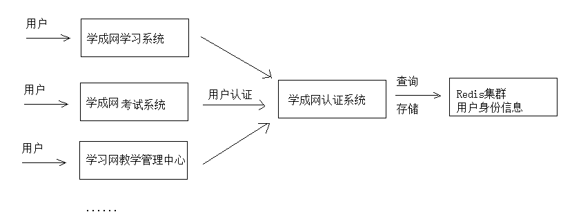
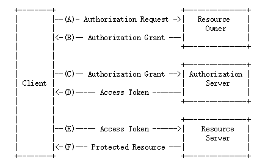
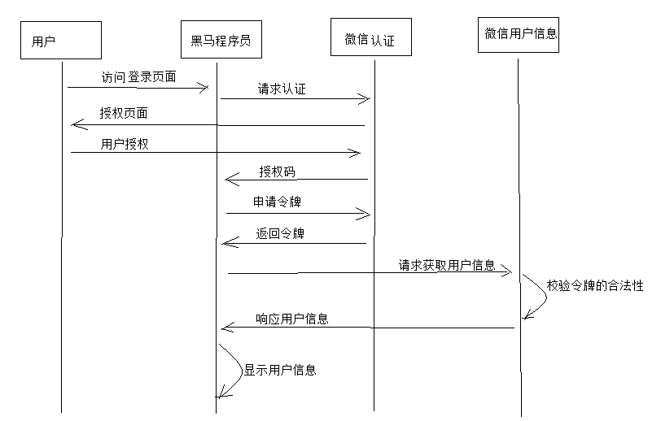

# 1 Spring Security 概述

[Spring Security](https://projects.spring.io/spring-security/) 的前身是 Acegi Security ，是一个能够为基于Spring的企业应用系统提供声明式的安全访问控制解决方案的安全框架。它提供了一组可以在Spring应用上下文中配置的Bean，充分利用了Spring IoC，DI 和 AOP功能，为应用系统提供声明式的安全访问控制功能，减少了为企业系统安全控制编写大量重复代码的工作。

安全包括两个主要操作：

- “认证”是为用户建立一个他所声明的主体。主体一般是指用户，设备或可以在你系统中执行动作的其他系统。 
- “授权”指的是一个用户能否在你的应用中执行某个操作，在到达授权判断之前，身份的主体已经由身份验证过程建立了。

基于Spring Security的数据库认证的操作方式有多种，这里我们介绍使用`UserDetails`、 `UserDetailsService`来完成操作

- **`UserDetails`**接口，作用是于**封装当前进行认证的用户信息**，我们可以对其进行实现，也可以**使用Spring Security提供的一个UserDetails的实现类User**来完成操作

  ```java
  public interface UserDetails extends Serializable {     
  	Collection<? extends GrantedAuthority> getAuthorities();    
  	String getPassword();       
  	String getUsername();       
  	boolean isAccountNonExpired();      
  	boolean isAccountNonLocked();    
  	boolean isCredentialsNonExpired();    
  	boolean isEnabled(); 
  }
  ```

  以下是User类的部分代码：

  ```java
  public class User implements UserDetails, CredentialsContainer {
      private String password;    
      private final String username;    
      private final Set<GrantedAuthority> authorities;    
      private final boolean accountNonExpired; //帐户是否过期    
      private final boolean accountNonLocked; //帐户是否锁定    
      private final boolean credentialsNonExpired; //认证是否过期    
      private final boolean enabled; //帐户是否可用
      //......
  }
  ```

- `UserDetailsService`接口，用于规范认证方法的接口

  ```java
  public interface UserDetailsService {        
      UserDetails loadUserByUsername(String username) throws UsernameNotFoundException; 
  }
  ```

------


# 2 登陆注销

SSM综合练习中用户登录来完成Spring Security的认证操作：

1. 导入spring-security相关依赖（自动导入spring-security-core/config/web三个依赖）

   ```xml
   <dependency>
       <groupId>org.springframework.security</groupId>
       <artifactId>spring-security-web</artifactId>
       <version>${spring.security.version}</version>
   </dependency>
   <dependency>
       <groupId>org.springframework.security</groupId>
       <artifactId>spring-security-config</artifactId>
       <version>${spring.security.version}</version>
   </dependency>
   <!--下面资料中没有导入-->
   <dependency>
       <groupId>org.springframework.security</groupId>
       <artifactId>spring-security-taglibs</artifactId>
       <version>${spring.security.version}</version>
   </dependency>
   ```

2. `web.xml`中配置**`springSecurityFilterChain`**（必须这个名字），别忘了监听器加载`spring-security.xml`等配置文件

   ```xml
   <context-param>
       <param-name>contextConfigLocation</param-name>
       <param-value>classpath*:spring-security.xml</param-value>
   </context-param>
   <listener>
       <listener-class>org.springframework.web.context.ContextLoaderListener</listener-class>
   </listener>
   
   <filter>
       <filter-name>springSecurityFilterChain</filter-name> <!--名称不能改变！-->
       <filter-class>org.springframework.web.filter.DelegatingFilterProxy</filter-class> <!--只是个代理类，拦截-->
   </filter>
   <filter-mapping>
       <filter-name>springSecurityFilterChain</filter-name>
       <url-pattern>/*</url-pattern>
   </filter-mapping>
   ```

3. `spring-security.xml`中配置如下

   ```xml
   <?xml version="1.0" encoding="UTF-8"?>
   <!--采用如下约束配置可以在配置时不加security前缀，但在配置bean时需要加beans前缀。主要方便springsecurity配置
    采用此约束文件，没有前缀的都是springsecurity自身的配置-->
   <beans:beans xmlns="http://www.springframework.org/schema/security" 
                xmlns:beans="http://www.springframework.org/schema/beans" 
                xmlns:xsi="http://www.w3.org/2001/XMLSchema-instance"
                xsi:schemaLocation="http://www.springframework.org/schema/beans
                                    http://www.springframework.org/schema/beans/spring-beans.xsd
                                    http://www.springframework.org/schema/security
                                    http://www.springframework.org/schema/security/spring-security.xsd">
   
       <!-- 配置不拦截的资源（静态资源及登录相关），不登录也可以访问。否则可能会有重定向次数过多错误  -->
       <http pattern="/*.html" security="none"/> <!--webapp一级目录下的html文件（包括login.html及login_error等）-->
       <http pattern="/css/**" security="none"/>
       <http pattern="/js/**" security="none"/>
       <http pattern="/img/**" security="none"/>
       <http pattern="/plugins/**" security="none"/>
       <http pattern="/seller/add.do" security="none"/> <!--注册相关的也必须放行-->
   
   
       <!--http标签主要用于配置拦截的具体的规则
        auto-config="true"	不用自己编写登录的页面，框架提供默认登录页面，不配置默认为true
        use-expressions="true"	是否启用SPEL表达式，不配置默认为true（功能强大，可以限制ip等，没学习过）-->
       <http auto-config="true" use-expressions="true">
           <!-- 具体的拦截规则 pattern="表示拦截页面"，与web.xml中不同。此处为目录规则，/**代表目录及其子目录
                              access="访问系统的角色名称（以ROLE_开头），当前用户必须有ROLE_ADMIN或...的角色" -->
           <intercept-url pattern="/**" access="hasAnyRole('ROLE_ADMIN','ROLE_USER')"/> <!--SPEL表达式-->
           <!-- 开启表单登陆功能，定义跳转的具体的页面 
       login-page="/login.html"  //必须以斜杠开头
       default-target-url="/index.html"  //指定了成功进行身份认证和授权后默认呈现给用户的页面 
       always-use-default-target="true"  //无论请求哪个页面登陆成功后都跳转至index而不是请求的那个页面
       authentication-failure-url="/login.html"  //指定了身份认证失败时跳转到的页面-->
           <form-login login-page="/login.html"  default-target-url="/index.html" always-use-default-target="true"  authentication-failure-url="/login.html"  />
   
           <!-- 注销登陆的配置
      logout-url：登出处理url，不配置默认为/logout
      logout-successurl：登出成功页面，默认不配置则跳转登陆页面
      invalidate-session 是否删除session，不配置默认为true -->
           <logout invalidate-session="true" logout-url="/logout" logout-success-url="/login.html"/>
   
           <!-- 关闭csrf（Cross-site request forgery）跨站请求伪造 ,如果不加会出现403错误。也被称为“One Click Attack”或者Session Riding，通常缩写为CSRF或者XSRF，是一种对网站的恶意利用。HTML不能使用，JSP可以带指定头信息使用-->
           <csrf disabled="true"/>
   
           <!--不拦截内置框架页，否则即使登陆成功也会拦截内置框架页-->
           <headers>
               <frame-options policy="SAMEORIGIN"/>
           </headers>
       </http>
   
   
       <!-- 认证管理器，指定了认证需要访问的service 。使用成数据库中的用户名和密码。-->
       <authentication-manager>
           <authentication-provider user-service-ref="userService">
               <!-- 配置加密的方式（会自动解密）。若配置此项，则需要指定密码加密方式，否则使用{noop}拼接上密码-->
               <password-encoder ref="passwordEncoder"/> 
           </authentication-provider>
       </authentication-manager>
       <!-- 配置加密类 -->
       <beans:bean id="passwordEncoder" class="org.springframework.security.crypto.bcrypt.BCryptPasswordEncoder"/>
   
   
       
      
       
       <!--==========================================================================================-->
       <!--【注意】由于pinyougou-shop-web消费者中UserDetailsServiceImpl是普通类，不能自动注入Dao接口。需要借助Dubbox的Service来间接调用，并且Service也不能直接注入，需要通过dubbox使用接口来注入Service实现类-->
       <!-- 引用dubbox 服务 -->
       <dubbo:application name="pinyougou-shop-web" />
       <dubbo:registry address="zookeeper://192.168.25.129:2181"/>
       <!--通过dubbox使用接口来注入实现类-->
       <dubbo:reference id="sellerService" interface="com.pinyougou.sellergoods.service.SellerService"/>
   
       <!--认证类-->
       <beans:bean id="userDetailsService" class="com.pinyougou.service.UserDetailsServiceImpl">
           <beans:property name="sellerService" ref="sellerService"/>
       </beans:bean>	
       <!--==========================================================================================-->
   
   
       <!-- 入门方式，在内存中存入用户名、密码、角色（若使用明文密码，不配置加密方式，则不用添加{noop}）
       <authentication-manager>
        <authentication-provider>
         <user-service>
          <user name="admin" password="{noop}admin" authorities="ROLE_ADMIN"/>  
          <user name="zhangsan" password="{noop}zhangsan" authorities="ROLE_ADMIN"/>
         </user-service>
        </authentication-provider>
       </authentication-manager>
       -->
   </beans:beans>
   ```

   自定义登陆页面：表单请求方法为**POST**，action为**`/login`**（由Springsecurity自动生成路径），用户名和密码的表单name为**username、password**（不乱修改则不需要在`spring-security.xml`中配置）

   ```xml
   <!--
    login-processing-url：修改表单登陆action，不配置默认为/login
    authentication-success-forward-url：不知道。。。
    username-parameter和password-parameter：表单中用户名、密码input标签的name值。不配置默认为username、password
   -->
   <form-login
               login-processing-url="/loginnnn"
               authentication-success-forward-url="/pages/main.jsp" 
               username-parameter="name"
               password-parameter="pswd"/>
   ```

   注销按钮访问`/logout`即可

   

4. 实现`UserDetailsService`接口，springsecurity会根据**方法返回的User**实现类**对比表单登陆的数据**来决定登陆成功与否

   ```java
   @Service//不使用Dubbox是可以这样写，但使用后这个类可能在web中只是个普通类，就只能xml配置
   public class UserDetailsServiceImpl implements UserDetailsService {
   
       @Autowired//同上，不使用Dubbox是可以这样写，但使用后就只能xml配置。并且需要提供set方法
       private SellerService sellerService;
       public void setSellerService(SellerService sellerService) {
           this.sellerService = sellerService;
       }
   
       @Override
       public UserDetails loadUserByUsername(String username) throws UsernameNotFoundException {
   
           TbSeller seller = sellerService.findOne(username);//查找数据库中的数据对象
           System.out.println(username+"==="+seller.getPassword()+"==="+seller.getStatus());
           if (seller != null) {
               boolean enabled = seller.getStatus().equals("1"); //账户是否可以使用
               //角色信息本应该和数据库中User对象一起查询出来，然后遍历并添加到如下authorities集合中
               List<GrantedAuthority> authorities = new ArrayList<>();
               authorities.add(new SimpleGrantedAuthority("ROLE_SELLER"));
               //返回UserDetails的实现类User（都是SpringSecurity提供的）
               return new User(username, seller.getPassword(), enabled, true, true, true, authorities);
           } else {
               return null;
           }
       }
   }
   ```

5. UserDao中查询user时还需查询user所属的权限

   ```java
   @Repository
   public interface UserDao {
   
       @Select("select * from users where username=#{username}")
       @Results({
               @Result(id = true, property = "id", column = "id"),
               @Result(column = "username", property = "username"),
               @Result(column = "email", property = "email"),
               @Result(column = "password", property = "password"),
               @Result(column = "phoneNum", property = "phoneNum"),
               @Result(column = "status", property = "status"),
               @Result(column = "id", property = "roles",
                       many = @Many(select = "com.itheima.ssm.dao.RoleDao.findRoleByUserId"))
       })
       UserInfo findByUsername(String username);
   }
   ```

   

# 3 显示登陆名

后端

```java
@RestController
@RequestMapping("/login")
public class LoginController {

    @RequestMapping("showName")
    public Map showName(){
        String name = SecurityContextHolder.getContext().getAuthentication().getName();
        Map map = new HashMap();
        map.put("loginName",name);
        return map;
    }
}
```

前端（AngularJS）

```js
app.service("loginService",function ($http) {
    this.showName = function () {
        return $http.get("../login/showName.do");
    }
});
```

```js
app.controller("loginController",function ($scope,loginService) {
    $scope.showName = function () {
        loginService.showName().success(
            function (data) {
                $scope.loginName = data.loginName;
            }
        )
    }
});
```

```html
<!--修改框架页的信息-->
<body ng-app="pinyougou" ng-controller="loginController" ng-init="showName()">
    {{loginName}}
</body>
```


# 4 BCrypt密码加密

用户表的密码通常使用MD5等不可逆算法加密后存储，为防止彩虹表破解更会先使用一个特定的字符串（如域名）加密，然后再使用一个随机的salt（盐值）加密。 特定字符串是程序代码中固定的，salt是每个密码单独随机，一般给用户表加一个字段单独存储，比较麻烦。 **BCrypt**算法将salt随机并混入最终加密后的密码，验证时也无需单独提供之前的salt，从而无需单独处理salt问题

MD5加密后的32为字符永远是一样的，但BCrypt即使密码一样，他们的60位字符串还是不一样（加随机的盐salt）！

配置查看上面的

控制层在注册时加密。配置好登陆时SpringSecurity会自动解密对比。

```java
@RequestMapping("/add")
public Result add(@RequestBody TbSeller seller){
    try {
        BCryptPasswordEncoder encoder = new BCryptPasswordEncoder();
        String encode = encoder.encode(seller.getPassword());
        seller.setPassword(encode);
        sellerService.add(seller);
        return new Result(true, "增加成功");
    } catch (Exception e) {
        e.printStackTrace();
        return new Result(false, "增加失败");
    }
}
```


- Spring Security允许我们在定义URL访问或方法访问所应有的权限时使用Spring EL表达式，在定义所需的访问权限时如果对应的表达式返回结果为true则表示拥有对应的权限，反之则无。Spring Security可用表达式对象的基类是SecurityExpressionRoot，其为我们提供了如下在使用Spring EL表达式对URL或方法进行权限控制时通用的内置表达式。

  |           **表达式**           | **描述**                                                     |
  | :----------------------------: | ------------------------------------------------------------ |
  |        hasRole([role])         | 当前用户是否拥有指定角色。                                   |
  |   hasAnyRole([role1,role2])    | 多个角色是一个以逗号进行分隔的字符串。如果当前用户拥有指定角色中的任意一个则返回true。 |
  |      hasAuthority([auth])      | 等同于hasRole                                                |
  | hasAnyAuthority([auth1,auth2]) | 等同于hasAnyRole                                             |
  |           Principle            | 代表当前用户的principle对象                                  |
  |         authentication         | 直接从SecurityContext获取的当前Authentication对象            |
  |           permitAll            | 总是返回true，表示允许所有的                                 |
  |            denyAll             | 总是返回false，表示拒绝所有的                                |
  |         isAnonymous()          | 当前用户是否是一个匿名用户                                   |
  |         isRememberMe()         | 表示当前用户是否是通过Remember-Me自动登录的                  |
  |       isAuthenticated()        | 表示当前用户是否已经登录认证成功了。                         |
  |     isFullyAuthenticated()     | 如果当前用户既不是一个匿名用户，同时又不是通过Remember-Me自动登录的，则返回true。 |


……看整合部分项目吧


# 1 Spring Security 概述


[Spring Security](https://projects.spring.io/spring-security/) 的前身是 Acegi Security ，是一个能够为基于Spring的企业应用系统提供声明式的安全访问控制解决方案的安全框架。它提供了一组可以在Spring应用上下文中配置的Bean，充分利用了Spring IoC，DI 和 AOP功能，为应用系统提供声明式的安全访问控制功能，减少了为企业系统安全控制编写大量重复代码的工作。

安全包括两个主要操作：

- **认证**：用户去访问系统资源时系统要求验证用户的身份信息，身份合法方可继续访问。
- **授权**：用户认证通过后去访问系统的资源，系统会判断用户是否拥有访问资源的权限，只允许访问有权限的系统资源，没
  有权限的资源将无法访问，这个过程叫用户授权。


## 1 SSO 单点登录

单点登录（Single Sign On）**需求**：为了提高用户体验性需要实现用户只**认证**一次便可以在多个拥有访问权限的系统中访问


单点登录**技术方案**：分布式系统要实现单点登录，通常将**认证系统独立抽取**出来，并且将用户身份信息存储在单独的存储介质，比如：MySQL、Redis，考虑性能要求，通常存储在Redis中。



单点登录的**特点**是：

* 认证系统为独立的系统。
* 各子系统通过Http或其它协议与认证系统通信，完成用户认证。
* 用户身份信息存储在Redis集群。

Java中有很多用户认证的**框架**都可以实现单点登录：

* Apache Shiro
* CAS
* Spring security CAS


## 2 OAuth2 认证

第三方认证技术方案最主要是解决**认证协议的通用标准**问题，因为要实现**跨系统**认证，各系统之间要**遵循一定的接口协议**。

> OAuth 协议为用户资源的授权提供了一个**安全的、开放而又简易**的标准。与以往的授权方式不同之处是OAuth 的授权不会使第三方触及到用户的帐号信息（如用户名与密码），即**第三方无需使用用户的用户名与密码就可以申请获得该用户资源的授权**，因此 OAuth 是安全的。oAuth是Open Authorization的简写。同时，任何第三方都可以使用OAuth 认证服务，任何服务提供商都可以实现自身的OAuth 认证服务，因而OAuth 是开放的。业界提供了OAuth 的多种实现如PHP、JavaScript，Java，Ruby等各种语言开发包，大大节约了程序员的时间，因而OAuth 是简易的。互联网很多服务如Open API，很多大公司如Google，Yahoo，Microsoft等都提供了OAUTH认证服务，这些都足以说明OAuth 标准逐渐成为开放资源授权的标准。

OAuth 协议目前发展到2.0版本，1.0版本过于复杂，2.0版本已得到广泛应用。Oauth协议：https://tools.ietf.org/html/rfc6749

Oauth2.0认证流程如下：



OAuth2包括以下角色：

* 客户端
  本身不存储资源，需要通过资源拥有者的授权去请求资源服务器的资源，比如：学成在线Android客户端、学成在线Web客户端（浏览器端）、微信客户端等。
* 资源拥有者
  通常为用户，也可以是应用程序，即该资源的拥有者。

* 授权服务器（也称认证服务器）
  用来对资源拥有的身份进行认证、对访问资源进行授权。客户端想访问资源需要通过认证服务器由资源拥有者授权后可访问。
* 资源服务器
  存储资源的服务器，比如，学成网用户管理服务器存储了学成网的用户信息，学成网学习服务器存储了学生的学习信息，微信的资源服务存储了微信的用户信息等。客户端最终访问资源服务器获取资源信息。


> 学成在线中使用：
>
> 1、学成在线访问第三方系统的资源
> 2、外部系统访问学成在线的资源
> 3、学成在线前端（客户端） 访问学成在线微服务的资源。
> 4、学成在线微服务之间访问资源，例如：微服务A访问微服务B的资源，B访问A的资源。
>
> 本项目采用 Spring security + Oauth2完成用户认证及用户授权，Spring security 是一个强大的和高度可定制的身份验证和访问控制框架，Spring security 框架集成了Oauth2协议，下图是项目认证架构图：
>
> 
>
> 1、用户请求认证服务完成认证。
> 2、认证服务下发用户身份令牌，拥有身份令牌表示身份合法。
> 3、用户携带令牌请求资源服务，请求资源服务必先经过网关。
> 4、网关校验用户身份令牌的合法，不合法表示用户没有登录，如果合法则放行继续访问。
> 5、资源服务获取令牌，根据令牌完成授权。
> 6、资源服务完成授权则响应资源信息。


# 2 Spring Security Oauth2研究

## 1 搭建授权（认证）服务器


> 第三方认证（跨平台认证）需求：当需要访问第三方系统的资源时需要首先通过第三方系统的认证（例如：微信认证），由第三方系统对用户认证通过，并授权资源的访问权限。




# 1 JWT

## 1.1 引入JWT之前的问题

传统校验令牌的方法：

```sequence
Title:传统校验令牌的方法
客户端->认证服务: 用户认证
认证服务->客户端: 返回令牌
客户端->资源服务: 携带令牌访问资源
资源服务->认证服务: 请求认证校验令牌合法性
认证服务->资源服务: 返回校验结果及用户信息
资源服务->客户端: 返回资源
```


