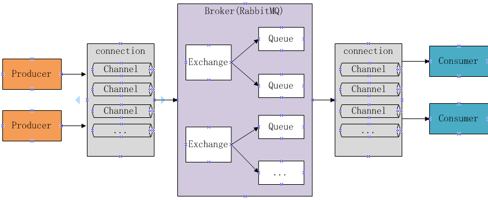
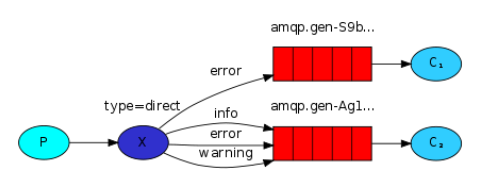
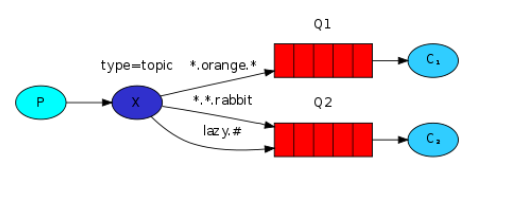

# 1 RabbitMQ

## 1 RabbitMQ简介

> 市场上还有哪些消息队列？ActiveMQ，RabbitMQ，ZeroMQ，Kafka，MetaMQ，RocketMQ、Redis。

**MQ**全称为**Message Queue**，即**消息队列**， RabbitMQ是由erlang语言开发，基于**AMQP**（Advanced Message Queue 高级消息队列协议）实现的消息队列，它是一种**应用程序之间的通信方法**，消息队列在分布式系统开发中应用非常广泛。[RabbitMQ 官方地址](http://www.rabbitmq.com/)。

开发中消息队列通常有如下**应用场景**：

- **任务异步处理**：将不需要同步处理的并且耗时长的操作由消息队列通知消息接收方进行异步处理。提高应用程序的响应时间
- **应用程序解耦合**：MQ相当于一个中介，生产方通过MQ与消费方交互，它将应用程序进行解耦合

为什么使用RabbitMQ呢？

- 使用简单，功能强大
- 基于AMQP协议
- 社区活跃，文档完善
- 高并发性能好，这主要得益于Erlang语言
- Spring Boot默认已集成RabbitMQ

------

**AMQP**是什么？

Advanced Message Queuing Protocol，一个提供**统一消息服务**的**应用层标准**高级消息队列协议，是应用层协议的一个**开放标准**，为面向消息的中间件设计。基于此协议的客户端与消息中间件可传递消息，并不受客户端/中间件不同产品，不同的开发语言等条件的限制。

**JMS**是什么？

**Java消息服务**（Java Message Service，JMS）应用程序**接口**是一个**Java平台**中关于**面向消息中间件**（MOM）的**API**，用于在两个应用程序之间，或分布式系统中发送消息，进行**异步通信**。Java消息服务是一个与具体平台无关的API，绝大多数MOM提供商都对JMS提供支持。

------

RabbitMQ的**工作原理**

下图是RabbitMQ的基本结构：



组成部分说明如下：（Broker是在Channel中的！！！）

- **Broker**：消息队列服务进程，此进程包括两个部分：**Exchange**和**Queue**。
  - **Exchange**：消息队列交换机，按一定的规则将消息**路由转发**到某个**队列**，对消息进行过虑。
  - **Queue**：消息队列，**存储消息的队列**，消息到达队列并转发给指定的消费方。
- Producer：消息生产者，即生产方客户端，生产方客户端将消息发送到MQ。
- Consumer：消息消费者，即消费方客户端，接收MQ转发的消息。

消息发布接收流程：

- 发送消息
  1. 生产者和Broker建立TCP连接。
  2. 生产者和Broker建立通道。
  3. 生产者通过通道消息发送给Broker，由Exchange将消息进行转发。
  4. Exchange将消息转发到指定的Queue（队列）
- 接收消息
  1. 消费者和Broker建立TCP连接
  2. 消费者和Broker建立通道
  3. 消费者监听指定的Queue（队列）
  4. 当有消息到达Queue时Broker默认将消息推送给消费者。
  5. 消费者接收到消息。

## 2 快速入门

### 2.1 下载安装

> RabbitMQ由Erlang语言开发，Erlang语言用于并发及分布式系统的开发，在电信领域应用广泛，OTP（Open Telecom Platform）作为Erlang语言的一部分，包含了很多基于Erlang开发的中间件及工具库，安装RabbitMQ需要安装Erlang/OTP，并保持版本匹配，[下载地址](http://www.rabbitmq.com/download.html)。本项目使用Erlang/OTP 20.3版本和RabbitMQ3.7.3版本

1. 下载erlang并安装（可能需要管理员模式）：[Erlang/OTP 20.3](http://erlang.org/download/otp_win64_20.3.exe)

   erlang安装完成需要配置erlang环境变量，例如：

   `ERLANG_HOME=C:\Program Files\erl9.3`，在path中添加`%ERLANG_HOME%\bin;`

2. 下载RabbitMQ并安装（可能需要管理员模式）：[RabbitMQ3.7.3](https://github.com/rabbitmq/rabbitmq-server/releases/tag/v3.7.3)


### 2.2 启动

Windows版安装成功后会自动创建RabbitMQ服务并且启动。

- 从开始菜单启动RabbitMQ

  - RabbitMQ Service-install :安装服务
  - RabbitMQ Service-remove 删除服务
  - RabbitMQ Service-start 启动
  - RabbitMQ Service-stop 启动

- 如果没有开始菜单则进入安装目录下`sbin\`目录手动启动

  - `rabbitmq-service.bat install` 安装服务 
  - `rabbitmq-service.bat stop` 停止服务 
  - `rabbitmq-service.bat start` 启动服务

- 安装管理插件

  - 安装rabbitMQ的管理插件，方便在浏览器端管理RabbitMQ

    管理员身份运行 `rabbitmq-plugins.bat enable rabbitmq_management`

    启动成功 登录RabbitMQ，输入：http://localhost:15672。初始账号和密码：`guest/guest`

> 安装erlang和rabbitMQ以管理员身份运行。
>
> 当卸载重新安装时会出现RabbitMQ服务注册失败，此时需要进入注册表清理，搜索RabbitMQ、ErlSrv，将对应项全部删除


### 2.3 HelloWorld

创建maven工程。创建生产者工程和消费者工程，分别加入RabbitMQ java client的依赖。

```xml
<dependency>
    <groupId>com.rabbitmq</groupId>
    <artifactId>amqp-client</artifactId>
    <version>5.4.3</version>
</dependency>
<dependency>
    <groupId>org.springframework.boot</groupId>
    <artifactId>spring-boot-starter-test</artifactId>
    <version>2.1.3.RELEASE</version>
</dependency>
```

test-rabbitmq-producer：生产者工程

```java
public class Producer01 {

    //队列
    private static final String QUEUE = "helloworld";

    public static void main(String[] args) {
        //1.通过连接工厂创建新的连接和mq建立连接
        ConnectionFactory connectionFactory = new ConnectionFactory();
        connectionFactory.setHost("127.0.0.1");
        connectionFactory.setPort(5672);//端口，与监控web端口不一样！！！
        connectionFactory.setUsername("guest");
        connectionFactory.setPassword("guest");
        //设置虚拟机，一个mq服务可以设置多个虚拟机，虚拟机相当于一个独立的mq服务器，RabbitMQ默认虚拟机名称为“/”
        connectionFactory.setVirtualHost("/");

        Connection connection = null;
        Channel channel = null;
        try {
            //2.创建与RabbitMQ服务的TCP连接
            connection = connectionFactory.newConnection();
            //3.创建与Exchange的通道，每个连接可以创建多个通道，每个通道代表一个会话任务
            channel = connection.createChannel();
            /**
             * 4.声明队列，如果RabbitMQ中没有此队列将自动创建
             * String queue:队列名称
             * boolean durable:是否持久化，如果持久化，mq重启后队列还在
             * boolean exclusive:队列是否独占此连接，队列只允许在该连接中访问，如果connection连接关闭队列则自动删除。如果将此							  参数设置true可用于临时队列的创建
             * boolean autoDelete:队列不再使用时是否自动删除此队列。如果将此参数和exclusive参数设置为true就可以实现临时队列
             * Map<String, Object> arguments:队列参数，可以设置一个队列的扩展参数，比如：可设置存活时间
             */
            channel.queueDeclare(QUEUE, true, false, false, null);

            //消息内容
            String message = "hello world 黑马程序员" + System.currentTimeMillis();
            /**
             * 消息发布方法
             * String exchange：Exchange的名称，如果没有指定，则使用Default Exchange。每个队列也会绑定那个默认的交换机，但是							  不能显示绑定或解除绑定
             * String routingKey: 消息的路由Key，是用于Exchange将消息转发到指定的消息队列。如果使用默认交换机，该参数设置为队								列的名称
             * BasicProperties props : 消息包含的属性
             * byte[] body：消息体
             */
            channel.basicPublish("", QUEUE, null, message.getBytes());
            System.out.println("send to mq " + message);
        } catch (Exception e) {
            e.printStackTrace();
        } finally {
            try {
                if (channel != null) {
                    channel.close();
                }
                if (connection != null) {
                    connection.close();
                }
            } catch (IOException | TimeoutException e) {
                e.printStackTrace();
            }
        }
    }
}
```


test-rabbitmq-consumer：消费者工程

```java
public class Consumer01 {

    //队列
    private static final String QUEUE = "helloworld";

    public static void main(String[] args) throws IOException, TimeoutException {
        //通过连接工厂设置MabbitMQ所在服务器的ip和端口
        ConnectionFactory connectionFactory = new ConnectionFactory();
        connectionFactory.setHost("127.0.0.1");
        connectionFactory.setPort(5672);//端口
        /*connectionFactory.setUsername("guest");
        connectionFactory.setPassword("guest");*/
        //设置虚拟机，一个mq服务可以设置多个虚拟机，每个虚拟机就相当于一个独立的mq
        connectionFactory.setVirtualHost("/");

        //创建与RabbitMQ服务的TCP连接
        Connection connection = connectionFactory.newConnection();
        //创建会话通道,生产者和mq服务所有通信都在channel通道中完成
        Channel channel = connection.createChannel();

        //声明队列，如果队列在mq 中没有则要创建
        channel.queueDeclare(QUEUE,true,false,false,null);

        /**
         * 监听队列
         * 1、queue 队列名称
         * 2、autoAck 自动回复，当消费者接收到消息后要告诉mq消息已接收，如果将此参数设置为tru表示会自动回复mq，如果设置为false						要通过编程实现回复
         * 3、callback，消费方法，当消费者接收到消息要执行的方法
         */
        channel.basicConsume(QUEUE,true,new DefaultConsumer(channel){
            /**
             * 当消费者接收到消息后此方法将被调用
             * @param consumerTag  消费者标签，用来标识消费者的，在监听队列时设置channel.basicConsume
             * @param envelope 信封，消息包的内容，可从中获取消息id，消息routingkey，交换机，消息和重传标志(收到消息失败后是							否需要重新发送)
             * @param properties 消息属性
             * @param body 消息内容
             */
            @Override
            public void handleDelivery(String consumerTag, Envelope envelope, AMQP.BasicProperties properties, byte[] body) throws IOException {
                //交换机
                String exchange = envelope.getExchange();
                //路由key
                String routingKey = envelope.getRoutingKey();
                //消息id，mq在channel中用来标识消息的id，可用于确认消息已接收
                long deliveryTag = envelope.getDeliveryTag();
                //消息内容
                String message= new String(body, StandardCharsets.UTF_8);
                System.out.println("receive message:"+message);
            }
        });
    }
}
```


### 2.4 总结

1、发送端操作流程

1）创建连接

2）创建通道

3）声明队列

4）发送消息

------

2、接收端

1）创建连接

2）创建通道

3）声明队列

4）监听队列

5）接收消息

6）ack回复


## 3 工作模式

RabbitMQ有以下几种工作模式 ：

1、Work queues

2、Publish/Subscribe

3、Routing

4、Topics

5、Header

6、RPC


### 3.1 Work queues


work queues与入门程序相比，多了一个消费端，两个消费端共同消费同一个队列中的消息。

==**应用场景**：对于**任务过重或任务较多**情况使用工作队列可以**提高任务处理的速度**。==

测试：

1、使用入门程序，启动多个消费者。

2、生产者发送多个消息。

结果：

1、一条消息只会被一个消费者接收；

2、rabbit采用**轮询**的方式将消息是**平均发送给消费者**的；

3、消费者在处理完某条消息后，才会收到下一条消息。


### 3.2 Publish/subscribe


发布订阅模式：

1、每个消费者监听自己的队列。

2、生产者将消息发给broker，由**交换机将消息转发到绑定此交换机的每个队列**，每个绑定交换机的队列都将接收到消息

==案例：**用户通知**，当用户充值成功或转账完成系统通知用户，通知方式有**短信、邮件**多种方法 。==


1、生产者

声明Exchange_fanout_inform交换机。声明两个队列并且绑定到此交换机，绑定时和发送消息时均不需要指定routingkey

```java
public class Producer02_publish {
    //队列名称
    private static final String QUEUE_INFORM_EMAIL = "queue_inform_email";
    private static final String QUEUE_INFORM_SMS = "queue_inform_sms";
    private static final String EXCHANGE_FANOUT_INFORM="exchange_fanout_inform";

    public static void main(String[] args) {
        //通过连接工厂创建新的连接和mq建立连接
        ConnectionFactory connectionFactory = new ConnectionFactory();
        connectionFactory.setHost("127.0.0.1");
        connectionFactory.setPort(5672);//端口
        connectionFactory.setUsername("guest");
        connectionFactory.setPassword("guest");
        //设置虚拟机，一个mq服务可以设置多个虚拟机，每个虚拟机就相当于一个独立的mq
        connectionFactory.setVirtualHost("/");

        Connection connection = null;
        Channel channel = null;
        try {
            //建立新连接
            connection = connectionFactory.newConnection();
            //创建会话通道,生产者和mq服务所有通信都在channel通道中完成
            channel = connection.createChannel();
            //声明队列，如果队列在mq 中没有则要创建
            /**
             * 参数明细
             * 1、queue 队列名称
             * 2、durable 是否持久化，如果持久化，mq重启后队列还在
             * 3、exclusive 是否独占连接，队列只允许在该连接中访问，如果connection连接关闭队列则自动删除,如果将此参数设置true							可用于临时队列的创建
             * 4、autoDelete 自动删除，队列不再使用时是否自动删除此队列，如果将此参数和exclusive参数设置为true就可以实现临时队						列（队列不用了就自动删除）
             * 5、arguments 参数，可以设置一个队列的扩展参数，比如：可设置存活时间
             */
            channel.queueDeclare(QUEUE_INFORM_EMAIL,true,false,false,null);
            channel.queueDeclare(QUEUE_INFORM_SMS,true,false,false,null);
            //声明一个交换机
            /**
             * 参数明细：
             * 1、交换机的名称
             * 2、交换机的类型
             * fanout：对应的rabbitmq的工作模式是 publish/subscribe
             * direct：对应的Routing	工作模式
             * topic：对应的Topics工作模式
             * headers： 对应的headers工作模式
             */
            channel.exchangeDeclare(EXCHANGE_FANOUT_INFORM, BuiltinExchangeType.FANOUT);
            //进行交换机和队列绑定
            /**
             * 参数明细：
             * 1、queue 队列名称
             * 2、exchange 交换机名称
             * 3、routingKey 路由key，作用是交换机根据路由key的值将消息转发到指定的队列中，在发布订阅模式中调协为空字符串
             */
            channel.queueBind(QUEUE_INFORM_EMAIL,EXCHANGE_FANOUT_INFORM,"");
            channel.queueBind(QUEUE_INFORM_SMS,EXCHANGE_FANOUT_INFORM,"");
            //发送消息
            /**
             * 参数明细：
             * 1、exchange，交换机，如果不指定将使用mq的默认交换机（设置为""）
             * 2、routingKey，路由key，交换机根据路由key来将消息转发到指定的队列，如果使用默认交换机，routingKey设置为队列的								名称
             * 3、props，消息的属性
             * 4、body，消息内容
             */
            for(int i=0;i<5;i++){
                //消息内容
                String message = "send inform message to user";
                channel.basicPublish(EXCHANGE_FANOUT_INFORM,"",null,message.getBytes());
                System.out.println("send to mq "+message);
            }
        } catch (Exception e) {
            e.printStackTrace();
        } finally {
            try {
                if (channel != null) {
                    channel.close();
                }
                if (connection != null) {
                    connection.close();
                }
            } catch (IOException | TimeoutException e) {
                e.printStackTrace();
            }
        }
    }
}
```

2、消费者（2个，类似！）

```java
public class Consumer02_subscribe_email {
    //队列名称
    private static final String QUEUE_INFORM_EMAIL = "queue_inform_email";
    //不同之处，替换上面的
    //private static final String QUEUE_INFORM_SMS = "queue_inform_sms";
    private static final String EXCHANGE_FANOUT_INFORM="exchange_fanout_inform";


    public static void main(String[] args) throws IOException, TimeoutException {
        //通过连接工厂创建新的连接和mq建立连接
        ConnectionFactory connectionFactory = new ConnectionFactory();
        connectionFactory.setHost("127.0.0.1");
        connectionFactory.setPort(5672);//端口
        connectionFactory.setUsername("guest");
        connectionFactory.setPassword("guest");
        //设置虚拟机，一个mq服务可以设置多个虚拟机，每个虚拟机就相当于一个独立的mq
        connectionFactory.setVirtualHost("/");
        //建立新连接
        Connection connection = connectionFactory.newConnection();
        //创建会话通道,生产者和mq服务所有通信都在channel通道中完成
        Channel channel = connection.createChannel();
        /**
         * 1、queue 队列名称
         * 2、durable 是否持久化，如果持久化，mq重启后队列还在
         * 3、exclusive 是否独占连接，队列只允许在该连接中访问，如果connection连接关闭队列则自动删除,如果将此参数设置true可用				于临时队列的创建
         * 4、autoDelete 自动删除，队列不再使用时是否自动删除此队列，如果将此参数和exclusive参数设置为true就可以实现临时队列（				队列不用了就自动删除）
         * 5、arguments 参数，可以设置一个队列的扩展参数，比如：可设置存活时间
         */
        channel.queueDeclare(QUEUE_INFORM_EMAIL,true,false,false,null);
        //不同之处，替换上面的
        //channel.queueDeclare(QUEUE_INFORM_SMS,true,false,false,null);
        /**
         * 参数明细：
         * 1、交换机的名称
         * 2、交换机的类型
         * fanout：对应的rabbitmq的工作模式是 publish/subscribe
         * direct：对应的Routing	工作模式
         * topic：对应的Topics工作模式
         * headers： 对应的headers工作模式
         */
        channel.exchangeDeclare(EXCHANGE_FANOUT_INFORM, BuiltinExchangeType.FANOUT);
        //进行交换机和队列绑定
        /**
         * 1、queue 队列名称
         * 2、exchange 交换机名称
         * 3、routingKey 路由key，作用是交换机根据路由key的值将消息转发到指定的队列中，在发布订阅模式中调协为空字符串
         */
        channel.queueBind(QUEUE_INFORM_EMAIL, EXCHANGE_FANOUT_INFORM, "");
        
        //channel.queueBind(QUEUE_INFORM_SMS, EXCHANGE_FANOUT_INFORM, "");
        //不同之处，替换上面的
        //实现消费方法
        DefaultConsumer defaultConsumer = new DefaultConsumer(channel){
            /**
             * 当接收到消息后此方法将被调用
             * @param consumerTag  消费者标签，用来标识消费者的，在监听队列时设置channel.basicConsume
             * @param envelope 信封，通过envelope
             * @param properties 消息属性
             * @param body 消息内容
             * @throws IOException
             */
            @Override
            public void handleDelivery(String consumerTag, Envelope envelope, AMQP.BasicProperties properties, byte[] body) throws IOException {
                //交换机
                String exchange = envelope.getExchange();
                //消息id，mq在channel中用来标识消息的id，可用于确认消息已接收
                long deliveryTag = envelope.getDeliveryTag();
                //消息内容
                String message= new String(body,"utf-8");
                System.out.println("receive message:"+message);
            }
        };
        //监听队列
        /**
         * 参数明细：
         * 1、queue 队列名称
         * 2、autoAck 自动回复，当消费者接收到消息后要告诉mq消息已接收，如果将此参数设置为tru表示会自动回复mq，如果设置为false						要通过编程实现回复
         * 3、callback，消费方法，当消费者接收到消息要执行的方法
         */
        channel.basicConsume(QUEUE_INFORM_EMAIL,true,defaultConsumer);
        //不同之处，替换上面的
        //channel.basicConsume(QUEUE_INFORM_SMS,true,defaultConsumer);
    }
}
```

publish/subscribe与work queues有什么区别？

- work queues不用定义交换机，而publish/subscribe需要定义交换机
- publish/subscribe的生产方是**面向交换机**发送消息，work queues的生产方是**面向队列**发送消息(底层使用默认交换机)
- publish/subscribe需要**设置队列和交换机的绑定**，work queues不需要设置，实质上会将队列绑定到**默认**的交换机

相同点：所以两者实现的发布/订阅的效果是一样的，多个消费端监听同一个队列**不会重复消费消息（轮询分配）**。

实质工作用什么 publish/subscribe还是work queues？

- **建议使用 publish/subscribe**，发布订阅模式比工作队列模式更强大，并且发布订阅模式可以指定自己专用的交换机


### 3.3 Routing



路由模式：

1、每个消费者监听自己的队列，并且设置routingkey。

2、生产者将消息发给交换机，由交换机根据routingkey来转发消息到指定的队列。

------

1、生产者

声明exchange_routing_inform交换机。声明两个队列并且绑定到此交换机，绑定时需要指定routingkey。发送消息时需要指定routingkey

```java
public class Producer03_routing {
    //队列名称
    private static final String QUEUE_INFORM_EMAIL = "queue_inform_email";
    private static final String QUEUE_INFORM_SMS = "queue_inform_sms";
    private static final String EXCHANGE_ROUTING_INFORM="exchange_routing_inform";
    private static final String ROUTINGKEY_EMAIL="inform_email";
    private static final String ROUTINGKEY_SMS="inform_sms";
    public static void main(String[] args) {
        //通过连接工厂创建新的连接和mq建立连接
        ConnectionFactory connectionFactory = new ConnectionFactory();
        connectionFactory.setHost("127.0.0.1");
        connectionFactory.setPort(5672);//端口
        connectionFactory.setUsername("guest");
        connectionFactory.setPassword("guest");
        //设置虚拟机，一个mq服务可以设置多个虚拟机，每个虚拟机就相当于一个独立的mq
        connectionFactory.setVirtualHost("/");

        Connection connection = null;
        Channel channel = null;
        try {
            //建立新连接
            connection = connectionFactory.newConnection();
            //创建会话通道,生产者和mq服务所有通信都在channel通道中完成
            channel = connection.createChannel();
            //声明队列，如果队列在mq 中没有则要创建
            //参数：String queue, boolean durable, boolean exclusive, boolean autoDelete, Map<String, Object> 						arguments
            /**
             * 参数明细
             * 1、queue 队列名称
             * 2、durable 是否持久化，如果持久化，mq重启后队列还在
             * 3、exclusive 是否独占连接，队列只允许在该连接中访问，如果connection连接关闭队列则自动删除,如果将此参数设置true						可用于临时队列的创建
             * 4、autoDelete 自动删除，队列不再使用时是否自动删除此队列，如果将此参数和exclusive参数设置为true就可以实现临时队							列（队列不用了就自动删除）
             * 5、arguments 参数，可以设置一个队列的扩展参数，比如：可设置存活时间
             */
            channel.queueDeclare(QUEUE_INFORM_EMAIL,true,false,false,null);
            channel.queueDeclare(QUEUE_INFORM_SMS,true,false,false,null);
            //声明一个交换机
            //参数：String exchange, String type
            /**
             * 参数明细：
             * 1、交换机的名称
             * 2、交换机的类型
             * fanout：对应的rabbitmq的工作模式是 publish/subscribe
             * direct：对应的Routing工作模式
             * topic：对应的Topics工作模式
             * headers： 对应的headers工作模式
             */
            channel.exchangeDeclare(EXCHANGE_ROUTING_INFORM, BuiltinExchangeType.DIRECT);
            //进行交换机和队列绑定
            //参数：String queue, String exchange, String routingKey
            /**
             * 参数明细：
             * 1、queue 队列名称
             * 2、exchange 交换机名称
             * 3、routingKey 路由key，作用是交换机根据路由key的值将消息转发到指定的队列中，在发布订阅模式中调协为空字符串
             */
            channel.queueBind(QUEUE_INFORM_EMAIL,EXCHANGE_ROUTING_INFORM,ROUTINGKEY_EMAIL);
            channel.queueBind(QUEUE_INFORM_EMAIL,EXCHANGE_ROUTING_INFORM,"inform");
            channel.queueBind(QUEUE_INFORM_SMS,EXCHANGE_ROUTING_INFORM,ROUTINGKEY_SMS);
            channel.queueBind(QUEUE_INFORM_SMS,EXCHANGE_ROUTING_INFORM,"inform");
            //发送消息
            //参数：String exchange, String routingKey, BasicProperties props, byte[] body
            /**
             * 参数明细：
             * 1、exchange，交换机，如果不指定将使用mq的默认交换机（设置为""）
             * 2、routingKey，路由key，交换机根据路由key来将消息转发到指定的队列，如果使用默认交换机，routingKey设置为队列的						名称
             * 3、props，消息的属性
             * 4、body，消息内容
             */
            for(int i=0;i<5;i++){
                //发送消息的时候指定routingKey
                String message = "send inform message to user";
                channel.basicPublish(EXCHANGE_ROUTING_INFORM,"inform",null,message.getBytes());
                System.out.println("send to mq "+message);
            }

        } catch (Exception e) {
            e.printStackTrace();
        } finally {
            try {
                if (channel != null) {
                    channel.close();
                }
                if (connection != null) {
                    connection.close();
                }
            } catch (IOException | TimeoutException e) {
                e.printStackTrace();
            }
        }
    }
}
```


2、邮件发送消费者

```java
public class Consumer03_routing_email {
    //队列名称
    private static final String QUEUE_INFORM_EMAIL = "queue_inform_email";
    private static final String EXCHANGE_ROUTING_INFORM="exchange_routing_inform";
    private static final String ROUTINGKEY_EMAIL="inform_email";

    public static void main(String[] args) throws IOException, TimeoutException {
        //通过连接工厂创建新的连接和mq建立连接
        ConnectionFactory connectionFactory = new ConnectionFactory();
        connectionFactory.setHost("127.0.0.1");
        connectionFactory.setPort(5672);//端口
        connectionFactory.setUsername("guest");
        connectionFactory.setPassword("guest");
        //设置虚拟机，一个mq服务可以设置多个虚拟机，每个虚拟机就相当于一个独立的mq
        connectionFactory.setVirtualHost("/");

        //建立新连接
        Connection connection = connectionFactory.newConnection();
        //创建会话通道,生产者和mq服务所有通信都在channel通道中完成
        Channel channel = connection.createChannel();

        /**
         * 参数明细
         * 1、queue 队列名称
         * 2、durable 是否持久化，如果持久化，mq重启后队列还在
         * 3、exclusive 是否独占连接，队列只允许在该连接中访问，如果connection连接关闭队列则自动删除,如果将此参数设置true可用			于临时队列的创建
         * 4、autoDelete 自动删除，队列不再使用时是否自动删除此队列，如果将此参数和exclusive参数设置为true就可以实现临时队列（			队列不用了就自动删除）
         * 5、arguments 参数，可以设置一个队列的扩展参数，比如：可设置存活时间
         */
        channel.queueDeclare(QUEUE_INFORM_EMAIL,true,false,false,null);
        //声明一个交换机
        //参数：String exchange, String type
        /**
         * 参数明细：
         * 1、交换机的名称
         * 2、交换机的类型
         * fanout：对应的rabbitmq的工作模式是 publish/subscribe
         * direct：对应的Routing	工作模式
         * topic：对应的Topics工作模式
         * headers： 对应的headers工作模式
         */
        channel.exchangeDeclare(EXCHANGE_ROUTING_INFORM, BuiltinExchangeType.DIRECT);
        //进行交换机和队列绑定
        //参数：String queue, String exchange, String routingKey
        /**
         * 参数明细：
         * 1、queue 队列名称
         * 2、exchange 交换机名称
         * 3、routingKey 路由key，作用是交换机根据路由key的值将消息转发到指定的队列中，在发布订阅模式中调协为空字符串
         */
        channel.queueBind(QUEUE_INFORM_EMAIL, EXCHANGE_ROUTING_INFORM,ROUTINGKEY_EMAIL);

        //实现消费方法
        DefaultConsumer defaultConsumer = new DefaultConsumer(channel){
            /**
             * 当接收到消息后此方法将被调用
             * @param consumerTag  消费者标签，用来标识消费者的，在监听队列时设置channel.basicConsume
             * @param envelope 信封，通过envelope
             * @param properties 消息属性
             * @param body 消息内容
             */
            @Override
            public void handleDelivery(String consumerTag, Envelope envelope, AMQP.BasicProperties properties, byte[] body) throws IOException {
                //交换机
                String exchange = envelope.getExchange();
                //消息id，mq在channel中用来标识消息的id，可用于确认消息已接收
                long deliveryTag = envelope.getDeliveryTag();
                //消息内容
                String message= new String(body,"utf-8");
                System.out.println("receive message:"+message);
            }
        };
        //监听队列
        //参数：String queue, boolean autoAck, Consumer callback
        /**
         * 参数明细：
         * 1、queue 队列名称
         * 2、autoAck 自动回复，当消费者接收到消息后要告诉mq消息已接收，如果将此参数设置为tru表示会自动回复mq，如果设置为false					要通过编程实现回复
         * 3、callback，消费方法，当消费者接收到消息要执行的方法
         */
        channel.basicConsume(QUEUE_INFORM_EMAIL,true,defaultConsumer);
    }
}
```

短信发送消费者类似

Routing模式和Publish/subscibe有啥区别？

Routing模式要求队列在绑定交换机时要**指定routingkey**，消息会转发到符合routingkey的队列。


### 3.4 Topics



带通配符的路由模式

案例：

==**根据用户的通知设置去通知用户**，设置接收Email的用户只接收Email，设置接收sms的用户只接收sms，设置两种通知类型都接收的则两种通知都有效。==

1、生产者

声明交换机，指定topic类型：

```java
public class Producer04_topics {
    //队列名称
    private static final String QUEUE_INFORM_EMAIL = "queue_inform_email";
    private static final String QUEUE_INFORM_SMS = "queue_inform_sms";
    private static final String EXCHANGE_TOPICS_INFORM="exchange_topics_inform";
    private static final String ROUTINGKEY_EMAIL="inform.#.email.#";
    private static final String ROUTINGKEY_SMS="inform.#.sms.#";
    public static void main(String[] args) {
        //通过连接工厂创建新的连接和mq建立连接
        ConnectionFactory connectionFactory = new ConnectionFactory();
        connectionFactory.setHost("127.0.0.1");
        connectionFactory.setPort(5672);//端口
        connectionFactory.setUsername("guest");
        connectionFactory.setPassword("guest");
        //设置虚拟机，一个mq服务可以设置多个虚拟机，每个虚拟机就相当于一个独立的mq
        connectionFactory.setVirtualHost("/");

        Connection connection = null;
        Channel channel = null;
        try {
            //建立新连接
            connection = connectionFactory.newConnection();
            //创建会话通道,生产者和mq服务所有通信都在channel通道中完成
            channel = connection.createChannel();
            //声明队列，如果队列在mq 中没有则要创建
            //参数：String queue, boolean durable, boolean exclusive, boolean autoDelete, Map<String, Object> 							arguments
            /**
             * 参数明细
             * 1、queue 队列名称
             * 2、durable 是否持久化，如果持久化，mq重启后队列还在
             * 3、exclusive 是否独占连接，队列只允许在该连接中访问，如果connection连接关闭队列则自动删除,如果将此参数设置true				可用于临时队列的创建
             * 4、autoDelete 自动删除，队列不再使用时是否自动删除此队列，如果将此参数和exclusive参数设置为true就可以实现临时队				列（队列不用了就自动删除）
             * 5、arguments 参数，可以设置一个队列的扩展参数，比如：可设置存活时间
             */
            channel.queueDeclare(QUEUE_INFORM_EMAIL,true,false,false,null);
            channel.queueDeclare(QUEUE_INFORM_SMS,true,false,false,null);
            //声明一个交换机
            //参数：String exchange, String type
            /**
             * 参数明细：
             * 1、交换机的名称
             * 2、交换机的类型
             * fanout：对应的rabbitmq的工作模式是 publish/subscribe
             * direct：对应的Routing	工作模式
             * topic：对应的Topics工作模式
             * headers： 对应的headers工作模式
             */
            channel.exchangeDeclare(EXCHANGE_TOPICS_INFORM, BuiltinExchangeType.TOPIC);
            //进行交换机和队列绑定
            //参数：String queue, String exchange, String routingKey
            /**
             * 参数明细：
             * 1、queue 队列名称
             * 2、exchange 交换机名称
             * 3、routingKey 路由key，作用是交换机根据路由key的值将消息转发到指定的队列中，在发布订阅模式中调协为空字符串
             */
            channel.queueBind(QUEUE_INFORM_EMAIL,EXCHANGE_TOPICS_INFORM,ROUTINGKEY_EMAIL);
            channel.queueBind(QUEUE_INFORM_SMS,EXCHANGE_TOPICS_INFORM,ROUTINGKEY_SMS);
            //发送消息
            //参数：String exchange, String routingKey, BasicProperties props, byte[] body
            /**
             * 参数明细：
             * 1、exchange，交换机，如果不指定将使用mq的默认交换机（设置为""）
             * 2、routingKey，路由key，交换机根据路由key来将消息转发到指定的队列，如果使用默认交换机，routingKey设置为队列的							名称
             * 3、props，消息的属性
             * 4、body，消息内容
             */
            for(int i=0;i<5;i++){
                //发送消息的时候指定routingKey
                String message = "send email inform message to user";
                channel.basicPublish(EXCHANGE_TOPICS_INFORM,"inform.email",null,message.getBytes());
                System.out.println("send to mq "+message);
            }
            for(int i=0;i<5;i++){
                //发送消息的时候指定routingKey
                String message = "send sms inform message to user";
                channel.basicPublish(EXCHANGE_TOPICS_INFORM,"inform.sms",null,message.getBytes());
                System.out.println("send to mq "+message);
            }
            for(int i=0;i<5;i++){
                //发送消息的时候指定routingKey
                String message = "send sms and email inform message to user";
                channel.basicPublish(EXCHANGE_TOPICS_INFORM,"inform.sms.email",null,message.getBytes());
                System.out.println("send to mq "+message);
            }


        } catch (Exception e) {
            e.printStackTrace();
        } finally {
            try {
                if (channel != null) {
                    channel.close();
                }
                if (connection != null) {
                    connection.close();
                }
            } catch (IOException | TimeoutException e) {
                e.printStackTrace();
            }
        }
    }
}
```

2、消费端

队列绑定交换机指定通配符，统配符规则：中间**以“`.`”分隔**。符号**`#`可以匹配多个词**，符号**`*`可以匹配一个词语**。根据发送时路由决定匹配

```java
//声明队列
channel.queueDeclare(QUEUE_INFORM_EMAIL, true, false, false, null);
channel.queueDeclare(QUEUE_INFORM_SMS, true, false, false, null);
//声明交换机
channel.exchangeDeclare(EXCHANGE_TOPICS_INFORM, BuiltinExchangeType.TOPIC);
//绑定email通知队列
channel.queueBind(QUEUE_INFORM_EMAIL,EXCHANGE_TOPICS_INFORM,"inform.#.email.#");
//绑定sms通知队列
channel.queueBind(QUEUE_INFORM_SMS,EXCHANGE_TOPICS_INFORM,"inform.#.sms.#");
```

本案例的需求使用Routing工作模式能否实现？

使用Routing模式也可以实现本案例，共设置三个 routingkey，分别是email、sms、all，email队列绑定email和
all，sms队列绑定sms和all，这样就可以实现上边案例的功能，实现过程比topics复杂。

Topic模式更多加强大，它可以实现Routing、publish/subscirbe模式的功能。


### 3.5 Header（了解）

Header模式与routing不同的地方在于，header模式取消routingkey，使用header中的 key/value（键值对）匹配队列

案例：

根据用户的通知设置去通知用户，设置接收Email的用户只接收Email，设置接收sms的用户只接收sms，设置两种通知类型都接收的则两种通知都有效。

1、生产者

队列与交换机绑定的代码与之前不同，如下：

```java
Map<String, Object> headers_email = new Hashtable<String, Object>();
headers_email.put("inform_type", "email");
Map<String, Object> headers_sms = new Hashtable<String, Object>();
headers_sms.put("inform_type", "sms");
channel.queueBind(QUEUE_INFORM_EMAIL,EXCHANGE_HEADERS_INFORM,"",headers_email);
channel.queueBind(QUEUE_INFORM_SMS,EXCHANGE_HEADERS_INFORM,"",headers_sms);
```

通知：

```java
String message = "email inform to user"+i;
Map<String,Object> headers = new Hashtable<String, Object>();
headers.put("inform_type", "email");//匹配email通知消费者绑定的header
//headers.put("inform_type", "sms");//匹配sms通知消费者绑定的header
AMQP.BasicProperties.Builder properties = new AMQP.BasicProperties.Builder();
properties.headers(headers);
//Email通知
channel.basicPublish(EXCHANGE_HEADERS_INFORM, "", properties.build(), message.getBytes());
```

发送邮件消费者：

```java
channel.exchangeDeclare(EXCHANGE_HEADERS_INFORM, BuiltinExchangeType.HEADERS);
Map<String, Object> headers_email = new Hashtable<String, Object>();
headers_email.put("inform_email", "email");
//交换机和队列绑定
channel.queueBind(QUEUE_INFORM_EMAIL,EXCHANGE_HEADERS_INFORM,"",headers_email);
//指定消费队列
channel.basicConsume(QUEUE_INFORM_EMAIL, true, consumer);
```


### 3.6 RPC（了解）


RPC即**客户端远程调用服务端**的方法 ，使用MQ可以实现**RPC的异步调用**，基于Direct交换机实现，流程如下：

1、**客户端即是生产者就是消费者**，向RPC请求队列发送RPC调用消息，同时监听RPC响应队列。

2、服务端监听RPC请求队列的消息，收到消息后执行服务端的方法，得到方法返回的结果

3、服务端将RPC方法 的结果发送到RPC响应队列

4、客户端（RPC调用方）监听RPC响应队列，接收到RPC调用结果。


## 4 Spring Boot 整合 RibbitMQ

### 4.1 配置

> 如下配置在生产端和消费端都得存在

使用[spring-boot-starter-amqp](https://github.com/spring-projects/spring-amqp)会自动添加spring-rabbit依赖。再配合test、和logging测试

配置文件：配置连接rabbitmq的参数

```yaml
server:
  port: 44000
spring:
  application:
    name: test-rabbitmq-producer
  rabbitmq:
    host: 127.0.0.1
    port: 5672
    username: guest
    password: guest
    virtualHost: /
```

定义`RabbitConfig`类，配置Exchange、Queue、及绑定交换机。本例配置Topic交换机。

==【注意】**生产方一般不配置队列 & 队列和交换机绑定！一般由监听方配置！当然都配置也行**==

```java
@Configuration
public class RabbitmqConfig {
    public static final String QUEUE_INFORM_EMAIL = "queue_inform_email";//以下可以配置在配置文件中
    public static final String QUEUE_INFORM_SMS = "queue_inform_sms";
    public static final String EXCHANGE_TOPICS_INFORM="exchange_topics_inform";
    public static final String ROUTINGKEY_EMAIL="inform.#.email.#";
    public static final String ROUTINGKEY_SMS="inform.#.sms.#";

    //声明交换机。ExchangeBuilder提供了fanout、direct、topic、header交换机类型的配置
    @Bean(EXCHANGE_TOPICS_INFORM)
    public Exchange EXCHANGE_TOPICS_INFORM(){
        //durable(true) 持久化，mq重启之后交换机还在
        return ExchangeBuilder.topicExchange(EXCHANGE_TOPICS_INFORM).durable(true).build();
    }

    //声明QUEUE_INFORM_EMAIL队列
    @Bean(QUEUE_INFORM_EMAIL)
    public Queue QUEUE_INFORM_EMAIL(){
        return new Queue(QUEUE_INFORM_EMAIL);
    }
    //声明QUEUE_INFORM_SMS队列
    @Bean(QUEUE_INFORM_SMS)
    public Queue QUEUE_INFORM_SMS(){
        return new Queue(QUEUE_INFORM_SMS);
    }

    //ROUTINGKEY_EMAIL队列绑定交换机，指定routingKey
    @Bean
    public Binding BINDING_QUEUE_INFORM_EMAIL(@Qualifier(QUEUE_INFORM_EMAIL) Queue queue,
                                              @Qualifier(EXCHANGE_TOPICS_INFORM) Exchange exchange){
        return BindingBuilder.bind(queue).to(exchange).with(ROUTINGKEY_EMAIL).noargs();
    }
    //ROUTINGKEY_SMS队列绑定交换机，指定routingKey
    @Bean
    public Binding BINDING_ROUTINGKEY_SMS(@Qualifier(QUEUE_INFORM_SMS) Queue queue,
                                          @Qualifier(EXCHANGE_TOPICS_INFORM) Exchange exchange){
        return BindingBuilder.bind(queue).to(exchange).with(ROUTINGKEY_SMS).noargs();
    }
}
```

### 4.2 生产端

使用RarbbitTemplate发送消息

```java
@SpringBootTest
@RunWith(SpringRunner.class)
public class Producer05_topics_springboot {
    @Autowired
    RabbitTemplate rabbitTemplate;//直接注入，不用配置bean
    @Test
    public void testSendByTopics(){
        for (int i=0;i<5;i++){
            String message = "sms email inform to user"+i;
            //交换机；routeKey；消息
            rabbitTemplate.convertAndSend(RabbitmqConfig.EXCHANGE_TOPICS_INFORM,"inform.sms.email",message);
            System.out.println("Send Message is:'" + message + "'");
        }
    }
}
```

### 4.3 消费端

使用@RabbitListener注解监听队列

```java
@Component
public class ReceiveHandler {
    //由配置的交换机绑定队列和routeKey，只需指定队列即可监听到
    //监听email队列
    @RabbitListener(queues = {RabbitmqConfig.QUEUE_INFORM_EMAIL})
    public void receive_email(String msg,Message message,Channel channel){
        System.out.println(msg);
    }
    //监听sms队列
    @RabbitListener(queues = {RabbitmqConfig.QUEUE_INFORM_SMS})
    public void receive_sms(String msg,Message message,Channel channel){
        System.out.println(msg);
    }
}
```

代码中使用@RabbitListener注解指定消费方法，默认情况是单线程监听队列，可以观察当队列有多个任务时消费端每次只消费一个消息，单线程处理消息容易引起消息处理缓慢，消息堆积，不能最大利用硬件资源。

可以配置mq的容器工厂参数，增加并发处理数量即可实现多线程处理监听队列，实现多线程处理消息。

1、在RabbitmqConfig.java中添加容器工厂配置

```java
//消费者并发数量
public static final int DEFAULT_CONCURRENT = 10;

//ConnectionFactory为spring框架的类
@Bean("customContainerFactory")
public SimpleRabbitListenerContainerFactory containerFactory(SimpleRabbitListenerContainerFactoryConfigurer configurer, ConnectionFactory connectionFactory) {
    SimpleRabbitListenerContainerFactory factory = new SimpleRabbitListenerContainerFactory();
    factory.setConcurrentConsumers(DEFAULT_CONCURRENT);
    factory.setMaxConcurrentConsumers(DEFAULT_CONCURRENT);
    configurer.configure(factory, connectionFactory);
    return factory;
}
```

2、在@RabbitListener注解中指定容器工厂

```java
//视频处理方法
@RabbitListener(queues = {"${xc‐service‐manage‐media.mq.queue‐media‐video‐processor}"},
                containerFactory="customContainerFactory")
```

