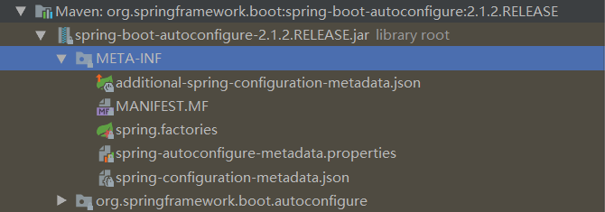
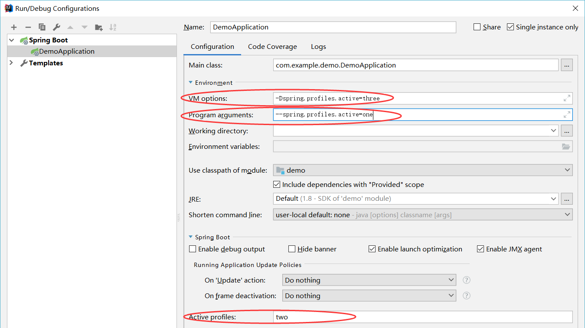
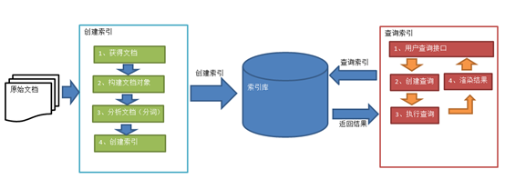
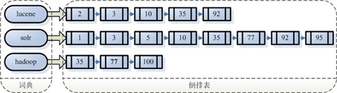
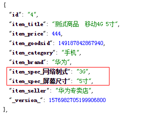

# 第一部分 Spring Boot

> 微服务：2014，martin fowler提出的架构风格（服务微化）。一个应用应该是一组小型服务，可以通过HTTP的方式互通
>
> - 单体应用：ALL IN ONE
> - 微服务：每一个功能元素最终都是一个可独立替换和独立升级的软件单元。[详细参照微服务文档](https://martinfowler.com/articles/microservices.html#MicroservicesAndSoa)

## 1 Spring Boot 简介

* 背景：J2EE笨重的开发、**繁多的配置**、**依赖管理的耗时耗力**、低下的开发效率、 **复杂的部署流程**、第三方技术**集成难度大**。Spring Boot来**简化Spring应用开发**，**约定大于配置**， 去繁从简，just run就能创建一个独立的，产品级别应用

- **优点**：
  - SpringBoot不是对Spring功能上的增强，而是提供了一种快速使用Spring的方式
  - **开箱即用**，没有代码生成，也**无需XML配置**。同时也可以修改默认值来满足特定的需求
  - 提供了一些大型项目中常见的非功能性特性，如**嵌入式服务器**、安全、指标，健康检测、外部配置等

- **核心功能**

  - **起步依赖（starter-*）**

    起步依赖本质是一个Maven项目对象模型（POM），定义了对其他库的传递依赖，这些东西加在一起即支持某项功能。

  - **自动配置**

    Spring Boot的自动配置是一个运行时（更准确地说，是应用程序启动时）的过程，考虑了众多因素，才决定Spring配置应该用哪个，不该用哪个。该过程是Spring自动完成的。


## 2 Spring Boot 入门

- 使用Spring Initializr初始化Spring Boot项目： https://start.spring.io/。IDEA中自带。

- 根据需求选择需要的依赖：这里选择 `Core->DevTools`（热部署等）和 `Web->Web`，会自动创建好各种包和起步依赖，如

  ```xml
  <!--所有的springboot工程都必须继承spring-boot-starter-parent-->
  <parent>
      <groupId>org.springframework.boot</groupId>
      <artifactId>spring-boot-starter-parent</artifactId>
      <version>2.1.2.RELEASE</version>
      <relativePath/> <!-- lookup parent from repository -->
  </parent>
  
  <!--选择JDK版本后自动配置-->
  <properties>
      <java.version>1.8</java.version>
  </properties>
  
  <dependencies>
      <!--web功能的起步依赖-->
      <dependency>
          <groupId>org.springframework.boot</groupId>
          <artifactId>spring-boot-starter-web</artifactId>
      </dependency>
      
      <!--热部署配置-->
      <dependency>
          <groupId>org.springframework.boot</groupId>
          <artifactId>spring-boot-devtools</artifactId>
          <scope>runtime</scope>
      </dependency>
      
      <!--自动添加的测试配置-->
      <dependency>
          <groupId>org.springframework.boot</groupId>
          <artifactId>spring-boot-starter-test</artifactId>
          <scope>test</scope>
      </dependency>
  </dependencies>
  
  <!--自动添加的maven插件，这个插件可将应用打包成可执行的jar包。可以通过java -jar 包名来运行应用-->
  <build>
      <plugins>
          <plugin>
              <groupId>org.springframework.boot</groupId>
              <artifactId>spring-boot-maven-plugin</artifactId>
          </plugin>
      </plugins>
  </build>
  ```

- 默认生成的Spring Boot项目

  - 主程序已经生成好了，我们只需要我们自己的逻辑

    ```java
    //声明该类是一个SpringBoot引导类
    @SpringBootApplication
    public class DemoApplication {
        //main是java程序的入口
        public static void main(String[] args) {
            //run方法 表示运行SpringBoot的引导类  run参数就是SpringBoot引导类的字节码对象
            SpringApplication.run(DemoApplication.class, args);
        }
    }
    ```

  - **`resources`**文件夹中目录结构

    - **`static`**：保存所有的静态资源； js css images；
    - **`templates`**：保存所有的模板页面；（Spring Boot默认jar包使用嵌入式的Tomcat，默认不支持JSP页面）；可以使用模板引擎（freemarker、thymeleaf）；
    - **`application.properties`**：Spring Boot应用的配置文件；可以修改一些默认设置；

- `HelloController`：必须在引导类`DemoApplication`**同级包或者子级包**中创建

  ```java
  @RestController
  public class HelloController {
  
      @RequestMapping("/hello")
      public String hello(){
          return "hello spring boot 666 999";
      }
  }
  ```

- 热部署失效：原因是因为Intellij IEDA默认情况下不会自动编译，需要对IDEA进行自动编译的设置（Debug模式没此问题）

  1. 

  2. `Shift + Ctrl + Alt + /` （Mac：`Shift + Command + Alt + /`），选择Registry...

     


## 3 Spring Boot 原理分析

### 3.1 起步依赖原理分析

按住Ctrl点击pom.xml中的spring-boot-starter-parent，跳转到了spring-boot-starter-parent的pom.xml，xml配置如下（配置了配置文件名称位置等信息）：

```xml
<parent>
    <groupId>org.springframework.boot</groupId>
    <artifactId>spring-boot-dependencies</artifactId>
    <version>2.1.2.RELEASE</version>
    <relativePath>../../spring-boot-dependencies</relativePath>
</parent>
......
```

按住Ctrl点击pom.xml中的spring-boot-dependencies，跳转到了spring-boot-dependencies的pom.xml，xml配置如下：

```xml
<properties>
    <activemq.version>5.15.8</activemq.version>
    <antlr2.version>2.7.7</antlr2.version>
    <appengine-sdk.version>1.9.71</appengine-sdk.version>
    <artemis.version>2.6.3</artemis.version>
    <aspectj.version>1.9.2</aspectj.version>
    ......
</properties>
<dependencyManagement>
    <dependencies>
        <dependency>
            <groupId>org.springframework.boot</groupId>
            <artifactId>spring-boot</artifactId>
            <version>2.1.2.RELEASE</version>
        </dependency>
        <dependency>
            <groupId>org.springframework.boot</groupId>
            <artifactId>spring-boot-test</artifactId>
            <version>2.1.2.RELEASE</version>
        </dependency>
        ......
    </dependencies>
</dependencyManagement>
<build>
    <pluginManagement>
        <plugins>
            <plugin>
                <groupId>org.apache.johnzon</groupId>
                <artifactId>johnzon-maven-plugin</artifactId>
                <version>${johnzon.version}</version>
            </plugin>
            ......
        </plugins>
    </pluginManagement>
</build>
```

从上面的spring-boot-dependencies的pom.xml中我们可以发现，一部分坐标的**版本、依赖管理、插件管理**已经定义好，所以我们的SpringBoot工程继承spring-boot-starter-parent后已经具备**版本锁定**等配置了。所以起步依赖作用就是进行**依赖的传递**。

同理spring-boot-starter-web就是将web开发要使用的spring-web、spring-webmvc等坐标进行了“打包”，这样我们的工程只要引入spring-boot-starter-web起步依赖的坐标就可以进行web开发了，同样体现了依赖传递的作用。

### 3.2 自动配置原理解析

按住Ctrl点击查看启动类MySpringBootApplication上的注解@SpringBootApplication，源码如下：

```java
@Target(ElementType.TYPE)
@Retention(RetentionPolicy.RUNTIME)
@Documented
@Inherited
@SpringBootConfiguration
@EnableAutoConfiguration
@ComponentScan(excludeFilters = {
		@Filter(type = FilterType.CUSTOM, classes = TypeExcludeFilter.class),
		@Filter(type = FilterType.CUSTOM, classes = AutoConfigurationExcludeFilter.class) })
public @interface SpringBootApplication {

	/**
	 * Exclude specific auto-configuration classes such that they will never be applied.
	 * @return the classes to exclude
	 */
	@AliasFor(annotation = EnableAutoConfiguration.class)
	Class<?>[] exclude() default {};

	... ... ...

}
```

其中，

`@ComponentScan`：组件扫描，但是仅扫描注解了`@SpringBootApplication`类所在的同级包和子级包

`@SpringBootConfiguration`：等同与`@Configuration`，既标注该类是Spring的一个配置类

`@EnableAutoConfiguration`：SpringBoot自动配置功能开启

按住Ctrl点击查看注解`@EnableAutoConfiguration`

```java
@Target(ElementType.TYPE)
@Retention(RetentionPolicy.RUNTIME)
@Documented
@Inherited
@AutoConfigurationPackage
@Import(AutoConfigurationImportSelector.class)
public @interface EnableAutoConfiguration {
	... ... ...
}
```

其中，

`@AutoConfigurationPackage`**：**自动配置包**，**如下注解的简写`@Import(AutoConfigurationPackages.Registrar.class)` Spring底层注解`@Import`，给容器中导入一个组件；导入的组件由`AutoConfigurationPackages.Registrar.class`指定，这个类有一个方法，通过注解metadata，将主配置类（`@SpringBootApplication`）所在包及下面所有子包里面的所有组件扫描到Spring容器

`@Import(AutoConfigurationImportSelector.class) `导入了`AutoConfigurationImportSelector`类

按住Ctrl点击查看`AutoConfigurationImportSelector`源码

```java
public String[] selectImports(AnnotationMetadata annotationMetadata) {
    ... ... ...
        List<String> configurations = getCandidateConfigurations(annotationMetadata,
                                                                 attributes);
    configurations = removeDuplicates(configurations);
    Set<String> exclusions = getExclusions(annotationMetadata, attributes);
    checkExcludedClasses(configurations, exclusions);
    configurations.removeAll(exclusions);
    configurations = filter(configurations, autoConfigurationMetadata);
    fireAutoConfigurationImportEvents(configurations, exclusions);
    return StringUtils.toStringArray(configurations);
}


protected List<String> getCandidateConfigurations(AnnotationMetadata metadata,
                                                  AnnotationAttributes attributes) {
    List<String> configurations = SpringFactoriesLoader.loadFactoryNames(
        getSpringFactoriesLoaderFactoryClass(), getBeanClassLoader());

    return configurations;
}
```

其中，`SpringFactoriesLoader.loadFactoryNames` 方法的作用就是从`META-INF/spring.factories`文件中读取指定类对应的全类名的列表，如xxxAutoConfiguration



`spring.factories` 文件中有关自动配置的配置信息如下：

```
org.springframework.boot.autoconfigure.web.reactive.function.client.WebClientAutoConfiguration,\
org.springframework.boot.autoconfigure.web.servlet.DispatcherServletAutoConfiguration,\
org.springframework.boot.autoconfigure.web.servlet.ServletWebServerFactoryAutoConfiguration,\
org.springframework.boot.autoconfigure.web.servlet.error.ErrorMvcAutoConfiguration,\
org.springframework.boot.autoconfigure.web.servlet.HttpEncodingAutoConfiguration,\
org.springframework.boot.autoconfigure.web.servlet.MultipartAutoConfiguration,\
......
```

上面配置文件存在大量的以Configuration为结尾的类名称，这些类就是存有自动配置信息的类，而SpringApplication在获取这些类名后再加载

我们以`ServletWebServerFactoryAutoConfiguration`为例来分析源码：

```java
@Configuration
@AutoConfigureOrder(Ordered.HIGHEST_PRECEDENCE)
@ConditionalOnClass(ServletRequest.class)
@ConditionalOnWebApplication(type = Type.SERVLET)
@EnableConfigurationProperties(ServerProperties.class)
@Import({ ServletWebServerFactoryAutoConfiguration.BeanPostProcessorsRegistrar.class,
		ServletWebServerFactoryConfiguration.EmbeddedTomcat.class,
		ServletWebServerFactoryConfiguration.EmbeddedJetty.class,
		ServletWebServerFactoryConfiguration.EmbeddedUndertow.class })
public class ServletWebServerFactoryAutoConfiguration {
	......
}
```

其中，`@EnableConfigurationProperties(ServerProperties.class) `代表加载`ServerProperties`服务器配置属性类

进入ServerProperties.class源码如下：

```java
@ConfigurationProperties(prefix = "server", ignoreUnknownFields = true)
public class ServerProperties {
    /**
	 * Server HTTP port.
	 */
    private Integer port;
    /**
	 * Network address to which the server should bind.
	 */
    private InetAddress address;
	......
}
```

其中，`prefix = "server"` 表示SpringBoot配置文件中的前缀，SpringBoot会将配置文件中以server开始的属性映射到该类的字段中。如在`application.properties`中配置`server.port=80`即可改变当前服务器的HTTP端口号


### 3.3 SpringBoot 配置信息的查询

SpringBoot的配置文件，主要的目的就是对配置信息进行修改的，但在配置时的key从哪里去查询呢？我们可以查阅[官方文档](https://docs.spring.io/spring-boot/docs/2.1.2.RELEASE/reference/htmlsingle/#common-application-properties)

常用的配置摘抄如下：

```properties
# QUARTZ SCHEDULER (QuartzProperties)
spring.quartz.jdbc.initialize-schema=embedded # Database schema initialization mode.
spring.quartz.jdbc.schema=classpath:org/quartz/impl/jdbcjobstore/tables_@@platform@@.sql # Path to the SQL file to use to initialize the database schema.
spring.quartz.job-store-type=memory # Quartz job store type.
spring.quartz.properties.*= # Additional Quartz Scheduler properties.

# ----------------------------------------
# WEB PROPERTIES
# ----------------------------------------

# EMBEDDED SERVER CONFIGURATION (ServerProperties)
server.port=8080 # Server HTTP port.
server.servlet.context-path= # Context path of the application.
server.servlet.path=/ # Path of the main dispatcher servlet.

# HTTP encoding (HttpEncodingProperties)
spring.http.encoding.charset=UTF-8 # Charset of HTTP requests and responses. Added to the "Content-Type" header if not set explicitly.

# JACKSON (JacksonProperties)
spring.jackson.date-format= # Date format string or a fully-qualified date format class name. For instance, `yyyy-MM-dd HH:mm:ss`.

# SPRING MVC (WebMvcProperties)
spring.mvc.servlet.load-on-startup=-1 # Load on startup priority of the dispatcher servlet.
spring.mvc.static-path-pattern=/** # Path pattern used for static resources.
spring.mvc.view.prefix= # Spring MVC view prefix.
spring.mvc.view.suffix= # Spring MVC view suffix.

# DATASOURCE (DataSourceAutoConfiguration & DataSourceProperties)
spring.datasource.driver-class-name= # Fully qualified name of the JDBC driver. Auto-detected based on the URL by default.
spring.datasource.password= # Login password of the database.
spring.datasource.url= # JDBC URL of the database.
spring.datasource.username= # Login username of the database.

# JEST (Elasticsearch HTTP client) (JestProperties)
spring.elasticsearch.jest.password= # Login password.
spring.elasticsearch.jest.proxy.host= # Proxy host the HTTP client should use.
spring.elasticsearch.jest.proxy.port= # Proxy port the HTTP client should use.
spring.elasticsearch.jest.read-timeout=3s # Read timeout.
spring.elasticsearch.jest.username= # Login username.
```

通过配置application.poperties 或者 application.yml 来修改SpringBoot的默认配置

```properties
server.port=8888
server.servlet.context-path=demo
```

或

```yaml
server:
  port: 8888
  servlet:
    context-path: /demo
```


#### 3.3.1 精髓

- **SpringBoot启动会加载大量的自动配置类**
- **我们看我们需要的功能有没有SpringBoot默认写好的自动配置类；**
- **我们再来看这个自动配置类中到底配置了哪些组件；（只要我们要用的组件有，我们就不需要再来配置了）**
- **给容器中自动配置类添加组件的时候，会从properties类中获取某些属性。我们就可以在配置文件中指定这些属性的值；**
- **自动配置类对应属性类**
  - xxxxAutoConfigurartion：自动配置类；给容器中添加组件
  - xxxxProperties:封装配置文件中相关属性；


#### 3.3.2 @Conditional细节（了解）

- **@Conditional派生注解（Spring注解版原生的@Conditional作用）**

- 作用：必须是@Conditional**指定的条件成立**，才给容器中**添加组件**，**配置类**里面的所有内容才**生效**

  | @Conditional扩展注解            | 作用（判断是否满足当前指定条件）                 |
  | ------------------------------- | ------------------------------------------------ |
  | @ConditionalOnJava              | 系统的java版本是否符合要求                       |
  | @ConditionalOnBean              | 容器中存在指定Bean；                             |
  | @ConditionalOnMissingBean       | 容器中不存在指定Bean；                           |
  | @ConditionalOnExpression        | 满足SpEL表达式指定                               |
  | @ConditionalOnClass             | 系统中有指定的类                                 |
  | @ConditionalOnMissingClass      | 系统中没有指定的类                               |
  | @ConditionalOnSingleCandidate   | 容器中只有一个指定的Bean，或者这个Bean是首选Bean |
  | @ConditionalOnProperty          | 系统中指定的属性是否有指定的值                   |
  | @ConditionalOnResource          | 类路径下是否存在指定资源文件                     |
  | @ConditionalOnWebApplication    | 当前是web环境                                    |
  | @ConditionalOnNotWebApplication | 当前不是web环境                                  |
  | @ConditionalOnJndi              | JNDI存在指定项                                   |

- 我们可以通过在**配置文件中启用 debug=true属性；来让控制台打印自动配置报告**，这样我们就可以很方便的知道哪些自动配置类生效；

  ```java
  =========================
  AUTO-CONFIGURATION REPORT
  =========================
  
  Positive matches:（自动配置类启用的）
  -----------------
  
     DispatcherServletAutoConfiguration matched:
        - @ConditionalOnClass found required class 'org.springframework.web.servlet.DispatcherServlet'; @ConditionalOnMissingClass did not find unwanted class (OnClassCondition)
        - @ConditionalOnWebApplication (required) found StandardServletEnvironment (OnWebApplicationCondition)
          
      
  Negative matches:（没有启动，没有匹配成功的自动配置类）
  -----------------
  
     ActiveMQAutoConfiguration:
        Did not match:
           - @ConditionalOnClass did not find required classes 'javax.jms.ConnectionFactory', 'org.apache.activemq.ActiveMQConnectionFactory' (OnClassCondition)        
  ```


## 4 Spring Boot 配置文件

SpringBoot是基于约定的，所以很多配置都有默认值，但如果想使用自己的配置替换默认配置的话就可以使用配置文件配置，SpringBoot默认会从Resources目录下加载`application*.properties`或`application*.yml`（`application*.yaml`）文件

此处不再介绍properties配置文件（键值对形式），仅介绍yml配置文件

### 4.1 yml 简介

YML文件格式是YAML (YAML Aint Markup Language)编写的文件格式，YAML是一种直观的能够被电脑识别的的数据数据序列化格式，并且容易被人类阅读，容易和脚本语言交互的，可以被支持YAML库的不同的编程语言程序导入，比如： C/C++, Ruby, Python, Java, Perl, C#, PHP等。YML文件是**以数据为核心**的，比传统的xml方式更加简洁。

YML文件的扩展名可以使用.yml或者.yaml。

### 4.2 yml 语法

基本语法：

* **`k:(空格)v`**：表示一对键值对（空格必须有）

- 以**空格**的**缩进**来控制层级关系；只要是左对齐（相同空格缩进）的一列数据，都是同一个层级的；属性和值也是**大小写敏感**


#### 4.2.1 配置字面量数据

普通的值（**数字，字符串，布尔**）

- `k: v`：字面量**直接来写**；**字符串默认不用加上单引号或者双引号**；
  - `""`：**双引号**；**不会转义**字符串里面的特殊字符；特殊字符会作为本身想表示的意思
    - name: "zhangsan \n lisi"：输出；zhangsan 换行 lisi
  - `''`：**单引号**；**会转义**特殊字符，特殊字符最终只是一个普通的字符串数据
    - name: ‘zhangsan \n lisi’：输出；zhangsan \n lisi

```yml
name: zhangsan
```


#### 4.2.2 配置对象、Map数据

```yml
teacher:
  name: zhangsan
  age: 38

student: {name: lisi , age: 18}
```


#### 4.2.3 配置数组（List、Set）数据

```yaml
city:
  - beijing
  - shanghai

province: [shangxi,hebei,guangdong]
```

```yaml
#元素是对象形式
dog:
  - name: wangcai
    age: 3
  - name: goudan
    age: 5

cat: [{name: xiaobai,age: 1},{name: xiaolv,age: 2}]
```

【注意】：value与之间的 - 之间存在一个**空格**


### 4.3 配置文件值注入

#### 4.3.1 @Value

利用在4.2中语法所写的配置

```java
@RestController
public class HelloController {

    @Value("${dog[0].name}")//数组或集合中保存对象
    private String name;

    @RequestMapping("/hello")
    public String hello(){
        return "hello spring boot "+name;
    }
}
```


#### 4.3.2 @ConfigurationProperties

通过注解`@ConfigurationProperties(prefix="配置文件中的key的前缀")`可以将配置文件中的配置自动与实体进行映射

利用在4.2中语法所写的配置。需要提供setter。但是配置的数组、List、Set不清楚怎么获取

```java
@Component
@RestController
@ConfigurationProperties(prefix = "teacher")
public class HelloController {

    private String name;

    public String getName() {
        return name;
    }

    public void setName(String name) {
        this.name = name;
    }

    @RequestMapping("/hello")
    public String hello(){
        return "hello spring boot "+name;
    }
}
```

`@ConfigurationProperties`报错Not registered via @EnableConfigurationProperties or marked as Spring component，添加了`@Component`注解后解决了

若出现以下提示，需要配置文件执行器，并在类中定义好属性和set方法后，如果在配置文件中编写配置会有提示！


```xml
<!--配置文件执行器配置-->
<dependency>
    <groupId>org.springframework.boot</groupId>
    <artifactId>spring-boot-configuration-processor</artifactId>
    <optional>true</optional>
</dependency>
```


#### 4.3.3 @Value 和 @ConfigurationProperties比较

|                      | @ConfigurationProperties | @Value     |
| -------------------- | ------------------------ | ---------- |
| 功能                 | 批量注入配置文件中的属性 | 一个个指定 |
| 松散绑定（松散语法） | 支持                     | 不支持     |
| SpEL                 | 不支持                   | 支持       |
| JSR303数据校验       | 支持                     | 不支持     |
| 复杂类型封装         | 支持                     | 不支持     |

- **松散语法绑定**：last_name = last-name = lastName 他们取的值都是相同的
- 配置文件yml还是properties他们都能获取到值，怎么选择呢？
  - 若我们只是在某个业务逻辑中需要**获取**一下**配置文件**中的**某项值**，使用@Value；
  - 若我们专门编写了一个javaBean来和配置文件**映射**，我们就直接使用@ConfigurationProperties


#### 4.3.4 @PropertySource

- @**PropertySource**：加载**指定的配置文件**，由于@ConfigurationProperties(prefix = "person")默认从全局配置文件中获取值；

  ```java
  /**
   * 将配置文件中配置的每一个属性的值，映射到这个组件中
   * @ConfigurationProperties：告诉SpringBoot将本类中的所有属性和配置文件中相关的配置进行绑定；
   *      prefix = "person"：配置文件中哪个下面的所有属性进行一一映射
   *
   * 只有这个组件是容器中的组件，才能容器提供的@ConfigurationProperties功能；
   */
  @PropertySource(value = {"classpath:person.properties"})
  @Component
  @ConfigurationProperties(prefix = "person")
  public class Person {
  
      private String lastName;
      private Integer age;
      private Boolean boss;
  ```

  

#### 4.3.5 @Configuration 和 @Bean

* @ImportResource：**导入Spring的配置文件**，如beans.xml，加载bean，让配置文件里面的内容生效

  - Spring Boot里面没有Spring的配置文件，我们自己编写的配置文件，也不能自动识别；

    想让Spring的配置文件生效，加载进来；@ImportResource标注在一个配置类上

  ```xml
  <bean id="helloService" class="com.cuzz.springboot.service.HelloService"></bean>
  ```

  ```java
  @ImportResource(locations = {"classpath:beans.xml"})
  @SpringBootApplication
  public class SpringbootApplication {
  
  	public static void main(String[] args) {
  		SpringApplication.run(SpringbootApplication.class, args);
  	}
  }
  ```

* 还是**写配置类吧**！利用@Configuration和@Bean

  ```java
  @Configuration
  public class MyAppConfig {
      // 将方法的返回值添加到容器中；容器中这个组件默认的id就是方法名
      @Bean
      public HelloService helloService02(){
          System.out.println("配置类@Bean给容器中添加组件了...");
          return new HelloService();
      }
  }
  ```

  

### 4.4 配置文件占位符

- 随机数

  ```yaml
  ${random.value}
  ${random.int}
  ${random.long}
  ${random.int(10)}
  ${random.int[1024,65536]}
  ```

- **占位符获取之前配置的值**，如果没有可以使用**:**指定**默认值**

  ```properties
  person.last-name=张三${random.uuid}
  person.age=${random.int}
  # 没有取到:后面是默认值
  person.dog.name=${person.hello:hello}_dog
  ```


### 4.5 Profile

Profile是Spring对**不同环境（开发、测试、上线等）提供不同配置功能**的支持，可以通过激活、 指定参数等方式快速切换环境

#### 4.5.1 多Profile文件

- 我们在主配置文件编写的时候，文件名可以是 application-{profile}.properties/yml，{profile}名任起
  - 默认使用application.properties的配置；

#### 4.5.2 yml支持多文档块方式

```yaml
server:
  port: 8081
spring:
  profiles:
    active: pro  #指定激活哪个环境，不设置则为这个默认的

---
server:
  port: 8083
spring:
  profiles: dev  #指定属于哪个环境

---

server:
  port: 8084
spring:
  profiles: pro  #指定属于哪个环境
```

- 若文档块都没有指定环境，则**默认使用最后一个**
- 若**某个文档块没有指定环境，则默认使用那个**，**一般第一个不指定环境**

#### 4.5.3 激活指定profile

- 在**默认配置文件中指定** spring.profiles.**active**=dev

- **命令行参数**

  ```shell
  java -jar spring-boot-02-config-0.0.1-SNAPSHOT.jar --spring.profiles.active=dev
  ```

- **虚拟机参数**

  ```
  -Dspring.profiles.active=dev
  ```

  在IDEA中也可以配置，以下三者任选其一，但权限 Program arguments > Active profiles > VM options

  


### 4.6 配置文件加载位置及顺序（了解）

> 起步依赖里好像不是这样？？？

- Spring Boot启动会扫描以下位置的application.properties/yml文件作为Spring boot的默认配置文件

  - –file:./config/     ——项目目录下的config

  - –file:./                ——项目目录下

  - –classpath:/config/     ——resources目录下的config

  - –classpath:/                ——resources目录下

    **优先级由高到底**，**高**优先级的配置会**覆盖低**优先级的配置；SpringBoot会从这四个位置全部加载主配置文件；**互补配置**；

- 我们还可以通过**spring.config.location**来**改变默认的配置文件位置**

  - 用于运维时，**项目打包好以后，我们可以使用命令行参数的形式，启动项目的时候来指定配置文件的新位置；指定配置文件和默认加载的这些配置文件共同起作用形成互补配置；**

    ```shell
    java -jar spring-boot-02-config-02-0.0.1-SNAPSHOT.jar --spring.config.location=G:/application.properties
    ```

------

> 所有支持的配置加载来源[查看这里](https://docs.spring.io/spring-boot/docs/2.0.6.RELEASE/reference/htmlsingle/#boot-features-external-config)第24节 Externalized Configuration

**SpringBoot也可以从以下位置加载配置； 优先级从高到低；高优先级的配置覆盖低优先级的配置，所有的配置会形成互补配置**

1. **命令行参数**：所有的配置都可以在命令行上进行指定。多个配置用空格分开； --配置项=值

   ```shell
   java -jar spring-boot-02-config-02-0.0.1-SNAPSHOT.jar --server.port=8087 --server.context-path=/abc
   ```

2. 来自java:comp/env的JNDI属性

3. Java系统属性（System.getProperties()）

4. 操作系统环境变量

5. RandomValuePropertySource配置的random.*属性值

**由jar包外向jar包内进行寻找**

**优先加载带profile**

1. **jar包外部的application-{profile}.properties或application.yml(带spring.profile)配置文件**
2. **jar包内部的application-{profile}.properties或application.yml(带spring.profile)配置文件**

**再来加载不带profile**

1. **jar包外部的application.properties或application.yml(不带spring.profile)配置文件**
2. **jar包内部的application.properties或application.yml(不带spring.profile)配置文件**
3. @Configuration注解类上的@PropertySource
4. 通过SpringApplication.setDefaultProperties指定的默认属性


## 5 Spring Boot 集成

### 5.1 SpringBoot集成Mybatis

#### 5.1.1 起步依赖

使用Spring Initializr添加 DevTools、Web、MySQL、**MyBatis**依赖

```xml
<!-- MySQL连接驱动 -->
<dependency>
    <groupId>mysql</groupId>
    <artifactId>mysql-connector-java</artifactId>
    <scope>runtime</scope>
</dependency>
<!--mybatis起步依赖-->
<dependency>
    <groupId>org.mybatis.spring.boot</groupId>
    <artifactId>mybatis-spring-boot-starter</artifactId>
    <version>2.0.0</version>
</dependency>
```

#### 5.1.2 数据库连接和MyBatis配置

在application.properties/yml中添加数据库的连接信息、Spring Boot 集成MyBatis的配置

```properties
#数据库连接信息
spring.datasource.driverClassName=com.mysql.cj.jdbc.Driver
spring.datasource.url=jdbc:mysql://localhost:3308/test?serverTimezone=GMT%2B8&useSSL=false
spring.datasource.username=root
spring.datasource.password=w111151

#spring集成Mybatis环境
#pojo别名扫描包
mybatis.type-aliases-package=com.example.domain
#加载Mybatis映射文件
mybatis.mapper-locations=classpath:mapper/*Mapper.xml
```

```yaml
#数据库连接信息
spring:
  datasource:
    driver-class-name: com.mysql.cj.jdbc.Driver
    url: jdbc:mysql://localhost:3308/test?serverTimezone=GMT%2B8&useSSL=false
    username: root
    password: w111151

#spring集成Mybatis环境
mybatis:
  #pojo别名扫描包
  type-aliases-package: com.example.domain
  #加载Mybatis映射文件
  mapper-locations: classpath:mapper/*Mapper.xml
```

#### 5.1.3 创建user表对应的实体类

在test数据库中创建user表

```sql
-- ----------------------------
-- Table structure for `user`
-- ----------------------------
DROP TABLE IF EXISTS `user`;
CREATE TABLE `user` (
  `id` int(11) NOT NULL AUTO_INCREMENT,
  `username` varchar(50) DEFAULT NULL,
  `password` varchar(50) DEFAULT NULL,
  `name` varchar(50) DEFAULT NULL,
  PRIMARY KEY (`id`)
) ENGINE=InnoDB AUTO_INCREMENT=10 DEFAULT CHARSET=utf8;

-- ----------------------------
-- Records of user
-- ----------------------------
INSERT INTO `user` VALUES ('1', 'zhangsan', '123', '张三');
INSERT INTO `user` VALUES ('2', 'lisi', '123', '李四');
```

com.example.domain.User

```java
public class User {
    // 主键
    private Long id;
    // 用户名
    private String username;
    // 密码
    private String password;
    // 姓名
    private String name;
  
    //此处省略getter和setter方法 .. ..
    
}
```

#### 5.1.4 编写Mapper接口

com.example.mapper.UserMapper

```java
@Mapper
public interface UserMapper {
	public List<User> queryUserList();
}
```

注意：`@Mapper`标记该类是一个mybatis的mapper接口，**可以被spring boot自动扫描到spring上下文中**

#### 5.1.5 配置Mapper映射文件

在src\main\resources\mapper路径下加入UserMapper.xml配置文件

```xml
<?xml version="1.0" encoding="utf-8" ?>
<!DOCTYPE mapper PUBLIC "-//mybatis.org//DTD Mapper 3.0//EN" "http://mybatis.org/dtd/mybatis-3-mapper.dtd" >
<mapper namespace="com.itheima.mapper.UserMapper">
    <select id="queryUserList" resultType="user">
        select * from user
    </select>
</mapper>
```

#### 5.1.6 编写测试Controller

com.example.controller.UserController

```java
@RestController
public class UserController {

    @Autowired
    private UserMapper userMapper;//报错，没有此类型的bean。但是可以使用，在运行期会创建好bean

    @RequestMapping("/queryUser")
    public List<User> queryUser() {
        List<User> users = userMapper.queryUserList();
        return users;
    }
}
```

测试略


### 5.2 SpringBoot集成JUnit

#### 5.2.1 添加JUnit的起步依赖

一般使用Spring Initializr添加Web依赖后会自动导入**JUnit**起步依赖

```xml
<!--测试的起步依赖-->
<dependency>
    <groupId>org.springframework.boot</groupId>
    <artifactId>spring-boot-starter-test</artifactId>
    <scope>test</scope>
</dependency>
```

#### 5.2.2 编写测试类

```java
@RunWith(SpringRunner.class)
@SpringBootTest(classes = SpringbootMybatisApplication.class)//Spring Boot 引导类
public class MapperTest {

    @Autowired
    private UserMapper userMapper;

    @Test
    public void test() {
        List<User> users = userMapper.queryUserList();
        System.out.println(users);
    }

}
```

其中，

SpringRunner继承自SpringJUnit4ClassRunner，使用哪一个Spring提供的测试测试引擎都可以

```java
public final class SpringRunner extends SpringJUnit4ClassRunner 
```

@SpringBootTest的属性指定的是引导类的字节码对象


### 5.3 Spring Boot集成Spring Data JPA

#### 5.3.1 起步依赖

使用Spring Initializr添加 DevTools、Web、MySQL、**JPA**依赖

```xml
<!-- MySQL连接驱动 -->
<dependency>
    <groupId>mysql</groupId>
    <artifactId>mysql-connector-java</artifactId>
    <scope>runtime</scope>
</dependency>
<!-- Spring Data JPA的起步依赖 -->
<dependency>
    <groupId>org.springframework.boot</groupId>
    <artifactId>spring-boot-starter-data-jpa</artifactId>
</dependency>
```

#### 5.3.3 数据库连接和JPA配置

在application.properties/yml中添加数据库的连接信息、Spring Boot 集成Spring Data JPA的配置

```properties
#DB Configuration:
spring.datasource.driverClassName=com.mysql.cj.jdbc.Driver
spring.datasource.url=jdbc:mysql://localhost:3308/test?serverTimezone=GMT%2B8&useSSL=false
spring.datasource.username=root
spring.datasource.password=w111151

#JPA Configuration:
spring.jpa.database=MySQL
spring.jpa.show-sql=true
spring.jpa.generate-ddl=true
spring.jpa.hibernate.ddl-auto=update

#Configure Hibernate Naming Strategy，瞎选的，不知道区别

spring.jpa.hibernate.naming.physical-strategy=org.hibernate.boot.model.naming.PhysicalNamingStrategyStandardImpl
spring.jpa.hibernate.naming.implicit-strategy=org.hibernate.boot.model.naming.ImplicitNamingStrategyComponentPathImpl

#Hibernate 4 naming strategy fully qualified name. Not supported with Hibernate 5
#spring.jpa.hibernate.naming_strategy=org.hibernate.cfg.ImprovedNamingStrategy
```

#### 5.3.4 创建实体配置实体

```java
@Entity
public class User {
    // 主键
    @Id
    @GeneratedValue(strategy = GenerationType.IDENTITY)
    //@Column可以省略，采用默认配置，若要具体配置，需要写上
    private Long id;
    // 用户名
    private String username;
    // 密码
    private String password;
    // 姓名
    private String name;
 
    //此处省略setter和getter方法... ...
}
```

#### 5.3.5 编写UserRepository

```java
public interface UserRepository extends JpaRepository<User,Long>, JpaSpecificationExecutor<User> {
}
```

#### 5.3.6 编写测试类

```java
@RunWith(SpringRunner.class)
@SpringBootTest(classes = SpringbootJpaApplication.class)
public class JpaTest {

    @Autowired
    private UserRepository userRepository;

    @Test
    public void testJpa(){
        List<User> all = userRepository.findAll();
        System.out.println(all);
    }
}
```

注意：如果是jdk9，执行报错如下：

/img/17.png)

原因：jdk缺少相应的jar

解决方案：手动导入对应的maven坐标，如下：

```xml
<!--jdk9需要导入如下坐标-->
<dependency>
    <groupId>javax.xml.bind</groupId>
    <artifactId>jaxb-api</artifactId>
    <version>2.3.0</version>
</dependency>
```


### 5.4 SpringBoot集成Spring Data Redis

#### 5.4.1 起步依赖

使用Spring Initializr添加 DevTools、Web、MySQL、JPA、**Redis**依赖

```xml
<!-- 配置使用redis启动器 -->
<dependency>
    <groupId>org.springframework.boot</groupId>
    <artifactId>spring-boot-starter-data-redis</artifactId>
</dependency>
```

#### 5.4.2 配置redis的连接信息

```properties
#Redis
spring.redis.host=127.0.0.1
spring.redis.port=6379
```

#### 5.4.3 注入RedisTemplate测试redis操作

```java
@RunWith(SpringRunner.class)
@SpringBootTest(classes = SpringbootJpaApplication.class)
public class RedisTest {

    @Autowired
    private RedisTemplate<String,String> redisTemplate;

    @Autowired
    private UserRepository userRepository;

    @Test
    public void test() throws JsonProcessingException {
        //1.从Redis中获取数据，一般为JSON字符串
        String userListJson = redisTemplate.boundValueOps("user.findAll").get();
        //2.判断Redis中是否存在该数据
        //2.1不存在，从数据库查，并保存到Redis
        if (userListJson==null){
            List<User> all = userRepository.findAll();
            //转为JSON字符串，Web环境默认导入了Jackson
            ObjectMapper objectMapper = new ObjectMapper();
            userListJson = objectMapper.writeValueAsString(all);
            redisTemplate.boundValueOps("user.findAll").set(userListJson);
            System.out.println("从数据库查询");
        } else {
            //2.2存在
            System.out.println("从Redis查询");
        }
        System.out.println(userListJson);
    }
}
```


## 9 Spring Boot 日志

> 也可查看Spring Boot 官方文档第26节，[这里](https://docs.spring.io/spring-boot/docs/2.0.6.RELEASE/reference/htmlsingle/#boot-features-logging)

### 3.1 日志框架

- 小张开发一个大型系统；

​	1、System.out.println("")；将关键数据打印在控制台；去掉？写在一个文件？

​	2、框架来记录系统的一些运行时信息；日志框架 ； zhanglogging.jar；

​	3、高大上的几个功能？异步模式？自动归档？xxxx？ zhanglogging-good.jar；

​	4、将以前框架卸下来？换上新的框架，重新修改之前相关的API；zhanglogging-prefect.jar；

​	5、借鉴JDBC---数据库驱动；

​		写了一个统一的接口层；日志门面（日志的一个抽象层）；logging-abstract.jar；

​		给项目中导入具体的日志实现就行了；我们之前的日志框架都是实现的抽象层；

- 市面上的日志框架
  JUL、JCL、Jboss-logging、logback、log4j、log4j2、slf4j....

  | 日志门面 （日志的抽象层）                                    | 日志实现                                                |
  | ------------------------------------------------------------ | ------------------------------------------------------- |
  | ~~JCL（Jakarta Commons Logging）~~  SLF4j（Simple Logging Facade for Java）~~**jboss-logging**~~ | Log4j     JUL（java.util.logging） Log4j2   **Logback** |

- 左边选一个门面（抽象层）：SLF4J。右边来选一个实现：Logback；

- SpringBoot：底层是Spring框架，Spring框架默认是用JCL；

  - ==**SpringBoot选用 SLF4j和logback；**==


### 3.2 SLF4j使用

#### 3.2.1 如何在系统中使用SLF4j

- 以后开发的时候，日志记录方法的调用，不应该来直接调用日志的实现类，而是**调用日志抽象层里面的方法**；

  - 给系统里面导入slf4j的jar和 logback的实现jar

  ```java
  import org.slf4j.Logger;
  import org.slf4j.LoggerFactory;
  
  public class HelloWorld {
    public static void main(String[] args) {
      Logger logger = LoggerFactory.getLogger(HelloWorld.class);
      logger.info("Hello World");
    }
  }
  ```


- 每一个日志的实现框架都有自己的配置文件。使用slf4j**配置文件还是做成日志实现框架自己本身的配置文件；**


#### 3.2.2 遗留问题

- a系统（slf4j+logback）: Spring（commons-logging）、Hibernate（jboss-logging）、MyBatis、xxxx
- **统一日志记录**，即**如何让系统中所有的日志都统一到slf4j？**
  - ==**将系统中其他日志框架先排除出去；**==
  - ==**用中间包来替换原有的日志框架；**==
  - ==**我们导入slf4j其他的实现**==


### 3.3 SpringBoot日志关系

```xml
<dependency>
    <groupId>org.springframework.boot</groupId>
    <artifactId>spring-boot-starter</artifactId>
</dependency>
```

SpringBoot使用它来做日志功能：

```xml
<dependency>
    <groupId>org.springframework.boot</groupId>
    <artifactId>spring-boot-starter-logging</artifactId>
</dependency>
```

**底层依赖关系如下**

- Spring Boot 1.5.10如下：


- SpringBoot 2.0后底层依赖如下：


- **总结 Spring Boot 1.5.10**

  - SpringBoot底层也是使用slf4j+logback的方式进行日志记录

  - SpringBoot也把其他的日志都替换成了slf4j

  - 中间替换包细节如下截取部分：

    ```java
    @SuppressWarnings("rawtypes")
    public abstract class LogFactory {
    
        static String UNSUPPORTED_OPERATION_IN_JCL_OVER_SLF4J = "http://www.slf4j.org/codes.html#unsupported_operation_in_jcl_over_slf4j";
    
        static LogFactory logFactory = new SLF4JLogFactory();
    ```

    Spring Boot 1.5.10中的中间转换包如下，2.0后改了名字，实现的名称也不同，不放图了

    

  - **若要引入其他框架**？一定要把这个框架的**默认日志依赖移除**掉。例如Spring框架用的是commons-logging。但是Spring Boot2.0后的没有这个，因为底层不再依赖它

    ```xml
    <dependency>
        <groupId>org.springframework</groupId>
        <artifactId>spring-core</artifactId>
        <exclusions>
            <exclusion>
                <groupId>commons-logging</groupId>
                <artifactId>commons-logging</artifactId>
            </exclusion>
        </exclusions>
    </dependency>
    ```

==**SpringBoot能自动适配所有的日志，而且底层使用slf4j+logback的方式记录日志，引入其他框架的时候，只需要把这个框架依赖的日志框架排除掉即可；**==

- Spring Boot 2.0开始使用 Commons Logging 进行所有内部日志记录，但保留底层日志实现。 为Java Util Logging，Log4J2，和 Logback提供了默认配置。默认情况下，如果使用“Starters”，则使用Logback进行日志记录

### 3.4 日志使用

#### 3.4.1 默认配置

- SpringBoot默认帮我们配置好了日志

  ```java
  //记录器
  Logger logger = LoggerFactory.getLogger(getClass());
  
  @Test
  public void contextLoads() {
  
      //日志的级别；由低到高 
        trace<debug<info<warn<error
      //可以调整输出的日志级别；日志就只会在这个级别以以后的高级别生效
      logger.trace("系统详细信息, 主要开发人员用, 一般来说线上系统可以认为是临时输出, 而且随时可以通过开关将其关闭");
      logger.debug("主要给开发人员看,开发环境中使用");
      //SpringBoot默认给我们使用的是info级别的，没有指定级别的就用SpringBoot默认规定的级别；root级别
      logger.info("重要的业务逻辑处理完成. 在理想情况下, INFO的日志信息要能让高级用户和系统管理员理解, 并从日志信息中能知道系统当前的运行状态");
      logger.warn("系统能继续运行, 但是必须引起关注");
      logger.error("系统发生了严重的错误, 必须马上进行处理, 否则系统将无法继续运行");
  
  }
  ```

  ```java
  日志输出格式：
  		%d表示日期时间，
  		%thread表示线程名，
  		%-5level：级别从左显示5个字符宽度
  		%logger{50} 表示logger名字最长50个字符，否则按照句点分割。 
  		%msg：日志消息，
  		%n是换行符
  
  %d{yyyy-MM-dd HH:mm:ss.SSS} [%thread] %-5level %logger{50} - %msg%n
  ```

- SpringBoot修改日志的默认配置

  ```properties
  #指定某个包的日志记录级别
  logging.level.com.itcast=trace
  
  # 不指定路径在当前项目下生成springboot.log日志
  # 可以指定完整的路径；
  logging.file=G:/springboot.log
  
  # 在当前磁盘的根路径下创建spring文件夹和里面的log文件夹；使用 spring.log 作为默认文件
  logging.path=/spring/log
  
  # 在控制台输出的日志的格式
  logging.pattern.console=%d{yyyy-MM-dd} [%thread] %-5level %logger{50} - %msg%n
  # 指定文件中日志输出的格式
  logging.pattern.file=%d{yyyy-MM-dd} === [%thread] === %-5level === %logger{50} ==== %msg%n
  ```

  | logging.file               | logging.path | Example  | Description                        |
  | -------------------------- | ------------ | -------- | ---------------------------------- |
  | (none)                     | (none)       |          | 只在控制台输出                     |
  | 指定文件名，可指定完整路径 | (none)       | my.log   | 输出日志到my.log文件               |
  | (none)                     | 指定目录     | /var/log | 输出到指定目录的 spring.log 文件中 |

#### 3.4.2 指定配置

- 给**类路径**下放上**每个日志框架自己的配置文件**即可；SpringBoot就不使用他默认配置的了

  | Logging System         | Customization                                                |
  | ---------------------- | ------------------------------------------------------------ |
  | Logback                | `logback-spring.xml`, `logback-spring.groovy`, `logback.xml` or `logback.groovy` |
  | Log4j2                 | `log4j2-spring.xml` or `log4j2.xml`                          |
  | JDK(Java Util Logging) | `logging.properties`                                         |

  - logback.xml：直接就被日志框架识别了；

    **logback-spring.xml**：**推荐！**日志框架就不直接加载日志的配置项，**由SpringBoot解析日志配置**，可以使用SpringBoot的高级Profile功能

    ```xml
    <springProfile name="staging">
        <!-- configuration to be enabled when the "staging" profile is active -->
      	可以指定某段配置只在某个环境下生效
    </springProfile>
    ```

    如下：

    ```xml
    <appender name="stdout" class="ch.qos.logback.core.ConsoleAppender">
        <layout class="ch.qos.logback.classic.PatternLayout">
            <springProfile name="dev">
                <pattern>%d{yyyy-MM-dd HH:mm:ss.SSS} ----> [%thread] ---> %-5level %logger{50} - %msg%n</pattern>
            </springProfile>
            <springProfile name="!dev">
                <pattern>%d{yyyy-MM-dd HH:mm:ss.SSS} ==== [%thread] ==== %-5level %logger{50} - %msg%n</pattern>
            </springProfile>
        </layout>
    </appender>
    ```

    如果使用logback.xml作为日志配置文件，还要使用profile功能，会有以下错误`no applicable action for [springProfile]`

### 3.5 切换日志框架

- 可以按照slf4j的日志适配图，进行相关的切换

  - slf4j+log4j的方式（没意义）

    ```xml
    <dependency>
        <groupId>org.springframework.boot</groupId>
        <artifactId>spring-boot-starter-web</artifactId>
        <exclusions>
            <exclusion>
                <artifactId>logback-classic</artifactId>
                <groupId>ch.qos.logback</groupId>
            </exclusion>
            <exclusion>
                <artifactId>log4j-over-slf4j</artifactId>
                <groupId>org.slf4j</groupId>
            </exclusion>
        </exclusions>
    </dependency>
    
    <dependency>
        <groupId>org.slf4j</groupId>
        <artifactId>slf4j-log4j12</artifactId>
    </dependency>
    ```

  - 切换为log4j2

    ```xml
    <dependency>
        <groupId>org.springframework.boot</groupId>
        <artifactId>spring-boot-starter-web</artifactId>
        <exclusions>
            <exclusion>
                <artifactId>spring-boot-starter-logging</artifactId>
                <groupId>org.springframework.boot</groupId>
            </exclusion>
        </exclusions>
    </dependency>
    
    <dependency>
        <groupId>org.springframework.boot</groupId>
        <artifactId>spring-boot-starter-log4j2</artifactId>
    </dependency>
    ```


## 4 Web开发

### 4.1 简介

- 使用SpringBoot
  1. **创建SpringBoot应用，选中我们需要的模块**
  2. **SpringBoot已经默认将这些场景配置好了，只需要在配置文件中指定少量配置就可以运行起来**
  3. **自己编写业务代码**
- 最根本需要理解**自动配置原理？**<a href="#autoConfigure">见2.8节</a>
  - 这个场景SpringBoot帮我们配置了什么？能不能修改？能修改哪些配置？能不能扩展？xxx
    - xxxxAutoConfiguration：帮我们给容器中自动配置组件
    - xxxxProperties:配置类来封装配置文件的内容；


### 4.2 SpringBoot对静态资源的映射规则

```java
@ConfigurationProperties(prefix = "spring.resources", ignoreUnknownFields = false)
public class ResourceProperties implements ResourceLoaderAware {
  //可以设置和静态资源有关的参数，缓存时间等
```

- **WebMvcAuotConfiguration.java**： SpringMVC相关配置都在这个类中

```java
//org\springframework\boot\autoconfigure\web\servlet\WebMvcAutoConfiguration.java
		@Override
		public void addResourceHandlers(ResourceHandlerRegistry registry) {
			if (!this.resourceProperties.isAddMappings()) {
				logger.debug("Default resource handling disabled");
				return;
			}
            //webjars/映射
			Integer cachePeriod = this.resourceProperties.getCachePeriod();
			if (!registry.hasMappingForPattern("/webjars/**")) {
				customizeResourceHandlerRegistration(
						registry.addResourceHandler("/webjars/**")
								.addResourceLocations(
										"classpath:/META-INF/resources/webjars/")
						.setCachePeriod(cachePeriod));
			}
			String staticPathPattern = this.mvcProperties.getStaticPathPattern();
          	// 静态资源文件夹映射
			if (!registry.hasMappingForPattern(staticPathPattern)) {
				customizeResourceHandlerRegistration(
						registry.addResourceHandler(staticPathPattern)
								.addResourceLocations(
										this.resourceProperties.getStaticLocations())
						.setCachePeriod(cachePeriod));
			}
		}

         // 配置欢迎页映射
		@Bean
		public WelcomePageHandlerMapping welcomePageHandlerMapping(
				ResourceProperties resourceProperties) {
			return new WelcomePageHandlerMapping(resourceProperties.getWelcomePage(),
					this.mvcProperties.getStaticPathPattern());
		}

         // 配置喜欢的图标
		@Configuration
		@ConditionalOnProperty(value = "spring.mvc.favicon.enabled", matchIfMissing = true)
		public static class FaviconConfiguration {

			private final ResourceProperties resourceProperties;

			public FaviconConfiguration(ResourceProperties resourceProperties) {
				this.resourceProperties = resourceProperties;
			}

			@Bean
			public SimpleUrlHandlerMapping faviconHandlerMapping() {
				SimpleUrlHandlerMapping mapping = new SimpleUrlHandlerMapping();
				mapping.setOrder(Ordered.HIGHEST_PRECEDENCE + 1);
              	 // 所有  **/favicon.ico 
				mapping.setUrlMap(Collections.singletonMap("**/favicon.ico",
						faviconRequestHandler()));
				return mapping;
			}

			@Bean
			public ResourceHttpRequestHandler faviconRequestHandler() {
				ResourceHttpRequestHandler requestHandler = new ResourceHttpRequestHandler();
				requestHandler
						.setLocations(this.resourceProperties.getFaviconLocations());
				return requestHandler;
			}

		}
```


- ==所有**/webjars/\****访问 ，都去 **classpath:/META-INF/resources/webjars/** 找资源==

  - `webjars`：以jar包的方式引入静态资源；[进官网查看详细信息](<http://www.webjars.org/>)

  - 引入依赖

    ```xml
    <!--引入jquery-webjar;在访问的时候只需要写webjars下面资源的名称即可-->
    <dependency>
        <groupId>org.webjars</groupId>
        <artifactId>jquery</artifactId>
        <version>3.3.1-1</version>
    </dependency>
    ```

    

  - 访问：localhost:8080/webjars/jquery/3.3.1-1/jquery.js

- =="/**" 访问当前项目的任何资源，都去（静态资源的文件夹里）找映射==

  ```java
  "classpath:/META-INF/resources/", 
  "classpath:/resources/",
  "classpath:/static/", 
  "classpath:/public/" 
  "/"：当前项目的根路径
  ```

  - 访问：localhost:8080/abc === 去静态资源文件夹里面找abc

- ==**欢迎页**：静态资源文件夹下的所有index.html页面；被"/**"映射==

  - 访问：localhost:8080/，找index页面

- ==**图标**：所有的 **/favicon.ico 都是在静态资源文件下找==


### 4.3 模板引擎

JSP、Velocity、Freemarker、Thymeleaf（Spring推荐，语法更简单，功能更强大）


#### 4.3.1 引入Thymeleaf

- [官方文档查看更详细内容](https://www.thymeleaf.org/)

  ```xml
  <dependency>
      <groupId>org.springframework.boot</groupId>
      <artifactId>spring-boot-starter-thymeleaf</artifactId>
  </dependency>
  ```


#### 4.3.2 Thymeleaf使用

```java
@ConfigurationProperties(prefix = "spring.thymeleaf")
public class ThymeleafProperties {

    private static final Charset DEFAULT_ENCODING = Charset.forName("UTF-8");

    private static final MimeType DEFAULT_CONTENT_TYPE = MimeType.valueOf("text/html");

    public static final String DEFAULT_PREFIX = "classpath:/templates/";

    public static final String DEFAULT_SUFFIX = ".html";
```

- 只要我们把HTML页面**放在classpath:/templates/**，thymeleaf就能自动渲染；

- 使用：

  - 导入thymeleaf的名称空间，才能有语法提示

    ```html
    <html lang="en" xmlns:th="http://www.thymeleaf.org">
    ```

  - 使用thymeleaf语法

    ```html
    <!DOCTYPE html>
    <html lang="en" xmlns:th="http://www.thymeleaf.org">
        <head>
            <meta charset="UTF-8">
            <title>Title</title>
        </head>
        <body>
            <h1>成功！</h1>
            <!--th:text 将div里面的文本内容设置为 -->
            <div th:text="${hello}">这是显示欢迎信息</div>
        </body>
    </html>
    ```

#### 4.3.3 Thymeleaf语法

- `th:text`：改变当前元素里面的文本内容。**th:任意html属性**：来替换原生属性的值


* `th:each`：遍历

  ```html
  <tr th:each="p : ${pageInfo.list}">
      <td th:text="${p.id}"></td>
      <td th:text="${p.name}"></td>
  ```

- 

- Simple expressions:（表达式语法）

  - **==Variable Expressions==: `${...}`**：获取变量值；底层是OGNL；

    - 获取对象的属性、调用方法。
    - 使用内置的基本对象：
      - `${#ctx}` : the context object.
      - `${#vars}`: the context variables.
      - `${#locale}` : the context locale. 如`${#locale.country}`
      - `${#request}` : (only in Web Contexts) the HttpServletRequest object.
      - `${#response}` : (only in Web Contexts) the HttpServletResponse object.
      - `${#session}`#session : (only in Web Contexts) the HttpSession object.
      - `${#servletContext}` : (only in Web Contexts) the ServletContext object.
    - 使用内置的**工具**对象（同上，放在`${...}`里）：
      - `#execInfo` : information about the template being processed.
      - `#messages` : methods for obtaining externalized messages inside variables expressions, in the same way as they would be obtained using #{…} syntax.
      - `#uris` : methods for escaping parts of URLs/URIs
      - `#conversions` : methods for executing the configured conversion service (if any).
      - `#dates` : methods for java.util.Date objects: formatting, component extraction, etc.
      - `#calendars` : analogous to #dates , but for java.util.Calendar objects.
      - `#numbers` : methods for formatting numeric objects.
      - `#strings` : methods for String objects: contains, startsWith, prepending/appending, etc.
      - `#objects` : methods for objects in general.
      - `#bools` : methods for boolean evaluation.
      - `#arrays` : methods for arrays.
      - `#lists` : methods for lists.
      - `#sets` : methods for sets.
      - `#maps` : methods for maps.
      - `#aggregates` : methods for creating aggregates on arrays or collections.
      - `#ids` : methods for dealing with id attributes that might be repeated (for example, as a result of an iteration).

  - Selection Variable Expressions: `*{...}`：选择表达式：和`${...}`在功能上是一样；配合`th:object`使用如下：

    ```html
    <div th:object="${session.user}">
        <p>Name: <span th:text="*{firstName}">Sebastian</span>.</p>	<!--${session.user.firstName}-->
        <p>Surname: <span th:text="*{lastName}">Pepper</span>.</p>	<!--${session.user.lastName}-->
        <p>Nationality: <span th:text="*{nationality}">Saturn</span>.</p>	<!--${session.user.nationality}-->
    </div>
    ```

  - Message Expressions: `#{...}`：获取国际化内容

  - Link URL Expressions: `@{...}`：定义URL；

  - Fragment Expressions: `~{...}`：片段引用表达式

- Literals（字面量）

  - Text literals: 'one text' , 'Another one!' ,…
  - Number literals: 0 , 34 , 3.0 , 12.3 ,…
  - Boolean literals: true , false
  - Null literal: null
  - Literal tokens: one , sometext , main ,…

- Text operations:（文本操作）

  - String concatenation: +
  - Literal substitutions: |The name is ${name}|

- Arithmetic operations:（数学运算）

  - Binary operators: + , - , * , / , %
  - Minus sign (unary operator): -

- Boolean operations:（布尔运算）

  - Binary operators: and , or
  - Boolean negation (unary operator): ! , not

- Comparisons and equality:（比较运算）

  - Comparators: > , < , >= , <= ( gt , lt , ge , le )
  - Equality operators: == , != ( eq , ne )

- Conditional operators:条件运算（三元运算符）

  - If-then: (if) ? (then)
  - If-then-else: (if) ? (then) : (else)
  - Default: (value) ?: (defaultvalue)

- Special tokens:

  - No-Operation: _ 

- 


## 2 请求数据

- **@RestController**：Spring4的新注解，将类标记为控制器，其中每个方法都返回一个域对象而不是视图，这是@Controller和@ResponseBody的简写

- @**RequestMapping**、@GetMapping、@PostMapping、@PutMapping、@DeleteMapping。value中也可以用正则表达式限制类型。若不符合要求会返回4xx的错误信息，表示请求有问题

  - 当POST方法传递的是表单数据时，可在上述注解加**consumes参数**（根据请求的**Content-Type**缩小请求映射范围）

    - 设置consumes ={MediaType.MULTIPART_FORM_DATA_VALUE ,MediaType.APPLICATION_ATOM_XML_VALUE})，任选，<a href="#postman">详细区别看这里</a>。第一个可以传文件，第二个传文件慢

    - 在@PostMapping**上传文件**方法中使用**MultipartFile**接口的流保存文件

      ```java
      public void uploadFile(@RequestParam MultipartFile file) {...}
      ```

  - GET方法**下载文件**，设置**produces参数**根据**Accept**请求标头和控制器方法生成的内容类型列表来缩小请求映射

- @**PathVariable**：访问URL模板变量

- @**RequestBody**：通过HttpMessageConverter读取请求体并反序列化为Object

- @**RequestParam**：将Servlet请求参数（即查询参数或表单数据）绑定到控制器中方法的参数上，value可不写（必须和参数一致），默认required=true，可以设置为false防止异常

- @RequestHeader：将请求头绑定到控制器方法的参数上，value可不写（必须和参数一致），不区分大小写

- @CookieValue：将HTTP cookie的值绑定到控制器方法的参数上，同上。除非为了兼容老客户端，否则不用

- Authenticated：获取当前用户，直接在方法中增加参数，类型为它即可

```java
//此代码使用Spring 4的新注解@RestController，该注注解将类标记为控制器，
//其中每个方法都返回一个域对象而不是视图。 这是@Controller和@ResponseBody的简写。
@RestController
@RequestMapping(value = "/tvSeries")
public class TvSeriesController {

    /**
     * GET查询所有电视剧
     */
    @GetMapping
    public List<TvSeries> queryAll() {
        List<TvSeries> tvSeriesList = new ArrayList<>();
        tvSeriesList.add(new TvSeries(0, "天龙八部", 50, new Date()));
        tvSeriesList.add(new TvSeries(1, "笑傲江湖", 40, new Date()));
        return tvSeriesList;
    }

    /**
     * GET按id查询电视剧
     */
    @GetMapping(value = "/{id}")
    public TvSeries queryOne(@PathVariable Integer id) {

        if (id == 1) {
            return new TvSeries(0, "天龙八部", 50, new Date());
        } else if (id == 2) {
            return new TvSeries(1, "笑傲江湖", 40, new Date());
        } else
            return null;
    }

    /**
     * POST增加电视剧（没写持久层代码）
     */
    @PostMapping
    public TvSeries addOne(@RequestBody TvSeries tvSeries) {
        System.out.println(tvSeries);
        return tvSeries;
    }

    /**
     * PUT更改电视剧
     */
    @PutMapping(value = "/{id}")
  	public TvSeries updateOne(@PathVariable Integer id, @RequestBody TvSeries tvSeries) {
        if (id == 1) {
            TvSeries tvSeries1 = new TvSeries(0, "天龙八部", 50, new Date());
            tvSeries1.setName(tvSeries.getName());
            return tvSeries1;
        } else {
            return null;
        }
    }
    
    /**
     * DELETE删除电视节目
     */
    @DeleteMapping(value = "/{id}")
    public Map<String, String> deleteOne(@PathVariable Integer id, HttpServletRequest request,                                      @RequestParam(value = "deleteReason", required = false) String deleteReason) {
        Map<String, String> result = new HashMap<>();
        if (id == 0) {
            //执行删除代码
            result.put("message", "#0被" + request.getRemoteAddr() + "删除，原因：" + deleteReason);
        } else if (id == 1) {
            //不能删除这个，抛异常。spring security处理更好，之后学习
            throw new RuntimeException("#1不能删除");
        } else
            throw new ResourceNotFoundException();
        return result;
    }
    
    /**
     * MultipartFile上传文件,利用consumes您根据请求的Content-Type缩小请求映射范围
     */
    @PostMapping(value = "/{id}/file" ,consumes = MediaType.MULTIPART_FORM_DATA_VALUE)
    public void uploadFile(@PathVariable Integer id,@RequestParam MultipartFile file) throws IOException {
        file.transferTo(new File("F:\\GitHub\\Studying\\SSM\\"+file.getOriginalFilename()));
        System.out.println(id+"id上传了文件");
    }
    
    /**
     * 下载文件，根据Accept请求标头和控制器方法生成的内容类型列表来缩小请求映射，如以下示例所示：
     */
    @GetMapping(value = "/{id}/file" ,produces = MediaType.IMAGE_JPEG_VALUE)
    public byte[] downloadFile(@PathVariable Integer id) throws IOException {
        System.out.println(id+"id下载了文件");
        return IOUtils.toByteArray(new FileInputStream("target/classes/WindowsPic.jpg"));

    }
}
```


### 2.1 数据校验(Bean Validation)

- 不要相信前端传入的数据，尽量要前端少传数据

- **使用基于注解的验证**

  > JSR303 是一套JavaBean参数校验的标准，它定义了很多常用的校验注解，我们可以直接将这些注解加在我们JavaBean的属性上面，就可以在需要校验的时候进行校验了。
  >
  > Hibernate validator是Bean Validation1.0（JSR303）的一个实现
  >
  > 目前最新的Hibernate validator 6.0 是Bean Validation 2.0（JSR380，于2017年8月完成）的一个实现
  >
  > [Bean Validation官网点这里](https://beanvalidation.org/)

- Hibernate Validator包含一组基本的常用约束，这些最重要的是Bean Validation规范定义的约束。此外，Hibernate Validator还提供了有用的自定义约束。

- @**Valid**      级联验证，**确保这个对象满足校验限制**。校验的对象后**紧跟着Errors或BindingResult参数**

  ```java
  @NotNull
  private List<@Valid Image> images;//images不可为null，每个Image元素需要级联验证
  
  @NotNull
  @Size(min=1,max=10)//messages不为null，长度至少为1，最长10；
  private List<@Size(min=10) @NotNull String> messages;//每个String不为空，长度至少为10
  ```

  ```java
  @PutMapping
  public TvSeries updateOne(@Valid @RequestBody TvSeries tvSeries,BindingResult result) {
      //参数没过校验也会进入方法执行，校验结果通过result参数传递进来
      if(result.hasErrors()){
          //没通过校验
      }
  }
  ```

  <!DOCTYPE html>
  <html>
  <head>
      <style>
          tr{
              color: rgb(76, 78, 47)
          }
          tr>td:first-child{
              font-weight: bold;
              color: black;
              font-family: consolas;
      </style>
  </head>
      <body>
          <table border="3">
      <caption>注解说明表</caption>
      <tr style="background-color:#90CAF9">
         <td style="color: rgb(76, 78, 47);font-weight: normal;">注解</td>
         <td>说明</td>
         <td>支持的数据类型</td>
      </tr>
      <tr style="background-color:#69F0AE">
         <td>@Null</td>
         <td>被注释的元素必须为 null</td>
         <td rowspan="2">所有类型</td>
      </tr>
      <tr style="background-color:#69F0AE">
         <td>@NotNull</td>
         <td>被注释的元素必须不为 null</td>
      </tr>
      <tr style="background-color:#90CAF9">
         <td>@NotEmpty</td>
         <td>被注释的元素非null且非空（字符串是不是空格无所谓）</td>
         <td>CharSequence, Collection, Map and arrays</td>
      </tr>
      <tr style="background-color:#90CAF9">
         <td>@NotBlank</td>
         <td>被注释的元素非null，且必须包含至少一个非空格字符</td>
         <td>CharSequence</td>
      </tr>
      <tr style="background-color:#69F0AE">
         <td>@Pattern(regex=, flags=)</td>
         <td>被注释的字符串是否与给定的正则表达式匹配</td>
         <td>CharSequence</td>
      </tr>
      <tr style="background-color:#69F0AE">
         <td>@Email</td>
         <td>检查指定的字符序列是否是有效的电子邮件地址。 可选参数regexp和flags允许指定电子邮件必须匹配的附加正则表达式（包括正则表达式标志）</td>
         <td>CharSequence</td>
      </tr>
      <tr style="background-color:#90CAF9">
         <td>@AssertTrue</td>
         <td>被注释的元素必须为 true</td>
         <td rowspan="2">Boolean、boolean</td>
      </tr>
      <tr style="background-color:#90CAF9">
         <td>@AssertFalse</td>
         <td>被注释的元素必须为 false</td>
      </tr>
      <tr style="background-color:#69F0AE">
         <td>@DecimalMin(value=, inclusive=)</td>
         <td>当inclusive = false时，检查带注释的值是否大于指定的最小值；否则该值是否大于或等于指定的最小值。参数值是根据BigDecimal字符串表示形式的最大值的字符串表示形式</td>
         <td rowspan="3">BigDecimal，BigInteger，CharSequence，byte，short，int，long和原始类型相应包装类型</td>
      </tr>
      <tr style="background-color:#69F0AE">
         <td>@DecimalMax(value=, inclusive=)</td>
         <td>与上相反</td>
      </tr>
      <tr style="background-color:#69F0AE">
         <td>@Digits(integer=, fraction=)</td>
         <td>整数位数，小数位数必须在设置的范围内</td>
      </tr>
      <tr style="background-color:#90CAF9">
         <td>@Size(min=, max=)</td>
         <td>被注释元素的大小是否在最小值和最大值（包括）之间</td>
         <td>CharSequence, Collection, Map and arrays</td>
      </tr>
      <tr style="background-color:#90CAF9">
         <td>@Min(value=)</td>
         <td>被注释值是否大于或等于指定的最小值</td>
         <td rowspan="6">BigDecimal，BigInteger，byte，short，int，long和原始类型相应包装类型; 另外由HV支持：任何子类型的CharSequence（由字符序列表示的数值被评估），任何子类型的Number和javax.money.MonetaryAmount </td>
      </tr>
      <tr style="background-color:#90CAF9">
         <td>@Max(value=)</td>
         <td>与上相反</td>
      </tr>
      <tr style="background-color:#90CAF9">
         <td>@Negative</td>
         <td>检查元素是否为负数，0为无效</td>
      </tr>
      <tr style="background-color:#90CAF9">
         <td>@NegativeOrZero</td>
         <td>检查元素是否为负数或0</td>
      </tr>
      <tr style="background-color:#90CAF9">
         <td>@Positive</td>
         <td>检查元素是否为正数，0为无效</td>
      </tr>
      <tr style="background-color:#90CAF9">
         <td>@PositiveOrZero</td>
         <td>检查元素是否为正数或0</td>
      </tr>
      <tr style="background-color:#69F0AE">
         <td>@Past</td>
         <td>被注释的元素必须是一个过去的日期</td>
         <td rowspan="4">java.util.Date、java.util.Calendar、java.time和java.time.chrono两个包下的一些类</td>
      </tr>
      <tr style="background-color:#69F0AE">
         <td>@PastOrPresent</td>
         <td>过去或现在</td>
      </tr>
      <tr style="background-color:#69F0AE">
         <td>@Future</td>
         <td>被注释的元素必须是一个将来的日期</td>
      </tr>
      <tr style="background-color:#69F0AE">
         <td>@FutureOrPresent</td>
         <td>现在或将来</td>
      </tr>
   </table>
      </body>

  - 以上**每个注解都有groups、message、payload三个参数**可选
  - 除表中特别说明的外，null值都是合法的
  - 每个注解都还有一个名字后面跟.List的注解，例如@Null.List，推荐在标记一组同样注解时使用；还有.Iterable、.Map等
  - 表中提到的**CharSequence的子类**有：String、StringBuffer、StringBuilder、CharBuffer、Segment

- **注解的位置**

  - 成员变量（Filed域）上
  - 方法（get/is）上
  - 类上

- **约束规则对子类依然有效**

### 2.2 对同一bean的不同验证需求

- **groups参数**：每个约束的注解都有这个参数，可以接收多个class类型（必须是接口）

  不声明groups参数默认为javax.validation.groups.Default，声明了groups参数的会从Default组移除，如需加入Default组需显示声明，例如：@Null(groups={Default.class,Step1.class})

- **@Valid和@Validated区别**

  - @Valid是JSR标准定义的注解，只验证Default组的约束
  - @Validated是Spring定义注解，可通过参数来指定验证组，例：@Validated({Step1.class,Default.class})
  - @Valid可以用在成员变量上，进行级联验证；@Validated只能用在参数上，表示这个参数需要验证

- 自定义注解和不同验证更详细的[看这个博客](https://www.cnblogs.com/beiyan/p/5946345.html)

- **手动验证**：Spring调用Controller层的方法时，其中有@Valid或@Validated注解，会自动数据校验。当在Service层也需要数据校验时，需手动验证

  ```java
  //装载验证器
  @Autowired Validator validator;
  //验证某个类，下面是执行默认的验证组，如需指定可多传一个class参数
  Set<ConstraintViolation<?>> result = validator.validate(obj);
  //通不过校验的result集合会有值，可以通过size()判断
  ```


# 第二部分 Spring Data

## 1 Spring Data JPA

### 1 ORM、Hibernate与JPA的概述

#### 1.1 ORM

**ORM（Object-Relational Mapping）** 表示**对象关系映射**。简单的说：ORM就是**建立实体类和数据库表之间的关系**（包括表和字段），从而达到操作实体类就相当于操作数据库表的目的。解决了可能会写特别多数据访问层的代码、从数据库保存数据、修改数据、删除数据等重复代码问题。

常见的orm框架：~~Mybatis（ibatis）~~、Hibernate


#### 1.2 Hibernate

Hibernate是一个开放源代码的对象关系映射框架，它对JDBC进行了非常**轻量级**的对象封装，它将POJO与数据库表建立映射关系，是一个**全自动的ORM框架**。Hibernate可以自动生成SQL语句，自动执行，使得Java程序员可以随心所欲的使用对象编程思维来操纵数据库。


#### 1.3 JPA

**JPA（Java Persistence API）**， 即**Java 持久化API**，是SUN公司推出的一套**基于ORM的规范**（操作ORM框架，JDBC是操作不同数据库），内部是由一系列的接口和抽象类构成。

------

JPA的优势：

* **1.** **标准化**

  JPA 是 JCP 组织发布的 Java EE 标准之一，因此任何声称符合 JPA 标准的框架都遵循同样的架构，提供相同的访问API，这保证了基于JPA开发的企业应用能够经过少量的修改就能够在不同的JPA框架下运行。

* **2.** **容器级特性的支持**

  JPA框架中支持大数据集、事务、并发等容器级事务，使得 JPA 超越了简单持久化框架的局限，在企业应用发挥更大作用。

* **3.** **简单方便**

  JPA的主要目标之一就是提供更加简单的编程模型：在JPA框架下创建实体和创建Java 类一样简单，没有任何的约束和限制，只需要使用 javax.persistence.Entity进行注释，JPA的框架和接口也都非常简单，没有太多特别的规则和设计模式的要求，开发者可以很容易的掌握。JPA基于非侵入式原则设计，因此可以很容易的和其它框架或者容器集成

* **4.** **查询能力**

  JPA的查询语言是**面向对象**而非面向数据库的，它以面向对象的自然语法构造查询语句，可以看成是Hibernate HQL的等价物。JPA定义了独特的JPQL（Java Persistence Query Language），JPQL是EJB QL的一种扩展，它是针对实体的一种查询语言，操作对象是实体，而不是关系数据库的表，而且能够支持批量更新和修改、JOIN、GROUP BY、HAVING 等通常只有 SQL 才能够提供的高级查询特性，甚至还能够支持子查询。

* **5.** **高级特性**

  JPA 中能够支持面向对象的高级特性，如类之间的继承、多态和类之间的复杂关系，这样的支持能够让开发者最大限度的使用面向对象的模型设计企业应用，而不需要自行处理这些特性在关系数据库的持久化。

------

JPA和Hibernate的关系就像JDBC和JDBC驱动的关系，JPA是规范，Hibernate除了作为ORM框架之外，它也是一种JPA实现。JPA怎么取代Hibernate呢？JDBC规范可以驱动底层数据库吗？答案是否定的，也就是说，如果使用JPA规范进行数据库操作，底层需要Hibernate作为其实现类完成数据持久化工作。


### 2 JPA的API介绍

#### 2.1 Persistence

**`Persistence`对象主要作用是用于获取`EntityManagerFactory`对象**的 。通过调用该类的`createEntityManagerFactory()`静态方法，根据配置文件中**持久化单元名称**创建`EntityManagerFactory`。

#### 2.2 EntityManagerFactory

`EntityManagerFactory` 接口主要用`createEntityManager()`来创建 `EntityManager` 实例

由于**`EntityManagerFactory`是一个==线程安全==的对象**（即多个线程访问同一个`EntityManagerFactory` 对象不会有线程安全问题），并且`EntityManagerFactory` 的创建极其浪费资源，所以在使用JPA编程时，我们可以对`EntityManagerFactory`
的创建进行优化，只需要做到**一个工程只存在一个`EntityManagerFactory`** 即可

#### 2.3 EntityManager

在 JPA 规范中, **`EntityManager`是完成持久化操作的核心对象**。实体类作为普通 java对象，只有在调用`EntityManager`将其持久化后才会变成持久化对象。**EntityManager对象在一组实体类与底层数据源之间进行 O/R 映射的管理**。它可以用来管理和更新 Entity Bean, 根椐主键查找 Entity Bean, 还可以通过JPQL语句查询实体。

我们可以通过调用`EntityManager`的方法完成**获取事务**，以及**持久化数据库**的操作

- **`getTransaction` **: 获取事务对象
- **`persist`** ： 保存操作
- **`find/getReference` **： 根据id查询
- **`merge` **： 更新操作
- **`remove`** ： 删除操作

#### 2.4 EntityTransaction

在 JPA 规范中, EntityTransaction是完成事务操作的核心对象，对于EntityTransaction在我们的java代码中承接的功能比较简单

- `begin`：开启事务
- `commit`：提交事务
- `rollback`：回滚事务


### 3 JPA的CRUD入门案例

#### 3.1 Maven坐标导入

```xml
<properties>
    <project.build.sourceEncoding>UTF-8</project.build.sourceEncoding>
    <project.hibernate.version>5.0.7.Final</project.hibernate.version>
</properties>

<dependencies>
    <!-- Mysql and MariaDB -->
    <dependency>
        <groupId>mysql</groupId>
        <artifactId>mysql-connector-java</artifactId>
        <version>8.0.12</version>
    </dependency>

    <!-- hibernate对jpa的支持包 -->
    <dependency>
        <groupId>org.hibernate</groupId>
        <artifactId>hibernate-entitymanager</artifactId>
        <version>${project.hibernate.version}</version>
    </dependency>

    
    <!-- c3p0 -->
    <dependency>
        <groupId>org.hibernate</groupId>
        <artifactId>hibernate-c3p0</artifactId>
        <version>${project.hibernate.version}</version>
    </dependency>
    <!-- junit -->
    <dependency>
        <groupId>junit</groupId>
        <artifactId>junit</artifactId>
        <version>4.12</version>
        <scope>test</scope>
    </dependency>

    <!-- log日志 -->
    <dependency>
        <groupId>log4j</groupId>
        <artifactId>log4j</artifactId>
        <version>1.2.17</version>
    </dependency>
</dependencies>
```

#### 3.2 persistence.xml配置文件

1. JPA的核心配置文件：`META-INF/persistence.xml`

   ```xml
   <?xml version="1.0" encoding="UTF-8"?>
   <persistence xmlns="http://java.sun.com/xml/ns/persistence" version="2.0">
   
       <!--配置持久化单元
           name：持久化单元名称
           transaction-type：事务类型
               RESOURCE_LOCAL：本地事务管理
               JTA：分布式事务管理 -->
       <persistence-unit name="myJpa" transaction-type="RESOURCE_LOCAL">
           <!--配置JPA规范的服务提供商（这里是Hibernate） -->
           <provider>org.hibernate.jpa.HibernatePersistenceProvider</provider>
           <properties>
               <!-- 数据库驱动 -->
               <property name="javax.persistence.jdbc.driver" value="com.mysql.cj.jdbc.Driver" />
               <!-- 数据库地址 -->
               <property name="javax.persistence.jdbc.url" value="jdbc:mysql://localhost:3308/jpa?serverTimezone=GMT%2B8" />
               <!-- 数据库用户名 -->
               <property name="javax.persistence.jdbc.user" value="root" />
               <!-- 数据库密码 -->
               <property name="javax.persistence.jdbc.password" value="w111151" />
   
   
               <!--JPA提供者的可选配置：我们的JPA规范的提供者为hibernate，所以JPA的核心配置中兼容Hibernate的配置-->
               <!--显示sql，false | true-->
               <property name="hibernate.show_sql" value="true" />
               <property name="hibernate.format_sql" value="true" />
               <!--自动创建数据库表
                   create : 程序运行时创建数据库表（如果有表，先删除表再创建）
                   update ：程序运行时创建表（如果有表，不会创建表）
                   none   ：不会创建表  -->
               <property name="hibernate.hbm2ddl.auto" value="update" />
           </properties>
   
       </persistence-unit>
   </persistence>
   ```


#### 3.3 ==注解实体类和数据库映射关系==

1. 创建客户的数据库表（不创建也行）

2. **在实体类上使用JPA注解的形式配置映射关系**

   所有的注解都是使用JPA的规范提供的注解，导入`javax.persistence`下注解包

   ```java
   @Entity
   @Table(name = "cst_customer")
   public class Customer {
       
       @Id
       @GeneratedValue(strategy = GenerationType.IDENTITY)
       @Column(name = "cust_id")
       private Long custId; //客户的主键
   
       @Column(name = "cust_name")
       private String custName;//客户名称
   
       @Column(name = "cust_source")
       private String custSource;//客户来源
   
       @Column(name = "cust_level")
       private String custLevel;//客户级别
   
       @Column(name = "cust_industry")
       private String custIndustry;//客户所属行业
   
       @Column(name = "cust_phone")
       private String custPhone;//客户的联系方式
   
       @Column(name = "cust_address")
       private String custAddress;//客户地址
       
       //getter setter   
   }
   ```

   * **`@Entity`**

     * 作用：指定当前类是**实体类**。

   * **`@Table`**
     * 作用：指定**实体类和表之间的对应关系**。
     * 属性：
       * `name`：指定数据库**表的名称**，不指定则为类名首字母小写

   * **`@Id`**

     * 作用：指定当前字段是**主键**。

   * **`@GeneratedValue`**

     * 作用：指定**主键的生成策略**。

     * 属性：

       * **`strategy`** ：指定主键生成策略。JPA提供的四种标准用法为`TABLE`,`SEQUENCE`,`IDENTITY`,`AUTO`。

         * **`IDENTITY`**：主键由数据库**自动生成**（主要是自动增长型，必须数据库底层支持，如MySQL）

           ```java
           @Id  
           @GeneratedValue(strategy = GenerationType.IDENTITY) 
           private Long custId;
           ```

         * **`SEQUENCE`**：根据底层数据库的**序列**来生成主键，条件是数据库支持序列，如Oracle。

           ```java
           @Id  
           @GeneratedValue(strategy = GenerationType.SEQUENCE,generator="payablemoney_seq")  
           @SequenceGenerator(name="payablemoney_seq", sequenceName="seq_payment")  
           private Long custId;
           ```

           ```java
           //@SequenceGenerator源码中的定义
           @Target({TYPE, METHOD, FIELD})   
           @Retention(RUNTIME)  
           public @interface SequenceGenerator {  
               //表示该表主键生成策略的名称，它被引用在@GeneratedValue中设置的“generator”值中
               String name();  
               //属性表示生成策略用到的数据库序列名称。
               String sequenceName() default "";  
               //表示主键初识值，默认为0
               int initialValue() default 0;  
               //表示每次主键值增加的大小，例如设置1，则表示每次插入新记录后自动加1，默认为50
               int allocationSize() default 50;  
           }
           ```

         * `AUTO`：主键由程序控制（测试了下使用的是TABLE）

           ```java
           @Id  
           @GeneratedValue(strategy = GenerationType.AUTO)  
           private Long custId;
           ```

         * `TABLE`：使用一个特定的数据库表格来保存主键

           ```java
           @Id  
           @GeneratedValue(strategy = GenerationType.TABLE, generator="payablemoney_gen")  
           @TableGenerator(name = "pk_gen",  
                           table="tb_generator",  
                           pkColumnName="gen_name",  
                           valueColumnName="gen_value",  
                           pkColumnValue="PAYABLEMOENY_PK",  
                           allocationSize=1  
                          ) 
           private Long custId;
           ```

           ```java
           //@TableGenerator的定义：
           @Target({TYPE, METHOD, FIELD})   
           @Retention(RUNTIME)  
           public @interface TableGenerator {  
               //表示该表主键生成策略的名称，它被引用在@GeneratedValue中设置的“generator”值中
               String name();  
               //表示表生成策略所持久化的表名，例如，这里表使用的是数据库中的“tb_generator”。
               String table() default "";  
               //catalog和schema具体指定表所在的目录名或是数据库名
               String catalog() default "";  
               String schema() default "";  
               //属性的值表示在持久化表中，该主键生成策略所对应键值的名称。例如在“tb_generator”中将“gen_name”作为主键的键值
               String pkColumnName() default "";  
               //属性的值表示在持久化表中，该主键当前所生成的值，它的值将会随着每次创建累加。例如，在“tb_generator”中将“gen_value”作为主键的值 
               String valueColumnName() default "";  
               //属性的值表示在持久化表中，该生成策略所对应的主键。例如在“tb_generator”表中，将“gen_name”的值为“CUSTOMER_PK”。 
               String pkColumnValue() default "";  
               //表示主键初识值，默认为0。 
               int initialValue() default 0;  
               //表示每次主键值增加的大小，例如设置成1，则表示每次创建新记录后自动加1，默认为50。
               int allocationSize() default 50;  
               UniqueConstraint[] uniqueConstraints() default {};  
           } 
           /*==================================================================*/
           //这里应用表tb_generator，定义为 ：
           CREATE TABLE  tb_generator (  
               id NUMBER NOT NULL,  
               gen_name VARCHAR2(255) NOT NULL,  
               gen_value NUMBER NOT NULL,  
               PRIMARY KEY(id)  
           )
           ```

   * **`@Column`**

     * 作用：指定实体类属性和数据库表之间的对应关系
     * 属性：
       * `name`：指定数据库表的列名称。不指定则为属性名
       * `unique`：是否唯一  
       * `nullable`：是否可以为空 
       * `inserttable`：是否可以插入          		
       * `updateable`：是否可以更新          		
       * `columnDefinition`: 定义建表时创建此列的DDL          		
       * `secondaryTable`: 从表名。如果此列不建在主表上（默认建在主表），该属性定义该列所在从表的名字搭建开发环境[重点]

       

   * **`@OneToMany`**：建立一对多的关系映射

     - 属性：
       - **`mappedBy`**：指定**在从表实体类中引用主表对象的名称**，即**主表放弃外键维护**或**被维护表放弃维护中间表**
       - **`fetch`**：指定是否采用**延迟加载**，枚举类`FetchType`
         - `LAZY`（**默认**），`EAGER`
       - **`cascade`**：指定要使用的**级联**操作，枚举类`CascadeType`
         - `ALL`，`PERSIST`，`MERGE`，`REMOVE`，`REFRESH`，`DETACH`；
       - `orphanRemoval`：是否使用孤儿删除，true；false（默认）
       - `targetEntity`：指定多的多方的类的字节码，可省略会自动推倒

   * **`@ManyToOne`**：建立多对一的关系

     - 属性：
       - `fetch`：指定是否采用**延迟**加载（同上）
       - `cascade`：指定要使用的**级联**操作（同上）
       - `optional`：关联是否可选。如果设置为false，则必须始终存在非空关系。默认为true
       - `targetEntity`：指定一的一方实体类字节码，可省略会自动推导

   * **`ManyToMany`**：用于映射多对多关系

     - 属性：
       - `fetch`：指定是否采用**延迟**加载（同上）
       - `cascade`：指定要使用的**级联**操作（同上）
       - `targetEntity`：配置目标的实体类。映射多对多的时候不用写。可省略会自动推导

   * `OneToOne`

   * **`@JoinColumn`**：用于定义**主键字段和外键字段的对应关系**，主要用于**从表中定义外键的引用**

     - 属性：
       - `name`：指定**外键字段的名称**，不配置则根据被维护表中属性名和`referencedColumnName`组合
       - `referencedColumnName`：指定**引用主表的主键字段名称**
       - `unique`：是否唯一。默认false
       - `nullable`：是否允许为空。默认true。
       - `insertable`：是否允许插入。默认true。
       - `updatable`：是否允许更新。默认true。
       - `columnDefinition`：列的定义信息。

   * **`@JoinTable`**：针对**中间表的配置**，主要**用于维护表来设置**

     - 属性：
       - `name`：配置**中间表的名称**，不配置则自动根据维护表和被维护表的类名组合来生成
       - `@joinColumns`：需要中间表的外键字段**关联当前实体类所对应表的主键字段**
       - `@inverseJoinColumn`：需要中间表的外键字段**关联对方表的主键字段**

#### 3.4 基本CRUD

1. 工具类

   ```java
   public final class JPAUtil {
       // JPA的实体管理器工厂：相当于Hibernate的SessionFactory
       private static EntityManagerFactory em;
       // 使用静态代码块赋值
       static {
           // 注意：该方法参数必须和persistence.xml中persistence-unit标签name属性取值一致
           em = Persistence.createEntityManagerFactory("myJpa");
       }
   
       /**
   	 * 使用管理器工厂生产一个管理器对象
   	 */
       public static EntityManager getEntityManager() {
           return em.createEntityManager();
       }
   }
   ```

2. **CRUD**

   ```java
   /**
    * Jpa的操作步骤
    * 1.加载配置文件创建工厂（实体管理器工厂）对象
    * 2.通过实体管理器工厂获取实体管理器
    * 3.获取事务对象，开启事务
    * 4.完成增删改查操作
    * 5.提交事务（回滚事务）
    * 6.释放资源
    **/
   public class JPATest {
   
       private EntityManager entityManager;
       private EntityTransaction transaction;
   
       @Before
       public void init() {
           //通过工具类获取EntityManager对象
           entityManager = JPAUtil.getEntityManager();
           //获取事务对象，开启事务
           transaction = entityManager.getTransaction();
           transaction.begin();
       }
   
       @After
       public void destroy() {
           //释放资源，工厂对象不用释放，其他方法还需要使用
           entityManager.close();
       }
   
       /**
        * 保存客户
        */
       @Test
       public void testSave() {
           Customer customer = new Customer();
           customer.setCustName("博学谷");
           customer.setCustPhone("10086");
           try {
               //保存
               entityManager.persist(customer);
               //提交事务
               transaction.commit();
           } catch (Exception e) {
               //或回滚事务
               transaction.rollback();
               e.printStackTrace();
           }
       }
   
       /**
        * 根据ID查询客户
        * find为立即加载
        */
       @Test
       public void testFind() {
           try {
               //第一个参数为要封装的对象的字节码，第二个参数为主键
               Customer customer = entityManager.find(Customer.class, 3L);
               System.out.println(customer.getCustName());
               transaction.commit();
           } catch (Exception e) {
               e.printStackTrace();
               transaction.rollback();
           }
       }
   
       /**
        * 根据ID查询客户
        * getReference为延迟加载（懒加载），使用的时候才查询数据库。一般使用这个！
        * （IDEA需要去掉Debug中几个选项才可以看到）
        */
       @Test
       public void testReference() {
           try {
               //第一个参数为要封装的对象的字节码，第二个参数为主键
               Customer customer = entityManager.getReference(Customer.class, 4L);
               System.out.println(customer.getCustName());
               transaction.commit();
           } catch (Exception e) {
               e.printStackTrace();
               transaction.rollback();
           }
       }
   
       /**
        * 跟新客户信息（先根据ID查询，再修改对象并Merge更新）
        */
       @Test
       public void testMerge() {
           try {
               Customer customer = entityManager.getReference(Customer.class, 3L);
               customer.setCustIndustry("IT666");
               entityManager.merge(customer);
               transaction.commit();
           } catch (Exception e) {
               e.printStackTrace();
               transaction.rollback();
           }
       }
   
       /**
        * 删除客户（要先根据ID查询，再删除该对象）
        */
       @Test
       public void testRemove() {
           try {
               Customer customer = entityManager.getReference(Customer.class, 4L);
               entityManager.remove(customer);
               transaction.commit();
           } catch (Exception e) {
               e.printStackTrace();
               transaction.rollback();
           }
       }
   }
   ```

#### 3.5 JPQL查询

JPQL（Java Persistence Query Language）。基于首次在EJB2.0中引入的EJB查询语言(EJB QL)，Java持久化查询语言(JPQL)是一种可移植的查询语言，旨在以面向对象表达式语言的表达式，将SQL语法和简单查询语义绑定在一起，使用这种语言编写的查询是可移植的，可以被编译成所有主流数据库服务器上的SQL。

其特征与原生SQL语句类似，并且完全**面向对象**，通过**类名**和**属性**访问，而**不是表名和表中字段**。（不支持`SELECT *`）

```java
/**
 * 进行jpql查询
 * 1.根据jpql语句创建query查询对象
 * 2.对参数进行赋值
 * 3.查询，并得到返回结果
 **/
public class JPQLTest {

    private EntityManager entityManager;
    private EntityTransaction transaction;

    @Before
    public void init() {
        //通过工具类获取EntityManager对象
        entityManager = JPAUtil.getEntityManager();
        //获取事务对象，开启事务
        transaction = entityManager.getTransaction();
        transaction.begin();
    }

    @After
    public void destroy() {
        //释放资源，工厂对象不用释放，其他方法还需要使用
        entityManager.close();
    }

    /**
     * 查找所有
     */
    @Test
    public void testFindAll() {
        try {
            String jpql = "from cn.itcast.domain.Customer";//也可以省略掉全限定类名，只写类名
            //创建Query查询对象，这个对象才是执行jpql的对象
            Query query = entityManager.createQuery(jpql);
            List<Customer> resultList = query.getResultList();

            transaction.commit();
            for (Customer customer : resultList) {
                System.out.println(customer.getCustName());
            }
        } catch (Exception e) {
            transaction.rollback();
            e.printStackTrace();
        }
    }

    /**
     * 排序查询（根据ID倒序查询所有客户）
     */
    @Test
    public void testOrder() {
        try {
            String jpql = "from Customer order by custId desc";//也可以省略掉全限定类名，只写类名
            //创建Query查询对象，这个对象才是执行jpql的对象
            Query query = entityManager.createQuery(jpql);
            List<Customer> resultList = query.getResultList();

            transaction.commit();
            for (Customer customer : resultList) {
                System.out.println(customer.getCustName());
            }
        } catch (Exception e) {
            transaction.rollback();
            e.printStackTrace();
        }
    }

    /**
     * 统计查询
     */
    @Test
    public void testCount() {
        try {
            String jpql = "select count(custId) from Customer";//也可以省略掉全限定类名，只写类名
            //创建Query查询对象，这个对象才是执行jpql的对象
            Query query = entityManager.createQuery(jpql);
            Long count = (Long) query.getSingleResult();

            transaction.commit();
            System.out.println(count);

        } catch (Exception e) {
            transaction.rollback();
            e.printStackTrace();
        }
    }

    /**
     * 分页查询
     */
    @Test
    public void testPage() {
        try {
            String jpql = "from Customer";//也可以省略掉全限定类名，只写类名
            //创建Query查询对象，这个对象才是执行jpql的对象
            Query query = entityManager.createQuery(jpql);
            query.setFirstResult(0);//起始索引
            query.setMaxResults(2);//每页查询条数
            List<Customer> resultList = query.getResultList();//此处为查询前两条

            transaction.commit();
            for (Customer customer : resultList) {
                System.out.println(customer.getCustName());
            }
        } catch (Exception e) {
            transaction.rollback();
            e.printStackTrace();
        }
    }

    /**
     * 条件查询
     */
    @Test
    public void testCondition() {
        try {
            String jpql = "from Customer where custName like ?";//也可以省略掉全限定类名，只写类名
            //创建Query查询对象，这个对象才是执行jpql的对象
            Query query = entityManager.createQuery(jpql);
            query.setParameter(1, "传智播客%");//第1个参数：占位符索引位置，从1开始；第2个参数：值
            List<Customer> resultList = query.getResultList();//此处为查询前两条

            transaction.commit();
            for (Customer customer : resultList) {
                System.out.println(customer.getCustName());
            }
        } catch (Exception e) {
            transaction.rollback();
            e.printStackTrace();
        }
    }
}
```


### 4 Spring Data JPA

> Spring Data JPA 让我们解脱了DAO层的操作，基本上所有CRUD都可以依赖于它来实现,在实际的工作工程中，推荐使用Spring Data JPA + ORM（如：Hibernate）完成操作，这样在切换不同的ORM框架时提供了极大的方便，同时也使数据库层操作更加简单，方便解耦。
>
> Spring Data JPA 极大简化了数据库访问层代码。 如何简化的呢？ 使用了Spring Data JPA，我们的dao层中只需要写接口，就自动具有了增删改查、分页查询等方法。

Spring Data JPA 封装了 JPA ，JPA 规范的一个实现为 Hibernate ，Hibernate 又封装了 JDBC ，JDBC 来操作数据库如MySQL

#### 4.1 Maven坐标导入

```xml
<properties>
    <spring.version>5.0.2.RELEASE</spring.version>
    <hibernate.version>5.0.7.Final</hibernate.version>
    <slf4j.version>1.6.6</slf4j.version>
    <log4j.version>1.2.12</log4j.version>
    <c3p0.version>0.9.1.2</c3p0.version>
    <mysql.version>8.0.12</mysql.version>
</properties>

<dependencies>
    <!-- junit单元测试 -->
    <dependency>
        <groupId>junit</groupId>
        <artifactId>junit</artifactId>
        <version>4.12</version>
        <scope>test</scope>
    </dependency>

    <!-- spring beg -->
    <dependency>
        <groupId>org.aspectj</groupId>
        <artifactId>aspectjweaver</artifactId>
        <version>1.6.8</version>
    </dependency>

    <dependency>
        <groupId>org.springframework</groupId>
        <artifactId>spring-aop</artifactId>
        <version>${spring.version}</version>
    </dependency>

    <dependency>
        <groupId>org.springframework</groupId>
        <artifactId>spring-context</artifactId>
        <version>${spring.version}</version>
    </dependency>

    <dependency>
        <groupId>org.springframework</groupId>
        <artifactId>spring-context-support</artifactId>
        <version>${spring.version}</version>
    </dependency>

    <!-- spring对orm框架的支持包-->
    <dependency>
        <groupId>org.springframework</groupId>
        <artifactId>spring-orm</artifactId>
        <version>${spring.version}</version>
    </dependency>

    <dependency>
        <groupId>org.springframework</groupId>
        <artifactId>spring-beans</artifactId>
        <version>${spring.version}</version>
    </dependency>

    <dependency>
        <groupId>org.springframework</groupId>
        <artifactId>spring-core</artifactId>
        <version>${spring.version}</version>
    </dependency>
    <!-- spring end -->

    <!-- hibernate beg -->
    <dependency>
        <groupId>org.hibernate</groupId>
        <artifactId>hibernate-core</artifactId>
        <version>${hibernate.version}</version>
    </dependency>
    <dependency>
        <groupId>org.hibernate</groupId>
        <artifactId>hibernate-entitymanager</artifactId>
        <version>${hibernate.version}</version>
    </dependency>
    <dependency>
        <groupId>org.hibernate</groupId>
        <artifactId>hibernate-validator</artifactId>
        <version>5.2.1.Final</version>
    </dependency>
    <!-- hibernate end -->

    <!-- c3p0 beg -->
    <dependency>
        <groupId>c3p0</groupId>
        <artifactId>c3p0</artifactId>
        <version>${c3p0.version}</version>
    </dependency>
    <!-- c3p0 end -->

    <!-- log end -->
    <dependency>
        <groupId>log4j</groupId>
        <artifactId>log4j</artifactId>
        <version>${log4j.version}</version>
    </dependency>

    <dependency>
        <groupId>org.slf4j</groupId>
        <artifactId>slf4j-api</artifactId>
        <version>${slf4j.version}</version>
    </dependency>

    <dependency>
        <groupId>org.slf4j</groupId>
        <artifactId>slf4j-log4j12</artifactId>
        <version>${slf4j.version}</version>
    </dependency>
    <!-- log end -->


    <dependency>
        <groupId>mysql</groupId>
        <artifactId>mysql-connector-java</artifactId>
        <version>${mysql.version}</version>
    </dependency>

    <!-- spring data jpa 的坐标-->
    <dependency>
        <groupId>org.springframework.data</groupId>
        <artifactId>spring-data-jpa</artifactId>
        <version>1.9.0.RELEASE</version>
    </dependency>

    <dependency>
        <groupId>org.springframework</groupId>
        <artifactId>spring-test</artifactId>
        <version>${spring.version}</version>
    </dependency>

    <!-- el beg 使用spring data jpa 必须引入 -->
    <dependency>
        <groupId>javax.el</groupId>
        <artifactId>javax.el-api</artifactId>
        <version>2.2.4</version>
    </dependency>

    <dependency>
        <groupId>org.glassfish.web</groupId>
        <artifactId>javax.el</artifactId>
        <version>2.2.4</version>
    </dependency>
    <!-- el end -->
</dependencies>
```


#### 4.2 Spring Data JPA 配置文件

applicationContext.xml

```xml
<!--spring 和 spring data jpa的配置-->

<!-- 1.创建entityManagerFactory对象交给spring容器管理-->
<bean id="entityManagerFactoty" class="org.springframework.orm.jpa.LocalContainerEntityManagerFactoryBean">
    <property name="dataSource" ref="dataSource" />
    <!--配置的扫描的包（实体类所在的包） -->
    <property name="packagesToScan" value="cn.itcast.domain" />
    <!-- jpa的实现厂家 -->
    <property name="persistenceProvider">
        <bean class="org.hibernate.jpa.HibernatePersistenceProvider"/>
    </property>

    <!--jpa的供应商适配器 -->
    <property name="jpaVendorAdapter">
        <bean class="org.springframework.orm.jpa.vendor.HibernateJpaVendorAdapter">
            <!--配置是否自动创建数据库表 -->
            <property name="generateDdl" value="false" />
            <!--指定数据库类型 -->
            <property name="database" value="MYSQL" />
            <!--数据库方言：支持的特有语法 -->
            <property name="databasePlatform" value="org.hibernate.dialect.MySQLDialect" />
            <!--是否显示sql -->
            <property name="showSql" value="true" />
        </bean>
    </property>

    <!--jpa的方言 ：高级的特性 -->
    <property name="jpaDialect" >
        <bean class="org.springframework.orm.jpa.vendor.HibernateJpaDialect" />
    </property>

    <!--注入jpa的配置信息。在多表操作时为了方便会使用到create和update
            加载jpa的基本配置信息和jpa实现方式（hibernate）的配置信息
            hibernate.hbm2ddl.auto : 自动创建数据库表
                create ： 每次都会重新创建数据库表
                update：有表不会重新创建，没有表会重新创建表
        -->
    <property name="jpaProperties" >
        <props>
            <prop key="hibernate.hbm2ddl.auto">create</prop>
        </props>
    </property>

</bean>

<!--2.创建数据库连接池 -->
<bean id="dataSource" class="com.mchange.v2.c3p0.ComboPooledDataSource">
    <property name="user" value="root"/>
    <property name="password" value="w111151"/>
    <property name="jdbcUrl" value="jdbc:mysql://localhost:3308/jpa?serverTimezone=GMT%2B8"/>
    <property name="driverClass" value="com.mysql.cj.jdbc.Driver"/>
</bean>

<!--3.整合spring dataJpa-->
<jpa:repositories base-package="cn.itcast.dao" transaction-manager-ref="transactionManager"
                  entity-manager-factory-ref="entityManagerFactoty" />

<!--4.配置事务管理器 -->
<bean id="transactionManager" class="org.springframework.orm.jpa.JpaTransactionManager">
    <property name="entityManagerFactory" ref="entityManagerFactoty"/>
</bean>

<!----------------------------5.声明式事务，暂时用不到，直接使用注解配置@Transactional ------------------------->
<!-- 4.txAdvice-->
<tx:advice id="txAdvice" transaction-manager="transactionManager">
    <tx:attributes>
        <tx:method name="save*" propagation="REQUIRED"/>
        <tx:method name="insert*" propagation="REQUIRED"/>
        <tx:method name="update*" propagation="REQUIRED"/>
        <tx:method name="delete*" propagation="REQUIRED"/>
        <tx:method name="get*" read-only="true"/>
        <tx:method name="find*" read-only="true"/>
        <tx:method name="*" propagation="REQUIRED"/>
    </tx:attributes>
</tx:advice>

<!-- 5.aop-->
<aop:config>
    <aop:pointcut id="pointcut" expression="execution(* cn.itcast.service.*.*(..))" />
    <aop:advisor advice-ref="txAdvice" pointcut-ref="pointcut" />
</aop:config>
<!---------------------------------------暂时用不到---------------------------------------->

<!-- 6. 配置包扫描-->
<context:component-scan base-package="cn.itcast"/>
```


#### 4.3 注解实体类和数据库映射关系

同3.3一致

```java
@Entity
@Table(name = "cst_customer")
public class Customer {

    @Id
    @GeneratedValue(strategy = GenerationType.IDENTITY)
    @Column(name = "cust_id")
    private Long custId; //客户的主键

    @Column(name = "cust_name")
    private String custName;//客户名称

    @Column(name = "cust_source")
    private String custSource;//客户来源

    @Column(name = "cust_level")
    private String custLevel;//客户级别

    @Column(name = "cust_industry")
    private String custIndustry;//客户所属行业

    @Column(name = "cust_phone")
    private String custPhone;//客户的联系方式

    @Column(name = "cust_address")
    private String custAddress;//客户地址

    //getter setter   
}
```


#### 4.4 Spring Data JPA规范Dao接口

> 别忘了接口之间是可以多继承的！！！

```java
/**
 * JpaRepository<实体类类型，主键类型>：用来完成基本CRUD操作
 * JpaSpecificationExecutor<实体类类型>：用于复杂查询（分页等查询操作）
 */
public interface CustomerDao extends JpaRepository<Customer,Long>, JpaSpecificationExecutor<Customer> {
}
```


#### 4.5 基本CRUD和复杂查询

##### 1、接口中的定义好的方法

> 以下是继承了JpaRepository接口后获得的

```java
@RunWith(SpringJUnit4ClassRunner.class)
@ContextConfiguration(locations = "classpath:applicationContext.xml")//locations可省略
public class CustomerDaoTest {

    @Autowired
    private CustomerDao customerDao;

    /**
     * 根据ID查询（立即加载，底层调用find()方法）
     */
    @Test
    public void testFindOne() {
        Customer customer = customerDao.findOne(3L);
        System.out.println(customer);
    }

    /**
     * 根据ID查询（延迟加载，底层调用getReference()方法）
     * 返回的是动态代理对象；什么时候用，什么时候查询（IDEA需要去掉Debug中几个选项才可以看到）
     */
    @Test
    @Transactional
    public void testGetOne() {
        Customer customer = customerDao.getOne(3L);
        System.out.println(customer);
    }

    /**
     * 查询所有
     */
    @Test
    public void testFindAll() {
        List<Customer> customerList = customerDao.findAll();
        System.out.println(customerList);
    }

    /**
     * 保存或更新（！！！不要直接使用这个来更新，否则会将其他没有值的数据置null。）
     * 根据传递的对象是否包含主键ID，不包含则是保存；包含则是先根据ID查询数据，并更新
     *
     * 更新需要根据ID手动查找，然后修改再保存！！！
     */
    @Test
    public void testSave() {
        Customer customer = new Customer();
        customer.setCustName("黑马程序员");
        customer.setCustAddress("西安");
        customerDao.save(customer);
    }
    @Test
    public void testUpdate() {
        Customer customer = new Customer();
        customer.setCustId(8L);
        customer.setCustName("黑马程序员牛逼");
        customer.setCustAddress("西安");
        customer.setCustLevel("VIP");
        customerDao.save(customer);
    }

    /**
     * 根据ID删除（底层是先查询，若有再删除）
     */
    @Test
    public void testDelete() {
        customerDao.delete(8L);
    }

    /**
     * 统计查询
     */
    @Test
    public void testCount() {
        long count = customerDao.count();
        System.out.println(count);
    }

    /**
     * 根据ID判断是否存在该数据（可以根据查询的对象是否为null；或统计出的数量是否大于0（这里底层用的是这个））
     */
    @Test
    public void testExists() {
        boolean exists = customerDao.exists(7L);
        System.out.println(exists);
    }
}
```


##### 2、JPQL的查询方式

* 特有的查询：需要在**Dao接口上配置方法**
* 在新添加的方法上，使用**`@Query`注解的形式配置JPQL查询语句**

```java
public interface CustomerDao extends JpaRepository<Customer,Long>, JpaSpecificationExecutor<Customer> {

    /**
     * 根据客户名称查询客户。使用JPQL查询
     * ?1代表参数的占位符，其中1对应方法中的参数索引
     */
    @Query("from Customer where custName = ?1")
    Customer findByName(String custName);

    /**
     * 根据客户名称和客户ID查询客户。使用JPQL查询
     * ?1代表参数的占位符，其中1对应方法中的参数索引。不指定则按照方法中参数位置对应
     */
    @Query("from Customer where custName = ?1 and custId=?2")
    Customer findByNameAndId(String custName,Long custId);


    /**
     * 根据ID更新客户名称。使用JPQL
     * ?1代表参数的占位符，其中1对应方法中的参数索引。不指定则按照方法中参数位置对应
     */
    @Query("update Customer set custName = ?1 where custId = ?2")
    @Modifying//代表是更新操作
    void updateNameById(String custName,Long custId);
}
```

```java
@RunWith(SpringJUnit4ClassRunner.class)
@ContextConfiguration(locations = "classpath:applicationContext.xml")//locations可省略
public class JPQLTest {

    @Autowired
    private CustomerDao customerDao;

    @Test
    public void testFindByName() {
        Customer customer = customerDao.findByName("传智播客6");
        System.out.println(customer);
    }

    @Test
    public void testFindByNameAndId() {
        Customer customer = customerDao.findByNameAndId("传智播客", 5L);
        System.out.println(customer);
    }

    /**
     * Spring Data JPA中使用JPQL完成 更新、删除操作需要手动添加事务，但默认执行后会回滚事务，需要添加注解设置为不回滚
     */
    @Test
    @Transactional
    @Rollback(value = false)
    public void testUpdateNameById() {
        customerDao.updateNameById("传智播客最牛逼", 5L);
    }
}
```


##### 3、SQL 语句查询（了解）

- 特有的查询：需要在**Dao接口上配置方法**
- 在新添加的方法上，使用**`@Query`注解的形式配置SQL查询语句**，还需设置`nativeQuery`属性

```java
public interface CustomerDao extends JpaRepository<Customer,Long>, JpaSpecificationExecutor<Customer> {
    /**
     * 使用SQL查询全部客户/模糊查询
     * nativeQuery：默认false为JPQL查询，true为SQL查询
     */
    //@Query(value = "select * from cst_customer", nativeQuery = true)
    @Query(value = "select * from cst_customer where cust_name like ?1", nativeQuery = true)
    List<Object[]> findBySQL(String name);
}
```

```java
@RunWith(SpringJUnit4ClassRunner.class)
@ContextConfiguration(locations = "classpath:applicationContext.xml")//locations可省略
public class JPQLTest {

    @Autowired
    private CustomerDao customerDao;
    @Test
    public void testFindBySQL() {
        List<Object[]> list = customerDao.findBySQL("传智播客%");
        for (Object[] obj : list) {
            System.out.println(Arrays.toString(obj));
        }
    }
}
```


##### 4、方法名称规则查询

方法命名规则查询就是根据方法的名字，就能创建查询，是对JPQL更深层次封装。只需要按照Spring Data JPA提供的方法命名规则定义方法的名称，不需要配置JPQL语句就可以完成查询工作。Spring Data JPA在程序执行的时候会根据方法名称进行解析，并自动生成查询语句进行查询。

按照Spring Data JPA 定义的规则，查询方法以**`findBy`**开头，涉及条件查询时，**条件的属性用条件关键字连接**，要注意的是：条件**属性首字母需大写**。框架在进行方法名解析时，会先把方法名多余的前缀截取掉，然后对剩下部分进行解析。

```java
public interface CustomerDao extends JpaRepository<Customer,Long>, JpaSpecificationExecutor<Customer> {
    /**
     * 方法名称查询（精准匹配）
     */
    Customer findByCustName(String custName);

    /**
     * 方法名称查询（like模糊匹配）
     */
    List<Customer> findByCustNameLike(String custName);

    /**
     * 方法名称查询（使用客户名称模糊匹配和客户行业精准匹配）
     */
    List<Customer> findByCustNameLikeAndCustIndustry(String custName,String custIndustry);
}
```

```java
@RunWith(SpringJUnit4ClassRunner.class)
@ContextConfiguration(locations = "classpath:applicationContext.xml")//locations可省略
public class JPQLTest {

    @Autowired
    private CustomerDao customerDao;

    /**
     * 测试方法命名查询
     */
    @Test
    public void testFindByCustName(){
        Customer customer = customerDao.findByCustName("传智播客6");
        System.out.println(customer);
    }

    /**
     * 测试方法命名查询（模糊匹配）
     */
    @Test
    public void testFindByCustNameLike(){
        List<Customer> customerList = customerDao.findByCustNameLike("传智%");
        System.out.println(customerList);
    }

    /**
     * 测试方法命名查询（使用客户名称模糊匹配和客户行业精准匹配）
     */
    @Test
    public void testFindByCustNameLikeAndCustIndustry(){
        List<Customer> customerList = customerDao.findByCustNameLikeAndCustIndustry("传智%","IT");
        System.out.println(customerList);
    }
}
```


具体的关键字，使用方法和生产成SQL如下表所示

|    **Keyword**    |                 **Sample**                 |                           **JPQL**                           |
| :---------------: | :----------------------------------------: | :----------------------------------------------------------: |
|        And        |         findByLastnameAndFirstname         |        …   where x.lastname = ?1 and x.firstname = ?2        |
|        Or         |         findByLastnameOrFirstname          |        …   where x.lastname = ?1 or x.firstname = ?2         |
|     Is,Equals     | findByFirstnameIs,   findByFirstnameEquals |                  …   where x.firstname = ?1                  |
|      Between      |           findByStartDateBetween           |           …   where x.startDate between ?1 and ?2            |
|     LessThan      |             findByAgeLessThan              |                     …   where x.age < ?1                     |
|   LessThanEqual   |           findByAgeLessThanEqual           |                     …   where x.age ⇐ ?1                     |
|    GreaterThan    |            findByAgeGreaterThan            |                     …   where x.age > ?1                     |
| GreaterThanEqual  |         findByAgeGreaterThanEqual          |                    …   where x.age >= ?1                     |
|       After       |            findByStartDateAfter            |                  …   where x.startDate > ?1                  |
|      Before       |           findByStartDateBefore            |                  …   where x.startDate < ?1                  |
|      IsNull       |              findByAgeIsNull               |                   …   where x.age is null                    |
| IsNotNull,NotNull |            findByAge(Is)NotNull            |                   …   where x.age not null                   |
|       Like        |            findByFirstnameLike             |                …   where x.firstname like ?1                 |
|      NotLike      |           findByFirstnameNotLike           |              … where   x.firstname not like ?1               |
|   StartingWith    |        findByFirstnameStartingWith         | …   where x.firstname like ?1 (parameter bound with appended %) |
|    EndingWith     |         findByFirstnameEndingWith          | …   where x.firstname like ?1 (parameter bound with prepended %) |
|    Containing     |         findByFirstnameContaining          | …   where x.firstname like ?1 (parameter bound wrapped in %) |
|      OrderBy      |        findByAgeOrderByLastnameDesc        |        …   where x.age = ?1 order by x.lastname desc         |
|        Not        |             findByLastnameNot              |                  …   where x.lastname <> ?1                  |
|        In         |        findByAgeIn(Collection ages)        |                    …   where x.age in ?1                     |
|       NotIn       |       findByAgeNotIn(Collection age)       |                  …   where x.age not in ?1                   |
|       TRUE        |             findByActiveTrue()             |                  …   where x.active = true                   |
|       FALSE       |            findByActiveFalse()             |                  …   where x.active = false                  |
|    IgnoreCase     |         findByFirstnameIgnoreCase          |           …   where UPPER(x.firstame) = UPPER(?1)            |


#### 4.6 Specification 动态查询

> 以下是继承了JpaSpecificationExecutor接口后获得的
>

Spring Data JPA中可以通过`JpaSpecificationExecutor`接口查询。相比JPQL，其优势是类型安全，更加的面向对象。

* `T findOne(Specification<T> spec);`  //查询单个对象
* `List<T> findAll(Specification<T> spec);`  //查询列表
* `Page<T> findAll(Specification<T> spec, Pageable pageable);`
  * Pageable：分页参数
  * 返回值：Spring Data JPA提供的分页Bean
* `List<T> findAll(Specification<T> spec, Sort sort);`//排序查询
* `long count(Specification<T> spec);`//统计查询

对于`JpaSpecificationExecutor`，这个接口基本是围绕着`Specification`接口来定义的。我们可以简单的理解为，**`Specification`构造的就是查询条件**。

```java
/**
  *	root	：Root接口，代表查询的根对象，可以通过root获取实体中的属性
  *	query	：代表一个顶层查询对象，用来自定义查询（用的少，但是很强大）
  *	cb		：用来构建查询，此对象里有很多条件方法
  **/
public Predicate toPredicate(Root<T> root, CriteriaQuery<?> query, CriteriaBuilder cb);
```

```java
/**
 * 1.实现Specification接口（提供泛型：查询的对象类型）
 * 2.实现toPredicate方法（构造查询条件）
 * 3.需要借助方法参数中的两个参数（
 * root：获取需要查询的对象属性（不是数据库中字段名！！）
 * CriteriaBuilder：构造查询条件的，内部封装了很多的查询条件（模糊匹配，精准匹配）
 **/
@RunWith(SpringJUnit4ClassRunner.class)
@ContextConfiguration("classpath:applicationContext.xml")
public class SpecTest {

    @Autowired
    private CustomerDao customerDao;

    /**
     * 单条件查询，根据客户名称查询单个客户对象（equal）
     */
    @Test
    public void testFindOne1() {
        Specification<Customer> specification = new Specification<Customer>() {
            public Predicate toPredicate(Root<Customer> root, CriteriaQuery<?> criteriaQuery, CriteriaBuilder criteriaBuilder) {
                //1.获取比较的属性
                Path<Object> custName = root.get("custName");
                //2.构造查询条件
                //第1个参数为比较的属性（Path对象）；第2个参数为要比较的值
                return criteriaBuilder.equal(custName, "博学谷");
            }
        };
        Customer customer = customerDao.findOne(specification);
        System.out.println(customer);
    }

    /**
     * 多条件查询，根据客户名和客户所属行业查询单个客户（equal，and）
     */
    @Test
    public void testFindOne2() {

        Specification<Customer> specification = (root, criteriaQuery, criteriaBuilder) -> {
            Path<Object> custName = root.get("custName");
            Path<Object> custIndustry = root.get("custIndustry");

            Predicate predicate1 = criteriaBuilder.equal(custName, "传智播客");
            Predicate predicate2 = criteriaBuilder.equal(custIndustry, "IT");
            //组合谓词
            return criteriaBuilder.and(predicate1, predicate2);//还有or等等方法来组合
        };
        Customer customer = customerDao.findOne(specification);
        System.out.println(customer);
    }

    /**
     * 普通查询；排序查询；分页查询，根据客户名模糊匹配查询客户列表（like）；
     * equal ：直接的到path对象（属性），然后进行比较即可
     * gt，lt,ge,le,like : 得到Path对象，根据Path指定比较的参数类型，再去进行比较
     */
    @Test
    public void testFindAll1() {
        Specification<Customer> specification = ((root, criteriaQuery, criteriaBuilder) -> {
            Path<Object> custName = root.get("custName");
            return criteriaBuilder.like(custName.as(String.class), "%传智%");//或在获取Path时直接封装为String类型
        });
        //普通查询
        List<Customer> customerList1 = customerDao.findAll(specification);

        //排序查询
        //第一个参数：排序的顺序（倒序，正序）；第二个参数：排序的属性名称（不是字段名！）
        Sort sort = new Sort(Sort.Direction.DESC, "custId");
        List<Customer> customerList2 = customerDao.findAll(specification, sort);

        //分页查询
        Pageable pageable = new PageRequest(0, 2);//页码（从0开始），每页显示条数
        Page<Customer> customerPage = customerDao.findAll(specification, pageable);
        System.out.println("总记录数:" + customerPage.getTotalElements());
        System.out.println("总页数:" + customerPage.getTotalPages());
        System.out.println("分页查询的数据:" + customerPage.getContent());
    }


    /**
	 * Specification的多表查询
	 */
    @Test
    public void testFind() {
        Specification<LinkMan> specification = (root, criteriaQuery, criteriaBuilder) ->  {
                //Join代表链接查询，通过root对象获取
                //创建的过程中，第一个参数为关联对象的属性名称，第二个参数为连接查询的方式（inner，left，right）
                //JoinType.LEFT : 左外连接,JoinType.INNER：内连接,JoinType.RIGHT：右外连接
                Join<LinkMan, Customer> join = root.join("customer",JoinType.INNER);
                return criteriaBuilder.like(join.get("custName").as(String.class),"传智播客1");
            }
        };
        List<LinkMan> list = linkManDao.findAll(specification);
        for (LinkMan linkMan : list) {
            System.out.println(linkMan);
        }
    }
}
```

> 方法对应关系
>
> | 方法名称                    | Sql对应关系            |
> | --------------------------- | ---------------------- |
> | equle                       | filed =   value        |
> | gt（greaterThan ）          | filed   > value        |
> | lt（lessThan ）             | filed   < value        |
> | ge（greaterThanOrEqualTo ） | filed   >= value       |
> | le（ lessThanOrEqualTo）    | filed   <= value       |
> | notEqule                    | filed   != value       |
> | like                        | filed   like value     |
> | notLike                     | filed   not like value |


#### 4.7 多表操作

在实际开发中，我们数据库的表难免会有相互的关联关系，在操作表的时候就有可能会涉及到多张表的操作。而在这种实现了ORM思想的框架中（如JPA），可以让我们通过操作实体类就实现对数据库表的操作。所以今天我们的学习重点是：掌握配置实体之间的关联关系。

* 第一步：首先确定两张表之间的关系。（如果关系确定错了，后面做的所有操作就都不可能正确。）

* 第二步：在数据库中实现两张表的关系

* 第三步：在实体类中描述出两个实体的关系

* 第四步：配置出实体类和数据库表的关系映射（重点）


##### 1、一对多

案例：客户和联系人的案例（一对多关系，一个客户可以具有多个联系人，一个联系人从属于一家公司）

* 客户：一家公司
* 联系人：这家公司的员工

分析步骤：

1. 明确表关系：一对多关系
2. 确定表关系（外键）
   - **主表**：客户表
   - **从表**：联系人表，在从表添加**外键**
3. 编写实体类，再实体类中描述表关系（**包含关系**）
   - 客户：再客户的实体类中包含一个联系人的集合
   - 联系人：在联系人的实体类中包含一个客户的对象
4. 配置映射关系
   - 使用 **JPA 注解配置一对多映射关系**

```java
@Entity
@Table(name = "cst_customer")
public class Customer {

    @Id
    @GeneratedValue(strategy = GenerationType.IDENTITY)
    @Column(name = "cust_id")
    private Long custId; //客户的主键

    
    @OneToMany(mappedBy = "customer")//主表放弃维护外键
    private Set<LinkMan> linkMans = new HashSet<>();

    @Column(name = "cust_name")
    private String custName;//客户名称
    
    ...
}
```

```java
@Entity
@Table(name = "cst_linkman")
public class LinkMan implements Serializable {
    @Id
    @GeneratedValue(strategy = GenerationType.IDENTITY)
    @Column(name = "lkm_id")
    private Long lkmId;

    @ManyToOne
    @JoinColumn(name = "lkm_cust_id",referencedColumnName = "cust_id")
    private Customer customer;

    @Column(name = "lkm_name")
    private String lkmName;
    ...
}
```

------

```java
@RunWith(SpringJUnit4ClassRunner.class)
@ContextConfiguration("classpath:applicationContext.xml")
public class One2ManyTest {

    @Autowired
    private CustomerDao customerDao;

    @Autowired
    private LinkManDao linkManDao;

    @Test
    @Transactional//开启事务
    @Rollback(false)//不回滚
    public void testSave() {
        Customer customer = new Customer();
        customer.setCustName("腾讯");
        LinkMan linkMan = new LinkMan();
        linkMan.setLkmName("小马");

        customer.getLinkMans().add(linkMan);
        linkMan.setCustomer(customer);

        customerDao.save(customer);
        linkManDao.save(linkMan);
    }
    
    @Test
    @Transactional
    @Rollback(false)//设置为不回滚
    public void testDelete() {
        customerDao.delete(3L);
    }
}
```

**删除操作的说明如下**

* 删除从表数据：可以随时任意删除

* 删除主表数据：

  * 没有从表数据引用：随便删

  * 有从表数据：

    * 在默认情况下，它会把外键字段置为null，然后删除主表数据。如果在数据库的表结构上，外键字段有非空约束，默认情况就会报错了

    * 如果配置了放弃维护关联关系的权利，则不能删除（与外键字段是否允许为null，没有关系）因为在删除时，它根本不会去更新从表的外键字段了

    * 如果还想删除，使用级联删除引用（在实际开发中，级联删除请慎用！(在一对多的情况下)）

      

**级联**：操作一个对象的同时操作他的关联对象

* 级联操作：
  1.需要**区分操作主体**
  2.需要在操作主体的实体类上（主表或维护表），添加级联属性`cascade`（需要添加到多表映射关系的注解上）
* 级联添加，案例：当我保存一个客户的同时保存联系人（在代码中只需保存客户！）
* 级联删除，案例：当我删除一个客户的同时删除此客户的所有联系人，有中间表会先删除中间表（在代码中只需删除客户！）


##### 2、多对多

案例：用户和角色（多对多关系）

分析步骤：

1. 明确表关系：多对多关系
2. 确定表关系（中间表）
3. 编写实体类，再实体类中描述表关系（**包含关系**）
   - 用户：包含角色的集合
   - 角色：包含用户的集合
4. 配置映射关系
   - 使用 **JPA 注解配置多对多映射关系**

```java
@Entity
@Table//不配置name则为类目首字母小写
public class User {

    @Id
    @GeneratedValue(strategy = GenerationType.IDENTITY)
    @Column//不配置字段名则为属性名
    private Long userId;

    @ManyToMany
    //维护中间表
    @JoinTable(
        name = "sys_user_role",
        //当前对象在中间表中的外键
        joinColumns = {@JoinColumn(name = "sys_user_id",referencedColumnName = "userId")},
        //对方对象在中间表中的外键
        inverseJoinColumns = {@JoinColumn(name = "sys_role_id",referencedColumnName = "roleId")}
    )
    private Set<Role> roles = new HashSet<>();
    ...
}
```

```java
@Entity
@Table
public class Role {
    @Id
    @GeneratedValue(strategy = GenerationType.IDENTITY)
    @Column
    private Long roleId;
    
    @ManyToMany(mappedBy = "roles")//被维护表放弃维护中间表！
    private Set<User> users = new HashSet<>();
    ...
}
```

其他删除/级联等同一对多，删除时会先删除中间表数据


##### 3、对象导航查询

对象图导航检索方式是根据已经加载的对象，导航到他的关联对象。它利用类与类之间的关系来检索对象。例如：我们通过ID查询方式查出一个客户，可以调用Customer类中的getLinkMans()方法来获取该客户的所有联系人。对象导航查询的使用要求是：两个对象之间必须存在关联关系。

对象导航查询

* **从一方查询多方：默认延迟加载**
* **从多方查询一方：默认立即加载**

可以修改配置将其改为立即加载（不推荐！），**fetch配置在多表关系中主体（或一方或多方）的注解上**，查看3.3


##### 4、Specification的多表查询

代码查看4.6


## 2 Spring Data Redis

> Spring-data-redis是spring大家族的一部分，提供了在srping应用中通过简单的配置访问redis服务，对reids底层开发包(Jedis,  JRedis, and RJC)进行了高度封装，RedisTemplate提供了redis各种操作、异常处理及序列化，支持发布订阅，并对spring 3.1 cache进行了实现

spring-data-redis针对jedis提供了如下功能：

- **连接池自动管理**，提供了一个高度封装的“RedisTemplate”类

- 针对jedis客户端中大量api进行了归类封装，将同一类型操作封装为**operation接口**

  redis存储的是：**key,value格式**的数据，其中**key都是字符串**，**value有5种不同的数据结构**

  - ValueOperations：简单字符串的操作
  - ListOperations：针对List类型的数据操作
  - SetOperations：针对Sets即set类型数据操作
  - ZSetOperations：针对Sorted Sets即排序的set类型数据操作
  - HashOperations：针对Hashes即map类型的数据操作


### 1 环境搭建

- 首先要开启Redis服务

- Maven依赖引入（Spring相关、JUnit），还需要 Jedis 和 SpringDataRedis 依赖

  ```xml
  <!-- 缓存 -->
  <dependency> 
      <groupId>redis.clients</groupId> 
      <artifactId>jedis</artifactId> 
      <version>2.8.1</version> 
  </dependency> 
  <dependency> 
      <groupId>org.springframework.data</groupId> 
      <artifactId>spring-data-redis</artifactId> 
      <version>1.7.2.RELEASE</version> 
  </dependency>	
  ```

- resources/properties目录下的`redis-config.properties`配置文件

  ```properties
  # Redis settings 
  # server IP 
  redis.host=127.0.0.1
  # server port 
  redis.port=6379
  # server pass 
  redis.pass=
  # use dbIndex 
  redis.database=0
  # 控制一个pool最多有多少个状态为idle(空闲的)的jedis实例 
  redis.maxIdle=300
  # 表示当borrow(引入)一个jedis实例时，最大的等待时间，如果超过等待时间(毫秒)，则直接抛出JedisConnectionException；  
  redis.maxWait=3000
  # 在borrow一个jedis实例时，是否提前进行validate操作；如果为true，则得到的jedis实例均是可用的  
  redis.testOnBorrow=true
  ```

- resources/spring目录下的Spring配置文件`applicationContext-redis.xml`

  ```xml
  <context:property-placeholder location="classpath*:properties/*.properties" />   
  <!-- redis 相关配置 --> 
  <bean id="poolConfig" class="redis.clients.jedis.JedisPoolConfig">  
      <property name="maxIdle" value="${redis.maxIdle}" />   
      <property name="maxWaitMillis" value="${redis.maxWait}" />  
      <property name="testOnBorrow" value="${redis.testOnBorrow}" />  
  </bean>  
  
  <bean id="JedisConnectionFactory" class="org.springframework.data.redis.connection.jedis.JedisConnectionFactory" 
        p:host-name="${redis.host}" p:port="${redis.port}" p:password="${redis.pass}" p:pool-config-ref="poolConfig"/>  <!--p为p命名空间，可以不用写property。下面的就是不用p命名空间-->
  
  <bean id="redisTemplate" class="org.springframework.data.redis.core.RedisTemplate">  
      <property name="connectionFactory" ref="JedisConnectionFactory" />  
  </bean>  
  ```

### 2 不同类型value

- String

  ```java
  @RunWith(SpringJUnit4ClassRunner.class)
  @ContextConfiguration("classpath:spring/applicationContext-redis.xml")//可以省略locations
  public class TestString {
      @Autowired
      private RedisTemplate redisTemplate;
  
      @Test
      public void setValue(){
          redisTemplate.boundValueOps("StringName").set("itcast");
      }
  
      @Test
      public void getValue(){
          String name = (String) redisTemplate.boundValueOps("StringName").get();
          Assert.assertEquals("itcast",name);//name值为null
      }
  
      @Test
      public void deleteValue(){
          redisTemplate.delete("StringName");//还可以传入集合，删除集合中所有key对应的key-value
      }
  }
  ```

- List

  ```java
  @RunWith(SpringJUnit4ClassRunner.class)
  @ContextConfiguration("classpath:spring/applicationContext-redis.xml")//可以省略locations
  public class TestList {
  
      @Autowired
      private RedisTemplate redisTemplate;
  
      @Test
      public void rightPushValue(){
          redisTemplate.boundListOps("ListName").rightPushAll(new Object[]{"张三", "李四"});
          redisTemplate.boundListOps("ListName").rightPush("王五");
          //一个一个压栈：[张三, 李四, 王五]
      }
  
      @Test
      public void leftPushValue(){
          redisTemplate.boundListOps("ListName").leftPushAll(new Object[]{"zhangsan", "lisi"});
          redisTemplate.boundListOps("ListName").leftPush("wangwu");
          //一个一个压栈：[wangwu, lisi, zhangsan]
      }
  
      @Test
      public void getValueByIndex(){
          String  listName = (String) redisTemplate.boundListOps("ListName").index(1);//下标从0开始
          System.out.println(listName);
      }
      
      @Test
      public void getValue(){
          List list = redisTemplate.boundListOps("ListName").range(0, -1);
          System.out.println(list);
          list.forEach(System.out::println);
      }
      
      @Test
      public void removeValue(){
          redisTemplate.boundListOps("ListName").remove(2,"李四");//第一个为要删除的数量
      }
      
      @Test
      public void deleteValue(){
          redisTemplate.delete("ListName");//删除ListName对应的List集合。直接打印显示“[]”。还可以传入集合
      }
  }
  ```

- Set

  ```java
  @RunWith(SpringJUnit4ClassRunner.class)
  @ContextConfiguration("classpath:spring/applicationContext-redis.xml")//可以省略locations
  public class TestSet {
      @Autowired
      private RedisTemplate redisTemplate;
  
      @Test
      public void addValue(){
          redisTemplate.boundSetOps("SetName").add("张三");
          redisTemplate.boundSetOps("SetName").add("李四");
          redisTemplate.boundSetOps("SetName").add("王五");
      }
  
      @Test
      public void getValue(){
          Set setName = redisTemplate.boundSetOps("SetName").members();
          System.out.println(setName);
                  setName.forEach(System.out::println);//方法引用，setName.forEach(o -> System.out.println(o))
      }
  
      @Test
      public void removeValue(){
          redisTemplate.boundSetOps("SetName").remove("张三");//移除Set其中一个
      }
  
      @Test
      public void deleteValue(){
          redisTemplate.delete("SetName");//删除SetName对应的Set集合。直接打印显示“[]”。还可以传入集合
      }
  }
  
  ```

- ZSet（方法和Set基本一致，除了查找有个`range()`方法）

  ```java
  @RunWith(SpringJUnit4ClassRunner.class)
  @ContextConfiguration("classpath:spring/applicationContext-redis.xml")//可以省略locations
  public class TestZSet {
      @Autowired
      private RedisTemplate redisTemplate;
  
      @Test
      public void setValue(){
          redisTemplate.boundZSetOps("ZSetName").add("张三",0);
          redisTemplate.boundZSetOps("ZSetName").add("李四",2);
          redisTemplate.boundZSetOps("ZSetName").add("王五",-2);//由小到大排序
      }
  
      @Test
      public void getValue(){
          Set setName = redisTemplate.boundZSetOps("ZSetName").range(0,-1);
          setName.forEach(System.out::println);//方法引用，setName.forEach(o -> System.out.println(o))lambda的简写
      }
  
      @Test
      public void removeValue(){
          redisTemplate.boundZSetOps("ZSetName").remove("张三");//移除ZSet其中一个
      }
  
      @Test
      public void deleteValue(){
          redisTemplate.delete("ZSetName");//删除ZSetName对应的ZSet集合。直接打印显示“[]”。还可以传入集合
      }
  }
  ```

- Hash（即map类型，用得比较多）

  ```java
  @RunWith(SpringJUnit4ClassRunner.class)
  @ContextConfiguration("classpath:spring/applicationContext-redis.xml")//可以省略locations
  public class TestHash {
  
      @Autowired
      private RedisTemplate redisTemplate;
  
      @Test
      public void putValue(){
          Map<String,String> map = new HashMap<>();
          map.put("a","张三");
          map.put("b","李四");
          redisTemplate.boundHashOps("HashName").putAll(map);
          redisTemplate.boundHashOps("HashName").put("c","王五");
  
      }
  
      @Test
      public void getValueByKey(){
          String o = (String) redisTemplate.boundHashOps("HashName").get("c");
          System.out.println(o);
      }
  
      @Test
      public void getValue(){
          Map hashName = redisTemplate.boundHashOps("HashName").entries();
          System.out.println(hashName);
          hashName.forEach((key, value) -> System.out.println(key+"=="+value));
      }
  
      @Test
      public void removeValue(){
          redisTemplate.boundHashOps("HashName").delete("c");//注意，此处不再是remove方法，是delete方法
  
      }
  
      @Test
      public void deleteValue(){
          redisTemplate.delete("HashName");//删除HashName对应的Map集合。直接打印显示“{}”。还可以传入集合
      }
  }
  ```


## 3 全文检索技术-Lucene

### 1 什么是全文检索

#### 1.1 数据分类

* **结构化数据**：指具有固定格式或有限长度的数据，如数据库，元数据等
* **非结构化数据**：指不定长或无固定格式的数据，如邮件，word文档等磁盘上的文件

#### 1.2 结构化数据搜索

​	常见的**结构化数据**也就是**数据库中**的数据。在数据库中搜索很容易实现，通常都是使用sql语句进行查询，而且能很快的得到查询结果（数据库中的数据存储是有规律的，有行有列而且数据格式、数据长度都是固定的）。

#### 1.3 非结构化数据查询方法

* **顺序扫描法**(Serial Scanning)：如对于每一个文档，从头看到尾......

* **全文检索**(Full-text Search)：

  ​	将非结构化数据中的一部分信息提取出来，重新组织，使其变得有一定结构，然后对此有一定结构的数据进行搜索，从而达到搜索相对较快的目的。这部分**从非结构化数据中提取出的然后重新组织的信息**，我们称之**索引**。

  ​	例如：字典。字典的拼音表和部首检字表就相当于字典的索引，对每一个字的解释是非结构化的，如果字典没有音节表和部首检字表，在茫茫辞海中找一个字只能顺序扫描。然而字的某些信息可以提取出来进行结构化处理，比如读音，就比较结构化，分声母和韵母，分别只有几种可以一一列举，于是将读音拿出来按一定的顺序排列，每一项读音都指向此字的详细解释的页数。我们搜索时按结构化的拼音搜到读音，然后按其指向的页数，便可找到我们的非结构化数据——也即对字的解释。

  ​	**这种先建立索引，再对索引进行搜索的过程就叫全文检索(Full-text Search)。**虽然创建索引的过程也是非常耗时的，但是**索引**一旦创建就可以**多次使用**，全文检索主要处理的是查询，所以耗时间创建索引是值得的。

#### 1.4 如何实现全文检索

​	可以使用Lucene实现全文检索。Lucene是apache下的一个开放源代码的全文检索引擎工具包。提供了完整的查询引擎和索引引擎，部分文本分析引擎。Lucene的目的是为软件开发人员提供一个简单易用的工具包，以方便的在目标系统中实现全文检索的功能。

#### 1.5 全文检索的应用场景

​	对于**数据量大**、**数据结构不固定的数据**可采用全文检索方式搜索，比如百度、Google等**搜索引擎**、**论坛站内搜索**、**电商网站站内搜索**等。


### 2 Lucene实现全文检索的流程



* 绿色表示索引过程，对要搜索的原始内容进行索引构建一个索引库，索引过程包括：

  确定原始内容即要搜索的内容（原始文档）—>采集文档—>创建文档—>分析文档—>索引文档

* 红色表示搜索过程，从索引库中搜索内容，搜索过程包括：

  用户通过搜索界面—>创建查询—>执行搜索，从索引库搜索—>渲染搜索结果


#### 2.1 创建索引

> 将用户要搜索的文档内容创建索引，索引存储在索引库（index）中

1. **获得原始文档**

   原始文档是指**要索引和搜索的内容**。原始内容包括互联网上的网页（爬虫）、数据库中的数据、磁盘上的文件等

2. **创建文档对象**

   获取原始内容的目的是为了索引，在索引前需要将原始内容创建成文档（**Document**），文档中包括**一个一个的域（Field，如文件名/文件内容/大小等）**，域中存储内容（key-value类型）

   注意：每个Document可以有多个Field，不同的Document可以有不同的Field，同一个Document可以有相同的Field（域名和域值都相同）。**每个文档都有一个唯一的编号，就是文档ID**。

3. **分析文档**

   将原始内容创建为包含域（Field）的文档（Document），需要再对域中的内容进行分析，分析的过程是经过对原始文档**提取单词**、将**字母转为小写**、**去除标点符号**、**去除停用词等**过程生成最终的语汇单元，可以将语汇单元理解为一个一个的单词。

   **每个单词叫做一个Term**，不同的域中拆分出来的相同的单词是不同的Term。**Term中**包含两部分一部分是**文档的域名**，另一部分是**单词的内容**。

4. **创建索引**

   对所有文档分析得出的语汇单元进行索引，索引的目的是为了搜索，最终要实现**只搜索被索引的语汇单元**从而**找到Document（文档）**

   注意：创建索引是对语汇单元索引，==**通过词语（内容）找文档**==，这种索引的结构叫==**倒排索引结构**==。

   传统方法是根据**文件找到该文件的内容**，在文件内容中匹配搜索关键字，这种方法是顺序扫描方法，数据量大、搜索慢。

   **倒排索引结构也叫反向索引结构，包括索引和文档两部分，索引即词汇表，它的规模较小，而文档集合较大。**

   

#### 2.2 查询索引

> 查询索引也是搜索的过程。搜索就是用户输入关键字，从索引（index）中进行搜索的过程。根据关键字搜索索引，根据索引找到对应的文档，从而找到要搜索的内容（此处案例指磁盘上的文件）

1. **用户查询接口**

   全文检索系统提供用户搜索的界面供用户提交**搜索的关键字**，搜索完成展示搜索结果。

   > Lucene不提供制作用户搜索界面的功能，需要根据自己的需求开发搜索界面

2. **创建查询**

   用户输入查询关键字执行搜索之前需要先**构建一个查询对象**，查询对象中可以指定查询要搜索的**Field**文档域、**查询关键字**等，查询对象会生成具体的查询语法，例如：语法 “fileName:lucene”表示要搜索Field域的文件名为“lucene”的文档

3. **执行查询**

   搜索索引过程：根据查询语法**在倒排索引词典表中分别找出对应搜索词的索引**，从而找到索引所链接的**文档链表**。

   比如搜索语法为“fileName:lucene”表示搜索出fileName域中包含Lucene的文档。搜索过程就是**在索引上查找域为fileName，并且关键字为Lucene的Term，并根据Term找到文档id列表**。

4. **渲染结果**

   以一个友好的界面将查询结果展示给用户，用户根据搜索结果找自己想要的信息，为了帮助用户很快找到自己的结果，提供了很多展示的效果，比如搜索结果中将关键字高亮显示，百度提供的快照等。


### 3 Demo

> 实现一个文件的搜索功能，通过关键字搜索文件，凡是文件名或文件内容包括关键字的文件都需要找出来。还可以根据中文词语进行查询，并且需要支持多个条件查询。

1. Lucene是开发全文检索功能的工具包，从[官方网站](http://lucene.apache.org/)下载如`lucene-7.4.0`（要求JDK1.8以上），并解压

   其中core为核心包；analysis为分析包；queryparse为查询分析器

   需要使用的有：`lucene-core-7.4.0.jar` `lucene-analyzers-common-7.4.0.jar`，还需要`common-io`来操作文件

2. **创建索引**

   1. 创建一个java工程，并导入jar包

   2. 创建`Directory`对象，指定索引库的存放位置

   3. 创建一个`IndexWriterConfig`对象

   4. 创建一个`IndexWriter`对象。

   5. 创建`Document`对象

   6. 创建`Field`对象，将field**添加**到Document对象中

   7. 使用`IndexWriter`对象将`Document`对象写入索引库，此过程进行索引创建。并将索引和`Document`对象写入索引库。

   8. 关闭`IndexWriter`对象。

      ```java
      @Test
      public void createIndex() throws IOException {
          //1.指定索引库存放的路径，存入磁盘
          Directory directory = FSDirectory.open(new File("C:\\Develop\\lucene-7.4.0\\index").toPath());
          //索引库还可以存放到内存中
          //Directory directory = new RAMDirectory();
      
          //2.创建IndexWriterConfig对象，若不指定参数则为使用标准分析器
          IndexWriterConfig config = new IndexWriterConfig(new IKAnalyzer());
          //3.创建IndexWriter对象
          IndexWriter indexWriter = new IndexWriter(directory,config);
          //原始文档的路径
          File dir = new File("F:\\00000\\0000000博学谷JavaEE\\5-流行框架\\1 lucene\\02.参考资料\\searchsource");
          File[] files = dir.listFiles();
          for (File file : files) {
              //文件名
              String fileName = file.getName();
              //文件内容
              String fileContent = FileUtils.readFileToString(file,"UTF-8");
              //文件路径
              String filePath = file.getPath();
              //文件的大小
              long fileSize  = FileUtils.sizeOf(file);
              //4.创建文件名域
              //第一个参数：域的名称；第二个参数：域的内容；第三个参数：是否存储
              Field fileNameField = new TextField("filename", fileName, Field.Store.YES);
              //文件内容域
              Field fileContentField = new TextField("content", fileContent, Field.Store.YES);
              //文件路径域（不分析、不索引、只存储）
              Field filePathField = new TextField("path", filePath, Field.Store.YES);
              //文件大小域
              Field fileSizeField = new TextField("size", fileSize + "", Field.Store.YES);
      
              //5.创建document对象
              Document document = new Document();
              document.add(fileNameField);
              document.add(fileContentField);
              document.add(filePathField);
              document.add(fileSizeField);
              //6.创建索引，并写入索引库
              indexWriter.addDocument(document);
          }
          //7.关闭Indexwriter对象
          indexWriter.close();
      }
      ```

3. 可以使用luke-7.4.0（利用JavaFx开发的应用，版本和lucene对应）查看index目录中索引库的信息，软件要求JDK9.0以上

4. **查询索引库**

   1. 创建一个`Directory`对象，也就是索引库存放的位置。

   2. 创建一个`IndexReader`对象，需要指定`Directory`对象。

   3. 创建一个`Indexsearcher`对象，需要指定`IndexReader`对象

   4. 创建一个`Query`对象`TermQuery`，指定查询的**域**和查询的**关键词**。

   5. 执行查询，得到`TopDocs`对象

   6. 返回查询结果。遍历查询结果并输出。

   7. 关闭`IndexReader`对象。

      ```java
      @Test
      public void searchIndex() throws Exception {
          //1.指定索引库存放的路径
          Directory directory = FSDirectory.open(new File("C:\\Develop\\lucene-7.4.0\\index").toPath());
          //2.创建IndexReader对象
          IndexReader indexReader = DirectoryReader.open(directory);
          //3.创建IndexSearcher对象
          IndexSearcher indexSearcher = new IndexSearcher(indexReader);
          //4.创建查询，指定查询的域和查询的关键词
          Query query = new TermQuery(new Term("content", "spring"));
          //执行查询
          //第一个参数是查询对象，第二个参数是查询结果返回的最大值
          TopDocs topDocs = indexSearcher.search(query, 10);
          //查询结果的总条数
          System.out.println("查询结果的总条数："+ topDocs.totalHits);
          //遍历查询结果
          //topDocs.scoreDocs存储了document对象的id
          for (ScoreDoc scoreDoc : topDocs.scoreDocs) {
              //scoreDoc.doc属性就是document对象的id
              //根据document的id找到document对象
              Document document = indexSearcher.doc(scoreDoc.doc);
              System.out.println(document.get("filename"));
              //System.out.println(document.get("content"));
              System.out.println(document.get("path"));
              System.out.println(document.get("size"));
              System.out.println("-------------------------");
          }
          //关闭Indexreader对象
          indexReader.close();
      }
      ```


### 4 分析器

查看分析器的分词效果

1. 创建一个标准分析器对象`Analyzer`

2. 获得`TokenStream`对象

3. 添加一个引用，可以获得每个关键词

4. 将指针调整到列表的头部

5. 遍历关键词列表，通过`incrementToken`方法判断列表是否结束

6. 关闭`TokenStream`

   ```java
   @Test
   public void testTokenStream() throws Exception {
       //创建一个标准分析器对象，对中文分词只能按字分
       //Analyzer analyzer = new StandardAnalyzer();
       
       //创建一个IKAnalyzer分析器对象
       Analyzer analyzer = new IKAnalyzer();
       //获得tokenStream对象
       //第一个参数：Field，可以随便给一个（这里只是测试）；第二个参数：要分析的文本内容
       TokenStream tokenStream = analyzer.tokenStream("test", "The Spring Framework provides a comprehensive programming and configuration model.");
       //添加一个引用，可以获得每个关键词
       CharTermAttribute charTermAttribute = tokenStream.addAttribute(CharTermAttribute.class);
       //添加一个偏移量的引用，记录了关键词的开始位置以及结束位置
       OffsetAttribute offsetAttribute = tokenStream.addAttribute(OffsetAttribute.class);
       //将指针调整到列表的头部
       tokenStream.reset();
       //遍历关键词列表，通过incrementToken方法判断列表是否结束
       while(tokenStream.incrementToken()) {
           //关键词的起始位置
           System.out.println("start->" + offsetAttribute.startOffset());
           //取关键词，直接打印调用toString()方法
           System.out.println(charTermAttribute);
           //结束位置
           System.out.println("end->" + offsetAttribute.endOffset());
       }
       tokenStream.close();
   }
   ```


#### 4.1 中文分析器

* Lucene自带中文分词器

  * StandardAnalyzer：单字分词
  * SmartChineseAnalyzer：对中文支持较好，但扩展性差，扩展词库，禁用词库和同义词库等不好处理

* **IKAnalyzer**

  1. 把`IK-Analyzer-1.0-SNAPSHOT.jar`包添加到工程中

  2. 把配置文件和扩展词典和停用词词典添加到classpath下

     注意：hotword.dic和ext_stopword.dic文件的格式为UTF-8，注意是无BOM 的UTF-8 编码

  3. 使用自定义分析器`IndexWriterConfig config = new IndexWriterConfig(new IKAnalyzer());`


### 5 索引库的维护（Field及增删改）

#### 5.1 Field域的属性

* **是否分析**：是否对域的内容进行**分词**处理。前提是我们要对域的内容进行查询。

* **是否索引**：将Field分析后的词或整个Field值进行索引，只有索引方可搜索到。

  比如：商品名称、商品简介分析后进行索引，订单号、身份证号不用分析但也要索引，这些将来都要作为**查询条件**。

* **是否存储**：将Field值存储在文档中，存储在文档中的Field才可以从Document中获取。

  比如：商品名称、订单号，凡是将来要从Document中获取的Field都要存储。**是否要将内容展示给用户**。

|                           Field类                            |        数据类型        | Analyzed是否分析 | Indexed是否索引 | Stored是否存储 |                             说明                             |
| :----------------------------------------------------------: | :--------------------: | :--------------: | :-------------: | :------------: | :----------------------------------------------------------: |
|              StoredField(FieldName, FieldValue)              | 重载方法，支持多种类型 |        N         |        N        |       Y        | 这个Field用来构建不同类型Field   不分析，不索引，但要Field存储在文档中 |
|            LongPoint(String name, long... point)             |         Long型         |        Y         |        Y        |       N        | 可以使用LongPoint、IntPoint等类型存储数值类型的数据。让数值类型可以进行索引。但是不能存储数据，如果想存储数据还需要使用StoredField。 |
|       StringField(FieldName,   FieldValue,Store.YES))        |         字符串         |        N         |        Y        |      Y或N      | 这个Field用来构建一个字符串Field，但是不会进行分析，会将整个串存储在索引中，比如(订单号,姓名等)   是否存储在文档中用Store.YES或Store.NO决定 |
| TextField(FieldName, FieldValue, Store.NO)或   TextField(FieldName, reader) |    字符串   或   流    |        Y         |        Y        |      Y或N      | 如果是一个Reader, lucene猜测内容比较多,会采用Unstored的策略. |

修改之前的创建索引中方法

```java
//不同的document可以有不同的域，同一个document可以有相同的域。
document.add(new TextField("filename", "新添加的文档", Field.Store.YES));
document.add(new TextField("content", "新添加的文档的内容", Field.Store.NO));
//LongPoint创建索引
document.add(new LongPoint("size", 1000l));
//StoreField存储数据
document.add(new StoredField("size", 1000l));
//不需要创建索引的就使用StoreField存储
document.add(new StoredField("path", "d:/temp/1.txt"));
```


#### 5.2 索引库增删改

```java
public class IndexManager {

    private IndexWriter indexWriter;

    @Before
    public void init() throws Exception {
        //创建一个IndexWriter对象，需要使用IKAnalyzer作为分析器
        indexWriter =
                new IndexWriter(FSDirectory.open(new File("C:\\temp\\index").toPath()),
                        new IndexWriterConfig(new IKAnalyzer()));
    }

    @Test
    public void addDocument() throws Exception {
        //创建一个IndexWriter对象，需要使用IKAnalyzer作为分析器
        IndexWriter indexWriter =
                new IndexWriter(FSDirectory.open(new File("C:\\temp\\index").toPath()),
                new IndexWriterConfig(new IKAnalyzer()));
        //创建一个Document对象
        Document document = new Document();
        //向document对象中添加域
        document.add(new TextField("name", "新添加的文件", Field.Store.YES));
        document.add(new TextField("content", "新添加的文件内容", Field.Store.NO));
        document.add(new StoredField("path", "c:/temp/helo"));
        // 把文档写入索引库
        indexWriter.addDocument(document);
        //关闭索引库
        indexWriter.close();
    }

    //将索引目录的索引信息全部删除，直接彻底删除，无法恢复！！！！！
    @Test
    public void deleteAllDocument() throws Exception {
        //删除全部文档
        indexWriter.deleteAll();
        //关闭索引库
        indexWriter.close();
    }

    @Test
    public void deleteDocumentByQuery() throws Exception {
        indexWriter.deleteDocuments(new Term("name", "apache"));//参数为Query也可以，好像只是再封装了一层
        indexWriter.close();
    }

    //原理是先删除！！！后添加！！！
    @Test
    public void updateDocument() throws Exception {
        //创建一个新的文档对象
        Document document = new Document();
        //向文档对象中添加域
        document.add(new TextField("name", "更新之后的文档", Field.Store.YES));
        document.add(new TextField("name1", "更新之后的文档2", Field.Store.YES));
        document.add(new TextField("name2", "更新之后的文档3", Field.Store.YES));
        //更新操作
        indexWriter.updateDocument(new Term("name", "spring"), document);
        //关闭索引库
        indexWriter.close();
    }
}
```


#### 5.3 索引库查询

对要搜索的信息创建Query查询对象，Lucene会根据Query查询对象生成最终的查询语法，类似关系数据库Sql语法一样Lucene也有自己的查询语法，比如：“name:lucene”表示查询Field的name为“lucene”的文档信息。可通过两种方法创建查询对象：

* 使用Lucene提供Query子类
  * **TermQuery**，根据**域**和**关键词**进行查询，**TermQuery不使用分析器所以建议匹配不分词的Field域查询**，比如订单号
  * LongPoint.**newRangeQuery**，**数值范围查询**

* 使用**QueryParse**解析查询表达式（**先分词**，再查询，需要指定**默认查找Field**和**分析器**）

  * 通过QueryParser也可以创建Query，QueryParser提供一个Parse方法，此方法可以直接根据查询语法来查询。Query对象执行的查询语法可通过`System.out.println(query);`查询。

    需要使用到分析器。建议创建索引时使用的分析器和查询索引时使用的分析器要一致。

    需要加入queryParser依赖的`lucene-queryparser-7.4.0.jar`包

```java
public class SearchIndex {
    private IndexReader indexReader;
    private IndexSearcher indexSearcher;
    @Before
    public void init() throws Exception {
        indexReader = DirectoryReader.open(FSDirectory.open(new File("C:\\temp\\index").toPath()));
        indexSearcher = new IndexSearcher(indexReader);
    }

    @Test
    public void testTermQuery() throws Exception {
        //创建一个Query对象
        Query query = new TermQuery(new Term("content", "lucene"));
        printResult(query);
    }
    
    
    //数值范围查询
    @Test
    public void testRangeQuery() throws Exception {
        //创建一个Query对象
        Query query = LongPoint.newRangeQuery("size", 0L, 100L);
        printResult(query);
    }

    @Test
    public void testQueryParser() throws Exception {
        //创建一个QueryPaser对象，两个参数
        //参数1：默认搜索域，参数2：分析器对象
        QueryParser queryParser = new QueryParser("name", new IKAnalyzer());
        //使用QueryPaser对象创建一个Query对象
        Query query = queryParser.parse("lucene是一个Java开发的全文检索工具包");
        //执行查询
        printResult(query);
    }


//========================================================================================
    private void printResult(Query query) throws Exception {
        //执行查询
        TopDocs topDocs = indexSearcher.search(query, 10);
        System.out.println("总记录数：" + topDocs.totalHits);
        ScoreDoc[] scoreDocs = topDocs.scoreDocs;
        for (ScoreDoc doc:scoreDocs){
            //取文档id
            int docId = doc.doc;
            //根据id取文档对象
            Document document = indexSearcher.doc(docId);
            System.out.println(document.get("name"));
            System.out.println(document.get("path"));
            System.out.println(document.get("size"));
            //System.out.println(document.get("content"));
            System.out.println("-----------------寂寞的分割线");
        }
        indexReader.close();
    }
}
```


## 4 Spring Data Solr

​	大多数搜索引擎应用都必须具有某种搜索功能，问题是搜索功能往往是巨大的资源消耗，并且它们由于沉重的数据库加载而拖垮你的应用的性能。这就是为什么转移负载到一个**外部的搜索服务器**是一个不错的主意，**Apache Solr**是一个流行的开源搜索服务器，它通过使用类似**REST的HTTP API**，这就确保你能从几乎==**任何编程语言来使用solr**==。

​	Solr是一个**开源**搜索平台，用于**构建搜索应用程序**。 它建立在[Lucene](http://www.yiibai.com/lucene/)(全文搜索引擎)之上。 Solr是企业级的、快速的和高度可扩展的。 使用Solr构建的应用程序非常复杂，可提供高性能。

​	为了在CNET网络的公司网站上添加搜索功能，Yonik Seely于2004年创建了Solr。并在2006年1月，它成为Apache软件基金会下的一个开源项目。并于2016年发布最新版本Solr 6.0，支持并行SQL查询的执行。

​	**Solr可以和[Hadoop](http://www.yiibai.com/hadoop/)一起使用**。由于Hadoop处理大量数据，Solr帮助我们从这么大的源中找到所需的信息。不仅限于搜索，**Solr也可以用于存储**目的。像其他**NoSQL**数据库一样，它是一种非关系数据存储和处理技术。

​	总之，Solr是一个**可扩展**的，**可部署**，**搜索/存储引擎**，优化搜索**大量以文本为中心的数据**。


### 1 Solr 环境搭建

#### 1.1 Solr 安装

1. 安装 Tomcat（解压即可）

2. 解压 solr

3. 把 solr 下的dist目录`solr-4.10.3.war`部署到 `Tomcat\webapps`下(去掉版本号)

4. 启动 Tomcat，自动解压缩 war 包

5. 把solr下example/lib/ext 目录下的所有的 jar 包，添加到 solr 的工程中(\WEB-INF\lib目录下)

6. solrhome，solr 下的/example/solr 目录就是一个 solrhome。复制此目录到如D盘并改名为solrhome（存储数据）

7. 关联 solr 及 solrhome。需要修改 solr 工程的 web.xml 文件

   ```xml
   <env-entry>
       <env-entry-name>solr/home</env-entry-name>
       <env-entry-value>d:\solrhome</env-entry-value>
       <env-entry-type>java.lang.String</env-entry-type>
   </env-entry>
   ```

8. 重新启动该Tomcat，访问`http://localhost:8080/solr/`即可看到界面，可以查询、分析


#### 1.2 中文分析器 IK Analyzer

> IK Analyzer 是一个开源的，基亍 java 语言开发的轻量级的中文分词工具包。从 2006年 12 月推出 1.0 版开始，IKAnalyzer 已经推出了 4 个大版本。最初，它是以开源项目Luence 为应用主体的，结合词典分词和文法分析算法的中文分词组件。3.0 版本开始，IK 发展为面向 Java 的公用分词组件，独立于 Lucene 项目，同时提供了对 Lucene 的默认优化实现。在 2012 版本中，IK 实现了简单的分词歧义排除算法，标志着 IK 分词器从单纯的词典分词向模拟语义分词衍化

IK Analyzer配置：

1. 把IKAnalyzer2012FF_u1.jar 添加到 solr 工程的 lib 目录下

2. 创建WEB-INF/classes文件夹，把扩展词典、停用词词典（辅助词或敏感词）、配置文件放到 solr 工程的 WEB-INF/classes 目录下

3. 修改 Solrhome 的 schema.xml 文件，配置一个 FieldType，使用 IKAnalyzer来做中文分析器

   ```xml
   <fieldType name="text_ik" class="solr.TextField">
       <analyzer class="org.wltea.analyzer.lucene.IKAnalyzer"/>
   </fieldType>
   ```


#### 1.3 配置域

域相当于数据库的表字段，用户存放数据，因此用户根据业务需要去定义相关的Field（域），一般来说，每一种对应着一种数据，用户对同一种数据进行相同的操作。域的常用属性：

- name：指定域的名称
- type：指定域的类型
- indexed：是否索引（要搜索的域）
- stored：是否存储
- required：是否必须
- multiValued：是否多值

##### 1.3.1 基本域

修改solrhome的`schema.xml`文件，设置业务系统 Field。根据搜索的、被搜索出的、要用到的Field来配置

```xml
<field name="item_goodsid" type="long" indexed="true" stored="true"/> <!--goodsId,商品SKU。这些都是item表数据-->
<field name="item_title" type="text_ik" indexed="true" stored="true"/><!--title,商品标题-->
<field name="item_price" type="double" indexed="true" stored="true"/><!--price,商品价格-->
<field name="item_image" type="string" indexed="false" stored="true" /><!--image,商品图片地址-->
<field name="item_category" type="string" indexed="true" stored="true" /><!--category,商品分类-->
<field name="item_seller" type="text_ik" indexed="true" stored="true" /><!--seller,商家-->
<field name="item_brand" type="string" indexed="true" stored="true" /><!--brand,品牌-->
<!--后添加的-->
<field name="item_updatetime" type="date" indexed="true" stored="true" /><!--updatetime,上架时间-->
```

##### 1.3.2 复制域

多条件查询时（同时输入标题、分类、商家、品牌），复制域的作用在于将某一个Field中的数据复制到另一个域中，不需要存储

```xml
<field name="item_keywords" type="text_ik" indexed="true" stored="false" multiValued="true"/>
<copyField source="item_title" dest="item_keywords"/>
<copyField source="item_category" dest="item_keywords"/>
<copyField source="item_seller" dest="item_keywords"/>
<copyField source="item_brand" dest="item_keywords"/>
```

##### 1.3.3 动态域

当我们需要动态扩充字段时，我们需要使用动态域。对于品优购，规格的值是不确定的，所以我们需要使用动态域来实现。需要实现的效果如下：



```xml
<dynamicField name="item_spec_*" type="string" indexed="true" stored="true" />	

```


### 2 Spring Data Solr 入门

Spring Data Solr就是为了方便Solr的开发所研制的一个框架，其底层是对SolrJ（官方API）的封装。

> 官方类库 SolrJ：原理是**RESTful的HTTP请求和响应**
>
> Spring Data Solr：是对SolrJ的封装
>
> 也可不使用上述工具，手动请求Solr，手动处理响应，httpClient

#### 2.1 环境搭建

- Maven依赖

  ```xml
  <dependency>
      <groupId>org.springframework.data</groupId>
      <artifactId>spring-data-solr</artifactId>
      <version>1.5.5.RELEASE</version>
  </dependency>
  <!--Demo中还会用到JUnit和Spring与JUnit整合-->
  
  ```

- resources下创建`applicationContext-solr.xml`

  ```xml
  <!-- solr服务器地址，其实就是配置了一个bean -->
  <solr:solr-server id="solrServer" url="http://127.0.0.1:8080/solr" />
  
  <!-- solr模板，使用solr模板可对索引库进行CRUD的操作 -->
  <bean id="solrTemplate" class="org.springframework.data.solr.core.SolrTemplate">
      <constructor-arg ref="solrServer" />
  </bean>
  
  ```

#### 2.2 `@Field` 、`@Dynamic`注解

> `@Field`是Solr官方的SolrJ提供的注解，`@Dynamic`是SpringDataSolr的注解

创建 cn.itcast.pojo 包，将品优购的TbItem实体类拷入本工程，属性（即Field域）使用`@Field`注解标识。如果属性与配置文件定义的域名称不一致，需要在注解中指定域名称。（上面Solr中基本域配置和这个对应，复制域不需要，动态域后面讲）

```java
public class TbItem implements Serializable{
    
    @Dynamic
    @Field("item_spec_*")
    private Map<String,String> specMap;//动态域，在数据导入时需利用fastJSON转换JSON为map

    @Field
    private Long id;

    @Field("item_title")
    private String title;

    @Field("item_price")
    private BigDecimal price;

    @Field("item_image")
    private String image;

    @Field("item_goodsid")//注意大小写对应solr中配置的基本域
    private Long goodsId;

    @Field("item_category")
    private String category;

    @Field("item_brand")
    private String brand;

    @Field("item_seller")
    private String seller;
    
    @Field("item_updatetime")
    private Date updateTime;//后添加的，排序需要
    .......
}

```

#### 2.3 增加（修改）

```java
@RunWith(SpringJUnit4ClassRunner.class)
@ContextConfiguration("classpath:applicationContext-solr.xml")//可以省略locations
public class TestTemplate {
    @Autowired
    private SolrTemplate solrTemplate;

    @Test
    public void testAdd(){

        TbItem tbItem = new TbItem();
        tbItem.setId(1L);
        tbItem.setTitle("华为Mate10");
        tbItem.setCategory("手机");
        tbItem.setBrand("华为");
        tbItem.setSeller("华为旗舰店");
        tbItem.setGoodsId(10L);
        tbItem.setPrice(new BigDecimal(4500.00));
        solrTemplate.saveBean(tbItem);//增加；修改时只需对象的id（主键，非空）不变，其他修改后save即可
        //solrTemplate.saveBeans(collection);（可以传递集合）
        solrTemplate.commit();//必须commit
    }
}

```

#### 2.4 按主键删除

```java
@Test
public void deleteById(){
    solrTemplate.deleteById("1");//自动转换
    solrTemplate.commit();
}

```

#### 2.5 删除所有（条件）

```java
@Test
public void deleteAll(){
    Query query = new SimpleQuery("*:*");
    solrTemplate.delete(query);
    solrTemplate.commit();
}

```

#### 2.5 按主键查询

```java
@Test
public void getById(){
    TbItem item = solrTemplate.getById(1L, TbItem.class);
    System.out.println(item.getTitle());
}

```

#### 2.6 条件查询（含分页查询）

```java
//条件查询
@Test
public void testQuery(){
    Query query = new SimpleQuery("*:*");//查询所有字段所有信息（利用封装好的方法，不用写表达式）
    Criteria criteria = new Criteria("item_category").contains("手机")
        .and("item_title").contains("2");
    query.addCriteria(criteria);

    ScoredPage<TbItem> items = solrTemplate.queryForPage(query, TbItem.class);

    List<TbItem> content = items.getContent();//当前页所有数据
    content.forEach(o-> System.out.println(o.getTitle()+"--"+o.getBrand()+"--"+o.getPrice()));

    System.out.println("总记录数："+items.getTotalElements());
    System.out.println("总页数："+items.getTotalPages());
}


//分页
@Test
public void testQueryPage(){
    Query query = new SimpleQuery("*:*");//查询所有字段所有信息
    query.setOffset(20);//开始索引
    query.setRows(5);//每页记录数
    ScoredPage<TbItem> items = solrTemplate.queryForPage(query, TbItem.class);

    List<TbItem> content = items.getContent();//当前页所有数据
    content.forEach(o-> System.out.println(o.getTitle()+"--"+o.getBrand()+"--"+o.getPrice()));

    System.out.println("总记录数："+items.getTotalElements());
    System.out.println("总页数："+items.getTotalPages());
}


//首先利用saveBeans()方法批量添加数据
@Test
public void testAddList(){
    List<TbItem> list=new ArrayList();

    for(int i=0;i<100;i++){
        TbItem item=new TbItem();
        item.setId(i+1L);
        item.setBrand("华为");
        item.setCategory("手机");
        item.setGoodsId(1L);
        item.setSeller("华为2号专卖店");
        item.setTitle("华为Mate"+i);
        item.setPrice(new BigDecimal(2000+i));
        list.add(item);
    }
    solrTemplate.saveBeans(list);
    solrTemplate.commit();
}
```


### 3 批量数据导入

> 可以使用Solr自带插件来导入，但不灵活，推荐查询增加的方式，根据条件筛选数据并导入Solr中

```java
//审核通过才导入
TbItemExample example = new TbItemExample();
TbItemExample.Criteria criteria = example.createCriteria();
criteria.andStatusEqualTo("1");

List<TbItem> items = itemMapper.selectByExample(example);
for (TbItem item : items) {
    Map specMap = JSON.parseObject(item.getSpec(), Map.class);//fastJSON将数据库中json数据转为Map
    item.setSpecMap(specMap);
}
solrTemplate.saveBeans(items);//saveBeans()
solrTemplate.commit();
```


### 4 关键字搜索（复制域）

`ItemSearchServiceImpl`

```java
@Service(timeout = 5000)//推荐写在服务提供方。当两方同时写，以消费方为准
public class ItemSearchServiceImpl implements ItemSearchService {
    @Autowired
    private SolrTemplate solrTemplate;
    
    //前端传入的数据有多好多类型，如关键字、类型多选框之类的，前端封装为map类似对象
    //后端不仅仅返回列表数据，还要返回根据关键字搜索后的分类信息，选择框等等，所以封装为map
    @Override
    public Map search(Map searchMap) {
        Map map = new HashMap();
        //Query query = new SimpleQuery("*:*");//好像不设置"*:*"也可以
        //Criteria criteria = new Criteria("item_keywords").is(searchMap.get("keywords"));//is匹配（利用分词实现）
        //query.addCriteria(criteria);
        Criteria criteria = new Criteria("item_keywords").is(searchMap.get("keywords"));//is匹配（利用分词实现）
        Query query = new SimpleQuery(criteria);
        ScoredPage<TbItem> tbItems = solrTemplate.queryForPage(query, TbItem.class);

        map.put("list",tbItems.getContent());
        return map;
    }
}

```

`ItemSearchController`

```java
@RestController
@RequestMapping("/itemSearch")
public class ItemSearchController {
    @Reference(timeout = 5000)//默认为1秒
    private ItemSearchService itemSearchService;

    @RequestMapping("/search")
    public Map search(@RequestBody Map searchMap){ //@RequestBody接收前端json数据
        return itemSearchService.search(searchMap);
    }
}

```

`ItemSearchService.js`

```js
app.service("itemSearchService",function ($http) {
    this.search = function (searchMap) {
        return $http.post("/itemsearch/search.do",searchMap);
    }
})

```

`ItemSearchController.js`

```js
app.controller("itemSearchController",function ($scope,itemSearchService) {
    $scope.search = function () {
        itemSearchService.search($scope.searchMap).success(function (data) {
            $scope.resultMap = data;
        })
    }
})

```

HTML遍历展示即可


### 5 高亮显示关键字搜索（复制域）

> 高亮显示标题title中的字符

需要修改关键字搜索中的service方法，其他不变

```java
@Override
public Map search(Map searchMap) {
    Map<String,Map> map = new HashMap<>();
    map.putAll(searchList(searchMap));//1.查询列表数据
    map.put("categoryList",searchCategoryList(searchMap));//2.分组查询商品分类列表


    return map;
}

/**
 * 列表查询
 */
private Map searchList(Map searchMap) {
    Map map = new HashMap();
    //关键字的条件查询（利用复制域），相当于where
    Criteria criteria = new Criteria("item_keywords").is(searchMap.get("keywords"));
    HighlightQuery query = new SimpleHighlightQuery(criteria);
	//高亮选项
    HighlightOptions highlightOptions = new HighlightOptions()
        .addField("item_title")//高亮Filed域
        .setSimplePrefix("<span style='color: red;'>")//HTML前缀
        .setSimplePostfix("</span>");//HTML后缀
    query.setHighlightOptions(highlightOptions);//设置高亮设置
    HighlightPage<TbItem> items = solrTemplate.queryForHighlightPage(query, TbItem.class);

    //设置高亮
    List<HighlightEntry<TbItem>> highlighted = items.getHighlighted();//高亮entry集合（每条记录）
    for (HighlightEntry<TbItem> entry : highlighted) {
        //高亮列表（高亮Filed域个数可能多个）。并且每个Filed域可能存储多值（此处没有）
        TbItem item = entry.getEntity();//获取源实体类
        List<HighlightEntry.Highlight> highlights = entry.getHighlights();
        if (highlights.size() >= 0 && highlights.get(0).getSnipplets().size() >= 0) {
            item.setTitle(highlights.get(0).getSnipplets().get(0));
        }
    }
    map.put("list", items.getContent());
    return map;
}
```

但是此时HTML中显示的是HTML代码，不是解析后的页面。这是AngularJS为了防止html攻击采取的安全机制。此时需要用到AngularJS的`$sce`服务中的`trustAsHtml`方法。由于该方法具有通用性，定义在`filter`过滤器中（放入base.js）

```js
app.filter("trustHtml",['$sce',function ($sce) {
    return function (data) {
        return $sce.trustAsHtml(data);
    }
}])
```

HTML中就不能使用`{{}}`来绑定了，需要使用`ng-bing-html`

```html
<div class="attr" ng-bind-html="item.title | trustHtml"></div>
```


### 6 分组查询

service中添加私有方法并调用

```java
/**
 * 分组查询商品分类列表
 */
private List searchCategoryList(Map searchMap){
    List<String> list = new ArrayList<>();
    //关键字的条件查询（利用复制域），相当于where
    Criteria criteria = new Criteria("item_keywords").is(searchMap.get("keywords"));
    Query query = new SimpleQuery(criteria);
    //设置分组选项，相当于group by。可能有多个分组（继续addGroupByField即可）
    GroupOptions groupOptions = new GroupOptions().addGroupByField("item_category");
    query.setGroupOptions(groupOptions);
    //分组页
    GroupPage<TbItem> items = solrTemplate.queryForGroupPage(query, TbItem.class);
    //分组结果
    GroupResult<TbItem> item_category = items.getGroupResult("item_category");
    //分组entry页
    Page<GroupEntry<TbItem>> groupEntries = item_category.getGroupEntries();
    //分组entryj集合，便利获取值
    List<GroupEntry<TbItem>> content = groupEntries.getContent();
    for (GroupEntry<TbItem> tbItemGroupEntry : content) {
        list.add(tbItemGroupEntry.getGroupValue());
    }
    return list;
}
```

HTML中遍历

```html
<div ng-if="resultMap.categoryList!=null" >
    <a ng-repeat="category in resultMap.categoryList" href="#{{$index}}">{{category}} </a>
</div>
```


### 7 过滤查询（以上所有代码）

```java
@Service(timeout = 5000)//推荐写在服务提供方。所两方同时写，以消费方为准
public class ItemSearchServiceImpl implements ItemSearchService {

    @Autowired
    private SolrTemplate solrTemplate;

    /**
     * 搜索
     */
    @Override
    public Map search(Map searchMap) {
        //去掉搜索关键字中的空格
        String  keywords = (String) searchMap.get("keywords");
        searchMap.put("keywords",keywords.replace(" ",""));
        
        Map map = new HashMap<>();
        //1.查询列表数据
        map.putAll(searchList(searchMap));
        //2.分组查询商品分类列表
        List<String> categoryList = searchCategoryList(searchMap);
        map.put("categoryList", categoryList);
        //3.根据分类名称查询品牌和规格列表
        String category = (String) searchMap.get("category");
        if ("".equals(category)) { //若没选择分类，按第一个分类查询
            if (categoryList.size() > 0) {
                map.putAll(searchBrandAndSpecList(categoryList.get(0)));
            }
        } else { //若选择了分类，按选择的分类名称查询
            map.putAll(searchBrandAndSpecList(category));
        }
        return map;
    }

    /**
     * 列表查询（过滤查询等等）
     */
    private Map searchList(Map searchMap) {
        Map map = new HashMap();

        //1.1关键字查询（利用复制域）
        Criteria criteria = new Criteria("item_keywords").is(searchMap.get("keywords"));
        HighlightQuery query = new SimpleHighlightQuery(criteria);
        //高亮选项设置
        HighlightOptions highlightOptions = new HighlightOptions()
            .addField("item_title")//高亮Filed域
            .setSimplePrefix("<span style='color: red;'>")//HTML前缀
            .setSimplePostfix("</span>");//HTML后缀
        query.setHighlightOptions(highlightOptions);//设置高亮设置

        //1.2按照商品分类过滤
        if (!"".equals(searchMap.get("category"))) { //若用户选择了分类
            Criteria filterCriteria = new Criteria("item_category").is(searchMap.get("category"));
            FilterQuery filterQuery = new SimpleFilterQuery(filterCriteria);
            query.addFilterQuery(filterQuery);
        }

        //1.3按照品牌过滤
        if (!"".equals(searchMap.get("brand"))) { //若用户选择了品牌
            Criteria filterCriteria = new Criteria("item_brand").is(searchMap.get("brand"));
            FilterQuery filterQuery = new SimpleFilterQuery(filterCriteria);
            query.addFilterQuery(filterQuery);
        }

        //1.4按照规格过滤
        if (searchMap.get("spec") != null) { //若用户选择了规格

            Map<String, String> specMap = (Map<String, String>) searchMap.get("spec");
            Set<Map.Entry<String, String>> entries = specMap.entrySet();
            for (Map.Entry<String, String> entry : entries) {
                System.out.println(entry.getKey() + "====" + entry.getValue());
                Criteria filterCriteria = new Criteria("item_spec_" + entry.getKey()).is(entry.getValue());
                FilterQuery filterQuery = new SimpleFilterQuery(filterCriteria);
                query.addFilterQuery(filterQuery);
            }
        }
        
        //1.5按照价格过滤
        if (!"".equals(searchMap.get("price"))){
            String price = (String) searchMap.get("price");
            String[] split = price.split("-");

            Criteria filterCriteria = new Criteria("item_price");
            if (!split[0].equals("0")){ //起始条件
                filterCriteria.greaterThanEqual(split[0]);//大于等于
            }
            if (!split[1].equals("*")){ //终止条件
                filterCriteria.lessThanEqual(split[1]); //小于等于
            }
            FilterQuery filterQuery = new SimpleFilterQuery(filterCriteria);
            query.addFilterQuery(filterQuery);
        }
        
        //1.6分页
        Integer pageNum = (Integer) searchMap.get("pageNum");//当前页
        if (pageNum==null){
            pageNum = 1;
        }
        Integer pageSize = (Integer) searchMap.get("pageSize");//每页记录数
        if (pageSize==null){
            pageSize = 20;
        }
        query.setOffset((pageNum-1)*pageSize);//起始索引（不是页码）
        query.setRows(pageSize);//每页记录数
        //在最后返回getContent()后还需传递pages、total；

        //1.7排序（根据传入的Field字段）
        String  sortValue = (String) searchMap.get("sort");//升序或降序
        String sortField = (String) searchMap.get("sortField");//排序的Field字段
        if (sortValue!=null && !sortValue.equals("")){
            if (sortValue.equals("ASC")){
                Sort sort = new Sort(Sort.Direction.ASC,"item_"+sortField);
                query.addSort(sort);
            } else if (sortValue.equals("DESC")){
                Sort sort = new Sort(Sort.Direction.DESC,"item_"+sortField);
                query.addSort(sort);
            }
        }
        
        //高亮页对象
        HighlightPage<TbItem> items = solrTemplate.queryForHighlightPage(query, TbItem.class);

        //遍历并设置高亮
        List<HighlightEntry<TbItem>> highlighted = items.getHighlighted();//高亮entry集合（每条记录）
        for (HighlightEntry<TbItem> entry : highlighted) {
            //高亮列表（高亮Filed域个数可能多个）。并且每个Filed域可能存储多值（此处没有）
            TbItem item = entry.getEntity();//获取源实体类
            List<HighlightEntry.Highlight> highlights = entry.getHighlights();
            if (highlights.size() > 0 && highlights.get(0).getSnipplets().size() > 0) {
                item.setTitle(highlights.get(0).getSnipplets().get(0));
            }
        }

        map.put("list", items.getContent());//当前页所有数据
        map.put("pages",items.getTotalPages());//总页数
        map.put("total",items.getTotalElements());//总记录数
        return map;
    }

    /**
     * 分组查询商品分类列表
     */
    private List searchCategoryList(Map searchMap) {
        List<String> list = new ArrayList<>();
        //关键字的条件查询（利用复制域），相当于where
        Criteria criteria = new Criteria("item_keywords").is(searchMap.get("keywords"));
        Query query = new SimpleQuery(criteria);
        //设置分组选项，相当于group by。可能有多个分组（继续addGroupByField即可）
        GroupOptions groupOptions = new GroupOptions().addGroupByField("item_category");
        query.setGroupOptions(groupOptions);
        //分组页
        GroupPage<TbItem> items = solrTemplate.queryForGroupPage(query, TbItem.class);
        //分组结果
        GroupResult<TbItem> item_category = items.getGroupResult("item_category");
        //分组entry页
        Page<GroupEntry<TbItem>> groupEntries = item_category.getGroupEntries();
        //分组entryj集合，便利获取值
        List<GroupEntry<TbItem>> content = groupEntries.getContent();
        for (GroupEntry<TbItem> tbItemGroupEntry : content) {
            list.add(tbItemGroupEntry.getGroupValue());
        }
        return list;
    }

    @Autowired
    private RedisTemplate redisTemplate;

    /**
     * Redis查询品牌和规格列表
     */
    private Map searchBrandAndSpecList(String categoryName) {
        Map map = new HashMap();
        //1.根据商品分类名称得到模板id
        Long categoryId = (Long) redisTemplate.boundHashOps("itemCat").get(categoryName);
        if (categoryId != null) {
            //2.根据模板id获取品牌列表
            List brandList = (List) redisTemplate.boundHashOps("brandList").get(categoryId);
            map.put("brandList", brandList);
            //3.根据模板id获取规格列表
            List specdList = (List) redisTemplate.boundHashOps("specList").get(categoryId);
            map.put("specList", specdList);
        }
        return map;
    }
    
    //审核通过时导入SKU数据
    @Override
    public void importList(List list){
        solrTemplate.saveBeans(list);
        solrTemplate.commit();
    }

    //删除商品时同时删除solr中数据
    @Override
    public void deleteByGoodsIds(List goodsIds) {
        Criteria criteria = new Criteria("item_goodsid").in(goodsIds);
        Query query = new SimpleQuery(criteria);
        solrTemplate.delete(query);
        solrTemplate.commit();
    }
}
```


### 8 更新索引库

> 实时更新solr库，而不总是批量导入。还需实现删除方法。查看7中代码。理解即可


# 第三部分 Spring Security

[Spring Security](https://projects.spring.io/spring-security/) 的前身是 Acegi Security ，是一个能够为基于Spring的企业应用系统提供声明式的安全访问控制解决方案的安全框架。它提供了一组可以在Spring应用上下文中配置的Bean，充分利用了Spring IoC，DI 和 AOP功能，为应用系统提供声明式的安全访问控制功能，减少了为企业系统安全控制编写大量重复代码的工作。

安全包括两个主要操作：

- “认证”是为用户建立一个他所声明的主体。主体一般是指用户，设备或可以在你系统中执行动作的其他系统。 
- “授权”指的是一个用户能否在你的应用中执行某个操作，在到达授权判断之前，身份的主体已经由身份验证过程建立了。

基于Spring Security的数据库认证的操作方式有多种，这里我们介绍使用`UserDetails`、 `UserDetailsService`来完成操作

- **`UserDetails`**接口，作用是于**封装当前进行认证的用户信息**，我们可以对其进行实现，也可以**使用Spring Security提供的一个UserDetails的实现类User**来完成操作

  ```java
  public interface UserDetails extends Serializable {     
  	Collection<? extends GrantedAuthority> getAuthorities();    
  	String getPassword();       
  	String getUsername();       
  	boolean isAccountNonExpired();      
  	boolean isAccountNonLocked();    
  	boolean isCredentialsNonExpired();    
  	boolean isEnabled(); 
  }
  ```

  以下是User类的部分代码：

  ```java
  public class User implements UserDetails, CredentialsContainer {
      private String password;    
      private final String username;    
      private final Set<GrantedAuthority> authorities;    
      private final boolean accountNonExpired; //帐户是否过期    
      private final boolean accountNonLocked; //帐户是否锁定    
      private final boolean credentialsNonExpired; //认证是否过期    
      private final boolean enabled; //帐户是否可用
  }
  ```

- `UserDetailsService`接口，用于规范认证方法的接口

  ```java
  public interface UserDetailsService {        
      UserDetails loadUserByUsername(String username) throws UsernameNotFoundException; 
  }
  ```

------


## 1 登陆注销

SSM综合练习中用户登录来完成Spring Security的认证操作：

1. 导入spring-security相关依赖（自动导入spring-security-core/config/web三个依赖）

   ```xml
   <dependency>
       <groupId>org.springframework.security</groupId>
       <artifactId>spring-security-web</artifactId>
       <version>${spring.security.version}</version>
   </dependency>
   <dependency>
       <groupId>org.springframework.security</groupId>
       <artifactId>spring-security-config</artifactId>
       <version>${spring.security.version}</version>
   </dependency>
   <!--下面资料中没有导入-->
   <dependency>
       <groupId>org.springframework.security</groupId>
       <artifactId>spring-security-taglibs</artifactId>
       <version>${spring.security.version}</version>
   </dependency>
   ```

2. `web.xml`中配置**`springSecurityFilterChain`**（必须这个名字），别忘了监听器加载`spring-security.xml`等配置文件

   ```xml
   <context-param>
       <param-name>contextConfigLocation</param-name>
       <param-value>classpath*:spring-security.xml</param-value>
   </context-param>
   <listener>
       <listener-class>org.springframework.web.context.ContextLoaderListener</listener-class>
   </listener>
   
   <filter>
       <filter-name>springSecurityFilterChain</filter-name> <!--名称不能改变！-->
       <filter-class>org.springframework.web.filter.DelegatingFilterProxy</filter-class> <!--只是个代理类，拦截-->
   </filter>
   <filter-mapping>
       <filter-name>springSecurityFilterChain</filter-name>
       <url-pattern>/*</url-pattern>
   </filter-mapping>
   ```

3. `spring-security.xml`中配置如下

   ```xml
   <?xml version="1.0" encoding="UTF-8"?>
   <!--采用如下约束配置可以在配置时不加security前缀，但在配置bean时需要加beans前缀。主要方便springsecurity配置
    采用此约束文件，没有前缀的都是springsecurity自身的配置-->
   <beans:beans xmlns="http://www.springframework.org/schema/security" 
                xmlns:beans="http://www.springframework.org/schema/beans" 
                xmlns:xsi="http://www.w3.org/2001/XMLSchema-instance"
                xsi:schemaLocation="http://www.springframework.org/schema/beans
                                    http://www.springframework.org/schema/beans/spring-beans.xsd
                                    http://www.springframework.org/schema/security
                                    http://www.springframework.org/schema/security/spring-security.xsd">
   
       <!-- 配置不拦截的资源（静态资源及登录相关），不登录也可以访问。否则可能会有重定向次数过多错误  -->
       <http pattern="/*.html" security="none"/> <!--webapp一级目录下的html文件（包括login.html及login_error等）-->
       <http pattern="/css/**" security="none"/>
       <http pattern="/js/**" security="none"/>
       <http pattern="/img/**" security="none"/>
       <http pattern="/plugins/**" security="none"/>
       <http pattern="/seller/add.do" security="none"/> <!--注册相关的也必须放行-->
   
   
       <!--http标签主要用于配置拦截的具体的规则
        auto-config="true"	不用自己编写登录的页面，框架提供默认登录页面，不配置默认为true
        use-expressions="true"	是否启用SPEL表达式，不配置默认为true（功能强大，可以限制ip等，没学习过）-->
       <http auto-config="true" use-expressions="true">
           <!-- 具体的拦截规则 pattern="表示拦截页面"，与web.xml中不同。此处为目录规则，/**代表目录及其子目录
                              access="访问系统的角色名称（以ROLE_开头），当前用户必须有ROLE_ADMIN或...的角色" -->
           <intercept-url pattern="/**" access="hasAnyRole('ROLE_ADMIN','ROLE_USER')"/> <!--SPEL表达式-->
           <!-- 开启表单登陆功能，定义跳转的具体的页面 
       login-page="/login.html"  //必须以斜杠开头
       default-target-url="/index.html"  //指定了成功进行身份认证和授权后默认呈现给用户的页面 
       always-use-default-target="true"  //无论请求哪个页面登陆成功后都跳转至index而不是请求的那个页面
       authentication-failure-url="/login.html"  //指定了身份认证失败时跳转到的页面-->
           <form-login login-page="/login.html"  default-target-url="/index.html" always-use-default-target="true"  authentication-failure-url="/login.html"  />
   
           <!-- 注销登陆的配置
      logout-url：登出处理url，不配置默认为/logout
      logout-successurl：登出成功页面，默认不配置则跳转登陆页面
      invalidate-session 是否删除session，不配置默认为true -->
           <logout invalidate-session="true" logout-url="/logout" logout-success-url="/login.html"/>
   
           <!-- 关闭csrf（Cross-site request forgery）跨站请求伪造 ,如果不加会出现403错误。也被称为“One Click Attack”或者Session Riding，通常缩写为CSRF或者XSRF，是一种对网站的恶意利用。HTML不能使用，JSP可以带指定头信息使用-->
           <csrf disabled="true"/>
   
           <!--不拦截内置框架页，否则即使登陆成功也会拦截内置框架页-->
           <headers>
               <frame-options policy="SAMEORIGIN"/>
           </headers>
       </http>
   
   
       <!-- 认证管理器，指定了认证需要访问的service 。使用成数据库中的用户名和密码。-->
       <authentication-manager>
           <authentication-provider user-service-ref="userService">
               <!-- 配置加密的方式（会自动解密）。若配置此项，则需要指定密码加密方式，否则使用{noop}拼接上密码-->
               <password-encoder ref="passwordEncoder"/> 
           </authentication-provider>
       </authentication-manager>
       <!-- 配置加密类 -->
       <beans:bean id="passwordEncoder" class="org.springframework.security.crypto.bcrypt.BCryptPasswordEncoder"/>
   
   
       
      
       
       <!--==========================================================================================-->
       <!--【注意】由于pinyougou-shop-web消费者中UserDetailsServiceImpl是普通类，不能自动注入Dao接口。需要借助Dubbox的Service来间接调用，并且Service也不能直接注入，需要通过dubbox使用接口来注入Service实现类-->
       <!-- 引用dubbox 服务 -->
       <dubbo:application name="pinyougou-shop-web" />
       <dubbo:registry address="zookeeper://192.168.25.129:2181"/>
       <!--通过dubbox使用接口来注入实现类-->
       <dubbo:reference id="sellerService" interface="com.pinyougou.sellergoods.service.SellerService"/>
   
       <!--认证类-->
       <beans:bean id="userDetailsService" class="com.pinyougou.service.UserDetailsServiceImpl">
           <beans:property name="sellerService" ref="sellerService"/>
       </beans:bean>	
       <!--==========================================================================================-->
   
   
       <!-- 入门方式，在内存中存入用户名、密码、角色（若使用明文密码，不配置加密方式，则不用添加{noop}）
       <authentication-manager>
        <authentication-provider>
         <user-service>
          <user name="admin" password="{noop}admin" authorities="ROLE_ADMIN"/>  
          <user name="zhangsan" password="{noop}zhangsan" authorities="ROLE_ADMIN"/>
         </user-service>
        </authentication-provider>
       </authentication-manager>
       -->
   </beans:beans>
   ```

   自定义登陆页面：表单请求方法为**POST**，action为**`/login`**（由Springsecurity自动生成路径），用户名和密码的表单name为**username、password**（不乱修改则不需要在`spring-security.xml`中配置）

   ```xml
   <!--
    login-processing-url：修改表单登陆action，不配置默认为/login
    authentication-success-forward-url：不知道。。。
    username-parameter和password-parameter：表单中用户名、密码input标签的name值。不配置默认为username、password
   -->
   <form-login
               login-processing-url="/loginnnn"
               authentication-success-forward-url="/pages/main.jsp" 
               username-parameter="name"
               password-parameter="pswd"/>
   ```

   注销按钮访问`/logout`即可

   

4. 实现`UserDetailsService`接口，springsecurity会根据**方法返回的User**实现类**对比表单登陆的数据**来决定登陆成功与否

   ```java
   @Service//不使用Dubbox是可以这样写，但使用后这个类可能在web中只是个普通类，就只能xml配置
   public class UserDetailsServiceImpl implements UserDetailsService {
   
       @Autowired//同上，不使用Dubbox是可以这样写，但使用后就只能xml配置。并且需要提供set方法
       private SellerService sellerService;
       public void setSellerService(SellerService sellerService) {
           this.sellerService = sellerService;
       }
   
       @Override
       public UserDetails loadUserByUsername(String username) throws UsernameNotFoundException {
   
           TbSeller seller = sellerService.findOne(username);//查找数据库中的数据对象
           System.out.println(username+"==="+seller.getPassword()+"==="+seller.getStatus());
           if (seller != null) {
               boolean enabled = seller.getStatus().equals("1"); //账户是否可以使用
               //角色信息本应该和数据库中User对象一起查询出来，然后遍历并添加到如下authorities集合中
               List<GrantedAuthority> authorities = new ArrayList<>();
               authorities.add(new SimpleGrantedAuthority("ROLE_SELLER"));
               //返回UserDetails的实现类User（都是SpringSecurity提供的）
               return new User(username, seller.getPassword(), enabled, true, true, true, authorities);
           } else {
               return null;
           }
       }
   }
   ```

5. UserDao中查询user时还需查询user所属的权限

   ```java
   @Repository
   public interface UserDao {
   
       @Select("select * from users where username=#{username}")
       @Results({
               @Result(id = true, property = "id", column = "id"),
               @Result(column = "username", property = "username"),
               @Result(column = "email", property = "email"),
               @Result(column = "password", property = "password"),
               @Result(column = "phoneNum", property = "phoneNum"),
               @Result(column = "status", property = "status"),
               @Result(column = "id", property = "roles",
                       many = @Many(select = "com.itheima.ssm.dao.RoleDao.findRoleByUserId"))
       })
       UserInfo findByUsername(String username);
   }
   ```

   

## 2 显示登陆名

后端

```java
@RestController
@RequestMapping("/login")
public class LoginController {

    @RequestMapping("showName")
    public Map showName(){
        String name = SecurityContextHolder.getContext().getAuthentication().getName();
        Map map = new HashMap();
        map.put("loginName",name);
        return map;
    }
}
```

前端（AngularJS）

```js
app.service("loginService",function ($http) {
    this.showName = function () {
        return $http.get("../login/showName.do");
    }
});
```

```js
app.controller("loginController",function ($scope,loginService) {
    $scope.showName = function () {
        loginService.showName().success(
            function (data) {
                $scope.loginName = data.loginName;
            }
        )
    }
});
```

```html
<!--修改框架页的信息-->
<body ng-app="pinyougou" ng-controller="loginController" ng-init="showName()">
    {{loginName}}
</body>
```


## 3 BCrypt密码加密

用户表的密码通常使用MD5等不可逆算法加密后存储，为防止彩虹表破解更会先使用一个特定的字符串（如域名）加密，然后再使用一个随机的salt（盐值）加密。 特定字符串是程序代码中固定的，salt是每个密码单独随机，一般给用户表加一个字段单独存储，比较麻烦。 **BCrypt**算法将salt随机并混入最终加密后的密码，验证时也无需单独提供之前的salt，从而无需单独处理salt问题

MD5加密后的32为字符永远是一样的，但BCrypt即使密码一样，他们的60位字符串还是不一样（加随机的盐salt）！

配置查看上面的

控制层在注册时加密。配置好登陆时SpringSecurity会自动解密对比。

```java
@RequestMapping("/add")
public Result add(@RequestBody TbSeller seller){
    try {
        BCryptPasswordEncoder encoder = new BCryptPasswordEncoder();
        String encode = encoder.encode(seller.getPassword());
        seller.setPassword(encode);
        sellerService.add(seller);
        return new Result(true, "增加成功");
    } catch (Exception e) {
        e.printStackTrace();
        return new Result(false, "增加失败");
    }
}
```


- Spring Security允许我们在定义URL访问或方法访问所应有的权限时使用Spring EL表达式，在定义所需的访问权限时如果对应的表达式返回结果为true则表示拥有对应的权限，反之则无。Spring Security可用表达式对象的基类是SecurityExpressionRoot，其为我们提供了如下在使用Spring EL表达式对URL或方法进行权限控制时通用的内置表达式。

  |           **表达式**           | **描述**                                                     |
  | :----------------------------: | ------------------------------------------------------------ |
  |        hasRole([role])         | 当前用户是否拥有指定角色。                                   |
  |   hasAnyRole([role1,role2])    | 多个角色是一个以逗号进行分隔的字符串。如果当前用户拥有指定角色中的任意一个则返回true。 |
  |      hasAuthority([auth])      | 等同于hasRole                                                |
  | hasAnyAuthority([auth1,auth2]) | 等同于hasAnyRole                                             |
  |           Principle            | 代表当前用户的principle对象                                  |
  |         authentication         | 直接从SecurityContext获取的当前Authentication对象            |
  |           permitAll            | 总是返回true，表示允许所有的                                 |
  |            denyAll             | 总是返回false，表示拒绝所有的                                |
  |         isAnonymous()          | 当前用户是否是一个匿名用户                                   |
  |         isRememberMe()         | 表示当前用户是否是通过Remember-Me自动登录的                  |
  |       isAuthenticated()        | 表示当前用户是否已经登录认证成功了。                         |
  |     isFullyAuthenticated()     | 如果当前用户既不是一个匿名用户，同时又不是通过Remember-Me自动登录的，则返回true。 |


……看整合部分项目吧


# 其他

## <span name="postman">1 Postman的几种参数格式</span>

- form-data

  > 即multipart/form-data，它将表单的数据组织成Key-Value形式，用分隔符boundary（boundary可任意设置）处理成一条消息。由于有boundary隔离，所以既可以上传文件，也可以上传参数

- x-www-form-urlencoded

  > 即application/x-www-from-urlencoded，将表单内的数据转换为Key-Value

- raw

  > 可以上传任意格式的文本，text、json、xml、html等

- binary 

  > 即Content-Type:application/octet-stream，只可以上传二进制数据，通常用来上传文件。由于没有键值，所以一次只能上传一个文件

- 注意：multipart/form-data与x-www-form-urlencoded**区别**

  - html中的form 表单有**两种：**
    - **application/x-www-form-urlencoded**是默认的MIME内容编码类型，它在传输比较大的二进制或者文本数据时效率极低
      - MIME：简单说，MIME类型就是设定某种扩展名的文件用一种应用程序来打开的方式类型。服务器会将它们发送的多媒体数据的类型告诉浏览器，而通知手段就是说明该多媒体数据的MIME类型，服务器将 MIME标志符放入传送的数据中来告诉浏览器使用哪种插件读取相关文件
    - **multipart/form-data**：既可以上传文件等二进制数据，也可以上传表单键值对，只是最后会转化为一条信息。当设置multipart/form-data，http会忽略 contentType 属性。


