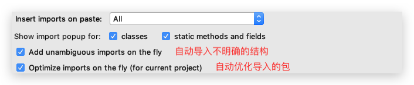
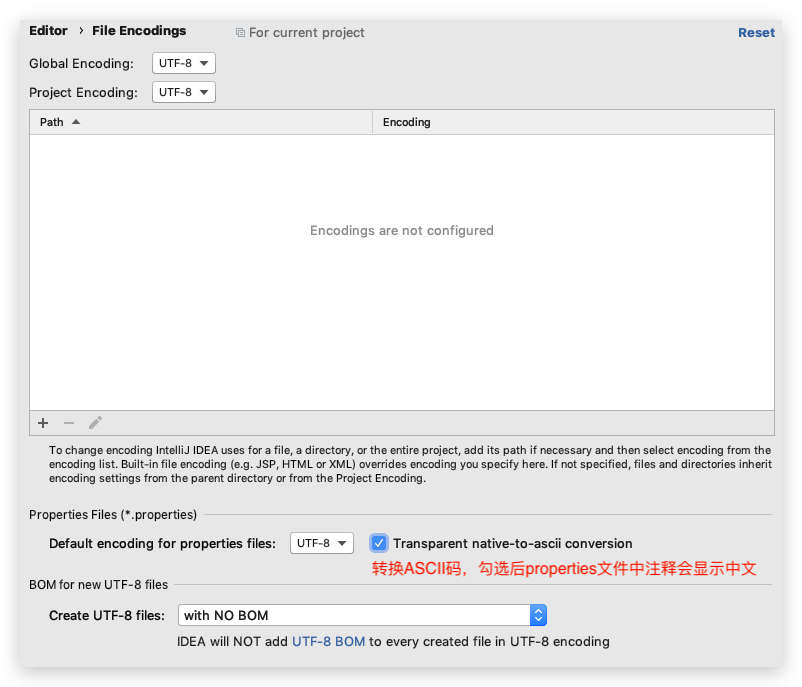

>   ### 根据2019.2.2编写

# Menu

## View

-   Appearance
    -   🎃Toolbar：打开工具栏（方便前进后退，打开Settings / Preferences）
    -   🎃Tool Window Bars：打开侧边工具（如project、database、maven等）


# Settings / Preferences

## Appearance & Behavior

### Appearance

*   设置主题
*   设置窗体及菜单的字体及字体大小（一般不设置）

### System Settings

*   🎃Reopen last project on startup：去掉勾选


## Editor

### General

*   🎃Change font size（zoom）...：可以用键盘+鼠标滚轮控制字体大小
*   🎃Show quick documentation...：鼠标悬停后显示文档

#### Auto import

*   🎃自动导包，选择如下图

    

#### Appearance

*   Show line number（默认勾选）：显示行号
*   Show method separators：显示方法之间的分割线
*   Show whitespace：显示空白处的tab或space

#### Code Completion

*   🎃去掉Match Case的勾选：忽略大小写

#### Editor Tabs

*   🎃去掉Show tabs in one row：标签可多行显示

#### Postfix Completion

*   🎃常用的语言的Template，语句自动完成，如sout等。不能修改！但是对于 Live Templates 中也提供的模板，此处的会比 Live Templates 中快一丢丢

### Font

*   🎃字体！大小！行间距！

### Color Scheme

*   🎃设置当前主题的字体、大小、行间距、Comments颜色（区分Line、Block、Doc）、格式等等
*   设置控制台...
*   ...

### Code Style

设置代码风格。如tab或space等等

*   imports标签下可修改超过指定 import 个数，改为*

### File and Code Templates

*   🎃Includes—>File Header：修改类头的文档注释信息

    ```java
    /**
     * TODO
     * @author conanan
     * @create ${YEAR}-${MONTH}-${DAY}
     */
    ```

    官方文档给的所有常用的预设的变量如下：

    ```java
    ${PACKAGE_NAME} - the name of the target package where the new class or interface will be created. ${PROJECT_NAME} - the name of the current project.
    ${FILE_NAME} - the name of the PHP file that will be created.
    ${NAME} - the name of the new file which you specify in the New File dialog box during the file creation. ${USER} - the login name of the current user.
    ${DATE} - the current system date.
    ${TIME} - the current system time.
    ${YEAR} - the current year.
    ${MONTH} - the current month.
    ${DAY} - the current day of the month.
    ${HOUR} - the current hour.
    ${MINUTE} - the current minute.
    ${PRODUCT_NAME} - the name of the IDE in which the file will be created. ${MONTH_NAME_SHORT} - the first 3 letters of the month name. Example: Jan, Feb, etc. ${MONTH_NAME_FULL} - full name of a month. Example: January, February, etc.
    ```

### File Encodings

*   🎃设置项目文件编码，勾选如下图（当前文件可在编辑窗口右下角选择）：




### Lieve Templates

目前和 Java 有关的都在 other 和 output 下。可修改！

1.  先定义Template Group，如 Conanan's Templates

2.  定义模板，如方法注释模板（目前版本2019.2.2好像自动生成就是正确的）

    
    
    
    
    


## Build,Execution,Deployment

### Build Tools

*   配置构建项目的工具，如Mavne、Gradle等
*   Maven
    *   🎃Import Maven projects automatically：实时监控项目的 pom.xml 文件，进行项目变动设置
    *   Automatically download：自动下载源码和文档，不要勾选！
    *   

### Complier

*   🎃勾选Build project automatically：自动构建项目，即编译为.class等（只在debugging和非running起效）
*   🎃勾选Compile indenpendent modules in parallel：并行编译独立模块


# VCS

*   需要安装 Git 客户端（Windows 中需要注意勾选**），并在 IDEA  中配置其路径
*   可以配置 Github
*   ...


# Debug

*   设置 Debug 连接方式，默认是 Socket，Windows 中可以选择Shared memory以节省内存。

-   Debug调试程序：可以让代码逐行执行,查看代码执行的过程,调试程序中出现的bug
-   使用方式：
    -   在行号的右边,鼠标左键单击,添加断点(每个方法的第一行,哪里有bug添加到哪里)
    -   右键,选择Debug执行程序，程序就会停留在添加的第一个断点处
-   执行程序：
    -   f8:逐行执行程序
    -   f7:进入到方法中
    -   shift+f8:跳出方法
    -   resume program：跳到下一个断点,如果没有下一个断点,那么就结束程序
    -   ctrl+f2:退出debug模式,停止程序
    -   Console:切换到控制台


# Keymap

可以使用 IDEA 查看keymap reference

* `psvm`：main方法
* `Ctrl+Y`：删除光标所在行
* `容器名称.fori`：for循环正序遍历数组
  * `容器名称.forr`：for循环倒序遍历数组
  * `容器名称.for`：for each遍历
* `Shift+F6`：修改选中的，其他相同的也会改动
* `Ctrl+N`：搜索任意类
* `按住Shift`：多选
  * `按住Alt`：竖向多选
* `.var`：直接给变量命名和确定类型
* `Ctrl+Alt+T`：surround wity，将代码放入代码块中
* `Ctrl+Alt+B`：放在一个类上，可以看到其所有实现类或接口等
* `Ctrl+F12`：放在一个类上，可以看到其所有方法


# Other

*   右键标签后，选择Split Vertically / Horizontally 即可垂直或水平分割展示
*   IDEA的索引若是失效或有问题，可以点击 File—>Invalidate and Restart清空重置，但是会丢失 Local History，可以先备份


# Plugins

*   Lombok：简化代码
*   Jreble：热部署
*   Key promoter：IDEA 快捷键提示
*   CamelCase：驼峰式命名和下划线命名交替变化。查看 Edit 下的Toggle Camel Case 菜单的快捷键。
*   FindBugs-IDEA：代码 Bug 检查
*   GsonFormat：把 JSON 字符串直接实例化成类（用在哪？）