电商模式有：

- **B2B**（Business to Business）：阿里巴巴
- **C2C**（Customer【顾客】 或 Consumer【消费者】）：淘宝、瓜子、易趣
- **B2C**（Business-to-Customer）：唯品会、乐蜂网
- **C2B**（Consumer to Business）：装修等。先有消费者提出需求，后有生产企业按需求组织生产
- **O2O**（Online To Offline）：饿了么、美团。将线下的商务机会与互联网结合，让互联网成为线下交易的平台
- F2C（Factory to customer）
- **B2B2C**：天猫、京东(混合)。第一个B指的是商品或服务的供应商，第二个B指的是从事电子商务的企业，C则是表示消费者

电商行业技术特点：技术新、技术范围广；分布式；高并发（集群、负载均衡）、高可用；海量数据、业务复杂、系统安全


# 1 分布式框架 Dubbox


## 1.1 品优购需求分析与系统设计

**B2B2C**：品优购网上商城主要分为**网站前台**、**运营商后台**、**商家管理后台**三个子系统

系统架构：**SOA**（Service-Oriented Architecture），是一种支持**面向服务**的架构样式，更多应用于互联网项目开发


## 1.2 Dubbox

> Dubbox 是一个分布式服务框架，前身是阿里巴巴开源项目Dubbo，后阿里巴巴停止了该项目的维护。当当网便在Dubbo基础上进行优化、维护，重新命名Dubbox 以区分。后续还有SpringCloud。

### 1.2.1 Dubbox简介

Dubbox 致力于提供高性能和透明化的**RPC远程服务调用**方案，以及**SOA服务治理**方案，是远程服务调用的分布式框架

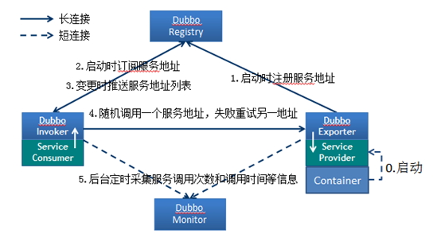

> Dubbox的jar包并没有部署到Maven的中央仓库中，需要手动安装dubbo-2.8.4.jar到本地仓库


### 1.2.2 注册中心Zookeeper

> 官方推荐，负责服务地址的注册与查找，注册中心不转发请求，压力较小。是 Apacahe Hadoop 的子项目，是一个树型的目录服务，支持变更推送，适合作为Dubbox 服务的注册中心，工业强度较高，可用于生产环境。

Linux中安装Zookeeper（文档提供的Linux用户名root、密码itcast）

> Linux需要修改子网IP中网段为25（FastDNS服务器要求）。

1. 安装 jdk
2. 把 zookeeper 的压缩包（资源\配套软件\dubbox\zookeeper-3.4.6.tar.gz）上传到 linux 系统
   - 可以使用SecureCRT连接远程服务器，Alt+P进入SFTP，输入`put d:\zookeeper-3.4.6.tar.gz`上传（SSH也行）
3. 解压：`tar zxvf zookeeper-3.4.6.tar.gz`
4. 进入 zookeeper-3.4.6 目录，创建 data 文件夹：`mkdir data`
5. 进入conf目录 ，把 zoo_sample.cfg 改名为 zoo.cfg：`mv zoo_sample.cfg zoo.cfg`
6. 打开zoo.cfg , 修改 data 属性：`dataDir=/root/zookeeper-3.4.6/data`
7. 进入bin运行/状态/停止等 Zookeeper：`./zkServer.sh start/status/stop等`
8. Zookeeper的端口号为**2181**


### 1.2.3 Demo

#### 1 服务提供者开发

1. 在pom.xml添加Dubbox依赖（需要安装dubbox到本地Maven仓库），打包方式为**war包**。独立的工程，完成后先运行。

   ```xml
   <dependency>
       <groupId>com.alibaba</groupId>
       <artifactId>dubbo</artifactId>
       <version>2.8.4</version>			
   </dependency>
   <dependency>
       <groupId>org.apache.zookeeper</groupId>
       <artifactId>zookeeper</artifactId>
       <version>3.4.6</version>
   </dependency>
   <dependency>
       <groupId>com.github.sgroschupf</groupId>
       <artifactId>zkclient</artifactId>
       <version>0.1</version>
   </dependency>
   <dependency>
       <groupId>javassist</groupId>
       <artifactId>javassist</artifactId>
       <version>3.11.0.GA</version>
   </dependency>
   ```

2. 在web.xml中添加`ContextLoaderListener`加载`applicationContext*`配置文件，IoC容器的配置文件如下：

   ```xml
   <?xml version="1.0" encoding="UTF-8"?>
   <beans xmlns="http://www.springframework.org/schema/beans"
          xmlns:xsi="http://www.w3.org/2001/XMLSchema-instance" 
          xmlns:p="http://www.springframework.org/schema/p"
          xmlns:context="http://www.springframework.org/schema/context"
          xmlns:dubbo="http://code.alibabatech.com/schema/dubbo" 
          xmlns:mvc="http://www.springframework.org/schema/mvc"
          xsi:schemaLocation="http://www.springframework.org/schema/beans 
                              http://www.springframework.org/schema/beans/spring-beans.xsd
                              http://www.springframework.org/schema/mvc 
                              http://www.springframework.org/schema/mvc/spring-mvc.xsd
                              http://code.alibabatech.com/schema/dubbo 
                              http://code.alibabatech.com/schema/dubbo/dubbo.xsd
                              http://www.springframework.org/schema/context 
                              http://www.springframework.org/schema/context/spring-context.xsd">
   
       <dubbo:protocol name="dubbo" port="20881"></dubbo:protocol><!--每个服务都有的端口，不配置默认为20880-->
       <dubbo:application name="dubboxdemo-service"/>  <!--与工程名相同即可-->
       <dubbo:registry address="zookeeper://192.168.25.129:2181"/> <!--注册中心-->
       <dubbo:annotation package="cn.itcast.dubboxdemo.service" /> <!--使用Dubbox的包扫描@Service-->
   </beans>
   ```

3. 服务层（省略了dao的调用）：导入的**`@Service`注解是由dubbox提供**的

   ```java
   @Service //import com.alibaba.dubbo.config.annotation.Service;
   public class UserServiceImpl implements UserService {
       public String getName() {		
           return "itcast";
       }
   }
   ```


#### 2 服务消费者开发

1. 在pom.xml添加Dubbox依赖（需要安装dubbox到本地Maven仓库），打包方式为**war包**。独立的工程，完成后后运行。

2. 在web.xml中添加`DispatcherServlet`加载`springmvc`配置文件、编码过滤器，IoC容器的配置文件如下：

   ```xml
   <?xml version="1.0" encoding="UTF-8"?>
   <beans xmlns="http://www.springframework.org/schema/beans"
          xmlns:xsi="http://www.w3.org/2001/XMLSchema-instance" 
          xmlns:p="http://www.springframework.org/schema/p"
          xmlns:context="http://www.springframework.org/schema/context"
          xmlns:dubbo="http://code.alibabatech.com/schema/dubbo" 
          xmlns:mvc="http://www.springframework.org/schema/mvc"
          xsi:schemaLocation="http://www.springframework.org/schema/beans 
                              http://www.springframework.org/schema/beans/spring-beans.xsd
                              http://www.springframework.org/schema/mvc 
                              http://www.springframework.org/schema/mvc/spring-mvc.xsd
                              http://code.alibabatech.com/schema/dubbo 
                              http://code.alibabatech.com/schema/dubbo/dubbo.xsd
                              http://www.springframework.org/schema/context 
                              http://www.springframework.org/schema/context/spring-context.xsd">
   
       <mvc:annotation-driven >
           <mvc:message-converters register-defaults="false">
               <bean class="org.springframework.http.converter.StringHttpMessageConverter">  
                   <constructor-arg value="UTF-8" />
               </bean>  
           </mvc:message-converters>	
       </mvc:annotation-driven>
       
       <!-- 引用dubbo 服务 -->
       <dubbo:application name="dubboxdemo-web" />
       <dubbo:registry address="zookeeper://192.168.25.129:2181"/>
       <dubbo:annotation package="cn.itcast.dubboxdemo.controller" />
   </beans>
   
   ```

3. Web层：

   1. **拷贝**服务层中的**service包即其接口**
   2. 自动装配的**`@Reference`（由dubbox提供）**替代`@Autowired`

   ```java
   @Controller
   @RequestMapping("/user")
   public class UserController {
   	@Reference
   	private UserService userService;	
       
   	@RequestMapping("/showName")
   	@ResponseBody
   	public String showName(){
   		return userService.getName();
   	}		
   }
   ```


#### 3 管理中心的部署

> 开发时，需要知道注册中心都注册了哪些服务，以便我们开发和测试。管理中心就是一个web应用，部署到tomcat即可

1. 编译源码`dubbox-master.zip`中的`dubbo-admin`，得到war包：`mvn package -Dmaven.skip.test=true`跳过测试

   若要监控则编译`dubbo-monitor`

2. 将`dubbo-admin.war`移到Tomcat的webapps目录下（`mv`），启动Tomcat即可自动解压（访问用户名和密码均为root）

   如果你部署在和zookeeper同一台主机并且端口是默认的2181，则无需配置；否则需要修改WEB-INF下的dubbo.properties

   ```properties
   dubbo.registry.address=zookeeper://127.0.0.1:2181
   ```

   访问`http://192.168.25.129:8080/dubbo-admin/`即可


## 1.3 品优购框架搭建

### 1.3.1 工程结构设计分析

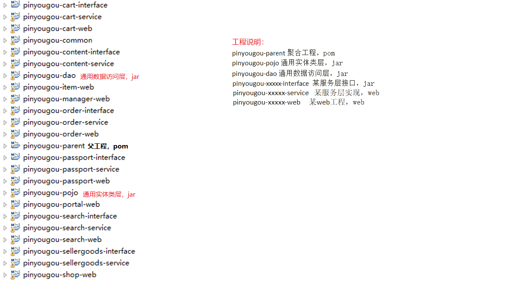

### 1.3.2 数据库

看文档

### 1.3.3 搭建框架

> 利用Maven建立maven工程、maven模块

父工程中pom.xml中只锁定版本，不依赖。其他的看文档

### 1.3.4 实体类和数据访问层

逆向工程generatorSqlmapCustom实现实体类与数据访问层代码的自动生成，拷贝至目标，实现Serializable。具体看文档

注意：需要build path MySQL8.0的驱动包，修改正确的Driver、URL。

注意：在后续**开启服务后找不到提供者**，有可能是逆向工程生成文件的问题（多生成了几次，append），删除后重新生成并复制

注意：课程提供的配置文件缺少两张秒杀表！！！

### 1.3.5 品牌列表

interface中service接口的编写……最终返回JSON数据的品牌列表


# 2 商品管理-品牌管理 AngularJS

## 2.1 AngularJS

### 2.1.1 AngularJS四大特征

> 学习的版本为Angular 1.0 即AngularJS（查看前端相关），后续的版本去掉了JS后缀，最新为4.0……

- **MVC 模式**

  

- **双向绑定**

  

- **依赖注入**

  看最上面的图

- **模块化设计**

  高内聚低耦合法则：

  - 官方提供的模块：ng、ngRoute（路由，课程没用到）、ngAnimate（动画，课程没用到）
  - 用户自定义的模块：angular.module('模块名',[ ])


2.1.2 AngularJS指令

> 引入`<script src="angular.min.js"></script>`

- `{{表达式 }}`：表达式可以是变量或是运算式

- **`ng-app`**：定义了 AngularJS 应用程序的根元素，告诉子元素以下的指令是归AngularJS 的， 会自动识别，在网页加载完毕时会自动引导（**自动初始化**）应用程序。**一般放在`body`标签中**

  ```html
  <body ng-app>
      {{100+100}}
  </body>
  ```

- **`ng-model`：双向绑定**，如下变量都是myname，都会同时改变

  ```html
  <body ng-app>
      请输入你的姓名：<input ng-model="myname"><br>
      <input ng-model="myname"><br>
      {{myname}},你好
  </body>
  ```

- **`ng-init`：初始化指令**，也可以绑定方法

  ```html
  <body ng-app   ng-init="myname='tom'">
      请输入你的姓名：<input ng-model="myname"><br>
      {{myname}},你好
  </body>
  ```


### 2.1.3 AngularJS控制器

- **`ng-controller`：指定所使用的控制器**

- **`$scope`**服务与数据模型相关联，也是表达式执行的上下文。==是**存在控制器中**用于**视图和控制器之间交换数据**==

  ```html
  <html>
      <head>
          <title>控制器</title>
          <script src="angular.min.js"></script>
          <script>
              //定义了一个叫myApp的模块，第二个参数数组为引用的模块，没有则不写
              var app=angular.module('myApp',[]); 
              //定义控制器
              app.controller('myController',function($scope){
                  $scope.add=function(){
                      return parseInt($scope.x)+parseInt($scope.y);
                  }
              });
          </script>
      </head>
      <body ng-app="myApp" ng-controller="myController">
          x:<input ng-model="x" >
          y:<input ng-model="y" >
          运算结果：{{add()}}
      </body>
  </html>
  ```

### 2.1.4 AngularJS事件

- **`ng-click`**

  ```html
  <html>
      <head>
          <title>入门小Demo-5  事件指令</title>
          <script src="angular.min.js"></script>	
          <script>
              //定义了一个叫myApp的模块，第二个参数数组为引用的模块，没有则不写
              var app=angular.module('myApp',[]);
              //定义控制器
              app.controller('myController',function($scope){			
                  $scope.add=function(){
                      $scope.z= parseInt($scope.x)+parseInt($scope.y);
                  }			
              });	
          </script>
      </head>
      <body ng-app="myApp" ng-controller="myController">
          x:<input ng-model="x" >
          y:<input ng-model="y" >
          <button ng-click="add()">运算</button>
          结果：{{z}}
      </body>
  </html>
  ```

### 2.1.5 AngularJS遍历

- **`ng-repeat`**

  * `$index`：在`ng-repeat`中可以获取索引，从0开始

  ```html
  <html>
      <head>
          <title>循环数据</title>
          <script src="angular.min.js"></script>
          <script>
              //定义了一个叫myApp的模块，第二个参数数组为引用的模块，没有则不写
              var app=angular.module('myApp',[]);
              //定义控制器
              app.controller('myController',function($scope){
                  $scope.list1= [100,192,203,434 ];//定义数组
                  $scope.list2= [
                      {name:'张三',shuxue:100,yuwen:93},
                      {name:'李四',shuxue:88,yuwen:87},
                      {name:'王五',shuxue:77,yuwen:56}
                  ];//定义数组
              });
          </script>
      </head>
      <body ng-app="myApp" ng-controller="myController">
          <table>
              <tr ng-repeat="x in list">
                  <td>{{x}}</td>
              </tr>
          </table>
  	<!--===============================================================-->
          <table>
              <tr>
                  <td>姓名</td>
                  <td>数学</td>
                  <td>语文</td>
              </tr>
              <tr ng-repeat="entity in list">
                  <td>{{entity.name}}</td>
                  <td>{{entity.shuxue}}</td>
                  <td>{{entity.yuwen}}</td>
              </tr>
          </table>
      </body>
  </html>
  ```


### 2.1.6 内置服务$http

- 我们的数据一般都是从后端获取的，可以使用内置服务`$http`来实现。以下代码要在Web环境中运行（运行在Tomcat中）

  ```html
  <html>
      <head>
          <title>内置服务</title>
          <meta charset="utf-8" />
          <script src="angular.min.js"></script>
          <script>
              var app=angular.module('myApp',[]);
              app.controller('myController',function($scope,$http){
                  $scope.findAll=function(){
                      $http.get('data.json').success(
                          function(data){
                              $scope.list=data;
                          }
                      );
                  }
              });
          </script>
      </head>
      <body ng-app="myApp" ng-controller="myController" ng-init="findAll()">
          <table>
              <tr>
                  <td>姓名</td>
                  <td>数学</td>
                  <td>语文</td>
              </tr>
              <tr ng-repeat="entity in list">
                  <td>{{entity.name}}</td>
                  <td>{{entity.shuxue}}</td>
                  <td>{{entity.yuwen}}</td>
              </tr>
          </table>
      </body>
  </html>
  ```


## 2.2 品牌列表分页实现

后端：利用**Pagehelper**并**返回PageInfo**即可完成（其实只需**总记录数`total`、分页后的数据`list`**）

前端：

- 引入Angular的分页组件

  ```html
  <script src="../plugins/angularjs/pagination.js"></script>
  <link rel="stylesheet" href="../plugins/angularjs/pagination.css">
  ```

- 在表格后放入分页组件

  ```html
  <!--在body中引入如下模块和控制器-->
  <body ng-app="pinyougou" ng-controller="brandController">
      <tm-pagination conf="paginationConf"></tm-pagination> <!--分页组件-->
  </body>
  ```

- AngularJS控制器代码

  ```javascript
  //构建品优购app模块时引入pagination模块
  var app = angular.module("pinyougou", ['pagination']);
  app.controller("brandController", function ($scope, $http) { //引入$scope, $http服务
  
      //分页组件配置
      $scope.paginationConf = {
          currentPage: 1, //当前页码
          totalItems: 10, //总记录数
          itemsPerPage: 10, //每页显示记录数，有如下选项
          perPageOptions: [10, 20, 30, 40, 50],
          onChange: function () { //每次更改（更新）页面时触发事件
              $scope.reloadList();
          }
      };
  
      //重新加载封装，只为了简写
      $scope.reloadList = function () {
          $scope.findAll($scope.paginationConf.currentPage, $scope.paginationConf.itemsPerPage);
      };
  
      //调用后端查找分页数据
      $scope.findAll = function (pageNum, pageSize) {
          $http.get("../brand/findAll.do?pageNum=" + pageNum + "&pageSize=" + pageSize).success(
              function (data) {
                  $scope.list = data.list;//返回查找的数据
                  $scope.paginationConf.totalItems = data.total;//更新总记录数totalItems
              }
          );
      };
  });
  ```


## 2.3 增加品牌

后端：用**`@RequestBody`接收JSON**数据并封装到pojo类，**返回entity实体类**（属性有success、message）的JSON形式

​	注意：应该先查询这个品牌是否存在，存在则抛异常，不存在才可以添加。也可以让数据库中name列唯一

前端：

* `ng-click="entity={}"`新建按钮清空原先输入数据、**`ng-model`封装数据**、**`ng-click`保存按钮触发事件**

  ```html
  <tr>
      <td>品牌名称</td>
      <td><input placeholder="品牌名称" ng-model="entity.name"></td>
  </tr>
  <tr>
      <td>首字母</td>
      <td><input placeholder="首字母" ng-model="entity.firstChar"></td>
  </tr>
  
  <button ng-click="save()">保存</button><!--别写到a标签中了！！！-->
  ```

* 控制器中**save方法**

  ```javascript
  //添加、更新商品
  $scope.save = function () {
      var method = 'add'; 
      if ($scope.entity.id!=null){ //根据id有无来区分更新、添加
          method = 'update';
      }
      $http.post("../brand/"+method+".do",$scope.entity).success(
          function (data) {
              if (data.success){
                  alert("success")
                  $scope.reloadList();//成功后就更新列表
              } else {
                  alert(data.message);
              }
          }
      );
  };
  ```

2.4 修改品牌

后端：**`findOne`利用主键id查找并回显**，**`update`利用封装的实体（包括主键id）更新数据，返回entity实体类**的JSON形式

前端：

* 回显数据

  * **`ng-click`修改按钮绑定事件**

    ```html
    <button type="button"  ng-click="findOne(x.id)">修改</button>
    ```

  * 控制器中**findOne方法**，由于2.3和2.4中增加品牌和修改品牌用的同一代码，并且绑定了变量，利用双向绑定特性：

    ```javascript
    //调用后端回显数据
    $scope.findOne = function (id) {
        $http.get("../brand/findOne.do?id="+id).success(
            function (data) {
                $scope.entity = data;//利用双向绑定特性，直接可绑定所有
            }
        )
    }
    ```

* 保存修改的数据，由于2.3和2.4中增加品牌和修改品牌用的同一代码，所以保存按钮的方法需要改写为如下：

  ```javascript
  //添加、更新商品
  $scope.save = function () {
      var method = 'add';
      if ($scope.entity.id!=null){
          method = 'update';
      }
      $http.post("../brand/"+method+".do",$scope.entity).success(
          function (data) {
              if (data.success){
                  alert("success")
                  $scope.reloadList();//成功后就更新列表
              } else {
                  alert(data.message);
              }
          }
      );
  };
  ```


## 2.5 多选删除品牌

后端：根据前端传入的**ids数组删除数据**，**返回entity实体类**的JSON形式

前端：

* **复选框单击事件**

  ```javascript
  <input type="checkbox" ng-click="updateSelection($event,x.id)">
  ```

* **控制器**中根据传入的**`$event`源**，用**`target`属性获取该元素**，判断**checked**向ids数组添加、删除数据

  ```javascript
  //删除品牌
  $scope.selectIds = [];
  $scope.updateSelection  = function ($event,id) {
      if ($event.target.checked){
          $scope.selectIds.push(id);//添加id
      } else {
          let index = $scope.selectIds.indexOf(id);
          $scope.selectIds.splice(index,1);//删除id
      }
  }
  ```

* **删除按钮单击事件**

  ```html
  <button type="button" ng-click="dele()" title="删除">删除</button>
  ```

* **控制器中删除品牌逻辑代码**

  ```javascript
  //删除品牌
  $scope.dele = function () {
      if (confirm("确认删除？")) {
          $http.get("../brand/delete.do?ids=" + $scope.selectIds).success(
              function (data) {
                  if (data.success) {
                      $scope.reloadList();//刷新列表
                      $scope.selectIds=[];//清除多选框
                  } else {
                      alert(data.message);
                  }
              }
          );
      }
  };
  ```


## 2.6 品牌条件查询

> 使用这个就可以替代2.2章节，删除即可

后端：

* interface层不提，service中利用逆向工程（没学啊，等会再看看）

  ```java
  @Override
      public PageInfo findAll(TbBrand tbBrand, int pageNum, int pageSize) {
          PageHelper.startPage(pageNum, pageSize);
          //逆向工程中生成的。。。
          TbBrandExample example = new TbBrandExample();
          TbBrandExample.Criteria criteria = example.createCriteria();
          if (tbBrand != null) {
              if (tbBrand.getName() != null && tbBrand.getName().length() > 0) {
                  criteria.andNameLike("%" + tbBrand.getName()+"%");
              }
              if (tbBrand.getFirstChar() != null && tbBrand.getFirstChar().length() > 0) {
                  criteria.andFirstCharEqualTo(tbBrand.getFirstChar());
              }
          }
          List<TbBrand> tbBrands = brandMapper.selectByExample(example);
          return new PageInfo<>(tbBrands);
      }
  ```

* controller层需要使用`@RequestBody`封装**POST请求**的JSON数据，还有分页数据

  ```java
  @RequestMapping("/findAll")
  public PageInfo findAll(@RequestBody TbBrand tbBrand,int pageNum,int pageSize){
      return brandService.findAll(tbBrand,pageNum,pageSize);
  }
  ```

前端：

* `ng-model`绑定条件实体，`ng-click`调用`reloadList()`方法（只是为了简写）进而调用`findAll()`方法

  ```html
  品牌名称：<input ng-model="searchEntity.name"> 品牌首字母：<input ng-model="searchEntity.firstChar">
  <button class="btn btn-default" ng-click="reloadList()">查询</button>
  ```

* 控制器中（和2.2一致，都列举出来）

  ```javascript
  var app = angular.module("pinyougou", ['pagination']);//构建品优购app模块时引入pagination模块
  app.controller("brandController", function ($scope, $http) {
  
      //分页组件配置
      $scope.paginationConf = {
          currentPage: 1, //当前页码
          totalItems: 10, //总记录数
          itemsPerPage: 10, //每页显示记录数，有如下选项
          perPageOptions: [10, 20, 30, 40, 50],
          onChange: function () { //每次更改（更新）页面时触发事件
              $scope.reloadList();//更新列表
          }
      };
  
      //分页更新列表，为了简写
      $scope.reloadList = function () {
          $scope.findAll($scope.paginationConf.currentPage, $scope.paginationConf.itemsPerPage);
      };
  
      //条件查询并分页
      $scope.searchEntity = {};//需要先赋值，否则没有输入条件时为null前端会报错
      $scope.findAll = function (pageNum, pageSize) {
          $http.post("../brand/findAll.do?pageNum="+pageNum+"&pageSize="+pageSize, $scope.searchEntity).success(
              function (data) {
                  $scope.list = data.list;//返回查找的数据
                  $scope.paginationConf.totalItems = data.total;//更新总记录数totalItems
              }
          )
      };
      
      //增删改......
  }
  ```


## 2.7 前端分层开发及控制器继承

运用**MVC的设计模式**，将代码进行分离，提高程序的可维护性。AngularJS的分模块开发可以分为：

- **服务层**（service）：和后端交互
- **控制层**（controller）：和视图（页面）交互

在 AngularJS 中，==**服务是一个函数或对象**==，可在你的 AngularJS 应用中使用。

------

有些功能是每个页面都有可能用到的，比如分页，复选等等。可以通过**控制器继承**的方式来实现

是伪继承，利用`{$scope:$scope}`连通两个控制器的`$scope`

------

js/base.js

```javascript
var app = angular.module("pinyougou", []);//构建品优购app模块
```

js/base_pagination.js

```js
var app = angular.module("pinyougou", ['pagination']);//构建品优购app模块时引入pagination模块
```

js/service/brandService.js

```js
//品牌服务
app.service("brandService", function ($http) {
    //查询所有
    this.findAll = function () {
        return $http.get("../brand/findAll.do);
    };
    //带条件查询的分页请求
    this.findPage = function (pageNum, pageSize, searchEntity) {
        return $http.post("../brand/findPage.do?pageNum=" + pageNum + "&pageSize=" + pageSize, searchEntity);
    };
    //查询一个请求
    this.findOne = function (id) {
        return $http.get("../brand/findOne.do?id=" + id)
    };
    //增加请求
    this.add = function (entity) {
        return $http.post("../brand/add.do", entity);
    };
    //更新请求
    this.update = function (entity) {
        return $http.post("../brand/update.do", entity);
    };
    //删除请求
    this.delete = function (ids) {
        return $http.get("../brand/delete.do?ids=" + ids);
    };
});
```

js/controller/baseController.js

```js
app.controller("baseController",function ($scope) {
    //分页组件配置
    $scope.paginationConf = {
        currentPage: 1, //当前页码
        totalItems: 10, //总记录数
        itemsPerPage: 10, //每页显示记录数，有如下选项
        perPageOptions: [10, 20, 30, 40, 50],
        onChange: function () { //每次更改（更新）页面时触发事件
            $scope.reloadList();//更新列表
        }
    };
    //分页更新列表，为了简写
    $scope.reloadList = function () {
        $scope.findPage($scope.paginationConf.currentPage, $scope.paginationConf.itemsPerPage);
    };
    //复选框勾选的数组值
    $scope.ids = [];
    $scope.updateSelection = function ($event, id) {
        if ($event.target.checked) {
            $scope.ids.push(id);
        } else {
            let index = $scope.ids.indexOf(id);
            $scope.ids.splice(index, 1);
        }
    };
});
```

js/controller/brandController.js

```js
//品牌控制器
app.controller("brandController", function ($controller,$scope, brandService) {

    //继承baseController
    $controller("baseController",{$scope:$scope});

	//查询所有
    $scope.findAll=function(){
        brandService.findAll().success(
            function(response){
                $scope.list=data.list;//返回查找的数据
            }
        );
    }

    //条件查询并分页
    $scope.searchEntity = {};//需要先赋值，否则没有输入条件时为null前端会报错
    $scope.findPage = function (pageNum, pageSize) {
        brandService.findPage(pageNum, pageSize, $scope.searchEntity).success(
            function (data) {
                $scope.list = data.list;//返回查找的数据
                $scope.paginationConf.totalItems = data.total;//更新总记录数totalItems
                //$scope.paginationConf.itemsPerPage=response.total;//若想展示所有数据，可以更新每页显示记录数
                //但是若是需要查找所有还是自定义方法吧
            }
        )
    };
    //添加、更新商品
    $scope.save = function () {
        let obj = null;
        if ($scope.entity.id != null) {
            obj = brandService.update($scope.entity);
        } else {
            obj = brandService.add($scope.entity);
        }
        obj.success(
            function (data) {
                if (data.success) {
                    $scope.reloadList();//成功后就更新列表
                } else {
                    alert(data.message);
                }
            }
        );
    };
    //回显数据
    $scope.findOne = function (id) {
        brandService.findOne(id).success(
            function (data) {
                $scope.entity = data;//利用双向绑定特性，直接可绑定所有
            }
        )
    };
    //删除品牌
    $scope.delete = function () {
        if (confirm("确认删除？")) {
            brandService.delete($scope.ids).success(
                function (data) {
                    if (data.success) {
                        $scope.reloadList();//刷新列表
                        $scope.selectIds=[];//清除多选框
                    } else {
                        alert(data.message);
                    }
                }
            );
        }
    };
});
```

admin/brand.html中引入即可

```html
<script src="../js/base_pagination.js"></script>
<script src="../js/service/brandService.js"></script>
<script src="../js/controller/baseController.js"></script><!--必须先引入父controller-->
<script src="../js/controller/brandController.js"></script>
```


# 3 商品管理-规格及模板管理

黑马代码生成器使用注意：

* 连接不上MySQL8
* 只能连接3306端口，其他端口修改配置文件也不行（暂时修改MySQL5为3306端口，MySQL8为3308端口）

* 生成的代码service中，和数据库的类型不一致
* 修改为PageInfo的使用


## 3.1 规格管理

涉及的表有规格表（主）、规格选项表（从）


### 3.1.1 展示规格

同品牌管理一致，引入js；放置分页组件；在body元素指定模块名和控制器名；循环表格（注意数据库列名和实体类驼峰命名）


### 3.1.2 增加规格

#### 1、增加行

绑定click事件，`addTableRow()`方法

```html
<button type="button" ng-click="addTableRow()">新增规格选项</button>
```

两个对象变量的双向绑定，新建时重置entity变量的数据

```html
<button type="button"  ng-click="entity= {specification:{},specificationOptionList:[]}">新建</button>

<td><input placeholder="规格名称" ng-model="entity.specification.specName"></td>

<tr ng-repeat="x in entity.specificationOptionList">
    <td>
        <input class="form-control" placeholder="规格选项" ng-model="x.optionName">
    </td>
    <td>
        <input class="form-control" placeholder="排序" ng-model="x.orders">
    </td>
    <td>
        <button type="button" class="btn btn-default" title="删除">删除</button>
    </td>
</tr>
```

控制器中`addTableRow()`方法，增加表格行

```javascript
//省略specification定义也行，不会空指针（直接绑定）。但是更应该放在新建按钮按下后重置entity变量的数据
//$scope.entity= {"specification":{},"specificationOptionList":[]};//
$scope.addTableRow = function () {
    $scope.entity.specificationOptionList.push({});
};
```

#### 2、删除行

`ng-repet`中利用`$index`获取索引

```html
<button type="button" title="删除" ng-click="deleteTableRow($index)">删除</button>
```

控制器中`deleteTableRow()`方法调用`splice()`方法，删除表格行

```javascript
$scope.deleteTableRow = function (index) {
    $scope.entity.specificationOptionList.splice(index,1);
}
```

#### 3、提交保存

将规格和规格选项数据合并成一个对象来传递（需要一个**组合对象**保存这俩对象）。得到组合对象中的规格和规格选项列表，**插入规格并返回规格ID**，然后**循环插入规格选项**。TbSpecificationMapper.xml文件应添加`selectKey `

```java
public class Specification implements Serializable {
    private TbSpecification specification;//和前端名称一致
    private List<TbSpecificationOption> specificationOptionList;//和前端名称一致
    //getter.setter...
}
```

```xml
<selectKey keyProperty="id" resultType="java.lang.Long" order="AFTER" >
    SELECT LAST_INSERT_ID() AS id
</selectKey>
```

interface和service以及web层都需要修改传入的类型为组合对象Specification，service层如下

```java
@Override
public void add(Specification specification) {
    //利用组合实体类获取其中两个对象
    TbSpecification tbSpecification = specification.getSpecification();
    specificationMapper.insert(tbSpecification);

    List<TbSpecificationOption> specificationOptionList = specification.getSpecificationOption();
    for (TbSpecificationOption option : specificationOptionList) {
        option.setSpecId(tbSpecification.getId());//设置规格id
        specificationOptionMapper.insert(option);//新增规格
    }
}
```


### 3.1.3 修改规格

#### 1、获取规格数据回显

service中使用逆向工程查询数据并封装到组合对象Specification中。interface和web层只修改返回类型

由于前端修改和增加用的同一页面，所以不需要重新进行数据绑定

```java
@Override
public Specification findOne(Long id){
    Specification specification = new Specification();
    //获取规格
    specification.setSpecification(specificationMapper.selectByPrimaryKey(id));
    //获取规格选项集合（逆向工程）
    TbSpecificationOptionExample example = new TbSpecificationOptionExample();
    TbSpecificationOptionExample.Criteria criteria = example.createCriteria();
    criteria.andSpecIdEqualTo(id);
    specification.setSpecificationOptionList(specificationOptionMapper.selectByExample(example));

    return specification;
}
```


#### 2、保存修改结果

service中使用逆向工程查询数据并封装到组合对象Specification中。interface和web层只修改返回类型

由于前端修改和增加用的同一页面，所以不需要重新进行数据绑定

```java
@Override
public void update(Specification specification){
    TbSpecification tbSpecification = specification.getSpecification();

    //更新规格实体
    specificationMapper.updateByPrimaryKey(tbSpecification);

    //删除所有规格选项（由于不清楚是删除还是修改或添加规格选项），利用逆向工程
    TbSpecificationOptionExample example =  new TbSpecificationOptionExample();
    TbSpecificationOptionExample.Criteria criteria = example.createCriteria();
    criteria.andSpecIdEqualTo(tbSpecification.getId());//mapper中利用mysql函数获取id
    specificationOptionMapper.deleteByExample(example);

    //插入规格选项
    for (TbSpecificationOption tbSpecificationOption : specification.getSpecificationOptionList()) {
        tbSpecificationOption.setSpecId(tbSpecification.getId());
        specificationOptionMapper.insert(tbSpecificationOption);
    }
}
```


### 3.1.4 删除规格

删除规格时要把其所拥有的规格属性一同删除

```java
@Override
public void delete(Long[] ids) {
    for(Long id:ids){
        //删除规格
        specificationMapper.deleteByPrimaryKey(id);
        //删除规格选项（逆向工程）
        TbSpecificationOptionExample example = new TbSpecificationOptionExample();
        TbSpecificationOptionExample.Criteria criteria = example.createCriteria();
        criteria.andSpecIdEqualTo(id);
        specificationOptionMapper.deleteByExample(example);
    }		
}
```

前端和品牌管理一样：checkbox中`ng-click="updateSelection($event,x.id)`，删除按钮`ng-click="dele()"`


## 3.2 品牌和规格的模板管理

模板是为了关联品牌和规格，如手机模板关联的品牌有iPhone、华为等，关联的规格有网络制式等。扩展属性为模板特有的属性。以上三个都可以用JSON格式存储。

### 3.2.1 展示模板

同品牌管理一致，引入js；放置分页组件；在body元素指定模块名和控制器名；循环表格（注意数据库列名和实体类驼峰命名）

由于上三个属性使用的是JSON格式，展示时需要转换为字符串。并且这个功能好多地方都会用到，可以抽取到baseController

```js
//JSON转自定义字符串，key代表需要的json属性
$scope.json2String = function (jsonString,key) {
    let json = JSON.parse(jsonString);
    let value = [];
    for (let i=0;i<json.length;i++){
        value.push(json[i][key]);
    }
    return value.join("，");
}
```

```html
<tr ng-repeat="x in list"><!--html演示如下-->
    <td>{{x.id}}</td>
    <td>{{json2String(x.brandIds,'text')}}</td>
</tr>
```


### 3.2.2 品牌、规格下拉列表 select2

select2组件（查看前端相关），可以多选，可与AngularJS整合。此次选择是的多选下拉列表，需要的**数据类型**和**前端代码**如下：

```javascript
$scope.brandList={data:[{id:1,text:'联想'},{id:2,text:'华为'},{id:3,text:'小米'}]};
```

```html
<input select2  select2-model="entity.brandIds" config="brandList" multiple placeholder="选择品牌（可多选）" class="form-control" type="text"/>	
Config用于配置数据来源
select2-model用于指定用户选择后提交的变量，根据数据库的列名来决定名称。但是它会提交{id:1,text:'联想'}类型的，所以有时需要
ng-model替代
```

------

#### 1、后端封装数据到`List<Map>`中

由于select2需要数据格式不同。（interface、service、web（请求映射为`/brand/selectOptionList.do`）都需要添加）

```xml
<select id="selectOptionList" resultType="java.util.Map"><!--MyBatis可以推断出具体传入语句的参数，但是resultType不行-->
    select id,name text from tb_brand
</select>
```

#### 2、前端

引入JS，angular-select2.js必须放在base.js之后！（即定义的app之后）注意目录问题（可能要修改最后一个）

```html
<link rel="stylesheet" href="../plugins/select2/select2.css" />
<link rel="stylesheet" href="../plugins/select2/select2-bootstrap.css" />
<script src="../plugins/select2/select2.min.js" type="text/javascript"></script>
<script type="text/javascript" src="../js/angular-select2.js">  </script> <!--和AngularJS整合，上面都是原生的-->
```

brandService层

```js
//下拉列表请求
this.selectOptionList = function () {
    return $http.get("../brand/selectOptionList.do");
}
```

typeTemplateController层（需要先把brandService服务注入）

```js
//读取品牌列表
$scope.brandList = {data:[]};//先定义，否则报错（不影响结果）
$scope.findBrandList = function () {
    brandService.selectOptionList().success(
        function (data) {
            $scope.brandList = {data:data};//注意select2要求的数据格式
        }
    )
}
```

在type_template.html中需要引入brandService.js文件。在body中添加`ng-init="findBrandList()"`方法（多个方法用分号隔开）。select2下拉框：

```html
<input select2  select2-model="entity.brandIds" config="brandList" multiple placeholder="选择品牌（可多选）" class="form-control" type="text"/>	
根据数据库的列名来决定绑定的变量名称
```

> 规格下拉列表实现同品牌下拉列表实现一致


### 3.2.3 增加、删除扩展属性行

同增加规格中一致


### 3.2.4 新增模板

数据双向绑定

* 商品类型`ng-model="entity.name"`
* 关联品牌`select2-model="entity.brandIds"`，后端保存的就是JSON数据
* 关联规格`select2-model="entity.specIds"`，后端保存的就是JSON数据
* 扩展属性，遍历时绑定`ng-model="x.text"`

保存绑定`ng-click="save()"`


### 3.2.5 修改模板

findOne回显时由于传过来的是JSON**字符串**，前端若没有指定接收的类型为JSON对象，则需要使用`JSON.parse()`来转换（jQuery中指定返回类型为json则没有此问题，AngularJS中没设置成功。。。），保存修改的数据功能已经和新增一致

```js
//查询实体
$scope.findOne = function (id) {
    typeTemplateService.findOne(id).success(
        function (response) {
            $scope.entity = response;
            //转换字符串为JSON
            $scope.entity.brandIds = JSON.parse($scope.entity.brandIds);
            $scope.entity.specIds = JSON.parse($scope.entity.specIds);
            $scope.entity.customAttributeItems = JSON.parse($scope.entity.customAttributeItems);
        }
    );
}
```


### 3.2.6 删除模板

后端为代码生成器生成代码，不用修改即可使用

前端和品牌管理一样：checkbox中`ng-click="updateSelection($event,x.id)`，删除按钮`ng-click="dele()"`


# 4 商家入驻审核及 SpringSecurity

## 4.1 运营商系统

在pinyougou-manager-web添加依赖（不用指定版本，父工程已指定），自动导入spring-security-core/config/web三个依赖

```xml
<dependency>
    <groupId>org.springframework.security</groupId>
    <artifactId>spring-security-web</artifactId>
</dependency>
<dependency>
    <groupId>org.springframework.security</groupId>
    <artifactId>spring-security-config</artifactId>
</dependency>
```

### 4.1.1 登陆

常使用用户名：admin，密码：admin

* web.xml中**监听器**加载spring-security.xml，配置`springSecurityFilterChain`**过滤器**（详细看SSM笔记）
* login.html中name、action、method的编写。提交按钮或a标签的编写

### 4.1.2 显示登陆名

（详细看SSM笔记）

### 4.1.3 退出登陆

配置logout标签即可，注销按钮访问`/logout`（详细看SSM笔记）


## 4.2 商家入驻审核

准备工作：复制代码生成器生成的所需要的前后端代码到pinyougou-shop-web中

### 4.2.1 商家入驻-注册

> 注册并添加至数据库中即可。常使用用户名：xiaomi或qiandu，密码：123456

register.html中引入JS；body中指令；数据双向绑定；

```html
<script src="./plugins/angularjs/angular.min.js"></script>
<script src="./js/base.js"></script>
<script src="./js/service/sellerService.js"></script>
<script src="./js/controller/baseController.js"></script><!--必须先引入父controller-->
<script src="./js/controller/sellerController.js"></script>

<body ng-app="pinyougou" ng-controller="sellerController">
    <input type="text" ng-model="entity.sellerId" placeholder="登陆名">
	......
</body>
```

sellerController.js中添加`add`方法，并在html中申请入驻按钮绑定`ng-click="add()"`方法

```js
//新增
$scope.add=function(){
    sellerService.add( $scope.entity  ).success(
        function(response){
            if(response.success){
                location.href = "shoplogin.html";//若注册成功跳转登录页面（其实还需要审核）
            }else{
                alert(response.message);
            }
        }
    );
}
```

后端中，需要修改service层，在添加商家信息前，设置其状态信息（有0，1，2，3），创建时间信息

```java
@Override
public void add(TbSeller seller) {
    seller.setStatus("0");
    seller.setCreateTime(new Date());
    sellerMapper.insert(seller);		
}
```


### 4.2.2 商家审核-待审核列表

> 修改其状态值即可。0：未审核   1：已审核   2：审核未通过   3：关闭

只有状态值为0的才需要审核（seller_1.html），其他的都放在商家管理中（seller.html）

此时修改后端代码比较麻烦，可以给前台body添加初始化参数`ng-init="searchEntity={'status':'0'}"`，配合自动生成的controller中定义的如下代码即可理解

```js
//条件查询并分页
$scope.searchEntity = {};//需要先赋值，否则没有输入条件时为null前端会报错
$scope.findAll = function (pageNum, pageSize) {
    sellerService.findAll(pageNum, pageSize, $scope.searchEntity).success(
        function (data) {
            $scope.list = data.list;//返回查找的数据
            $scope.paginationConf.totalItems = data.total;//更新总记录数totalItems
        }
    )
};
```

```js
this.findAll=function(page,rows,searchEntity){
    return $http.post('../seller/search.do?page='+page+"&rows="+rows, searchEntity);
}  
```


### 4.2.3 商家审核-商家详情

findOne，绑定数据，回显数据。查看之前的代码


### 4.2.4 商家审核-修改状态

后端：仅仅是修改状态，所以需要在后端编写`updateStatus()`方法

```java
@RequestMapping("/updateStatus")
public Result updateStatus(String sellerId,String status){
    try {
        sellerService.updateStatus(sellerId,status);
        return new Result(true,"修改状态成功");
    } catch (Exception e) {
        e.printStackTrace();
        return new Result(false,"修改状态失败");
    }
}
```

```java
@Override
public void updateStatus(String sellerId, String status) {
    TbSeller tbSeller = sellerMapper.selectByPrimaryKey(sellerId);
    tbSeller.setStatus(status);
    sellerMapper.updateByPrimaryKey(tbSeller);
}
```

前端：sellerService.js和sellerController.js

```js
this.updateStatus = function (sellerId,status) {
    return $http.get('../seller/updateStatus.do?sellerId='+sellerId+'&status='+status);
}
```

```js
$scope.updateStatus = function (sellerId,status) {
    sellerService.updateStatus(sellerId,status).success(
        function (data) {
            if (data.success){
                $scope.reloadList();//成功重新加载
            } else {
                alert(data.message);
            }
        }
    )
}
```

```html
<button ng-click="updateStatus(entity.sellerId,'1')">审核通过</button><!--其他的传2，3-->
```


## 4.3 商家系统登陆与安全控制

> 商家的数据库表中id为username

==【注意】==由于pinyougou-shop-web**消费者**中UserDetailsServiceImpl是**普通类**，不能自动注入Dao接口。需要借助Dubbox的Service来间接调用，并且Service也不能直接注入，需要通过dubbox使用接口来注入Service实现类

```java
public class UserDetailsServiceImpl implements UserDetailsService {

    private SellerService sellerService;

    public void setSellerService(SellerService sellerService) {
        this.sellerService = sellerService;
    }

    @Override
    public UserDetails loadUserByUsername(String username) throws UsernameNotFoundException {

        TbSeller seller = sellerService.findOne(username);//查找数据库中的User对象
        System.out.println(username+"==="+seller.getPassword()+"==="+seller.getStatus());
        if (seller != null) {
            boolean enabled = seller.getStatus().equals("1"); //账户是否可以使用
            //角色信息本应该和数据库中User对象一起查询出来，然后遍历并添加到如下authorities集合中
            List<GrantedAuthority> authorities = new ArrayList<>();
            authorities.add(new SimpleGrantedAuthority("ROLE_SELLER"));
            return new User(username, seller.getPassword(), enabled, true, true, true, authorities);
        } else {
            return null;
        }
    }
}
```

```xml
<?xml version="1.0" encoding="UTF-8"?>
<!--采用如下约束配置可以在配置时不加security前缀，但在配置bean时需要加beans前缀。主要方便springsecurity配置
 采用此约束文件，没有前缀的都是springsecurity自身的配置-->
<beans:beans xmlns="http://www.springframework.org/schema/security"
             xmlns:beans="http://www.springframework.org/schema/beans"
             xmlns:xsi="http://www.w3.org/2001/XMLSchema-instance"
             xmlns:dubbo="http://code.alibabatech.com/schema/dubbo"
             xsi:schemaLocation="http://www.springframework.org/schema/beans
                                 http://www.springframework.org/schema/beans/spring-beans.xsd
                                 http://www.springframework.org/schema/security
                                 http://www.springframework.org/schema/security/spring-security.xsd  http://code.alibabatech.com/schema/dubbo http://code.alibabatech.com/schema/dubbo/dubbo.xsd">

    <!-- 配置不拦截的资源（静态资源及登录相关），不登录也可以访问。否则可能会有重定向次数过多错误  -->
    <http pattern="/*.html" security="none"/> <!--webapp一级目录下的html文件（其实包括login.html，error.html等）-->
    <http pattern="/css/**" security="none"/>
    <http pattern="/js/**" security="none"/>
    <http pattern="/img/**" security="none"/>
    <http pattern="/plugins/**" security="none"/>
    <http pattern="/seller/add.do" security="none"/> <!--注册相关的也必须放行-->


    <!--http标签主要用于配置拦截的具体的规则
     auto-config="true"	不用自己编写登录的页面，框架提供默认登录页面，不配置默认为true
     use-expressions="true"	是否启用SPEL表达式，不配置默认为true（功能强大，可以限制ip等，没学习过）-->
    <http>
        <!-- 具体的拦截规则 pattern="表示拦截页面"，与web.xml中不同。此处为目录规则，/**代表目录及其子目录
                           access="访问系统的角色名称（以ROLE_开头），当前用户必须有ROLE_USER或...的角色" -->
        <intercept-url pattern="/**" access="hasAnyRole('ROLE_ADMIN','ROLE_SELLER')"/> <!--SPEL表达式-->
        <!-- 开启表单登陆功能，定义跳转的具体的页面 -->
        <form-login
                    login-page="/shoplogin.html"
                    default-target-url="/admin/index.html"
                    always-use-default-target="true"
                    authentication-failure-url="/shoplogin.html"
                    />
        <!-- 退出，invalidate-session 是否删除session logout-url：登出处理url logout-successurl：登出成功页面-->
        <logout/>
        <!-- 关闭csrf（Cross-site request forgery）跨站请求伪造 ,如果不加会出现403错误。也被称为“One Click Attack”或者                Session Riding，通常缩写为CSRF或者XSRF，是一种对网站的恶意利用。HTML不能使用，JSP可以带指定头信息使用-->
        <csrf disabled="true"/>

        <!--不拦截内置框架页-->
        <headers>
            <frame-options policy="SAMEORIGIN"/>
        </headers>
    </http>


    <!-- 引用dubbox 服务 -->
    <dubbo:application name="pinyougou-shop-web" />
    <dubbo:registry address="zookeeper://192.168.25.129:2181"/>
    <!--通过dubbox使用接口来注入实现类-->
    <dubbo:reference id="sellerService" interface="com.pinyougou.sellergoods.service.SellerService"/>

    <!--认证类-->
    <beans:bean id="userDetailsService" class="com.pinyougou.service.UserDetailsServiceImpl">
        <beans:property name="sellerService" ref="sellerService"/>
    </beans:bean>


    <!-- 认证管理器，指定了认证需要访问的service即认证类 。使用数据库中的用户名和密码。-->
    <authentication-manager>
        <authentication-provider user-service-ref="userDetailsService">
            <!-- 配置加密的方式。若配置此项，则需要指定密码加密方式，否则使用{noop}拼接上密码即可
            <security:password-encoder ref="passwordEncoder"/> -->
        </authentication-provider>
    </authentication-manager>
    <!-- 配置加密类 -->
    <beans:bean id="passwordEncoder" class="org.springframework.security.crypto.bcrypt.BCryptPasswordEncoder"/>
</beans:beans>
```

Bcrypt加密（详细看SSM笔记）：只需配置好，然后注册时加密即可，解密会由框架自动进行对比


# 5 商品管理-商品录入-1

## 5.1 商品分类管理

### 5.1.1 商品分类展示及面包屑

> 利用tb_item_cat表的parent_id（为0是最顶级），从而实现**三级商品**分类列表查询功能，更新**面包屑导航**

后端：interface和service以及controller的`ItemCat*`添加根据parentId查找的方法，可以不用分页（一级商品类别比较少）

```java
@Override
public List<TbItemCat> findByParentId(Long parentId) {
    TbItemCatExample example = new TbItemCatExample();
    Criteria criteria = example.createCriteria();
    criteria.andParentIdEqualTo(parentId);
    return itemCatMapper.selectByExample(example);
}
```

```java
@RequestMapping("/findByParentId")
public List<TbItemCat> findByParentId(Long parentId){
    return itemCatService.findByParentId(parentId);
}
```

前端：（引入js）

```js
this.findByParentId=function(parentId){
    return $http.get('../itemCat/findByParentId.do?parentId='+parentId);
}
```

```js
//为区分面包屑等级设置的变量
$scope.grade = 1;
$scope.setGrade = function(number){
    $scope.grade = number;
}

//点击面包屑或查看下一级时触发的方法。由于面包屑要展示name所以封装在entity实体中
$scope.selectList = function (entity) {
    if ($scope.grade == 1){ //1级时2、3级entity都为null
        $scope.entity_2 = null;
        $scope.entity_3 = null;
    } else if ($scope.grade == 2){ //2级时2级entity有值，3级entity为null
        $scope.entity_2 = entity;
        $scope.entity_3 = null;
    } else if ($scope.grade == 3){ //3级时3级entity有值，其他不变
        $scope.entity_3 = entity;
    }
    $scope.findByParentId(entity.id); //查找数据list
}

$scope.findByParentId = function (parentId) {
    $scope.entity.parentId = parentId;//增加时需要
    itemCatService.findByParentId(parentId).success(
        function (data) {
            $scope.list = data;
        }
    )
}
```

```html
<body ng-app="pinyougou" ng-controller="itemCatController" ng-init="findByParentId(0)">
    <!--面包屑-->
    <a href="#" ng-click="setGrade(1); selectList({id:0})" >顶级分类列表</a> <!--传入实体可以这样写-->
    <a href="#" ng-click="setGrade(2); selectList(entity_2)">{{entity_2.name}}</a>
    <a href="#" ng-click="setGrade(3) ;selectList(entity_3)">{{entity_3.name}}</a>
    ......

    <tr ng-repeat="entity in list">
        <td><input  type="checkbox" ></td>			                              
        <td>{{entity.id}}</td>
        <td>{{entity.name}}</td>
        <td>{{entity.typeId}}</td>		
        <!--ng-if指令的使用-->
        <td><button ng-if="grade!=3" ng-click="setGrade(grade+1); selectList(entity)">查询下级</button></td>
    </tr>
</body>
```


### 5.1.2 新增商品分类

后端：由于有类型模板需要select2（格式需要），所以给interface、service、dao、controller增加方法，查找模板类型表。封装数据到`List<Map>`中，请求URL为`/itemCat/selectOptionList.do`

```java
List<Map> selectOptionList();
```

```xml
<select id="selectOptionList" resultType="java.util.Map">
    select id id,id text from tb_type_template
</select>
```

```java
@RequestMapping("selectOptionList")
public List<Map> selectOptionList(){
    List<Map> list = itemCatService.selectOptionList();
    for (Map map : list) {
        map.put("text",map.get("text").toString());//修改text属性值为字符串类型
    }
    return list;
}
```

前端：select2和前面的品牌下拉列表一致。但是若出现`a.toUpperCase is not a function`问题，是由于select2要求的text属性值是**字符串**，而从数据库中查询的值是bigint型，需要在后端修改下（如上面controller，前端也行）。

* 新增加时由于需要parentId，所以service、controller中修改后如下

  ```js
  //根据父id查找其子内容
  this.findByParentId=function(parentId){
      return $http.get('../itemCat/findByParentId.do?parentId='+parentId);
  }
  //下拉列表查询
  this.selectOptionList = function () {
      return $http.get('../itemCat/selectOptionList.do');
  }
  ```

  ```js
  $scope.entity = {};
  $scope.findByParentId = function (parentId) {
      $scope.entity.parentId = parentId; //增加时需要parentId，所以在每次点击面包屑、查看下一级都设置好parentId
      itemCatService.findByParentId(parentId).success(
          function (data) {
              $scope.list = data;
          }
      )
  }
  
  //下拉列表
  $scope.typeList = {data:[]};
  $scope.selectOptionList = function () {
      itemCatService.selectOptionList().success(
          function (date) {
              $scope.typeList = {data:date};
          }
      )
  }
  ```

* HTML中绑定数据：下拉列表绑定数据需要`ng-model`而不是它自带的，因为它会按它的格式提交

  ```html
  <tr>
      <td>上级商品分类</td>
      <td>{{entity_2.name}}<span ng-if="entity_2!=null && entity_3!=null"> >> </span>{{entity_3.name}}</td>
  </tr>
  <tr>
      <td>商品分类名称</td>
      <td><input ng-model="entity.name" class="form-control" placeholder="商品分类名称">  </td>
  </tr>			  
  <tr>
      <td>类型模板</td>
      <td><input select2 ng-model="entity.typeId" config="typeList"  placeholder="商品类型模板" class="form-control" type="text"/></td>		      		      		
  </tr>	
  <button class="btn btn-success" data-dismiss="modal" aria-hidden="true" ng-click="save()">保存</button>
  ```

  ```js
  $scope.findByParentId($scope.entity.parentId);//保存成功后不再是调用之前的方法刷新列表，而是调用这个方法
  ```

* 每次点击新增按钮应该把上次数据清空，新增按钮绑定`ng-click="entity={}"`即可


### 5.1.3 修改商品分类

所有代码都自动生成，修改的页面和新增页面公用，只需添加一句

```html
<button type="button" ng-click="findOne(entity.id)" >修改</button>
```


### 5.1.4 删除商品分类

前端和品牌管理一样：checkbox中`ng-click="updateSelection($event,entity.id)`，删除按钮`ng-click="dele()"`

`dele()`方法的更新列表语句改为：

```js
$scope.findByParentId($scope.entity.parentId);//删除成功后不再是调用之前的方法刷新列表，而是调用这个方法
```

后端：需要判断是否还有子级别，有则不能删除，否则可以删除。可以在service中判断

```java
@Override
public void delete(Long[] ids) {
    for (Long id : ids) {
        TbItemCatExample example = new TbItemCatExample();
        Criteria criteria = example.createCriteria();
        criteria.andParentIdEqualTo(id);
        List<TbItemCat> tbItemCats = itemCatMapper.selectByExample(example);
        if (tbItemCats.size()==0){ //没有子级别才可以删除
            itemCatMapper.deleteByPrimaryKey(id);
        }
    }
}
```


## 5.2 电商SPU与SKU-表结构分析

* **SPU = Standard Product Unit （标准产品单位）**

  SPU是商品信息聚合的最小单位，是一组可复用、易检索的标准化信息的集合，该集合描述了一个产品的特性。

  通俗点讲，属性值、特性相同的商品就可以称为一个SPU。如iPhone8就是一个SPU，与商家，与颜色、款式、套餐都无关

* **SKU=stock keeping unit（库存量单位）**

  SKU是物理上不可分割的最小存货单元。在使用时要根据不同业态，不同管理模式来处理。在服装、鞋类商品中使用最普遍

  例如：纺织品中一个SKU通常表示：规格、颜色、款式

* 表结构分析

  tb_goods表（SPU）、tb_goods_desc表（前面表的详细信息）、tb_item表（SKU，从表）


## 5.3 商家后台-商品录入【基本功能】

> 商品录入所有功能设计三张表：、tb_goods、tb_goods_desc、tb_item

后端：

在商家后台实现商品录入功能。包括tb_goods：**商品名称**、**副标题**、**价格**；tb_goods_desc：**包装列表**、**售后服务**。由于tb_goods_desc表需要tb_goods的**id**，所以需要**修改mapper.xml**。并且这是两张表的数据，需要定义一个**组合实体类**。

```xml
<selectKey resultType="java.lang.Long" order="AFTER" keyProperty="id">
    SELECT LAST_INSERT_ID() AS id
</selectKey>
```

```java
public class Goods implements Serializable {

    private TbGoods goods; //商品SPU基本信息
    private TbGoodsDesc goodsDesc; //商品扩展信息
    private List<TbItem> itemList; //SKU列表，暂时不用
}
```

interface中add方法修改传入参数为Goods组合实体类，service中需要修改逻辑

```java
@Override
public void add(Goods goods) {
    goods.getGoods().setAuditStatus("0"); //新增加的商品状态为未审核
    goodsMapper.insert(goods.getGoods()); //插入商品基本信息

    goods.getGoodsDesc().setGoodsId(goods.getGoods().getId()); //将商品基本表的id给扩展表 
    goodsDescMapper.insert(goods.getGoodsDesc()); //插入商品扩展信息
}
```

**pinyougou-manager-web中其实没有商品录入功能**，删除生成的代码。修改**pinyougou-shop-web中controller的add方法**

需要录入商品**同时录入商家的id**，利用SpringSecurity的方法

```java
@RequestMapping("/add")
public Result add(@RequestBody Goods goods){
    //获取商家id并设置
    String sellerId = SecurityContextHolder.getContext().getAuthentication().getName();
    goods.getGoods().setSellerId(sellerId);
    try {
        goodsService.add(goods);
        return new Result(true, "增加成功");
    } catch (Exception e) {
        e.printStackTrace();
        return new Result(false, "增加失败");
    }
}
```


前端：

service使用生成的代码，controller中由于不需要修改，可以修改为

```js
//增加商品
$scope.add=function(){
    goodsService.add( $scope.entity  ).success(
        function(response){
            if(response.success){
                alert("新增商品成功");
                $scope.entity = {};//清空上次数据的数据即可，不用刷新列表，因为这就是一个新增页面
            }else{
                alert(response.message);
            }
        }		
    );				
}
```

HTML中引入JS、绑定ng-app和ng-controller、绑定数据（注意实体类中属性与前端变量名的一致性）、绑定保存按钮

```html
<input type="text" ng-model="entity.goods.goodsName"   placeholder="商品名称" value="">
<input type="text" ng-model="entity.goods.caption"   placeholder="副标题" value="">
<input type="text" ng-model="entity.goods.price"   placeholder="价格" value="">
<textarea rows="4" ng-model="entity.goodsDesc.packageList"   placeholder="包装列表"></textarea>
<textarea rows="4" ng-model="entity.goodsDesc.saleService"   placeholder="售后服务"></textarea>

<button class="btn btn-primary" ng-click="add()"><i class="fa fa-save" ></i>保存</button>
```


## 5.4 商家后台-商品录入【商品介绍】

> 富文本编辑器，Rich Text Editor, 简称 RTE, 它提供类似于 Microsoft Word 的编辑功能

[KindEditor](http://kindeditor.net/)（国内。此次使用。查看前端相关，其实是HTML代码）、[UEditor](http://ueditor.baidu.com/website/)（百度）、[CKEditor](http://ckeditor.com/)（国外）

引入JS

```html
<link rel="stylesheet" href="../plugins/kindeditor/themes/default/default.css" />
<script charset="utf-8" src="../plugins/kindeditor/kindeditor-min.js"></script>
<script charset="utf-8" src="../plugins/kindeditor/lang/zh_CN.js"></script>
```

渲染textarea（查看文档怎么写即可）

```js
var editor;
KindEditor.ready(function(K) {
    editor = K.create('textarea[name="content"]', {
        allowFileManager : true
    });
});
```

html中textarea：`name="content"`必须是这个值

```html
<textarea name="content" style="width:800px;height:400px;visibility:hidden;" ></textarea>
```

它的数据绑定必须使用JS代码完成。在controller中add中增加数据绑定、清空的代码：

```js
//增加商品
$scope.add=function(){
    $scope.entity.goodsDesc.introduction = editor.html();//绑定富文本编辑器的数据
    goodsService.add( $scope.entity  ).success(
        function(response){
            if(response.success){
                alert("新增商品成功");
                $scope.entity = {};//清空上次填写的基本数据即可，不用刷新列表，因为这就是一个新增页面
                editor.html("");//清空富文本编辑器的数据
            }else{
                alert(response.message);
            }
        }		
    );				
};
```


## 5.5 分布式文件服务器FastDFS

> c 语言编写的一款开源的分布式文件系统。FastDFS 为互联网量身定制，充分考虑了冗余备份、负载均衡、线性扩容等机制，并注重高可用、高性能等指标，使用 FastDFS很容易搭建一套高性能的文件服务器集群提供文件上传、下载等服务。

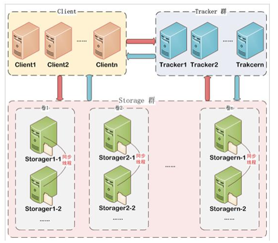

FastDFS 架构包括 Tracker server 和 Storage server。客户端请求 Tracker server 进行文件上传、下载，通过Tracker server 调度最终由 Storage server 完成文件上传和下载。

* Tracker：管理集群，Tracker也可以实现集群。每个 Tracker节点地位平等。收集 Storage 集群的状态。
* Storage：实际保存文件。Storage分为多个组（卷），每个组（卷）之间保存的文件是不同的。每个组内部可以有多个成员，组成员内部保存的内容是一样的，组成员的地位是一致的，没有主从的概念。·

文件上传流程：

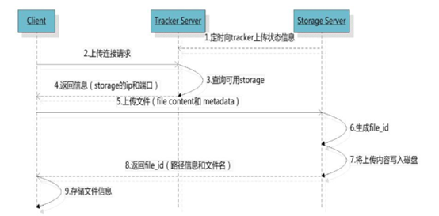

客户端上传文件后存储服务器将文件 ID 返回给客户端，此文件 ID 用于以后访问该文件的索引信息。文件索引信息包括：组名，虚拟磁盘路径，数据两级目录，文件名。如下：


组名：文件上传后所在的 storage 组名称，在文件上传成功后有 storage 服务器返回，需要客户端自行保存

虚拟磁盘路径：storage 配置的虚拟路径，与磁盘选项 store_path*对应。如果配置了store_path0 则是 M00，如果配置了 store_path1 则是 M01，以此类推

数据两级目录：storage 服务器在每个虚拟磁盘路径下创建的两级目录，用于存储数据文件

文件名：与文件上传时不同。是由存储服务器根据特定信息生成，文件名包含：源存储服务器IP地址、文件创建时间戳、文件大小、随机数和文件拓展名等信息


文件下载流程：

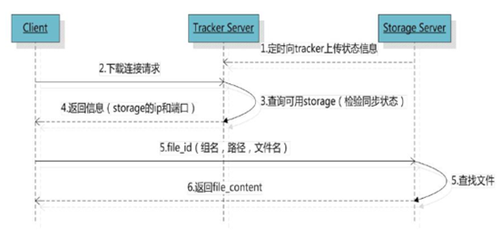

最简单的 FastDFS 架构：6个服务器，其中2个Tracker、2个卷，每个卷中有2个Storager

FastDFS 安装步骤非常繁琐，直接使用安装好的镜像！

由于FastDFS客户端jar包并没有在中央仓库中，需要自己安装到本地仓库

```shell
mvn install:install-file -DgroupId=org.csource.fastdfs -DartifactId=fastdfs  -Dversion=1.2 -Dpackaging=jar -Dfile=d:\setup\fastdfs_client_v1.20.jar
```

`pom.xml`中引入依赖

```xml
<dependency>
    <groupId>org.csource.fastdfs</groupId>
    <artifactId>fastdfs</artifactId>
    <version>1.2</version>
</dependency>
```

添加配置文件`fdfs_client.conf`，以后只需修改服务器地址如`tracker_server=192.168.25.133:22122`

```java
public class Test {

    public static void main(String[] args) throws Exception {
        //1.加载配置文件
        ClientGlobal.init("D:\\Code-Workspace\\IDEA\\fastFDSdemo\\src\\main\\resources\\fdfs_client.conf");
        //2.创建一个TrackerClient对象
        TrackerClient trackerClient = new TrackerClient();
        //3.使用TrackerClient对象创建连接，获得一个TrackerServer对象
        TrackerServer trackerServer = trackerClient.getConnection();
        //4.创建一个StorageServer的引用，值为null
        StorageServer storageServer = null;
        //5.创建一个StorageClient对象，需要两个参数TrackerServer对象、StorageServer的引用
        StorageClient storageClient = new StorageClient(trackerServer,storageServer);
        //6.使用 StorageClient 对象上传图片。扩展名不带“.”。最后一个参数为文件的详细信息
        String[] fileId = storageClient.upload_file("F:\\_H\\other\\dog.jpg", "jpg", null);
        //7.返回数组。包含组名和图片的路径
        for (String s : fileId) {
            System.out.println(s);
        }
        //访问http://192.168.25.133/group1/M00/00/00/wKgZhVw6OJKAf89UAAGgU0NHZ6E797.jpg
    }
}
```


## 5.6 商家后台-商品录入【商品图片上传】

后端：

由于这个功能与业务无关，是通用的。所以在pinyougou-common中的``pom.xml`中引入依赖。将工具类也放入其中。

```xml
<!-- 文件上传组件 -->
<dependency>
    <groupId>org.csource.fastdfs</groupId>
    <artifactId>fastdfs</artifactId>
</dependency>
<dependency>
    <groupId>commons-fileupload</groupId>
    <artifactId>commons-fileupload</artifactId>
</dependency>
```

在pinyougou-shop-web引入pinyougou-common

将`fdfs_client.conf`拷贝到pinyougou-shop-web工程config文件夹

pinyougou-shop-web工程`application.properties`添加配置：`FILE_SERVER_URL=http://192.168.25.133/`

pinyougou-shop-web工程`springmvc.xml`添加配置：

```xml
<!-- 配置多媒体解析器 -->
<bean id="multipartResolver" class="org.springframework.web.multipart.commons.CommonsMultipartResolver">
    <property name="defaultEncoding" value="UTF-8"></property>
    <!-- 设定文件上传的最大值5MB，5*1024*1024 -->
    <property name="maxUploadSize" value="5242880"></property>
</bean>
```

Controller层代码的编写（不需要service、dao）

```java
@RestController
public class UploadController {

    @Value("${FILE_SERVER_URL}")
    private String file_server_url;

    @RequestMapping("/upload")
    public Result upload(MultipartFile file){
        String originalFilename = file.getOriginalFilename(); //获取文件名
        String extName = originalFilename.substring(originalFilename.lastIndexOf(".") + 1);//获取扩展名
        try {
            FastDFSClient fastDFSClient = new FastDFSClient("classpath:config/fdfs_client.conf");
            String fileId = fastDFSClient.uploadFile(file.getBytes(), extName);
            String url = file_server_url+fileId;//图片的完整url
            return new Result(true,url);
        } catch (Exception e) {
            e.printStackTrace();
            return new Result(false,"上传失败");
        }
    }
}
```


前端：

`uploadService.js`

```js
app.service("uploadService", function ($http) {
    //上传文件
    this.uploadFile = function () {
        var formData = new FormData();//HTML5新增的类，对文件的封装，用于文件上传
        formData.append('file', file.files[0]);//第二个参数中file：文件上传框的id或name的值
        return $http({
            url: '../upload.do',
            method: 'post',
            data: formData,
            //anjularjs对于post和get请求默认的Content-Type header 是application/json。这样设置后浏览器会帮我们把Content-Type 设置为 multipart/form-data
            headers: {'Content-Type': undefined}, 
            //anjularjs transformRequest function 将序列化我们的formdata object
            transformRequest: angular.identity
        })
    }
});
```

将uploadService服务注入到goodsController中

```js
$scope.uploadFile = function () {
    uploadService.uploadFile().success(function (data) {
        if (data.success) {
            $scope.image_entity.url = data.message; //绑定url，用于保存时提及
        } else {
            alert(data.message);
        }
    }).error(function () {
        alert("上传发生错误");
    })
}
```

在html中引入`uploadService.js`，绑定数据。在新建按钮时绑定`ng-click="image_entity={}"`清空上次数据

```html
<input ng-model="image_entity.color" class="form-control" placeholder="颜色" >

<input type="file" id="file" />
<button class="btn btn-primary" type="button" ng-click="uploadFile()">上传</button>	
<!--上传后直接显示-->

```

此时只是在弹出的上传图片对话框中，上传了图片到FastDFS服务器，并显示出。但并没有将数据保存到数据库


**图片列表**：上传图片对话框中点击保存后，显示图片记录。只是展示了上传的图片列表，并没有将数据保存到数据库

```html
<button class="btn btn-success"  data-dismiss="modal" aria-hidden="true" ng-click="add_image_entity()">保存</button>
```

```js
$scope.entity = {goods: {}, goodsDesc: {itemImages: []}}; //封装所有要上传的数据（暂时设计两张表）

//上传图片对话框点击保存后--图片展示列表
$scope.add_image_entity = function () {
    $scope.entity.goodsDesc.itemImages.push($scope.image_entity);
};
//图片展示列表中删除图片时
$scope.remove_image_entity = function (index) {
    $scope.entity.goodsDesc.itemImages.splice(index,1);
}
```

```html
<tr ng-repeat="x in entity.goodsDesc.itemImages">
    <td>{{x.color}}</td>
    <td></td>
    <td> <button type="button"  ng-click="remove_image_entity($index)" title="删除" >删除</button></td>
</tr>
```


**点击最下面的保存按钮即可保存所有数据到数据库**

但是这个系统不能删除FastDFS服务器中图片，只能删除数据库中存储的url。（可以在其他时间统一检查垃圾文件并删除）


# 6 商品管理-商品录入-2

## 6.1 商家后台-商品录入【选择商品分类】

在pinyougou-shop-web工程中创建itemCatService.js，在goodsController.js中引入itemCatService并在goods_edit.html添加引用。后端代码直接使用已存在的ItemCatController/Service即可。这次使用AngularJS自带select（select2也可以实现）

`goodsController.js`

```js
//itemCatService.findByParentId()查找的是tb_item_cat表，返回id、parentId、name、typeId
//查询一级商品分类列表
$scope.selectItemCat1List = function () {
    itemCatService.findByParentId(0).success(function (data) {
        $scope.itemCat1List = data; //一级商品分类列表
    })
};

//查询二级商品分类列表
//利用AngularJS的变量监控方法（不同于JS、jQuery的事件驱动）。newValue为改变后的值，oldValue为改变前的值
$scope.$watch("entity.goods.category1Id", function (newValue, oldValue) {
    itemCatService.findByParentId(newValue).success(function (data) {
        $scope.itemCat2List = data; //二级商品分类列表
    })

});

//查询三级商品分类列表。同上
$scope.$watch("entity.goods.category2Id", function (newValue, oldValue) {
    itemCatService.findByParentId(newValue).success(function (data) {
        $scope.itemCat3List = data; //三级商品分类列表
    })
});

//查询模板ID。同上
$scope.$watch("entity.goods.category3Id", function (newValue, oldValue) {
    itemCatService.findOne(newValue).success(function (data) {
        $scope.entity.goods.typeTemplateId = data.typeId;

    })
});
```

HTML中调用`ng-init="selectItemCat1List()"`，数据绑定及select级联列表

```html
<td>
    <select ng-model="entity.goods.category1Id" ng-options="item.id as item.name for item in itemCat1List">	
    </select>
</td>
<td>
    <select ng-model="entity.goods.category2Id" ng-options="item.id as item.name for item in itemCat2List">	
    </select>
</td>
<td>
    <select ng-model="entity.goods.category3Id" ng-options="item.id as item.name for item in itemCat3List">
    </select>
</td>

<td><span ng-if="entity.goods.typeTemplateId!=null">模板ID：{{entity.goods.typeTemplateId}}</span></td>
```


## 6.2 商家后台-商品录入【品牌下拉列表】

需要从tb_type_template查询到JSON字符串数据，转为JSON对象后展示为下拉列表

需要TypeTemplateController，typeTemplateService.js并在goodsController.js中引入该服务，HTML中也需引入js文件

`goodsController.js`

```js
//查询商品下拉列表；扩展属性；规格列表。监控模板ID。从tb_type_template表中查询
$scope.$watch("entity.goods.typeTemplateId", function (newValue, oldValue) {
    typeTemplateService.findOne(newValue).success(function (data) {
        $scope.entity.goods.brandIds = JSON.parse(data.brandIds);//品牌列表类型转换

        $scope.entity.goodsDesc.customAttributeItems = JSON.parse(data.customAttributeItems);//扩展属性
    })
    //规格及选项
    typeTemplateService.findSpecList(id).success(function (data) {
        $scope.specList = data;
    })
});
```

HTML中数据绑定，下拉列表及扩展属性

```html
<select ng-model="entity.goods.brandId" ng-options="item.id as item.text for item in entity.goods.brandId"></select>
```

```html
<div ng-repeat="x in entity.goodsDesc.customAttributeItems">
    <div>{{x.text}}</div>
    <div><input class="form-control" placeholder="{{x.text}}" ng-model="x.value"></div>
</div>
```


## 6.3 商家后台-商品录入【扩展属性】

> 表中表可以用JSON存储

从tb_type_template表获取扩展属性展示，保存到tb_goods_desc表的custom_attribute_items中

修改6.2的代码即可使用，查看上面代码。


## 6.4 商家后台-商品录入【规格选择】

后端：

由于`tb_type_template`表中查找出来的数据只有规格，没有规格选项，所以需要改后端代码，给原有内容添加规格选项。

`TypeTemplateServiceImpl`

```java
@Override
public List<Map> findSpecList(Long id) {
    //从tb_type_template表中查spec_ids字段的JSON内容
    TbTypeTemplate typeTemplate = typeTemplateMapper.selectByPrimaryKey(id);
    //将[{"id":27,"text":"网络"},{"id":32,"text":"机身内存"}]字符串转为集合
    List<Map> list = JSON.parseArray(typeTemplate.getSpecIds(), Map.class);
    for (Map map : list) {
        //从tb_specification_option表中根据spec_id字段查找List集合，封装到Map中options
        TbSpecificationOptionExample example = new TbSpecificationOptionExample();
        TbSpecificationOptionExample.Criteria criteria = example.createCriteria();
        criteria.andSpecIdEqualTo(new Long((Integer) map.get("id")));//包装类型间转换需要new对象
        List<TbSpecificationOption> specificationOptions = specificationOptionMapper.selectByExample(example);
        map.put("options",specificationOptions);
    }
    //返回的是这个类型数据[{"id":27,"text":"网络",options:[{},{}]},{"id":32,"text":"机身内存"},options:[{},{}]]
    return list;
}
```

`TypeTemplateController`

```java
@RequestMapping("/findSpecList")
public List<Map> findSpecList(Long id){
    return typeTemplateService.findSpecList(id);
}
```


前端：

`typeTemplateService.js`

```js
this.findSpecList = function (id) {
    return $http.get('../typeTemplate/findSpecList.do?id='+id);
}
```

规格选项是在商品分类选择完成，所以还是放在监控模板id变换的方法内

```js
//查询商品下拉列表；扩展属性；规格列表。监控模板ID。从tb_type_template表中查询
$scope.$watch("entity.goods.typeTemplateId", function (newValue, oldValue) {

    typeTemplateService.findOne(newValue).success(function (data) {
        
        $scope.entity.goods.brandIds = JSON.parse(data.brandIds);//品牌列表类型转换

        $scope.entity.goodsDesc.customAttributeItems = JSON.parse(data.customAttributeItems);//扩展属性
    });
    
    //规格及选项
    typeTemplateService.findSpecList(newValue).success(function (data) {
        $scope.specList = data;
    });
});
```

HTML中遍历数据

```html
<div ng-repeat="x in specList">
    <div class="col-md-2 title">{{x.text}}</div>
    <div class="col-md-10 data">
        <span ng-repeat="y in x.options">
            <input ng-click="updateSpecAttribute($event,x.text,y.optionName)" type="checkbox" >{{y.optionName}}
        </span>
    </div>
</div>
```


**保存规格**

封装数据格式为：`[{"attributeName":"网络制式","attributeValue":["移动3G","移动4G"]}]`

当点击CheckBox时有两种情况：1、该attributeName不存在，直接添加；2、该attributeName存在，返回该对象。由于这个方法比较通用，所以封装在`baseController.js`中

`baseController.js`

```js
//例如[{"attributeName":"网络制式","attributeValue":["移动3G","移动4G"]}]
//array集合，key为每个对象中的属性，value为所需要的属性值
$scope.searchObjectByKey = function (array,key,value) {
    for (let i=0;i<array.length;i++){
        if ( array[i][key] == value ){
            return array[i]; //返回该对象
        }
    }
    return null;
}
```

`goodsController.js`

```js
//定义变量，否则不能使用.调用，空指针异常
$scope.entity = {goods: {}, goodsDesc: {itemImages: [], specificationItems: []}}; //封装所有要上传的数据

//例如[{"attributeName":"网络制式","attributeValue":["移动3G","移动4G"]}]
$scope.updateSpecAttribute = function ($event,name,value) {
    //判断是否已存在该属性
    var object = $scope.searchObjectByKey($scope.entity.goodsDesc.specificationItems,'attributeName',name)
    //不存在，直接添加属性名、属性值
    if (object == null){
        $scope.entity.goodsDesc.specificationItems.push({"attributeName":name,"attributeValue":[value]})
    } else {
        //存在并且勾选，则添加
        if ($event.target.checked){
            object.attributeValue.push(value);
        } else {
            //存在但取消勾选，则删除该记录
            object.attributeValue.splice(object.attributeValue.indexOf(value),1);
            //若该属性值为空，则删除该属性（这句话可以不加）
            if (object.attributeValue.length==0){
                $scope.entity.goodsDesc.specificationItems.splice($scope.entity.goodsDesc.specificationItems.indexOf(object),1);
            }
        }
    }
}
```

HTML数据绑定看上面的！


## 6.5 商家后台-商品录入【SKU商品信息】

规格选择后，类似笛卡尔积。提交数据到`tb_item`表中

前端的克隆：

* 浅克隆：类似引用
* 深克隆：类似双胞胎。利用JSON中方法`var b = JSON.parse(JSON.stringify(a))`，即转为JSON转字符串再转JSON

`goodsController.js`

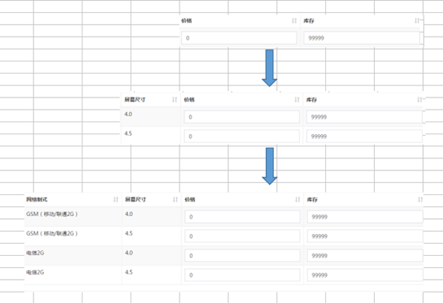

```js
$scope.createItemList = function () {
    //后端pojo中Goods组合实体类中第三个属性itemList
    $scope.entity.itemList = [{spec:{},price:0,num:99999,status:'0',isDefault:'0'}];//列表初始化

    //例如[{"attributeName":"网络制式","attributeValue":["移动3G","移动4G"]}]
    var items = $scope.entity.goodsDesc.specificationItems;//用户选择的规格集合
    for (let i = 0; i < items.length; i++) {
        $scope.entity.itemList = addColumn($scope.entity.itemList,items[i].attributeName,items[i].attributeValue);
    }
};

//在外部定义方法，可以不添加$scope，但不在页面调用
addColumn = function (list, columnName, columnValues) {
    var newList = [];
    for (let i = 0; i < list.length; i++) { //循环传入的list
        var oldRow = list[i];

        for (let j = 0; j < columnValues.length; j++) { //循环columnValues
            var newRow = JSON.parse(JSON.stringify(oldRow)); //深克隆
            newRow.spec[columnName] = columnValues[j];
            newList.push(newRow);//每个SKU中spec类似：{"网络":"移动2G","机身内存":"32G"}
        }
    }
    return newList;
}
```

在规格选择CheckBox添加方法调用

```js
<input ng-click="updateSpecAttribute($event,x.text,y.optionName);createItemList()" type="checkbox" >{{y.optionName}}
```

HTML数据绑定

```html
<tr>
    <th  ng-repeat="x in entity.goodsDesc.specificationItems" class="sorting">{{x.attributeName}}</th>
    <th class="sorting">价格</th>
    <th class="sorting">库存</th>
    <th class="sorting">是否启用</th>
    <th class="sorting">是否默认</th>
</tr>

<tr ng-repeat="x in entity.itemList">
    <td ng-repeat="y in entity.goodsDesc.specificationItems">{{x.spec[y.attributeName]}}</td>
    <td><input ng-model="x.price" class="form-control"  placeholder="价格"></td>
    <td><input ng-model="x.num" class="form-control" placeholder="库存数量"></td>
    <td><input ng-model="x.status" ng-true-value="1" ng-false-value="0" type="checkbox" ></td>
    <td><input ng-model="x.isDefault" ng-true-value="1" ng-false-value="0" type="checkbox" ></td>
</tr>
```


后端：

`GoodsServiceImpl`，查看下面的


**是否启用规格**

`goods_edit.html`数据绑定，及显示、隐藏下面的选项

```html
<input type="checkbox" ng-model="entity.goods.isEnableSpec" ng-true-value="1" ng-false-value="0">
<!--显示、隐藏-->
<div ng-if="entity.goods.isEnableSpec==1"></div>
```

`GoodsServiceImpl`

```java
@Override
public void add(Goods goods) {
    //对象前端的数据进行封装，并设置需要的其他属性
    goods.getGoods().setAuditStatus("0"); //新增加的商品状态为未审核
    goodsMapper.insert(goods.getGoods()); //插入商品基本信息

    goods.getGoodsDesc().setGoodsId(goods.getGoods().getId()); //将商品基本表的id给扩展表
    goodsDescMapper.insert(goods.getGoodsDesc()); //插入商品扩展信息

    saveItemList(goods);//插入SKU列表数据（需要判断）
}

private void saveItemList(Goods goods){
    if ("1".equals(goods.getGoods().getIsEnableSpec())) { //启用规格

        for (TbItem item : goods.getItemList()) {
            //构建标题：SPU名称+规格选项值
            String title = goods.getGoods().getGoodsName();
            Map<String, Object> map = JSON.parseObject(item.getSpec());
            Set<Map.Entry<String, Object>> entries = map.entrySet();
            for (Map.Entry<String, Object> entry : entries) {
                title += " " + entry.getKey();
            }
            item.setTitle(title);
            setItemValues(item, goods); //设置其他属性

            itemMapper.insert(item);
        }
    } else { //没有启用规格
        TbItem item = new TbItem();
        item.setTitle(goods.getGoods().getGoodsName());//标题
        item.setPrice(goods.getGoods().getPrice());//价格
        item.setNum(99999);//库存
        item.setStatus("1");//状态
        item.setIsDefault("1");//是否为默认
        setItemValues(item, goods);//设置其他属性
        item.setSpec("{}");//设置规格为{}，以便数据库中显示不是null
        itemMapper.insert(item);
    }
}

private void setItemValues(TbItem item, Goods goods) {
    item.setCategoryid(goods.getGoods().getCategory3Id());//商品的分类（三级）
    item.setCreateTime(new Date());//创建日期
    item.setUpdateTime(new Date());//更改日期
    item.setGoodsId(goods.getGoods().getId());//商品id
    item.setSellerId(goods.getGoods().getSellerId());//商家id

    TbItemCat tbItemCat = itemCatMapper.selectByPrimaryKey(goods.getGoods().getCategory3Id());
    item.setCategory(tbItemCat.getName());//分类名称（为搜索）

    TbBrand tbBrand = brandMapper.selectByPrimaryKey(goods.getGoods().getBrandId());
    item.setBrand(tbBrand.getName());//品牌名称（为搜索）

    TbSeller tbSeller = sellerMapper.selectByPrimaryKey(goods.getGoods().getSellerId());
    item.setSeller(tbSeller.getName());//商家店铺名称（为搜索）

    List<Map> imageList = JSON.parseArray(goods.getGoodsDesc().getItemImages(), Map.class);
    if (imageList.size() > 0) {
        item.setImage((String) imageList.get(0).get("url"));//第一个图片URl
    }
}
```


# 7 商品修改与审核

## 7.1 商家后台-商品管理【商品列表】

后端：

`GoodsController`：前端需要**显示的是登陆商家的商品**，所以需要使用SpringSecurity获取并设置其商家id

```java
@RequestMapping("/search")
public PageInfo search(@RequestBody TbGoods goods, int page, int rows  ){
    //前端需要显示的是登陆商家的商品，所以需要使用SpringSecurity获取并设置其商家id
    String sellerId = SecurityContextHolder.getContext().getAuthentication().getName();
    goods.setSellerId(sellerId);

    return goodsService.findPage(goods, page, rows);		
}
```

`GoodsServiceImpl`中生成代码需要精确查找，修改为`criteria.andSellerIdEqualTo(goods.getSellerId());`


前端：

引入JS、分页控件、绑定`ng-app`等。baseController中分页逻辑会自动调用查找分页方法

HTML中遍历list数据并展示

==**状态显示**==：不能直接展示0、1、2、3，可以在goodsController中定义变量

```js
$scope.status = ['未审核','已审核','审核未通过','已关闭'];
```

```html
<tr ng-repeat="entity in list">
    <td><input  type="checkbox"></td>			                              
    <td>{{entity.id}}</td>
    <td>{{entity.goodsName}}</td>
    <td>{{entity.price}}</td>
    <td>{{itemCatName[entity.category1Id]}}</td>
    <td>{{itemCatName[entity.category2Id]}}</td>
    <td>{{itemCatName[entity.category3Id]}}</td>
    <td>{{status[entity.auditStatus]}}</td>		                                  
    <td class="text-center">                                          
        <a class="btn bg-olive btn-xs" href="goods_edit.html#?id={{entity.id}}">修改</a>               
    </td>
</tr>
```

==**分类名称显示**==：不需要关联查询（效率低），只需页面加载时查询单表并封装到数据。HTML同上，还需在body标签中绑定方法

```js
//查询商品分类名称
$scope.itemCatName = [];
$scope.findItemCatList = function () {
    itemCatService.findAll().success(function (data) {
        for (let i = 0; i < data.length; i++) {
            $scope.itemCatName[data[i].id] = data[i].name;
        }
    })
}
```

==**条件查询**==：数据绑定、reloadList()方法自动调用分页条件查询

```html
状态：<select ng-model="searchEntity.auditStatus">
    <option value="">全部</option>      
    <option value="0">未审核</option>
    <option value="1">已审核</option>
    <option value="2">审核未通过</option>
    <option value="3">已关闭</option>                                     
</select>
商品名称：<input ng-model="searchEntity.goodsName">
<button class="btn btn-default" ng-click="reloadList()">查询</button>
```


## 7.2 商家后台-商品管理【商品修改】

和商品录入页面公用一个HTML页面（之前都是弹出窗口，由于数据少）。需要读取`tb_goods`、`tb_goods_desc`、`tb_item`

### 7.2.1 基本信息读取

商品分类、商品名称、品牌，副标题，价格等信息

interface、service、controller修改返回值为组合实体类Goods，以下是**所有后端代码**，具体实现如下：

```java
@Override
public Goods findOne(Long id) {
    //商品基本表
    TbGoods tbGoods = goodsMapper.selectByPrimaryKey(id);
    //商品扩展表
    TbGoodsDesc tbGoodsDesc = goodsDescMapper.selectByPrimaryKey(id);
    //读取SKU列表
    TbItemExample example = new TbItemExample();
    TbItemExample.Criteria criteria = example.createCriteria();
    criteria.andGoodsIdEqualTo(id);
    List<TbItem> tbItems = itemMapper.selectByExample(example);

    Goods goods = new Goods(tbGoods,tbGoodsDesc,tbItems);
    return goods;
}
```

==**静态页面之间传参**==需要引入**`$location`**服务，利用其**`search()`**方法返回所有参数的数组，并且URL中`?`前需添加`#`

数据绑定在商品录入阶段以及完成，不需要再编写

```js
//查询实体
$scope.findOne = function () {
    let id = $location.search()['id'];
    if (id==null)
        return;
    goodsService.findOne(id).success(
        function (response) {
            $scope.entity = response; //基本信息
            editor.html($scope.entity.goodsDesc.introduction);//富文本编辑器内容
            $scope.entity.goodsDesc.itemImages = JSON.parse($scope.entity.goodsDesc.itemImages);//图片列表
            $scope.entity.goodsDesc.customAttributeItems = JSON.parse($scope.entity.goodsDesc.customAttributeItems)//扩展属性（需要修改监控模板id变化时执行的findOne方法）
            

        }
    );
}
```


### 7.2.2 富文本商品介绍读取

看上面代码


### 7.2.3 显示商品图片列表

由于**JSON字符串未转化为JSON对象**，看上面代码


### 7.2.4 读取商品扩展属性

由于**JSON字符串未转化为JSON对象**，看上面代码

由于在监控模板id变化时有句代码

```js
$scope.entity.goodsDesc.customAttributeItems = JSON.parse(data.customAttributeItems);//扩展属性
```

需要将其修改为

```js
if ($location.search()['id']==null) 
    $scope.entity.goodsDesc.customAttributeItems = JSON.parse(data.customAttributeItems);//扩展属性
```


### 7.2.5 读取商品规格属性

需要使用**AngularJS的指令`ng-checked`**，根据返回值true/false来决定CheckBox的勾选与否

HTML绑定

```html
<input ng-checked="checkAttributeValue()" 
       ng-click="updateSpecAttribute($event,x.text,y.optionName);createItemList()" 
       type="checkbox" >{{y.optionName}}
```

`goodsController.js`中需要根据规格名称、规格选项来和从后端得到的规格列表中的值对比。利用封装的`searchObjectByKey`

```js
//判断规格与规格选项是否应该被勾选
$scope.checkAttributeValue = function (specName, optionName) {
    let items = $scope.entity.goodsDesc.specificationItems;
    let object = $scope.searchObjectByKey(items, 'attributeName', specName);
    if (object != null) {
        if (object.attributeValue.indexOf(optionName) >= 0) { //能查到规格选项
            return true;
        } else {
            return false;
        }
    } else {
        return false;
    }
}
```


### 7.2.6 读取SKU数据

由于**JSON字符串未转化为JSON对象**，由于itemList是数组（其中有spec属性），看上面代码


### 7.2.7 保存数据

修改后端update方法，传入的对象应为包装类Goods。利用==**先删除、后插入**==的方法来实现。

还需要==**判断传入的这个商品是不是登陆商家的、判断数据库中该商品是否是登陆商家的**==

`GoodsServiceImpl`

```java
@Override
public void update(Goods goods) {

    goodsMapper.updateByPrimaryKey(goods.getGoods());//更新基本表数据
    goodsDescMapper.updateByPrimaryKey(goods.getGoodsDesc());//更新扩展表数据

    //删除原有SKU列表数据
    TbItemExample example = new TbItemExample();
    TbItemExample.Criteria criteria = example.createCriteria();
    criteria.andGoodsIdEqualTo(goods.getGoods().getId());
    itemMapper.deleteByExample(example);
    //插入新SKU列表数据（利用添加SKU商品信息时封装的代码）
    saveItemList(goods);
}
```

`GoodsController`

```java
@RequestMapping("/update")
public Result update(@RequestBody Goods goods) {
    String sellerId = SecurityContextHolder.getContext().getAuthentication().getName();
    Goods goods1 = goodsService.findOne(goods.getGoods().getId());
    //判断传入的这个商品是不是登陆商家的、判断数据库中该商品是否是登陆商家的。我认为只需要数据库中的
    if (goods.getGoods().getSellerId().equals(sellerId) && goods1.getGoods().getSellerId().equals(sellerId)) {
        try {
            goodsService.update(goods);
            return new Result(true, "修改成功");
        } catch (Exception e) {
            e.printStackTrace();
            return new Result(false, "修改失败");
        }
    } else {
        return new Result(false, "非法操作");
    }
}
```


前端：

整合add方法到save方法中

```js
//增加商品
$scope.save = function () {
    $scope.entity.goodsDesc.introduction = editor.html();//绑定富文本编辑器的数据
    let serviceObject;
    if ($scope.entity.goods.id!=null){ //有id
        serviceObject=goodsService.update($scope.entity);
    } else { //没有id
        serviceObject=goodsService.add($scope.entity);
    }
    serviceObject.success(
        function (response) {
            if (response.success) {
                location.href = 'goods.html'; //下面的不需要
                //alert("保存成功");
                //$scope.entity = {};//清空上次填写的基本数据即可，不用刷新列表，因为这就是一个新增页面
                //editor.html("");//清空富文本编辑器的数据
            } else {
                alert(response.message);
            }
        }
    );
};
```


### 7.2.8 页面跳转

点击修改按钮，跳转至修改页面。修改生成的HTML页面的button为a标签，href属性设置即可。查看7.1中代码。

返回列表也可以修改为a标签。

新建按钮也可以跳转至`goods_edit.html`


## 7.3 运营商后台-商品管理【商品审核】

### 7.3.1 待审核商品列表

需要商家后台中前端的状态展示、分类名称展示的controller代码，引入服务、js等等。参照上面的代码

只需要未审核的，在body的`ng-init`添加`searchEntity={auditStatus:'0'}`即可


### 7.3.2 待审核商品详情展示

查看商家后台代码


### 7.3.3 商品审核与驳回

修改状态


## 7.4 运营商后台-商品管理【商品删除】

> 我们为商品管理提供商品删除功能，用户选中部分商品，点击删除按钮即可实现商品删除。注意，这里的删除并非是物理删除，而是修改tb_goods表的is_delete字段为1 ，我们可以称之为“==**逻辑删除**==”

后端

```java
@Override
public void delete(Long[] ids) {
    for (Long id : ids) {
        TbGoods tbGoods = goodsMapper.selectByPrimaryKey(id);
        tbGoods.setIsDelete("1");
        goodsMapper.updateByPrimaryKey(tbGoods);
    }
}
```

还需在后端过滤“被删除的资源”，即在**==查询时过滤掉==**

```java
criteria.andIsDeleteIsNull();//指定条件为未删除，删除的都变为1了
```


前端：绑定`ng-click=dele()`即可


## 7.5 商家后台-【商品上下架】

> 不同于审核状态。审核状态的控制权在运营商手中，而上下架的控制权在商户手中。商户可以随时将一个已审核状态的商品上架或下架。上架表示正常销售，而下架则表示暂停销售。

tb_goods表的is_marketable字段。1表示上架（增加商品默认值）、0表示下架。和商品逻辑删除类似，但不用查询时过滤


## 7.6 注解式事务配置

导入配置文件到service，**`@Transactional`**即可


# 8 广告管理与缓存 SpringDataRedis

> 广告管理涉及的表有：tb_content_category 广告分类表、tb_content 广告表
>
> 代码生成器生成代码，拷贝所需要的配置文件及代码（前端代码根据bash.js进行相应修改），修改dubbox端口、服务端口
>
> 构建工程
>
> - 新建pinyougou-content-interface模块
> - 新建pinyougou-content-service模块
> - pinyougou-manager-web 工程引入依赖 pinyougou-content-interface


## 8.1 运营商后台-广告类型及广告管理

> 广告类型管理：简单的CRUD，略

广告管理（增加具体的广告）：涉及内容类目ID、内容标题、链接、图片路径、状态、排序

* 广告图片上传：查看图片上传代码，略

* 广告类目选择：下拉列表查询数据（不能分页，需findAll。使用原生下拉列表）

* 广告状态：CheckBox中`ng-true-value`和`ng-false-value`的使用

* 展示时图片应该显示而不是显示图片路径

* 状态显示文字而不是0、1

* 其他RUD代码都自动生成了，略

  

## 8.2 网站首页-广告展示

> 创建war模块`pinyougou-portal-web` ，此工程为网站前台的入口。参照其它war模块配置文件，不需要添加SpringSecurity框架。修改端口，引入`pinyougou-content-interface`依赖。前端代码导入。

修改首页，当其**轮播广告图**根据8.1中后台设置的广告列表动态产生

后端

修改interface、service、controller代码

```java
@Override
public List<TbContent> findByCategoryId(Long categoryId) {
    TbContentExample example = new TbContentExample();
    Criteria criteria = example.createCriteria();
    criteria.andCategoryIdEqualTo(categoryId);//分类id
    criteria.andStatusEqualTo("1");//只查询状态为1的
    example.setOrderByClause("sort_order");//排序
    List<TbContent> tbContents = contentMapper.selectByExample(example);
    return tbContents;
}
```


前端（和之前的一样。引入JS）

```js
app.service("contentService",function ($http) {

    this.findByCategoryId = function (categoryId) {
        return $http.get("content/findByCategoryId.do?categoryId="+categoryId);
    }
})
```

```js
app.controller("contentController",function ($scope,contentService) {
    
    $scope.contentList = [];//所有广告列表（首页、猜你喜欢等等）
    $scope.findByCategoryId = function (categoryId) {
        contentService.findByCategoryId(categoryId).success(function (data) {
            $scope.contentList[categoryId] = data;
        })
    }
})
```

```html
<body ng-app="pinyougou" ng-controller="contentController" ng-init="findByCategoryId(1)">

    ......
    <!--轮播图，注意$index使用；active的添加（不添加会先展示空白，下一个轮播才展示图片）-->
    <li ng-repeat="item in contentList[1]" data-target="#myCarousel" data-slide-to="{{$index}}"
        class="{{$index==0?'active':''}}"></li>
    ......
    <div ng-repeat="item in contentList[1]" class="item {{$index==0?'active':''}}">
        <a href="{{item.url}}">
            
        </a>
    </div>
</body>
```


## 8.3 网站首页-缓存广告数据

> 因为缓存对于我们整个的系统来说是通用功能。广告需要用，其它数据可能也会用到，所以我们将配置放在公共组件层（pinyougou-common）中较为合理

导入Maven依赖（jedis 和 spring-data-redis）；`redis-config.properties`和`applicationContext-redis.xml`配置文件

在`pinyougou-content-service`中导入`pinyougou-common`依赖

* 在`pinyougou-content-service`中修改**获取**广告服务的方法。在**增删改**广告时需要**清除缓存**数据

  ```java
  @Service
  public class ContentServiceImpl implements ContentService {
  
  
      @Override
      public void add(TbContent content) {
          contentMapper.insert(content);
          redisTemplate.boundHashOps("content").delete(content.getCategoryId());//清除缓存
      }
  
      @Override
      public void delete(Long[] ids) {
          for (Long id : ids) {
              Long categoryId = contentMapper.selectByPrimaryKey(id).getCategoryId();//先根据id查找categoryId
              redisTemplate.boundHashOps("content").delete(categoryId);//清除缓存
              contentMapper.deleteByPrimaryKey(id);
          }
      }
  
      @Override
      public void update(TbContent content) {
          //若是修改了CategoryId分组id，则修改前后的都要清除缓存
          Long oldCategoryId = contentMapper.selectByPrimaryKey(content.getId()).getCategoryId();//旧分组id
          if (oldCategoryId.longValue()!=content.getCategoryId().longValue()) { //若新旧分组id不一致，清除旧分组缓存
              redisTemplate.boundHashOps("content").delete(oldCategoryId);
          }
          redisTemplate.boundHashOps("content").delete(content.getCategoryId());//清除（新）分组的缓存
          contentMapper.updateByPrimaryKey(content);
      }
  
      @Override
      public List<TbContent> findByCategoryId(Long categoryId) {
          //content中存储所有类型广告，根据categoryId来对广告类型分类
          List<TbContent> list = (List<TbContent>) redisTemplate.boundHashOps("content").get(categoryId);
  
          if (list == null) {
              TbContentExample example = new TbContentExample();
              Criteria criteria = example.createCriteria();
              criteria.andCategoryIdEqualTo(categoryId);//分类id
              criteria.andStatusEqualTo("1");//只查询状态为1的
              example.setOrderByClause("sort_order");//排序
              list = contentMapper.selectByExample(example);
              //存入缓存
              redisTemplate.boundHashOps("content").put(categoryId, list);
  
          }
          return list;
      }
  }
  ```


# 9 搜索 Solr-1

## 9.1 环境搭建

- Maven依赖

  ```xml
  <dependency>
      <groupId>org.springframework.data</groupId>
      <artifactId>spring-data-solr</artifactId>
      <version>1.5.5.RELEASE</version>
  </dependency>
  <!--Demo中还会用到JUnit和Spring与JUnit整合-->
  ```

- resources下创建`applicationContext-solr.xml`

  ```xml
  <!-- solr服务器地址，其实就是配置了一个bean -->
  <solr:solr-server id="solrServer" url="http://127.0.0.1:8080/solr" />
  
  <!-- solr模板，使用solr模板可对索引库进行CRUD的操作 -->
  <bean id="solrTemplate" class="org.springframework.data.solr.core.SolrTemplate">
      <constructor-arg ref="solrServer" />
  </bean>
  ```

## 9.2 `@Field` 、`@Dynamic`注解

> `@Field`是Solr官方的SolrJ提供的注解，`@Dynamic`是SpringDataSolr的注解

创建 cn.itcast.pojo 包，将品优购的TbItem实体类拷入本工程，属性（即Field域）使用`@Field`注解标识。如果属性与配置文件定义的域名称不一致，需要在注解中指定域名称。（上面Solr中基本域配置和这个对应，复制域不需要，动态域后面讲）

```java
public class TbItem implements Serializable{
    
    @Dynamic
    @Field("item_spec_*")
    private Map<String,String> specMap;//动态域，在数据导入时需利用fastJSON转换JSON为map

    @Field
    private Long id;

    @Field("item_title")
    private String title;

    @Field("item_price")
    private BigDecimal price;

    @Field("item_image")
    private String image;

    @Field("item_goodsid")//注意大小写对应solr中配置的基本域
    private Long goodsId;

    @Field("item_category")
    private String category;

    @Field("item_brand")
    private String brand;

    @Field("item_seller")
    private String seller;
    .......
}
```


## 9.3 批量数据导入

> 可以使用Solr自带插件来导入，但不灵活，推荐查询增加的方式，根据条件筛选数据并导入Solr中

```java
//审核通过才导入
TbItemExample example = new TbItemExample();
TbItemExample.Criteria criteria = example.createCriteria();
criteria.andStatusEqualTo("1");

List<TbItem> items = itemMapper.selectByExample(example);
for (TbItem item : items) {
    Map specMap = JSON.parseObject(item.getSpec(), Map.class);//fastJSON将数据库中json数据转为Map
    item.setSpecMap(specMap);
}
solrTemplate.saveBeans(items);//saveBeans()
solrTemplate.commit();
```


## 9.4 关键字搜索（复制域）

`ItemSearchServiceImpl`

```java
@Service(timeout = 5000)//推荐写在服务提供方。当两方同时写，以消费方为准
public class ItemSearchServiceImpl implements ItemSearchService {
    @Autowired
    private SolrTemplate solrTemplate;
    
    //前端传入的数据有多好多类型，如关键字、类型多选框之类的，前端封装为map类似对象
    //后端不仅仅返回列表数据，还要返回根据关键字搜索后的分类信息，选择框等等，所以封装为map
    @Override
    public Map search(Map searchMap) {
        Map map = new HashMap();
        Query query = new SimpleQuery("*:*");
        Criteria criteria = new Criteria("item_keywords").is(searchMap.get("keywords"));//is匹配（利用分词实现）
        query.addCriteria(criteria);
        ScoredPage<TbItem> tbItems = solrTemplate.queryForPage(query, TbItem.class);

        map.put("list",tbItems.getContent());
        return map;
    }
}
```

`ItemSearchController`

```java
@RestController
@RequestMapping("/itemSearch")
public class ItemSearchController {
    @Reference(timeout = 5000)//默认为1秒
    private ItemSearchService itemSearchService;

    @RequestMapping("/search")
    public Map search(@RequestBody Map searchMap){ //@RequestBody接收前端json数据
        return itemSearchService.search(searchMap);
    }
}
```

`ItemSearchService.js`

```js
app.service("itemSearchService",function ($http) {
    this.search = function (searchMap) {
        return $http.post("/itemsearch/search.do",searchMap);
    }
})
```

`ItemSearchController.js`

```js
app.controller("itemSearchController",function ($scope,itemSearchService) {
    $scope.search = function () {
        itemSearchService.search($scope.searchMap).success(function (data) {
            $scope.resultMap = data;
        })
    }
})
```


## 9.5 高亮显示关键字搜索（复制域）

> 高亮显示标题title中的字符

需要修改关键字搜索中的service方法，其他不变

```java
@Override
public Map search(Map searchMap) {
    Map<String,Map> map = new HashMap<>();
    //1.查询列表数据
    map.putAll(searchList(searchMap));
    //2.分组查询商品分类列表
    List<String> categoryList = searchCategoryList(searchMap);
    map.put("categoryList", categoryList);
    //3.根据分类名称查询品牌和规格列表
    String category = (String) searchMap.get("category");
    if ("".equals(category)){ //若没选择分类，按第一个分类查询
        if (categoryList.size()>0) {
            map.putAll(searchBrandAndSpecList(categoryList.get(0)));
        }
    } else { //若选择了分类，按选择的分类名称查询
        map.putAll(searchBrandAndSpecList(category));
    }

    return map;
}

private Map searchList(Map searchMap) {
    Map map = new HashMap();
    //关键字的条件查询（利用复制域），相当于where
    Criteria criteria = new Criteria("item_keywords").is(searchMap.get("keywords"));
    HighlightQuery query = new SimpleHighlightQuery(criteria);
    //高亮选项
    HighlightOptions highlightOptions = new HighlightOptions()
        .addField("item_title")//高亮Filed域
        .setSimplePrefix("<span style='color: red;'>")//HTML前缀
        .setSimplePostfix("</span>");//HTML后缀
    query.setHighlightOptions(highlightOptions);//设置高亮设置
    HighlightPage<TbItem> items = solrTemplate.queryForHighlightPage(query, TbItem.class);

    //设置高亮
    List<HighlightEntry<TbItem>> highlighted = items.getHighlighted();//高亮entry集合（每条记录）
    for (HighlightEntry<TbItem> entry : highlighted) {
        //高亮列表（高亮Filed域个数可能多个）。并且每个Filed域可能存储多值（此处没有）
        TbItem item = entry.getEntity();//获取源实体类
        List<HighlightEntry.Highlight> highlights = entry.getHighlights();
        if (highlights.size() >= 0 && highlights.get(0).getSnipplets().size() >= 0) {
            item.setTitle(highlights.get(0).getSnipplets().get(0));
        }
    }

    map.put("list", items.getContent());
    return map;
}
```

但是此时HTML中显示的是HTML代码，不是解析后的页面。这是AngularJS为了防止html攻击采取的安全机制。此时需要用到AngularJS的`$sce`服务中的`trustAsHtml`方法。由于该方法具有通用性，定义在`filter`过滤器中（放入base.js）

```js
app.filter("trustHtml",['$sce',function ($sce) {
    return function (data) {
        return $sce.trustAsHtml(data);
    }
}])
```

HTML中就不能使用`{{}}`来绑定了，需要使用`ng-bing-html`

```html
<div class="attr" ng-bind-html="item.title | trustHtml"></div>
```


# 10 搜索 Solr-2

> 在关键字搜索的基础上添加面板搜索功能，面板上有商品分类、品牌、各种规格和价格区间等条件
>

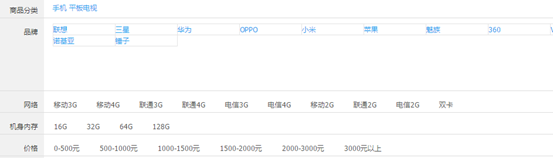

（1）搜索面板的**商品分类**需要使用Spring Data Solr的**分组查询**来实现

（2）为了能够提高查询速度，我们需要把查询面板的品牌、规格数据提前放入**redis**

（3）查询条件的构建、面板的隐藏需要使用angularJS来实现

（4）后端的分类、品牌、规格、价格区间查询需要使用**过滤查询**来实现


## 10.1 显示商品分类分组查询

service中添加私有方法并调用

```java
/**
 * 分组查询商品分类列表
 */
private List searchCategoryList(Map searchMap){
    List<String> list = new ArrayList<>();
    //关键字的条件查询（利用复制域），相当于where
    Criteria criteria = new Criteria("item_keywords").is(searchMap.get("keywords"));
    Query query = new SimpleQuery(criteria);
    //设置分组选项，相当于group by。可能有多个分组（继续addGroupByField即可）
    GroupOptions groupOptions = new GroupOptions().addGroupByField("item_category");
    query.setGroupOptions(groupOptions);
    //分组页
    GroupPage<TbItem> items = solrTemplate.queryForGroupPage(query, TbItem.class);
    //分组结果
    GroupResult<TbItem> item_category = items.getGroupResult("item_category");
    //分组entry页
    Page<GroupEntry<TbItem>> groupEntries = item_category.getGroupEntries();
    //分组entryj集合，便利获取值
    List<GroupEntry<TbItem>> content = groupEntries.getContent();
    for (GroupEntry<TbItem> tbItemGroupEntry : content) {
        list.add(tbItemGroupEntry.getGroupValue());
    }
    return list;
}
```

HTML中遍历

```html
<div ng-if="resultMap.categoryList!=null" >
    <a ng-repeat="category in resultMap.categoryList" href="#{{$index}}">{{category}} </a>
</div>
```


## 10.2 缓存品牌、规格数据

> 将商品分类数据、品牌数据、和规格数据都放入Redis存储

（1）当用户进入运营商后台的商品分类页面时，将**商品分类数据**放入缓存（Hash）。以**分类名称作为key** ，以**模板ID作为值**

（2）当用户进入运营商后台的模板管理页面时，分别将**品牌**数据和**规格**数据放入缓存（Hash）。以模板ID作为key，以品牌列表和规格列表作为值

------

1. `ItemCatServiceImpl`缓存模板ID，放在`findByParentId`方法中，每次增删改都会调用该方法来显示页面

   ```java
   @Autowired
   private RedisTemplate redisTemplate;
   
   private void saveToRedis() {
       //模板分类页面会先调用这个方法，执行增删改也会执行这个方法，所以放这里好！
       //将模板id存入缓存
       List<TbItemCat> list = findAll();
       for (TbItemCat itemCat : list) {
           redisTemplate.boundHashOps("itemCat").put(itemCat.getName(),itemCat.getTypeId());
       }
   }
   ```

2. `TypeTemplateServiceImpl`缓存品牌和规格

   ```java
   @Autowired
   private RedisTemplate redisTemplate;
   
   private void saveToRedis() {
       List<TbTypeTemplate> typeTemplateList = findAll();
       for (TbTypeTemplate typeTemplate : typeTemplateList) {
           List<Map> brandList = JSON.parseArray(typeTemplate.getBrandIds(), Map.class);//品牌列表转换json字符串
           redisTemplate.boundHashOps("brandList").put(typeTemplate.getId(),brandList);//缓存品牌列表
   
           List<Map> specList = findSpecList(typeTemplate.getId());//规格列表整合规格选项（之前封装好的方法）
           redisTemplate.boundHashOps("specList").put(typeTemplate.getId(),specList);
       }
       System.out.println("缓存品牌列表");
   }
   ```

   

## 10.3 显示品牌和规格数据

> 在搜索面板区域显示**第一个分类**的**品牌和规格**列表

```java
/**
 * 查询品牌和规格列表
 */
private Map searchBrandAndSpecList(String categoryName) {
    Map map = new HashMap();
    //1.根据商品分类名称得到模板id
    Long categoryId = (Long) redisTemplate.boundHashOps("itemCat").get(categoryName);
    if (categoryId != null) {
        //2.根据模板id获取品牌列表
        List brandList = (List) redisTemplate.boundHashOps("brandList").get(categoryId);
        map.put("brandList", brandList);
        //3.根据模板id获取规格列表
        List specdList = (List) redisTemplate.boundHashOps("specList").get(categoryId);
        map.put("specdList", specdList);
    }
    return map;
}
```

前端还是只需修改HTML


## 10.4 过滤条件构建（所有前端代码）

点击搜索面板上的分类、品牌、规格和价格，实现查询条件的构建。查询条件以面包屑的形式显示。

当面包屑显示分类、品牌、规格和价格时，要同时隐藏搜索面板对应的区域。

用户可以点击面包屑上的X撤销查询条件。撤销后显示搜索面包相应的区域。

分页。

**增加/撤销查询条件**

`ItemSearchController.js`

```js
app.controller("itemSearchController", function ($scope, itemSearchService,$location) {

    $scope.searchMap = {
        'keywords': '',
        'category': '',
        'brand': '',
        'spec': {},
        'price': '',
        'pageNum': 1,
        'pageSize': 40,
        'sort': '',
        'sortField': ''
    };
    $scope.search = function () {

        itemSearchService.search($scope.searchMap).success(function (data) {
            $scope.resultMap = data;
            buildPageLabel();
        })
    };

    //构建分页栏
    buildPageLabel = function () {
        $scope.pageLabel = [];//分页要遍历的变量

        //若是总页数小于等于5，直接使用下面的值
        let startPage = 1;
        let endPage = $scope.resultMap.pages;
        //$scope.startPoint = false;//前面的三个点。注释掉了，但是代码可用
        //$scope.endPoint = false;//后面的三个点

        //若是总页数大于5，重新指定值
        if ($scope.resultMap.pages > 5) {
            if ($scope.searchMap.pageNum - 2 <= 1) { //显示前5页
                endPage = 5;
                //$scope.endPoint = true;//后面的三个点
            } else if ($scope.searchMap.pageNum + 2 >= endPage) {//显示后5页
                startPage = endPage - 4;
                //$scope.startPoint = true;//前面的三个点
            } else {
                startPage = $scope.searchMap.pageNum - 2;
                endPage = $scope.searchMap.pageNum + 2;
                //$scope.startPoint = true;//前面的三个点
                //$scope.endPoint = true;//后面的三个点
            }
        }
        //构建分页要遍历的变量
        for (let i = startPage; i <= endPage; i++) {
            $scope.pageLabel.push(i);
        }

    };

    //翻页
    $scope.queryByPage = function (pageNum) {
        pageNum = parseInt(pageNum);//HTML中绑定文本框传入的数据是字符串，需转换
        if (pageNum <= 0 || pageNum > $scope.resultMap.pages) {//对页码校验
            return;
        }
        $scope.searchMap.pageNum = pageNum;
        $scope.search();
    }

    //添加搜索项
    $scope.addSearchItem = function (key, value) {
        if ('category' == key || 'brand' == key || 'price' == key) { //分类或品牌或价格
            $scope.searchMap[key] = value;
        } else { //规格
            $scope.searchMap.spec[key] = value;
        }
        $scope.search();//每次更改查询
    };

    //撤销搜索项
    $scope.removeSearchItem = function (key) {
        if ('category' == key || 'brand' == key || 'price' == key) { //分类或品牌或价格
            $scope.searchMap[key] = '';
        } else { //规格
            delete $scope.searchMap.spec[key];
        }
        $scope.search();//每次更改查询
    };

    //排序
    $scope.sortSearch = function (sort, sortField) {
        $scope.searchMap.sort = sort;
        $scope.searchMap.sortField = sortField;
        $scope.search();
    };

    //隐藏品牌列表（当关键字包含品牌时）
    $scope.keywordsIsBrand = function () {
        for (let i = 0; i < $scope.resultMap.brandList.length; i++) {
            if ($scope.searchMap.keywords.indexOf($scope.resultMap.brandList[i].text)!=-1) {
                return true;
            }
        }
        return false;
    }
    
    //首页传参（静态页面传参），在body中调用即可
    $scope.loadKeywords = function () {
        $scope.searchMap.keywords = $location.search()['keywords'];
        $scope.search();
    }
});
```

HTML中**面包屑**和**隐藏/显示查询面板**

```html
<!--面包屑。遍历时key value使用-->
<li class="tag" ng-if="searchMap.category!=''" ng-click="removeSearchItem('category')">{{searchMap.category}}</li>
<li class="tag" ng-if="searchMap.brand!=''" ng-click="removeSearchItem('brand')">{{searchMap.brand}}</li>
<li class="tag" ng-repeat="(key,value) in searchMap.spec" ng-click="removeSearchItem(key)">{{key}}:{{value}}</li>
<li class="tag" ng-if="searchMap.price!=''" ng-click="removeSearchItem('price')">{{searchMap.price}}</li>

<!--查询条件，其他类似-->
<div class="type-wrap" ng-if="resultMap.categoryList!=null && searchMap.category==''">
    <a ng-repeat="category in resultMap.categoryList" ng-click="addSearchItem('category',category)"
       href="#">{{category}} </a>
</div>
......

<div class="type-wrap" ng-repeat="spec in resultMap.specList" ng-if="searchMap.spec[spec.text]==null">
    <div class="fl key">{{spec.text}}</div>
    ...
    <li ng-repeat="option in spec.options">
        <a ng-click="addSearchItem(spec.text,option.optionName)" href="#">{{option.optionName}}</a>
    </li>
</div>
......
```

HTML中分页（要记得每次点击搜索按钮时置当前页pageNum为1，否则会出错）

```html
<!--分页栏-->
<li class="prev {{searchMap.pageNum-1<=0?'disabled':''}}">
    <a ng-click="queryByPage(searchMap.pageNum-1)">«</a>
</li>
<li class="dotted"><span ng-if="startPoint==true">...</span></li>
<li ng-repeat="x in pageLabel">
    <a href="#" ng-click="queryByPage(x)">{{x}}</a>
</li>
<li class="dotted"><span ng-if="endPoint==true">...</span></li>
<li class="next {{searchMap.pageNum+1>resultMap.pages?'disabled':''}}">
    <a ng-click="queryByPage(searchMap.pageNum+1)">»</a>
</li>
<div><span>共{{resultMap.pages}}页&nbsp;</span><span>
<!--跳转页-->
到第<input type="text" class="page-num" ng-model="searchMap.pageNum">页 
    <button class="page-confirm" ng-click="queryByPage(searchMap.pageNum)">确定</button></span></div>
```


## 10.5 过滤查询（所有后端代码）

> 还需修改根据分类查询品牌规格列表（之前的代码没考虑选择后品牌和规格的变化）。这里价格区间有些硬编码。

```java
@Service(timeout = 5000)//推荐写在服务提供方。所两方同时写，以消费方为准
public class ItemSearchServiceImpl implements ItemSearchService {

    @Autowired
    private SolrTemplate solrTemplate;

    /**
     * 搜索
     */
    @Override
    public Map search(Map searchMap) {
        //去掉搜索关键字中的空格
        String  keywords = (String) searchMap.get("keywords");
        searchMap.put("keywords",keywords.replace(" ",""));
        
        Map map = new HashMap<>();
        //1.查询列表数据
        map.putAll(searchList(searchMap));
        //2.分组查询商品分类列表
        List<String> categoryList = searchCategoryList(searchMap);
        map.put("categoryList", categoryList);
        //3.根据分类名称查询品牌和规格列表
        String category = (String) searchMap.get("category");
        if ("".equals(category)) { //若没选择分类，按第一个分类查询
            if (categoryList.size() > 0) {
                map.putAll(searchBrandAndSpecList(categoryList.get(0)));
            }
        } else { //若选择了分类，按选择的分类名称查询
            map.putAll(searchBrandAndSpecList(category));
        }
        return map;
    }

    /**
     * 列表查询（过滤查询等等）
     */
    private Map searchList(Map searchMap) {
        Map map = new HashMap();

        //1.1关键字查询（利用复制域）
        Criteria criteria = new Criteria("item_keywords").is(searchMap.get("keywords"));
        HighlightQuery query = new SimpleHighlightQuery(criteria);
        //高亮选项设置
        HighlightOptions highlightOptions = new HighlightOptions()
            .addField("item_title")//高亮Filed域
            .setSimplePrefix("<span style='color: red;'>")//HTML前缀
            .setSimplePostfix("</span>");//HTML后缀
        query.setHighlightOptions(highlightOptions);//设置高亮设置

        //1.2按照商品分类过滤
        if (!"".equals(searchMap.get("category"))) { //若用户选择了分类
            Criteria filterCriteria = new Criteria("item_category").is(searchMap.get("category"));
            FilterQuery filterQuery = new SimpleFilterQuery(filterCriteria);
            query.addFilterQuery(filterQuery);
        }

        //1.3按照品牌过滤
        if (!"".equals(searchMap.get("brand"))) { //若用户选择了品牌
            Criteria filterCriteria = new Criteria("item_brand").is(searchMap.get("brand"));
            FilterQuery filterQuery = new SimpleFilterQuery(filterCriteria);
            query.addFilterQuery(filterQuery);
        }

        //1.4按照规格过滤
        if (searchMap.get("spec") != null) { //若用户选择了规格

            Map<String, String> specMap = (Map<String, String>) searchMap.get("spec");
            Set<Map.Entry<String, String>> entries = specMap.entrySet();
            for (Map.Entry<String, String> entry : entries) {
                System.out.println(entry.getKey() + "====" + entry.getValue());
                Criteria filterCriteria = new Criteria("item_spec_" + entry.getKey()).is(entry.getValue());
                FilterQuery filterQuery = new SimpleFilterQuery(filterCriteria);
                query.addFilterQuery(filterQuery);
            }
        }
        
        //1.5按照价格过滤
        if (!"".equals(searchMap.get("price"))){
            String price = (String) searchMap.get("price");
            String[] split = price.split("-");

            Criteria filterCriteria = new Criteria("item_price");
            if (!split[0].equals("0")){ //起始条件
                filterCriteria.greaterThanEqual(split[0]);//大于等于
            }
            if (!split[1].equals("*")){ //终止条件
                filterCriteria.lessThanEqual(split[1]); //小于等于
            }
            FilterQuery filterQuery = new SimpleFilterQuery(filterCriteria);
            query.addFilterQuery(filterQuery);
        }
        
        //1.6分页
        Integer pageNum = (Integer) searchMap.get("pageNum");//当前页
        if (pageNum==null){
            pageNum = 1;
        }
        Integer pageSize = (Integer) searchMap.get("pageSize");//每页记录数
        if (pageSize==null){
            pageSize = 20;
        }
        query.setOffset((pageNum-1)*pageSize);//起始索引（不是页码）
        query.setRows(pageSize);//每页记录数
        //在最后返回getContent()后还需传递pages、total；

        //1.7排序（根据传入的Field字段）
        String  sortValue = (String) searchMap.get("sort");//升序或降序
        String sortField = (String) searchMap.get("sortField");//排序的Field字段
        if (sortValue!=null && !sortValue.equals("")){
            if (sortValue.equals("ASC")){
                Sort sort = new Sort(Sort.Direction.ASC,"item_"+sortField);
                query.addSort(sort);
            } else if (sortValue.equals("DESC")){
                Sort sort = new Sort(Sort.Direction.DESC,"item_"+sortField);
                query.addSort(sort);
            }
        }
        
        //高亮页对象
        HighlightPage<TbItem> items = solrTemplate.queryForHighlightPage(query, TbItem.class);

        //遍历并设置高亮
        List<HighlightEntry<TbItem>> highlighted = items.getHighlighted();//高亮entry集合（每条记录）
        for (HighlightEntry<TbItem> entry : highlighted) {
            //高亮列表（高亮Filed域个数可能多个）。并且每个Filed域可能存储多值（此处没有）
            TbItem item = entry.getEntity();//获取源实体类
            List<HighlightEntry.Highlight> highlights = entry.getHighlights();
            if (highlights.size() > 0 && highlights.get(0).getSnipplets().size() > 0) {
                item.setTitle(highlights.get(0).getSnipplets().get(0));
            }
        }

        map.put("list", items.getContent());//当前页所有数据
        map.put("pages",items.getTotalPages());//总页数
        map.put("total",items.getTotalElements());//总记录数
        return map;
    }

    /**
     * 分组查询商品分类列表
     */
    private List searchCategoryList(Map searchMap) {
        List<String> list = new ArrayList<>();
        //关键字的条件查询（利用复制域），相当于where
        Criteria criteria = new Criteria("item_keywords").is(searchMap.get("keywords"));
        Query query = new SimpleQuery(criteria);
        //设置分组选项，相当于group by。可能有多个分组（继续addGroupByField即可）
        GroupOptions groupOptions = new GroupOptions().addGroupByField("item_category");
        query.setGroupOptions(groupOptions);
        //分组页
        GroupPage<TbItem> items = solrTemplate.queryForGroupPage(query, TbItem.class);
        //分组结果
        GroupResult<TbItem> item_category = items.getGroupResult("item_category");
        //分组entry页
        Page<GroupEntry<TbItem>> groupEntries = item_category.getGroupEntries();
        //分组entryj集合，便利获取值
        List<GroupEntry<TbItem>> content = groupEntries.getContent();
        for (GroupEntry<TbItem> tbItemGroupEntry : content) {
            list.add(tbItemGroupEntry.getGroupValue());
        }
        return list;
    }

    @Autowired
    private RedisTemplate redisTemplate;

    /**
     * Redis查询品牌和规格列表
     */
    private Map searchBrandAndSpecList(String categoryName) {
        Map map = new HashMap();
        //1.根据商品分类名称得到模板id
        Long categoryId = (Long) redisTemplate.boundHashOps("itemCat").get(categoryName);
        if (categoryId != null) {
            //2.根据模板id获取品牌列表
            List brandList = (List) redisTemplate.boundHashOps("brandList").get(categoryId);
            map.put("brandList", brandList);
            //3.根据模板id获取规格列表
            List specdList = (List) redisTemplate.boundHashOps("specList").get(categoryId);
            map.put("specList", specdList);
        }
        return map;
    }
}
```


# 11 搜索 Solr-3

## 11.1 分页

> 查看10.4和10.5


## 11.2 多关键字搜索

> 如搜索“三星手机”时，可能自动**分词**为三星手机、三星、手机，**按顺序**查询出。是**或**的关系。
>
> 若搜索“三星 手机”时，将不会分词，是与的关系。所以需要在后端去掉空格（运营角度考虑，搜出的东西多点）
>
> 查看10.5


## 11.3 排序（未完整）

> 查看10.5

HTML暂时这样写

```html
<li class="active">
    <a href="#" ng-click="sortSearch('','')">综合</a>
</li>
<li>
    <a href="#">销量</a> <!--订单模块暂时没做-->
</li>
<li>
    <a href="#" ng-click="sortSearch('DESC','updatetime')">新品</a>
</li>
<li>
    <a href="#">评价</a> <!--评价模块暂时没做-->
</li>
<li>
    <a href="#" ng-click="sortSearch('ASC','price')">价格↑</a>
</li>
<li>
    <a href="#" ng-click="sortSearch('DESC','price')">价格↓</a>
</li>
```

新品按照上架时间来降序，需要在solrhome的scheme.xml中添加基本域，修改字段，并导入数据

```xml
<field name="item_updatetime" type="string" indexed="true" stored="true" /><!--updatetime,上架时间-->
```

```java
@Field("item_updatetime")
private Date updateTime;
```


> **销量排序**需要查询order和order_item表，统计出来（尽量统计**某一周期的销量**！）。但是销量是实时变化的，可以做个定时任务，来批量导入数据到solr中。定时任务可以采用**Spring Task**框架，可以放在凌晨。
>
> 评价排序同上，但是需要根据好评、中评、差评按权重来统计


## 11.4 隐藏品牌列表

> 关键字中输入品牌，那么下面的品牌列表需要隐藏。查看10.4

只需在前端判断**关键字子字符串**是否在**品牌列表**中


## 11.5 搜索页与首页对接（new）

> 查看10.4

静态页面传参，`$location`服务的`search()`方法，在数组中取值

```html
<input ng-model="keywords" type="text"  class="input-error input-xxlarge"/>
<button  type="button" ng-click="search()" >搜索</button>
```

```js
//搜索，传递参数
$scope.search = function () {
    location.href = "http://localhost:9104/search.html#?keywords="+$scope.keywords;
}
```


## 11.6 更新索引库（new）

在进行**商品审核后**更新到solr索引库,在**商品删除后**删除solr索引库中相应的记录。要符合分模块开发的要求：

1. 商家商品服务：**查询**方法，根据SPU的ID集合来查询SKU列表（状态为已审核）
2. 搜索服务：批量**导入**方法，接收的参数为SKU列表。**删除**SKU商品
3. 运营商后台：**审核通过**、**删除**时调用上面俩方法（删除时只需要搜索服务）

`com/pinyougou/sellergoods/service/impl/GoodsServiceImpl.java`

```java
//根据SPU的id集合查询SKU列表
@Override
public List<TbItem> findItemListByGoodsIdListAndStatus(Long[] goodsIds, String status){
    TbItemExample example = new TbItemExample();
    TbItemExample.Criteria criteria = example.createCriteria();
    criteria.andStatusEqualTo(status);
    criteria.andGoodsIdIn(Arrays.asList(goodsIds));//指定条件（SPU的ID集合）数组转集合
    return itemMapper.selectByExample(example);
}
```

`com/pinyougou/search/service/impl/ItemSearchServiceImpl.java`

```java
@Override
public void importList(List list){
    solrTemplate.saveBeans(list);
    solrTemplate.commit();
}

@Override
public void deleteByGoodsIds(List goodsIds) {
    Criteria criteria = new Criteria("item_goodsid").in(goodsIds);
    Query query = new SimpleQuery(criteria);
    solrTemplate.delete(query);
    solrTemplate.commit();
}
```

`com/pinyougou/manager/controller/GoodsController.java`

```java
@Reference(timeout = 10000)
private ItemSearchService itemSearchService;

@RequestMapping("/updateStatus")
public Result updateStatus(Long[] ids, String status){
    try {
        goodsService.updataStatus(ids,status);
        if ("1".equals(status)){ //审核通过
            //需要导入的SKU列表
            List<TbItem> list = goodsService.findItemListByGoodsIdListAndStatus(ids, "1");
            //引入pinyougou-search-interface
            itemSearchService.importList(list);
        }
        return new Result(true,"修改成功");
    } catch (Exception e) {
        e.printStackTrace();
        return new Result(false,"修改失败");

    }
}

@RequestMapping("/delete")
public Result delete(Long [] ids){
    try {
        itemSearchService.deleteByGoodsIds(Arrays.asList(ids));//这里
        goodsService.delete(ids);
        return new Result(true, "删除成功"); 
    } catch (Exception e) {
        e.printStackTrace();
        return new Result(false, "删除失败");
    }
}
```


# 12 网页静态化 Freemarker

> 网页静态化解决方案在实际开发中运用比较多，例如新闻网站，门户网站中的新闻频道或者是文章类的频道
>
> 对于电商网站的**商品详细页**来说，至少几百万个商品，每个商品又有大量的信息，这样的情况同样也适用

网页静态化技术和缓存技术的共同点都是为了**减轻数据库的访问压力**，但是具体的应用场景不同，缓存比较适合小规模的数据，而网页静态化比较适合大规模且相对变化不太频繁的数据。另外网页静态化还有利于**SEO（搜索引擎优化）**。

另外我们如果将**网页**以**纯静态化**的形式展现，就可以**使用Nginx这样的高性能的web服务器来部署**。Nginx可以承载**5万的并发**，而**Tomcat只有几百**。关于Nginx我们在后续的课程中会详细讲解。


## 12.1 入门

### 12.1.1 Demo

* Maven引入依赖

  ```xml
  <dependency>
      <groupId>org.freemarker</groupId>
      <artifactId>freemarker</artifactId>
      <version>2.3.23</version>
  </dependency>
  ```

* 模板文件`test.ftl`

  ```
  <html>
  <head>
  <title>demo</title>
  <mete charset="UTF-8"/>
  </head>
  <body>
  <#--注释，不会输出到源代码中-->
  <!--会输出到源代码中-->
  ${name},你好。${message}
  </body>
  </html>
  ```

* `Test.java`，执行后即可在D盘找到生成的html文件

  ```java
  public static void main(String[] args) throws IOException, TemplateException {
      //1.创建一个配置对象
      Configuration configuration = new Configuration(Configuration.getVersion());
      //2.设置模板所在目录
      configuration.setDirectoryForTemplateLoading(new File("D:\\Code-Workspace\\IDEA\\freemarkerdemo\\src\\main\\resources\\"));
      //3.设置字符集
      configuration.setDefaultEncoding("UTF-8");
      //4.获取模板对象
      Template template = configuration.getTemplate("test.ftl");
      //5.创建数据模型（可以是对象，也可以是map）
      Map map = new HashMap();
      map.put("name","张三");
      map.put("message","欢迎来品优购");//少给值运行时就报错
      //6.创建一个输出流对象
      FileWriter out = new FileWriter("d:\\test.html");
      //7.输出
      template.process(map,out);
      //8.关闭输出流
      out.close();
  }
  ```


### 12.1.2 指令

* assign：此指令用于在页面上定义一个变量

  * 定义简单类型

    ```
    <#assign linkman="周先生">
    联系人：${linkman}
    ```

  * 定义对象类型

    ```
    <#assign info={"mobile":"13301231212",'address':'北京市昌平区王府街'} >
    电话：${info.mobile}  地址：${info.address}
    ```

* include：此指令用于模板文件的嵌套

  * 创建模板文件head.ftl

  * 我们修改test.ftl，在模板文件中使用include指令引入刚才我们建立的模板

    ```
    <#include "head.ftl">
    ```

* if：判断（可以用==、=）

  ```
  <#if success==true>
  你已通过实名认证
  <#else>  
  你未通过实名认证
  </#if>
  ```

  在代码中对str变量赋值

  ```java
  map.put("success", true);
  ```

* list：遍历

  ```
  <#list goodsList as goods>
  	${goods_index+1} 商品名称： ${goods.name} 价格：${goods.price}<br>
  </#list>
  ```

  

### 12.1.3 内建函数

内建函数语法格式： `变量?函数名称`

* 获取集合大小

  ```
  共  ${goodsList?size}  条记录
  ```

* 转换JSON字符串为对象

  ```
  <#assign text="{'bank':'工商银行','account':'10101920201920212'}" />
  <#assign data=text?eval />
  开户行：${data.bank}  账号：${data.account}
  ```

* 日期格式化

  ```
  当前日期：${today?date} <br>
  当前时间：${today?time} <br>   
  当前日期+时间：${today?datetime} <br>        
  日期格式化：  ${today?string("yyyy年MM月")}
  ```

* 数字转换为字符串：数字会以每三位一个分隔符显示，不需要这个分隔符，使用内建函数c

  ```
  累计积分：${point?c}
  ```

* 空值处理运算符：在模板中使用了变量但是在代码中没有对变量赋值，那么运行生成时会抛出异常

  * 判断某变量是否存在:“`??`”

    ```
    <#if aaa??>
    aaa变量存在
    <#else>
    aaa变量不存在
    </#if>
    ```

  * 缺失变量默认值:“`!`”：使用!对null值做转换处理，值可以自定义

    ```
    ${aaa!'-'}
     <#-- 当aaa为null则返回！后边的内容-  -->
    ```

* 运算符

  * 算数运算符：`+, - , * , / , %`
  * 逻辑运算符：`&&、||、!`，只能作用于布尔值
  * 比较运算符
    * `=`或者`==`:判断两个值是否相等. 
    * `!=`:判断两个值是否不等. 
    * `>`或者`gt`:判断左边值是否大于右边值（有时需要括号括起来，否则和标签的小于号对应上，下面的同理）
    * `>=`或者`gte`:判断左边值是否大于等于右边值 
    * `<`或者`lt`:判断左边值是否小于右边值 
    * `<=`或者`lte`:判断左边值是否小于等于右边值 

  **注意**:  =和!=可以用于字符串,数值和日期来比较是否相等,但=和!=两边必须是相同类型的值,否则会产生错误,而且FreeMarker是精确比较,"x","x ","X"是不等的.其它的运行符可以作用于数字和日期,但不能作用于字符串,大部分的时候,使用gt等字母运算符代替>会有更好的效果,因为 FreeMarker会把>解释成FTL标签的结束字符,当然,也可以使用括号来避免这种情况,如:<#if (x>y)> 


## 12.2 商品详情页

> 运用Freemarker技术来实现商品详细页的静态化。通过地址栏输入某地址，如下形式`http://localhost:9101/gen_item.do?goodsId=149187842867952`能在本地电脑某目录生成商品详细页，页面的名称为商品goodsId.html

创建`pinyougou-page-interface`及`pinyougou-page-service`工程

配置文件参考入门

创建`page.properties`文件来存储生成的html文件位置

```properties
pagedir=d:\\item\\
```

Spring中配置文件添加如下配置

```xml
<bean id="freemarkerConfig" class="org.springframework.web.servlet.view.freemarker.FreeMarkerConfigurer">
    <property name="templateLoaderPath" value="/WEB-INF/ftl/"/><!--模板文件路径-->
    <property name="defaultEncoding" value="UTF-8"/>
</bean>
```

`ItemPageServiceImpl`

```java
@Service
public class ItemPageServiceImpl implements ItemPageService {

    @Autowired
    private FreeMarkerConfig freeMarkerConfig;

    @Value("${pagedir}")
    private String pagedir;

    @Autowired
    private TbGoodsMapper goodsMapper;

    @Autowired
    private TbGoodsDescMapper goodsDescMapper;

    @Override
    public boolean genItemHtml(Long goodsId) {
        Configuration configuration = freeMarkerConfig.getConfiguration();
        try {
            Template template = configuration.getTemplate("item.ftl");
            //创建数据模型
            Map dataModel = new HashMap();
            //1.商品主表数据
            TbGoods goods = goodsMapper.selectByPrimaryKey(goodsId);
            dataModel.put("goods",goods);
            //2.商品扩展表数据
            TbGoodsDesc goodsDesc = goodsDescMapper.selectByPrimaryKey(goodsId);
            dataModel.put("goodsDesc",goodsDesc);
		   //3.读取商品分类
            String itemCat1 = itemCatMapper.selectByPrimaryKey(goods.getCategory1Id()).getName();
            String itemCat2 = itemCatMapper.selectByPrimaryKey(goods.getCategory2Id()).getName();
            String itemCat3 = itemCatMapper.selectByPrimaryKey(goods.getCategory3Id()).getName();
            dataModel.put("itemCat1",itemCat1);
            dataModel.put("itemCat2",itemCat2);
            dataModel.put("itemCat3",itemCat3);
            //4.读取SKU列表数据
            TbItemExample example = new TbItemExample();
            TbItemExample.Criteria criteria = example.createCriteria();
            criteria.andGoodsIdEqualTo(goodsId);//SPU ID
            criteria.andStatusEqualTo("1");//状态有效
            example.setOrderByClause("is_default desc");//按照默认字段进行降序排序，目的是返回结果的第一条为默认SKU
            List<TbItem> itemList = itemMapper.selectByExample(example);
            dataModel.put("itemList",itemList);
            
            
            Writer writer = new FileWriter(pagedir+goodsId+".html");

            template.process(dataModel,writer);
            writer.close();

            return true;
        } catch (IOException | TemplateException e) {
            e.printStackTrace();
            return false;
        }
    }
}
```

`GoodsController`

```java
@RequestMapping("/genHtml")
public void genHtml(Long goodsId){
    itemPageService.genItemHtml(goodsId);
}
```


### 12.2.1 商品详情页-模板构建

修改模板文件`item.ftl`

* `<#include 'head.ftl'>`指令来构建头部和尾部

* 生成基本数据

  * 商品名称`${goods.goodsName}`
  * 商品副标题`${goods.caption}`
  * 商品介绍（暂时不涉及扩展属性）`${goods.introduction}`
  * 规格与包装`${goods.packageList}`
  * 售后保障`${goods.saleService}`

  * 运行控制层代码，测试生成效果`<http://localhost:9101/goods/genHtml.do?goodsId=149187842867960>`

* 生成图片列表

  * 转JSON字符串为对象

  * list内建函数遍历

    ```
    <#assign imageList=goodsDesc.itemImages?eval>
    
    <#if (imageList?size>0)>
    	<span>
    </#if>
    
    <ul>
    	<#list imageList as item>
    		<li></li>
    	</#list>
    </ul>
    ```

* 商品介绍中扩展属性（同上）

  ```
  <#assign customAttributeItems=goodsDesc.customAttributeItems?eval>
  
  <#list customAttributeItems as custom>
  	<#if custom.value??><#--变量存在才显示-->
  		<li>${custom.text}：${custom.value}</li>
  	</#if>
  </#list>
  ```

* 规格选项（同上）：==其中方法中带引号是因为，**页面先由Freemarker生成，再由前端来操控**。==

  ```
  <#assign specificationItems=goodsDesc.specificationItems?eval>
  
  <#list specificationItems as spec>
  	<dl>
  		<dt>
  			<div class="fl title">
  				<i>${spec.attributeName}</i>
  			</div>
  		</dt>
  		<#list spec.attributeValue as value>
  			<dd>
  			   <a href="javascript:;"
  				 class="{{isSelected('${spec.attributeName}','${value}')?'selected',''}}"
  				 ng-click="selectSpec('${spec.attributeName}','${value}');">${value}
  				 <span title="点击取消选择">&nbsp;</span>
  			  </a>
               </dd>
  		</#list>
  	</dl>
  </#list>
  ```

* **商品分类面包屑**（先修改`ItemPageServiceImpl`中的方法）

  ```
  <a href="#">${itemCat1}</a>
  <a href="#">${itemCat2}</a>
  <a href="#">${itemCat3}</a>
  ```


### 12.2.2 商品详情页-前端逻辑

* **数量增减**

  ```html
  <body ng-app="pinyougou" ng-controller="itemController" ng-init="num = 1">
      <input autocomplete="off" type="text" value="1" minnum="1" class="itxt"  ng-model="num"/>
      <a href="javascript:void(0)" class="increment plus" ng-click="addNum(1)">+</a>
      <a href="javascript:void(0)" class="increment mins" ng-click="addNum(-1)">-</a>
  </body>
  ```

  ```js
  app.controller("itemController",function ($scope) {
  
      $scope.addNum = function (x) {
          $scope.num = parseInt($scope.num);
          $scope.num += x;
          if ($scope.num<1){
              $scope.num = 1;
          }
      }
  
      $scope.selectedSpec = {};//存储用户选择的规格
      //跟新选中对象
      $scope.selectSpec = function (key, value) {
          $scope.selectedSpec[key] = value;
          searchSku();//查询并更新SKU
      }
      //判断规格是否被选中
      $scope.isSelected = function (key,value) {
          if ($scope.selectedSpec[key]==value){
              return true;
          } else {
              return false;
          }
      }
  
  
      $scope.sku = {};//当前选择的SKU
      $scope.loadSku = function () {
          $scope.sku = skuList[0];//模板生成时产生的JS脚本中的变量
          $scope.selectedSpec = JSON.parse(JSON.stringify($scope.sku.spec));//更新选中的SKU
      }
  
      //判断两个对象是否相等
      matchObject = function (obj1, obj2) {
          //由于可能两个对象的建个数都不同，所以需要都遍历
          for (let k in obj1) { //in遍历的时键
              if (obj1[k]!=obj2[k]){
                  return false;
              }
          }
          for (let k in obj2) { //in遍历的时键
              if (obj2[k]!=obj1[k]){
                  return false;
              }
          }
          return true;
      }
  
      //根据规格查找SKU，在每次用户选择规格后调用
      searchSku = function () {
          for (let i = 0; i < skuList.length; i++) {
              if (matchObject(skuList[i].spec,$scope.selectedSpec)){
                  $scope.sku = skuList[i];
                  return;
              }
          }
          //没找到。实际中应该是根据模板生成的SKU中的规格来决定展示在页面与否（可以不显示该规格）
          $scope.sku = {id:0,title:'-----',price:0};
      }
  
  });
  ```

* **规格选择**

  需要定义一个对象，存储用户选择的key/value，点击标签时更改此对象。控制层方法来判断当前规格与选项是否被选中

  ftl代码看规格选项中。JS代码看数量增减中


### 12.2.3 商品详情页-读取SKU信息

> 需求：当我们选择规格后，应该在页面上更新商品名称为SKU的商品标题，价格也应该为SKU的商品价格，不再是SPU数据

* **页面生成SKU列表变量**

  * 服务层（查看上面`ItemPageServiceImpl`）

  * ==解**决前端与静态文件交互**：**ftl页面JS脚本**（因为**从ftl生成html时就保存好数据**，所以不能放在前端）==

    ```
    var skuList = [
        <#list itemList as item>
            {
                    id:${item.id?c},
                    title:'${item.title}',
                    price:${item.price?c},
                    spec:${item.spec}
            },
        </#list>
    ];
    ```

* **显示SKU标题和价格**

  * 加载**默认SKU信息**（ftl页面中标题/价格等需要使用AngularJS来绑定SKU数据，不再时生成时的SPU模板数据），代码看上面

* **选择规格更新SKU**

  * 判断用户当前选择的规格和模板中JS代码的spec对象是否相等（对象不能使用`==`，遍历来判断），相等就更新sku数据

* **添加商品到购物车（当前为模拟）**

  需要SKU的ID和数量，暂时只弹框，因为需要跳转到购物车页面（实际中在边栏显示添加的商品）

  

  

## 12.3 系统模块对接

### 12.3.1 运营商后台调用页面生成服务

需要的是在**商品审核通过时生成html静态页**，修改`pinyougou-manager-web`的`GoodsController`

```java
@RequestMapping("/updateStatus")
public Result updateStatus(Long[] ids, String status){
    try {
        goodsService.updataStatus(ids,status);
        if ("1".equals(status)){ //审核通过
            //=====1.导入到solr索引库中=====
            //需要导入的SKU列表
            List<TbItem> list = goodsService.findItemListByGoodsIdListAndStatus(ids, "1");
            //引入pinyougou-search-interface
            itemSearchService.importList(list);

            
            //=====2.生成商品详细页=====
            for (Long id : ids) {
                itemPageService.genItemHtml(id);
            }
        }
        return new Result(true,"修改成功");
    } catch (Exception e) {
        e.printStackTrace();
        return new Result(false,"修改失败");
    }
}
```


### 12.3.2 创建商品详细页web工程

**这只是开发环境，使用Tomcat部署，在部署阶段，将部署到Nginx**

创建war模块工程`pinyougou-page-web` ，将目标目录（d:\item）的文件拷贝到此工程（生成的页面不用拷贝），只需在`pom.xml`设置端口为9105，`web.xml`中什么都不用配置。

在`pinyougou-search-web`中的`search.html`页面的遍历页面数据中设置a标签`http://localhost:9105/{{item.id}}.html`


# 13 消息中间件 JMS

## 13.1 JMS 入门

### 13.1.1 消息中间件

当前完成的模块之间调用

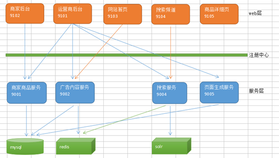

其中运营商后台的调用关系最多，用到了商家商品服务、广告内容服务、搜索服务和页面生成服务。这种模块之间的依赖也称之为耦合。而耦合越多，之后的维护工作就越困难。解决方案----消息中间件。

------

**消息中间件**利用高效可靠的消息传递机制进行**平台无关的数据交流**，并基于数据通信来进行[分布式系统](https://baike.baidu.com/item/%E5%88%86%E5%B8%83%E5%BC%8F%E7%B3%BB%E7%BB%9F)的集成。通过提供**消息传递**和**消息排队**模型，它可以在分布式环境下扩展进程间的通信。对于消息中间件，常见的角色大致也就有Producer（生产者）、Consumer（消费者）。常见的消息中间件产品：

* **ActiveMQ**

  ActiveMQ 是Apache出品，最流行的，能力强劲的开源消息总线。ActiveMQ 是一个完全支持JMS1.1和J2EE 1.4规范的 JMS Provider实现。

* RabbitMQ

  AMQP协议的领导实现，支持多种场景。淘宝的MySQL集群内部有使用它进行通讯，OpenStack开源云平台的通信组件，最先在金融行业得到运用。

* ZeroMQ

  史上最快的消息队列系统

* Kafka

  Apache下的一个子项目 。特点：高吞吐，在一台普通的服务器上既可以达到10W/s的吞吐速率；完全的分布式系统。适合处理海量数据。

------

改造系统模块调用关系

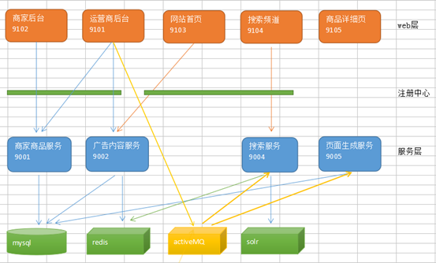

使得运营商系统与搜索服务、页面生成服务解除了耦合，这俩模块的调用**不需要返回数据，所以可以解耦**，但是商家商品服务和广告内容服务由于**需要获取返回数据，所以不可以解耦**。


### 13.1.2 JMS简介

JMS（Java Messaging Service）是Java平台上有关面向消息中间件的**技术规范**，它便于消息系统中的Java应用程序进行消息交换，并且通过**提供标准的产生、发送、接收消息的接口**简化企业应用的开发

JMS 本身只定义了一系列的**接口规范**，是一种与厂商无关的 API，用来访问消息收发系统。它**类似于 JDBC**(Java Database Connectivity)，JDBC 是可以用来访问许多**不同关系数据库的 API**，而 JMS 则提供同样**与厂商无关的访问方法**。

JMS 使您能够通过**消息收发服务**（有时称为消息中介程序或路由器）从一个 JMS 客户机向另一个 JML 客户机发送消息。**消息**是 JMS 中的一种**类型对象**，由两部分组成：**报头**和**消息主体**。报头由**路由信息**以及**有关该消息的元数据**组成。消息主体则携带着**应用程序的数据或有效负载**。

JMS 定义了**五种不同的消息正文格式**，以及**调用的消息类型**，允许你发送并接收以一些不同形式的数据，提供现有消息格式的一些级别的兼容性。

* **TextMessage**--一个字符串对象
* **MapMessage**--一套名称-值对
* ObjectMessage--一个序列化的 Java 对象
* BytesMessage--一个字节的数据流
* StreamMessage -- Java 原始值的数据流

------

**JMS消息传递类型**

==此处的**生产者**与**消费者**和Dobbox中正好相反==

* **点对点**的，即一个生产者（如运营商后台）和一个消费者（如搜索服务或页面生成服务，但==**只能一个接收到**==）一一对应

  适用于**只需要执行一次**的，如品优购中搜索服务中导入solr；推送等

  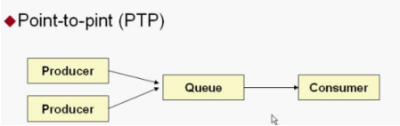

* **发布/ 订阅模式**，即一个生产者产生消息并进行发送后，可以由多个消费者进行接收

  类似广播，适用于==**需要多次执行**==，如品优购中**页面生成服务**（由于部署在Nginx集群上，**并发**有多个服务，**存储同样数据**）；

  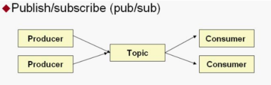


### 13.1.3 ActiveMQ使用

* [官网](http://activemq.apache.org/)下载
* 安装在Linux中
  1. 上传文件到Linux服务器：`scp apache-activemq-5.12.0-bin.tar.gz root@192.168.25.129:/root/`
  2. 解压：`tar -zxvf apache-activemq-5.12.0-bin.tar.gz`
  3. 为apache-activemq-5.12.0目录赋权：`chmod 777 apache-activemq-5.12.0`，（421权限）
  4. 进入apache-activemq-5.12.0\bin目录，赋与执行权限：`chmod 755 activemq`
  5. 启动：`./activemq start`
  6. 关闭：`./activemq stop`
  7. 进入ActiveMQ管理页面：`http://192.168.25.129:8161/`
  8. 输入用户名和密码 ，均为 admin
* **Queues**为点对点模式，Queues中信息含义如下（1+4=3）：
  * **Number Of Pending Messages**：等待消费的消息 这个是当前未出队列的数量
  * **Number Of Consumers**：当前监听（活跃）的消费者端的数量
  * **Messages Enqueued**：进入队列的消息  进入队列的总数量，包括出队列的
  * **Messages Dequeued**：出了队列的消息  可以理解为是消费这消费掉的数量
* **Topics**为订阅模式


## 13.2 JMS 入门 Demo

### 13.2.1 点对点模式

​	点对点的模式主要建立在一个**队列**上面，当连接一个列队的时候，发送端不需要知道接收端是否正在接收，可以直接向ActiveMQ发送消息，**发送的消息，将会先进入队列中**，如果有接收端在监听，则会发向接收端，如果没有接收端接收，则会保存在activemq服务器，直到接收端接收消息，点对点的消息模式**可以有多个发送端，多个接收端**，但是**一条消息，只会被一个接收端给接收到**，哪个接收端**先连上**ActiveMQ，则会先接收到，而后来的接收端则接收不到那条消息。

* 创建工程jmsDemo ，引入依赖

  ```xml
  <dependency>
      <groupId>org.apache.activemq</groupId>
      <artifactId>activemq-client</artifactId>
      <version>5.13.4</version>
  </dependency>
  ```

* 创建消息生产者类`QueueProducer`，`main()`方法代码如下（运行后在管理界面可以看到）

  * 获取session中方法的参数
    * 参数1：是否启动事务，启用则需要手动提交；不启用则自动提交
    * 参数2：消息确认模式
      * AUTO_ACKNOWLEDGE = 1    自动确认
      * CLIENT_ACKNOWLEDGE = 2    客户端手动确认
      * DUPS_OK_ACKNOWLEDGE = 3    自动批量确认
      * SESSION_TRANSACTED = 0    事务提交并确认

  ```java
  //1.创建连接工厂（此处的端口号是ActiveMQ的，不是管理界面web项目的）
  ConnectionFactory connectionFactory=new ActiveMQConnectionFactory("tcp://192.168.25.129:61616");
  //2.获取连接
  Connection connection = connectionFactory.createConnection();
  //3.启动连接
  connection.start();
  //4.获取session
  //参数1：是否启动事务，启用则需要手动提交；不启用则自动提交
  //参数2：消息确认模式
  Session session = connection.createSession(false, Session.AUTO_ACKNOWLEDGE);		
  //5.创建队列对象
  Queue queue = session.createQueue("test-queue");
  //6.创建消息生产者
  MessageProducer producer = session.createProducer(queue);
  //7.创建消息
  TextMessage textMessage = session.createTextMessage("欢迎来到神奇的品优购世界");
  //8.发送消息
  producer.send(textMessage);
  //9.关闭资源
  producer.close();
  session.close();
  connection.close();
  ```

* 创建消息消费者类`QueueConsumer`，`main()`方法代码如下（运行后在管理界面可以看到）

  ```java
  //1.创建连接工厂
  ConnectionFactory connectionFactory=new ActiveMQConnectionFactory("tcp://192.168.25.129:61616");
  //2.获取连接
  Connection connection = connectionFactory.createConnection();
  //3.启动连接
  connection.start();
  //4.获取session
  //参数1：是否启动事务，启用则需要手动提交；不启用则自动提交
  //参数2：消息确认模式
  Session session = connection.createSession(false, Session.AUTO_ACKNOWLEDGE);
  //5.创建队列对象
  Queue queue = session.createQueue("test-queue");
  //6.创建消息消费
  MessageConsumer consumer = session.createConsumer(queue);
  //7.监听消息（lanbda
  consumer.setMessageListener(message -> {
      TextMessage textMessage=(TextMessage)message;
      try {
          System.out.println("接收到消息："+textMessage.getText());
      } catch (JMSException e) {
          e.printStackTrace();
      }
  });
  //匿名内部类方式
  /*consumer.setMessageListener(new MessageListener() {
      @Override
      public void onMessage(Message message) {
          TextMessage textMessage = (TextMessage) message;
          try {
              System.out.println("接收到消息：" + textMessage.getText());
          } catch (JMSException e) {
              e.printStackTrace();
          }
      }
  });*/
  //8.等待键盘输入，让程序保持监听状态
  System.in.read();
  //9.关闭资源
  consumer.close();
  session.close();
  connection.close();
  ```


### 13.2.2 发布/订阅模式

类似**广播**，需要当前时间处于监听状态，才可以收到

* 创建消息生产者类`TopicProducer`，`main()`方法代码如下（运行后在管理界面可以看到）

  和点对点模式差别仅仅就在第5/6步骤，创建Topic对象，传入消息生产者对象中

  ```java
  //1.创建连接工厂（此处的端口号是ActiveMQ的，不是管理界面web项目的）
  ConnectionFactory connectionFactory = new ActiveMQConnectionFactory("tcp://192.168.25.129:61616");
  //2.获取连接
  Connection connection = connectionFactory.createConnection();
  //3.启动连接
  connection.start();
  //4.获取session
  //参数1：是否启动事务，启用则需要手动提交；不启用则自动提交
  //参数2：消息确认模式
  Session session = connection.createSession(false, Session.AUTO_ACKNOWLEDGE);
  //5创建主题对象
  Topic topic = session.createTopic("test-topic");
  //6.创建消息生产者
  MessageProducer producer = session.createProducer(topic);
  //7.创建消息
  TextMessage textMessage = session.createTextMessage("欢迎来到神奇的品优购世界");
  //8.发送消息
  producer.send(textMessage);
  //9.关闭资源
  producer.close();
  session.close();
  connection.close();
  ```

* 创建消息消费者类`TopicConsumer`，`main()`方法代码如下（运行后在管理界面可以看到）

  和点对点模式差别仅仅就在第5/6步骤，创建Topic对象，传入消息消费者对象中

  ```java
  //1.创建连接工厂
  ConnectionFactory connectionFactory=new ActiveMQConnectionFactory("tcp://192.168.25.129:61616");
  //2.获取连接
  Connection connection = connectionFactory.createConnection();
  //3.启动连接
  connection.start();
  //4.获取session  (参数1：是否启动事务,参数2：消息确认模式)
  Session session = connection.createSession(false, Session.AUTO_ACKNOWLEDGE);
  
  //5.创建话题对象
  Topic topic = session.createTopic("test-topic");
  //6.创建消息消费
  MessageConsumer consumer = session.createConsumer(topic);
  
  //7.监听消息
  consumer.setMessageListener(new MessageListener() {
      @Override
      public void onMessage(Message message) {
          TextMessage textMessage = (TextMessage) message;
          try {
              System.out.println("接收到消息：" + textMessage.getText());
          } catch (JMSException e) {
              e.printStackTrace();
          }
      }
  });
  //匿名内部类方式略，参考点对点模式
  //8.等待键盘输入，让程序保持监听状态
  System.in.read();
  //9.关闭资源
  consumer.close();
  session.close();
  connection.close();
  ```

  


## 13.3 Spring JMS

* Maven中引入依赖

  ```xml
  <properties>
      <spring.version>4.2.4.RELEASE</spring.version>
  </properties>
  
  <dependencies>
      <dependency>
          <groupId>org.apache.activemq</groupId>
          <artifactId>activemq-client</artifactId>
          <version>5.13.4</version>
      </dependency>
      <dependency>
          <groupId>org.springframework</groupId>
          <artifactId>spring-jms</artifactId>
          <version>${spring.version}</version>
      </dependency>
      <dependency>
          <groupId>org.springframework</groupId>
          <artifactId>spring-test</artifactId>
          <version>${spring.version}</version>
      </dependency>
      <dependency>
          <groupId>junit</groupId>
          <artifactId>junit</artifactId>
          <version>4.9</version>
      </dependency>
  </dependencies>
  ```

* 生产者的Spring配置文件

  ```xml
  <context:component-scan base-package="cn.itcast.demo"></context:component-scan>     
  
  <!-- 真正可以产生Connection的ConnectionFactory，由对应的 JMS服务厂商提供-->  
  <bean id="targetConnectionFactory" class="org.apache.activemq.ActiveMQConnectionFactory">  
      <property name="brokerURL" value="tcp://192.168.25.129:61616"/>  
  </bean>
  
  <!-- Spring用于管理真正的ConnectionFactory的ConnectionFactory -->  
  <bean id="connectionFactory" class="org.springframework.jms.connection.SingleConnectionFactory">  
      <!-- 目标ConnectionFactory对应真实的可以产生JMS Connection的ConnectionFactory -->  
      <property name="targetConnectionFactory" ref="targetConnectionFactory"/>  
  </bean>  
  
  <!-- Spring提供的JMS工具类，它可以进行消息发送、接收等 -->  
  <bean id="jmsTemplate" class="org.springframework.jms.core.JmsTemplate">  
      <!-- 这个connectionFactory对应的是我们定义的Spring提供的那个ConnectionFactory对象 -->  
      <property name="connectionFactory" ref="connectionFactory"/>  
  </bean>      
  <!--这个是队列目的地，点对点的  文本信息-->  
  <bean id="queueTextDestination" class="org.apache.activemq.command.ActiveMQQueue">  
      <constructor-arg value="queue_text"/>  
  </bean>    
  
  <!--这个是订阅模式目的地  文本信息-->  
  <bean id="topicTextDestination" class="org.apache.activemq.command.ActiveMQTopic">  
      <constructor-arg value="topic_text"/>  
  </bean>  
  ```

* 消费者的Spring配置文件

  ```xml
  <!-- 真正可以产生Connection的ConnectionFactory，由对应的 JMS服务厂商提供-->  
  <bean id="targetConnectionFactory" class="org.apache.activemq.ActiveMQConnectionFactory">  
      <property name="brokerURL" value="tcp://192.168.25.129:61616"/>  
  </bean>
  
  <!-- Spring用于管理真正的ConnectionFactory的ConnectionFactory -->  
  <bean id="connectionFactory" class="org.springframework.jms.connection.SingleConnectionFactory">  
      <!-- 目标ConnectionFactory对应真实的可以产生JMS Connection的ConnectionFactory -->  
      <property name="targetConnectionFactory" ref="targetConnectionFactory"/>  
  </bean>  
  
  <!--这个是队列目的地，点对点的  文本信息-->  
  <bean id="queueTextDestination" class="org.apache.activemq.command.ActiveMQQueue">  
      <constructor-arg value="queue_text"/>  
  </bean>   
  
  <!--这个是订阅模式目的地  文本信息-->
  <bean id="topicTextDestination" class="org.apache.activemq.command.ActiveMQTopic">
      <constructor-arg value="topic_text"/>
  </bean>
  
  <!-- 我的监听类 -->
  <bean id="myMessageListener" class="cn.itcast.demo.MyMessageListener"></bean>
  <!-- 消息监听容器 -->
  <bean class="org.springframework.jms.listener.DefaultMessageListenerContainer">
      <property name="connectionFactory" ref="connectionFactory" />
      <property name="destination" ref="queueTextDestination" /><!--订阅模式ref应该引用topicTextDestination-->
      <property name="messageListener" ref="myMessageListener" />
  </bean>
  ```

  

### 13.3.1 点对点模式

生产者

```java
@Component
public class QueueProducer {

    @Autowired
    private JmsTemplate jmsTemplate;

    @Autowired
    private Destination queueTextDestination;

    public void sendTextMessage(String text){
        jmsTemplate.send(queueTextDestination, session -> session.createTextMessage(text));
    	
        //传统匿名内部类方式    
    	//jmsTemplate.send(queueTextDestination, new MessageCreator() {
    	//   @Override
    	//   public Message createMessage(Session session) throws JMSException {
    	//       return session.createTextMessage(text);
    	//   }
    	//});
    }
}
```

```java
@RunWith(SpringJUnit4ClassRunner.class)
@ContextConfiguration(locations = "classpath:applicationContext-jms-producer.xml")
public class TestQueue {

    @Autowired
    private QueueProducer queueProducer;

    @Test
    public void testSend(){
        queueProducer.sendTextMessage("Spring JMS 点对点");
    }
}
```

消费者（根据配置文件创建监听类，自动执行）

```java
public class MyMessageListener implements MessageListener {

    @Override
    public void onMessage(Message message) {
        TextMessage textMessage = (TextMessage) message;
        try {
            System.out.println("接收到消息："+textMessage.getText());
        } catch (JMSException e) {
            e.printStackTrace();
        }
    }
}
```

```java
@RunWith(SpringJUnit4ClassRunner.class)
@ContextConfiguration(locations = "classpath:applicationContext-jms-consumer.xml")
public class TestQueue {
    @Test//这个方法只是为了让程序保持监听状态
    public void testQueue(){
        try {
            System.in.read();
        } catch (IOException e) {
            e.printStackTrace();
        }
    }
}
```


### 13.3.2 发布/订阅模式

生产者（只需修改Destination为Topic的即可）

```java
@Component
public class TopicProducer {

    @Autowired
    private JmsTemplate jmsTemplate;

    @Autowired
    private Destination topicTextDestination;

    public void sendTextMessage(String text){
        jmsTemplate.send(topicTextDestination, session -> session.createTextMessage(text));
    }
}
```

```java
@RunWith(SpringJUnit4ClassRunner.class)
@ContextConfiguration(locations = "classpath:applicationContext-jms-producer.xml")
public class TestTopic {

    @Autowired
    private TopicProducer topicProducer;

    @Test
    public void testSend(){
        topicProducer.sendTextMessage("Spring JMS 发布订阅");
    }
}
```

消费者（根据配置文件创建监听类，自动执行），与点对点模式代码完全一样

```java
public class MyMessageListener implements MessageListener {

    @Override
    public void onMessage(Message message) {
        TextMessage textMessage = (TextMessage) message;
        try {
            System.out.println("接收到消息："+textMessage.getText());
        } catch (JMSException e) {
            e.printStackTrace();
        }
    }
}
```

```java
@RunWith(SpringJUnit4ClassRunner.class)
@ContextConfiguration(locations = "classpath:applicationContext-jms-consumer.xml")
public class TestQueue {
    @Test//这个方法只是为了让程序保持监听状态
    public void testQueue(){
        try {
            System.in.read();
        } catch (IOException e) {
            e.printStackTrace();
        }
    }
}
```


## 13.4 商品审核-导入Solr索引库（点对点）

> 运用消息中间件activeMQ实现运营商后台与搜索服务的零耦合。运营商执行商品审核后，向activeMQ发送消息（SKU列表），搜索服务从activeMQ接收到消息并导入到solr索引库。

### 13.4.1 消息生产者（运营商后台）

* Maven中移除耦合依赖`pinyougou-search-interface`，`GoodsController`中删除调用搜索服务接口的相关代码（主要在**删除**和**审核**的方法中）

* 在`pinyougou-manager-web`中引入`activemq-client`和`spring-jms`依赖

* 生产者的配置文件

  ```xml
  <!-- 真正可以产生Connection的ConnectionFactory，由对应的 JMS服务厂商提供-->  
  <bean id="targetConnectionFactory" class="org.apache.activemq.ActiveMQConnectionFactory">  
      <property name="brokerURL" value="tcp://192.168.25.129:61616"/>  
  </bean>
  
  <!-- Spring用于管理真正的ConnectionFactory的ConnectionFactory -->  
  <bean id="connectionFactory" class="org.springframework.jms.connection.SingleConnectionFactory">  
      <!-- 目标ConnectionFactory对应真实的可以产生JMS Connection的ConnectionFactory -->  
      <property name="targetConnectionFactory" ref="targetConnectionFactory"/>  
  </bean>  
  
  <!-- Spring提供的JMS工具类，它可以进行消息发送、接收等 -->  
  <bean id="jmsTemplate" class="org.springframework.jms.core.JmsTemplate">  
      <!-- 这个connectionFactory对应的是我们定义的Spring提供的那个ConnectionFactory对象 -->  
      <property name="connectionFactory" ref="connectionFactory"/>  
  </bean>   
  
  <!--这个是队列目的地，点对点的。导入solr索引库-->
  <bean id="queueSolrDestination" class="org.apache.activemq.command.ActiveMQQueue">
      <constructor-arg value="pinyougou_queue_solr"/>
  </bean>
  
  <!--这个是队列目的地，点对点的。删除solr索引库-->
  <bean id="queueSolrDeleteDestination" class="org.apache.activemq.command.ActiveMQQueue">
      <constructor-arg value="pinyougou_queue_solr_delete"/>
  </bean>
  
  <!--这个是订阅模式，生成静态页面-->
  <bean id="topicPageDestination" class="org.apache.activemq.command.ActiveMQTopic">
      <constructor-arg value="pinyougou_topic_page"/>
  </bean>
  
  <!--这个是订阅模式，删除商品详情静态页-->
  <bean id="topicPageDeleteDestination" class="org.apache.activemq.command.ActiveMQTopic">
      <constructor-arg value="pinyougou_topic_page_delete"/>
  </bean>
  ```

* 修改`GoodsController`

  ```java
  @Autowired
  private JmsTemplate jmsTemplate;
  
  @Autowired
  private Destination queueSolrDestination;//用于导入solr索引库的消息目标（点对点）
  
  @Autowired
  private Destination queueSolrDeleteDestination;//用于删除solr索引库的消息目标（点对点）
  
  @Autowired
  private Destination topicPageDestination;//用于生成商品详细静态页消息目标（发布/订阅）
  
  @Autowired
  private Destination topicPageDeleteDestination;//用于删除商品详细静态页消息目标（发布/订阅）
  
  
  @RequestMapping("/updateStatus")
  public Result updateStatus(Long[] ids, String status){
      try {
          goodsService.updataStatus(ids,status);
          if ("1".equals(status)){ //审核通过
  
              //=====1.利用ActiveMQ发送消息导入到solr索引库中=====
              //需要导入的SKU列表
              final List<TbItem> list = goodsService.findItemListByGoodsIdListAndStatus(ids, "1");
              //发送消息（转为JSON字符串发送。List没有实现可序列化接口，不能传递对象消息）
              jmsTemplate.send(queueSolrDestination, new MessageCreator() {
                  @Override
                  public Message createMessage(Session session) throws JMSException {
                      String jsonString = JSON.toJSONString(list);
                      return session.createTextMessage(jsonString);
                  }
              });
  
              //=====2.通过ActiveMQ发送消息，生成商品详细静态页面=====
              for (final Long id : ids) {
                  jmsTemplate.send(topicPageDestination, new MessageCreator() {
                      @Override
                      public Message createMessage(Session session) throws JMSException {
                          return session.createTextMessage(id+"");//因为要传入String类型
                      }
                  });
              }
          }
          return new Result(true,"修改成功");
      } catch (Exception e) {
          e.printStackTrace();
          return new Result(false,"修改失败");
  
      }
  }
  
  
  
  @RequestMapping("/delete")
  public Result delete(final Long [] ids){
      try {
          //利用ActiveMQ发送消息从索引库中删除
          jmsTemplate.send(queueSolrDeleteDestination, new MessageCreator() {
              @Override
              public Message createMessage(Session session) throws JMSException {
                  return session.createObjectMessage(ids);//Long实现了可序列化接口
              }
          });
  
          //删除每个服务器（Nginx集群）上的商品详情静态页
          jmsTemplate.send(topicPageDeleteDestination, new MessageCreator() {
              @Override
              public Message createMessage(Session session) throws JMSException {
                  return session.createObjectMessage(ids);//Long实现了可序列化接口
              }
          });
  
          goodsService.delete(ids);//只是逻辑删除
          return new Result(true, "删除成功"); 
      } catch (Exception e) {
          e.printStackTrace();
          return new Result(false, "删除失败");
      }
  }
  
  ```

  

### 13.4.2 消息消费者（搜索服务）

* 在`pinyougou-search-service`中引入`activemq-client`和`spring-jms`依赖

* 消费者的配置文件

  ```xml
  <!-- 真正可以产生Connection的ConnectionFactory，由对应的 JMS服务厂商提供-->  
  <bean id="targetConnectionFactory" class="org.apache.activemq.ActiveMQConnectionFactory">  
      <property name="brokerURL" value="tcp://192.168.25.129:61616"/>  
  </bean>
  
  <!-- Spring用于管理真正的ConnectionFactory的ConnectionFactory -->  
  <bean id="connectionFactory" class="org.springframework.jms.connection.SingleConnectionFactory">  
      <!-- 目标ConnectionFactory对应真实的可以产生JMS Connection的ConnectionFactory -->  
      <property name="targetConnectionFactory" ref="targetConnectionFactory"/>  
  </bean>  
  
  <!--这个是队列目的地，点对点的。导入索引库-->
  <bean id="queueSolrDestination" class="org.apache.activemq.command.ActiveMQQueue">
      <constructor-arg value="pinyougou_queue_solr"/>
  </bean>
  <!-- 消息监听容器，导入索引库 -->
  <bean class="org.springframework.jms.listener.DefaultMessageListenerContainer">
      <property name="connectionFactory" ref="connectionFactory" />
      <property name="destination" ref="queueSolrDestination" />
      <property name="messageListener" ref="itemSearchListener" />
  </bean>
  
  <!--这个是队列目的地，点对点的。删除索引库-->
  <bean id="queueSolrDeleteDestination" class="org.apache.activemq.command.ActiveMQQueue">
      <constructor-arg value="pinyougou_queue_solr_delete"/>
  </bean>
  <!-- 消息监听容器，删除索引库 -->
  <bean class="org.springframework.jms.listener.DefaultMessageListenerContainer">
      <property name="connectionFactory" ref="connectionFactory" />
      <property name="destination" ref="queueSolrDeleteDestination" />
      <property name="messageListener" ref="itemDeleteListener" />
  </bean>
  ```

* 消息监听类

  ```java
  @Component
  public class ItemSearchListener implements MessageListener {
  
      @Autowired
      private ItemSearchService itemSearchService;
  
      @Override
      public void onMessage(Message message) {
          TextMessage textMessage = (TextMessage) message;
          try {
              String text = textMessage.getText();//JSON字符串
              System.out.println("监听到消息："+text);
              List<TbItem> tbItems = JSON.parseArray(text, TbItem.class);
              itemSearchService.importList(tbItems);
              System.out.println("导入到solr索引库");
          } catch (JMSException e) {
              e.printStackTrace();
          }
      }
  }
  ```

  ```java
  @Component
  public class ItemDeleteListener implements MessageListener {
      @Autowired
      private ItemSearchService itemSearchService;
  
      @Override
      public void onMessage(Message message) {
          ObjectMessage objectMessage = (ObjectMessage) message;
          try {
              Long[] goodsIds = (Long[]) objectMessage.getObject();
              System.out.println("监听到消息："+goodsIds);
              itemSearchService.deleteByGoodsIds(Arrays.asList(goodsIds));
              System.out.println("执行索引库删除");
          } catch (JMSException e) {
              e.printStackTrace();
          }
      }
  }
  ```

  


## 13.5 商品审核-网页静态化（发布/订阅）

> 运用消息中间件activeMQ实现运营商后台与网页生成服务的零耦合。运营商执行商品审核后，向activeMQ发送消息（商品ID），网页生成服务从activeMQ接收到消息后执行网页生成操作

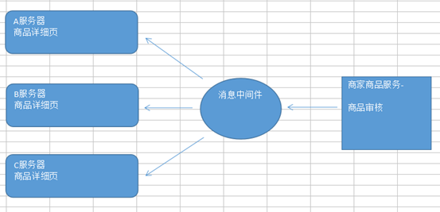

### 13.5.1 消息生产者（运营商后台）

* Maven中移除耦合依赖`pinyougou-page-interface`，`GoodsController`中删除调用搜索服务接口的相关代码（主要在**删除**和**审核**的方法中）
* 其他的看13.4.1


### 13.5.2 消息消费者（页面生成服务）

* Maven中移除耦合依赖**`dubbox`**。配置文件中dubbox的service配置也删除，同时将`@Service`注解改用Spring的，包扫描

  ```xml
  <context:component-scan base-package="com.pinyougou.page.service.impl"/>
  ```

* 在`pinyougou-page-service`中引入`activemq-client`和`spring-jms`依赖

* 消费者的配置文件

  ```xml
  <!-- 真正可以产生Connection的ConnectionFactory，由对应的 JMS服务厂商提供-->  
  <bean id="targetConnectionFactory" class="org.apache.activemq.ActiveMQConnectionFactory">  
      <property name="brokerURL" value="tcp://192.168.25.129:61616"/>  
  </bean>
  
  <!-- Spring用于管理真正的ConnectionFactory的ConnectionFactory -->  
  <bean id="connectionFactory" class="org.springframework.jms.connection.SingleConnectionFactory">  
      <!-- 目标ConnectionFactory对应真实的可以产生JMS Connection的ConnectionFactory -->  
      <property name="targetConnectionFactory" ref="targetConnectionFactory"/>  
  </bean>  
  
  <!--这个是队列目的地，发布订阅模式，生成页面-->
  <bean id="topicPageDestination" class="org.apache.activemq.command.ActiveMQTopic">
      <constructor-arg value="pinyougou_topic_page"/>
  </bean>
  <!-- 消息监听容器，生成页面 -->
  <bean class="org.springframework.jms.listener.DefaultMessageListenerContainer">
      <property name="connectionFactory" ref="connectionFactory" />
      <property name="destination" ref="topicPageDestination" />
      <property name="messageListener" ref="pageListener" />
  </bean>
  
  <!--这个是队列目的地，发布订阅模式，删除-->
  <bean id="topicPageDeleteDestination" class="org.apache.activemq.command.ActiveMQTopic">
      <constructor-arg value="pinyougou_topic_page_delete"/>
  </bean>
  <!-- 消息监听容器，删除页面 -->
  <bean class="org.springframework.jms.listener.DefaultMessageListenerContainer">
      <property name="connectionFactory" ref="connectionFactory" />
      <property name="destination" ref="topicPageDeleteDestination" />
      <property name="messageListener" ref="pageDeleteListener" />
  </bean>
  ```

* 消息监听类

  ```java
  @Component
  public class PageListener implements MessageListener {
      @Autowired
      private ItemPageService itemPageService;
  
      @Override
      public void onMessage(Message message) {
          TextMessage textMessage = (TextMessage) message;
          try {
              String text = textMessage.getText();
              System.out.println("接收到的消息："+text);
              boolean b = itemPageService.genItemHtml(Long.parseLong(text));
              System.out.println("网页生成结果："+b);
          } catch (JMSException e) {
              e.printStackTrace();
          }
      }
  }
  ```

  ```java
  @Component
  public class PageDeleteListener implements MessageListener {
  
      @Autowired
      private ItemPageService itemPageService;
      @Override
      public void onMessage(Message message) {
          ObjectMessage objectMessage = (ObjectMessage) message;
          try {
              Long[] goodsIds = (Long[]) objectMessage.getObject();
              System.out.println("接收到消息："+goodsIds);
              boolean b = itemPageService.deleteItemHtml(goodsIds);
              System.out.println("删除网页"+b);
          } catch (JMSException e) {
              e.printStackTrace();
          }
      }
  }
  ```

  


## 13.6 商品删除-删除商品详细页（发布/订阅）

### 13.6.1 消息生产者（运营商后台）

* 配置文件及代码查看13.4.1

### 13.6.2 消息消费者（页面生成服务）

* 配置文件及代码查看13.5.2

* 需要在`ItemPageServiceImpl`添加删除的方法

  ```java
  @Override
  public boolean deleteItemHtml(Long[] goodsIds) {
      try {
          for (Long goodsId : goodsIds) {
              new File(pagedir+goodsId+".html").delete();
          }
          return true;
      } catch (Exception e) {
          e.printStackTrace();
          return false;
      }
  }
  ```

  


# 14 Spring Boot与短信解决方案

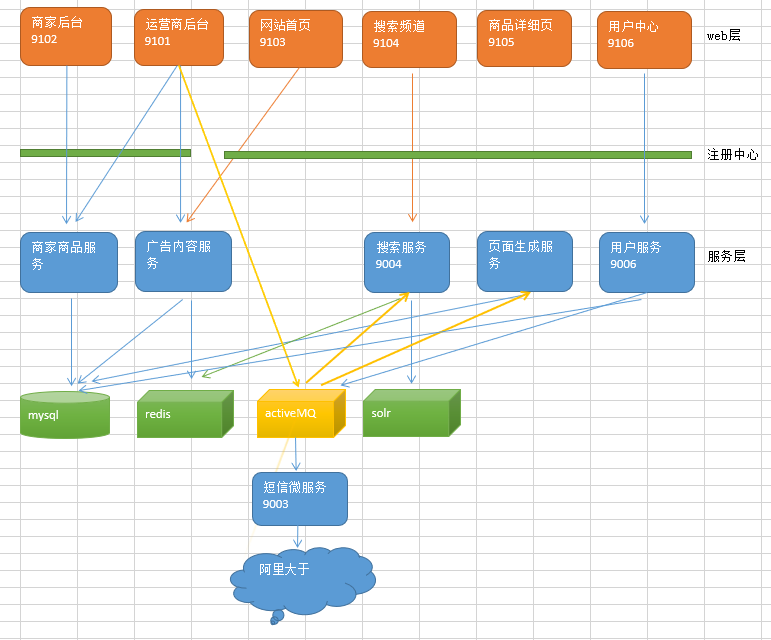


## 14.1 Spring Boot入门

### 14.1.1 Demo

和之前的Maven工程打包方式不同，无论时什么Spring Boot工程都是jar包

* 启动器：`spring-boot-start-*`

* `<properties>`标签中直接指定Java版本`<java.version>1.8</java.version>`

  ```xml
  <parent>
      <groupId>org.springframework.boot</groupId>
      <artifactId>spring-boot-starter-parent</artifactId>
      <version>2.1.2.RELEASE</version>
      <relativePath/> <!-- lookup parent from repository -->
  </parent>
  <properties>
      <java.version>1.8</java.version>
  </properties>
  <dependencies>
      <dependency>
          <groupId>org.springframework.boot</groupId>
          <artifactId>spring-boot-starter-web</artifactId>
      </dependency>
      <dependency>
          <groupId>org.springframework.boot</groupId>
          <artifactId>spring-boot-devtools</artifactId><!--热部署插件-->
      </dependency>
  </dependencies>
  ```

  使用IDEA并使用热部署插件，不会自动重启，需要**手动make**或者**Debug模式启动**，或者**修改IDEA的配置**

  1. 

  2. Shift+Ctrl+Alt+/(Mac: Shift+Command+Alt+/)，选择Registry...

     

* 启动类

  ```java
  //@SpringBootApplication其实就是以下三个注解的总和：@Configuration，@EnableAutoConfiguration，@ComponentScan
  //但是@ComponentScan默认扫描当前类所在包
  @SpringBootApplication
  public class DemoApplication {
  
      public static void main(String[] args) {
          SpringApplication.run(DemoApplication.class, args);
      }
  }
  ```

* 配置文件`application.properties`，可以修改Tomcat端口等。也可以自定义配置（通过**`Environment`**获取）。

  ```properties
  #Tomcat端口
  server.port=80
  
  #自定义配置
  url=http://www.itcast.com
  ```

* Web开发

  ```java
  @RestController
  public class HelloWorldController {
  
      @Autowired
      private Environment environment;
  
      @RequestMapping("/hello")
      public String  hello(){
          return "hello world spring boot! "+environment.getProperty("url");
      }
  }
  ```

  

### 14.1.2 Spring Boot与ActiveMQ整合

* 引入activemq的starter（启动器）

  ```xml
  <dependency>
      <groupId>org.springframework.boot</groupId>
      <artifactId>spring-boot-starter-activemq</artifactId>
  </dependency>
  ```

* 使用**内置/外置ActiveMQ**的点对点模式

  要使用外置ActiveMQ，只需在`application.properties`中添加

  `spring.activemq.broker-url=tcp://192.168.25.129:61616`即可完成

  ```java
  //消息生产者
  @RestController
  public class QueueController {
  
      @Autowired
      private JmsMessagingTemplate jmsMessagingTemplate;
  
      @RequestMapping("/send")
      public void send(String text){
          jmsMessagingTemplate.convertAndSend("itcast",text);//第一个参数为队列目的地，不指定默认为Queue
      }
  
      @RequestMapping("/sendMap")
      public void sendMap(){
          Map map = new HashMap();
          map.put("mobile",10086);
          map.put("content","新年好！");
          jmsMessagingTemplate.convertAndSend("itcast_map",map);//第一个参数为队列目的地对象，不指定默认为Queue
      }
  }
  ```

  ```java
  @Component
  public class Consumer {
  
      @JmsListener(destination = "itcast")//监听队列的目的地
      public void readMessage(String text){
          System.out.println("接收到消息："+text);
      }
  
      @JmsListener(destination = "itcast_map")//监听队列的目的地
      public void readMapMessage(Map map){
          System.out.println("接收到消息了："+map);
      }
  }
  ```


* **发布/订阅模式**（暂时参考）

  发布端口代码

  ```java
  @Service
  public class Publisher {
  
      @Resource
      private JmsMessagingTemplate jmsMessagingTemplate;
  
      public void publish(String destName, Object message) {
          //开启订阅模式
          jmsTemplate.setPubSubDomain(true);
          Destination destination = new ActiveMQTopic(destName);
          jmsMessagingTemplate.convertAndSend(destination, message);
      }
  }
  ```

  订阅端口代码

  对于订阅者来说需要考虑一个事情：当发布消息的时候订阅端挂了，那么这个消息需要在订阅者下次启动的时候去消费。

  ```java
  @Configuration
  public class JmsConfig {
      @Bean
      JmsListenerContainerFactory<?> myJmsListenerContainerFactory(ConnectionFactory connectionFactory) {
          SimpleJmsListenerContainerFactory simpleJmsListenerContainerFactory = new SimpleJmsListenerContainerFactory();
          simpleJmsListenerContainerFactory.setConnectionFactory(connectionFactory);
          //开启订阅模式
          simpleJmsListenerContainerFactory.setPubSubDomain(true);
          //开启持久化订阅,订阅端不在线能保持未消费的消息
          simpleJmsListenerContainerFactory.setClientId("yuxi");//区分不同的订阅者
          simpleJmsListenerContainerFactory.setSubscriptionDurable(true);//设置了持久化订阅
          return simpleJmsListenerContainerFactory;
      }
  }
  ```

  ```java
  @Service
  public class Subscriber {
  
      @JmsListener(destination = "test.topic", containerFactory = "myJmsListenerContainerFactory")
      public void subscriber(Object obj) {
          try {
              //接受对象消息
              if (obj instanceof ActiveMQObjectMessage) {
                  Object sourObj = ((ActiveMQObjectMessage) obj).getObject();
                  if (sourObj instanceof Tenant)
                      System.out.println("收到订阅消息：" + sourObj);
              }
          } catch (JMSException e) {
              e.printStackTrace();
          }
      }
  }
  ```

  

  

  

## 14.2 短信发送平台-阿里云通信

> 由阿里大于改名

登录阿里云—>阿里云通信—>短信服务，设置签名和模板等信息。按照快速学习指导及API的Demo即可完成。


### 14.2.1 短信微服务

> 构建一个**通用的短信发送微服务**（独立于品优购的**单独工程**），接收activeMQ的消息（Map类型）  消息包括手机号（mobile）、短信模板号（template_code）、签名（sign_name）、参数字符串（param ）

* Maven依赖

  ```xml
  <properties>
      <java.version>1.8</java.version>
  </properties>
  
  <dependencies>
      <dependency>
          <groupId>org.springframework.boot</groupId>
          <artifactId>spring-boot-starter-web</artifactId>
      </dependency>
      <dependency>
          <groupId>org.springframework.boot</groupId>
          <artifactId>spring-boot-starter-activemq</artifactId>
      </dependency>
      <dependency>
          <groupId>com.aliyun</groupId>
          <artifactId>aliyun-java-sdk-core</artifactId>
          <version>4.0.3</version>
      </dependency>
      <dependency>
          <groupId>com.aliyun</groupId>
          <artifactId>aliyun-java-sdk-dysmsapi</artifactId>
          <version>1.1.0</version>
      </dependency>
      <dependency>
          <groupId>org.springframework.boot</groupId>
          <artifactId>spring-boot-devtools</artifactId>
          <scope>runtime</scope>
      </dependency>
  </dependencies>
  ```

* application配置文件

  ```properties
  server.port=9003
  spring.activemq.broker-url=tcp://192.168.25.129:61616
  accessKeyId=不告诉你
  accessKeySecret=不告诉你
  ```

* **ActiveMQ监听类**（调用发送短信工具类）

  ```java
  @Component
  public class SmsListener {
      @Autowired
      private SmsUtil smsUtil;
      
      @JmsListener(destination="sms")
      public void sendSms(Map<String,String> map){		
          try {
              SendSmsResponse response = smsUtil.sendSms(
                  map.get("mobile"), 
                  map.get("template_code"),
                  map.get("sign_name"),
                  map.get("param")  );					 
              System.out.println("Code=" + response.getCode());
              System.out.println("Message=" + response.getMessage());
              System.out.println("RequestId=" + response.getRequestId());
              System.out.println("BizId=" + response.getBizId());			
          } catch (ClientException e) {
              e.printStackTrace();			
          }		
      }
  }
  ```

* 发送短信工具类（阿里云通信）

  ```java
  @Component
  public class SmsUtil {
  
      //产品名称:云通信短信API产品,开发者无需替换
      static final String product = "Dysmsapi";
      //产品域名,开发者无需替换
      static final String domain = "dysmsapi.aliyuncs.com";
  
      @Autowired
      private Environment env;
      /**
       * 发送短信
       * @param mobile 手机号
       * @param template_code 模板号
       * @param sign_name 签名
       * @param param 参数
       * @return
       * @throws ClientException
       */
      public SendSmsResponse sendSms(String mobile,String template_code,String sign_name,String param) throws ClientException {
  
          String accessKeyId =env.getProperty("accessKeyId");
          String accessKeySecret = env.getProperty("accessKeySecret");
  
          //可自助调整超时时间
          System.setProperty("sun.net.client.defaultConnectTimeout", "10000");
          System.setProperty("sun.net.client.defaultReadTimeout", "10000");
  
          //初始化acsClient,暂不支持region化
          IClientProfile profile = DefaultProfile.getProfile("cn-hangzhou", accessKeyId, accessKeySecret);
          DefaultProfile.addEndpoint("cn-hangzhou", "cn-hangzhou", product, domain);
          IAcsClient acsClient = new DefaultAcsClient(profile);
  
          //组装请求对象-具体描述见控制台-文档部分内容
          SendSmsRequest request = new SendSmsRequest();
          //必填:待发送手机号
          request.setPhoneNumbers(mobile);
          //必填:短信签名-可在短信控制台中找到
          request.setSignName(sign_name);
          //必填:短信模板-可在短信控制台中找到
          request.setTemplateCode(template_code);
          //可选:模板中的变量替换JSON串,如模板内容为"亲爱的${name},您的验证码为${code}"时,此处的值为
          request.setTemplateParam(param);
  
          //选填-上行短信扩展码(无特殊需求用户请忽略此字段)
          //request.setSmsUpExtendCode("90997");
  
          //可选:outId为提供给业务方扩展字段,最终在短信回执消息中将此值带回给调用者
          request.setOutId("yourOutId");
  
          //hint 此处可能会抛出异常，注意catch
          SendSmsResponse sendSmsResponse = acsClient.getAcsResponse(request);
  
          return sendSmsResponse;
      }
  
      public  QuerySendDetailsResponse querySendDetails(String mobile,String bizId) throws ClientException {
          String accessKeyId =env.getProperty("accessKeyId");
          String accessKeySecret = env.getProperty("accessKeySecret");
          //可自助调整超时时间
          System.setProperty("sun.net.client.defaultConnectTimeout", "10000");
          System.setProperty("sun.net.client.defaultReadTimeout", "10000");
          //初始化acsClient,暂不支持region化
          IClientProfile profile = DefaultProfile.getProfile("cn-hangzhou", accessKeyId, accessKeySecret);
          DefaultProfile.addEndpoint("cn-hangzhou", "cn-hangzhou", product, domain);
          IAcsClient acsClient = new DefaultAcsClient(profile);
          //组装请求对象
          QuerySendDetailsRequest request = new QuerySendDetailsRequest();
          //必填-号码
          request.setPhoneNumber(mobile);
          //可选-流水号
          request.setBizId(bizId);
          //必填-发送日期 支持30天内记录查询，格式yyyyMMdd
          SimpleDateFormat ft = new SimpleDateFormat("yyyyMMdd");
          request.setSendDate(ft.format(new Date()));
          //必填-页大小
          request.setPageSize(10L);
          //必填-当前页码从1开始计数
          request.setCurrentPage(1L);
          //hint 此处可能会抛出异常，注意catch
          QuerySendDetailsResponse querySendDetailsResponse = acsClient.getAcsResponse(request);
          return querySendDetailsResponse;
      }
  }
  ```

  


## 14.3 用户注册

> 此次注册的用户名和密码为：xiaobai/123123

用户服务接口层

1. 创建pinyougou-user-interface（jar）
2. 引入pojo依赖

用户服务实现层

1. 创建pinyougou-user-service（war）

2. 引入spring  dubbox   activeMQ相关依赖，引入依赖（ pinyougou-user-interface  pinyougou-dao  pinyougou-common），运行端口为9006

3. 添加web.xml  

4. 创建Spring 配置文件applicationContext-service.xml 和applicationContent-tx.xml 

   ```xml
   <dubbo:protocol name="dubbo" port="20886" />
   <dubbo:annotation package="com.pinyougou.user.service.impl" />  
   <dubbo:application name="pinyougou-user-service"/>  
   <dubbo:registry address="zookeeper://192.168.25.135:2181"/>
   ```

5. **ActiveMQ配置文件**参考上面的配置即可

用户中心WEB层

1. 创建war工程  pinyougou-user-web 我们将注册功能放入此工程
2. 添加web.xml 
3. 引入依赖pinyougou-user-interface 、spring相关依赖（参照其它web工程）,tomcat运行端口9106
4. 添加spring配置文件
5. 拷贝静态原型页面register.html 及相关资源 

------

==**验证码思路**==

1. 点击页面上的”**获取短信验证码**”链接，向后端**传递手机号**。后端随机生成6位数字作为短信验证码，将其**保存在redis中**（手机号作为key），并发送到ActiveMQ。
2. 用户**注册**时，后端**根据手机号查询redis中的验证码**与用户**填写的验证码**是否相同，如果不同则提示用户不能注册。

------

`UserController`

```java
//发送验证码
@RequestMapping("/sendCode")
public Result sendCode(String phone){
    if (!PhoneFormatCheckUtils.isPhoneLegal(phone)){//利用这个工具类提供的正则表达式校验手机号
        return new Result(false,"手机号格式不正确");
    }
    try {
        userService.createSmsCode(phone);
        return new Result(true,"验证码发送成功");
    } catch (Exception e) {
        e.printStackTrace();
        return new Result(false,"验证码发送失败");

    }
}

//注册（判断验证码后决定是否注册）
@RequestMapping("/add")
public Result add(@RequestBody TbUser user,String smscode){
    //校验验证码
    boolean b = userService.checkSmsCode(user.getPhone(), smscode);
    if (!b){
        return new Result(false, "验证码错误");
    }
    try {
        userService.add(user);
        return new Result(true, "增加成功");
    } catch (Exception e) {
        e.printStackTrace();
        return new Result(false, "增加失败");
    }
}
```

`UserServiceImpl`（MD5加密）

```java
@Autowired
private RedisTemplate redisTemplate;

@Autowired
private JmsTemplate jmsTemplate;

@Autowired
private Destination smsDestination;//也可以new出来

@Value("${template_code}")
private String template_code;//在common模块中存放的配置文件，并且已经由spring加载了

@Value("${sign_name}")
private String sign_name;

//发送验证码
@Override
public void createSmsCode(final String phone) {
    //1.生成6位随机数验证码
    Random random = new Random();
    final String smscode = random.nextInt(1000000)+"";
    System.out.println("验证码："+smscode);
    //2.将验证码放入Redis缓存
    redisTemplate.boundHashOps("smscode").put(phone,smscode);
    //3.将短信内容发送到ActiveMQ
    jmsTemplate.send(smsDestination, new MessageCreator() {
        @Override
        public Message createMessage(Session session) throws JMSException {
            MapMessage mapMessage = session.createMapMessage();
            mapMessage.setString("mobile",phone);//手机号
            mapMessage.setString("template_code",template_code);//模板
            mapMessage.setString("sign_name",sign_name);//签名
            Map map = new HashMap();
            map.put("number",smscode);
            mapMessage.setString("param", JSON.toJSONString(map));//验证码
            return mapMessage;
        }
    });

}

//判断验证码是否正确
@Override
public boolean checkSmsCode(String phone, String smscode) {
    String  redisSmsCode = (String) redisTemplate.boundHashOps("smscode").get(phone);
    if (redisSmsCode==null){
        return false;
    }
    if (!smscode.equals(redisSmsCode)){
        return false;
    }
    return true;
}

//验证码正确就注册
@Override
public void add(TbUser user) {
    user.setCreated(new Date());//用户注册时间
    user.setUpdated(new Date());//修改时间
    user.setSourceType("1");//用户来源
    user.setPassword(DigestUtils.md5Hex(user.getPassword()));//org.apache.commons...MD5加密
    userMapper.insert(user);
}
```

前端服务层/控制层/HTML中绑定变量并调用发送验证码方法和注册方法（验证码单独绑定，不在entity中）

```java
this.sendCode = function (phone) {
    $http.get('../user/sendCode.do?phone='+phone);
}
this.add=function(entity){
    return  $http.post('../user/add.do',entity );
}
```

```js
//控制层 
app.controller('userController' ,function($scope,$controller   ,userService){

    //发送验证码
    $scope.sendCode = function () {
        if ($scope.entity.phone==null || $scope.entity.phone == ""){
            alert("请填写手机号！");
            return;
        }
        userService.sendCode($scope.entity.phone).success(function (data) {
            alert(data.message);
        })
    }

    //注册（后端会判断验证码是否正确）
    $scope.reg = function () {

        if ($scope.entity.password!=$scope.password){
            alert("两次输入密码不一致");
            return;
        }
        userService.add($scope.entity,$scope.smscode).success(function (data) {
            alert(data.message);
        })
    }
});	
```


# 15 单点登录解决方案 CAS

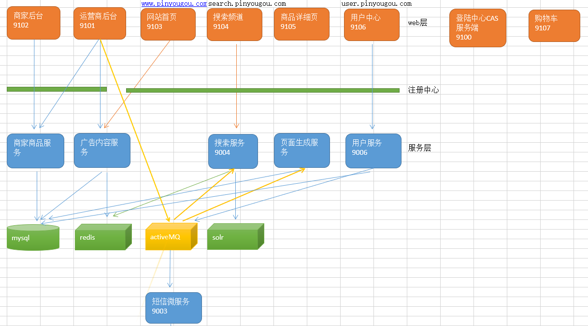

> 单点登录（Single Sign On），简称为 SSO，是目前比较流行的企业业务整合的解决方案之一。SSO的定义是在多个应用系统中，用户只需要登录一次就可以访问所有相互信任的应用系统。
>
> 我们目前的系统存在诸多子系统，而这些子系统是分别部署在不同的服务器中，那么使用传统方式的session是无法解决的，我们需要使用相关的单点登录技术来解决。

## 15.1 CAS 入门

### 15.1.1 CAS 简介

CAS 是 Yale 大学发起的一个开源项目，旨在为 Web 应用系统提供一种可靠的单点登录方法，CAS 在 2004 年 12 月正式成为 JA-SIG 的一个项目。CAS 具有以下特点：

* 开源的企业级单点登录解决方案。
* CAS Server 为需要独立部署的 Web 应用。
* CAS Client 支持非常多的客户端(这里指单点登录系统中的各个 Web 应用)，包括 Java, .Net, PHP, Perl, Apache, uPortal, Ruby 等。

从结构上看，CAS 包含两个部分： CAS Server 和 CAS Client。CAS Server 需要独立部署，主要负责对用户的认证工作；CAS Client 负责处理对客户端受保护资源的访问请求，需要登录时，重定向到 CAS Server。下图是 CAS 最基本的协议过程：

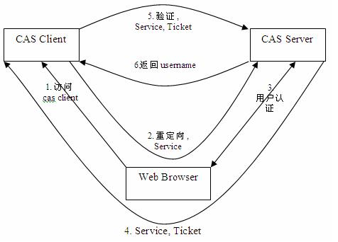

SSO单点登录访问流程主要有以下步骤：

1. 访问服务：SSO客户端发送请求访问应用系统提供的服务资源。
2. 定向认证：SSO客户端会重定向用户请求到SSO服务器。
3. 用户认证：用户身份认证。
4. 发放票据：SSO服务器会产生一个随机的Service Ticket。
5. 验证票据：SSO服务器验证票据Service Ticket的合法性，验证通过后，允许客户端访问服务。
6. 传输用户信息：SSO服务器验证票据通过后，传输用户认证结果信息给客户端。


### 15.1.2 CAS服务端部署

Cas服务端其实就是一个war包，在资源`\cas\source\cas-server-4.0.0-release\cas-server-4.0.0\modules`目录下。将其改名为cas.war放入tomcat目录下的webapps下，启动并键入`http://localhost:8080/cas/login`即可看到CAS自带的简单登录界面。默认的用户名和密码为：casuser /Mellon。可以在`\cas\WEB-INF\deployerConfigContext.xml`中修改添加。

后续可修改数据源为数据库。


### 15.1.3 CAS服务端配置

* 端口修改

  * 修改Tomcat端口为**9100**，在`conf\server.xml`中（这里只改一处，一般情况要改2处）
  * 修改CAS配置文件，在`WEB-INF/cas.properties`中，修改为`server.name=http://localhost:9100`

* 去除HTTPS认证

  CAS默认使用的是HTTPS协议，如果使用HTTPS协议需要SSL安全证书（需向特定的机构申请和购买） 。如果对安全要求不高或是在开发测试阶段，可使用HTTP协议。我们这里讲解通过修改配置，让CAS使用HTTP协议。

  * 修改cas的`WEB-INF/deployerConfigContext.xml`

    ```xml
    <bean id="proxyAuthenticationHandler"
         class="org.jasig.cas.authentication.handler.support.HttpBasedServiceCredentialsAuthenticationHandler"
          p:httpClient-ref="httpClient" p:requireSecure="false"/>
    <!--增加参数p:requireSecure="false"，该属性意思为是否需要安全验证，即HTTPS，false为不采用-->
    ```

  * 修改cas的`/WEB-INF/spring-configuration/ticketGrantingTicketCookieGenerator.xml`

    ```xml
    <bean id="ticketGrantingTicketCookieGenerator" class="org.jasig.cas.web.support.CookieRetrievingCookieGenerator"
          p:cookieSecure="true"
          p:cookieMaxAge="-1"
          p:cookieName="CASTGC"
          p:cookiePath="/cas" />
    <!--
    	参数p:cookieSecure="true"，同理为HTTPS验证相关，TRUE为采用HTTPS验证，FALSE为不采用https验证。
    	参数p:cookieMaxAge="-1"，是COOKIE的最大生命周期，-1为无生命周期，即只在当前打开的窗口有效，关闭或重新打开其它窗口，仍会要求验证。可以根据需要修改为大于0的数字，比如3600等，意思是在3600秒内，打开任意窗口，都不需要验证。
    	我们这里将cookieSecure改为false ,  cookieMaxAge 改为3600
    -->
    ```

  * 修改cas的`WEB-INF/spring-configuration/warnCookieGenerator.xml`

    ```xml
    <bean id="warnCookieGenerator" class="org.jasig.cas.web.support.CookieRetrievingCookieGenerator"
          p:cookieSecure="true"
          p:cookieMaxAge="-1"
          p:cookieName="CASPRIVACY"
          p:cookiePath="/cas" />
    <!-- 我们这里将cookieSecure改为false ,  cookieMaxAge 改为3600 -->
    ```

    

### 15.1.4 CAS 客户端入门 Demo

#### 1、两个war工程

1. 创建Maven工程（**war**）casclient_demo1  引入cas客户端依赖并制定tomcat运行**端口**为9001

   ```xml
   <dependency>  
       <groupId>org.jasig.cas.client</groupId>  
       <artifactId>cas-client-core</artifactId>  
       <version>3.3.3</version>  
   </dependency>
   <!--这个Demo使用JSP，需引入JSP依赖-->
   ```

2. `web.xml`

   ```xml
   <?xml version="1.0" encoding="UTF-8"?>
   <web-app xmlns:xsi="http://www.w3.org/2001/XMLSchema-instance"
            xmlns="http://java.sun.com/xml/ns/javaee"
            xsi:schemaLocation="http://java.sun.com/xml/ns/javaee"
            version="2.5">	
       <!-- 用于单点退出，该过滤器用于实现单点登出功能，可选配置 -->  
       <listener>  
           <listener-class>org.jasig.cas.client.session.SingleSignOutHttpSessionListener</listener-class>  
       </listener>  
       <!-- 该过滤器用于实现单点登出功能，可选配置。 -->  
       <filter>  
           <filter-name>CAS Single Sign Out Filter</filter-name>  
           <filter-class>org.jasig.cas.client.session.SingleSignOutFilter</filter-class>  
       </filter>  
       <filter-mapping>  
           <filter-name>CAS Single Sign Out Filter</filter-name>  
           <url-pattern>/*</url-pattern>  
       </filter-mapping>  
       
       
       <!-- 该过滤器负责用户的认证工作，必须启用它 -->  
       <filter>  
           <filter-name>CASFilter</filter-name>       <filter-class>org.jasig.cas.client.authentication.AuthenticationFilter</filter-class>  
           <init-param>  
               <param-name>casServerLoginUrl</param-name>  
               <param-value>http://localhost:9100/cas/login</param-value>  
               <!--这里的server是服务端的IP -->  
           </init-param>  
           <init-param>  
               <param-name>serverName</param-name>  
               <param-value>http://localhost:9001</param-value>
           </init-param>  
       </filter>  
       <filter-mapping>  
           <filter-name>CASFilter</filter-name>  
           <url-pattern>/*</url-pattern>  
       </filter-mapping>  
       
       
       <!-- 该过滤器负责对Ticket的校验工作，必须启用它 -->  
       <filter>  
           <filter-name>CAS Validation Filter</filter-name>  
           <filter-class>     org.jasig.cas.client.validation.Cas20ProxyReceivingTicketValidationFilter</filter-class>  
           <init-param>  
               <param-name>casServerUrlPrefix</param-name>  
               <param-value>http://localhost:9100/cas</param-value>  
           </init-param>  
           <init-param>  
               <param-name>serverName</param-name>  
               <param-value>http://localhost:9001</param-value>
           </init-param>  
       </filter>  
       <filter-mapping>  
           <filter-name>CAS Validation Filter</filter-name>  
           <url-pattern>/*</url-pattern>  
       </filter-mapping>  
       
       <!-- 该过滤器负责实现HttpServletRequest请求的包裹， 比如允许开发者通过HttpServletRequest的getRemoteUser()方法获得SSO登录用户的登录名，可选配置。 -->  
       <filter>  
           <filter-name>CAS HttpServletRequest Wrapper Filter</filter-name>  
           <filter-class>  
               org.jasig.cas.client.util.HttpServletRequestWrapperFilter</filter-class>  
       </filter>  
       <filter-mapping>  
           <filter-name>CAS HttpServletRequest Wrapper Filter</filter-name>  
           <url-pattern>/*</url-pattern>  
       </filter-mapping>  
       <!-- 该过滤器使得开发者可以通过org.jasig.cas.client.util.AssertionHolder来获取用户的登录名。 比如AssertionHolder.getAssertion().getPrincipal().getName()。 -->  
       <filter>  
           <filter-name>CAS Assertion Thread Local Filter</filter-name>       <filter-class>org.jasig.cas.client.util.AssertionThreadLocalFilter</filter-class>  
       </filter>  
       <filter-mapping>  
           <filter-name>CAS Assertion Thread Local Filter</filter-name>  
           <url-pattern>/*</url-pattern>  
       </filter-mapping>  
   </web-app>
   ```

3. `index.jsp`

   ```jsp
   <%@ page language="java" contentType="text/html; charset=utf-8"
       pageEncoding="utf-8"%>
   <!DOCTYPE html PUBLIC "-//W3C//DTD HTML 4.01 Transitional//EN" "http://www.w3.org/TR/html4/loose.dtd">
   <html>
       <head>
           <meta http-equiv="Content-Type" content="text/html; charset=utf-8">
           <title>一品优购</title>
       </head>
       <body>
           欢迎来到一品优购
           <%=request.getRemoteUser()%>
           <a href="http://localhost:9100/cas/logout?service=http://www.baidu.com">退出登录</a>
       </body>
   </html>
   ```

4. 客户端工程2搭建同上，需要修改pom.xml和web.xml中客户端端口为**9002**

5. 启动客户端1和2，键入`http://localhost:9001/`或`http://localhost:9002/`均会跳转到CAS登录页，其中一个输入正确用户名密码后，另一个就不用登录了，直接登录成功。

   

#### 2、单点退出登录

地址栏输入**`http://localhost:9000/cas/logout`**即可单点退出登录（放在注销按钮即可），并能看到退出后CAS的提示页面。

希望退出后**跳转（重定向）**到指定的页面，需要修改cas系统的配置文件`cas-servlet.xml`

```xml
<bean id="logoutAction" class="org.jasig.cas.web.flow.LogoutAction"
      p:servicesManager-ref="servicesManager"
      p:followServiceRedirects="${cas.logout.followServiceRedirects:true}"/> <!--改为true-->
```

退出登录的连接需要**传递`service`参数**，告诉重定向的URL。查看1中index.jsp页面代码


#### 3、CAS服务端数据源设置

> 我们现在让用户名密码从我们的品优购的user表里做验证

1. 修改cas服务端中`WEB-INF/deployerConfigContext.xml` ，添加如下配置

   将jar包放入服务端`WEB-INF\lib`中：`cas-server-support-jdbc-4.0.0`、`c3p0-0.9.1.2`、`mysql-connector-java`

   ```XML
   <!--3308端口是自己修改的MySQL8-->
   <bean id="dataSource" class="com.mchange.v2.c3p0.ComboPooledDataSource"  
         p:driverClass="com.mysql.jdbc.Driver"  
         p:jdbcUrl="jdbc:mysql://127.0.0.1:3308/pinyougoudb?serverTimezone=GMT%2B8"
         p:user="root"  
         p:password="w111151" /> 
   <bean id="passwordEncoder" 
         class="org.jasig.cas.authentication.handler.DefaultPasswordEncoder"  
         c:encodingAlgorithm="MD5"  
         p:characterEncoding="UTF-8" />  
   <bean id="dbAuthHandler"  
         class="org.jasig.cas.adaptors.jdbc.QueryDatabaseAuthenticationHandler"  
         p:dataSource-ref="dataSource"  
         p:sql="select password from tb_user where username = ?"  
         p:passwordEncoder-ref="passwordEncoder"/>  
   ```

2. 然后在配置文件开始部分找到如下配置

   ```XML
   <bean id="authenticationManager" class="org.jasig.cas.authentication.PolicyBasedAuthenticationManager">
       <constructor-arg>
           <map>               
               <entry key-ref="proxyAuthenticationHandler" value-ref="proxyPrincipalResolver" />
               <!--使用固定的用户名和密码，我们在下面可以看到这两个bean,若使用数据库认证用户名和密码，需要将这句注释掉-->
               <entry key-ref="primaryAuthenticationHandler" value-ref="primaryPrincipalResolver" />
               <!--使用数据库的用户名和密码-->
               <entry key-ref="dbAuthHandler" value-ref="primaryPrincipalResolver"/>
           </map>
       </constructor-arg>      
       <property name="authenticationPolicy">
           <bean class="org.jasig.cas.authentication.AnyAuthenticationPolicy" />
       </property>
   </bean>
   ```

   

#### 4、CAS服务端界面改造

> 将CAS默认的登录页更改为自己的品优购登陆页

1. 将品优购的登陆页login.html拷贝到cas系统下`WEB-INF\view\jsp\default\ui` 目录下

2. 将css  js等文件夹拷贝到  cas目录下

3. 将原来的`casLoginView.jsp` 改名（可以为之后的修改操作做参照），将`login.html`改名为`casLoginView.jsp`

4. 编辑`casLoginView.jsp` 内容

   1. 添加指令

      ```jsp
      <%@ page pageEncoding="UTF-8" %>
      <%@ page contentType="text/html; charset=UTF-8" %>
      <%@ taglib prefix="c" uri="http://java.sun.com/jsp/jstl/core" %>
      <%@ taglib prefix="spring" uri="http://www.springframework.org/tags" %>
      <%@ taglib prefix="form" uri="http://www.springframework.org/tags/form" %>
      <%@ taglib prefix="fn" uri="http://java.sun.com/jsp/jstl/functions" %>
      ```

   2. 修改form标签

      ```jsp
      <form:form method="post" id="fm1" commandName="${commandName}" htmlEscape="true" class="sui-form">
          ......
      </form:form>
      ```

   3. 修改用户名框

      ```jsp
      <form:input id="username" tabindex="1" 
                  accesskey="${userNameAccessKey}" path="username" autocomplete="off" htmlEscape="true" 
                  placeholder="邮箱/用户名/手机号" class="span2 input-xfat" />
      ```

   4. 修改密码框

      ```jsp
      <form:password  id="password" tabindex="2" path="password" 
                     accesskey="${passwordAccessKey}" htmlEscape="true" autocomplete="off" 
                     placeholder="请输入密码" class="span2 input-xfat"   />
      ```

   5. 修改登陆按钮

      ```jsp
      <input type="hidden" name="lt" value="${loginTicket}" />
      <input type="hidden" name="execution" value="${flowExecutionKey}" />
      <input type="hidden" name="_eventId" value="submit" />
      <input class="sui-btn btn-block btn-xlarge btn-danger" accesskey="l" value="登陆" type="submit" />
      ```


#### 5、CAS服务端界面错误提示

1. 在表单内加入错误提示框

   ```jsp
   <form:errors path="*" id="msg" cssClass="errors" element="div" htmlEscape="false" />
   ```

   测试：输入错误的用户名和密码，提示是英文。这个提示信息是在`WEB-INF\classes`目录下的`messages.properties`中

   ```properties
   authenticationFailure.AccountNotFoundException=Invalid credentials.
   authenticationFailure.FailedLoginException=Invalid credentials.
   ```

2. 设置国际化为zn_CN  ,修改`cas-servlet.xml`

   ```xml
   <bean id="localeResolver" class="org.springframework.web.servlet.i18n.CookieLocaleResolver" p:defaultLocale="zh_CN" />
   ```

3. 将此信息拷贝到`messages_zh_CN.properties`下，并改为中文提示（转码，但是我直接使用中文也可以显示）

   ```properties
   # 用户名不存在时的错误提示
   authenticationFailure.AccountNotFoundException=\u7528\u6237\u4E0D\u5B58\u5728. 
   # 密码错误的提示
   authenticationFailure.FailedLoginException=\u5BC6\u7801\u9519\u8BEF.
   ```

   


## 15.2 CAS客户端与SpringSecurity集成

> 建立Maven项目casclient_demo3 ，引入spring依赖和spring secrity 相关依赖 ，tomcat端口设置为**9003**
> 建立web.xml ，添加过滤器等配置
> 创建配置文件spring-security.xml 
> 添加html页面

### 15.2.1 Spring Security与 CAS整合

Maven依赖

```xml
<!--Web、SpringSecurity等依赖-->
<dependency>  
    <groupId>org.springframework.security</groupId>  
    <artifactId>spring-security-cas</artifactId>  
    <version>4.1.0.RELEASE</version>  
</dependency>     
<dependency>  
    <groupId>org.jasig.cas.client</groupId>  
    <artifactId>cas-client-core</artifactId>  
    <version>3.3.3</version>  
    <exclusions>  
        <exclusion>  
            <groupId>org.slf4j</groupId>  
            <artifactId>log4j-over-slf4j</artifactId>  
        </exclusion>  
    </exclusions>  
</dependency> 
```

修改`spring-security.xml`，替代了原生web.xml配置

```xml
<?xml version="1.0" encoding="UTF-8"?>
<beans:beans xmlns="http://www.springframework.org/schema/security"
             xmlns:beans="http://www.springframework.org/schema/beans" xmlns:xsi="http://www.w3.org/2001/XMLSchema-instance"
             xsi:schemaLocation="http://www.springframework.org/schema/beans http://www.springframework.org/schema/beans/spring-beans.xsd
                                 http://www.springframework.org/schema/security http://www.springframework.org/schema/security/spring-security.xsd">

    <!--   entry-point-ref  入口点引用。由于登陆页面不再使用SpringSecurity的，而使用CAS中的 -->
    <http use-expressions="false" entry-point-ref="casProcessingFilterEntryPoint">  
        <intercept-url pattern="/**" access="ROLE_USER"/>   
        <csrf disabled="true"/>  
        <!-- custom-filter为过滤器， position 表示将过滤器放在指定的位置上，before表示放在指定位置之前  ，after表示放在指定的位置之后。替换默认过滤器  -->           
        <custom-filter ref="casAuthenticationFilter"  position="CAS_FILTER" />      
        <custom-filter ref="requestSingleLogoutFilter" before="LOGOUT_FILTER"/>  
        <custom-filter ref="singleLogoutFilter" before="CAS_FILTER"/>  
    </http>

    <!-- CAS入口点 开始 -->
    <beans:bean id="casProcessingFilterEntryPoint" class="org.springframework.security.cas.web.CasAuthenticationEntryPoint">  
        <!-- 单点登录服务器登录URL -->  
        <beans:property name="loginUrl" value="http://localhost:9100/cas/login"/>  
        <beans:property name="serviceProperties" ref="serviceProperties"/>  
    </beans:bean>      
    <beans:bean id="serviceProperties" class="org.springframework.security.cas.ServiceProperties">  
        <!--service 配置自身工程的根地址+/login/cas   -->  
        <beans:property name="service" value="http://localhost:9003/login/cas"/>
    </beans:bean>  
    <!-- CAS入口点 结束 -->

    
    <!-- 认证过滤器 开始 -->
    <beans:bean id="casAuthenticationFilter" class="org.springframework.security.cas.web.CasAuthenticationFilter">  
        <beans:property name="authenticationManager" ref="authenticationManager"/>  
    </beans:bean>  
    <!-- 认证管理器 -->
    <authentication-manager alias="authenticationManager">
        <authentication-provider  ref="casAuthenticationProvider">
        </authentication-provider>
    </authentication-manager>
    <!-- 认证提供者 -->
    <beans:bean id="casAuthenticationProvider"     class="org.springframework.security.cas.authentication.CasAuthenticationProvider">  
        <beans:property name="authenticationUserDetailsService">  
            <beans:bean class="org.springframework.security.core.userdetails.UserDetailsByNameServiceWrapper">  
                <beans:constructor-arg ref="userDetailsService" />  
            </beans:bean>  
        </beans:property>  
        <beans:property name="serviceProperties" ref="serviceProperties"/>  
        <!-- ticketValidator 为票据验证器 -->
        <beans:property name="ticketValidator">  
            <beans:bean class="org.jasig.cas.client.validation.Cas20ServiceTicketValidator">  
                <beans:constructor-arg index="0" value="http://localhost:9100/cas"/>  
            </beans:bean>  
        </beans:property>  
        <beans:property name="key" value="an_id_for_this_auth_provider_only"/> 
    </beans:bean>        
    <!-- 认证类 -->
    <beans:bean id="userDetailsService" class="cn.itcast.demo.service.UserDetailServiceImpl"/>  
    <!-- 认证过滤器 结束 -->
    
    <!-- 单点登出  开始  -->     
    <beans:bean id="singleLogoutFilter" class="org.jasig.cas.client.session.SingleSignOutFilter"/>          
    <beans:bean id="requestSingleLogoutFilter" class="org.springframework.security.web.authentication.logout.LogoutFilter">  
        <!--经过此配置，当用户在地址栏输入本地工程的/logout/cas，即可登出，替代了下面一长串（相当于这俩之间映射关系）-->
        <beans:constructor-arg value="http://localhost:9100/cas/logout?service=http://localhost:9103"/>  
        <beans:constructor-arg>  
            <beans:bean class="org.springframework.security.web.authentication.logout.SecurityContextLogoutHandler"/>  
        </beans:constructor-arg>  
        <beans:property name="filterProcessesUrl" value="/logout/cas"/>  
    </beans:bean>  
    <!-- 单点登出  结束 -->  
</beans:beans>
```

认证类：这个类的主要作用是在登陆后（CAS完成认证后）得到用户名，可以根据用户名查询角色或执行一些逻辑

```java
public class UserDetailServiceImpl implements UserDetailsService {
    @Override
    public UserDetails loadUserByUsername(String username) throws UsernameNotFoundException {
        //构建角色集合
        List<GrantedAuthority> authorities=new ArrayList();
        authorities.add(new SimpleGrantedAuthority("ROLE_USER"));
        return new User(username, null  , authorities);
    }
}
```


### 15.2.2 获取登录名

> 我们在处理后端逻辑需要获得登录名，那么如何获取单点登录的用户名呢? 其实和我们之前获得用户名的方式是完全相同的

`web.xml`加载springmvc

```xml
<servlet>
    <servlet-name>springmvc</servlet-name>
    <servlet-class>org.springframework.web.servlet.DispatcherServlet</servlet-class>
    <!-- 指定加载的配置文件 ，通过参数contextConfigLocation加载-->
    <init-param>
        <param-name>contextConfigLocation</param-name>
        <param-value>classpath:springmvc.xml</param-value>
    </init-param>
</servlet>

<servlet-mapping>
    <servlet-name>springmvc</servlet-name>
    <url-pattern>*.do</url-pattern>
</servlet-mapping>
```

创建`springmvc.xml`

```xml
<context:component-scan base-package="cn.itcast.demo" />
<mvc:annotation-driven />
```

创建`UserController`

```java
@RestController
public class UserController {
    
    @RequestMapping("/findLoginUser")
    public void  findLoginUser(){
        String name = SecurityContextHolder.getContext().getAuthentication().getName();
        System.out.println(name);		
    }	
}
//地址栏输入http://localhost:9003/findLoginUser.do 即可在控制台看到输出的登录名
```


### 15.2.3 退出登录

根据`spring-security.xml`中配置的，只需登录成功后再本项目中访问`<a href="/logout/cas">退出登录</a>`即可退出登录


### 15.2.4 附录 Spring Security 内置过滤器表

| **别名**                     | **Filter** **类**                              |
| ---------------------------- | ---------------------------------------------- |
| CHANNEL_FILTER               | ChannelProcessingFilter                        |
| SECURITY_CONTEXT_FILTER      | SecurityContextPersistenceFilter               |
| CONCURRENT_SESSION_FILTER    | ConcurrentSessionFilter                        |
| LOGOUT_FILTER                | LogoutFilter                                   |
| X509_FILTER                  | X509AuthenticationFilter                       |
| PRE_AUTH_FILTER              | AstractPreAuthenticatedProcessingFilter 的子类 |
| CAS_FILTER                   | CasAuthenticationFilter                        |
| FORM_LOGIN_FILTER            | UsernamePasswordAuthenticationFilter           |
| BASIC_AUTH_FILTER            | BasicAuthenticationFilter                      |
| SERVLET_API_SUPPORT_FILTER   | SecurityContextHolderAwareRequestFilter        |
| JAAS_API_SUPPORT_FILTER      | JaasApiIntegrationFilter                       |
| REMEMBER_ME_FILTER           | RememberMeAuthenticationFilter                 |
| ANONYMOUS_FILTER             | AnonymousAuthenticationFilter                  |
| SESSION_MANAGEMENT_FILTER    | SessionManagementFilter                        |
| EXCEPTION_TRANSLATION_FILTER | ExceptionTranslationFilter                     |
| FILTER_SECURITY_INTERCEPTOR  | FilterSecurityInterceptor                      |
| SWITCH_USER_FILTER           | SwitchUserFilter                               |


## 15.3 品优购用户中心

> 用户中心实现单点登录

### 15.3.1 用户中心实现单点登录

1. 将用户中心相关的页面（`home-`开头的）拷贝至  `pinnyougou-user-web`

2. `pom.xml` 引入springSecurity（2个）、cas客户端和springSecurity Cas整合包依赖

3. `web.xml`  添加spring-security过滤器，监听器，设置首页为home-index.html

   ```xml
   <context-param>
       <param-name>contextConfigLocation</param-name>
       <param-value>classpath:spring/spring-security.xml</param-value>
   </context-param>
   <listener>
       <listener-class>
           org.springframework.web.context.ContextLoaderListener
       </listener-class>
   </listener>
   
   <filter>  
       <filter-name>springSecurityFilterChain</filter-name>  
       <filter-class>org.springframework.web.filter.DelegatingFilterProxy</filter-class>  
   </filter>  
   <filter-mapping>  
       <filter-name>springSecurityFilterChain</filter-name>  
       <url-pattern>/*</url-pattern>  
   </filter-mapping>
   
   <welcome-file-list>
       <welcome-file>home-index.html</welcome-file>
   </welcome-file-list>
   ```

4. 添加`spring-security.xml`，并做以下修改（参考15.2）

   ```xml
   <!-- 匿名访问资源 -->
   <http pattern="/css/**" security="none"></http>
   <http pattern="/js/**" security="none"></http>
   <http pattern="/image/**" security="none"></http>
   <http pattern="/plugins/**" security="none"></http>
   <!--注意这三个放行-->
   <http pattern="/register.html" security="none"></http>
   <http pattern="/user/add.do" security="none"></http>
   <http pattern="/user/sendCode.do" security="none"></http>
   
   <!--修改客户端id地址-->
   <beans:bean id="serviceProperties" class="org.springframework.security.cas.ServiceProperties">    
       <beans:property name="service" value="http://localhost:9106/login/cas"/>
   </beans:bean>  
   
   <!--认证类-->
   <beans:bean id="userDetailsService" class="com.pinyougou.user.service.UserDetailServiceImpl"/>  
   ```

5. 创建认证类`UserDetailsServiceImpl`

   ```java
   public class UserDetailServiceImpl implements UserDetailsService {
       @Override
       public UserDetails loadUserByUsername(String username) throws UsernameNotFoundException {
           System.out.println("经过认证类："+username);
           //构建角色集合
           List<GrantedAuthority> authorities=new ArrayList();
           authorities.add(new SimpleGrantedAuthority("ROLE_USER"));
           return new User(username, ""  , authorities);
       }
   }
   ```

   

### 15.3.2 页面显示用户名

`LoginController`

```java
@RestController
@RequestMapping("/login")
public class LoginController {
    @RequestMapping("/name")
    public Map showName(){
        String name = SecurityContextHolder.getContext().getAuthentication().getName();//得到登陆人账号
        Map map=new HashMap<>();
        map.put("loginName", name);
        return map;
    }
}
```

前端用AngularJS调用这个显示即可


### 15.3.3 退出登录

根据配置文件修改：`<a href="/logout/cas">退出登录 </a>`即可，一般是到项目首页


# 16 购物车解决方案

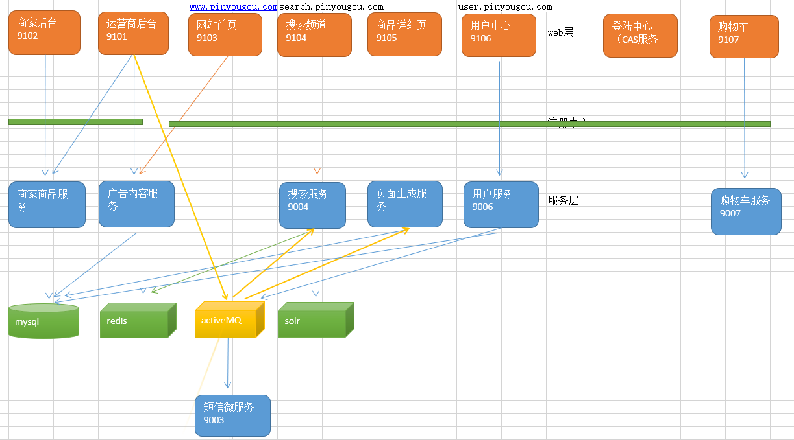


## 16.1 购物车需求分析与解决方案

用户在商品**详细页**点击**加入购物车**，提交商品**SKU编号**和**购买数量**，添加到购物车。购物车数据的存储结构如下：

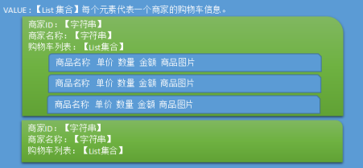

当用户在未登录的情况下，将此购物车存入**cookies** , 在用户登陆的情况下，将购物车数据存入**redis**  。如果用户登陆时，cookies 中存在购物车，需要将cookies的购物车**合并**到 redis 中存储。

工程搭建：

1. 创建工程`pinyougou-cart-interface`  ，依赖`pinyougou-pojo`

2. 创建工程`pinyougou-cart-service`（war），依赖`pinyougou-cart-interface`和`pinyougou-common`工程 和spring、 dubbox  等相关依赖,  添加`web.xml` 与spring配置文件（参照其他service工程）  tomcat插件端口设置为**9007**  ，dubbo端口为**20887**

3. 创建工程`pinyougou-cart-web`  ,依赖 `pinyougou-cart-interface`   `springsecurity` 、`CAS` 等。添加`web.xml` 与spring配置文件（参照其他web工程）tomcat插件端口设置为**9107** ，拷贝`UserDetailServiceImpl`  ,  拷贝页面资源

4. 将资源文件夹中 **Cookie工具类**拷贝到`pinyougou-common`工程中。需要在`pinyougou-common`工程引入`servlet-api`依赖

5. 购物车实体类：在`pinyougou-pojo`的`com.pinyougou.pojogroup`中创建购物车实体类。对**每个商家的购物车**进行的封装

   ```java
   public class Cart implements Serializable{
       private String sellerId;//商家ID
       private String sellerName;//商家名称
       private List<TbOrderItem> orderItemList;//购物车明细，涉及tb_order_item表
       //getter、setter  ......
   }
   ```


## 16.2 Cookie存储购物车

使用cookie存储购物车数据。服务层负责逻辑，**控制层负责读写Cookie（由于需要Request来获取）**

`CartServiceImpl`

```java
@Service
public class CartServiceImpl implements CartService {

    @Autowired
    private TbItemMapper itemMapper;

    @Override
    public List<Cart> addGoodsToCartList(List<Cart> cartList, Long itemId, Integer num) {
        //1.根据商品SKU ID查询SKU商品信息
        TbItem item = itemMapper.selectByPrimaryKey(itemId);
        if (item==null){
            throw new RuntimeException("商品不存在");
        }
        if (!item.getStatus().equals("1")){
            throw new RuntimeException("商品状态无效");
        }
        //2.获取商家ID
        String sellerId = item.getSellerId();
        //3.根据商家ID判断购物车列表中是否存在该商家的购物车
        Cart cart = searchCartBySellerId(cartList, sellerId);
        //4.如果购物车列表中不存在该商家的购物车
        if (cart==null){
            //4.1 新建购物车对象（所属商家的购物车）
            cart = new Cart();
            cart.setSellerId(sellerId);//商家id
            cart.setSellerName(item.getSeller());//商家名称
            List<TbOrderItem> orderItemList = new ArrayList<>();//订单明细列表（所属一个商家）
            TbOrderItem orderItem = createOrderItem(item, num);//订单明细对象
            orderItemList.add(orderItem);
            cart.setOrderItemList(orderItemList);

            //4.2 将新建的购物车对象添加到购物车列表
            cartList.add(cart);
        } else {
            //5.如果购物车列表中存在该商家的购物车
            // 查询订单明细列表中是否存在该商品
            TbOrderItem orderItem = searchOrderItemByItemId(cart.getOrderItemList(), itemId);
            //5.1. 如果没有，新增订单明细对象
            if (orderItem==null){
                orderItem = createOrderItem(item,num);//订单明细对象
                cart.getOrderItemList().add(orderItem);
            } else {
                //5.2. 如果有，在原购物车明细上添加数量，更改金额
                orderItem.setNum(orderItem.getNum()+num);
                orderItem.setTotalFee(new BigDecimal(orderItem.getPrice().doubleValue()*orderItem.getNum()));
                //订单明细对象数量小于等于0，移除此明细对象
                if (orderItem.getNum()<=0){
                    cart.getOrderItemList().remove(orderItem);
                }
                //订单明细列表中订单明细数量小于等于0，在购物车列表中移除该购物车
                if (cart.getOrderItemList().size()<=0){
                    cartList.remove(cart);
                }
            }
        }

        return cartList;
    }

    //根据商家ID查询购物车对象
    private Cart searchCartBySellerId(List<Cart> cartList,String sellerId){
        for (Cart cart : cartList) {
            if (cart.getSellerId().equals(sellerId)){
                return cart;
            }
        }
        return null;
    }

    //创建订单明细对象
    private TbOrderItem createOrderItem(TbItem item,Integer num){
        TbOrderItem orderItem = new TbOrderItem();
        orderItem.setGoodsId(item.getGoodsId());
        orderItem.setItemId(item.getId());
        orderItem.setNum(num);
        orderItem.setPicPath(item.getImage());
        orderItem.setPrice(item.getPrice());
        orderItem.setSellerId(item.getSellerId());
        orderItem.setTitle(item.getTitle());
        orderItem.setTotalFee(new BigDecimal(item.getPrice().doubleValue()*num));
        return orderItem;
    }

    //根据SKUID在订单明细列表中查询订单明细对象
    private TbOrderItem searchOrderItemByItemId(List<TbOrderItem> orderItemList,Long itemId){
        for (TbOrderItem orderItem : orderItemList) {
            if (orderItem.getItemId().longValue()==itemId.longValue()){
                return orderItem;
            }
        }
        return null;
    }
}
```

`CartController`

```java
@RestController
@RequestMapping("/cart")
public class CartController {
    @Reference
    private CartService cartService;

    @Autowired
    private HttpServletRequest request;

    @Autowired
    private HttpServletResponse response;

    @RequestMapping("/findCartList")
    public List<Cart> findCartList(){
        //从cookie中取出购物车
        String cartListString = CookieUtil.getCookieValue(request, "cartList", "UTF-8");
        if (cartListString==null || cartListString.equals("")){
            cartListString = "[]";
        }
        List<Cart> cartList_cookie = JSON.parseArray(cartListString, Cart.class);
        return cartList_cookie;
    }


    @RequestMapping("/addGoodsToCartList")
    public Result addGoodsToCartList(Long itemId,Integer num){
        try {
            //从cookie中取出购物车
            List<Cart> cartList = findCartList();
            //向购物车添加商品
            cartList = cartService.addGoodsToCartList(cartList, itemId, num);
            //将购物车存入cookie
            String cartListString = JSON.toJSONString(cartList);
            CookieUtil.setCookie(request,response,"cartList",cartListString,3600*24,"UTF-8");
            return new Result(true,"存入购物车成功");
        } catch (Exception e) {
            e.printStackTrace();
            return new Result(false,"存入购物车失败");

        }
    }
}
```

前端购物车列表（和之前一样，AngularJS遍历，绑定数据）

前端购物车数量增减与移除（调用后端`addGoodsToCartList()`方法，传递id，和num，num可正可负）

```js
//购物车服务层
app.service('cartService',function($http){
    //购物车列表
    this.findCartList=function(){
        return $http.get('cart/findCartList.do');
    }

    //添加商品到购物车
    this.addGoodsToCartList=function(itemId,num){
        return $http.get('cart/addGoodsToCartList.do?itemId='+itemId+'&num='+num);
    }

    //求合计
    this.sum=function(cartList){
        var totalValue={totalNum:0, totalMoney:0.00 };//合计实体
        for(var i=0;i<cartList.length;i++){
            var cart=cartList[i];
            for(var j=0;j<cart.orderItemList.length;j++){
                var orderItem=cart.orderItemList[j];//购物车明细
                totalValue.totalNum+=orderItem.num;
                totalValue.totalMoney+= orderItem.totalFee;
            }
        }
        return totalValue;
    }
});
```

```js
//购物车控制层
app.controller('cartController',function($scope,cartService){
    //查询购物车列表
    $scope.findCartList=function(){
        cartService.findCartList().success(
            function(response){
                $scope.cartList=response;
                $scope.totalValue=cartService.sum($scope.cartList);//求合计数
            }
        );
    }

    //添加商品到购物车
    $scope.addGoodsToCartList=function(itemId,num){
        cartService.addGoodsToCartList(itemId,num).success(
            function(response){
                if(response.success){
                    $scope.findCartList();//刷新列表
                }else{
                    alert(response.message);//弹出错误提示
                }
            }
        );
    }
});
```

HTML中`{{totalValue.totalMoney.toFixed(2)}}`方法可以保留两位小数


## 16.3 Redis存储购物车

判断当前用户是否登陆，如果未登录采用Cookie存储，如果登录则采用Redis存储。登录后要进行Cookie购物车与Redis购物车的合并操作，并清除Cookie购物车

### 16.3.1 获取当前登录人账号

`spring-security.xml` 更改配置：

去掉

```xml
<http pattern="/cart/*.do" security="none"></http>
```

添加

```xml
<http use-expressions="false" entry-point-ref="casProcessingFilterEntryPoint">
    <intercept-url pattern="/cart/*.do" access="IS_AUTHENTICATED_ANONYMOUSLY"/><!---->
    <intercept-url pattern="/**" access="ROLE_USER"/>  
    <custom-filter position="CAS_FILTER" ref="casAuthenticationFilter" />  
    <custom-filter ref="requestSingleLogoutFilter" before="LOGOUT_FILTER"/>  
    <custom-filter ref="singleLogoutFilter" before="CAS_FILTER"/>  
</http>
```

`access="IS_AUTHENTICATED_ANONYMOUSLY"` 用于设置**资源可以在不登陆时可以访问**，此配置与 `security="none"`的区别在于当用户未登陆时获取登陆人**账号的值为`anonymousUser`** ，而`security="none"`的话，无论是否登陆都不能获取登录人账号的值（在获取时就报空指针异常，因为不走SpringSecurity）


### 16.3.2 远程购物车存取

`CartServiceImpl`

```java
@Autowired
private RedisTemplate redisTemplate;
//从redis中查询购物车
@Override
public List<Cart> findCartListFromRedis(String username) {
    System.out.println("从redis提取购物车"+username);
    List<Cart> cartList = (List<Cart>) redisTemplate.boundHashOps("cartList").get(username);
    if (cartList==null){
        cartList = new ArrayList<>();
    }
    return cartList;
}

//将购物车保存到redis
@Override
public void saveCartListToRedis(String username, List<Cart> cartList) {
    System.out.println("向redis保存购物车"+username);
    redisTemplate.boundHashOps("cartList").put(username,cartList);

}
```

`CartController`

```java
@RestController
@RequestMapping("/cart")
public class CartController {
    @Reference
    private CartService cartService;

    @Autowired
    private HttpServletRequest request;

    @Autowired
    private HttpServletResponse response;

    @RequestMapping("/findCartList")
    public List<Cart> findCartList() {
        String name = SecurityContextHolder.getContext().getAuthentication().getName();
        System.out.println("name:" + name);
        if ("anonymousUser".equals(name)) { //未登录
            //从cookie中取出购物车
            String cartListString = CookieUtil.getCookieValue(request, "cartList", "UTF-8");
            if (cartListString == null || cartListString.equals("")) {
                cartListString = "[]";
            }
            List<Cart> cartList_cookie = JSON.parseArray(cartListString, Cart.class);
            return cartList_cookie;

        } else {
            List<Cart> cartList_redis = cartService.findCartListFromRedis(name);
            return cartList_redis;
        }

    }

    @RequestMapping("/addGoodsToCartList")
    public Result addGoodsToCartList(Long itemId, Integer num) {
        String name = SecurityContextHolder.getContext().getAuthentication().getName();
        System.out.println("name:" + name);


        try {
            //从cookie中取出购物车
            List<Cart> cartList = findCartList();
            //向购物车添加商品
            cartList = cartService.addGoodsToCartList(cartList, itemId, num);
            if ("anonymousUser".equals(name)) { //未登录
                //将购物车存入cookie
                String cartListString = JSON.toJSONString(cartList);
                CookieUtil.setCookie(request, response, "cartList", cartListString, 3600 * 24, "UTF-8");

            } else {
                cartService.saveCartListToRedis(name,cartList);
            }
            return new Result(true, "存入购物车成功");
        } catch (Exception e) {
            e.printStackTrace();
            return new Result(false, "存入购物车失败");

        }
    }
}
```


### 16.3.3 跳板页

创建跳板页：`pinyougou-cart-web` 工程新建`login.html `（因为这个会被CAS拦截，登录后继续跳转），页面添加脚本

```html
<script type="text/javascript">
    location.href="cart.html";
</script>
```

购物车页面链接到跳板页

```html
请<a href="login.html">登录</a> 
```


## 16.4 购物车合并

`CartServiceImpl`

```java
@Override
public List<Cart> mergeCartList(List<Cart> cartList1, List<Cart> cartList2) {
    for (Cart cart : cartList2) {
        for (TbOrderItem orderItem : cart.getOrderItemList()) {
            //调用封装好的方法
            cartList1 = addGoodsToCartList(cartList1, orderItem.getItemId(), orderItem.getNum());
        }
    }
    return cartList1;
}
```

`CartController`

```java
@RequestMapping("/findCartList")
public List<Cart> findCartList(){
    String username = SecurityContextHolder.getContext().getAuthentication().getName(); 
    String cartListString  = util.CookieUtil.getCookieValue(request, "cartList", "UTF-8");
    if(cartListString==null || cartListString.equals("")){
        cartListString="[]";
    }
    List<Cart> cartList_cookie = JSON.parseArray(cartListString, Cart.class);
    if(username.equals("anonymousUser")){//如果未登录			
        return cartList_cookie;			
    }else{
        List<Cart> cartList_redis =cartService.findCartListFromRedis(username);//从redis中提取	
        if(cartList_cookie.size()>0){//如果本地存在购物车
            //合并购物车
            cartList_redis=cartService.mergeCartList(cartList_redis, cartList_cookie);	
            //清除本地cookie的数据
            util.CookieUtil.deleteCookie(request, response, "cartList");
            //将合并后的数据存入redis 
            cartService.saveCartListToRedis(username, cartList_redis); 
        }			
        return cartList_redis;			
    }	
}
```


## 16.5 全部代码

```java
@Service
public class CartServiceImpl implements CartService {
   
    @Autowired
    private TbItemMapper itemMapper;

     /**
     * 添加商品到购物车
     */
    @Override
    public List<Cart> addGoodsToCartList(List<Cart> cartList, Long itemId, Integer num) {
        //1.根据商品SKU ID查询SKU商品信息
        TbItem item = itemMapper.selectByPrimaryKey(itemId);
        if (item==null){
            throw new RuntimeException("商品不存在");
        }
        if (!item.getStatus().equals("1")){
            throw new RuntimeException("商品状态无效");
        }
        //2.获取商家ID
        String sellerId = item.getSellerId();
        //3.根据商家ID判断购物车列表中是否存在该商家的购物车
        Cart cart = searchCartBySellerId(cartList, sellerId);
        //4.如果购物车列表中不存在该商家的购物车
        if (cart==null){
            //4.1 新建购物车对象（所属商家的购物车）
            cart = new Cart();
            cart.setSellerId(sellerId);//商家id
            cart.setSellerName(item.getSeller());//商家名称
            List<TbOrderItem> orderItemList = new ArrayList<>();//订单明细列表（所属一个商家）
            TbOrderItem orderItem = createOrderItem(item, num);//订单明细对象
            orderItemList.add(orderItem);
            cart.setOrderItemList(orderItemList);

            //4.2 将新建的购物车对象添加到购物车列表
            cartList.add(cart);
        } else {
            //5.如果购物车列表中存在该商家的购物车
            // 查询订单明细列表中是否存在该商品
            TbOrderItem orderItem = searchOrderItemByItemId(cart.getOrderItemList(), itemId);
            //5.1. 如果没有，新增订单明细对象
            if (orderItem==null){
                orderItem = createOrderItem(item,num);
                cart.getOrderItemList().add(orderItem);
            } else {
                //5.2. 如果有，在原购物车明细上添加数量，更改金额
                orderItem.setNum(orderItem.getNum()+num);
                orderItem.setTotalFee(new BigDecimal(orderItem.getPrice().doubleValue()*orderItem.getNum()));
                //订单明细对象数量小于等于0，移除此明细对象
                if (orderItem.getNum()<=0){
                    cart.getOrderItemList().remove(orderItem);
                }
                //订单明细列表数量小于等于0，在购物车列表中移除该购物车
                if (cart.getOrderItemList().size()<=0){
                    cartList.remove(cart);
                }
            }
        }

        return cartList;//返回新的购物车列表
    }
    
    //根据商家ID查询购物车对象
    private Cart searchCartBySellerId(List<Cart> cartList,String sellerId){
        for (Cart cart : cartList) {
            if (cart.getSellerId().equals(sellerId)){
                return cart;
            }
        }
        return null;
    }

    //创建订单明细对象
    private TbOrderItem createOrderItem(TbItem item,Integer num){
        TbOrderItem orderItem = new TbOrderItem();
        orderItem.setGoodsId(item.getGoodsId());
        orderItem.setItemId(item.getId());
        orderItem.setNum(num);
        orderItem.setPicPath(item.getImage());
        orderItem.setPrice(item.getPrice());
        orderItem.setSellerId(item.getSellerId());
        orderItem.setTitle(item.getTitle());
        orderItem.setTotalFee(new BigDecimal(item.getPrice().doubleValue()*num));
        return orderItem;
    }

    //根据SKUID在订单明细列表中查询订单明细对象
    private TbOrderItem searchOrderItemByItemId(List<TbOrderItem> orderItemList,Long itemId){
        for (TbOrderItem orderItem : orderItemList) {
            if (orderItem.getItemId().longValue()==itemId.longValue()){
                return orderItem;
            }
        }
        return null;
    }


    //===================================================================================//
    
    @Autowired
    private RedisTemplate redisTemplate;
    /**
     * 从redis中查询购物车
     */
    @Override
    public List<Cart> findCartListFromRedis(String username) {
        System.out.println("从redis提取购物车"+username);
        List<Cart> cartList = (List<Cart>) redisTemplate.boundHashOps("cartList").get(username);
        if (cartList==null){
            cartList = new ArrayList<>();
        }
        return cartList;
    }

    /**
     * 将购物车保存到redis
     */
    @Override
    public void saveCartListToRedis(String username, List<Cart> cartList) {
        System.out.println("向redis保存购物车"+username);
        redisTemplate.boundHashOps("cartList").put(username,cartList);

    }

    /**
     * 合并购物车
     */
    @Override
    public List<Cart> mergeCartList(List<Cart> cartList1, List<Cart> cartList2) {
        for (Cart cart : cartList2) {
            for (TbOrderItem orderItem : cart.getOrderItemList()) {
                //调用封装好的方法
                cartList1 = addGoodsToCartList(cartList1, orderItem.getItemId(), orderItem.getNum());
            }
        }
        return cartList1;
    }
}
```

```java
@RestController
@RequestMapping("/cart")
public class CartController {
    @Reference
    private CartService cartService;

    @Autowired
    private HttpServletRequest request;

    @Autowired
    private HttpServletResponse response;

    @RequestMapping("/findCartList")
    public List<Cart> findCartList(){
        String username = SecurityContextHolder.getContext().getAuthentication().getName();
        //从cookie中提取购物车
        String cartListString  = CookieUtil.getCookieValue(request, "cartList", "UTF-8");
        if(cartListString==null || cartListString.equals("")){
            cartListString="[]";
        }
        List<Cart> cartList_cookie = JSON.parseArray(cartListString, Cart.class);
        if(username.equals("anonymousUser")){//如果未登录，直接返回cookie中购物车
            return cartList_cookie;
        }else{//如果已登录，根据情况合并购物车并存入redis，清除cookie数据
            List<Cart> cartList_redis =cartService.findCartListFromRedis(username);//从redis中提取购物车
            if(cartList_cookie.size()>0){//如果本地存在购物车
                //合并购物车
                cartList_redis=cartService.mergeCartList(cartList_redis, cartList_cookie);
                //清除本地cookie的数据
                util.CookieUtil.deleteCookie(request, response, "cartList");
                //将合并后的数据存入redis
                cartService.saveCartListToRedis(username, cartList_redis);
                System.out.println("合并购物车");
            }
            return cartList_redis;
        }
    }


    @RequestMapping("/addGoodsToCartList")
    public Result addGoodsToCartList(Long itemId, Integer num) {
        String name = SecurityContextHolder.getContext().getAuthentication().getName();
        System.out.println("name:" + name);

        try {
            //取出购物车（cookie或redis中）
            List<Cart> cartList = findCartList();
            //向购物车添加商品
            cartList = cartService.addGoodsToCartList(cartList, itemId, num);
            if ("anonymousUser".equals(name)) { //未登录
                //将购物车存入cookie
                System.out.println("向cookie中存入购物车");
                String cartListString = JSON.toJSONString(cartList);
                CookieUtil.setCookie(request, response, "cartList", cartListString, 3600 * 24, "UTF-8");

            } else { //已登录
                //将购物车存入Redis
                cartService.saveCartListToRedis(name,cartList);
            }
            return new Result(true, "存入购物车成功");
        } catch (Exception e) {
            e.printStackTrace();
            return new Result(false, "存入购物车失败");

        }
    }
}
```


# 17 跨域（源）解决方案与提交订单

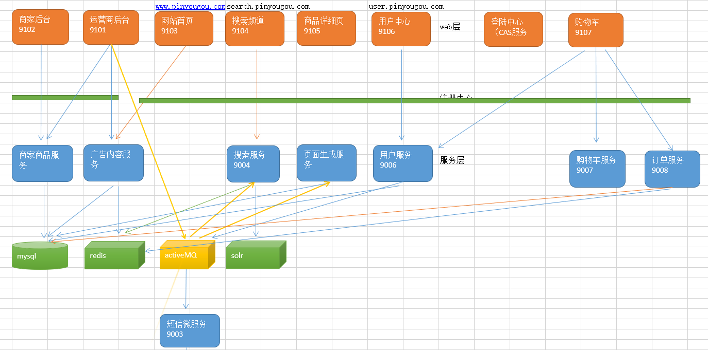

## 17.1 商品详细页跨域请求

> 从商品详细页点击“加入购物车”按钮，将当前商品加入购物车，并跳转到购物车页面

### 17.1.1 JS跨域请求

这里说的js跨域是指通过js在不同的域之间进行数据传输或通信，比如用ajax向一个不同的域请求数据，或者通过js获取页面中不同域的框架中(iframe)的数据。==只要**协议**、**域名**、**端口**有**任何一个不同**，都被当作是不同的域==

`pinyougou-page-web`中静态页面部署在Nginx中，添加购物车调用的是`pinyougou-cat-web`中方法，测试后发现无法跨域调用，提示`Access-Control-Allow-Origin`没有这个头信息


### 17.1.2 跨域解决方案 CORS

CORS是一个W3C标准，全称是"跨域资源共享"（Cross-origin resource sharing）。CORS需要浏览器和服务器同时支持。目前，所有浏览器都支持该功能，IE浏览器不能低于IE10。

它允许浏览器向跨源服务器，发出XMLHttpRequest请求，从而克服了AJAX只能同源使用的限制。整个CORS通信过程，都是浏览器自动完成，不需要用户参与。对于开发者来说，CORS通信与同源的AJAX通信没有差别，代码完全一样。浏览器一旦发现AJAX请求跨源，就会自动添加一些附加的头信息，有时还会多出一次附加的请求，但用户不会有感觉。因此，实现CORS通信的关键是**服务器**。只要服务器实现了CORS接口，就可以跨源通信

* 请求过程如下图

  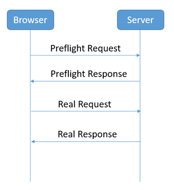

* Preflight Request：

  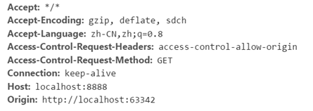

* Preflight Response：

  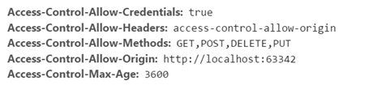

* **购物车工程能够接收跨域请求**

  1. 首先修改`pinyougou-cart-web` 的`CartController`的`addGoodsToCartList`方法，添加下面两句代码

     ```java
     response.setHeader("Access-Control-Allow-Origin", "http://localhost:9105");//可以设置为*，用cookie时不能用*
     response.setHeader("Access-Control-Allow-Credentials", "true");
     ```

     * `Access-Control-Allow-Origin`是HTML5中定义的一种解决资源跨域的策略

       也可以设置为 * 表示该资源谁都可以用，但在使用Cookie时不能这样设置！

  2. 修改`pinyougou-item-web`的`itemController`。这里只是用于发送Cookie的设置

     ```js
     //添加商品到购物车
     $scope.addToCart=function(){
     	$http.get('http://localhost:9107/cart/addGoodsToCartList.do?itemId='
     	+ $scope.sku.id +'&num='+$scope.num,{'withCredentials':true}).success(
     			function(response){
     				.......				 
     			}				
     	);		
     }
     ```

     **CORS请求默认不发送Cookie和HTTP认证信息**。如果要把Cookie发到服务器，一方面要服务器同意，**指定`Access-Control-Allow-Credentials`字段**。另一方面，开发者必须在**AJAX请求中打开`withCredentials`属性**。否则，即使服务器同意发送Cookie，浏览器也不会发送。或者，服务器要求设置Cookie，浏览器也不会处理

### 17.1.3 SpringMVC跨域注解

springMVC的版本在4.2或以上版本，可以使用注解实现跨域, 我们只需要在需要跨域的方法上添加**注解`@CrossOrigin`**即可

```java
@CrossOrigin(origins="http://localhost:9105",allowCredentials="true")//allowCredentials可以缺省，默认为true
```


## 17.2 结算页-收件人地址选择

> 在结算页实现收件人地址选择功能。Tb_address 为地址表。

1. 使用《黑马程序员代码生成器》生成代码，并拷贝到工程
2. AddressService接口拷入pinyougou-**user**-interface
3. **AddressServiceImpl** 类拷入到pinyougou-**user**-service（因为**地址信息从属于user信息，并且用户中心会管理地址**）
4. pinyougou-cart-web 引入pinyougou-user-interface依赖 ，**AddressController** 类拷入到pinyougou-**cart**-web
5. getOrderInfo.html拷贝至pinyougou-cart-web的webapp下


### 17.2.1 实现地址列表

`AddressServiceImpl`

```java
//根据用户查询地址
@Override
public List<TbAddress> findListByUserId(String userId) {
    TbAddressExample example = new TbAddressExample();
    Criteria criteria = example.createCriteria();
    criteria.andUserIdEqualTo(userId);
    return addressMapper.selectByExample(example);
}
```

`AddressController`

```java
//根据当前登录用户名来查询地址
@RequestMapping("/findListByLoginUser")
public List<TbAddress> findListByLoginUser(){
    String userId = SecurityContextHolder.getContext().getAuthentication().getName();
    return addressService.findListByUserId(userId);
}
```

`cartService`

```js
//获取当前登录账户收获地址
this.findAddressList = function () {
    return $http.get("address/findListByLoginUser.do");
}
```

`cartController`

```js
$scope.findAddressList = function () {
    cartService.findAddressList().success(function (date) {
        $scope.addressList = date;
        //默认地址选择显示
        for (let i = 0; i < $scope.addressList.length; i++) {
            if ($scope.addressList[i].isDefault=='1'){
                $scope.address = $scope.addressList[i];
            }
        }
    })
}

//选择的地址
$scope.selectAddress = function (address) {
    $scope.address = address;
}

//判断当前地址是否是选择的地址
$scope.isSelectedAddress = function (address) {
    if (address == $scope.address){
        return true;
    } else {
        return false;
    }
}
```

HTML中init及数据绑定，略


### 17.2.2 地址选择及默认地址显示

JS代码查看17.2.1

```html
<!--地址选择及默认地址显示-->
<div ng-repeat="address in addressList">
    <div class="con name {{isSelectedAddress(address)?'selected':''}}"><a ng-click="selectAddress(address)"></a>	</div>
</div>

<!--选择后订单寄送地址显示-->
<div class="fc-receiverInfo">寄送至:{{address.address}} 收货人：{{address.contact}} {{address.mobile}}</div>
```


### 17.2.3 收件人地址增加、修改与删除

> 学员实现


## 17.3 结算页-支付方式选择

> 实现支付方式的选择，品优购支持两种支付方式：微信支付和货到付款。存储到tb_order表中

`cartController`

```js
$scope.order = {"paymentType":"1"};//订单对象，最后提交

//选择支付方式
$scope.selectPayType = function (type) {
    $scope.order.paymentType = type;
}
```

HTML绑定方法并传值即可


## 17.4 结算页-商品清单与金额显示

> **这里把所有购物车中都拿来了，实际中应该是购物车中选中的商品！**

页面getOrderInfo.html上初始化调用`findCartList()`（注意！显示了所以购物车中的商品），其他显示和16.2相同


## 17.5 提交订单

点击订单结算页的提交订单 ，将购物车保存到**订单表**和**订单明细表**中，并将购物车数据清除。

订单表中存入数据数量根据**订单中商家个数**来决定，与订单明细是**一对多**关系，购物车中存储的就是这个信息，再加上商家ID即可

1. 创建pinyougou-**order**-interface  引入依赖pinyougou-pojo
2. 创建pinyougou-**order**-service  （WAR） 参照其它服务工程引入依赖，添加web.xml  spring配置文件  dubbox端口20888  tomcat7运行端口9008
3. pinyougou-**cart**-web 引入依赖pinyougou-order-interface


### 17.5.1 分布式ID生成器

==互联网应用中**order表由于每天增加**的数据可能很多，有可能采用**数据库分片**，利用数据库中间件进行连接==

所以不能采用主键自增（重复）

* UUID：太长、占空间；无序

* Redis：产生自增的序号。但是依赖Redis

* Oracle：数据库对象-序列，与表无关

* ==算法：**推特雪花算法snowflake**==。放在util中`idWorder.java`，存入项目的common中

  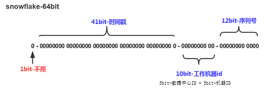

```xml
<bean id="idWorker" class="util.IdWorker">
    <constructor-arg index="0" value="0"/>
    <constructor-arg index="1" value="0"/>
</bean>
```

### 17.5.2 提交订单

`OrderServiceImpl`：别忘记加`@Transactional`注解事务

```java
@Autowired
private RedisTemplate<String, Object> redisTemplate;

@Autowired
private TbOrderItemMapper orderItemMapper;

@Autowired
private IdWorker idWorker;
/**
	 * 增加
	 */
@Override
public void add(TbOrder order) {
    //得到购物车数据
    List<Cart> cartList = (List<Cart>)
        redisTemplate.boundHashOps("cartList").get( order.getUserId() );
    for(Cart cart:cartList){
        long orderId = idWorker.nextId();
        System.out.println("sellerId:"+cart.getSellerId());
        TbOrder tborder=new TbOrder();//新创建订单对象
        tborder.setOrderId(orderId);//订单ID
        tborder.setUserId(order.getUserId());//用户名
        tborder.setPaymentType(order.getPaymentType());//支付类型
        tborder.setStatus("1");//状态：未付款
        tborder.setCreateTime(new Date());//订单创建日期
        tborder.setUpdateTime(new Date());//订单更新日期
        tborder.setReceiverAreaName(order.getReceiverAreaName());//地址
        tborder.setReceiverMobile(order.getReceiverMobile());//手机号
        tborder.setReceiver(order.getReceiver());//收货人
        tborder.setSourceType(order.getSourceType());//订单来源
        tborder.setSellerId(cart.getSellerId());//商家ID				
        //循环购物车明细
        double money=0;
        for(TbOrderItem orderItem :cart.getOrderItemList()){
            orderItem.setId(idWorker.nextId());
            orderItem.setOrderId( orderId  );//订单ID	
            orderItem.setSellerId(cart.getSellerId());
            money+=orderItem.getTotalFee().doubleValue();//金额累加
            orderItemMapper.insert(orderItem);
        }
        tborder.setPayment(new BigDecimal(money));
        orderMapper.insert(tborder);
    }
    redisTemplate.boundHashOps("cartList").delete(order.getUserId());
}
```

`OrderController`

```java
@RequestMapping("/add")
public Result add(@RequestBody TbOrder order){
    //获取当前登录人账号
    String username = SecurityContextHolder.getContext().getAuthentication().getName();
    order.setUserId(username);
    order.setSourceType("2");//订单来源  PC

    try {
        orderService.add(order);
        return new Result(true, "增加成功");
    } catch (Exception e) {
        e.printStackTrace();
        return new Result(false, "增加失败");
    }
}
```

`cartService`

```js
//保存订单
this.submitOrder=function(order){
    return $http.post('order/add.do',order);
}
```

`cartController`

```js
//保存订单
$scope.submitOrder=function(){
    $scope.order.receiverAreaName=$scope.address.address;//地址
    $scope.order.receiverMobile=$scope.address.mobile;//手机
    $scope.order.receiver=$scope.address.contact;//联系人
    //其他的信息从购物车中获取（可能在Cookie或Redis中）
    cartService.submitOrder( $scope.order ).success(
        function(response){
            if(response.success){
                //页面跳转
                if($scope.order.paymentType=='1'){//如果是微信支付，跳转到支付页面
                    location.href="pay.html";
                }else{//如果货到付款，跳转到提示页面
                    location.href="paysuccess.html";
                }
            }else{
                alert(response.message);	//也可以跳转到提示页面				
            }
        }
    );
}
```


# 18 微信支付

## 18.1 二维码

### 18.1.1 二维码简介

二维码又称**QR Code**，QR全称**Quick Response**。二维条码/二维码（2-dimensional bar code）是用某种特定的几何图形按一定规律在平面（二维方向上）分布的**黑白相间**的图形记录数据符号信息的；在代码编制上巧妙地利用构成计算机内部逻辑基础的“**0**”、“**1**”比特流的概念，使用若干个与二进制相对应的几何形体来表示文字数值信息，通过图象输入设备或光电扫描设备自动识读以实现信息自动处理：它具有条码技术的一些共性：每种码制有其特定的字符集；每个字符占有一定的宽度；具有一定的校验功能等。同时还具有对不同行的信息自动识别功能、及处理图形旋转变化点

二维码优势：

* 信息容量大，可以容纳多达1850个大写字母或2710个数字或500多个汉字
* 应用范围广，支持文字，声音，图片，指纹等等...
* 容错能力强，即使图片出现部分破损也能使用
* 成本低，容易制作

二维码**容错级别**：

* **L**级（低） 7％的码字可以被恢复。
* **M**级（中） 的码字的15％可以被恢复。
* **Q**级（四分）的码字的25％可以被恢复。
* **H**级（高） 的码字的30％可以被恢复


### 18.1.2 二维码生成插件qrious

qrious是一款基于HTML5 Canvas的纯**JS**二维码生成插件。通过qrious.js可以快速生成各种二维码，你可以控制二维码的尺寸颜色，还可以将生成的二维码进行Base64编码，可用配置参数如下：

| 参数       | 类型   | 默认值      | 描述                               |
| ---------- | ------ | ----------- | ---------------------------------- |
| background | String | "white"     | 二维码的背景颜色。                 |
| foreground | String | "black"     | 二维码的前景颜色。                 |
| level      | String | "L"         | 二维码的误差校正级别(L, M, Q, H)。 |
| mime       | String | "image/png" | 二维码输出为图片时的MIME类型。     |
| size       | Number | 100         | 二维码的尺寸，单位像素。           |
| value      | String | ""          | 需要编码为二维码的值               |

```html
<body>
    
    <script src="qrious.min.js"></script>
    <script>
        var qr = new QRious({
            element:document.getElementById('qrious'),
            size:250, 	   
            level:'H',	   
            value:'http://www.itcast.cn'
        });
    </script>
</body>
```


## 18.2 微信扫码支付简介

### 18.2.1 微信扫码支付申请（了解）

**第一步：注册公众号（类型须为：服务号）**

请根据营业执照类型选择以下主体注册：[个体工商户](http://kf.qq.com/faq/120911VrYVrA151009JB3i2Q.html)| [企业/公司](http://kf.qq.com/faq/120911VrYVrA151013MfYvYV.html)| [政府](http://kf.qq.com/faq/161220eaAJjE161220IJn6zU.html)| [媒体](http://kf.qq.com/faq/161220IFBJFv161220YnqAbQ.html)| [其他类型](http://kf.qq.com/faq/120911VrYVrA151013nYFZ7Z.html)。

**第二步：认证公众号**

公众号认证后才可申请微信支付，认证费：300元/次。

**第三步：提交资料申请微信支付**

登录公众平台，点击左侧菜单【微信支付】，开始填写资料等待审核，审核时间为1-5个工作日内。

**第四步：开户成功，登录商户平台进行验证**

资料审核通过后，请登录联系人邮箱查收商户号和密码，并登录商户平台填写财付通备付金打的小额资金数额，完成账户验证。

**第五步：在线签署协议**

本协议为线上电子协议，签署后方可进行交易及资金结算，签署完立即生效。

本课程已经提供好“传智播客”的微信支付账号，学员无需申请。


### 18.2.2 开发文档

微信支付接口调用的整体**思路**：

​	**按API要求组装参数，以XML方式发送（POST）给微信支付接口（URL）,微信支付接口也是以XML方式给予响应。程序根据返回的结果（其中包括支付URL）生成二维码或判断订单状态。**

在线微信支付[开发文档](https://pay.weixin.qq.com/wiki/doc/api/index.html)，在本章课程中会==用到” **统一下单**”和”**查询订单**”两组API，还应该把**关闭订单**用上！==

* `appid`：微信公众账号或开放平台APP的唯一标识
* `mch_id`：商户号  (配置文件中的partner)
* `partnerkey`：商户密钥
* `sign`：数字签名, 根据微信官方提供的密钥和一套算法生成的一个加密信息, 就是为了保证交易的安全性


### 18.2.3 微信支付SDK

微信支付提供了SDK, 大家下载后打开源码，install到本地仓库。但是自己安装zip包到本地仓库失败！！！jar包就OK！

```
mvn install:install-file -DgroupId=com.github.wxpay -DartifactId=wxpay-sdk -Dversion=0.0.3 -Dpackaging=jar -Dfile=D:/WxPayAPI_JAVA.zip
```

使用微信支付SDK，在Maven工程中引入依赖

```xml
<dependency>
    <groupId>com.github.wxpay</groupId>
    <artifactId>wxpay-sdk</artifactId>
    <version>0.0.3</version>
</dependency>
```

主要会用到微信支付SDK的以下功能：

* 获取随机字符串：`WXPayUtil.generateNonceStr()`
* MAP转换为XML字符串（**自动添加签名**）：`WXPayUtil.generateSignedXml(param, partnerkey)`
* XML字符串转换为MAP：`WXPayUtil.xmlToMap(result)`


### 18.2.4 HttpClient工具类

HttpClient是Apache Jakarta Common下的子项目，用来提供高效的、最新的、功能丰富的==**支持HTTP协议的客户端编程工具包**==，并且它支持HTTP协议最新的版本和建议。HttpClient已经应用在很多的项目中，比如Apache Jakarta上很著名的另外两个开源项目Cactus和HTMLUnit都使用了HttpClient。

HttpClient通俗的讲就是**模拟了浏览器的行为**，如果我们需要在后端向某一地址提交数据获取结果，就可以使用HttpClient。

关于HttpClient（原生）具体的使用不属于我们本章的学习内容，我们这里这里为了简化HttpClient的使用，提供了工具类HttpClient（对原生HttpClient进行了封装），使用步骤如下：

```java
HttpClient client=new HttpClient(请求的url地址);
client.setHttps(true);//是否是https协议
client.setXmlParam(xmlParam);//发送的xml数据
client.post();//执行post请求
String result = client.getContent(); //获取结果
```


## 18.3 品优购-微信二维码生成

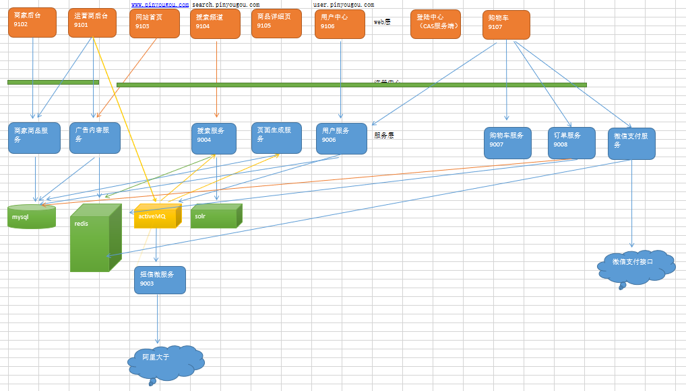

工程搭建与准备工作：

1. 建立支付服务接口模块pinyougou-pay-interface  （jar）

2. 建立支付服务实现模块pinyougou-pay-service（war），依赖pinyougou-pay-interface 和pinyougou-common 、 spring  dubbox 相关依赖 、**微信SDK**（因为不需要连接数据库所以不用引用dao工程），运行端口为**9000**。添加spring配置文件等

   ```xml
   <dependency>
       <groupId>com.github.wxpay</groupId>
       <artifactId>wxpay-sdk</artifactId>
       <version>0.0.3</version>
   </dependency>
   ```

3. 在pinyougou-common工程中添加工具类HttpClient.java，并添加原生HttpClient依赖

   ```xml
   <dependency>
       <groupId>org.apache.httpcomponents</groupId>
       <artifactId>httpclient</artifactId>	  		
   </dependency>
   ```

4. 添加配置文件`weixinpay.properties`

   ```properties
   # 微信公众账号或开放平台APP的唯一标识
   appid=wx8397f8696b538317
   # 财付通平台的商户账号
   partner=1473426802
   # 财付通平台的商户密钥
   partnerkey==T6m9iK73b0kn9g5v426MKfHQH7X8rKwb
   # 通知地址，回调地址
   notifyurl=http://a31ef7db.ngrok.io/WeChatPay/WeChatPayNotify
   ```

5. pinyougou-cart-web依赖工程pinyougou-pay-interface

6. 将二维码插件QRious  拷贝到pinyougou-cart-web  的plugins目录中

`WeixinPayServiceImpl`

```java
@Service
public class WeixinPayServiceImpl implements WeixinPayService {

    @Value("${appid}")
    private String appid;

    @Value("${partner}")
    private String partner;

    @Value("${partnerkey}")
    private String partnerkey;

    /**
     * 生成二维码需要的URL
     * @param out_trade_no，订单号
     * @param total_fee，金额（分）
     * @return
     */
    @Override
    public Map createNative(String out_trade_no, String total_fee) {
        //1.参数封装
        Map param = new HashMap();
        param.put("appid",appid);//公众账号ID，配置文件中取
        param.put("mch_id",partner);//商户号，配置文件中取
        param.put("nonce_str", WXPayUtil.generateNonceStr());//随机字符串
        param.put("body","品优购");//商品描述，不知道具体商品，就写品优购即可
        param.put("out_trade_no",out_trade_no);//商户订单号
        param.put("total_fee",total_fee);//标价金额（分）
        param.put("spbill_create_ip","127.0.0.1");//终端IP，这个可以由控制层来传入，也可以随便写个，暂时不用
        param.put("notify_url","http://www.itcast.cn");//通知地址，用不到，可以随意写个外网可用地址，不用注入Value
        param.put("trade_type","NATIVE");//交易类型：JSAPI/NATIVE/APP等
        try {
            String xmlParam = WXPayUtil.generateSignedXml(param, partnerkey);//生成xml并自动添加签名（签名算法添加）
            System.out.println("请求的参数："+xmlParam);

            //2.HttpClient发送请求
            HttpClient httpClient = new HttpClient("https://api.mch.weixin.qq.com/pay/unifiedorder");//统一下单URL
            httpClient.setHttps(true);
            httpClient.setXmlParam(xmlParam);
            httpClient.post();

            //3.获取结果
            String xmlResult = httpClient.getContent();
            //通过微信SDK转为map
            Map<String, String> mapResult = WXPayUtil.xmlToMap(xmlParam);
            //获取生成支付二维码的链接地址，并封装到新的Map集合中返回，防止敏感信息...
            Map map = new HashMap();
            map.put("code_url",mapResult.get("code_url"));
            map.put("out_trade_no",out_trade_no);
            map.put("total_fee",total_fee);
            return map;

        } catch (Exception e) {
            e.printStackTrace();
            return new HashMap();
        }
    }


    /**
     * 查询订单状态
     * @param out_trade_no，订单号
     * @return
     */
    @Override
    public Map queryPayStatus(String out_trade_no) {
        //1.封装参数
        Map param = new HashMap();
        param.put("appid",appid);
        param.put("mch_id",partner);
        param.put("out_trade_no",out_trade_no);
        param.put("nonce_str",WXPayUtil.generateNonceStr());
        param.put("appid",appid);
        try {
            String xmlParam = WXPayUtil.generateSignedXml(param, partnerkey);

            //2.HttpClient发送请求
            HttpClient httpClient = new HttpClient("https://api.mch.weixin.qq.com/pay/orderquery");//查询订单URL
            httpClient.setHttps(true);
            httpClient.setXmlParam(xmlParam);
            httpClient.post();

            //3.获取结果
            String xmlResult = httpClient.getContent();
            Map<String, String> mapResult = WXPayUtil.xmlToMap(xmlResult);
            System.out.println("查询订单API"+mapResult);
            return mapResult;//也可以封装到新map中，防止敏感信息泄露

        } catch (Exception e) {
            e.printStackTrace();
            return null;
        }
    }

    /**
     * 关闭订单
     * @param out_trade_no
     */
    @Override
    public Map closePay(String out_trade_no) {

        //1.封装参数
        Map param = new HashMap();
        param.put("appid",appid);
        param.put("mch_id",partner);
        param.put("out_trade_no",out_trade_no);
        param.put("nonce_str",WXPayUtil.generateNonceStr());
        param.put("appid",appid);
        try {
            String xmlParam = WXPayUtil.generateSignedXml(param, partnerkey);

            //2.HttpClient发送请求
            HttpClient httpClient = new HttpClient("https://api.mch.weixin.qq.com/pay/closeorder");//关闭订单URL
            httpClient.setHttps(true);
            httpClient.setXmlParam(xmlParam);
            httpClient.post();

            //3.获取结果
            String xmlResult = httpClient.getContent();
            Map<String, String> mapResult = WXPayUtil.xmlToMap(xmlResult);
            System.out.println("查询订单API"+mapResult);
            return mapResult;//也可以封装到新map中，防止敏感信息泄露

        } catch (Exception e) {
            e.printStackTrace();
            return null;
        }
    }

}
```

`com.pinyougou.cart.controller.PayController`

```java
@RestController
@RequestMapping("/pay")
public class PayController {

    @Reference
    private WeixinPayService weixinPayService;

    @RequestMapping("/createNative")
    public Map createNative(){
        IdWorker idWorker = new IdWorker();
        return weixinPayService.createNative(idWorker.nextId()+"","1");
    }

    @RequestMapping("/queryPayStatus")
    public Result queryPayStatus(String out_trade_no) {

        int x = 0;
        while (true) {
            Map<String, String> map = weixinPayService.queryPayStatus(out_trade_no);
            if (map == null) {
                return new Result(false, "支付发生错误");
            } else if ("SUCCESS".equals(map.get("trade_state"))) {
                orderService.updateOrderStatus(out_trade_no,map.get("transaction_id"));//修改订单状态
                return new Result(true, "支付成功");
            }
            try {
                Thread.sleep(3000L);//每隔3秒查询一次
            } catch (InterruptedException e) {
                e.printStackTrace();
            }
            x++;
            if (x>100){//大约5分钟后
                return new Result(false,"二维码超时");
            }
        }
    }
}
```

调用控制层方法返回：

```js
{"out_trade_no":"1091790546621452288","code_url":"weixin://wxpay/bizpayurl?pr=eBNK9Hj","total_fee":"1"}
```

前端：

`payService`

```js
app.service('payService',function($http){
    //本地支付
    this.createNative=function(){
        return $http.get('pay/createNative.do');
    }

    //查询支付状态
    this.queryPayStatus=function(out_trade_no){
        return $http.get('pay/queryPayStatus.do?out_trade_no='+out_trade_no);
    }

});
```

`payController`

```js
app.controller('payController' ,function($scope ,payService){
    //本地生成二维码
    $scope.createNative=function(){
        payService.createNative().success(
            function(response){
                $scope.money=  (response.total_fee/100).toFixed(2);//金额
                $scope.out_trade_no= response.out_trade_no;//订单号
                //二维码
                var qr = new QRious({
                    element:document.getElementById('qrious'),
                    size:250,
                    level:'H',
                    value:response.code_url
                });

                queryPayStatus(response.out_trade_no);//生成二维码之后就查询支付状态！！！
            }
        );
    }

    //查询支付状态
    queryPayStatus=function(out_trade_no){
        payService.queryPayStatus(out_trade_no).success(
            function(response){
                if(response.success){
                    location.href="paysuccess.html#?money="+$scope.money;//
                }else if ("二维码超时"==response.message) {
                    $scope.createNative();//超时就重新生成二维码
                } else {
                    location.href="payfail.html";
                }
            }
        );
    }
    
     //获取金额
    $scope.getMoney=function(){
        return $location.search()['money'];
    }
});
```

HTML绑定app/init等，``，键入`http://localhost:9107/pay.html`即可看到二维码和订单金额、订单号


## 18.4 品优购-检测支付状态

状态查询需要**循环调用**，可以让**后端循环调用微信**SDK的查询订单方法，减少前端循环调用后端引起的压力过大。查看18.3


## 18.5 品优购-检测时间限制

设置变量记录时间，超过比如5分钟，则返回二维码超时，前端根据此信息来重新获取二维码。查看18.3。


## 18.6 支付成功页面显示金额

angularJS的页面传参来解决`$location.search()`方法返回的数组。查看18.3。


## 18.7 品优购-支付日志

我们现在系统还有两个问题需要解决：

- 系统中无法查询到**支付记录**
- 支付后**订单状态**没有改变

实现思路：

* 在用户**下订单**时，判断如果为微信支付，就**向支付日志表添加一条记录**，信息包括支付总金额、订单ID（多个）、用户ID 、下单时间等信息，支付状态为0（未支付）
* 生成的**支付日志对象放入redis**中，以用户ID作为key，这样在生成支付二维码时就可以从redis中提取支付日志对象中的金额和订单号
* 当用户支付成功后，修改支付日志的**支付状态为1**（已支付），并记录微信传递给我们的交易流水号。根据订单ID（多个）修改**订单的状态为2**（已付款）

**tb_paylog**：支付日志表，存储订单的各种信息。对应**多条tb_order**表记录


### 18.7.1 插入日志记录

在`com.pinyougou.order.service.impl.OrderServiceImpl`中的**保存订单**方法中操作日志`TbPayLog`

```java
@Override
public void add(TbOrder order) {
    //得到购物车数据
    List<Cart> cartList = (List<Cart>)
        redisTemplate.boundHashOps("cartList").get( order.getUserId() );
    List<String> orderIdList = new ArrayList<>();//存储订单id列表
    double total_money = 0;//总金额
    for(Cart cart:cartList){
        long orderId = idWorker.nextId();
        System.out.println("sellerId:"+cart.getSellerId());
        TbOrder tborder=new TbOrder();//新创建订单对象
        tborder.setOrderId(orderId);//订单ID
        tborder.setUserId(order.getUserId());//用户名
        tborder.setPaymentType(order.getPaymentType());//支付类型
        tborder.setStatus("1");//状态：未付款
        tborder.setCreateTime(new Date());//订单创建日期
        tborder.setUpdateTime(new Date());//订单更新日期
        tborder.setReceiverAreaName(order.getReceiverAreaName());//地址
        tborder.setReceiverMobile(order.getReceiverMobile());//手机号
        tborder.setReceiver(order.getReceiver());//收货人
        tborder.setSourceType(order.getSourceType());//订单来源
        tborder.setSellerId(cart.getSellerId());//商家ID
        //循环购物车明细
        double money=0;
        for(TbOrderItem orderItem :cart.getOrderItemList()){
            orderItem.setId(idWorker.nextId());
            orderItem.setOrderId( orderId  );//订单ID
            orderItem.setSellerId(cart.getSellerId());
            money+=orderItem.getTotalFee().doubleValue();//金额累加
            orderItemMapper.insert(orderItem);
        }
        tborder.setPayment(new BigDecimal(money));
        orderMapper.insert(tborder);
        orderIdList.add(orderId+"");//每次生成订单ID
        total_money+=money;//要支付的所有订单金额总数
    }

    //====================添加支付日志=========================//
    if ("1".equals(order.getPaymentType())){//是微信支付时
        TbPayLog payLog = new TbPayLog();
        payLog.setOutTradeNo(idWorker.nextId()+"");//支付订单号，自己生成
        payLog.setCreateTime(new Date());
        payLog.setUserId(order.getUserId());
        payLog.setOrderList(orderIdList.toString().replace("[","").replace("]",""));//订单ID串
        payLog.setTotalFee((long) (total_money*100));//要支付的所有订单金额总数（分）
        payLog.setTradeState("0");//交易状态（从0开始，微信支付要求的）
        payLog.setPayType("1");//微信支付

        payLogMapper.insert(payLog);
        redisTemplate.boundHashOps("payLog").put(order.getUserId(),payLog);//放入缓存
    }


    redisTemplate.boundHashOps("cartList").delete(order.getUserId());
}

//根据用户名获取支付日志
@Override
public TbPayLog searchPayLogFromRedis(String userId) {
    return (TbPayLog) redisTemplate.boundHashOps("payLog").get(userId);
}

/**
     * 支付成功修改状态
     * @param out_trade_no   ，支付订单号
     * @param transaction_id ，交易号码流水号（微信传来的）
     */
@Override
public void updateOrderStatus(String out_trade_no, String transaction_id) {
    //1.修改支付日志的状态
    TbPayLog payLog = payLogMapper.selectByPrimaryKey(out_trade_no);
    payLog.setPayTime(new Date());//支付时间
    payLog.setTradeState("1");//支付交易状态，成功
    payLog.setTransactionId(transaction_id);//微信的交易号码流水号
    payLogMapper.updateByPrimaryKey(payLog);//...

    //2.修改订单表的状态
    String orderList = payLog.getOrderList();//订单串（一个微信交易流水可能有多个商家的订单）
    String[] orderIds = orderList.split(",");
    for (String orderId : orderIds) {
        TbOrder order = orderMapper.selectByPrimaryKey(Long.valueOf(orderId));
        order.setStatus("2");//订单状态已付款
        order.setPaymentTime(new Date());//订单表的支付时间
        orderMapper.updateByPrimaryKey(order);
    }

    //3.清除缓存中的payLog
    redisTemplate.boundHashOps("payLog").delete(payLog.getUserId());
}
```


### 18.7.2 读取日志记录

`com.pinyougou.cart.controller.PayController`中**生成微信支付**的方法中调用获取日志记录，传入订单号/金额

```java
@RequestMapping("/createNative")
public Map createNative() {
    //获取当前登录用户，并从Redis中提取支付日志
    String username = SecurityContextHolder.getContext().getAuthentication().getName();
    TbPayLog payLog = orderService.searchPayLogFromRedis(username);
    //调用微信支付服务来生成订单号/金额/URL
    if (payLog!=null){
        return weixinPayService.createNative(payLog.getOutTradeNo() , payLog.getTotalFee()+"");
    } else {
        return new HashMap();
    }
}
```


### 18.7.3 修改订单状态

查看18.7.1，并在18.3`com.pinyougou.cart.controller.PayController`中返回支付成功时调用该方法修改订单状态

### 18.7.4 支付日志显示

在运营商后台中，显示支付日志列表，实现按日期、状态、用户进行查询。学员实现


# 19 秒杀解决方案

## 19.1 秒杀业务分析

秒杀商品通常有两种限制：库存限制、时间限制。

需求：

1. 商家提交秒杀商品申请，录入秒杀商品数据，主要包括：商品标题、原价、秒杀价、商品图片、介绍等信息
2. 运营商审核秒杀申请
3. 秒杀频道首页列出秒杀商品（进行中的）点击秒杀商品图片跳转到秒杀商品详细页
4. 商品详细页显示秒杀商品信息，点击立即抢购实现秒杀下单，下单时扣减库存。当库存为0或不在活动期范围内时无法秒杀
5. 秒杀下单成功，直接跳转到支付页面（微信扫码），支付成功跳转到成功页，填写收货地址、电话等信息，完成订单
6. 当用户秒杀下单5分钟内未支付，取消预订单，调用微信支付的关闭订单接口，恢复库存

Tb_seckill_goods 秒杀商品表、Tb_seckill_order 秒杀订单表

秒杀实现思路：

​	秒杀技术实现核心思想是运用**缓存**减少数据库瞬间的访问压力！读取商品详细信息时运用缓存，当用户点击抢购时减少缓存中的库存数量，**当库存数为0时或活动期结束时，同步到数据库**。 产生的秒杀预订单也不会立刻写到数据库中，而是先写到缓存，当**用户付款成功后再写入数据库** 

### 19.1.1 工程搭建与准备

1. 创建秒杀服务接口模块 `pinyougou-seckill-interface` ，依赖`pinyougou-pojo`
2. 创建秒杀服务模块`pinyougou-seckill-service (war)`，`pom.xml`引入依赖参见其它服务工程,依赖 `pinyougou-seckill-interface` ， Tomcat7插件运行端口为**9009**。添加`web.xml`、 spring 配置文件参见其它服务工程, dubbox的端口为**20889**。
3. 创建秒杀频道web模块 `pinyougou-seckill-web(war)`  `pom.xml`引入依赖参见cart_web工程(需添加**单点登录**和**权限控制**)，依赖 `pinyougou-seckill-interface`  ，Tomcat7插件运行端口为**9109**  添加web.xml、 spring 配置文件参见cart_web工程。将秒杀相关的页面及资源拷贝到此模块。添加angularJS


### 19.1.2 秒杀商品后台管理（学员完成）

运营商系统web模块pinyougou-manager-web依赖 pinyougou-seckill-interface 

商家系统web模块pinyougou-shop-web依赖pinyougou-seckill-interface 

**商家后台**

* 秒杀商品列表

* 秒杀商品申请

* 秒杀订单查询

**运营商后台**     

* 待审核秒杀商品列表
* 秒杀商品审核
* 秒杀订单查询

​       

## 19.2 品优购-秒杀频道首页

`SeckillGoodsServiceImpl`

```java
@Autowired
private RedisTemplate redisTemplate;

/**
	 * @return 返回正在参与秒杀的商品
	 */
@Override
public List<TbSeckillGoods> findList() {

    List<TbSeckillGoods> seckillGoodsList = redisTemplate.boundHashOps("seckillGoodsList").values();//keys获取值集合
    if (seckillGoodsList==null || seckillGoodsList.size()<=0){
        TbSeckillGoodsExample example = new TbSeckillGoodsExample();
        Criteria criteria = example.createCriteria();
        criteria.andStatusEqualTo("1");//审核通过
        criteria.andStockCountGreaterThan(0);//库存大于0
        Date date = new Date();
        criteria.andStartTimeLessThanOrEqualTo(date);//开始时间小于等于当前时间
        criteria.andEndTimeGreaterThanOrEqualTo(date);//截止时间大于等于当前时间
        seckillGoodsList = seckillGoodsMapper.selectByExample(example);

        //将列表数据装入Redis，缓存每一个商品详细信息！！！
        for (TbSeckillGoods seckillGoods : seckillGoodsList) {
            redisTemplate.boundHashOps("seckillGoodsList").put(seckillGoods.getId(),seckillGoods);
        }

        System.out.println("mysql");
    } else {
        System.out.println("redis");
    }
    return seckillGoodsList;
}

/**
     * 从Redis中读取商品详情
     */
@Override
public TbSeckillGoods findOneFromRedis(Long id) {
    return (TbSeckillGoods) redisTemplate.boundHashOps("seckillGoodsList").get(id);
}
```

`SeckillGoodsController`

```java
//返回正在参与秒杀的商品
@RequestMapping("/findList")
public List<TbSeckillGoods> findList(){
    return seckillGoodsService.findList();
}

//返回商品详情
@RequestMapping("/findOneFromRedis")
public TbSeckillGoods findOneFromRedis(Long id){
    return seckillGoodsService.findOneFromRedis(id);
}
```

`seckillGoodsService.js`

```js
//服务层
app.service('seckillGoodsService',function($http){
    //读取列表数据绑定到表单中
    this.findList=function(){
        return $http.get('seckillGoods/findList.do');
    }
    //查询单独商品信息
    this.findOne = function (id) {
        return $http.get('seckillGoods/findOneFromRedis.do?id=' + id);
    }
});

```

`seckillGoodsController.js`

```js
//控制层
app.controller('seckillGoodsController' ,function($scope,seckillGoodsService){
    //读取列表数据绑定到表单中
    $scope.findList=function(){
        seckillGoodsService.findList().success(
            function(response){
                $scope.list=response;
            }
        );
    }

    //不用页面之间传参使用$location服务
    //查询单独商品
    $scope.findOne = function () {
        let id = $location.search()['id'];
        seckillGoodsService.findOne(id).success(function (data) {
            $scope.entity = data;


            //总秒数
            let allSeconds = Math.floor((new Date($scope.entity.endTime).getTime() - new Date().getTime()) / 1000);
            //计时器
            let time = $interval(function () {
                if (allSeconds > 0) {
                    allSeconds = allSeconds -1;
                    $scope.timeString = convertTimeString(allSeconds);
                } else {
                    $interval.cancel(time);
                    alert("秒杀服务已结束");
                }
            }, 1000);


        })
    }

    //将秒转为字符串格式
    let convertTimeString = function (allSeconds) {

        let days = Math.floor(allSeconds / 86400);
        let hours = Math.floor(allSeconds % 86400 / 3600);
        let minutes = Math.floor(allSeconds % 86400 % 3600 / 60);
        let seconds = allSeconds % 86400 % 3600 % 60;

        let timeString = "";
        if (days > 0) {
            timeString += days + "天";
        }
        return timeString += hours + ":" + minutes + ":" + seconds;
    });

```

HTML绑定遍历即可，略。百分比`{{((pojo.num-pojo.stockCount)/pojo.num*100).toFixed(0)}}%`

==**缓存处理**==，查看上面代码


## 19.3 品优购-秒杀详细页

> 这个不能使用网页静态化技术解决，因为页面还有些动态数据从后端加载！利用上面的缓存即可！
>
> 虽然后端生成代码有findOne方法，还是需要重新写一个方法。以便前台使用缓存，后台使用Redis

查看19.2。由于涉及页面跳转，传参需要使用AngularJS的`$location`服务，并在页面使用`#?`绑定参数

### 19.3.1 秒杀倒计时 $interval服务

在AngularJS中`$interval`服务用来处理间歇性处理一些事情，类似原生的setInterval函数

```js
$interval(执行的函数,间隔的毫秒数,运行次数);//运行次数可以缺省，如果缺省则无限循环执行
```

取消执行可以使用`cancel`方法

```js
$scope.second = 10; 
time= $interval(function(){ 
    if($scope.second>0){ 
        $scope.second =$scope.second-1;  			
    }else{
        $interval.cancel(time); 		  
        alert("秒杀服务已结束");
    }
},1000);
```


### 19.3.2 秒杀倒计时

查看19.2


## 19.4 品优购-秒杀下单

商品详细页点击立即抢购实现秒杀下单，下单时扣减库存。当库存为0或不在活动期范围内时无法秒杀。

`SeckillOrderServiceImpl`

```java
@Autowired
private RedisTemplate redisTemplate;

@Autowired
private TbSeckillGoodsMapper seckillGoodsMapper;

@Autowired
private IdWorker idWorker;

/**
	 * 秒杀下单
	 * @param seckillId，商品id
	 * @param userId，用户名
	 */
@Override
public void submitOrder(Long seckillId, String userId) {
    //1 查询缓存中商品
    TbSeckillGoods seckillGoods = (TbSeckillGoods) redisTemplate.boundHashOps("seckillGoodsList").get(seckillId);
    if (seckillGoods == null) {
        throw new RuntimeException("商品不存在");
    } else if (seckillGoods.getStockCount() <= 0) {
        throw new RuntimeException("商品已经被抢空");
    } else {
        //2 减少库存，存入缓存
        seckillGoods.setStockCount(seckillGoods.getStockCount() - 1);
        redisTemplate.boundHashOps("seckillGoodsList").put(seckillId, seckillGoods);
        //更新数据库
        if (seckillGoods.getStockCount() == 0) {
            seckillGoodsMapper.updateByPrimaryKey(seckillGoods);
            redisTemplate.boundHashOps("seckillGoodsList").delete(seckillId);
            System.out.println("商品同步到数据库");
        }
    }
    //3 存储秒杀订单（存入Redis，因为还未付款）
    long orderId = idWorker.nextId();
    TbSeckillOrder seckillOrder=new TbSeckillOrder();
    seckillOrder.setId(orderId);
    seckillOrder.setCreateTime(new Date());
    seckillOrder.setMoney(seckillGoods.getCostPrice());//秒杀价格
    seckillOrder.setSeckillId(seckillId);
    seckillOrder.setSellerId(seckillGoods.getSellerId());
    seckillOrder.setUserId(userId);//设置用户ID
    seckillOrder.setStatus("0");//状态

    redisTemplate.boundHashOps("seckillOrdersList").put(userId, seckillOrder);
    System.out.println("保存订单成功：Redis");
}
```

`SeckillOrderController`

```java
@RequestMapping("/submitOrder")
public Result submitOrder(Long seckillId) {
    String username = SecurityContextHolder.getContext().getAuthentication().getName();
    if ("anonymousUser".equals(username)) {//如果未登录
        return new Result(false, "用户未登录");
    }
    try {
        seckillOrderService.submitOrder(seckillId, username);
        return new Result(true, "提交订单成功");
    } catch (RuntimeException r){
        return new Result(false, r.getMessage());
    } catch (Exception e) {
        e.printStackTrace();
        return new Result(false, "提交订单失败");
    }
}
```

SpringSecurity配置文件中放行配置

```xml
<http pattern="/seckill-*.html" security="none"></http><!--未登录可以访问秒杀商品页面-->
<http pattern="/seckillGoods/*.do" security="none"></http><!--同上-->
...
<!--未登录的用户也可以点击秒杀提交订单，若不如下配置，将会在后端请求重定向，不是页面，看不到结果（没看懂？？？）-->
<intercept-url pattern="/seckillOrder/*.do" access="IS_AUTHENTICATED_ANONYMOUSLY"/>
```

前端：

```js
//提交订单
this.submitOrder=function(seckillId){
    return $http.get('seckillOrder/submitOrder.do?seckillId='+seckillId);
}
```

```js
//提交订单
$scope.submitOrder=function(){
    seckillGoodsService.submitOrder($scope.entity.id).success(
        function(response){
            if(response.success){
                alert("下单成功，请在1分钟内完成支付");
                location.href="pay.html";
            }else{
                alert(response.message);
            }
        }
    );
}
```


## 19.5 品优购-秒杀支付

### 19.5.1 生成支付二维码

`SeckillOrderServiceImpl`

```java
//根据用户名查询秒杀订单
@Override
public TbSeckillOrder  searchOrderFromRedisByUserId(String userId) {
    return (TbSeckillOrder) redisTemplate.boundHashOps("seckillOrdersList").get(userId);
}

/**
     * 保存订单到数据库（在控制层轮询返回成功时调用）
     * @param userId，用户名
     * @param orderId，订单id
     * @param transactionId，交易流水（微信支付返回的）
     */
@Override
public void saveOrderFromRedisToDb(String userId, Long orderId, String transactionId) {
    //1.从缓存中提取订单数据
    TbSeckillOrder seckillOrder = searchOrderFromRedisByUserId(userId);
    if (seckillOrder == null) {
        throw new RuntimeException("不存在该订单");
    }
    if (seckillOrder.getId().longValue() != orderId.longValue()) {//传入的订单和查询到的订单号不一致
        throw new RuntimeException("订单号不符合");
    }
    //2.修改订单实体的属性
    seckillOrder.setPayTime(new Date());//支付时间
    seckillOrder.setStatus("1");//已支付
    seckillOrder.setTransactionId(transactionId);//流水号

    //3.将订单存入数据库
    seckillOrderMapper.insert(seckillOrder);

    //4.清除缓存中订单
    redisTemplate.boundHashOps("seckillOrdersList").delete(userId);
}

/**
     * 订单超时 从缓存中删除订单
     * @param userId
     * @param orderId
     */
@Override
public void deleteOrderFromRedis(String userId, Long orderId) {
    //根据用户ID查询日志
    TbSeckillOrder seckillOrder = (TbSeckillOrder) redisTemplate.boundHashOps("seckillOrdersList").get(userId);
    if (seckillOrder != null && seckillOrder.getId().longValue() == orderId.longValue()) {
        redisTemplate.boundHashOps("seckillOrdersList").delete(userId);//删除缓存中的订单
        //恢复库存
        //从缓存中提取秒杀商品
        TbSeckillGoods seckillGoods = (TbSeckillGoods) redisTemplate.boundHashOps("seckillGoodsList").get(seckillOrder.getSeckillId());
        if (seckillGoods != null) {
            seckillGoods.setStockCount(seckillGoods.getStockCount() + 1);
            redisTemplate.boundHashOps("seckillGoodsList").put(seckillOrder.getSeckillId(), seckillGoods);//存入缓存
        } else {
            System.out.println("秒杀完了，重新创建对象赋值并放入缓存");
        }
    }
}
```

`PayController`

```java
@RestController
@RequestMapping("/pay")
public class PayController {

    @Reference(timeout = 5000)
    private WeixinPayService weixinPayService;

    @Reference
    private SeckillOrderService seckillOrderService;

    @RequestMapping("/createNative")
    public Map createNative() {
        System.out.println("createNative?????????????????????????????");
        //获取当前登录用户，并从Redis中提取秒杀订单
        String username = SecurityContextHolder.getContext().getAuthentication().getName();
        TbSeckillOrder seckillOrder = seckillOrderService.searchOrderFromRedisByUserId(username);
        //调用微信支付服务来生成订单号/金额/URL
        if (seckillOrder != null) {
            long fen = (long) (seckillOrder.getMoney().doubleValue() * 100);//金额（分）
            return weixinPayService.createNative(seckillOrder.getId() + "", fen + "");

        } else {
            return new HashMap();
        }
    }

    @RequestMapping("/queryPayStatus")
    public Result queryPayStatus(String out_trade_no) {

        int x = 0;
        while (true) {
            Map<String, String> map = weixinPayService.queryPayStatus(out_trade_no);
            if (map == null) {
                return new Result(false, "支付发生错误");
            } else if ("SUCCESS".equals(map.get("trade_state"))) {
                String userId = SecurityContextHolder.getContext().getAuthentication().getName();
                //保存订单
                seckillOrderService.saveOrderFromRedisToDb(userId, Long.valueOf(out_trade_no), map.get("transaction_id"));//
                return new Result(true, "支付成功");
            }
            try {
                Thread.sleep(3000L);//每隔3秒查询一次
            } catch (InterruptedException e) {
                e.printStackTrace();
            }
            x++;
            if (x > 100) {
               
                Result result = new Result(false, "二维码超时");
                //1.调用微信的关闭订单接口
                Map<String, String> payresult = weixinPayService.closePay(out_trade_no);
                
                if (!"SUCCESS".equals(payresult.get("result_code"))) {//如果返回结果是非正常关闭
                    if ("ORDERPAID".equals(payresult.get("err_code"))) {
                        seckillOrderService.saveOrderFromRedisToDb(userId, Long.valueOf(out_trade_no), map.get("transaction_id"));
                        result = new Result(true, "支付成功");
                        return result;
                    }
                }
                if (result.getSuccess() == false) {
                    System.out.println("超时，取消订单");
                    //2.删除缓存中订单，增加库存
                    seckillOrderService.deleteOrderFromRedis(userId, Long.valueOf(out_trade_no));
                    return result;
                }
            }
        }
    }
}
```


前端：和微信支付类似

`payService.js`

```js
app.service('payService',function($http){
    //本地支付
    this.createNative=function(){
        return $http.get('pay/createNative.do');
    }

    //查询支付状态
    this.queryPayStatus=function(out_trade_no){
        return $http.get('pay/queryPayStatus.do?out_trade_no='+out_trade_no);
    }
});
```

`payController.js`

```js
app.controller('payController' ,function($scope ,payService,$location){
    //本地生成二维码
    $scope.createNative=function(){
        payService.createNative().success(
            function(response){
                $scope.money=  (response.total_fee/100).toFixed(2);//金额
                $scope.out_trade_no= response.out_trade_no;//订单号
                //二维码
                var qr = new QRious({
                    element:document.getElementById('qrious'),
                    size:250,
                    level:'H',
                    value:response.code_url

                });
                queryPayStatus(response.out_trade_no);//生成二维码之后就查询支付状态！！！
            }
        );
    }

    //查询支付状态
    queryPayStatus=function(out_trade_no){
        payService.queryPayStatus(out_trade_no).success(
            function(response){
                if(response.success){
                    location.href="paysuccess.html#?money="+$scope.money;
                }else if ("二维码超时"==response.message) {
                    alert("二维码超时");//页可以写下面这句，后端会关闭微信订单，然后重新生成二维码
                    //$scope.createNative();//超时就重新生成二维码
                    alert
                } else {
                    location.href="payfail.html";
                }
            }
        );
    }

    //获取金额
    $scope.getMoney=function(){
        return $location.search()['money'];
    }
});
```

HTML中绑定`createNative()`方法即可


### 19.5.2 支付成功保存订单

查看19.5.1


### 19.5.3 订单超时处理

当用户下单后5分钟尚未付款应该

1. **释放订单**，**增加库存**（这是两个key的操作）
2. **关闭微信订单**！微信SDK（查看18.3中微信服务）
3. 调用超时服务

查看19.5.1


# 20 品优购系统业务分析

## 20.1 任务调度 SpringTask

在企业级应用中，经常会制定一些“计划任务”，即在某个时间点做某件事情，核心是以时间为关注点，即在一个特定的时间点，系统执行指定的一个操作。常见的任务调度框架有**Quartz**和**SpringTask**等。


### 20.1.1 Demo

创建模块pinyougou-task-service，引入spring相关依赖 dao 和common工程，tomcat7端口为9108，添加web.xml

添加配置文件`applicationContext-task.xml`

```xml
<context:component-scan base-package="com.pinyougou.task"/>
<task:annotation-driven/>
```

`com.pinyougou.task.SeckillTask`

```java
@Component
public class SeckillTask {

    @Scheduled(cron = "* * * * * ?")
    public void refreshSeckillGoods(){
        System.out.println("执行了任务调度"+new Date());
    }
}
```

执行后会看到控制台每秒都输出了当前时间，其中cron设置的为表达式，是执行的时间规则


### 20.1.2 Cron表达式

Cron表达式是一个字符串，字符串以5或6个空格隔开，分为6或7个域，每一个域代表一个含义，Cron有如下两种语法格式：

* Seconds Minutes Hours DayofMonth Month DayofWeek Year

* Seconds Minutes Hours DayofMonth Month DayofWeek

  【SpringTask中写`* * * * * ? *`报错，只能省略最后一位】

每一个域可出现的字符如下：

* Seconds:可出现", - * /"四个字符，有效范围为0-59的整数 
* Minutes:可出现", - * /"四个字符，有效范围为0-59的整数 
* Hours:可出现", - * /"四个字符，有效范围为0-23的整数 
* DayofMonth:可出现", - * / ? L W C"八个字符，有效范围为1-31的整数 
* Month:可出现", - * /"四个字符，有效范围为1-12的整数或JAN-DEc 
* DayofWeek:可出现", - * / ? L C #"四个字符，有效范围为1-7的整数或SUN-SAT两个范围。1表示星期天，2表示星期一， 依次类推 
* Year:可出现", - * /"四个字符，有效范围为1970-2099年

每一个域都使用数字，但还可以出现如下特殊字符，它们的含义是：

* `*`：表示匹配该域的任意值，假如在Minutes域使用, 即表示每分钟都会触发事件。
* `?`：只能用在DayofMonth和DayofWeek两个域。它也匹配域的任意值，但实际不会。因为DayofMonth和 DayofWeek会相互影响。例如想在每月的20日触发调度，不管20日到底是星期几，则只能使用如下写法： 13 13 15 20 * ?, 其中最后一位只能用？，而不能使用，如果使用表示不管星期几都会触发，实际上并不是这样。
* `-`：表示范围，例如在Minutes域使用5-20，表示从5分到20分钟每分钟触发一次
* `/`：表示起始时间开始触发，然后每隔固定时间触发一次，例如在Minutes域使用5/20,则意味着5分钟触发一次，而25，45等分别触发一次
* `,`：表示列出枚举值值。例如：在Minutes域使用5,20，则意味着在5和20分每分钟触发一次。 
* `L`：表示最后，只能出现在DayofWeek和DayofMonth域，如果在DayofWeek域使用5L,意味着在最后的一个星期四触发。 
* `W`: 表示有效工作日(周一到周五),只能出现在DayofMonth域，系统将在离指定日期的最近的有效工作日触发事件。例如：在 DayofMonth使用5W，如果5日是星期六，则将在最近的工作日：星期五，即4日触发。如果5日是星期天，则在6日(周一)触发；如果5日在星期一 到星期五中的一天，则就在5日触发。另外一点，W的最近寻找不会跨过月份 
* `LW`：这两个字符可以连用，表示在某个月最后一个工作日。 
* `#`：用于确定每个月第几个星期几，只能出现在DayofMonth域。例如在4#2，表示某月的第二个星期三。父/母亲节等

```
0 0 10,14,16 * * ? 每天上午10点，下午2点，4点 
0 0/30 9-17 * * ? 朝九晚五工作时间内每半小时 
0 0 12 ? * WED 表示每个星期三中午12点 
"0 0 12 * * ?" 每天中午12点触发 
"0 15 10 ? * *" 每天上午10:15触发 
"0 15 10 * * ?" 每天上午10:15触发 
"0 15 10 * * ? *" 每天上午10:15触发 
"0 15 10 * * ? 2005" 2005年的每天上午10:15触发 
"0 * 14 * * ?" 在每天下午2点到下午2:59期间的每1分钟触发 
"0 0/5 14 * * ?" 在每天下午2点到下午2:55期间的每5分钟触发 
"0 0/5 14,18 * * ?" 在每天下午2点到2:55期间和下午6点到6:55期间的每5分钟触发 
"0 0-5 14 * * ?" 在每天下午2点到下午2:05期间的每1分钟触发 
"0 10,44 14 ? 3 WED" 每年三月的星期三的下午2:10和2:44触发 
"0 15 10 ? * MON-FRI" 周一至周五的上午10:15触发 
"0 15 10 15 * ?" 每月15日上午10:15触发 
"0 15 10 L * ?" 每月最后一日的上午10:15触发 
"0 15 10 ? * 6L" 每月的最后一个星期五上午10:15触发 
"0 15 10 ? * 6L 2002-2005" 2002年至2005年的每月的最后一个星期五上午10:15触发 
"0 15 10 ? * 6#3" 每月的第三个星期五上午10:15触发
```


### 20.1.3 秒杀商品列表的增量更新

每分钟执行查询秒杀商品表，将符合条件的记录（数据库中）**并且缓存中不存在**的秒杀商品存入缓存。修改Demo中例子

```java
@Component
public class SeckillTask {

    @Autowired
    private RedisTemplate redisTemplate;

    @Autowired
    private TbSeckillGoodsMapper seckillGoodsMapper;

    /**
     * 刷新秒杀商品
     */
    @Scheduled(cron = "0 * * * * ?")
    public void refreshSeckillGoods() {
        System.out.println("执行了任务调度" + new Date());
        //查询所有的秒杀商品键集合
        List ids = new ArrayList(redisTemplate.boundHashOps("seckillGoods").keys());
        System.out.println(ids);
        //查询正在秒杀的商品列表
        TbSeckillGoodsExample example = new TbSeckillGoodsExample();
        TbSeckillGoodsExample.Criteria criteria = example.createCriteria();
        criteria.andStatusEqualTo("1");//审核通过
        criteria.andStockCountGreaterThan(0);//剩余库存大于0
        criteria.andStartTimeLessThanOrEqualTo(new Date());//开始时间小于等于当前时间
        criteria.andEndTimeGreaterThan(new Date());//结束时间大于当前时间

        //排除缓存中已经有的商品
        //这个判断主要是因为 所有id都存在于[]的list中！！！
        if (ids.size() > 0) {
            criteria.andIdNotIn(ids);
        }
        List<TbSeckillGoods> seckillGoodsList = seckillGoodsMapper.selectByExample(example);
        //装入缓存
        for (TbSeckillGoods seckill : seckillGoodsList) {
            redisTemplate.boundHashOps("seckillGoods").put(seckill.getId(), seckill);
        }
        System.out.println("将" + seckillGoodsList.size() + "条商品装入缓存");
    }

    /**
	 * 移除秒杀商品
	 */
    @Scheduled(cron="* * * * * ?")
    public void removeSeckillGoods(){
        System.out.println("移除秒杀商品任务在执行");
        //扫描缓存中秒杀商品列表，发现过期的移除
        List<TbSeckillGoods> seckillGoodsList = redisTemplate.boundHashOps("seckillGoods").values();
        for( TbSeckillGoods seckill:seckillGoodsList ){
            if(seckill.getEndTime().getTime()<new Date().getTime()  ){//如果结束日期小于当前日期，则表示过期
                seckillGoodsMapper.updateByPrimaryKey(seckill);//向数据库保存记录（主要是更新剩余数量）
                redisTemplate.boundHashOps("seckillGoods").delete(seckill.getId());//移除缓存数据
                System.out.println("移除秒杀商品"+seckill.getId());
            }			
        }
        System.out.println("移除秒杀商品任务结束");		
    }
}
```

### 20.1.4 过期秒杀商品的移除

每秒中在缓存的秒杀上皮列表中查询过期的商品，发现过期同步到数据库，并在缓存中移除该秒杀商品

查看20.1.3


## 20.2 Maven Profile

在我们平常的java开发中，会经常使用到很多配制文件（xxx.properties，xxx.xml），而当我们在本地开发（dev），测试环境测试（test），线上生产使用（product）时，需要不停的去修改这些配制文件，次数一多，相当麻烦。现在，利用maven的filter和profile功能，我们可实现在编译阶段简单的指定一个参数就能切换配制，提高效率，还不容易出错.

profile可以让我们定义一系列的配置信息，然后指定其激活条件。这样我们就可以定义多个profile，然后每个profile对应不同的激活条件和配置信息，从而达到不同环境使用不同配置信息的效果。

### 20.2.1 Demo

`pom.xml`中配置

```xml
<properties>
    <port>9105</port>
</properties>

<profiles>
    <profile>
        <id>dev</id>
        <properties>
            <port>9105</port>
        </properties>
    </profile>
    <profile>
        <id>pro</id>
        <properties>
            <port>9205</port>
        </properties>
    </profile>
</profiles>
```

添加Tomcat7插件后，运行`tomcat7:run`执行默认端口9105，运行`tomcat7:run -P pro`执行开发环境端口9205


### 20.2.2 切换数据库连接配置

1. 在pinyougou-dao工程中src/main/resources下创建filter文件夹

2. filter文件夹下创建`db_dev.properties`和`db_pro.properties`，用于配置开发环境和生产环境用到的数据库

   ```properties
   env.jdbc.driver=com.mysql.cj.jdbc.Driver
   env.jdbc.url=jdbc:mysql://localhost:3308/pinyougoudb?serverTimezone=GMT%2B8&useSSL=false
   env.jdbc.username=root
   env.jdbc.password=w111151
   ```

   ```properties
   env.jdbc.driver=com.mysql.cj.jdbc.Driver
   env.jdbc.url=jdbc:mysql://localhost:3308/pinyougoudb_pro?serverTimezone=GMT%2B8&useSSL=false
   env.jdbc.username=root
   env.jdbc.password=w111151
   ```

3. 修改src/main/resources/properties下的`db.properties`

   ```properties
   jdbc.driver=${env.jdbc.driver}
   jdbc.url=${env.jdbc.url}
   jdbc.username=${env.jdbc.username}
   jdbc.password=${env.jdbc.password}
   ```

4. 定义Profile，资源过滤与变量替换

   ```xml
   <properties>
       <env>dev</env>
   </properties>
   
   <profiles>
       <profile>
           <id>dev</id>
           <properties>
               <env>dev</env>
           </properties>
       </profile>
       <profile>
           <id>pro</id>
           <properties>
               <env>pro</env>
           </properties>
       </profile>
   </profiles>
   
   <build>
       <filters>
           <filter>src/main/resources/filters/db_${env}.properties</filter>
       </filters>
       <resources>
           <resource>
               <directory>src/main/resources</directory>
               <filtering>true</filtering>
           </resource>
       </resources>
   </build>
   ```

5. `package -P pro`即可看到生产环境包，不加参数和加`dev`都是开发环境的包


### 20.2.3 切换注册中心连接配置

1. 在`pinyougou-common`工程中properties下创建`dubbox.properties`，以及filters文件夹中`dubbox_dev.properties`和`dubbox_pro.properties`

   ```properties
   env.address=192.168.25.129:2181
   ```

   ```properties
   # 生产环境中集群配置
   env.address=192.168.25.130:2181,192.168.25.130:2182,192.168.25.130:2183
   ```

   ```properties
   address=${env.address}
   ```

2. 在spring目录下创建spring配置文件 `applicationContext-dubbox.xml`

   ```xml
   <context:property-placeholder location="classpath*:properties/*.properties" />
   <dubbo:registry protocol="zookeeper" address="${address}"/>
   ```

3. 所有的**服务**工程与**web**工程**都要依赖`pinyougou-common`**，并删除每个工程中关于注册中心地址的配置（除SpringBoot）

4. 安装`pinyougou-common`到本地仓库，然后测试运行


## 20.3 MongoDB

MongoDB 是一个跨平台的，面向文档的数据库，是当前 NoSQL 数据库产品中最热门的一种。它介于关系数据库和非关系数据库之间，是非关系数据库当中功能最丰富，最像关系数据库的产品。它支持的数据结构非常松散，是类似JSON  的 BSON 格式，因此可以存储比较复杂的数据类型。MongoDB 的[官方网站](http://www.mongodb.org/)。

MongoDB**特点**：

​	MongoDB 最大的特点是他支持的**查询语言非常强大**，其语法有点**类似于面向对象的查询语言**，几乎可以实现类似关系数据库单表查询的绝大部分功能，而且还支持对数据建立索引。它是一个**面向集合的，模式自由的文档型数据库**。具体特点如下：

* 面向集合存储，易于存储对象类型的数据

* 模式自由
* 支持动态查询
* 支持完全索引，包含内部对象
* 支持复制和故障恢复
* 使用高效的二进制数据存储，包括大型对象（如视频等）
* 自动处理碎片，以支持云计算层次的扩展性
* 支持 Python，PHP，Ruby，Java，C，C#，Javascript，Perl 及 C++语言的驱动程序，社区中也提供了对 Erlang 及.NET 等平台的驱动程序
* 文件存储格式为 BSON（一种 JSON 的扩展）

MongoDB**体系结构**：

​	MongoDB 的逻辑结构是一种层次结构。主要由：文档(**document**)、集合(**collection**)、数据库(**database**)这三部分组成的。逻辑结构是面向用户的，用户使用 MongoDB 开发应用程序使用的就是逻辑结构。

* MongoDB 的文档（document），相当于关系数据库中的一行记录。
* 多个文档组成一个集合（collection），相当于关系数据库的表。
* 多个集合（collection），逻辑上组织在一起，就是数据库（database）。
* 一个 MongoDB 实例支持多个数据库（database）

> 我们品优购的**评价**系统、**收藏**系统采用等信息存储在MongoDB .  MongoDB安装及数据库操作部分属于自学内容，大家可以根据本课程提供的配套的自学资料学习此部分内容。


## 20.4 品优购-其它业务功能分析

### 20.4.1 用户中心（WEB）

用户在首页登陆系统后会进入到用户中心首页。

订单中心功能需求：

（1）实现对订单的查询功能

（2）未付款订单的付款功能

（3）未付款订单的取消功能

（4）已付款提醒订单发货功能

（5）确认收货

（6）退货

（7）用户评价

（8）物流信息跟踪

------

秒杀订单中心：同上

------

我的收藏：

购物车中有将我的购物车商品移到我的收藏功能，在用户中心中可以查看我收藏的商品

对于这样的用户收藏数据，我们可以使用**mongoDB**来实现。

（1）我的收藏列表

（2）删除收藏

------

我的足迹

（1）查看足迹列表

（2）删除我的足迹

------

个人信息设置

（1）个人信息

（2）地址信息

（3）密码重置

（4）绑定手机


### 20.4.2 商家后台-订单管理（WEB）

订单管理

（1）订单查询

（2）订单发货

（3）订单退货

------

秒杀订单管理

（1）秒杀中订单查询（查询redis）

（2）已完成秒杀订单查询（查询数据库）

（3）秒杀订单发货

（4）秒杀订单退货查询


### 20.4.3 运营商后台-订单管理（WEB）

订单管理

根据商家、订单号、用户ID等信息查询订单列表

------

秒杀订单管理

（1）查询秒杀中订单

（2）查询已付款订单


### 20.4.4 评价系统

针对评论这样数据量大并且价值不高的数据，我们通常采用MongoDB来实现存储

评价系统-数据访问层-操作mongoDB

------

评价系统-服务层

------

web工程调用评价系统

（1）在商品详细页显示该商品的所有评论信息（CORS跨域）

（2）用户中心web工程引用评价服务 可以对已收货的订单追加评价。

（3）商家后台web工程引用评价服务 可以查看订单的评价

（4）运营商后台web工程引用评价服务 可以查看订单的评价

（5）任务服务pinyougou-task-service 引用评价服务和搜索服务，统计每个商品的评价更新到solr索引库中。


### 20.4.5 商家首页

构建商家首页工程，引用搜索服务，显示该商家的商品列表


### 20.4.6 资金结算

用户购买商品是直接付款给平台的，而发货的是商家，那商家如何获得货款呢？这就需要运营商定期将货款转账给商家。

佣金与佣金比例：说到平台与商家之间的资金结算，我们必须要提一下佣金。佣金就是运营商以销售额为基础抽取的销售提成。
商品类型不同，设定相应的佣金比例也不同。例如食品类佣金比例为0.5% ，那么商家每产生100元的销售额就需要支付给运营商平台相应比例的佣金。

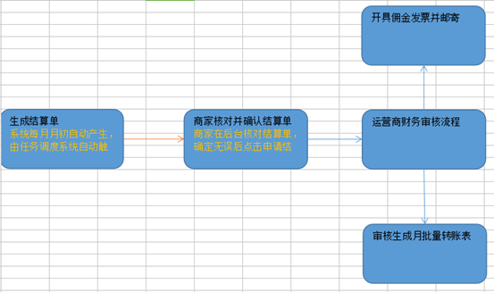


# 21 品优购电商系统部署-集群解决方案

## 21.1 集群

​	集群是一种计算机系统，它通过一组松散集成的计算机软件和/或硬件连接起来高度紧密地协作完成计算工作。在某种意义上，他们可以被看作是一台计算机。集群系统中的单个计算机通常称为节点，通常通过局域网连接，但也有其它的可能连接方式。**集群计算机通常用来改进单个计算机的计算速度和/或可靠性**。一般情况下集群计算机比单个计算机，比如工作站或超级计算机性能价格比要高得多。

------

集群的**特点**：

- **可扩展性**：集群的性能不限制于单一的服务实体，新的服务实体可以动态的添加到集群，从而增强集群的性能。
- **高可用性**：集群当其中一个节点发生故障时，这台节点上面所运行的应用程序将在另一台节点被自动接管，消除单点故障对于增强数据可用性、可达性和可靠性是非常重要的。

------

集群的**两大能力**：

* **负载均衡**：负载均衡把任务比较均匀的分布到集群环境下的计算和网络资源，以提高数据吞吐量。
* **错误恢复**：如果集群中的某一台服务器由于故障或者维护需要无法使用，资源和应用程序将转移到可用的集群节点上。这种由于某个节点的资源不能工作，**另一个可用节点中的资源能够透明的接管并继续完成任务的过程**，叫做错误恢复。

负载均衡和错误恢复要求各服务实体中有执行同一任务的资源存在，而且对于同一任务的各个资源来说，执行任务所需的信息视图必须是相同的。

------

**集群与分布式的区别：**

* 相同点：分布式和集群都是需要有**很多节点服务器通过网络协同工作完成整体的任务目标**。
* 不同点：**分布式**是指将**业务系统进行拆分**，即分布式的每一个节点都是实现不同的功能。而**集群每个节点做的是同一件事情**。


## 21.2 Zookeeper 集群

### 21.2.1 Zookeeper 集群简介

为什么搭建Zookeeper集群？

* 大部分分布式应用需要一个主控、协调器或者控制器来管理物理分布的子进程。目前，大多数都要开发私有的协调程序，缺乏一个通用机制，协调程序的反复编写浪费，且难以形成通用、伸缩性好的协调器，zookeeper提供通用的分布式锁服务，用以协调分布式应用。所以说zookeeper是分布式应用的协作服务。

* zookeeper作为注册中心，服务器和客户端都要访问，如果有大量的并发肯定会有等待。所以可通过zookeeper集群解决。

------

**Leader选举**

Zookeeper的启动过程中leader选举是非常重要而且最复杂的一个环节。那么什么是leader选举呢？zookeeper为什么需要leader选举呢？zookeeper的leader选举的过程又是什么样子的？

首先我们来看看什么是leader选举。其实这个很好理解，leader选举就像总统选举一样，每人一票，获得多数票的人就当选为总统了。在zookeeper集群中也是一样，每个节点都会投票，如果某个节点获得**超过半数以上的节点的投票**，则该节点就是leader节点了。

> 以一个简单的例子来说明整个选举的过程：
> 	假设有**五台服务器组成的zookeeper集群,**它们的id从1-5,同时它们都是最新启动的,也就是没有历史数据,在存放数据量这一点上,都是一样的.假设这些服务器依序启动,来看看会发生什么 。
> 	1) 服务器1启动,此时只有它一台服务器启动了,它发出去的报没有任何响应,所以它的选举状态一直是LOOKING状态  
> 	2) 服务器2启动,它与最开始启动的服务器1进行通信,互相交换自己的选举结果,由于两者都没有历史数据,所以id值较大的服务器2胜出,但是由于没有达到超过半数以上的服务器都同意选举它(这个例子中的半数以上是3),所以服务器1,2还是继续保持LOOKING状态.  
> 	3) 服务器**3**启动,根据前面的理论分析,服务器3成为服务器1,2,3中的老大,而与上面不同的是,此时有三台服务器选举了它,所以它成为了这次选举的**leader**.  
> 	4) 服务器4启动,根据前面的分析,理论上服务器4应该是服务器1,2,3,4中最大的,但是由于前面已经有半数以上的服务器选举了服务器3,所以它只能接收当小弟的命了.  
> 	5) 服务器5启动,同4一样,当小弟


### 21.2.2 搭建Zookeeper集群

> 真实的集群是需要部署在不同的服务器上的，但是在我们测试时同时启动十几个虚拟机内存会吃不消，所以我们通常会搭建**伪集群**，也就是把所有的服务都搭建在一台虚拟机上，用端口进行区分。

我们这里要求搭建一个三个节点的Zookeeper集群（伪集群）

------

**准备工作**：重新部署一台虚拟机作为我们搭建集群的测试服务器。

1. 安装JDK  【此步骤省略】。

2. Zookeeper压缩包上传到服务器

3. 将Zookeeper解压``tar zxvf zookeeper.tar.gz`` ，创建`data`目录，将`conf/zoo_sample.cfg`文件改名为`zoo.cfg`

4. 建立`/usr/local/zookeeper-cluster`目录，将解压后的Zookeeper复制到以下三个目录`zookeeper-1`、`-2`、`-3`

   如：`cp -r zookeeper-3.4.6 /usr/local/zookeeper-cluster/zookeeper-1`

5. 在`zoo.cfg`配置每一个Zookeeper 的**dataDir**和 **clientPort** 分别为2181  2182  2183

   如：`dataDir=/usr/local/zookeeper-cluster/zookeeper-1/data` `clientPort=2181`

**配置集群**

1. 在每个zookeeper的 data 目录下创建一个 myid 文件，内容分别是1、2、3 。这个文件就是记录每个服务器的ID

   如果你要创建的文本文件内容比较简单，我们可以通过echo 命令快速创建文件：`echo 内容 >文件名`

   如：`echo 1 > myid`，可以通过`cat myid`来浏览

2. 在每一个zookeeper 的 `zoo.cfg`配置客户端访问端口（clientPort，上面已配置过）和**集群服务器IP列表**

   `server.1=192.168.25.140:2881:3881`

   `server.2=192.168.25.140:2882:3882`

   `server.3=192.168.25.140:2883:3883`

   `server.服务器ID=服务器IP地址：服务器之间通信端口：服务器之间投票选举端口`

   > 可以使用EditPlus远程修改服务器的文本文件的内容，更加便捷
   >
   > 1. 在菜单选择FTP Settings
   > 2. 点击ADD按钮
   > 3. 输入服务器信息
   > 4. 点击高级选项按钮
   > 5. 选择SFTP端口22，OK  。完成配置

**启动集群**

分别启动每个实例。开始启动1时状态为没有运行；当启动完2时，2状态为leader，1随之也启动成功并且状态为follower；启动3则直接运行，状态为follower

**模拟集群异常**

- 3个节点的集群，1台从服务器挂掉，集群正常
- 3个节点的集群，2个从服务器都挂掉，主服务器也无法运行。因为可运行的机器没有超过集群总数量的半数
- 我们再次把1号服务器启动起来，发现2号服务器又开始正常工作了。而且依然是领导者
- 当集群中的主服务器挂了，集群中的其他服务器会自动进行选举状态，然后产生新得leader
- 当领导者产生后，再次有新服务器加入集群，不会影响到现任领导者


### 21.2.3 Dubbox连接zookeeper集群

由于在Maven Profile中配置了注册中心，所以只需要在`pinyougou-common`工程修改`dubbox_pro.properties`

```properties
env.address=192.168.25.130:2181,192.168.25.130:2182,192.168.25.130:2183
```


## 21.3 SolrCloud

### 21.3.1 SolrCloud简介

SolrCloud(solr 云)是 Solr 提供的分布式搜索方案，当你需要大规模，容错，分布式索引和检索能力时使用 SolrCloud。当一个系统的索引数据量少的时候是不需要使用 SolrCloud的，当索引量很大，搜索请求并发很高，这时需要使用 SolrCloud 来满足这些需求。

SolrCloud 是**基于 Solr 和Zookeeper**的分布式搜索方案，它的**主要思想是使用 Zookeeper作为集群的配置信息中心**。

它有几个特色功能：

1）集中式的配置信息

2）自动容错

3）近实时搜索

4）查询时自动负载均衡

------

SolrCloud系统架构

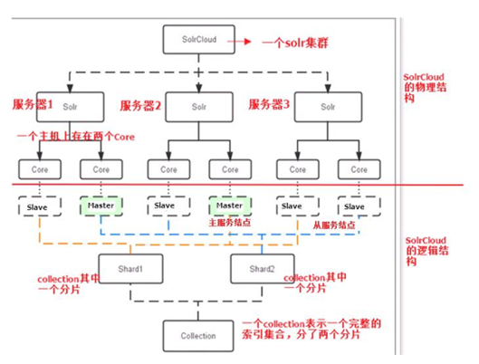

【1】物理结构

三个 Solr 实例（ 每个实例包括两个 Core），组成一个 SolrCloud。

【2】逻辑结构

索引集合包括两个 Shard（shard1 和 shard2），shard1 和 shard2 分别由三个 Core 组成，其中一个 Leader 两个 Replication，Leader 是由 zookeeper 选举产生，zookeeper 控制**每个shard上三个 Core 的索引数据一致**，解决**高可用**问题。用户发起**索引请求分别从 shard1 和 shard2 上获取**，解决**高并发**问题。

* Collection

  Collection 在 SolrCloud 集群中是一个**逻辑意义上的完整的索引结构**。它常常被划分为一个或多个 Shard（分片），它们使用相同的配置信息。

  比如：针对商品信息搜索可以创建一个 collection。collection=shard1+shard2+....+shardX

* Core

  每个 Core 是 Solr 中一个独立运行单位，提供 索引和搜索服务。一个 shard 需要由一个Core 或多个 Core 组成。由于 collection 由多个 shard 组成所以 collection 一般由多个 core 组成。

* Master 或 Slave

  Master 是 master-slave 结构中的主结点（通常说主服务器），Slave 是 master-slave 结构中的从结点（通常说从服务器或备服务器）。同一个 Shard 下 master 和 slave 存储的数据是一致的，这是为了达到高可用目的。

* Shard

  Collection 的逻辑**分片**。每个 Shard 被化成一个或者多个 replication，通过选举确定哪个是 Leader。

### 21.3.2 搭建SolrCloud

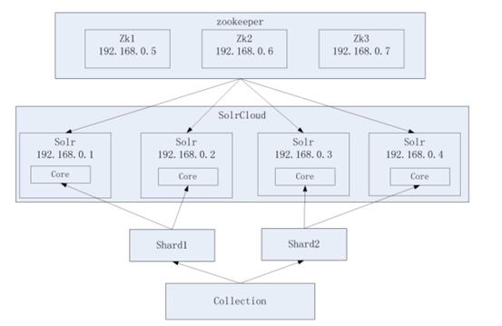

**搭建要求**

Zookeeper 作为集群的管理工具

1、集群管理：容错、负载均衡。

2、配置文件的集中管理

3、集群的入口

需要实现 zookeeper 高可用，需要搭建zookeeper集群。建议是奇数节点。需要三个 zookeeper 服务器。

搭建 solr 集群需要 7 台服务器（搭建伪分布式，建议虚拟机的内存 1G 以上）：

需要三个 zookeeper 节点

需要四个 tomcat 节点。

------

**准备工作**

1. 搭建Zookeeper集群（我们在上一小节已经完成）

2. 将已经部署完solr 的tomcat的上传到linux

   `scp -r C:\Develop\Tomcat\apache-tomcat-solr\ root@192.168.25.130:`即可传递到`/root/`目录下，也可带上目录

3. 在linux中创建文件夹 `/usr/local/solr-cloud`，创建4个tomcat实例，如：

   `mkdir /usr/local/solr-cloud`

   `cp -r apache-tomcat-solr /usr/local/solr-cloud/tomcat-1`

4. 将本地的`solrhome`上传到linux，同上

5. 在linux中创建文件夹 /usr/local/solrhomes，将solrhome复制4份，如：

   `mkdir /usr/local/solrhomes`

   `cp -r solrhome /usr/local/solrhomes/solrhome-1`

6. 修改每个solr的 `web.xml` 文件, 关联solrhome

   ```xml
   <env-entry>
       <env-entry-name>solr/home</env-entry-name>
       <env-entry-value>/usr/local/solrhomes/solrhome-1</env-entry-value>
       <env-entry-type>java.lang.String</env-entry-type>
   </env-entry>
   ```

7. 修改每个tomcat的原运行端口8085 8080 8009（虚拟集群所以要改端口来区分），分别为

   ```
   8185  8180  8109 
   8285  8280  8209 
   8385  8380  8309 
   8485  8480  8409
   ```

   > 8005端口是用来关闭TOMCAT服务的端口。　　
   >
   > 8080端口，负责建立HTTP连接。在通过浏览器访问Tomcat服务器的Web应用时，使用的就是这个连接器。
   >
   > 8009端口，负责和其他的HTTP服务器建立连接。在把Tomcat与其他HTTP服务器集成时，就需要用到这个连接器。

------

**配置集群**

1. 修改每个 tomcat实例 `bin` 目录下的`catalina.sh`文件，把此配置添加到`catalina.sh`中( 第288行 )

   ```sh
   # Make the umask available when using the org.apache.catalina.security.SecurityListener
   JAVA_OPTS="-DzkHost=192.168.25.130:2181,192.168.25.130:2182,192.168.25.130:2183"
   ```

   `JAVA_OPTS`，顾名思义是用来设置JVM相关运行参数的变量。此配置用于在tomcat启动时**找到 zookeeper集群**

2. 配置solrCloud相关的配置。每个solrhome下都有一个 solr.xml，把其中的ip及端口号配置好（对应tomcatIP和端口），如

   ```xml
   <str name="host">192.168.25.130</str>
   <int name="hostPort">8180</int><!--其他的对应8280 8380 8480，实际中端口都不用改！-->
   ```

3. 让 zookeeper 统一管理配置文件。需要把 `solrhome`下`collection1/conf`目录上传到`zookeeper`。上传任意 solrhome 中的配置文件即可

   我们需要使用solr给我们提供的工具上传配置文件：`solr-4.10.3/example/scripts/cloud-scripts/zkcli.sh`

   将`solr-4.10.3`压缩包上传到linux，解压，然后进入`solr-4.10.3/example/scripts/cloud-scripts`目录 ，执行命令

   `./zkcli.sh -zkhost 192.168.25.130:2181,192.168.25.130:2182,192.168.25.130:2183 -cmd upconfig-confdir /usr/local/solrhomes/solrhome-1/collection1/conf -confname myconf`

   * `-zkhost`：指定zookeeper地址列表

   * `-cmd`：指定命令。upconfig 为上传配置的命令

   * `-confdir`: 配置文件所在目录

   * `-confname`: 配置名称

------

**启动集群**

1. 启动每个 tomcat 实例。要保证 zookeeper 集群是启动状态

   > 如果你想让某个文件夹下都可以执行，使用以下命令实现`chmod -R 777 solr-cloud`

2. 访问集群。地址栏[输入](http://192.168.25.140:8180/solr)，可以看到Solr集群版的界面

   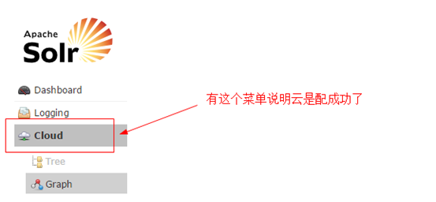

   下图表示的是，一个主节点 ，三个从节点

   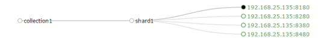


### 21.3.3 SpringDataSolr连接SolrCloud

在SolrJ中提供一个叫做CloudSolrServer的类，它是SolrServer的子类，用于连接solrCloud 

它的构造参数就是zookeeper的地址列表，另外它要求要指定defaultCollection属性（默认的 collection名称）

我们现在修改springDataSolrDemo工程的配置文件 ，把原来的solr-server注销（也可以不注释，利用maven profile，替换为CloudSolrServer .指定构造参数为地址列表，设置默认 collection名称

```xml
<solr:solr-server id="solrServer_dev" url="http://192.168.25.129:8080/solr" />

<bean id="solrServer_pro" class="org.apache.solr.client.solrj.impl.CloudSolrServer">
    <constructor-arg value="192.168.25.130:2181,192.168.25.130:2182,192.168.25.130:2183" />
    <property name="defaultCollection" value="collection1"></property>
</bean>

<!-- solr模板，使用solr模板可对索引库进行CRUD的操作 -->
<bean id="solrTemplate" class="org.springframework.data.solr.core.SolrTemplate">
    <constructor-arg ref="solrServer_${env}" />
</bean>
```

编辑maven profile即可（仅不用设置filters）


### 21.3.4 分片配置

（1）创建新的 Collection 进行分片处理。在浏览器输入以下地址，可以按照我们的要求创建新的Collection`http://192.168.25.130:8180/solr/admin/collections?action=CREATE&name=*collection2*&numShards=2&replicationFactor=2`。任意服务器端口都行

name:将被创建的集合的名字
numShards:集合创建时需要创建逻辑碎片的个数
replicationFactor:分片的副本数。

看到success为成功

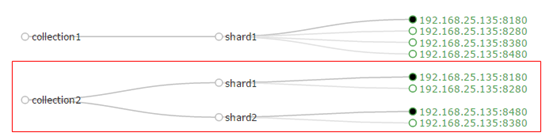

（2）删除不用的 Collection。执行以下命令`http://192.168.25.130:8480/solr/admin/collections?action=DELETE&name=collection1`。看到success为成功


### 21.3.5 模拟集群异常测试

一下只是可能情况， 具体操作时查看solr页面

（1）停止第一个tomcat节点，看查询是否能正常工作  -- 能！因为还有从节点

（2）停止第三个tomcat节点，看看查询能够正常工作  -- 不能，因为整个一片数据全没了，无法正常工作。

（3）恢复第三个tomcat节点，看看能否正常工作。恢复时间会比较长，大概2分半到3分钟之间。请耐心等待。


## 21.4 Redis Cluster

### 21.4.1 Redis-Cluster简介

为何要搭建Redis集群。Redis是在内存中保存数据的，而我们的电脑一般内存都不大，这也就意味着Redis不适合存储大数据，适合存储大数据的是Hadoop生态系统的Hbase或者是MogoDB。Redis更适合处理高并发，一台设备的**存储能力**是很有限的，但是多台设备协同合作，就可以让内存增大很多倍，这就需要用到集群。

Redis集群搭建的方式有多种，例如使用客户端分片、Twemproxy、Codis等，但从redis 3.0之后版本支持redis-cluster集群，它是Redis官方提出的解决方案，Redis-Cluster采用无中心结构，每个节点保存数据和整个集群状态,每个节点都和其他所有节点连接。其redis-cluster架构图如下：

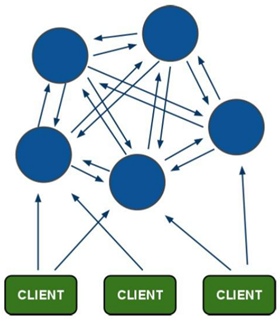

客户端与 redis 节点直连,不需要中间 proxy 层.客户端不需要连接集群所有节点连接集群中任何一个可用节点即可。

所有的 redis 节点彼此互联(PING-PONG 机制),内部使用二进制协议优化传输速度和带宽.

------

**分布存储机制-槽**

（1）redis-cluster 把所有的物理节点映射到[0-16383]slot 上,cluster 负责维护

node<->slot<->value

（2）Redis 集群中内置了 16384 个哈希槽，当需要在 Redis 集群中放置一个 key-value 时，redis 先对 key 使用 crc16 算法算出一个结果，然后把结果对 16384 求余数，这样每个key 都会对应一个编号在 0-16383 之间的哈希槽，redis 会根据节点数量大致均等的将哈希槽映射到不同的节点。

​    例如三个节点：槽分布的值如下：

SERVER1:  0-5460

SERVER2:  5461-10922

SERVER3:  10923-16383

------

**容错机制-投票**

（1）选举过程是集群中所有master参与,如果半数以上master节点与故障节点通信超过(cluster-node-timeout),认为该节点故障，自动触发故障转移操作.  故障节点对应的从节点自动升级为主节点

（2）什么时候整个集群不可用(cluster_state:fail)? 

如果集群任意master挂掉,且当前master没有slave.集群进入fail状态,也可以理解成集群的slot映射[0-16383]不完成时进入fail状态. 

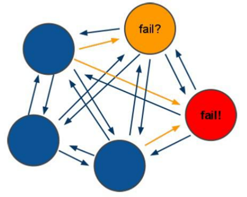


### 21.4.2 搭建Redis-Cluster

需要 6 台 redis 服务器。搭建伪集群。需要 6 个 redis 实例。需要运行在不同的端口 7001-7006。

（1）安装gcc 【此步省略】

Redis 是 c 语言开发的。安装 redis 需要 c 语言的编译环境。如果没有 gcc 需要在线安装。

`yum install gcc-c++   `

（2）使用yum命令安装 ruby  （我们需要使用ruby脚本来实现集群搭建）【此步省略】

`yum install ruby   yum install rubygems  ` 

>    **-----** **知识点小贴士** **-----**   Ruby，一种简单快捷的[面向对象](https://baike.baidu.com/item/%E9%9D%A2%E5%90%91%E5%AF%B9%E8%B1%A1)（[面向对象程序设计](https://baike.baidu.com/item/%E9%9D%A2%E5%90%91%E5%AF%B9%E8%B1%A1%E7%A8%8B%E5%BA%8F%E8%AE%BE%E8%AE%A1)）[脚本语言](https://baike.baidu.com/item/%E8%84%9A%E6%9C%AC%E8%AF%AD%E8%A8%80)，在20世纪90年代由日本人松本行弘([Yukihiro   Matsumoto](https://baike.baidu.com/item/Yukihiro%20Matsumoto))开发，遵守[GPL](https://baike.baidu.com/item/GPL)协议和Ruby License。它的灵感与特性来自于 [Perl](https://baike.baidu.com/item/Perl)、[Smalltalk](https://baike.baidu.com/item/Smalltalk)、[Eiffel](https://baike.baidu.com/item/Eiffel)、[Ada](https://baike.baidu.com/item/Ada/5606819)以及 [Lisp](https://baike.baidu.com/item/Lisp/22083) 语言。由 Ruby 语言本身还发展出了JRuby（[Java平台](https://baike.baidu.com/item/Java%E5%B9%B3%E5%8F%B0)）、IronRuby（[.NET](https://baike.baidu.com/item/.NET)平台）等其他平台的 Ruby 语言[替代品](https://baike.baidu.com/item/%E6%9B%BF%E4%BB%A3%E5%93%81)。Ruby的作者于1993年2月24日开始编写Ruby，直至1995年12月才正式[公开发布](https://baike.baidu.com/item/%E5%85%AC%E5%BC%80%E5%8F%91%E5%B8%83)于fj（[新闻组](https://baike.baidu.com/item/%E6%96%B0%E9%97%BB%E7%BB%84)）。因为Perl发音与6月诞生石pearl（[珍珠](https://baike.baidu.com/item/%E7%8F%8D%E7%8F%A0/33579)）相同，因此Ruby以7月诞生石ruby（[红宝石](https://baike.baidu.com/item/%E7%BA%A2%E5%AE%9D%E7%9F%B3/24242)）命名   *RubyGems*简称gems，是一个用于对 Ruby组件进行打包的 Ruby 打包系统   

（3）将redis源码包上传到 linux 系统  ，解压redis源码包

（4）编译redis源码  ，进入redis源码文件夹

   `make   `

看到以下输出结果，表示编译成功


（5）创建目录/usr/local/redis-cluster目录，  安装6个redis实例，分别安装在以下目录

`/usr/local/redis-cluster/redis-1`

以第一个redis实例为例，命令如下

`make install PREFIX=/usr/local/redis-cluster/redis-1   `


出现此提示表示成功，按此方法安装其余5个redis实例

（6）复制配置文件  将 /redis-3.0.0/redis.conf 复制到redis下的bin目录下

`cp redis.conf /usr/local/redis-cluster/redis-1/bin`

------

**配置集群**

（1）修改每个redis节点的配置文件`redis.conf`，修改运行端口为7001 （7002 7003 .....），将`cluster-enabled yes` 前的注释去掉(632行)

（2）启动每个redis实例，如：

`cd /usr/local/redis-cluster/redis-1/bin/`

`./redis-server redis.conf`

（3）上传`redis-3.0.0.gem` ，安装 ruby用于搭建redis集群的脚本。

`gem install redis-3.0.0.gem`

（4）使用 ruby 脚本搭建集群。

进入redis源码目录中的src目录  执行下面的命令

`./redis-trib.rb create --replicas 1 192.168.25.130:7001 192.168.25.130:7002 192.168.25.130:7003 192.168.25.130:7004 192.168.25.130:7005 192.168.25.130:7006`

会显示连接信息、自动分配等信息


### 21.4.3 连接Redis-Cluster

#### 1 客户端工具连接

Redis-cli 连接集群：

`redis-cli -p 主机ip -p 端口（集群中任意端口） -c`。`-c`：代表连接的是 redis 集群

测试值的存取:

（1）从本地连接到集群redis  使用7001端口 加 -c 参数

（2）存入name值为abc ，系统提示此值被存入到了7002端口所在的redis （槽是5798）

（3）提取name的值，可以提取。

（4）退出（quit）

（5）再次以7001端口进入 ，不带-c

（6）查询name值，无法获取，因为值在7002端口的redis上

（7）我们以7002端口进入，获取name值发现是可以获取的,而以其它端口进入均不能获取


#### 2 SpringDataRedis连接Redis集群

修改品优购工程在`pinyougou-common`工程添加spring配置文件`applicationContext-redis-cluster.xml`

```xml
<?xml version="1.0" encoding="UTF-8"?> 
<beans xmlns="http://www.springframework.org/schema/beans" 
       xmlns:xsi="http://www.w3.org/2001/XMLSchema-instance" xmlns:p="http://www.springframework.org/schema/p" 
       xmlns:context="http://www.springframework.org/schema/context" 
       xsi:schemaLocation="http://www.springframework.org/schema/beans   
                           http://www.springframework.org/schema/beans/spring-beans.xsd   
                           http://www.springframework.org/schema/context   
                           http://www.springframework.org/schema/context/spring-context.xsd">  
    <!-- 加载配置属性文件 -->  
    <context:property-placeholder ignore-unresolvable="true" location="classpath:properties/redis-cluster-config.properties" />  
    <bean id="redis-clusterConfiguration" class="org.springframework.data.redis.connection.redis-clusterConfiguration">  
        <property name="maxRedirects" value="${redis.maxRedirects}"></property>  
        <property name="clusterNodes">  
            <set>  
                <bean class="org.springframework.data.redis.connection.redis-clusterNode">  
                    <constructor-arg name="host" value="${redis.host1}"></constructor-arg>  
                    <constructor-arg name="port" value="${redis.port1}"></constructor-arg>  
                </bean>  
                <bean class="org.springframework.data.redis.connection.redis-clusterNode">  
                    <constructor-arg name="host" value="${redis.host2}"></constructor-arg>  
                    <constructor-arg name="port" value="${redis.port2}"></constructor-arg>  
                </bean>  
                <bean class="org.springframework.data.redis.connection.redis-clusterNode">  
                    <constructor-arg name="host" value="${redis.host3}"></constructor-arg>  
                    <constructor-arg name="port" value="${redis.port3}"></constructor-arg>  
                </bean>  
                <bean class="org.springframework.data.redis.connection.redis-clusterNode">  
                    <constructor-arg name="host" value="${redis.host4}"></constructor-arg>  
                    <constructor-arg name="port" value="${redis.port4}"></constructor-arg>  
                </bean>  
                <bean class="org.springframework.data.redis.connection.redis-clusterNode">  
                    <constructor-arg name="host" value="${redis.host5}"></constructor-arg>  
                    <constructor-arg name="port" value="${redis.port5}"></constructor-arg>  
                </bean>  
                <bean class="org.springframework.data.redis.connection.redis-clusterNode">  
                    <constructor-arg name="host" value="${redis.host6}"></constructor-arg>  
                    <constructor-arg name="port" value="${redis.port6}"></constructor-arg>  
                </bean>  
            </set>  
        </property>  
    </bean>  
    <bean id="jedisPoolConfig"   class="redis.clients.jedis.JedisPoolConfig">  
        <property name="maxIdle" value="${redis.maxIdle}" />   
        <property name="maxTotal" value="${redis.maxTotal}" />   
    </bean>  
    <!--若要开发和生产共存，可以指定工厂类id值用_dev和_pro连接，在redisTemplate注入时用${}来编写即可（Maven profile）-->
    <bean id="jeidsConnectionFactory" class="org.springframework.data.redis.connection.jedis.JedisConnectionFactory"  >  
        <constructor-arg ref="redis-clusterConfiguration" />  
        <constructor-arg ref="jedisPoolConfig" />  
    </bean>   
    
    <bean id="redisTemplate" class="org.springframework.data.redis.core.RedisTemplate">  
        <property name="connectionFactory" ref="jeidsConnectionFactory" />  
    </bean>  
</beans>
```

添加属性文件`redis-cluster-config.properties`

```properties
#cluster configuration
redis.host1=192.168.25.130
redis.port1=7001

redis.host2=192.168.25.130
redis.port2=7002

redis.host3=192.168.25.130
redis.port3=7003

redis.host4=192.168.25.130
redis.port4=7004

redis.host5=192.168.25.130
redis.port5=7005

redis.host6=192.168.25.130
redis.port6=7006

redis.maxRedirects=3
redis.maxIdle=100
redis.maxTotal=600
```


### 21.4.4 模拟集群异常测试

关闭节点命令

   ./redis-cli -p 端口 shutdown    

（1）测试关闭7001和7004，看看会发生什么。

（2）测试关闭7001、7002、7003会发生什么。


# 22 品优购电商系统部署

## 22.1 MyCat

> 如今随着互联网的发展，数据的量级也是撑指数的增长，从GB到TB到PB。对数据的各种操作也是愈加的困难，**传统的关系性数据库**已经**无法满足快速查询与插入数据**的需求。这个时候NoSQL的出现暂时解决了这一危机。它通过**降低数据的安全**性，**减少对事务的支持**，**减少对复杂查询的支持**，来获取性能上的提升。
>
> 但是，在有些场合NoSQL一些折衷是无法满足使用场景的，就比如有些使用场景是绝对要有事务与安全指标的。这个时候NoSQL肯定是无法满足的，所以还是需要使用关系性数据库。如果使用关系型数据库**解决海量存储**的问题呢？此时就需要做数据库集群，为了提高查询性能将一个数据库的数据分散到不同的数据库中存储。

Mycat 背后是阿里曾经开源的知名产品——Cobar。Cobar 的核心功能和优势是 MySQL 数据库分片，此产品曾经广为流传。Cobar的思路和实现路径的确不错，基于 Java 开发的，实现了 **MySQL 公开的二进制传输协议**，巧妙地将自己**伪装**成一个 MySQL Server，目前市面上绝大多数 MySQL 客户端工具和应用都能兼容。比自己实现一个新的数据库协议要明智的多，因为生态环境在哪里摆着。 

Mycat 是基于 cobar 演变而来，对 cobar 的代码进行了彻底的重构，使用 NIO 重构了网络模块，并且优化了 Buffer 内核，增强了聚合，Join 等基本特性，同时兼容绝大多数数据库成为通用的数据库中间件。简单的说，MyCAT就是：一个新颖的**数据库中间件产品**支持**mysql集群**，或者mariadb cluster，提供高可用性数据分片集群。你可以像使用mysql一样使用mycat。对于开发人员来说根本感觉不到mycat的存在。

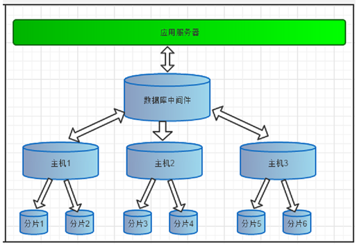

### 22.1.1 MyCat下载及安装

> Linux下（CentOS）

#### 1、MySQL安装与启动

JDK：要求jdk必须是1.7及以上版本

MySQL：推荐mysql是5.5以上版本

MySQL安装与启动步骤如下：（步骤1-5省略）

（1）将MySQL的服务端和客户端安装包（RPM）上传到服务器

（2）查询之前是否安装过MySQL：`rpm -qa|grep -i mysql`

（3）卸载旧版本MySQL：`rpm -e --nodeps  软件名称`

（4）安装服务端：`rpm -ivh MySQL-server-5.5.49-1.linux2.6.i386.rpm`

（5）安装客户端：`rpm -ivh MySQL-client-5.5.49-1.linux2.6.i386.rpm`

（6）启动MySQL服务：`service mysql start`

（7）登录MySQL：`mysql -u root`

（8）设置远程登录权限：`GRANT ALL PRIVILEGES ON *.* TO 'root'@'%'IDENTIFIED BY '123456' WITH GRANT OPTION;   `

在本地连接远程MySQL进行测试


#### 2、MyCat安装及启动

MyCat的[官方网站](http://www.mycat.org.cn/)，[下载地址](https://github.com/MyCATApache/Mycat-download)

   GRANT ALL PRIVILEGES ON *.* TO   'root'@'%'IDENTIFIED BY '123456'  WITH   GRANT OPTION;   

（2）将压缩包解压缩。建议将mycat放到/usr/local/mycat目录下

​	`tar -xzvf Mycat-server-1.4-release-20151019230038-linux.tar.gz`

​	`mv mycat /usr/local`

（3）进入mycat目录的bin目录，启动mycat

​	`./mycat start`

（4）停止

​	`./mycat stop`

Mycat支持的命令{ console | start | stop | restart | status | dump } 

Mycat的默认端口号为：==**8066**==


### 22.1.2 MyCat分片-海量数据存储解决方案

#### 1、什么是分片

​	简单来说，就是指通过某种特定的条件，将我们**存放在同一个数据库中的数据分散存放到多个数据库**（主机）上面，以达到分散单台设备负载的效果。 数据的切分（Sharding）根据其切分规则的类型，可以分为两种切分模式。

  （1）一种按照**不同的表（或者Schema）**来切分到不同的数据库（主机）之上，这种切分可以称之为数据的垂直（纵向）切分

  （2）另外一种则是根据表中的数据的**逻辑关系**，将同一个表中的数据按照某种条件拆分到多台数据库（主机）上面，这种切分称之为数据的水平（横向）切分。

​	**MyCat分片策略**：

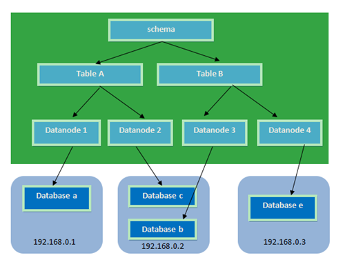

#### 2、分片相关的概念

**逻辑库(schema)** **：**

前面一节讲了数据库中间件，通常对实际应用来说，并不需要知道中间件的存在，业务开发人员只需要知道数据库的概念，所以数据库中间件可以被看做是一个或多个数据库集群构成的逻辑库。

**逻辑表（table**）：

既然有逻辑库，那么就会有逻辑表，分布式数据库中，对应用来说，读写数据的表就是逻辑表。逻辑表，可以是数据切分后，分布在一个或多个分片库中，也可以不做数据切分，不分片，只有一个表构成。

分片表：是指那些原有的很大数据的表，需要切分到多个数据库的表，这样，每个分片都有一部分数据，所有分片构成了完整的数据。 总而言之就是需要进行分片的表。

非分片表：一个数据库中并不是所有的表都很大，某些表是可以不用进行切分的，非分片是相对分片表来说的，就是那些不需要进行数据切分的表。 

**分片节点(dataNode)**

数据切分后，一个大表被分到不同的分片数据库上面，每个表分片所在的数据库就是分片节点（dataNode）。

**节点主机(dataHost)** 

数据切分后，每个分片节点（dataNode）不一定都会独占一台机器，同一机器上面可以有多个分片数据库，这样一个或多个分片节点（dataNode）所在的机器就是节点主机（dataHost）,为了规避单节点主机并发数限制，尽量将读写压力高的分片节点（dataNode）均衡的放在不同的节点主机（dataHost）。

**分片规则(rule)** 

前面讲了数据切分，一个大表被分成若干个分片表，就需要一定的规则，这样按照某种业务规则把数据分到某个分片的规则就是分片规则，数据切分选择合适的分片规则非常重要，将极大的避免后续数据处理的难度。


#### 3、MyCat分片配置

（1）配置`schema.xml`

`schema.xml`作为MyCat中重要的配置文件之一，管理着MyCat的逻辑库、逻辑表以及对应的分片规则、DataNode以及DataSource。弄懂这些配置，是正确使用MyCat的前提。这里就一层层对该文件进行解析。

* schema 标签用于定义MyCat实例中的逻辑库

* Table 标签定义了MyCat中的逻辑表  rule用于指定分片规则，auto-sharding-long的分片规则是按ID值的范围进行分片 1-5000000 为第1片  5000001-10000000 为第2片....  具体设置我们会在第5小节中讲解。

* dataNode 标签定义了MyCat中的数据节点，也就是我们通常说所的数据分片。

* dataHost标签在mycat逻辑库中也是作为最底层的标签存在，直接定义了具体的数据库实例、读写分离配置和心跳语句。

**在服务器上创建3个数据库，分别是db1、db2、db3（真实情况应该分别在三台主机，dataHost配置多份！！！）**

修改`schema.xml`如下：

```xml
<?xml version="1.0"?>
<!DOCTYPE mycat:schema SYSTEM "schema.dtd">
<mycat:schema xmlns:mycat="http://org.opencloudb/">
    
    <schema name="PINYOUGOUDB" checkSQLschema="false" sqlMaxLimit="100"> <!--name为逻辑数据库名，连接时就连这个！-->
        <table name="tb_test" dataNode="dn1,dn2,dn3" rule="auto-sharding-long" />
    </schema>
    
    <dataNode name="dn1" dataHost="localhost1" database="db1" /> <!--database为物理数据库，名称对应-->
    <dataNode name="dn2" dataHost="localhost1" database="db2" />
    <dataNode name="dn3" dataHost="localhost1" database="db3" />
    
    <dataHost name="localhost1" maxCon="1000" minCon="10" balance="0"
              writeType="0" dbType="mysql" dbDriver="native" switchType="1"  slaveThreshold="100">
        <heartbeat>select user()</heartbeat>
        <writeHost host="hostM1" url="192.168.25.130:3306" user="root" password="123456"></writeHost>
        <!--writeHost写节点代表主节点，只能有1个，readHost读节点代表从节点，可以有多个-->
    </dataHost>	
</mycat:schema>
```

（2）配置 `server.xml`

`server.xml`几乎保存了所有mycat需要的系统配置信息。最常用的是在此配置用户名、密码及权限。在system中添加UTF-8字符集设置，否则存储中文会出现问号

```xml
<property name="charset">utf8</property>
```

修改user的设置 ,  我们这里为 PINYOUGOUDB设置了两个用户

```xml
<user name="test">
    <property name="password">test</property>
    <property name="schemas">PINYOUGOUDB</property>
</user>
<user name="root">
    <property name="password">123456</property>
    <property name="schemas">PINYOUGOUDB</property>
</user>
```


#### 4、MyCat分片测试

进入MyCat，执行下列语句创建一个表:

```sql
CREATE TABLE tb_test (
  id BIGINT(20) NOT NULL,
  title VARCHAR(100) NOT NULL ,
  PRIMARY KEY (id)
) ENGINE=INNODB DEFAULT CHARSET=utf8 
```

创建后你会发现，**MyCat会自动将你的表转换为大写**，这一点与Oracle有些类似。

我们再查看MySQL的3个库，发现表都自动创建好啦。好神奇。

接下来是插入表数据，注意，在MyCat写**INSERT**或**SELECT**语句时一定要写把**字段列表写出来**，否则会出现下列错误提示：

 `1064 partition table, insert must provide ColumnList`

我们试着插入一些数据：

```sql
INSERT INTO TB_TEST(ID,TITLE) VALUES(1,'goods1');
INSERT INTO TB_TEST(ID,TITLE) VALUES(2,'goods2');
INSERT INTO TB_TEST(ID,TITLE) VALUES(3,'goods3');
```

我们发现这些数据被写入第一个节点中了，那什么时候数据会写到第二个节点中呢？我们插入下面的数据就可以插入第二个节点了

```sql
INSERT INTO TB_TEST(ID,TITLE) VALUES(5000001,'goods5000001');
```

因为我们采用的分片规则是**每节点存储500万条数据**，所以当ID大于5000000则会存储到第二个节点上。

目前只设置了三个节点，如果数据大于1500万条，会怎么样呢？执行下列语句测试一下

```sql
INSERT INTO TB_TEST(ID,TITLE) VALUES(15000001,'goods15000001');
```

发现插入数据失败！！！必须在范围内


#### 5、MyCat分片规则

`rule.xml`用于定义分片规则  ，我们这里讲解两种最常见的分片规则

（1）按主键范围分片`auto-sharding-long`

在配置文件中我们找到（可以复制后修改自定义规则）

```xml
<tableRule name="auto-sharding-long"> <!--tableRule 是定义具体某个表或某一类表的分片规则名称-->
    <rule>
        <columns>id</columns> <!--columns用于定义分片的列-->
        <algorithm>rang-long</algorithm> <!--algorithm代表算法名称-->
    </rule>
</tableRule>
```

我们接着找`rang-long`的定义（可以复制后修改自定义规则）

```xml
<function name="rang-long"
          class="org.opencloudb.route.function.AutoPartitionByLong"> <!--Function用于定义算法-->
    <property name="mapFile">autopartition-long.txt</property> <!--mapFile 用于定义算法需要的数据-->
</function>
```

mapFile 用于定义算法需要的数据，我们打开`autopartition-long.txt`

```
# range start-end ,data node index
# K=1000,M=10000.
0-500M=0
500M-1000M=1
1000M-1500M=2
```

（2）一致性哈希`sharding-by-murmur-order`

当我们需要将数据平均分在几个分区中，需要使用一致性hash规则

我们找到function的name为murmur 的定义，将count属性改为3，因为我要将数据分成3片（可以复制后修改自定义规则）

```xml
<function name="murmur"
          class="org.opencloudb.route.function.PartitionByMurmurHash">
    <property name="seed">0</property><!-- 默认是0 -->
    <property name="count">3</property><!-- 要分片的数据库节点数量，必须指定，否则没法分片 -->
    <property name="virtualBucketTimes">160</property><!-- 一个实际的数据库节点被映射为这么多虚拟节点，默认是160倍，也就是虚拟节点数是物理节点数的160倍 -->
    <!-- <property name="weightMapFile">weightMapFile</property> 节点的权重，没有指定权重的节点默认是1。以properties文件的格式填写，以从0开始到count-1的整数值也就是节点索引为key，以节点权重值为值。所有权重值必须是正整数，否则以1代替 -->
    <!-- <property name="bucketMapPath">/etc/mycat/bucketMapPath</property> 
   用于测试时观察各物理节点与虚拟节点的分布情况，如果指定了这个属性，会把虚拟节点的murmur hash值与物理节点的映射按行输出到这个文件，没有默认值，如果不指定，就不会输出任何东西 -->
</function>
```

我们再配置文件中可以找到表规则定义（可以复制后修改自定义规则）

```xml
<tableRule name="sharding-by-murmur">
    <rule>
        <columns>id</columns>
        <algorithm>murmur</algorithm>
    </rule>
</tableRule>
```

但是这个规则指定的列是id ,如果我们的表主键不是id ,而是order_id ,那么我们应该重新定义一个tableRule：

```xml
<tableRule name="sharding-by-murmur-order">
    <rule>
        <columns>order_id</columns>
        <algorithm>murmur</algorithm>
    </rule>
</tableRule>
```

在`schema.xml`中配置逻辑表时，指定规则为`sharding-by-murmur-order`

```xml
<table name="tb_order" dataNode="dn1,dn2,dn3" rule="sharding-by-murmur-order" />
```

测试一下，创建品优购的订单表 ,并插入数据，测试分片效果。（根据算法分配，注意MyCat表都是大写的！！）


### 22.1.3 了解数据库读写分离

数据库读写分离对于大型系统或者访问量很高的互联网应用来说，是必不可少的一个重要功能。对于MySQL来说，标准的读写分离是主从模式，**一个写节点Master（可写可读）**后面跟着**多个读节点**，**读节点的数量取决于系统的压力**，通常是1-3个读节点配置

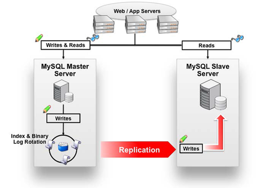

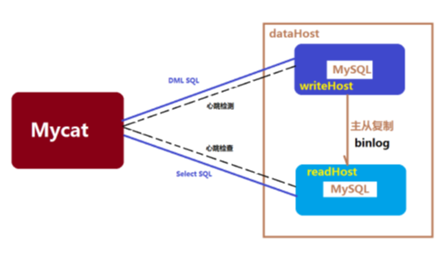

Mycat读写分离和自动切换机制（`schema.xml`配置），需要MySQL的主从复制机制配合。具体配置步骤参见配套的扩展文档。


## 22.2 Nginx

Nginx 是一款**高性能的 http 服务器/反向代理服务器**及**电子邮件（IMAP/POP3）代理服务器**。由俄罗斯的程序设计师伊戈尔·西索夫（Igor Sysoev）所开发，官方测试 nginx 能够支支撑 **5万并发**链接，并且 cpu、内存等资源消耗却非常低，运行非常稳定。

**Nginx** **应用场景**

* **HTTP服务器**。Nginx 是一个 HTTP服务可以独立提供 HTTP服务。可以做网页**静态**服务器。

* **虚拟主机**。可以实现在一台服务器虚拟出多个网站。例如个人网站使用的虚拟主机。

* **反向代理，负载均衡**。当网站的访问量达到一定程度后，单台服务器不能满足用户的请求时，需要用多台服务器集群可以使用nginx 做反向代理。并且多台服务器可以平均分担负载，不会因为某台服务器负载高宕机而某台服务器闲置的情况。


### 22.2.1 Nginx在Linux下的安装

重新准备一台虚拟机作为服务器。比如IP地址为192.168.25.131

**环境准备**

（1）需要安装 gcc 的环境【此步省略】

   yum install gcc-c++   

（2）第三方的开发包。【此步省略】

**PCRE**

PCRE(Perl Compatible Regular Expressions)是一个 Perl 库，包括 perl 兼容的正则表达式库。nginx 的 http 模块使用 pcre 来解析正则表达式，所以需要在 linux 上安装 pcre 库。

   yum install -y pcre pcre-devel   

注：pcre-devel 是使用 pcre 开发的一个二次开发库。nginx 也需要此库。

**zlib**

zlib 库提供了很多种压缩和解压缩的方式，nginx 使用 zlib 对 http 包的内容进行 gzip，所以需要在 linux 上安装 zlib 库。

   yum install -y zlib zlib-devel   

**OpenSSL**

OpenSSL 是一个强大的安全套接字层密码库，囊括主要的密码算法、常用的密钥和证书封装管理功能及 SSL 协议，并提供丰富的应用程序供测试或其它目的使用。nginx 不仅支持 http 协议，还支持 https（即在 ssl 协议上传输 http），所以需要在 linux安装 openssl 库。

   yum install -y openssl openssl-devel   

------

**Nginx下载**

[官方网站](http://nginx.org/)下载Nginx，课程中使用的版本是 1.8.0 版本

------

**Nginx安装**

第一步：把 nginx 的源码包`nginx-1.8.0.tar.gz`上传到 linux 系统

Alt+p  启动sftp，将nginx-1.8.0.tar.gz上传。shell也可以

第二步：解压缩

`tar zxvf nginx-1.8.0.tar.gz   `

第三步：进入`nginx-1.8.0`目录   使用 `configure` 命令创建Makefile 文件。

```shell
./configure \
--prefix=/usr/local/nginx \
--pid-path=/var/run/nginx/nginx.pid \
--lock-path=/var/lock/nginx.lock \
--error-log-path=/var/log/nginx/error.log \
--http-log-path=/var/log/nginx/access.log \
--with-http_gzip_static_module \
--http-client-body-temp-path=/var/temp/nginx/client \
--http-proxy-temp-path=/var/temp/nginx/proxy \
--http-fastcgi-temp-path=/var/temp/nginx/fastcgi \
--http-uwsgi-temp-path=/var/temp/nginx/uwsgi \
--http-scgi-temp-path=/var/temp/nginx/scgi
```

执行后可以看到Makefile文件

> Makefile是一种配置文件， Makefile 一个工程中的源文件不计数，其按类型、功能、模块分别放在若干个目录中，makefile定义了一系列的规则来指定，哪些文件需要先编译，哪些文件需要后编译，哪些文件需要重新编译，甚至于进行更复杂的功能操作，因为 makefile就像一个Shell脚本一样，其中也可以执行操作系统的命令。

> ```shell
> configure参数
> ./configure \
> --prefix=/usr \                                          指向安装目录
> --sbin-path=/usr/sbin/nginx \                            指向（执行）程序文件（nginx）
> --conf-path=/etc/nginx/nginx.conf \                      指向配置文件
> --error-log-path=/var/log/nginx/error.log \              指向log
> --http-log-path=/var/log/nginx/access.log \              指向http-log
> --pid-path=/var/run/nginx/nginx.pid \                    指向pid
> --lock-path=/var/lock/nginx.lock \                       （安装文件锁定，防止安装文件被别人利用，或自己误操作。）
> --user=nginx \
> --group=nginx \
> --with-http_ssl_module \         启用ngx_http_ssl_module支持（使支持https请求，需已安装openssl）
> --with-http_flv_module \         启用ngx_http_flv_module支持（提供寻求内存使用基于时间的偏移量文件）
> --with-http_stub_status_module \ 启用ngx_http_stub_status_module支持（获取nginx自上次启动以来的工作状态）
> --with-http_gzip_static_module \ 启用ngx_http_gzip_static_module支持（在线实时压缩输出数据流）
> --http-client-body-temp-path=/var/tmp/nginx/client/ \    设定http客户端请求临时文件路径
> --http-proxy-temp-path=/var/tmp/nginx/proxy/ \           设定http代理临时文件路径
> --http-fastcgi-temp-path=/var/tmp/nginx/fcgi/ \          设定http fastcgi临时文件路径
> --http-uwsgi-temp-path=/var/tmp/nginx/uwsgi \            设定http uwsgi临时文件路径
> --http-scgi-temp-path=/var/tmp/nginx/scgi \              设定http scgi临时文件路径
> --with-pcre                                              启用pcre库
> ```

第四步：编译

`make   `

第五步：安装

`make install   `


### 22.2.2 Nginx启动与访问

注意：启动nginx 之前，上边将临时文件目录指定为/var/temp/nginx/client， 需要在/var下创建此目录

`mkdir /var/temp/nginx/client -p`

进入到Nginx目录下的sbin目录

   cd /usr/local/ngiux/sbin   

输入命令启动Nginx

   ./nginx   

启动后查看进程

   ps aux|grep nginx   

地址栏输入虚拟机的IP即可访问（默认为80端口）

关闭 nginx

`./nginx -s stop`或`./nginx -s quit`

重启 nginx：

1、先关闭后启动。

2、也可以这样重启 ：`./nginx -s reload`


### 22.2.3 Nginx静态网站部署

将我们之前生成的静态页还有样式等文件（d:\item）上传到服务器的`/usr/local/nginx/html`下即可访问

`conf/nginx.conf`默认配置

```
......
//站点
server {
    listen       80;  //端口
    server_name  localhost;  //域名
    
    location / {
        root   html; //目录
        index  index.html index.htm;
     }
     
......
```

### 22.2.4 配置虚拟主机

虚拟主机，也叫“网站空间”，就是**把一台运行在互联网上的物理服务器划分成多个“虚拟”服务器**。虚拟主机技术极大的促进了网络技术的应用和普及。同时虚拟主机的租用服务也成了网络时代的一种新型经济形式。

#### 1、端口绑定

（1）上传静态网站：

​	将前端静态页cart.html 以及图片样式等资源 上传至`/usr/local/nginx/cart/`下

​	将前端静态页search.html 以及图片样式等资源 上传至`/usr/local/nginx/search/`下

（2）修改Nginx 的配置文件：`/usr/local/nginx/conf/nginx.conf`

```
    server {
        listen       81;
        server_name  localhost;
        location / {
            root   cart/; //目录
            index  cart.html;
        }      
    }
    server {
        listen       82;
        server_name  localhost;
        location / {
            root   search/; //目录
            index  search.html;
        }        
    }
```

（3）访问测试：

地址栏输入`http://192.168.25.141:81` 可以看到购物车页面

地址栏输入`http://192.168.25.141:82` 可以看到搜索页面


#### 2、域名绑定（*）

> [域名](https://baike.baidu.com/item/%E5%9F%9F%E5%90%8D)（[Domain Name](https://baike.baidu.com/item/Domain%20Name)），是由一串用“点”分隔的[字符](https://baike.baidu.com/item/%E5%AD%97%E7%AC%A6)组成的Internet上某一台计算机或计算机组的名称，用于在数据传输时标识计算机的电子方位（有时也指地理位置，地理上的域名，指代有行政自主权的一个地方区域）。域名是一个[IP地址](https://baike.baidu.com/item/IP%E5%9C%B0%E5%9D%80)上有“面具” 。域名的目的是便于记忆和沟通的一组服务器的地址（[网站](https://baike.baidu.com/item/%E7%BD%91%E7%AB%99/155722)，电子邮件，[FTP](https://baike.baidu.com/item/FTP/13839)等）。域名作为力所能及难忘的互联网参与者的名称。域名按[域名系统](https://baike.baidu.com/item/%E5%9F%9F%E5%90%8D%E7%B3%BB%E7%BB%9F)（DNS）的规则流程组成。在[DNS](https://baike.baidu.com/item/DNS/427444)中注册的任何名称都是域名。域名用于各种网络环境和应用程序特定的命名和寻址目的。通常，域名表示[互联网协议](https://baike.baidu.com/item/%E4%BA%92%E8%81%94%E7%BD%91%E5%8D%8F%E8%AE%AE)（IP）资源，例如用于访问因特网的个人计算机，托管网站的服务器计算机，或网站本身或通过因特网传送的任何其他服务。世界上第一个注册的域名是在1985年1月注册的。
>
> **域名级别：**
>
> （1）顶级域名
>
> 顶级域名又分为两类：
>
> 一是国家顶级域名（national top-level domainnames，简称nTLDs），200多个国家都按照ISO3166国家代码分配了顶级域名，例如中国是cn，美国是us，日本是jp等；
>
> 二是国际顶级域名（international top-level domain names，简称iTDs），例如表示工商企业的 .Com .Top，表示网络提供商的.net，表示非盈利组织的.org，表示教育的.edu，以及没有限制的中性域名如.xyz等。大多数域名争议都发生在com的顶级域名下，因为多数公司上网的目的都是为了赢利。但因为自2014年以来新顶级域名的发展，域名争议案件数量增长幅度越来越大[5]  。为加强域名管理，解决域名资源的紧张，Internet协会、Internet分址机构及世界知识产权组织（WIPO）等国际组织经过广泛协商， 在原来三个国际通用顶级域名：（com）的基础上，新增加了7个国际通用顶级域名：firm（公司企业）、store（销售公司或企业）、Web（突出WWW活动的单位）、arts（突出文化、娱乐活动的单位）、rec (突出消遣、娱乐活动的单位）、info(提供信息服务的单位）、nom(个人），并在世界范围内选择新的注册机构来受理域名注册申请。
>
> 例如：`baidu.com`
>
> （2）二级域名
>
> 二级域名是指顶级域名之下的域名，在国际顶级域名下，它是指域名注册人的网上名称，例如 ibm，yahoo，microsoft等；在国家顶级域名下，它是表示注册企业类别的符号，例如.top，com，edu，gov，net等。
>
> 中国在国际互联网络信息中心（Inter NIC） 正式注册并运行的顶级域名是CN，这也是中国的一级域名。在顶级域名之下，中国的二级域名又分为类别域名和行政区域名两类。类别域名共7个， 包括用于科研机构的ac；用于工商金融企业的com、top；用于教育机构的edu；用于政府部门的 gov；用于互联网络信息中心和运行中心的net；用于非盈利组织的org。而行政区域名有34个，分别对应于中国各省、自治区和直辖市。
>
> 例如：`map.baidu.com`
>
> （3）三级域名
>
> 三级域名用字母（ A～Z，a～z，大小写等）、数字（0～9）和连接符（－）组成， 各级域名之间用实点（.）连接，三级域名的长度不能超过20个字符。如无特殊原因，建议采用申请人的英文名（或者缩写）或者汉语拼音名 （或者缩写） 作为三级域名，以保持域名的清晰性和简洁性。
>
> 例如：`item.map.baidu.com`
>
> 域名与IP绑定：
>
> **一个域名对应一个 ip 地址，一个 ip 地址可以被多个域名绑定**。
>
> 本地测试可以修改 hosts 文件（C:\Windows\System32\drivers\etc），配置域名和 ip 的映射关系，如果 hosts 文件中配置了域名和 ip 的对应关系，不需要走dns服务器。
>
> 我们可以通过一个叫SwitchHosts的软件来修改域名指向
>
> 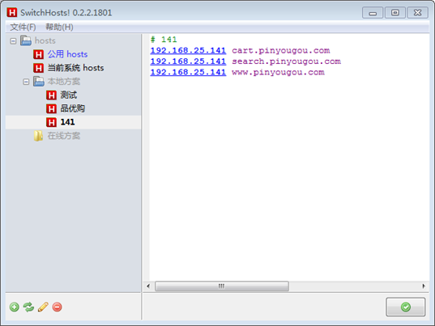

修改nginx配置文件

```
    server {
        listen       80;
        server_name  cart.pinyougou.com;
        location / {
            root   cart/;
            index  cart.html;
        }
    }
    server {
        listen       80;
        server_name  search.pinyougou.com;
        location / {
            root   search/;
            index  search.html;
        }
    }
```

重启Nginx，地址栏输入`http://cart.pinyougou.com/`、`http://search.pinyougou.com/`


### 22.2.5 Nginx反向代理与负载均衡


#### 1、反向代理

反向代理（Reverse Proxy）方式是指以[代理服务器](http://baike.baidu.com/item/%E4%BB%A3%E7%90%86%E6%9C%8D%E5%8A%A1%E5%99%A8)来**接受internet上的连接请求**，然后**将请求转发给内部网络上的服务器**，并将从服务器上得到的结果返回给internet上请求连接的客户端，此时代理服务器对外就表现为一个反向代理服务器。

**正**向代理是针对你的**客户端**，而**反**向代理是针对**服务器**的

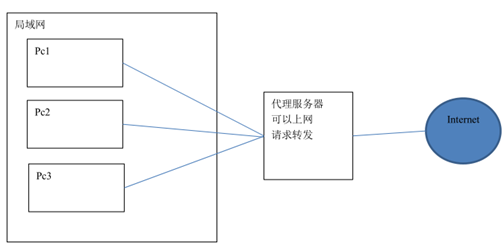

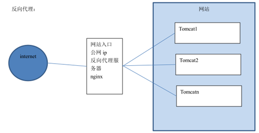

**配置反向代理**

（1） 将网站首页页面部署到Tomcat中（ROOT目录），上传到服务器。

（2）启动Tomcat，输入网址`http://192.168.25.141:8080`可以看到网站首页

（3）在Nginx主机修改 Nginx配置文件

```
    upstream tomcat-portal {
	   server 192.168.25.141:8080; //配置这里
    }
    server {
        listen       80;
        server_name  www.pinyougou.com;   
        location / {
            proxy_pass   http://tomcat-portal; //配置这里
            index  index.html;
        }
    }
```

（4）重新启动Nginx，然后用浏览器测试：`www.pinyougou.com`（此域名须配置域名指向）


#### 2、负载均衡

> web工程由Nginx做反向代理实现负载均衡
>
> service工程由zookeeper负责负载均衡

负载均衡建立在现有网络结构之上，它提供了一种廉价有效透明的方法扩展[网络设备](http://baike.baidu.com/item/%E7%BD%91%E7%BB%9C%E8%AE%BE%E5%A4%87)和[服务器](http://baike.baidu.com/item/%E6%9C%8D%E5%8A%A1%E5%99%A8)的带宽、增加[吞吐量](http://baike.baidu.com/item/%E5%90%9E%E5%90%90%E9%87%8F)、加强网络数据处理能力、提高网络的灵活性和可用性。

负载均衡，英文名称为Load Balance，其意思就是分摊到多个操作单元上进行执行，例如Web[服务器](http://baike.baidu.com/item/%E6%9C%8D%E5%8A%A1%E5%99%A8)、[FTP服务器](http://baike.baidu.com/item/FTP%E6%9C%8D%E5%8A%A1%E5%99%A8)、[企业](http://baike.baidu.com/item/%E4%BC%81%E4%B8%9A)关键应用服务器和其它关键任务服务器等，从而共同完成工作任务。


**配置负载均衡**

（1）将刚才放有首页工程的Tomcat复制两份，设置端口分别为8180 和8280。（最好根据规律修改三处）

（2）分别启动这两个Tomcat服务器的Tomcat服务。

（3）为了能够区分是访问哪个服务器的网站，可以在首页标题加上标记以便区分。

修改 Nginx配置文件

```
   upstream tomcat-portal {
	server 192.168.25.141:8080;
	server 192.168.25.141:8180 weight=2;
	server 192.168.25.141:8280;
    }
    server {
        listen       80;
        server_name  www.pinyougou.com;
 
        location / {
            proxy_pass   http://tomcat-portal;
            index  index.html;
        }       
       
    }
```

地址栏输入`http://www.pinyougou.com/`  刷新观察每个网页的标题，看是否不同

经过测试，三台服务器出现的概率各为33.3333333%，交替显示。

如果其中一台服务器性能比较好，想让其承担更多的压力，可以设置权重。

比如想让NO.1出现次数是其它服务器的2倍，则修改配置`weight`，经过测试，平均每刷新四次，有两次是8180


### 22.2.6 了解高可用

nginx 作为负载均衡器，所有请求都到了 nginx，可见 **nginx 处于非常重点的位置**，如果nginx 服务器宕机后端 web 服务将无法提供服务，影响严重。

为了屏蔽负载均衡服务器的宕机，需要建立一个**备份机**。主服务器和备份机上**都运行高可用（High Availability）监控程序**，通过**传送诸如“I am alive”这样的信息来监控对方的运行状况**。**当备份机不能在一定的时间内收到这样的信息时**，它就**接管主服务器的服务 IP 并继续提供负载均衡服务**；当备份管理器**又**从主管理器**收到**“I am alive”这样的信息时，它就**释放服务 IP** 地址，这样的**主服务器就开始再次提供负载均衡**服务。


**keepalived**

keepalived 是集群管理中保证集群高可用的一个服务软件，用来防止单点故障。Keepalived 的作用是检测 web 服务器的状态，如果有一台 web 服务器死机，或工作出现故障，Keepalived 将检测到，并将有故障的 web 服务器从系统中剔除，当 web 服务器工作正常后 Keepalived 自动将 web 服务器加入到服务器群中，这些工作全部自动完成，不需要人工干涉，需要人工做的只是修复故障的 web 服务器。

keepalived 是以 VRRP 协议为实现基础的，VRRP 全称 Virtual Router Redundancy Protocol，即虚拟路由冗余协议。虚拟路由冗余协议，可以认为是实现路由器高可用的协议，即将 N 台提供相同功能的路由器组成一个路由器组，这个组里面有一个 master 和多个 backup，master 上面有一个**对外提供服务**的 vip（**VIP = Virtual IPAddress，虚拟 IP 地址**，**该路由器所在局域网内其他机器的默认路由为该 vip**），master 会发组播，当 backup 收不到 VRRP 包时就认为 master 宕掉了，这时就需要根据 VRRP 的优先级来选举一个 backup 当 master。这样的话就可以保证路由器的高可用了。

keepalived 主要有三个模块，分别是 core、check 和 VRRP。core 模块为 keepalived 的核心，负责主进程的启动、维护以及全局配置文件的加载和解析。check 负责健康检查，包括常见的各种检查方式。VRRP 模块是来实现 VRRP 协议的。

初始状态：

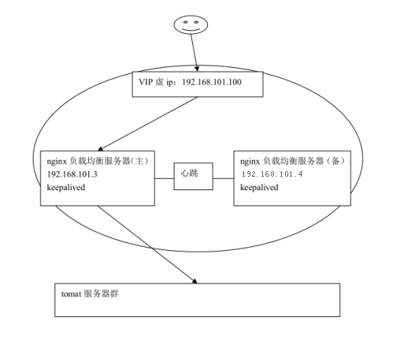

主机宕机：

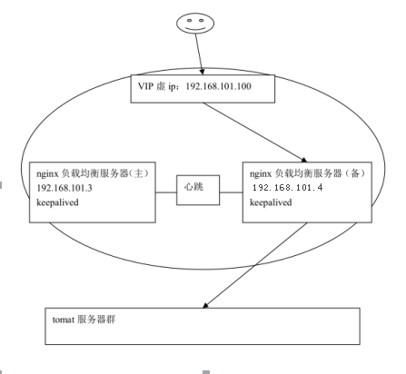

主机恢复：

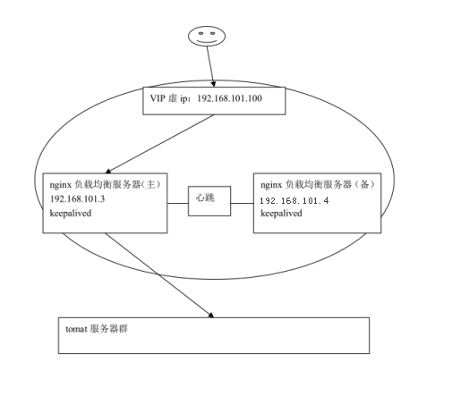

Keepalived的安装与配置详见配套的扩展文档


# 23 容器部署解决方案 Docker

## 23.1 Docker 简介

### 23.1.1 虚拟化

​	在计算机中，虚拟化（英语：Virtualization）是一种**资源管理技术**，是将计算机的各种实体资源，如服务器、网络、内存及存储等，予以抽象、转换后呈现出来，打破实体结构间的不可切割的障碍，使用户可以比原本的组态更好的方式来应用这些资源。这些资源的新虚拟部份是不受现有资源的架设方式，地域或物理组态所限制。一般所指的虚拟化资源包括计算能力和资料存储。在实际的生产环境中，虚拟化技术主要用来解决高性能的物理硬件产能过剩和老的旧的硬件产能过低的重组重用，透明化底层物理硬件，从而最大化的利用物理硬件   对资源充分利用

​	虚拟化技术种类很多，例如：软件虚拟化、硬件虚拟化、内存虚拟化、网络虚拟化(vip)、桌面虚拟化、服务虚拟化、虚拟机等等。

### 23.1.2 虚拟化种类

（1）全虚拟化架构

​	虚拟机的监视器（hypervisor）是类似于用户的应用程序运行在主机的OS之上，如VMware的workstation，这种虚拟化产品提供了虚拟的硬件。

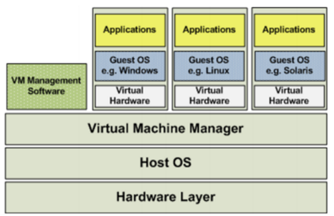

（2）OS层虚拟化架构

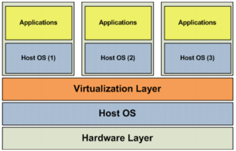

（3）硬件层虚拟化

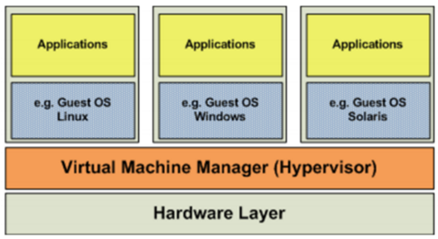

​	硬件层的虚拟化具有高性能和隔离性，因为hypervisor直接在硬件上运行，有利于控制VM的OS访问硬件资源，使用这种解决方案的产品有VMware ESXi 和 Xen server。

​	Hypervisor是一种运行在物理服务器和操作系统之间的中间软件层,可允许多个操作系统和应用共享一套基础物理硬件，因此也可以看作是虚拟环境中的“元”操作系统，它可以协调访问服务器上的所有物理设备和虚拟机，也叫虚拟机监视器（Virtual Machine Monitor，VMM）。

​	Hypervisor是所有虚拟化技术的核心。当服务器启动并执行Hypervisor时，它会给每一台虚拟机分配适量的内存、CPU、网络和磁盘，并加载所有虚拟机的客户操作系统。  宿主机

​	Hypervisor是所有虚拟化技术的核心，软硬件架构和管理更高效、更灵活，硬件的效能能够更好地发挥出来。常见的产品有：VMware、KVM、Xen等等。Openstack

------

### 23.1.3 什么是Docker

​	在计算机的世界中，容器拥有一段漫长且传奇的历史。容器与管理程序虚拟化（hypervisor virtualization，HV）有所不同，管理程序虚拟化通过中间层将一台或者多台独立的机器虚拟运行与物理硬件之上，而容器则是直接运行在操作系统内核之上的用户空间。因此，容器虚拟化也被称为“操作系统级虚拟化”，容器技术可以让多个独立的用户空间运行在同一台宿主机上。

​	由于“客居”于操作系统，容器只能运行与底层宿主机相同或者相似的操作系统，这看起来并不是非常灵活。例如：可以在Ubuntu服务中运行Redhat Enterprise Linux，但无法再Ubuntu服务器上运行Microsoft Windows。

​	容器被认为是精益技术，因为容器需要的开销有限。和传统虚拟化以及半虚拟化相比，容器不需要模拟层（emulation layer）和管理层（hypervisor layer），而是使用操作系统的系统调用接口。这降低了运行单个容器所需的开销，也使得宿主机中可以运行更多的容器。

### 23.1.4 容器与虚拟机比较

体积小、开启速度快、集成方便

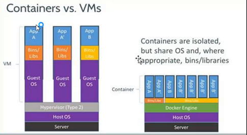


### 23.1.5 Docker特点

（1）上手快。

​	用户只需要几分钟，就可以把自己的程序“Docker化”。Docker依赖于“写时复制”（copy-on-write）模型，使修改应用程序也非常迅速，可以说达到“随心所致，代码即改”的境界。

​	随后，就可以创建容器来运行应用程序了。大多数Docker容器只需要不到1秒中即可启动。由于去除了管理程序的开销，Docker容器拥有很高的性能，同时同一台宿主机中也可以运行更多的容器，使用户尽可能的充分利用系统资源。

（2）职责的逻辑分类

​	使用Docker，开发人员只需要关心容器中运行的应用程序，而运维人员只需要关心如何管理容器。Docker设计的目的就是要加强开发人员写代码的开发环境与应用程序要部署的生产环境一致性。从而降低那种“开发时一切正常，肯定是运维的问题（测试环境都是正常的，上线后出了问题就归结为肯定是运维的问题）”

（3）快速高效的开发生命周期

​	Docker的目标之一就是缩短代码从开发、测试到部署、上线运行的周期，让你的应用程序具备可移植性，易于构建，并易于协作。（通俗一点说，Docker就像一个盒子，里面可以装很多物件，如果需要这些物件的可以直接将该大盒子拿走，而不需要从该盒子中一件件的取。）

（4）鼓励使用面向服务的架构

​	Docker还鼓励面向服务的体系结构和微服务架构。Docker推荐单个容器只运行一个应用程序或进程，这样就形成了一个分布式的应用程序模型，在这种模型下，应用程序或者服务都可以表示为一系列内部互联的容器，从而使分布式部署应用程序，扩展或调试应用程序都变得非常简单，同时也提高了程序的内省性。（当然，可以在一个容器中运行多个应用程序）


### 23.1.6 Docker组件

**Docker客户端和服务器**

​	Docker是一个**客户端-服务器（C/S）架构程序**。Docker客户端只需要向Docker服务器或者守护进程发出请求，服务器或者守护进程将完成所有工作并返回结果。Docker提供了一个命令行工具Docker以及一整套RESTful API。你可以在同一台宿主机上运行Docker守护进程和客户端，也可以从本地的Docker客户端连接到运行在另一台宿主机上的远程Docker守护进程。

**Docker镜像**

​	**镜像是构建Docker的基石**。用户**基于镜像来运行自己的容器**。镜像也是Docker生命周期中的“构建”部分。镜像是基于联合文件系统的一种层式结构，由一系列指令一步一步构建出来。也可以**将镜像当作容器的“源代码”**。镜像体积很小，非常“便携”，易于分享、存储和更新。

**Registry（注册中心）**

​	Docker用Registry来保存用户构建的镜像。Registry分为公共和私有两种。Docker公司运营公共的Registry叫做Docker Hub。用户可以在Docker Hub注册账号，分享并保存自己的镜像（说明：在Docker Hub下载镜像巨慢，可以自己构建私有的Registry）。

**Docker容器**

​	Docker可以帮助你构建和部署容器，你只需要把自己的应用程序或者服务打包放进容器即可。容器是基于镜像启动起来的，容器中可以运行一个或多个进程。我们可以认为，镜像是Docker生命周期中的构建或者打包阶段，而容器则是启动或者执行阶段。  容器基于镜像启动，一旦容器启动完成后，我们就可以登录到容器中安装自己需要的软件或者服务。

​	所以**Docker容器就是：一个镜像格式；一些列标准操作；一个执行环境**。

​	Docker借鉴了标准集装箱的概念。标准集装箱将货物运往世界各地，Docker将这个模型运用到自己的设计中，唯一不同的是：集装箱运输货物，而Docker运输软件。

​         和集装箱一样，Docker在执行上述操作时，并不关心容器中到底装了什么，它不管是web服务器，还是数据库，或者是应用程序服务器什么的。所有的容器都按照相同的方式将内容“装载”进去。

​         Docker也不关心你要把容器运到何方：我们可以在自己的笔记本中构建容器，上传到Registry，然后下载到一个物理的或者虚拟的服务器来测试，在把容器部署到具体的主机中。像标准集装箱一样，Docker容器方便替换，可以叠加，易于分发，并且尽量通用。

​         使用Docker，我们可以快速的构建一个应用程序服务器、一个消息总线、一套实用工具、一个持续集成（CI）测试环境或者任意一种应用程序、服务或工具。我们可以在本地构建一个完整的测试环境，也可以为生产或开发快速复制一套复杂的应用程序栈。


## 23.2 Docker安装与启动

**安装环境说明**

​	Docker官方建议在Ubuntu中安装，因为Docker是基于Ubuntu发布的，而且一般Docker出现的问题Ubuntu是最先更新或者打补丁的。我们学习的环境都使用的是CentOS，因此这里我们将Docker安装到CentOS上。注意：这里建议安装在CentOS7.x以上的版本。

**在VMware Workstation中安装CentOS7**

​	资料已经准备了安装好的镜像，直接挂载即可。

​	挂载后，使用ip addr命令查看本地IP

**安装Docker**

​	使用yum命令在线安装：`yum install docker`

**安装后查看Docker版本**

​	`docker -v`

**启动与停止Docker**

​	`systemctl`命令是系统服务管理器指令，它是`service`和`chkconfig`两个命令组合

​	l  启动docker：`systemctl start docker`

​	l  停止docker：`systemctl stop docker`

​	l  重启docker：`systemctl restart docker`

​	l  查看docker状态：`systemctl status docker`

​	l  开机启动：`systemctl enable docker`

​	l  查看docker概要信息：`docker info`

​	l  查看docker帮助文档：`docker --help`


## 23.3 Docker镜像操作

​	Docker镜像是由文件系统叠加而成（是一种文件的存储形式）。最底端是一个文件引导系统，即bootfs，这很像典型的Linux/Unix的引导文件系统。Docker用户几乎永远不会和引导系统有什么交互。实际上，当一个容器启动后，它将会被移动到内存中，而引导文件系统则会被卸载，以留出更多的内存供磁盘镜像使用。Docker容器启动是需要的一些文件，而这些文件就可以称为Docker镜像。

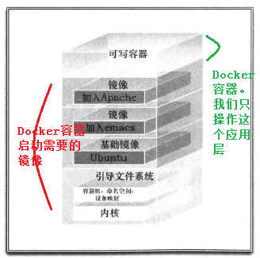

**列出镜像**

列出docker下的所有镜像：`docker images`

l  REPOSITORY：镜像所在的仓库名称

l  TAG：镜像标签

l  IMAGE ID：镜像ID

l  CREATED：镜像的创建日期（不是获取该镜像的日期）

l  SIZE：镜像大小

l  这些镜像都是存储在Docker宿主机的/var/lib/docker目录下

​	为了区分同一个仓库下的不同镜像，Docker提供了一种称为标签（Tag）的功能。每个镜像在列出来时都带有一个标签，例如12.10、12.04等等。每个标签对组成特定镜像的一些镜像层进行标记（比如，标签12.04就是对所有Ubuntu12.04镜像层的标记）。这种机制使得同一个仓库中可以存储多个镜像。--- 版本号

​         我们在运行同一个仓库中的不同镜像时，可以通过在仓库名后面加上一个冒号和标签名来指定该仓库中的某一具体的镜像，例如`docker run --name custom_container_name –i –t docker.io/ubunto:12.04 /bin/bash，表明从镜像Ubuntu:12.04启动一个容器，而这个镜像的操作系统就是Ubuntu:12.04。在构建容器时指定仓库的标签也是一个好习惯。

**搜索镜像**

从网络中查找需要的镜像：`docker search 镜像名称`

**拉取镜像**

* 从Docker Hub拉取

  国情的原因，国内下载 Docker HUB 官方的相关镜像比较慢，可以使用国内（docker.io）的一些镜像加速器，镜像保持和官方一致，关键是速度块，推荐使用。Mirror与Private Registry的区别：

  Private Registry（私有仓库）是开发者或者企业自建的镜像存储库，通常用来保存企业内部的 Docker 镜像，用于内部开发流程和产品的发布、版本控制。

  Mirror是一种代理中转服务，我们(比如daocloud)提供的Mirror服务，直接对接Docker Hub的官方Registry。Docker Hub 上有数以十万计的各类 Docker 镜像。

  在使用Private Registry时，需要在Docker Pull 或Dockerfile中直接键入Private Registry 的地址，通常这样会导致与 Private Registry 的绑定，缺乏灵活性。

  使用 Mirror 服务，只需要在 Docker 守护进程（Daemon）的配置文件中加入 Mirror 参数，即可在全局范围内透明的访问官方的 Docker Hub，避免了对 Dockerfile 镜像引用来源的修改。

  简单来说，Mirror类似CDN，本质是官方的cache；Private Registry类似私服，跟官方没什么关系。对用户来说，由于用户是要拖docker hub上的image，对应的是Mirror。yum/apt-get的Mirror又有点不一样，它其实是把官方的库文件整个拖到自己的服务器上做镜像，并定时与官方做同步；而Docker Mirror只会缓存曾经使用过的image。

  使用命令拉取：`docker pull centos:7`

  目前国内访问docker hub速度上有点尴尬，使用docker Mirror势在必行。现有国内提供docker镜像加速服务的商家有不少，下面重点ustc镜像

* ustc的镜像

  [ustc](https://lug.ustc.edu.cn/wiki/mirrors/help/docker)是老牌的linux镜像服务提供者了，还在遥远的ubuntu 5.04版本的时候就在用。ustc的docker镜像加速器速度很快。ustc docker mirror的优势之一就是不需要注册，是真正的公共服务。

  （1）编辑该文件：`vi /etc/docker/daemon.json`如果该文件不存在就手动创建；说明：在centos7.x下，通过vi。

  （2）在该文件中输入如下内容：

  ```json
  {
      "registry-mirrors": ["https://docker.mirrors.ustc.edu.cn"]
  }
  ```

  （3）注意：一定要重启docker服务，如果重启docker后无法加速，可以重新启动OS。然后通过docker pull命令下载镜像。

**删除镜像**

`docker rmi $IMAGE_ID`：删除指定镜像

docker rmi \`docker images\` -q：删除所有镜像


## 23.4 Docker容器操作

**查看容器**

* 查看正在运行容器：`docker ps   `
* 查看所有的容器（启动过的历史容器）：`docker ps –a`
* 查看最后一次运行的容器：`docker ps –l`
* 查看停止的容器：`docker ps -f status=exited`

------

**创建与启动容器**

创建容器命令：`docker run`

* `-i`：表示**运行容器**
* `-t`：表示容器启动后会进入其命令行。加入这两个参数后，容器创建就能登录进去。即分配一个伪终端。`-it`也行
* `-d`：在run后面加上-d参数,则会创建一个守护式容器在后台运行（这样创建容器后不会自动登录容器，如果只加-i -t两个参数，创建后就会自动进去容器）。
* `--name=名称` :为创建的容器命名。
* `-v`：表示目录映射关系（前者是宿主机目录，后者是映射到宿主机上的目录），可以使用多个－v做多个目录或文件映射。注意：最好做目录映射，在宿主机上做修改，然后共享到容器上。
* `-p`：表示端口映射，前者是宿主机端口，后者是容器内的映射端口。可以使用多个－p做多个端口映射

**交互式容器**

创建一个交互式容器并取名mycentos：`docker run -it --name=mycentos centos:7 /bin/bash`（centos:7为镜像id/tag）

这时我们通过ps命令查看，发现可以看到启动的容器，状态为启动状态

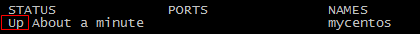

使用`exit`命令退出当前容器，然后用`ps -a`命令查看发现**该容器也随之Exited**

**守护式容器**

创建一个守护式容器：如果对于一个需要长期运行的容器来说，我们可以创建一个守护式容器。命令如下（容器名称不能重复）：

`docker run -id --name=mycentos2 centos:7`

登录守护式容器方式：`docker exec -it container_name`或`container_id` `/bin/bash`（**exit退出时，容器不会停止**）

------

**停止与启动容器**

停止正在运行的容器：`docker stop $CONTAINER_NAME/ID`

启动已运行过的容器：`docker start $CONTAINER_NAME/ID`

重新启动已运行过的容器：`docker restart $CONTAINER_NAME/ID`

------

**文件拷贝**

如果我们需要将宿主机的文件拷贝到容器内可以使用cp命令：`docker cp 需要拷贝的文件或目录 容器名称:容器目录`

也可以将文件从容器内拷贝出来：`docker cp 容器名称:容器目录 需要拷贝的文件或目录`。不允许容器之间拷贝，可以利用宿主机

------

**目录挂载**

我们可以在创建容器的时候，将宿主机的目录与容器内的目录进行映射，这样我们就可以通过修改宿主机某个目录的文件从而去影响容器。

创建容器 添加-v参数 后边为   宿主机目录:容器目录

`docker run -di -v /usr/local/myhtml:/usr/local/myhtml --name=mycentos2 centos:7`

> 如果你共享的是多级的目录，可能会出现权限不足的提示。这是因为CentOS7中的安全模块selinux把权限禁掉了，我们需要在创建容器时添加参数  --privileged=true  来解决挂载的目录没有权限的问题

------

**查看容器IP地址**

我们可以通过以下命令查看容器运行的各种数据：`docker inspect mycentos2`

也可以直接执行下面的命令直接输出IP地址：`docker inspect --format='{{.NetworkSettings.IPAddress}}' mycentos2`

------

**删除容器**

删除指定的容器：`docker rm $CONTAINER_ID/NAME`。注意，只能删除停止的容器

删除所有容器： docker rm  \`docker ps -a -q\`。注意，只能删除停止的容器


## 23.5 部署应用

### 23.5.1 MySQL部署

拉取MySQL镜像：`docker pull mysql`（查看镜像：`docker images`）

创建MySQL容器：`docker run -di --name pinyougou_mysql -p 33306:3306 -e MYSQL_ROOT_PASSWORD=123456 mysql`

> -p 代表端口映射，格式为  宿主机映射端口:容器运行端口
>
> -e 代表添加环境变量  MYSQL_ROOT_PASSWORD是root用户的登陆密码

查看容器IP地址：`docker inspect pinyougou_mysql`，数据库服务器的IP是`172.17.0.2`

进入MySQL容器，登陆MySQL：`docker exec -it pinyougou_mysql /bin/bash`；`mysql -u root -p`

远程登陆MySQL：

* 我们在我们本机的电脑上去连接虚拟机Centos中的Docker容器，这里192.168.247.130是虚拟机操作系统的IP，端口33306


### 23.5.2 Tomcat部署

拉取Tomcat镜像：`docker pull tomcat:7-jre7`

创建Tomcat容器，创建容器用于部署单点登录系统（CAS）  -p表示地址映射

`docker run -di --name=pinyougou_tomcat -p 9000:8080 -v /usr/local/myhtml:/usr/local/tomcat/webapps --privileged=true tomcat:7-jre7`

部署web应用：

* 修改cas系统的配置文件，**修改数据库连接的url（此处的IP为容器MySQL的IP）** 

  ```xml
  <bean id="dataSource" class="com.mchange.v2.c3p0.ComboPooledDataSource"
        p:driverClass="com.mysql.jdbc.Driver"
        p:jdbcUrl="jdbc:mysql://172.17.0.6:3306/pinyougoudb?characterEncoding=utf8"
        p:user="root"
        p:password="123456" />
  ```

  测试：地址栏输入`http://192.168.247.135:9000/cas/login`


### 23.5.3 Nginx部署

拉取Nginx镜像：`docker pull nginx`

创建Nginx容器：`docker run -di --name=pinyougou_nginx -p 80:80  nginx/`

测试Nginx：浏览器地址栏输入`http://192.168.247.135`

配置反向代理：

* 官方的nginx镜像，nginx配置文件nginx.conf 在镜像的`/etc/nginx/`目录下。在容器内编辑配置文件不方便，我们可以先将配置文件从容器内拷贝到宿主机，编辑修改后再拷贝回去。

* 从容器拷贝配置文件到宿主机：`docker cp pinyougou_nginx:/etc/nginx/nginx.conf nginx.conf `

* 编辑nginx.conf，添加反向代理配置

  ```conf
  upstream tomcat-cas {
  	server 172.17.0.7:8080;//查看Tomcat容器的IP，反向代理
  }
  server {
  	listen 80;
  	server_name passport.pinyougou.com;
  	location / {
  		proxy_pass http://tomcat-cas;
  		index index.html index.htm;
  	}
  }
  ```

* 将修改后的配置文件拷贝到容器：`docker cp nginx.conf pinyougou_nginx:/etc/nginx/nginx.conf`

* 重新启动容器：`docker restart pinyougou_nginx`

* 设置域名指向（利用软件或自己修改hosts）：`192.168.247.135 passport.pinyougou.com `

* 浏览器测试：`http://passport.pinyougou.com/cas/login`


### 23.5.4 Redis部署

拉取Redis镜像：`docker pull redis`

创建Redis容器：` docker run -di --name=pinyougou_redis -p 6379:6379 redis`

客户端测试：

* 在你的本地电脑命令提示符下，用window版本redis测试：`redis-cli -h 192.168.247.135`


## 23.6 备份与迁移

**容器保存为镜像**

`docker commit pinyougou_nginx mynginx`

pinyougou_nginx是容器名称；mynginx是新的镜像名称

此镜像的内容就是你当前容器的内容，接下来你可以用此镜像再次运行新的容器

**镜像备份**

`docker save -o mynginx.tar mynginx`

-o 输出到的文件。执行后，运行ls命令即可看到打成的tar包

**镜像恢复与迁移**

首先我们先删除掉mynginx镜像，然后执行此命令进行恢复

`docker load -i mynginx.tar`

-i 输入的文件。执行后再次查看镜像，可以看到镜像已经恢复