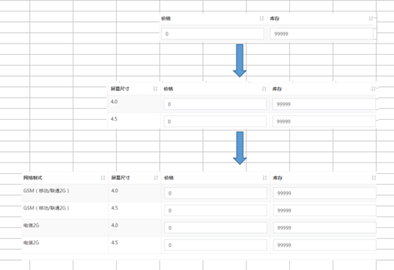

# 基于SSM和AngularJS的CRUD

CU都需要封装数据，前端为POST请求；RD则为GET请求。

## 1 Retrive

> [rɪ'triv]

前端

* 一般都是==**分页**==查找（但也有特殊，比如下拉列表），前端需要pagination组件，后端需要PageHelper组件

  ```js
  var app = angular.module("pinyougou", ['pagination']);//构建品优购app模块时引入pagination模块
  ```

  ```js
  app.service("brandService", function ($http) {
       //查询所有
      this.findAll = function () {
          return $http.get("../brand/findAll.do);
      };
      
      //带条件查询的分页请求
      this.findPage = function (pageNum, pageSize, searchEntity) {
          return $http.post("../brand/findPage.do?pageNum=" + pageNum + "&pageSize=" + pageSize, searchEntity);
      };
  });
  ```

  ```js
  app.controller("baseController",function ($scope) {
      //分页组件配置
      $scope.paginationConf = {
          currentPage: 1, //当前页码
          totalItems: 10, //总记录数
          itemsPerPage: 10, //每页显示记录数，有如下选项
          perPageOptions: [10, 20, 30, 40, 50],
          onChange: function () { //每次更改（更新）页面时触发事件
              $scope.reloadList();//更新列表
          }
      };
      //分页更新列表，为了简写
      $scope.reloadList = function () {
          $scope.findPage($scope.paginationConf.currentPage, $scope.paginationConf.itemsPerPage);
      };
  });    
  ```

  ```js
  app.controller("brandController", function ($controller,$scope, brandService) {
  
      //继承baseController
      $controller("baseController",{$scope:$scope});
      
      //查询所有
      $scope.findAll=function(){
          brandService.findAll().success(
              function(response){
                  $scope.list=data.list;//返回查找的数据
              }
          );
      }
  
      //条件查询并分页
      $scope.searchEntity = {};//需要先赋值，否则没有输入条件时为null前端会报错
      $scope.findPage = function (pageNum, pageSize) {
          brandService.findPage(pageNum, pageSize, $scope.searchEntity).success(
              function (data) {
                  $scope.list = data.list;//返回查找的数据
                  $scope.paginationConf.totalItems = data.total;//更新总记录数totalItems
                  //$scope.paginationConf.itemsPerPage=response.total;//若想展示所有数据，可以更新每页显示记录数
                  //但是若是需要查找所有还是自定义方法吧
              }
          )
      };
  });
  ```

  ```html
  <tm-pagination conf="paginationConf"></tm-pagination> <!--HTML中分页组件-->
  ```

* 若**后端传入的是JSON格式字符串**，但**AngularJS暂时未找到类似jQuery的`dataType`属性**，需要**利用`JSON.parse()`方法将JSON字符串转为JSON对象**，以便直接调用

* JSON转自定义字符串

  ```js
  //JSON转自定义字符串，key代表需要的json属性
  $scope.json2String = function (jsonString,key) {
      let json = JSON.parse(jsonString);
      let value = [];
      for (let i=0;i<json.length;i++){
          value.push(json[i][key]);
      }
      return value.join("，");
  }
  ```

* **==下拉列表select2==**：使用与AngularJS整合的，引入JS、CSS。需要的数据格式、前端代码如下。

  ```js
  $scope.brandList={data:[{id:1,text:'联想'},{id:2,text:'华为'},{id:3,text:'小米'}]};
  //使用时只需将后端获取的数据赋值给data属性即可
  //若出现a.toUpperCase is not a function问题，是由于select2要求的text属性值是字符串！！！
  ```

  ```html
  <input select2  select2-model="entity.brandIds" config="brandList" multiple placeholder="选择品牌（可多选）" class="form-control" type="text"/>	
  <!-- Config用于配置数据来源 -->
  <!-- select2-model用于指定用户选择后提交的变量，根据数据库的列名来决定名称。
  但是它会提交{id:1,text:'联想'}类型的，所以有时需根据需求来使用ng-model替代 -->
  ```

  使用时在body中利用`ng-init`调用controller层定义的方法即可

* ==**原生下拉列表配合AngularJS**==

  ```html
  <select ng-model="entity.goods.brandId" ng-options="item.id as item.text for item in entity.goods.brandId"></select> <!--item.id和item.text是根据后端传入的属性来确定的。展示的是item.text的内容-->
  ```

* ==**面包屑导航**==：每次更新页面时要设置**当前所处的面包屑等级**、根据等级来设置**每一级面包屑对象**、查找数据

  ```js
  //为区分面包屑等级设置的变量
  $scope.grade = 1;
  $scope.setGrade = function(number){
      $scope.grade = number;
  }
  
  //点击面包屑或查看下一级时触发的方法。
  //由于面包屑要展示name，并且还需要根据parentId查找数据，所以一起封装在entity实体中
  $scope.selectList = function (entity) {
      if ($scope.grade == 1){ //1级时2、3级entity都为null
          $scope.entity_2 = null;
          $scope.entity_3 = null;
      } else if ($scope.grade == 2){ //2级时2级entity有值，3级entity为null
          $scope.entity_2 = entity;
          $scope.entity_3 = null;
      } else if ($scope.grade == 3){ //3级时3级entity有值，其他不变
          $scope.entity_3 = entity;
      }
      $scope.findByParentId(entity.id); //查找数据list
  }
  
  $scope.findByParentId = function (parentId) {
      $scope.entity.parentId = parentId; //在新增商品分类时，还需要提交parentId，所以每次按按钮时设置好
      itemCatService.findByParentId(parentId).success(
          function (data) {
              $scope.list = data;
          }
      )
  }
  ```

  ```html
  <body ng-app="pinyougou" ng-controller="itemCatController" ng-init="findByParentId(0)">
      <!--面包屑-->
      <a href="#" ng-click="setGrade(1); selectList({id:0})" >顶级分类列表</a> <!--传入实体可以这样写-->
      <a href="#" ng-click="setGrade(2); selectList(entity_2)">{{entity_2.name}}</a>
      <a href="#" ng-click="setGrade(3); selectList(entity_3)">{{entity_3.name}}</a>
      ......
  
      <tr ng-repeat="entity in list">
          <td><input  type="checkbox" ></td>			                              
          <td>{{entity.id}}</td>
          <td>{{entity.name}}</td>
          <td>{{entity.typeId}}</td>		
          <!--ng-if指令的使用。首先是操作这边的，才有上面的面包屑导航-->
          <td><button ng-if="grade!=3" ng-click="setGrade(grade+1); selectList(entity)">查询下级</button></td>
      </tr>
  </body>
  ```

* ==**状态显示**==：从0或1或其他到详细文字描述。直接定义**数组**，根据**下标**来展示即可

  ```js
  $scope.status = ['未审核','已审核','审核未通过','已关闭'];
  ```

* ==**分类名称显示**==：比状态显示多查表操作，原理都是一样的

  ```js
  //查询商品分类名称
  $scope.itemCatName = [];
  $scope.findItemCatList = function () {
      itemCatService.findAll().success(function (data) {
          for (let i = 0; i < data.length; i++) {
              $scope.itemCatName[data[i].id] = data[i].name;
          }
      })
  }
  ```

* ==**条件查询**==：绑定数据后、`reloadList()`方法自动调用分页条件查询

  ```html
  状态：<select ng-model="searchEntity.auditStatus">
      <option value="">全部</option>      
      <option value="0">未审核</option>
      <option value="1">已审核</option>
      <option value="2">审核未通过</option>
      <option value="3">已关闭</option>                                     
  </select>
  商品名称：<input ng-model="searchEntity.goodsName">
  <button class="btn btn-default" ng-click="reloadList()">查询</button>
  ```

  

------

后端

* 返回PageInfo的JSON数据即可

* 下拉列表：由于**前端需要的数据类型为数组包含对象**，在后端使用新方法**将数据封装到`List<Map>`中**，SQL如下

  ```xml
  <select id="selectOptionList" resultType="java.util.Map">
      select id,name text from tb_brand
  </select>
  ```

* 面包屑导航：利用tb_item_cat表的`parent_id`（为0是最顶级），从而实现**三级商品**分类列表查询功能

* 若前端需要**显示的是登陆商家的商品**，所以需要使用SpringSecurity获取并设置其商家id

  ```java
  String sellerId = SecurityContextHolder.getContext().getAuthentication().getName();
  goods.setSellerId(sellerId);
  ```

  


## 2 Create

前端

- 根据封装的数据**是否有id**，来判断是**更新**或**添加**数据

  ```js
  this.add = function (entity) {
      return $http.post("../brand/add.do", entity);
  };
  ```

  ```js
  $scope.save = function () {
      let obj = null;
      if ($scope.entity.id != null) {
          obj = brandService.update($scope.entity);
      } else {
          obj = brandService.add($scope.entity);
      }
      obj.success(
          function (data) {
              if (data.success) {
                  $scope.reloadList();//成功后就更新列表
              } else {
                  alert(data.message);
              }
          }
      );
  };
  ```

* 需要**添加行**，可以**定义空数组**，每次使用`push()`**添加一个对象`{}`**，HTML使用`ng-repet`**遍历这个数组**即可。

  还需要在添加按钮时将specificationOptionList变量**清空**

  ```js
  $scope.addTableRow = function () {
      $scope.entity.specificationOptionList.push({});
  };
  ```

  需要**删除行**，对**数组调用`splice(index,num)`方法**，index由AngularJS中`ng-repet`中的**`$index`服务传递**过来

  

  

------

后端

* 返回Result实体类转换的JSON，其封装了Boolean、String

* 有时前端传递的数据是后端中多张表的结果，可以在后端定义**组合实体类**（前后端属性名称一致）来保存

* 若**插入或更新**操作后**获取插入或更新的数据的id**时，使用MySQL`LAST_INSERT_ID()`函数。

  插入或更新后**调用**被插入或更新**对象的`getId()`方法**即可获取到

  ```xml
  <selectKey keyProperty="id" resultType="java.lang.Long" order="AFTER" >
      SELECT LAST_INSERT_ID() AS id
  </selectKey>
  ```

* 有时需要在**保存时设置前端未传入的数据**，如商品的审核状态


## 3 Update

前端

* 只需要**回显数据**、更新的方法写在添加中（根据封装的数据**是否有id**，来判断是**更新**或**添加**数据）

  ```js
  $scope.findOne = function (id) {
      brandService.findOne(id).success(
          function (data) {
              $scope.entity = data;//利用双向绑定特性，直接可绑定所有
          }
      )
  };
  ```

  

------

后端

* 返回Result实体类转换的JSON，其封装了Boolean、String
* 例如：**若不清楚前端是添加、修改、删除**规格选择，**后端采取==先删除所有，再保存提交的数据==**策略
* 修改商品时需要**判断数据库中该商品是否是登陆商家的**


## 4 Delete

* 前端

  只提供了根据**复选框多选列表的值来删除**，多选列表定义在baseController

  * JS中Array的**`push()`和`splice()`方法**
  * AngularJS中`$event`服务。标签对象获取`$event.target`，利用其**`checked`属性更新数组**

  ```js
  $scope.ids = [];
  $scope.updateSelection = function ($event, id) {
      if ($event.target.checked) {
          $scope.ids.push(id);
      } else {
          let index = $scope.ids.indexOf(id);
          $scope.ids.splice(index, 1);
      }
  };
  ```

  ```js
  $scope.delete = function () {
      if (confirm("确认删除？")) {
          brandService.delete($scope.ids).success(
              function (data) {
                  if (data.success) {
                      $scope.reloadList();//刷新列表
                      $scope.selectIds=[];//清除多选框
                  } else {
                      alert(data.message);
                  }
              }
          );
      }
  };
  ```

  

------

后端

* 返回Result实体类转换的JSON，其封装了Boolean、String

* 根据传入的数组，遍历并删除即可

* 有时删除需要**逻辑删除**，不是物理删除，可以修改其中字段值即可。且有可能需要在查询时过滤掉

  ```java
  criteria.andIsDeleteIsNull();//指定条件为未删除，删除的都变为1了
  ```

  


## 5 SpringSecurity

spring-security.xml

```xml
<?xml version="1.0" encoding="UTF-8"?>
<!--采用如下约束配置可以在配置时不加security前缀，但在配置bean时需要加beans前缀。主要方便springsecurity配置
 采用此约束文件，没有前缀的都是springsecurity自身的配置-->
<beans:beans xmlns="http://www.springframework.org/schema/security" 
             xmlns:beans="http://www.springframework.org/schema/beans" 
             xmlns:xsi="http://www.w3.org/2001/XMLSchema-instance"
             xsi:schemaLocation="http://www.springframework.org/schema/beans
                                 http://www.springframework.org/schema/beans/spring-beans.xsd
                                 http://www.springframework.org/schema/security
                                 http://www.springframework.org/schema/security/spring-security.xsd">

    <!-- 配置不拦截的资源（静态资源及登录相关），不登录也可以访问。否则可能会有重定向次数过多错误  -->
    <http pattern="/*.html" security="none"/> <!--webapp一级目录下的html文件（包括login.html及login_error等）-->
    <http pattern="/css/**" security="none"/>
    <http pattern="/js/**" security="none"/>
    <http pattern="/img/**" security="none"/>
    <http pattern="/plugins/**" security="none"/>
    <http pattern="/seller/add.do" security="none"/> <!--注册相关的也必须放行-->


    <!--http标签主要用于配置拦截的具体的规则
     auto-config="true"	不用自己编写登录的页面，框架提供默认登录页面，不配置默认为true
     use-expressions="true"	是否启用SPEL表达式，不配置默认为true（功能强大，可以限制ip等，没学习过）-->
    <http auto-config="true" use-expressions="true">
        <!-- 具体的拦截规则 pattern="表示拦截页面"，与web.xml中不同。此处为目录规则，/**代表目录及其子目录
                           access="访问系统的角色名称（以ROLE_开头），当前用户必须有ROLE_ADMIN或...的角色" -->
        <intercept-url pattern="/**" access="hasAnyRole('ROLE_ADMIN','ROLE_USER')"/> <!--SPEL表达式-->
        <!-- 开启表单登陆功能，定义跳转的具体的页面 
    login-page="/login.html"  //必须以斜杠开头
    default-target-url="/index.html"  //指定了成功进行身份认证和授权后默认呈现给用户的页面 
    always-use-default-target="true"  //无论请求哪个页面登陆成功后都跳转至index而不是请求的那个页面
    authentication-failure-url="/login.html"  //指定了身份认证失败时跳转到的页面-->
        <form-login login-page="/login.html"  default-target-url="/index.html" always-use-default-target="true"  authentication-failure-url="/login.html"  />

        <!-- 注销登陆的配置
   logout-url：登出处理url，不配置默认为/logout
   logout-successurl：登出成功页面，默认不配置则跳转登陆页面
   invalidate-session 是否删除session，不配置默认为true -->
        <logout invalidate-session="true" logout-url="/logout" logout-success-url="/login.html"/>

        <!-- 关闭csrf（Cross-site request forgery）跨站请求伪造 ,如果不加会出现403错误。也被称为“One Click Attack”或者Session Riding，通常缩写为CSRF或者XSRF，是一种对网站的恶意利用。HTML不能使用，JSP可以带指定头信息使用-->
        <csrf disabled="true"/>

        <!--不拦截内置框架页，否则即使登陆成功也会拦截内置框架页-->
        <headers>
            <frame-options policy="SAMEORIGIN"/>
        </headers>
    </http>


    <!-- 认证管理器，指定了认证需要访问的service 。使用成数据库中的用户名和密码。-->
    <authentication-manager>
        <authentication-provider user-service-ref="userService">
            <!-- 配置加密的方式（会自动解密）。若配置此项，则需要指定密码加密方式，否则使用{noop}拼接上密码-->
            <password-encoder ref="passwordEncoder"/> 
        </authentication-provider>
    </authentication-manager>
    <!-- 配置加密类 -->
    <beans:bean id="passwordEncoder" class="org.springframework.security.crypto.bcrypt.BCryptPasswordEncoder"/>


    <!--==========================================================================================-->
    <!--【注意】由于pinyougou-shop-web消费者中UserDetailsServiceImpl是普通类，不能自动注入Dao接口。需要借助Dubbox的Service来间接调用，并且Service也不能直接注入，需要通过dubbox使用接口来注入Service实现类-->
    <!-- 引用dubbox 服务 -->
    <dubbo:application name="pinyougou-shop-web" />
    <dubbo:registry address="zookeeper://192.168.25.129:2181"/>
    <!--通过dubbox使用接口来注入实现类-->
    <dubbo:reference id="sellerService" interface="com.pinyougou.sellergoods.service.SellerService"/>

    <!--认证类-->
    <beans:bean id="userDetailsService" class="com.pinyougou.service.UserDetailsServiceImpl">
        <beans:property name="sellerService" ref="sellerService"/>
    </beans:bean>	
    <!--==========================================================================================-->


    <!-- 入门方式，在内存中存入用户名、密码、角色（若使用明文密码，不配置加密方式，则不用添加{noop}）
    <authentication-manager>
     <authentication-provider>
      <user-service>
       <user name="admin" password="{noop}admin" authorities="ROLE_ADMIN"/>  
       <user name="zhangsan" password="{noop}zhangsan" authorities="ROLE_ADMIN"/>
      </user-service>
     </authentication-provider>
    </authentication-manager>
    -->
</beans:beans>
```

```java
@Service//不使用Dubbox是可以这样写，但使用后这个类可能在web中只是个普通类，就只能xml配置
public class UserDetailsServiceImpl implements UserDetailsService {

    @Autowired//同上，不使用Dubbox是可以这样写，但使用后就只能xml配置。并且需要提供set方法
    private SellerService sellerService;
    public void setSellerService(SellerService sellerService) {
        this.sellerService = sellerService;
    }

    @Override
    public UserDetails loadUserByUsername(String username) throws UsernameNotFoundException {

        TbSeller seller = sellerService.findOne(username);//查找数据库中的数据对象
        System.out.println(username+"==="+seller.getPassword()+"==="+seller.getStatus());
        if (seller != null) {
            boolean enabled = seller.getStatus().equals("1"); //账户是否可以使用
            //角色信息本应该和数据库中User对象一起查询出来，然后遍历并添加到如下authorities集合中
            List<GrantedAuthority> authorities = new ArrayList<>();
            authorities.add(new SimpleGrantedAuthority("ROLE_SELLER"));
            //返回UserDetails的实现类User（都是SpringSecurity提供的）
            return new User(username, seller.getPassword(), enabled, true, true, true, authorities);
        } else {
            return null;
        }
    }
}
```

```java
//通过此方法可以获取当前通过SpringSecurity登录的用户名
String name = SecurityContextHolder.getContext().getAuthentication().getName();
```

```java
//BCrype密码加密。解密会根据SpringSecurity配置文件自动解密对比
//......
BCryptPasswordEncoder encoder = new BCryptPasswordEncoder();
String encode = encoder.encode(seller.getPassword());
seller.setPassword(encode);
//......
```


## 6 商品录入

> 就是Create。只是涉及三张表

### 5.1 基本功能

* 录入商品时需要录入商家id，由于数据库中id即时用户名，可以利用如下方法获取并设置

  ```java
  String sellerId = SecurityContextHolder.getContext().getAuthentication().getName();
  ```

### 5.2 富文本商品介绍

* 引入CSS、JS。在JS中渲染HTML中的textarea

  ```js
  var editor;
  KindEditor.ready(function(K) {
      editor = K.create('textarea[name="content"]', {
          allowFileManager : true
      });
  });
  ```

  ```html
  <textarea name="content" style="width:800px;height:400px;visibility:hidden;" ></textarea>
  <!--name="content"必须是这个值-->
  ```

  ```js
  //绑定富文本编辑器的内容。也可以使用editor.html("")来清空其内容
  $scope.entity.goodsDesc.introduction = editor.html();
  ```

  

### 5.3 图片上传

> FastDFS分布式文件服务器

前端

* service层：AngularJS的文件上传

  ```js
  app.service("uploadService", function ($http) {
      //上传文件
      this.uploadFile = function () {
          var formData = new FormData();//HTML5新增的类，对文件的封装，用于文件上传
          formData.append('file', file.files[0]);//第二个参数中file：文件上传框的id或name的值
          return $http({
              url: '../upload.do',
              method: 'post',
              data: formData,
              //anjularjs对于post和get请求默认的Content-Type header 是application/json。如下设置后浏览器会帮我们把Content-Type 设置为 multipart/form-data
              headers: {'Content-Type': undefined}, 
              //anjularjs transformRequest function 将序列化我们的formdata object
              transformRequest: angular.identity
          })
      }
  });
  ```

* controller层：

  ```js
  $scope.uploadFile = function () {
      uploadService.uploadFile().success(function (data) {
          if (data.success) {
              $scope.image_entity.url = data.message; //绑定url，用于预览和保存时提交的数据
          } else {
              alert(data.message);
          }
      }).error(function () {
          alert("上传发生错误");
      })
  }
  ```

  ```html
  <input ng-model="image_entity.color" class="form-control" placeholder="颜色" >
  
  <input type="file" id="file" />
  <button class="btn btn-primary" type="button" ng-click="uploadFile()">上传</button>	
  <!--上传后直接显示-->
  ```

  此时只是在弹出的上传图片对话框中，上传了图片到FastDFS服务器，并显示出。但并没有将数据保存到数据库

* **图片列表**：上传图片对话框中点击保存后，显示图片记录。只是展示了上传的图片列表，并没有将数据保存到数据库

  ```html
  <button class="btn btn-success"  data-dismiss="modal" aria-hidden="true" ng-click="add_image_entity()">保存</button>
  ```

  ```js
  $scope.entity = {goods: {}, goodsDesc: {itemImages: []}}; //封装所有要上传的数据（暂时设计两张表）
  
  //上传图片对话框点击保存后--图片展示列表
  $scope.add_image_entity = function () {
      $scope.entity.goodsDesc.itemImages.push($scope.image_entity);
  };
  //图片展示列表中删除图片时
  $scope.remove_image_entity = function (index) {
      $scope.entity.goodsDesc.itemImages.splice(index,1);
  }
  ```

  遍历展示即可

  ```html
  <tr ng-repeat="x in entity.goodsDesc.itemImages">
      <td>{{x.color}}</td>
      <td></td>
      <td> <button type="button"  ng-click="remove_image_entity($index)" title="删除" >删除</button></td>
  </tr>
  ```

  

------

后端

* 需要配置multipartResolver

* Controller层代码编写（调用封装好的工具类）

  ```java
  @RestController
  public class UploadController {
  
      @Value("${FILE_SERVER_URL}")
      private String file_server_url;
  
      @RequestMapping("/upload")
      public Result upload(MultipartFile file){
          String originalFilename = file.getOriginalFilename(); //获取文件名
          String extName = originalFilename.substring(originalFilename.lastIndexOf(".") + 1);//获取扩展名
          try {
              FastDFSClient fastDFSClient = new FastDFSClient("classpath:config/fdfs_client.conf");
              String fileId = fastDFSClient.uploadFile(file.getBytes(), extName);
              String url = file_server_url+fileId;//图片的完整url
              return new Result(true,url);
          } catch (Exception e) {
              e.printStackTrace();
              return new Result(false,"上传失败");
          }
      }
  }
  ```


### 5.4 选择商品分类

类似省市联动，但使用AngularJS更简单。利用其`$watch`服务监控，利用`ng-options`来遍历生成option标签

```js
//itemCatService.findByParentId()查找的是tb_item_cat表，返回id、parentId、name、typeId
//查询一级商品分类列表。在body中直接使用ng-init调用该方法，首先展示一级分类
$scope.selectItemCat1List = function () {
    itemCatService.findByParentId(0).success(function (data) {
        $scope.itemCat1List = data; //一级商品分类列表
    })
};

//查询二级商品分类列表
//利用AngularJS的变量监控方法（不同于JS、jQuery的事件驱动）。newValue为改变后的值，oldValue为改变前的值
$scope.$watch("entity.goods.category1Id", function (newValue, oldValue) {
    itemCatService.findByParentId(newValue).success(function (data) {
        $scope.itemCat2List = data; //二级商品分类列表
    })

});

//查询三级商品分类列表。同上
$scope.$watch("entity.goods.category2Id", function (newValue, oldValue) {
    itemCatService.findByParentId(newValue).success(function (data) {
        $scope.itemCat3List = data; //三级商品分类列表
    })
});

//查询模板ID。同上
$scope.$watch("entity.goods.category3Id", function (newValue, oldValue) {
    itemCatService.findOne(newValue).success(function (data) {
        $scope.entity.goods.typeTemplateId = data.typeId;

    })
});
```

```html
<td>
    <select ng-model="entity.goods.category1Id" ng-options="item.id as item.name for item in itemCat1List">	
    </select> <!--其中id和name是根据后端出入数据的属性来决定的-->
</td>
<td>
    <select ng-model="entity.goods.category2Id" ng-options="item.id as item.name for item in itemCat2List">	
    </select>
</td>
<td>
    <select ng-model="entity.goods.category3Id" ng-options="item.id as item.name for item in itemCat3List">
    </select>
</td>

<td><span ng-if="entity.goods.typeTemplateId!=null">模板ID：{{entity.goods.typeTemplateId}}</span></td>
```


### 5.5 品牌下拉列表及扩展属性

参照Retrive，需要findAll


### 5.6 规格选项

后端

* 封装JSON字符串格式的**规格**和**规格选项**为List集合

  ```java
  @Override
  public List<Map> findSpecList(Long id) {
      //从tb_type_template表中查spec_ids字段的JSON内容
      TbTypeTemplate typeTemplate = typeTemplateMapper.selectByPrimaryKey(id);
      //将[{"id":27,"text":"网络"},{"id":32,"text":"机身内存"}]字符串转为集合
      List<Map> list = JSON.parseArray(typeTemplate.getSpecIds(), Map.class);
      for (Map map : list) {
          //从tb_specification_option表中根据spec_id字段查找List集合，封装到Map中options
          TbSpecificationOptionExample example = new TbSpecificationOptionExample();
          TbSpecificationOptionExample.Criteria criteria = example.createCriteria();
          criteria.andSpecIdEqualTo(new Long((Integer) map.get("id")));//包装类型间转换需要new对象
          List<TbSpecificationOption> specificationOptions = specificationOptionMapper.selectByExample(example);
          map.put("options",specificationOptions);
      }
      //返回的是这个类型数据[ {"id":27,"text":"网络",options:[{},{}]} ]
      return list;
  }
  ```

------

前端

* 规格选项查找是在**商品分类选择完成**，所以还是**放在监控模板id**变换的方法内

  ```js
  //查询商品下拉列表；扩展属性；规格列表。监控模板ID。从tb_type_template表中查询
  $scope.$watch("entity.goods.typeTemplateId", function (newValue, oldValue) {
  
      typeTemplateService.findOne(newValue).success(function (data) {
          
          $scope.entity.goods.brandIds = JSON.parse(data.brandIds);//品牌列表类型转换
  
          $scope.entity.goodsDesc.customAttributeItems = JSON.parse(data.customAttributeItems);//扩展属性
      });
      
      //规格及选项
      typeTemplateService.findSpecList(newValue).success(function (data) {
          $scope.specList = data;
      });
  });
  ```

  ```html
  <div ng-repeat="x in specList">
      <div class="col-md-2 title">{{x.text}}</div>
      <div class="col-md-10 data">
          <span ng-repeat="y in x.options">
              <input ng-click="updateSpecAttribute($event,x.text,y.optionName)" type="checkbox" >{{y.optionName}}
          </span>
      </div>
  </div>
  ```

* **保存规格**：格式为`[{"attributeName":"网络制式","attributeValue":["移动3G","移动4G"]}]`

  当点击CheckBox时有两种情况：1、该attributeName不存在，直接添加；2、该attributeName存在，返回该对象。由于这个方法比较通用，所以封装在`baseController.js`中

  ```js
  //例如[{"attributeName":"网络制式","attributeValue":["移动3G","移动4G"]}]
  //array集合，key为每个对象中的属性（如attributeName），value为所需要的值（如网络制式）
  $scope.searchObjectByKey = function (array,key,value) {
      for (let i=0;i<array.length;i++){
          if ( array[i][key] == value ){
              return array[i]; //返回该对象
          }
      }
      return null;
  }
  ```

  ```js
  //定义变量，否则不能使用.调用，空指针异常
  $scope.entity = {goods: {}, goodsDesc: {itemImages: [], specificationItems: []}}; //封装所有要提交的数据
  
  //例如[{"attributeName":"网络制式","attributeValue":["移动3G","移动4G"]}]
  $scope.updateSpecAttribute = function ($event,name,value) {
      //判断是否已存在该属性
      var object = $scope.searchObjectByKey($scope.entity.goodsDesc.specificationItems,'attributeName',name)
      //不存在，直接添加属性名、属性值
      if (object == null){
          $scope.entity.goodsDesc.specificationItems.push({"attributeName":name,"attributeValue":[value]})
      } else {
          //存在并且勾选，则添加
          if ($event.target.checked){
              object.attributeValue.push(value);
          } else {
              //存在但取消勾选，则删除该记录
              object.attributeValue.splice(object.attributeValue.indexOf(value),1);
              
              /**若该属性值为空，则删除该属性（这句话可以不加）
              if (object.attributeValue.length==0){
                  $scope.entity.goodsDesc.specificationItems.splice($scope.entity.goodsDesc.specificationItems.indexOf(object),1);
              } **/
          }
      }
  }
  ```

  HTML绑定数据看上面的代码即可

  

  

### 5.7 SKU商品信息

规格选择后，类似笛卡尔积，提交数据到`tb_item`表。由于表格是动态变化的，要用到前端深克隆``var b = JSON.parse(JSON.stringify(a))``

* 在每次**点击**上面的**CheckBox时**调用此方法

  

  ```js
  $scope.createItemList = function () {
      //后端pojo中Goods组合实体类中第三个属性itemList
      $scope.entity.itemList = [{spec:{},price:0,num:99999,status:'0',isDefault:'0'}];//列表初始化
  
      //例如[ {"attributeName":"网络制式","attributeValue":["移动3G","移动4G"]} ]
      var items = $scope.entity.goodsDesc.specificationItems;//用户选择的规格集合
      for (let i = 0; i < items.length; i++) {
          $scope.entity.itemList = addColumn($scope.entity.itemList,items[i].attributeName,items[i].attributeValue);
      }
  };
  
  //在外部定义方法，可以不添加$scope，但不能在页面调用
  addColumn = function (list, columnName, columnValues) {
      var newList = [];
      for (let i = 0; i < list.length; i++) { //循环传入的list
          var oldRow = list[i];
  
          for (let j = 0; j < columnValues.length; j++) { //循环columnValues
              var newRow = JSON.parse(JSON.stringify(oldRow)); //深克隆
              newRow.spec[columnName] = columnValues[j];
              newList.push(newRow);
          }
      }
      return newList;
  }
  ```

  HTML中遍历

  ```html
  <tr>
      <th  ng-repeat="x in entity.goodsDesc.specificationItems" class="sorting">{{x.attributeName}}</th>
      <th class="sorting">价格</th>
      <th class="sorting">库存</th>
      <th class="sorting">是否启用</th>
      <th class="sorting">是否默认</th>
  </tr>
  
  <tr ng-repeat="x in entity.itemList">
      <td ng-repeat="y in entity.goodsDesc.specificationItems">{{x.spec[y.attributeName]}}</td>
      <td><input ng-model="x.price" class="form-control"  placeholder="价格"></td>
      <td><input ng-model="x.num" class="form-control" placeholder="库存数量"></td>
      <td><input ng-model="x.status" ng-true-value="1" ng-false-value="0" type="checkbox" ></td>
      <td><input ng-model="x.isDefault" ng-true-value="1" ng-false-value="0" type="checkbox" ></td>
  </tr>
  ```

* **是否启用规格**：**CheckBox中`ng-true-value`和`ng-false-value`的使用**

  ```html
  <input type="checkbox" ng-model="entity.goods.isEnableSpec" ng-true-value="1" ng-false-value="0">
  
  <!--显示、隐藏-->
  <div ng-if="entity.goods.isEnableSpec==1"></div>
  ```

* `GoodsServiceImpl`

  ```java
  @Override
  public void add(Goods goods) {
      //对象前端的数据进行封装，并设置需要的其他属性
      goods.getGoods().setAuditStatus("0"); //新增加的商品状态为未审核
      goodsMapper.insert(goods.getGoods()); //插入商品基本信息
  
      goods.getGoodsDesc().setGoodsId(goods.getGoods().getId()); //将商品基本表的id给扩展表
      goodsDescMapper.insert(goods.getGoodsDesc()); //插入商品扩展信息
  
      saveItemList(goods);//插入SKU列表数据（需要判断）
  }
  
  private void saveItemList(Goods goods){
      if ("1".equals(goods.getGoods().getIsEnableSpec())) { //启用规格
  
          for (TbItem item : goods.getItemList()) {
              //构建标题：SPU名称+规格选项值
              String title = goods.getGoods().getGoodsName();
              Map<String, Object> map = JSON.parseObject(item.getSpec());
              Set<Map.Entry<String, Object>> entries = map.entrySet();
              for (Map.Entry<String, Object> entry : entries) {
                  title += " " + entry.getKey();
              }
              item.setTitle(title);
              setItemValues(item, goods); //设置其他属性
  
              itemMapper.insert(item);
          }
      } else { //没有启用规格
          TbItem item = new TbItem();
          item.setTitle(goods.getGoods().getGoodsName());//标题
          item.setPrice(goods.getGoods().getPrice());//价格
          item.setNum(99999);//库存
          item.setStatus("1");//状态
          item.setIsDefault("1");//是否为默认
          setItemValues(item, goods);//设置其他属性
          item.setSpec("{}");//设置规格为{}，以便数据库中显示不是null
          
          itemMapper.insert(item);
      }
  }
  
  private void setItemValues(TbItem item, Goods goods) {
      item.setCategoryid(goods.getGoods().getCategory3Id());//商品的分类（三级）
      item.setCreateTime(new Date());//创建日期
      item.setUpdateTime(new Date());//更改日期
      item.setGoodsId(goods.getGoods().getId());//商品id
      item.setSellerId(goods.getGoods().getSellerId());//商家id
  
      TbItemCat tbItemCat = itemCatMapper.selectByPrimaryKey(goods.getGoods().getCategory3Id());
      item.setCategory(tbItemCat.getName());//分类名称（为搜索）
  
      TbBrand tbBrand = brandMapper.selectByPrimaryKey(goods.getGoods().getBrandId());
      item.setBrand(tbBrand.getName());//品牌名称（为搜索）
  
      TbSeller tbSeller = sellerMapper.selectByPrimaryKey(goods.getGoods().getSellerId());
      item.setSeller(tbSeller.getName());//商家店铺名称（为搜索）
  
      List<Map> imageList = JSON.parseArray(goods.getGoodsDesc().getItemImages(), Map.class);
      if (imageList.size() > 0) {
          item.setImage((String) imageList.get(0).get("url"));//第一个图片URl
      }
  }
  ```

  

### 5.8 商品修改

==**静态页面之间传参**==需要引入**`$location`**服务，利用其**`search()`**方法返回所有参数的数组，并且URL中`?`前需添加`#`

由于和商品录入使用同一页面，不需要再编写，只需修改**回显**数据的方法

```js
//查询实体
$scope.findOne = function () {
    let id = $location.search()['id'];
    if (id==null)
        return;
    goodsService.findOne(id).success(
        function (response) {
            $scope.entity = response; //基本信息
            editor.html($scope.entity.goodsDesc.introduction);//富文本编辑器内容
            $scope.entity.goodsDesc.itemImages = JSON.parse($scope.entity.goodsDesc.itemImages);//图片列表
            $scope.entity.goodsDesc.customAttributeItems = JSON.parse($scope.entity.goodsDesc.customAttributeItems)//扩展属性（需要修改监控模板id变化时执行的findOne方法）
        }
    );
}
```

==**读取商品规格属性**==使用**AngularJS的指令`ng-checked`**，根据方法返回值true/false来决定CheckBox的勾选与否

```js
//判断规格与规格选项是否应该被勾选
$scope.checkAttributeValue = function (specName, optionName) {
    let items = $scope.entity.goodsDesc.specificationItems;
    let object = $scope.searchObjectByKey(items, 'attributeName', specName); //利用封装的方法查是否有该属性
    if (object != null) {
        if (object.attributeValue.indexOf(optionName) >= 0) { //能查到规格选项
            return true;
        } else {
            return false;
        }
    } else {
        return false;
    }
}
```


