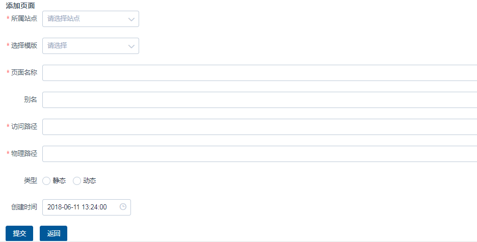
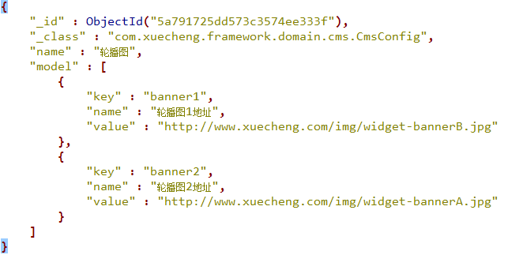
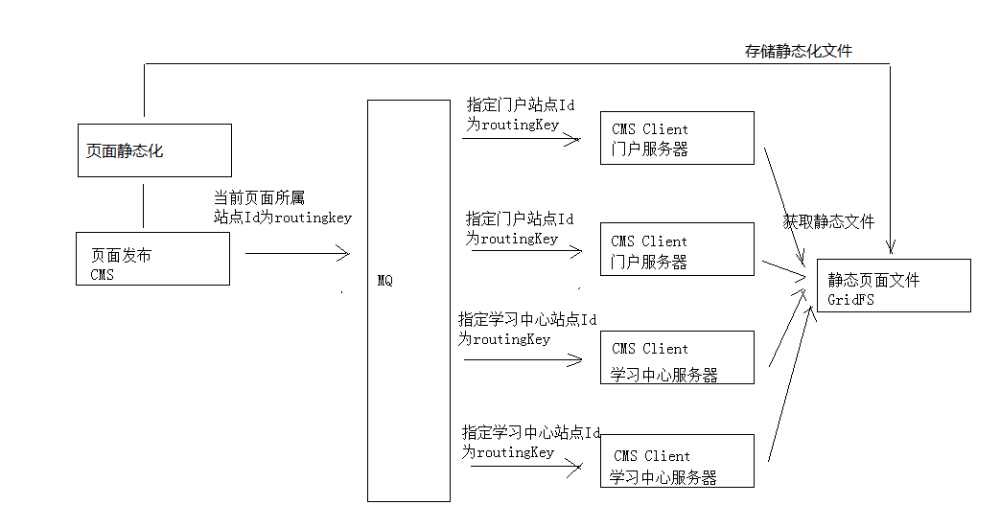

# 1 CMS 页面管理

CMS管理，对cms_page的增删改查。并且每个cms_page都有其特有的数据，通过**dataUrl**可以找到

每个**cms_page**都有所属的**cms_template**（根据模板和dataUrl静态化成页面）和所属的**cms_site**（如首页，轮播图，详细信息）




"dataUrl" : "http://localhost:31001/cms/config/getmodel/5a791725dd573c3574ee333f"


# 2 页面静态化


页面静态化需要：

* 数据：利用OkHttpClient封装的**RestTemplate**请求**cms_page的dataUrl**获取**cms_config中数据**，如下：
* 模板：利用FreeMaker的**ftl**和上述获取的数据组合




模板的增删改模块没有实现，采用手动方式😄，其信息存储在**cms_template**中，**模板文件**存储在**GridFS**文件系统中

```json
{
    "_id" : ObjectId("5a962b52b00ffc514038faf7"),
    "_class" : "com.xuecheng.framework.domain.cms.CmsTemplate",
    "siteId" : "5a751fab6abb5044e0d19ea1",
    "templateName" : "首页",
    "templateParameter" : "",
    "templateFileId" : "5a962b52b00ffc514038faf5"
}
```

**templateFileId**就是存储在**GridFS**中的**模板文件ID**




1、如果发布到服务器的页面内容不正确怎么办？

2、一个页面需要发布很多服务器，点击“发布”后如何知道详细的发布结果？

3、一个页面发布到多个服务器，其中有一个服务器发布失败时怎么办？

